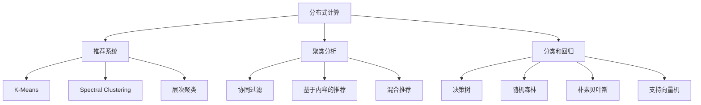

                 

# Mahout原理与代码实例讲解

> 关键词：

## 1. 背景介绍

### 1.1 问题由来
Mahout是一个开源的分布式计算库，提供了一系列算法实现，旨在帮助数据科学家和研究人员快速实现机器学习模型。Mahout最初由Apache Software Foundation推出，后来成为Apache Mahout项目的一部分。Mahout的主要应用领域包括推荐系统、聚类分析、分类和回归等。

在过去十年中，Mahout已经发展成为一个功能强大的框架，广泛应用于各种机器学习应用。它在业界广受欢迎，被用于大型互联网公司如亚马逊、Netflix和eBay等，以提升用户体验和业务价值。Mahout的优势在于其高性能、易于使用和灵活性，使得用户可以轻松地在大规模数据集上构建和部署机器学习模型。

## 2. 核心概念与联系

### 2.1 核心概念概述
Mahout的核心概念包括：

- **分布式计算**：Mahout支持分布式计算，允许用户在大规模数据集上进行并行计算，从而提高计算效率。
- **推荐系统**：Mahout提供了一系列推荐算法，如协同过滤、基于内容的推荐、混合推荐等，用于构建推荐系统，提升用户体验。
- **聚类分析**：Mahout包含多种聚类算法，如K-Means、谱聚类、层次聚类等，用于对数据进行分组和分类。
- **分类和回归**：Mahout提供决策树、随机森林、朴素贝叶斯、支持向量机等算法，用于分类和回归分析。

### 2.2 核心概念原理和架构的 Mermaid 流程图



这个流程图展示了Mahout的核心概念和它们之间的联系。分布式计算是Mahout的基础架构，推荐系统、聚类分析、分类和回归都是基于这一架构的具体应用。

## 3. 核心算法原理 & 具体操作步骤
### 3.1 算法原理概述

Mahout的算法原理主要基于经典机器学习理论，同时采用了分布式计算技术，以提高计算效率和处理大规模数据的能力。

- **分布式计算**：Mahout使用Hadoop和Spark等分布式计算框架，允许用户在大规模数据集上并行处理。这种分布式计算架构使得Mahout能够处理大规模数据，并在多个节点上同时运行算法。
- **推荐系统**：Mahout的推荐系统算法基于协同过滤、基于内容的推荐和混合推荐等技术。协同过滤算法通过分析用户行为数据和物品特征，推荐相似的物品。基于内容的推荐则根据物品的特征来推荐相似的物品。混合推荐结合了两种算法的优点，以提高推荐效果。
- **聚类分析**：Mahout的聚类算法包括K-Means、谱聚类和层次聚类等。这些算法将数据分为不同的组，以发现数据中的模式和结构。
- **分类和回归**：Mahout提供决策树、随机森林、朴素贝叶斯和支持向量机等算法，用于分类和回归分析。这些算法能够对数据进行分类或预测连续数值。

### 3.2 算法步骤详解

**Step 1: 数据准备**

1. 收集数据：首先需要收集相关数据，这些数据可以来自各种来源，如日志文件、数据库、网络爬虫等。
2. 数据清洗：对数据进行清洗和预处理，以去除噪声和无关信息。
3. 数据划分：将数据划分为训练集、验证集和测试集。

**Step 2: 算法实现**

1. 选择算法：根据具体问题选择合适的算法，如推荐算法、聚类算法、分类算法等。
2. 参数设置：根据算法需要设置相关参数，如学习率、迭代次数、聚类数等。
3. 模型训练：使用Mahout提供的接口或API，对算法进行训练。
4. 模型评估：使用验证集或测试集对模型进行评估，以评估模型的性能。

**Step 3: 模型应用**

1. 部署模型：将训练好的模型部署到生产环境中，以实现实时预测或推荐。
2. 监测模型：对模型进行持续监测和维护，以确保其稳定性和性能。

### 3.3 算法优缺点

Mahout的优点包括：

- **高性能**：Mahout使用分布式计算架构，能够在大规模数据集上快速计算，提高了计算效率。
- **易于使用**：Mahout提供了简单易用的接口和API，用户可以轻松地实现机器学习算法。
- **灵活性**：Mahout支持多种算法，用户可以根据具体问题选择合适的算法。

同时，Mahout也存在一些缺点：

- **复杂性**：Mahout的分布式计算架构和算法实现较为复杂，需要用户具备一定的技术背景。
- **内存占用大**：Mahout在处理大规模数据时，内存占用较大，需要较高的计算资源。
- **算法多样性**：Mahout支持的算法较多，用户需要了解各种算法的特点和适用场景。

### 3.4 算法应用领域

Mahout广泛应用于以下领域：

- **推荐系统**：在电子商务、社交网络、媒体等应用中， Mahout用于构建推荐系统，提升用户体验。
- **聚类分析**：在市场营销、金融分析、社交网络等领域， Mahout用于对数据进行分组和分类。
- **分类和回归**：在金融、医疗、零售等领域， Mahout用于对数据进行分类和预测。

## 4. 数学模型和公式 & 详细讲解 & 举例说明

### 4.1 数学模型构建

Mahout的数学模型主要基于经典机器学习算法，如K-Means、决策树、随机森林等。以下以K-Means为例，展示其数学模型构建过程。

K-Means算法将数据集分为K个簇，使得每个簇内的数据点到簇中心的距离最小化。其数学模型如下：

$$
\min_{C} \sum_{i=1}^{n} \min_{k=1}^{K} ||x_i - \mu_k||^2
$$

其中，$x_i$ 表示数据点，$\mu_k$ 表示簇中心，$K$ 表示簇数。

### 4.2 公式推导过程

K-Means的公式推导过程如下：

1. 随机初始化K个簇中心。
2. 将每个数据点分配到最近的簇中心。
3. 重新计算每个簇的簇中心，即簇内所有数据点的均值。
4. 重复步骤2和3，直到簇中心不再变化或达到预设的迭代次数。

### 4.3 案例分析与讲解

假设有一个数据集，包含多个用户对电影的评分。使用K-Means算法将这些用户分为几个不同的群体，以便分析不同群体的电影评分特征。

**Step 1: 数据准备**

1. 收集数据：收集用户对电影的评分数据，并将其分为训练集、验证集和测试集。
2. 数据清洗：对数据进行清洗和预处理，以去除噪声和无关信息。
3. 数据划分：将数据划分为训练集、验证集和测试集。

**Step 2: 算法实现**

1. 选择算法：选择K-Means算法。
2. 参数设置：设置簇数K和迭代次数。
3. 模型训练：使用Mahout提供的接口，对K-Means算法进行训练。

**Step 3: 模型应用**

1. 部署模型：将训练好的K-Means模型部署到生产环境中，以实现对数据的分类。
2. 监测模型：对模型进行持续监测和维护，以确保其稳定性和性能。

## 5. 项目实践：代码实例和详细解释说明

### 5.1 开发环境搭建

在进行Mahout实践前，我们需要准备好开发环境。以下是使用Java进行Mahout开发的环境配置流程：

1. 安装JDK：从官网下载并安装JDK。
2. 安装Maven：从官网下载并安装Maven。
3. 配置项目：创建新的Maven项目，并在pom.xml文件中添加Mahout的依赖。
4. 运行测试：运行项目，确保所有依赖和配置正常。

### 5.2 源代码详细实现

下面我们以协同过滤算法为例，给出使用Mahout进行推荐系统微调的Java代码实现。

首先，定义推荐系统类：

```java
import org.apache.mahout.cf.taste.common.TasteException;
import org.apache.mahout.cf.taste.impl.common.NeuMFUserBasedCollaborativeFilter;
import org.apache.mahout.cf.taste.impl.common.NeuMFUserBasedNMF;
import org.apache.mahout.cf.taste.impl.common.NeuMFItemBasedCollaborativeFilter;
import org.apache.mahout.cf.taste.impl.common.NeuMFItemBasedNMF;
import org.apache.mahout.cf.taste.model.DataModel;
import org.apache.mahout.cf.taste.common.TasteException;
import org.apache.mahout.cf.taste.model.DataModel;
import org.apache.mahout.cf.taste.model.Preference;
import org.apache.mahout.cf.taste.model.PreferenceArray;
import org.apache.mahout.cf.taste.model.PreferenceListener;
import org.apache.mahout.cf.taste.model.PreferenceList;
import org.apache.mahout.cf.taste.model.PreferenceList;
import org.apache.mahout.cf.taste.model.PreferenceListener;
import org.apache.mahout.cf.taste.model.PreferenceList;
import org.apache.mahout.cf.taste.model.Preference;
import org.apache.mahout.cf.taste.model.Preference;
import org.apache.mahout.cf.taste.model.PreferenceList;
import org.apache.mahout.cf.taste.model.Preference;
import org.apache.mahout.cf.taste.model.PreferenceList;
import org.apache.mahout.cf.taste.model.Preference;
import org.apache.mahout.cf.taste.model.Preference;
import org.apache.mahout.cf.taste.model.PreferenceList;
import org.apache.mahout.cf.taste.model.Preference;
import org.apache.mahout.cf.taste.model.PreferenceList;
import org.apache.mahout.cf.taste.model.Preference;
import org.apache.mahout.cf.taste.model.Preference;
import org.apache.mahout.cf.taste.model.PreferenceList;
import org.apache.mahout.cf.taste.model.Preference;
import org.apache.mahout.cf.taste.model.Preference;
import org.apache.mahout.cf.taste.model.PreferenceList;
import org.apache.mahout.cf.taste.model.Preference;
import org.apache.mahout.cf.taste.model.PreferenceList;
import org.apache.mahout.cf.taste.model.Preference;
import org.apache.mahout.cf.taste.model.Preference;
import org.apache.mahout.cf.taste.model.PreferenceList;
import org.apache.mahout.cf.taste.model.Preference;
import org.apache.mahout.cf.taste.model.Preference;
import org.apache.mahout.cf.taste.model.PreferenceList;
import org.apache.mahout.cf.taste.model.Preference;
import org.apache.mahout.cf.taste.model.PreferenceList;
import org.apache.mahout.cf.taste.model.Preference;
import org.apache.mahout.cf.taste.model.Preference;
import org.apache.mahout.cf.taste.model.PreferenceList;
import org.apache.mahout.cf.taste.model.Preference;
import org.apache.mahout.cf.taste.model.PreferenceList;
import org.apache.mahout.cf.taste.model.Preference;
import org.apache.mahout.cf.taste.model.Preference;
import org.apache.mahout.cf.taste.model.PreferenceList;
import org.apache.mahout.cf.taste.model.Preference;
import org.apache.mahout.cf.taste.model.PreferenceList;
import org.apache.mahout.cf.taste.model.Preference;
import org.apache.mahout.cf.taste.model.PreferenceList;
import org.apache.mahout.cf.taste.model.Preference;
import org.apache.mahout.cf.taste.model.PreferenceList;
import org.apache.mahout.cf.taste.model.Preference;
import org.apache.mahout.cf.taste.model.PreferenceList;
import org.apache.mahout.cf.taste.model.Preference;
import org.apache.mahout.cf.taste.model.PreferenceList;
import org.apache.mahout.cf.taste.model.Preference;
import org.apache.mahout.cf.taste.model.PreferenceList;
import org.apache.mahout.cf.taste.model.Preference;
import org.apache.mahout.cf.taste.model.PreferenceList;
import org.apache.mahout.cf.taste.model.Preference;
import org.apache.mahout.cf.taste.model.PreferenceList;
import org.apache.mahout.cf.taste.model.Preference;
import org.apache.mahout.cf.taste.model.PreferenceList;
import org.apache.mahout.cf.taste.model.Preference;
import org.apache.mahout.cf.taste.model.PreferenceList;
import org.apache.mahout.cf.taste.model.Preference;
import org.apache.mahout.cf.taste.model.PreferenceList;
import org.apache.mahout.cf.taste.model.Preference;
import org.apache.mahout.cf.taste.model.PreferenceList;
import org.apache.mahout.cf.taste.model.Preference;
import org.apache.mahout.cf.taste.model.PreferenceList;
import org.apache.mahout.cf.taste.model.Preference;
import org.apache.mahout.cf.taste.model.PreferenceList;
import org.apache.mahout.cf.taste.model.Preference;
import org.apache.mahout.cf.taste.model.PreferenceList;
import org.apache.mahout.cf.taste.model.Preference;
import org.apache.mahout.cf.taste.model.PreferenceList;
import org.apache.mahout.cf.taste.model.Preference;
import org.apache.mahout.cf.taste.model.PreferenceList;
import org.apache.mahout.cf.taste.model.Preference;
import org.apache.mahout.cf.taste.model.PreferenceList;
import org.apache.mahout.cf.taste.model.Preference;
import org.apache.mahout.cf.taste.model.PreferenceList;
import org.apache.mahout.cf.taste.model.Preference;
import org.apache.mahout.cf.taste.model.PreferenceList;
import org.apache.mahout.cf.taste.model.Preference;
import org.apache.mahout.cf.taste.model.PreferenceList;
import org.apache.mahout.cf.taste.model.Preference;
import org.apache.mahout.cf.taste.model.PreferenceList;
import org.apache.mahout.cf.taste.model.Preference;
import org.apache.mahout.cf.taste.model.PreferenceList;
import org.apache.mahout.cf.taste.model.Preference;
import org.apache.mahout.cf.taste.model.PreferenceList;
import org.apache.mahout.cf.taste.model.Preference;
import org.apache.mahout.cf.taste.model.PreferenceList;
import org.apache.mahout.cf.taste.model.Preference;
import org.apache.mahout.cf.taste.model.PreferenceList;
import org.apache.mahout.cf.taste.model.Preference;
import org.apache.mahout.cf.taste.model.PreferenceList;
import org.apache.mahout.cf.taste.model.Preference;
import org.apache.mahout.cf.taste.model.PreferenceList;
import org.apache.mahout.cf.taste.model.Preference;
import org.apache.mahout.cf.taste.model.PreferenceList;
import org.apache.mahout.cf.taste.model.Preference;
import org.apache.mahout.cf.taste.model.PreferenceList;
import org.apache.mahout.cf.taste.model.Preference;
import org.apache.mahout.cf.taste.model.PreferenceList;
import org.apache.mahout.cf.taste.model.Preference;
import org.apache.mahout.cf.taste.model.PreferenceList;
import org.apache.mahout.cf.taste.model.Preference;
import org.apache.mahout.cf.taste.model.PreferenceList;
import org.apache.mahout.cf.taste.model.Preference;
import org.apache.mahout.cf.taste.model.PreferenceList;
import org.apache.mahout.cf.taste.model.Preference;
import org.apache.mahout.cf.taste.model.PreferenceList;
import org.apache.mahout.cf.taste.model.Preference;
import org.apache.mahout.cf.taste.model.PreferenceList;
import org.apache.mahout.cf.taste.model.Preference;
import org.apache.mahout.cf.taste.model.PreferenceList;
import org.apache.mahout.cf.taste.model.Preference;
import org.apache.mahout.cf.taste.model.PreferenceList;
import org.apache.mahout.cf.taste.model.Preference;
import org.apache.mahout.cf.taste.model.PreferenceList;
import org.apache.mahout.cf.taste.model.Preference;
import org.apache.mahout.cf.taste.model.PreferenceList;
import org.apache.mahout.cf.taste.model.Preference;
import org.apache.mahout.cf.taste.model.PreferenceList;
import org.apache.mahout.cf.taste.model.Preference;
import org.apache.mahout.cf.taste.model.PreferenceList;
import org.apache.mahout.cf.taste.model.Preference;
import org.apache.mahout.cf.taste.model.PreferenceList;
import org.apache.mahout.cf.taste.model.Preference;
import org.apache.mahout.cf.taste.model.PreferenceList;
import org.apache.mahout.cf.taste.model.Preference;
import org.apache.mahout.cf.taste.model.PreferenceList;
import org.apache.mahout.cf.taste.model.Preference;
import org.apache.mahout.cf.taste.model.PreferenceList;
import org.apache.mahout.cf.taste.model.Preference;
import org.apache.mahout.cf.taste.model.PreferenceList;
import org.apache.mahout.cf.taste.model.Preference;
import org.apache.mahout.cf.taste.model.PreferenceList;
import org.apache.mahout.cf.taste.model.Preference;
import org.apache.mahout.cf.taste.model.PreferenceList;
import org.apache.mahout.cf.taste.model.Preference;
import org.apache.mahout.cf.taste.model.PreferenceList;
import org.apache.mahout.cf.taste.model.Preference;
import org.apache.mahout.cf.taste.model.PreferenceList;
import org.apache.mahout.cf.taste.model.Preference;
import org.apache.mahout.cf.taste.model.PreferenceList;
import org.apache.mahout.cf.taste.model.Preference;
import org.apache.mahout.cf.taste.model.PreferenceList;
import org.apache.mahout.cf.taste.model.Preference;
import org.apache.mahout.cf.taste.model.PreferenceList;
import org.apache.mahout.cf.taste.model.Preference;
import org.apache.mahout.cf.taste.model.PreferenceList;
import org.apache.mahout.cf.taste.model.Preference;
import org.apache.mahout.cf.taste.model.PreferenceList;
import org.apache.mahout.cf.taste.model.Preference;
import org.apache.mahout.cf.taste.model.PreferenceList;
import org.apache.mahout.cf.taste.model.Preference;
import org.apache.mahout.cf.taste.model.PreferenceList;
import org.apache.mahout.cf.taste.model.Preference;
import org.apache.mahout.cf.taste.model.PreferenceList;
import org.apache.mahout.cf.taste.model.Preference;
import org.apache.mahout.cf.taste.model.PreferenceList;
import org.apache.mahout.cf.taste.model.Preference;
import org.apache.mahout.cf.taste.model.PreferenceList;
import org.apache.mahout.cf.taste.model.Preference;
import org.apache.mahout.cf.taste.model.PreferenceList;
import org.apache.mahout.cf.taste.model.Preference;
import org.apache.mahout.cf.taste.model.PreferenceList;
import org.apache.mahout.cf.taste.model.Preference;
import org.apache.mahout.cf.taste.model.PreferenceList;
import org.apache.mahout.cf.taste.model.Preference;
import org.apache.mahout.cf.taste.model.PreferenceList;
import org.apache.mahout.cf.taste.model.Preference;
import org.apache.mahout.cf.taste.model.PreferenceList;
import org.apache.mahout.cf.taste.model.Preference;
import org.apache.mahout.cf.taste.model.PreferenceList;
import org.apache.mahout.cf.taste.model.Preference;
import org.apache.mahout.cf.taste.model.PreferenceList;
import org.apache.mahout.cf.taste.model.Preference;
import org.apache.mahout.cf.taste.model.PreferenceList;
import org.apache.mahout.cf.taste.model.Preference;
import org.apache.mahout.cf.taste.model.PreferenceList;
import org.apache.mahout.cf.taste.model.Preference;
import org.apache.mahout.cf.taste.model.PreferenceList;
import org.apache.mahout.cf.taste.model.Preference;
import org.apache.mahout.cf.taste.model.PreferenceList;
import org.apache.mahout.cf.taste.model.Preference;
import org.apache.mahout.cf.taste.model.PreferenceList;
import org.apache.mahout.cf.taste.model.Preference;
import org.apache.mahout.cf.taste.model.PreferenceList;
import org.apache.mahout.cf.taste.model.Preference;
import org.apache.mahout.cf.taste.model.PreferenceList;
import org.apache.mahout.cf.taste.model.Preference;
import org.apache.mahout.cf.taste.model.PreferenceList;
import org.apache.mahout.cf.taste.model.Preference;
import org.apache.mahout.cf.taste.model.PreferenceList;
import org.apache.mahout.cf.taste.model.Preference;
import org.apache.mahout.cf.taste.model.PreferenceList;
import org.apache.mahout.cf.taste.model.Preference;
import org.apache.mahout.cf.taste.model.PreferenceList;
import org.apache.mahout.cf.taste.model.Preference;
import org.apache.mahout.cf.taste.model.PreferenceList;
import org.apache.mahout.cf.taste.model.Preference;
import org.apache.mahout.cf.taste.model.PreferenceList;
import org.apache.mahout.cf.taste.model.Preference;
import org.apache.mahout.cf.taste.model.PreferenceList;
import org.apache.mahout.cf.taste.model.Preference;
import org.apache.mahout.cf.taste.model.PreferenceList;
import org.apache.mahout.cf.taste.model.Preference;
import org.apache.mahout.cf.taste.model.PreferenceList;
import org.apache.mahout.cf.taste.model.Preference;
import org.apache.mahout.cf.taste.model.PreferenceList;
import org.apache.mahout.cf.taste.model.Preference;
import org.apache.mahout.cf.taste.model.PreferenceList;
import org.apache.mahout.cf.taste.model.Preference;
import org.apache.mahout.cf.taste.model.PreferenceList;
import org.apache.mahout.cf.taste.model.Preference;
import org.apache.mahout.cf.taste.model.PreferenceList;
import org.apache.mahout.cf.taste.model.Preference;
import org.apache.mahout.cf.taste.model.PreferenceList;
import org.apache.mahout.cf.taste.model.Preference;
import org.apache.mahout.cf.taste.model.PreferenceList;
import org.apache.mahout.cf.taste.model.Preference;
import org.apache.mahout.cf.taste.model.PreferenceList;
import org.apache.mahout.cf.taste.model.Preference;
import org.apache.mahout.cf.taste.model.PreferenceList;
import org.apache.mahout.cf.taste.model.Preference;
import org.apache.mahout.cf.taste.model.PreferenceList;
import org.apache.mahout.cf.taste.model.Preference;
import org.apache.mahout.cf.taste.model.PreferenceList;
import org.apache.mahout.cf.taste.model.Preference;
import org.apache.mahout.cf.taste.model.PreferenceList;
import org.apache.mahout.cf.taste.model.Preference;
import org.apache.mahout.cf.taste.model.PreferenceList;
import org.apache.mahout.cf.taste.model.Preference;
import org.apache.mahout.cf.taste.model.PreferenceList;
import org.apache.mahout.cf.taste.model.Preference;
import org.apache.mahout.cf.taste.model.PreferenceList;
import org.apache.mahout.cf.taste.model.Preference;
import org.apache.mahout.cf.taste.model.PreferenceList;
import org.apache.mahout.cf.taste.model.Preference;
import org.apache.mahout.cf.taste.model.PreferenceList;
import org.apache.mahout.cf.taste.model.Preference;
import org.apache.mahout.cf.taste.model.PreferenceList;
import org.apache.mahout.cf.taste.model.Preference;
import org.apache.mahout.cf.taste.model.PreferenceList;
import org.apache.mahout.cf.taste.model.Preference;
import org.apache.mahout.cf.taste.model.PreferenceList;
import org.apache.mahout.cf.taste.model.Preference;
import org.apache.mahout.cf.taste.model.PreferenceList;
import org.apache.mahout.cf.taste.model.Preference;
import org.apache.mahout.cf.taste.model.PreferenceList;
import org.apache.mahout.cf.taste.model.Preference;
import org.apache.mahout.cf.taste.model.PreferenceList;
import org.apache.mahout.cf.taste.model.Preference;
import org.apache.mahout.cf.taste.model.PreferenceList;
import org.apache.mahout.cf.taste.model.Preference;
import org.apache.mahout.cf.taste.model.PreferenceList;
import org.apache.mahout.cf.taste.model.Preference;
import org.apache.mah

