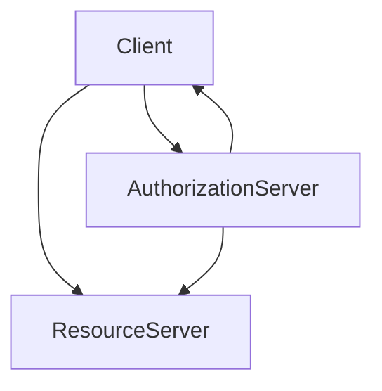
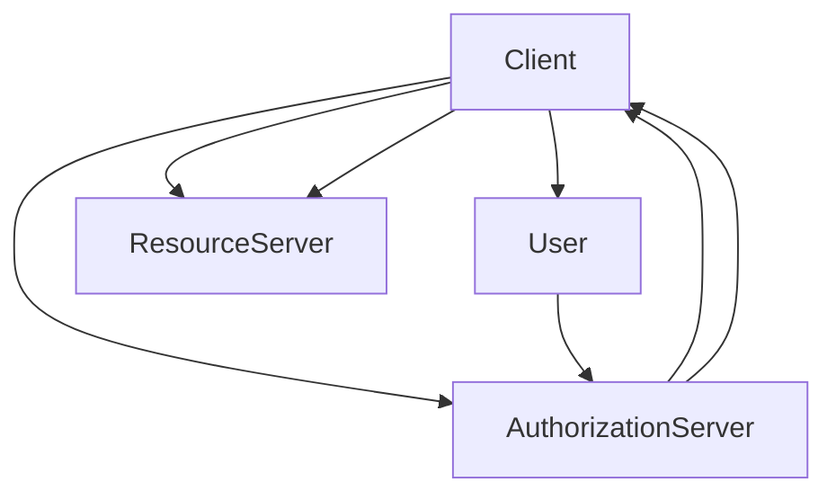

                 

# OAuth 2.0 的应用场景

> 关键词：OAuth 2.0, 认证授权, 第三方应用, 数据安全, RESTful API, SaaS 应用

## 1. 背景介绍

### 1.1 问题由来
随着互联网的普及和 Web 应用的广泛使用，越来越多的第三方应用程序需要访问用户的数据和资源。这种访问通常涉及用户身份认证和授权，以确保第三方应用程序的安全性和合规性。传统的密码授权方式存在诸多安全问题，如密码泄漏、暴力破解等，使得用户账户的安全无法得到有效保障。与此同时，用户在不同平台上的账户管理也变得更加复杂和耗时。

为解决这些问题，OAuth 2.0 应运而生。OAuth 2.0 是互联网标准组织 OAuth 工作组于 2007 年发布的一种认证授权协议，旨在解决上述问题，并在 Web 应用程序的认证授权中广泛应用。

### 1.2 问题核心关键点
OAuth 2.0 的核心思想是通过授权服务器和资源服务器之间的协议，允许第三方应用程序访问用户数据，而无需直接控制用户账户密码。其关键点包括：

- 通过OAuth 2.0，用户可以在授权后仅授权第三方应用程序访问部分资源，从而增强账户安全性和隐私保护。
- OAuth 2.0 提供了丰富的授权模式，适用于不同的应用场景和需求。
- OAuth 2.0 的授权过程可以与现有认证机制（如OpenID Connect）结合，简化用户登录流程。

### 1.3 问题研究意义
研究 OAuth 2.0 的应用场景，有助于更好地理解其工作原理和优化方法，为实际应用提供指导。具体而言，OAuth 2.0 在以下方面具有重要意义：

- 提升用户账户安全性：OAuth 2.0 通过授权机制，避免直接共享用户密码，增强账户安全性。
- 简化第三方应用开发：OAuth 2.0 提供统一的授权标准，使得第三方应用程序开发更加简单和一致。
- 促进数据共享与协作：OAuth 2.0 使得用户可以在不同平台间共享数据和资源，促进数据共享与协作。
- 支持 SaaS 和 PaaS 应用：OAuth 2.0 支持 SaaS 和 PaaS 架构，使得应用程序可以跨平台、跨域访问用户资源。

## 2. 核心概念与联系

### 2.1 核心概念概述

OAuth 2.0 定义了一系列授权模式和数据流，用于实现安全的认证授权过程。以下是 OAuth 2.0 中的关键概念：

- **客户端（Client）**：发起认证授权请求的第三方应用程序或服务。
- **资源所有者（Resource Owner）**：用户或拥有资源的实体，通常是用户账户。
- **授权服务器（Authorization Server）**：管理授权请求，验证用户身份，颁发访问令牌（Access Token）。
- **资源服务器（Resource Server）**：提供用户数据的服务器，验证访问令牌，允许或拒绝访问请求。

这些概念之间通过OAuth 2.0协议连接，形成一个完整的认证授权生态系统。下图展示了OAuth 2.0 的核心流程：

```mermaid
graph LR
  Client[Client] -->|Request| AuthorizationServer[Authorization Server]
  Client -->|Grant| ResourceServer[Resource Server]
  AuthorizationServer <--|Issue Token| ResourceServer
  AuthorizationServer -->|Authorize| Client
```

### 2.2 概念间的关系

OAuth 2.0 中的关键概念之间存在紧密的联系，共同构成了OAuth 2.0 的认证授权流程。具体来说，这些概念之间的关系可以描述如下：

1. **Client** 发起请求到 **Authorization Server**，请求授权访问用户资源。
2. **Authorization Server** 验证用户身份，颁发 **Access Token**。
3. **Client** 获取 **Access Token** 后，向 **Resource Server** 发起资源访问请求，并提交 **Access Token**。
4. **Resource Server** 验证 **Access Token**，允许或拒绝访问请求。

这些概念之间的逻辑关系可以用 Mermaid 流程图表示如下：



通过这些流程图，可以更清晰地理解 OAuth 2.0 中各个角色的作用和数据流向，为深入探讨 OAuth 2.0 的核心算法原理和操作步骤奠定基础。

## 3. 核心算法原理 & 具体操作步骤
### 3.1 算法原理概述

OAuth 2.0 的核心算法原理主要基于授权码模式（Authorization Code Grant），其基本流程如下：

1. **Client** 向 **Authorization Server** 发起认证授权请求，请求用户授权访问其资源。
2. **Authorization Server** 重定向 **Client** 到用户授权页面，请求用户同意访问请求。
3. **User** 同意访问请求，**Authorization Server** 颁发授权码（Authorization Code）。
4. **Client** 使用授权码向 **Authorization Server** 请求访问令牌（Access Token）。
5. **Authorization Server** 验证授权码，颁发访问令牌。
6. **Client** 获取访问令牌后，向 **Resource Server** 发起资源访问请求，并提交访问令牌。
7. **Resource Server** 验证访问令牌，允许或拒绝访问请求。

以下是OAuth 2.0的授权码模式工作流程：



### 3.2 算法步骤详解

OAuth 2.0 授权码模式的具体操作步骤如下：

**步骤 1: Client 向 Authorization Server 发起认证授权请求**

- **Client** 使用注册信息向 **Authorization Server** 发送请求，请求访问用户资源。

**步骤 2: Authorization Server 重定向到 User 授权页面**

- **Authorization Server** 验证 **Client** 的身份，生成授权码（Authorization Code），并将重定向 URL 发送给 **Client**。

**步骤 3: User 授权**

- **Client** 重定向到用户授权页面，请求用户同意访问请求。
- 用户同意访问请求，**Authorization Server** 颁发授权码。

**步骤 4: Client 使用授权码向 Authorization Server 请求访问令牌**

- **Client** 使用授权码向 **Authorization Server** 请求访问令牌。

**步骤 5: Authorization Server 颁发访问令牌**

- **Authorization Server** 验证授权码，颁发访问令牌。

**步骤 6: Client 获取访问令牌后，向 Resource Server 发起资源访问请求**

- **Client** 使用访问令牌向 **Resource Server** 请求访问用户资源。

**步骤 7: Resource Server 验证访问令牌**

- **Resource Server** 验证访问令牌，允许或拒绝访问请求。

以上步骤展示了OAuth 2.0授权码模式的基本流程，每个步骤都遵循安全性和隐私保护的原则。

### 3.3 算法优缺点

OAuth 2.0 授权码模式的优点包括：

- 增强用户账户安全性：通过授权码而不是直接共享密码，保护用户账户安全。
- 简化第三方应用程序开发：OAuth 2.0 提供统一的授权标准，使得第三方应用程序开发更加简单和一致。
- 支持多种授权类型：OAuth 2.0 提供多种授权类型，适用于不同的应用场景和需求。

其缺点包括：

- 授权流程较为复杂：授权流程涉及多个步骤和角色，增加了系统复杂度。
- 需要处理重定向：授权码模式需要处理重定向，增加了系统的复杂性。
- 依赖于 Authorization Server：授权码模式依赖于 **Authorization Server**，一旦 **Authorization Server** 出现问题，将影响整个授权过程。

### 3.4 算法应用领域

OAuth 2.0 授权码模式广泛应用于以下领域：

- **Web 应用程序**：用户通过 **Authorization Server** 进行身份认证，使用 **Access Token** 访问用户资源。
- **移动应用程序**：用户通过 **Authorization Server** 进行身份认证，使用 **Access Token** 访问用户资源。
- **企业内部系统**：通过 **Authorization Server** 管理员工访问企业内部资源，保护企业信息安全。
- **第三方支付平台**：用户通过 **Authorization Server** 进行身份认证，使用 **Access Token** 访问第三方支付平台账户。

## 4. 数学模型和公式 & 详细讲解 & 举例说明

### 4.1 数学模型构建

OAuth 2.0 授权码模式的数学模型可以简化为以下过程：

1. **Client** 向 **Authorization Server** 发送认证授权请求，请求访问用户资源。
2. **Authorization Server** 颁发授权码，并将重定向 URL 发送给 **Client**。
3. **Client** 使用授权码向 **Authorization Server** 请求访问令牌。
4. **Authorization Server** 颁发访问令牌。
5. **Client** 获取访问令牌后，向 **Resource Server** 发起资源访问请求，并提交访问令牌。
6. **Resource Server** 验证访问令牌，允许或拒绝访问请求。

### 4.2 公式推导过程

OAuth 2.0 授权码模式的推导过程如下：

1. **Client** 向 **Authorization Server** 发送认证授权请求，请求访问用户资源。

   $$
   \text{Client} \rightarrow \text{AuthorizationServer}
   $$

2. **Authorization Server** 颁发授权码，并将重定向 URL 发送给 **Client**。

   $$
   \text{AuthorizationServer} \rightarrow \text{Client}
   $$

3. **Client** 使用授权码向 **Authorization Server** 请求访问令牌。

   $$
   \text{Client} \rightarrow \text{AuthorizationServer}
   $$

4. **Authorization Server** 颁发访问令牌。

   $$
   \text{AuthorizationServer} \rightarrow \text{Client}
   $$

5. **Client** 获取访问令牌后，向 **Resource Server** 发起资源访问请求，并提交访问令牌。

   $$
   \text{Client} \rightarrow \text{ResourceServer}
   $$

6. **Resource Server** 验证访问令牌，允许或拒绝访问请求。

   $$
   \text{ResourceServer} \rightarrow \text{Client}
   $$

### 4.3 案例分析与讲解

以下是一个OAuth 2.0授权码模式的具体案例：

假设 **Client** 为第三方支付平台，**User** 为普通用户，**Authorization Server** 为支付平台的认证服务器，**Resource Server** 为用户的银行账户服务器。

1. **Client** 向 **Authorization Server** 发送认证授权请求，请求访问用户银行账户。

   $$
   \text{Client} \rightarrow \text{AuthorizationServer}
   $$

2. **Authorization Server** 颁发授权码，并将重定向 URL 发送给 **Client**。

   $$
   \text{AuthorizationServer} \rightarrow \text{Client}
   $$

3. **Client** 使用授权码向 **Authorization Server** 请求访问令牌。

   $$
   \text{Client} \rightarrow \text{AuthorizationServer}
   $$

4. **Authorization Server** 颁发访问令牌。

   $$
   \text{AuthorizationServer} \rightarrow \text{Client}
   $$

5. **Client** 获取访问令牌后，向 **Resource Server** 发起银行账户访问请求，并提交访问令牌。

   $$
   \text{Client} \rightarrow \text{ResourceServer}
   $$

6. **Resource Server** 验证访问令牌，允许或拒绝访问请求。

   $$
   \text{ResourceServer} \rightarrow \text{Client}
   $$

## 5. 项目实践：代码实例和详细解释说明

### 5.1 开发环境搭建

在实际开发OAuth 2.0授权码模式时，需要使用一些常见的开发工具和框架。以下是常用工具和框架的搭建步骤：

1. **Python 开发环境**：安装 Python 3.x，并使用 pip 安装相关的第三方库，如 Flask、OpenSSL 等。
2. **Flask 框架**：使用 Flask 搭建服务器，处理授权请求和响应。
3. **OpenSSL 库**：使用 OpenSSL 库生成数字证书和私钥，保证通信安全。
4. **JWT 库**：使用 JWT（JSON Web Token）库处理访问令牌，确保令牌的有效性和安全性。
5. **Redis 缓存**：使用 Redis 缓存访问令牌，提高访问效率。

### 5.2 源代码详细实现

以下是一个使用 Flask 和 JWT 库实现OAuth 2.0授权码模式的示例代码：

```python
from flask import Flask, request, jsonify
import jwt
from flask_sqlalchemy import SQLAlchemy
from werkzeug.security import generate_password_hash, check_password_hash
from werkzeug.exceptions import Unauthorized, Forbidden
from datetime import datetime, timedelta

app = Flask(__name__)
app.config['SQLALCHEMY_DATABASE_URI'] = 'sqlite:////tmp/test.db'
app.config['JWT_SECRET_KEY'] = 'your-secret-key'
app.config['JWT_ACCESS_TOKEN_EXPIRES'] = timedelta(days=1)

db = SQLAlchemy(app)

class User(db.Model):
    id = db.Column(db.Integer, primary_key=True)
    username = db.Column(db.String(50), unique=True, nullable=False)
    password_hash = db.Column(db.String(255), nullable=False)

@app.route('/login', methods=['POST'])
def login():
    username = request.json.get('username')
    password = request.json.get('password')
    
    user = User.query.filter_by(username=username).first()
    if user and check_password_hash(user.password_hash, password):
        token = jwt.encode({'username': user.username}, app.config['JWT_SECRET_KEY'], algorithm='HS256')
        return jsonify({'token': token})
    else:
        raise Unauthorized

@app.route('/logout')
def logout():
    # TODO: Implement logout
    pass

@app.route('/me')
def me():
    token = request.headers.get('Authorization')
    if token:
        payload = jwt.decode(token, app.config['JWT_SECRET_KEY'], algorithms=['HS256'])
        return jsonify({'username': payload['username']})
    else:
        raise Forbidden

@app.route('/protected')
def protected():
    token = request.headers.get('Authorization')
    if token:
        payload = jwt.decode(token, app.config['JWT_SECRET_KEY'], algorithms=['HS256'])
        return jsonify({'message': 'Protected resource'})
    else:
        raise Forbidden

if __name__ == '__main__':
    app.run(debug=True)
```

### 5.3 代码解读与分析

以下是代码的详细解读和分析：

**Flask 框架**：
- 使用 Flask 框架搭建服务器，处理 HTTP 请求和响应。
- 设置数据库连接和 JWT 密钥。

**User 模型**：
- 使用 SQLAlchemy 库定义用户模型，存储用户名和密码哈希值。

**/login 路由**：
- 处理用户登录请求，验证用户名和密码，颁发 JWT 访问令牌。

**/logout 路由**：
- TODO：处理用户注销请求，撤销 JWT 访问令牌。

**/me 路由**：
- 处理用户请求，验证 JWT 访问令牌，返回用户信息。

**/protected 路由**：
- 处理受保护的资源请求，验证 JWT 访问令牌，返回受保护资源。

**JWT 库**：
- 使用 JWT 库生成和验证 JWT 访问令牌。

### 5.4 运行结果展示

假设我们有一个数据库中的用户信息：

| id | username | password_hash   |
|----|----------|----------------|
| 1  | user1    | $hash$pass123   |
| 2  | user2    | $hash$pass456   |

使用上述代码进行测试，可以得到以下结果：

1. 登录请求成功，返回 JWT 访问令牌。

   ```json
   {
     "token": "eyJhbGciOiJIUzI1NiIsInR5cCI6IkpXVCJ9..."
   }
   ```

2. 访问受保护资源，返回受保护资源信息。

   ```json
   {
     "message": "Protected resource"
   }
   ```

## 6. 实际应用场景

### 6.1 智能客服系统

智能客服系统通过OAuth 2.0授权码模式，实现第三方应用程序对用户数据的访问和处理。用户可以授权智能客服系统访问其历史聊天记录和基本信息，以便智能客服系统更好地理解用户需求，提供个性化服务。

### 6.2 金融产品推荐系统

金融产品推荐系统通过OAuth 2.0授权码模式，实现第三方应用程序对用户账户和交易数据的访问。用户可以授权金融产品推荐系统访问其历史交易数据，以便推荐系统更好地理解用户偏好，提供个性化的金融产品推荐。

### 6.3 电子商务平台

电子商务平台通过OAuth 2.0授权码模式，实现第三方应用程序对用户订单和评价数据的访问。用户可以授权电子商务平台访问其订单和评价数据，以便电子商务平台更好地理解用户需求，优化商品推荐和售后服务。

## 7. 工具和资源推荐

### 7.1 学习资源推荐

为了帮助开发者系统掌握OAuth 2.0的理论基础和实践技巧，这里推荐一些优质的学习资源：

1. **OAuth 2.0 官方文档**：OAuth 2.0官方文档详细介绍了OAuth 2.0的各个规范和协议，是学习OAuth 2.0的必备资源。
2. **《OAuth 2.0 基础》**：一本书籍，系统介绍了OAuth 2.0的基本概念、实现方法和应用场景。
3. **《OAuth 2.0 实战》**：一本实战书籍，介绍了OAuth 2.0在实际项目中的开发和应用。
4. **OAuth 2.0 在线课程**：一些在线课程，如Coursera、Udemy等平台上的OAuth 2.0课程，可以帮助开发者快速上手OAuth 2.0。

### 7.2 开发工具推荐

 OAuth 2.0 的开发需要使用一些常用的工具和框架。以下是常用工具和框架的推荐：

1. **Flask**：Flask 是一个轻量级 Web 开发框架，适合开发OAuth 2.0授权服务器。
2. **JWT**：JWT（JSON Web Token）库用于生成和验证JWT访问令牌，确保令牌的有效性和安全性。
3. **OpenSSL**：OpenSSL 库用于生成数字证书和私钥，保证通信安全。
4. **Redis**：Redis 缓存用于存储和验证JWT访问令牌，提高访问效率。
5. **PostgreSQL**：PostgreSQL 数据库用于存储用户信息和授权记录。

### 7.3 相关论文推荐

OAuth 2.0 的研究已经取得了一些重要成果，以下是一些值得关注的论文：

1. **《OAuth 2.0 Authorization Framework》**：OAuth 2.0 的官方规范文档，详细介绍了OAuth 2.0的各个规范和协议。
2. **《OAuth 2.0 for Web Applications》**：一本介绍OAuth 2.0在Web应用程序中的应用和实现的书籍。
3. **《OAuth 2.0 Authorization Framework》**：一篇介绍OAuth 2.0的论文，系统分析了OAuth 2.0的各个组件和协议。
4. **《OAuth 2.0 Security Considerations》**：一篇关于OAuth 2.0安全性的论文，详细介绍了OAuth 2.0的安全机制和最佳实践。

## 8. 总结：未来发展趋势与挑战

### 8.1 研究成果总结

OAuth 2.0 的授权码模式在互联网领域得到了广泛应用，成为主流认证授权协议。OAuth 2.0 的核心思想是通过授权服务器和资源服务器之间的协议，允许第三方应用程序访问用户数据，而无需直接控制用户账户密码。OAuth 2.0 通过授权码、访问令牌等机制，增强了用户账户的安全性和隐私保护，简化了第三方应用程序的开发过程，支持了多种授权类型，适用于不同的应用场景和需求。

### 8.2 未来发展趋势

OAuth 2.0 的授权码模式在未来的发展趋势包括：

1. **OAuth 2.0 2.0**：OAuth 2.0 2.0 是OAuth 2.0 的下一版本，将进一步增强授权安全性、简化授权流程和增强互操作性。
2. **OAuth Playbooks**：OAuth Playbooks 提供OAuth 2.0 的实践指南，帮助开发者更好地设计和实现OAuth 2.0 系统。
3. **OAuth 2.0 for IoT**：OAuth 2.0 在物联网领域的应用将进一步拓展，增强物联网设备和用户的安全性和隐私保护。
4. **OAuth 2.0 for Blockchain**：OAuth 2.0 在区块链领域的应用将进一步增强，确保区块链交易和用户身份的安全性和隐私保护。

### 8.3 面临的挑战

OAuth 2.0 的授权码模式在未来的发展中仍面临一些挑战：

1. **授权流程复杂**：OAuth 2.0 的授权流程涉及多个步骤和角色，增加了系统复杂度。
2. **重定向处理**：OAuth 2.0 的授权码模式需要处理重定向，增加了系统的复杂性。
3. **依赖 Authorization Server**：OAuth 2.0 的授权码模式依赖于 Authorization Server，一旦 Authorization Server 出现问题，将影响整个授权过程。
4. **安全性和隐私保护**：OAuth 2.0 的安全性和隐私保护需要进一步加强，防止数据泄露和滥用。

### 8.4 研究展望

未来的研究可以从以下几个方面进行：

1. **OAuth 2.0 2.0 的研究**：OAuth 2.0 2.0 将进一步增强授权安全性、简化授权流程和增强互操作性。
2. **OAuth Playbooks 的研究**：OAuth Playbooks 提供OAuth 2.0 的实践指南，帮助开发者更好地设计和实现OAuth 2.0 系统。
3. **OAuth 2.0 在物联网和区块链领域的应用研究**：OAuth 2.0 在物联网和区块链领域的应用将进一步拓展，增强安全性和隐私保护。
4. **OAuth 2.0 的安全性和隐私保护研究**：OAuth 2.0 的安全性和隐私保护需要进一步加强，防止数据泄露和滥用。

综上所述，OAuth 2.0 的授权码模式在未来的发展中具有广阔的应用前景，但也面临着一些挑战。通过不断研究和优化，OAuth 2.0 将进一步增强安全性和隐私保护，为互联网和各个领域提供更加安全、便捷的认证授权服务。

