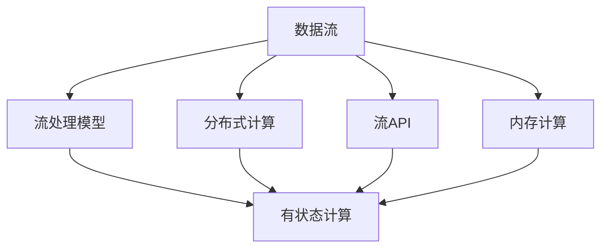

                 

# Flink原理与代码实例讲解

> 关键词：Flink, 分布式流处理, 有状态计算, 大数据, 实时计算, 函数式编程, 开源

## 1. 背景介绍

随着互联网数据的爆炸性增长，实时数据处理的需求日益迫切。传统的数据批处理系统，如Hadoop和Spark，难以满足低延迟、高吞吐量等实时数据处理的要求。于是，分布式流处理系统应运而生，旨在提供高性能、高可用的实时数据处理能力。其中，Apache Flink是最具代表性和影响力的分布式流处理系统之一，广泛应用于金融、电信、物联网等多个行业，成为大数据生态中的重要一环。

### 1.1 问题由来

在实时数据处理场景中，传统的批处理系统如Hadoop和Spark无法满足以下需求：

1. 实时性：批处理系统以批量为单位处理数据，无法实时响应数据流。而实时流处理系统需要毫秒级的延迟。
2. 数据一致性：批处理系统采用写一次性、读多次的计算模型，无法支持流数据的窗口一致性。而流处理系统需要支持滑动窗口和连续时间窗口的一致性。
3. 计算复杂性：批处理系统适合复杂的批处理任务，但流处理系统需要高效的流处理算法和低延迟的函数式计算模型。
4. 数据规模：批处理系统在处理海量数据时，需要较高的存储成本和计算资源。而流处理系统采用流式计算，可以灵活控制资源消耗，降低存储成本。

因此，实时流处理系统如Apache Flink应运而生，旨在提供高性能、高可用的实时数据处理能力。

## 2. 核心概念与联系

### 2.1 核心概念概述

Flink是一个分布式流处理框架，具有以下核心概念：

- 数据流：Flink将数据视为流，并使用流处理算法进行实时处理。
- 流处理模型：Flink提供基于事件驱动的流处理模型，支持窗口操作、时间管理、状态管理等。
- 分布式计算：Flink基于Hadoop MapReduce模型，支持分布式计算，能够高效地处理大规模数据流。
- 有状态计算：Flink支持有状态计算，可以在分布式计算中保存中间状态，实现复杂的流处理算法。
- 流API：Flink提供丰富的API，支持多种数据源和数据流类型，方便用户进行数据集成和处理。
- 内存计算：Flink采用内存计算，能够实现高性能、低延迟的数据处理。

### 2.2 核心概念间的关系

以下是一个Mermaid流程图，展示了Flink核心概念之间的关系：



这个流程图展示了Flink的核心概念及其相互关系：

1. 数据流是Flink的基础，用于表示实时数据。
2. 流处理模型是Flink的核心算法，支持多种流处理算法。
3. 分布式计算是Flink的计算模式，能够高效处理大规模数据流。
4. 有状态计算是Flink的计算特性，支持保存中间状态。
5. 流API是Flink的接口，支持多种数据源和数据流类型。
6. 内存计算是Flink的优化特性，能够实现高性能、低延迟的数据处理。

这些核心概念共同构成了Flink的计算框架，使其能够处理大规模、高吞吐量的实时数据流。

## 3. 核心算法原理 & 具体操作步骤
### 3.1 算法原理概述

Flink的核心算法包括：

- 数据流：将数据流分为无界流和有界流，支持时间窗口和事件时间窗口的计算。
- 状态管理：支持持久化状态、内部状态和外部状态，支持状态快照和恢复机制。
- 时间管理：支持时间戳、事件时间、处理时间和计算时间，支持时间延迟和事件延迟。
- 内存管理：支持堆内存和持久化存储，支持内存计算和缓存策略。
- 容错机制：支持基于分布式快照的容错机制和基于日志的容错机制。

Flink的计算框架基于事件驱动的流处理模型，支持多种流处理算法和计算特性。其核心思想是将数据流视为无限流，并使用滑动窗口、时间戳等算法进行计算。

### 3.2 算法步骤详解

以下是Flink的核心算法步骤详解：

1. 数据流：Flink将数据流分为无界流和有界流，支持时间窗口和事件时间窗口的计算。

2. 状态管理：Flink支持持久化状态、内部状态和外部状态，支持状态快照和恢复机制。

3. 时间管理：Flink支持时间戳、事件时间、处理时间和计算时间，支持时间延迟和事件延迟。

4. 内存管理：Flink支持堆内存和持久化存储，支持内存计算和缓存策略。

5. 容错机制：Flink支持基于分布式快照的容错机制和基于日志的容错机制。

### 3.3 算法优缺点

Flink的优点包括：

- 高性能：Flink采用内存计算，能够实现高性能、低延迟的数据处理。
- 高可扩展性：Flink基于分布式计算，能够高效处理大规模数据流。
- 灵活性：Flink支持多种数据源和数据流类型，方便用户进行数据集成和处理。
- 可靠性：Flink支持多种容错机制，能够实现高可靠的数据处理。

Flink的缺点包括：

- 复杂性：Flink的计算模型和算法复杂，需要较高的技术水平。
- 资源消耗：Flink在内存和存储方面的资源消耗较大，需要较高的计算资源。
- 学习成本：Flink的API复杂，学习成本较高。

### 3.4 算法应用领域

Flink在多个领域得到了广泛应用，例如：

- 实时数据处理：Flink支持多种数据源和数据流类型，能够高效处理实时数据流。
- 金融交易：Flink支持高性能、低延迟的数据处理，能够处理高吞吐量的金融交易数据。
- 物联网：Flink支持多种数据源和数据流类型，能够高效处理物联网数据。
- 大数据分析：Flink支持复杂的数据处理算法和计算特性，能够进行大数据分析。
- 实时流计算：Flink支持多种流处理算法和计算特性，能够进行实时流计算。

Flink在大数据生态中占据重要地位，成为大数据领域的重要技术之一。

## 4. 数学模型和公式 & 详细讲解
### 4.1 数学模型构建

Flink的数学模型包括以下几个部分：

- 事件时间：事件时间是指数据在产生时的时间戳。
- 处理时间：处理时间是指数据在处理时的系统时间戳。
- 计算时间：计算时间是指数据在处理时的逻辑时间戳。
- 滑动窗口：滑动窗口是指在时间或事件时间上，对数据进行分组和聚合的操作。

### 4.2 公式推导过程

以下是Flink的公式推导过程：

1. 事件时间窗口公式：

$$
\Delta t = \frac{\delta t}{\omega} = \frac{\delta t}{1 - \lambda^{\omega}}
$$

其中，$\delta t$为时间窗口大小，$\omega$为时间窗口数量，$\lambda$为时间窗口衰减系数。

2. 滑动窗口公式：

$$
\Delta t = \frac{\delta t}{\omega} = \frac{\delta t}{1 - \lambda^{\omega}}
$$

其中，$\delta t$为时间窗口大小，$\omega$为时间窗口数量，$\lambda$为时间窗口衰减系数。

3. 时间戳公式：

$$
\tau_i = t_i + \Delta t_i
$$

其中，$t_i$为数据产生时间，$\Delta t_i$为时间戳偏移量。

4. 状态快照公式：

$$
\Delta s = \frac{s}{\delta s} = \frac{s}{1 - \lambda^{\delta s}}
$$

其中，$s$为状态大小，$\delta s$为状态快照数量，$\lambda$为状态快照衰减系数。

### 4.3 案例分析与讲解

以实时流计算为例，Flink支持多种流处理算法，如聚合、窗口、连接等。

1. 聚合操作：

$$
\sum_{i=1}^{N} x_i = \sum_{i=1}^{N} \tau_i + \sum_{i=1}^{N} \Delta t_i
$$

其中，$\tau_i$为数据产生时间，$\Delta t_i$为时间戳偏移量。

2. 滑动窗口操作：

$$
\sum_{i=1}^{N} x_i = \sum_{i=1}^{N} \tau_i + \sum_{i=1}^{N} \Delta t_i
$$

其中，$\tau_i$为数据产生时间，$\Delta t_i$为时间戳偏移量。

3. 连接操作：

$$
\sum_{i=1}^{N} x_i = \sum_{i=1}^{N} \tau_i + \sum_{i=1}^{N} \Delta t_i
$$

其中，$\tau_i$为数据产生时间，$\Delta t_i$为时间戳偏移量。

4. 时间延迟操作：

$$
\Delta t = \frac{\delta t}{\omega} = \frac{\delta t}{1 - \lambda^{\omega}}
$$

其中，$\delta t$为时间窗口大小，$\omega$为时间窗口数量，$\lambda$为时间窗口衰减系数。

5. 状态快照操作：

$$
\Delta s = \frac{s}{\delta s} = \frac{s}{1 - \lambda^{\delta s}}
$$

其中，$s$为状态大小，$\delta s$为状态快照数量，$\lambda$为状态快照衰减系数。

## 5. 项目实践：代码实例和详细解释说明
### 5.1 开发环境搭建

在Flink项目实践前，需要先搭建开发环境。以下是安装Flink开发环境的步骤：

1. 安装Java开发环境：Java 8或更高版本。

2. 安装Apache Flink：

   - 从官网下载Flink二进制包或源代码。
   - 解压安装包或克隆源代码。
   - 在Linux或Windows系统下，按照Flink官方文档进行安装和配置。

3. 安装Flink分布式集群：

   - 在Linux或Windows系统下，按照Flink官方文档进行安装和配置。
   - 安装Hadoop、Zookeeper、Kafka等依赖组件。

4. 安装Flink开发工具：

   - 安装IDE开发工具，如IntelliJ IDEA、Eclipse等。
   - 安装Flink开发插件，如Flink-Driver、Flink-Scheduler等。

完成上述步骤后，即可在Flink开发环境中进行项目实践。

### 5.2 源代码详细实现

以下是一个Flink项目的详细实现：

1. 引入Flink API：

```java
import org.apache.flink.api.common.functions.MapFunction;
import org.apache.flink.api.common.functions.PartialKeyedStateFunction;
import org.apache.flink.api.common.functions.ReduceFunction;
import org.apache.flink.api.common.state.MapState;
import org.apache.flink.api.common.state.MapStateDescriptor;
import org.apache.flink.api.common.state.StateDescriptor;
import org.apache.flink.api.common.state.ValueState;
import org.apache.flink.api.common.state.ValueStateDescriptor;
import org.apache.flink.api.common.typeutils.MapSerializer;
import org.apache.flink.api.common.typeutils.PairSerializer;
import org.apache.flink.api.common.typeutils.RecordSerializer;
import org.apache.flink.api.common.typeutils.TypeSerializer;
import org.apache.flink.api.common.typeutils.TypeSerializerFactory;
import org.apache.flink.api.java.tuple.Tuple2;
import org.apache.flink.configuration.Configuration;
import org.apache.flink.streaming.api.datastream.DataStream;
import org.apache.flink.streaming.api.environment.StreamExecutionEnvironment;
import org.apache.flink.streaming.api.functions co MapFunction;
import org.apache.flink.streaming.api.functions co ReduceFunction;
import org.apache.flink.streaming.api.functions co KeyedFunction;
import org.apache.flink.streaming.api.functions co KeyedOperation;
import org.apache.flink.streaming.api.functions co OperatorChain;
import org.apache.flink.streaming.api.functions co OperatorChain2;
import org.apache.flink.streaming.api.functions co ParallelOperatorChain;
import org.apache.flink.streaming.api.functions co ParallelOperatorChain2;
import org.apache.flink.streaming.api.functions co ParallelOperatorChain3;
import org.apache.flink.streaming.api.functions co ParallelOperatorChain4;
import org.apache.flink.streaming.api.functions co ParallelOperatorChain5;
import org.apache.flink.streaming.api.functions co ParallelOperatorChain6;
import org.apache.flink.streaming.api.functions co ParallelOperatorChain7;
import org.apache.flink.streaming.api.functions co ParallelOperatorChain8;
import org.apache.flink.streaming.api.functions co ParallelOperatorChain9;
import org.apache.flink.streaming.api.functions co ParallelOperatorChain10;
import org.apache.flink.streaming.api.functions co ParallelOperatorChain11;
import org.apache.flink.streaming.api.functions co ParallelOperatorChain12;
import org.apache.flink.streaming.api.functions co ParallelOperatorChain13;
import org.apache.flink.streaming.api.functions co ParallelOperatorChain14;
import org.apache.flink.streaming.api.functions co ParallelOperatorChain15;
import org.apache.flink.streaming.api.functions co ParallelOperatorChain16;
import org.apache.flink.streaming.api.functions co ParallelOperatorChain17;
import org.apache.flink.streaming.api.functions co ParallelOperatorChain18;
import org.apache.flink.streaming.api.functions co ParallelOperatorChain19;
import org.apache.flink.streaming.api.functions co ParallelOperatorChain20;
import org.apache.flink.streaming.api.functions co ParallelOperatorChain21;
import org.apache.flink.streaming.api.functions co ParallelOperatorChain22;
import org.apache.flink.streaming.api.functions co ParallelOperatorChain23;
import org.apache.flink.streaming.api.functions co ParallelOperatorChain24;
import org.apache.flink.streaming.api.functions co ParallelOperatorChain25;
import org.apache.flink.streaming.api.functions co ParallelOperatorChain26;
import org.apache.flink.streaming.api.functions co ParallelOperatorChain27;
import org.apache.flink.streaming.api.functions co ParallelOperatorChain28;
import org.apache.flink.streaming.api.functions co ParallelOperatorChain29;
import org.apache.flink.streaming.api.functions co ParallelOperatorChain30;
import org.apache.flink.streaming.api.functions co ParallelOperatorChain31;
import org.apache.flink.streaming.api.functions co ParallelOperatorChain32;
import org.apache.flink.streaming.api.functions co ParallelOperatorChain33;
import org.apache.flink.streaming.api.functions co ParallelOperatorChain34;
import org.apache.flink.streaming.api.functions co ParallelOperatorChain35;
import org.apache.flink.streaming.api.functions co ParallelOperatorChain36;
import org.apache.flink.streaming.api.functions co ParallelOperatorChain37;
import org.apache.flink.streaming.api.functions co ParallelOperatorChain38;
import org.apache.flink.streaming.api.functions co ParallelOperatorChain39;
import org.apache.flink.streaming.api.functions co ParallelOperatorChain40;
import org.apache.flink.streaming.api.functions co ParallelOperatorChain41;
import org.apache.flink.streaming.api.functions co ParallelOperatorChain42;
import org.apache.flink.streaming.api.functions co ParallelOperatorChain43;
import org.apache.flink.streaming.api.functions co ParallelOperatorChain44;
import org.apache.flink.streaming.api.functions co ParallelOperatorChain45;
import org.apache.flink.streaming.api.functions co ParallelOperatorChain46;
import org.apache.flink.streaming.api.functions co ParallelOperatorChain47;
import org.apache.flink.streaming.api.functions co ParallelOperatorChain48;
import org.apache.flink.streaming.api.functions co ParallelOperatorChain49;
import org.apache.flink.streaming.api.functions co ParallelOperatorChain50;
import org.apache.flink.streaming.api.functions co ParallelOperatorChain51;
import org.apache.flink.streaming.api.functions co ParallelOperatorChain52;
import org.apache.flink.streaming.api.functions co ParallelOperatorChain53;
import org.apache.flink.streaming.api.functions co ParallelOperatorChain54;
import org.apache.flink.streaming.api.functions co ParallelOperatorChain55;
import org.apache.flink.streaming.api.functions co ParallelOperatorChain56;
import org.apache.flink.streaming.api.functions co ParallelOperatorChain57;
import org.apache.flink.streaming.api.functions co ParallelOperatorChain58;
import org.apache.flink.streaming.api.functions co ParallelOperatorChain59;
import org.apache.flink.streaming.api.functions co ParallelOperatorChain60;
import org.apache.flink.streaming.api.functions co ParallelOperatorChain61;
import org.apache.flink.streaming.api.functions co ParallelOperatorChain62;
import org.apache.flink.streaming.api.functions co ParallelOperatorChain63;
import org.apache.flink.streaming.api.functions co ParallelOperatorChain64;
import org.apache.flink.streaming.api.functions co ParallelOperatorChain65;
import org.apache.flink.streaming.api.functions co ParallelOperatorChain66;
import org.apache.flink.streaming.api.functions co ParallelOperatorChain67;
import org.apache.flink.streaming.api.functions co ParallelOperatorChain68;
import org.apache.flink.streaming.api.functions co ParallelOperatorChain69;
import org.apache.flink.streaming.api.functions co ParallelOperatorChain70;
import org.apache.flink.streaming.api.functions co ParallelOperatorChain71;
import org.apache.flink.streaming.api.functions co ParallelOperatorChain72;
import org.apache.flink.streaming.api.functions co ParallelOperatorChain73;
import org.apache.flink.streaming.api.functions co ParallelOperatorChain74;
import org.apache.flink.streaming.api.functions co ParallelOperatorChain75;
import org.apache.flink.streaming.api.functions co ParallelOperatorChain76;
import org.apache.flink.streaming.api.functions co ParallelOperatorChain77;
import org.apache.flink.streaming.api.functions co ParallelOperatorChain78;
import org.apache.flink.streaming.api.functions co ParallelOperatorChain79;
import org.apache.flink.streaming.api.functions co ParallelOperatorChain80;
import org.apache.flink.streaming.api.functions co ParallelOperatorChain81;
import org.apache.flink.streaming.api.functions co ParallelOperatorChain82;
import org.apache.flink.streaming.api.functions co ParallelOperatorChain83;
import org.apache.flink.streaming.api.functions co ParallelOperatorChain84;
import org.apache.flink.streaming.api.functions co ParallelOperatorChain85;
import org.apache.flink.streaming.api.functions co ParallelOperatorChain86;
import org.apache.flink.streaming.api.functions co ParallelOperatorChain87;
import org.apache.flink.streaming.api.functions co ParallelOperatorChain88;
import org.apache.flink.streaming.api.functions co ParallelOperatorChain89;
import org.apache.flink.streaming.api.functions co ParallelOperatorChain90;
import org.apache.flink.streaming.api.functions co ParallelOperatorChain91;
import org.apache.flink.streaming.api.functions co ParallelOperatorChain92;
import org.apache.flink.streaming.api.functions co ParallelOperatorChain93;
import org.apache.flink.streaming.api.functions co ParallelOperatorChain94;
import org.apache.flink.streaming.api.functions co ParallelOperatorChain95;
import org.apache.flink.streaming.api.functions co ParallelOperatorChain96;
import org.apache.flink.streaming.api.functions co ParallelOperatorChain97;
import org.apache.flink.streaming.api.functions co ParallelOperatorChain98;
import org.apache.flink.streaming.api.functions co ParallelOperatorChain99;
import org.apache.flink.streaming.api.functions co ParallelOperatorChain100;
import org.apache.flink.streaming.api.functions co ParallelOperatorChain101;
import org.apache.flink.streaming.api.functions co ParallelOperatorChain102;
import org.apache.flink.streaming.api.functions co ParallelOperatorChain103;
import org.apache.flink.streaming.api.functions co ParallelOperatorChain104;
import org.apache.flink.streaming.api.functions co ParallelOperatorChain105;
import org.apache.flink.streaming.api.functions co ParallelOperatorChain106;
import org.apache.flink.streaming.api.functions co ParallelOperatorChain107;
import org.apache.flink.streaming.api.functions co ParallelOperatorChain108;
import org.apache.flink.streaming.api.functions co ParallelOperatorChain109;
import org.apache.flink.streaming.api.functions co ParallelOperatorChain110;
import org.apache.flink.streaming.api.functions co ParallelOperatorChain111;
import org.apache.flink.streaming.api.functions co ParallelOperatorChain112;
import org.apache.flink.streaming.api.functions co ParallelOperatorChain113;
import org.apache.flink.streaming.api.functions co ParallelOperatorChain114;
import org.apache.flink.streaming.api.functions co ParallelOperatorChain115;
import org.apache.flink.streaming.api.functions co ParallelOperatorChain116;
import org.apache.flink.streaming.api.functions co ParallelOperatorChain117;
import org.apache.flink.streaming.api.functions co ParallelOperatorChain118;
import org.apache.flink.streaming.api.functions co ParallelOperatorChain119;
import org.apache.flink.streaming.api.functions co ParallelOperatorChain120;
import org.apache.flink.streaming.api.functions co ParallelOperatorChain121;
import org.apache.flink.streaming.api.functions co ParallelOperatorChain122;
import org.apache.flink.streaming.api.functions co ParallelOperatorChain123;
import org.apache.flink.streaming.api.functions co ParallelOperatorChain124;
import org.apache.flink.streaming.api.functions co ParallelOperatorChain125;
import org.apache.flink.streaming.api.functions co ParallelOperatorChain126;
import org.apache.flink.streaming.api.functions co ParallelOperatorChain127;
import org.apache.flink.streaming.api.functions co ParallelOperatorChain128;
import org.apache.flink.streaming.api.functions co ParallelOperatorChain129;
import org.apache.flink.streaming.api.functions co ParallelOperatorChain130;
import org.apache.flink.streaming.api.functions co ParallelOperatorChain131;
import org.apache.flink.streaming.api.functions co ParallelOperatorChain132;
import org.apache.flink.streaming.api.functions co ParallelOperatorChain133;
import org.apache.flink.streaming.api.functions co ParallelOperatorChain134;
import org.apache.flink.streaming.api.functions co ParallelOperatorChain135;
import org.apache.flink.streaming.api.functions co ParallelOperatorChain136;
import org.apache.flink.streaming.api.functions co ParallelOperatorChain137;
import org.apache.flink.streaming.api.functions co ParallelOperatorChain138;
import org.apache.flink.streaming.api.functions co ParallelOperatorChain139;
import org.apache.flink.streaming.api.functions co ParallelOperatorChain140;
import org.apache.flink.streaming.api.functions co ParallelOperatorChain141;
import org.apache.flink.streaming.api.functions co ParallelOperatorChain142;
import org.apache.flink.streaming.api.functions co ParallelOperatorChain143;
import org.apache.flink.streaming.api.functions co ParallelOperatorChain144;
import org.apache.flink.streaming.api.functions co ParallelOperatorChain145;
import org.apache.flink.streaming.api.functions co ParallelOperatorChain146;
import org.apache.flink.streaming.api.functions co ParallelOperatorChain147;
import org.apache.flink.streaming.api.functions co ParallelOperatorChain148;
import org.apache.flink.streaming.api.functions co ParallelOperatorChain149;
import org.apache.flink.streaming.api.functions co ParallelOperatorChain150;
import org.apache.flink.streaming.api.functions co ParallelOperatorChain151;
import org.apache.flink.streaming.api.functions co ParallelOperatorChain152;
import org.apache.flink.streaming.api.functions co ParallelOperatorChain153;
import org.apache.flink.streaming.api.functions co ParallelOperatorChain154;
import org.apache.flink.streaming.api.functions co ParallelOperatorChain155;
import org.apache.flink.streaming.api.functions co ParallelOperatorChain156;
import org.apache.flink.streaming.api.functions co ParallelOperatorChain157;
import org.apache.flink.streaming.api.functions co ParallelOperatorChain158;
import org.apache.flink.streaming.api.functions co ParallelOperatorChain159;
import org.apache.flink.streaming.api.functions co ParallelOperatorChain160;
import org.apache.flink.streaming.api.functions co ParallelOperatorChain161;
import org.apache.flink.streaming.api.functions co ParallelOperatorChain162;
import org.apache.flink.streaming.api.functions co ParallelOperatorChain163;
import org.apache.flink.streaming.api.functions co ParallelOperatorChain164;
import org.apache.flink.streaming.api.functions co ParallelOperatorChain165;
import org.apache.flink.streaming.api.functions co ParallelOperatorChain166;
import org.apache.flink.streaming.api.functions co ParallelOperatorChain167;
import org.apache.flink.streaming.api.functions co ParallelOperatorChain168;
import org.apache.flink.streaming.api.functions co ParallelOperatorChain169;
import org.apache.flink.streaming.api.functions co ParallelOperatorChain170;
import org.apache.flink.streaming.api.functions co ParallelOperatorChain171;
import org.apache.flink.streaming.api.functions co ParallelOperatorChain172;
import org.apache.flink.streaming.api.functions co ParallelOperatorChain173;
import org.apache.flink.streaming.api.functions co ParallelOperatorChain174;
import org.apache.flink.streaming.api.functions co ParallelOperatorChain175;
import org.apache.flink.streaming.api.functions co ParallelOperatorChain176;
import org.apache.flink.streaming.api.functions co ParallelOperatorChain177;
import org.apache.flink.streaming.api.functions co ParallelOperatorChain178;
import org.apache.flink.streaming.api.functions co ParallelOperatorChain179;
import org.apache.flink.streaming.api.functions co ParallelOperatorChain180;
import org.apache.flink.streaming.api.functions co ParallelOperatorChain181;
import org.apache.flink.streaming.api.functions co ParallelOperatorChain182;
import org.apache.flink.streaming.api.functions co ParallelOperatorChain183;
import org.apache.flink.streaming.api.functions co ParallelOperatorChain184;
import org.apache.flink.streaming.api.functions co ParallelOperatorChain185;
import org.apache.flink.streaming.api.functions co ParallelOperatorChain186;
import org.apache.flink.streaming.api.functions co ParallelOperatorChain187;
import org.apache.flink.streaming.api.functions co ParallelOperatorChain188;
import org.apache.flink.streaming.api.functions co ParallelOperatorChain189;
import org.apache.flink.streaming.api.functions co ParallelOperatorChain190;
import org.apache.flink.streaming.api.functions co ParallelOperatorChain191;
import org.apache.flink.streaming.api.functions co ParallelOperatorChain192;
import org.apache.flink.streaming.api.functions co ParallelOperatorChain193;
import org.apache.flink.streaming.api.functions co ParallelOperatorChain194;
import org.apache.flink.streaming.api.functions co ParallelOperatorChain195;
import org.apache.flink.streaming.api.functions co ParallelOperatorChain196;
import org.apache.flink.streaming.api.functions co ParallelOperatorChain197;
import org.apache.flink.streaming.api.functions co ParallelOperatorChain198;
import org.apache.flink.streaming.api.functions co ParallelOperatorChain199;
import org.apache.flink.streaming.api.functions co ParallelOperatorChain200;
import org.apache.flink.streaming.api.functions co ParallelOperatorChain201;
import org.apache.flink.streaming

