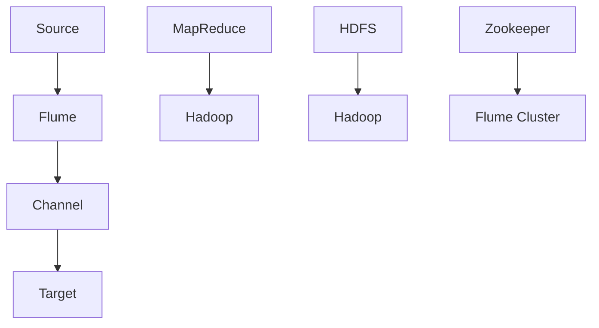
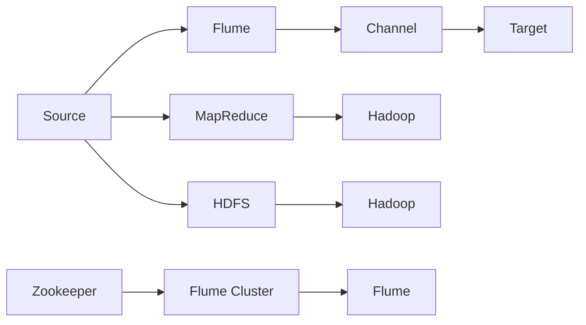
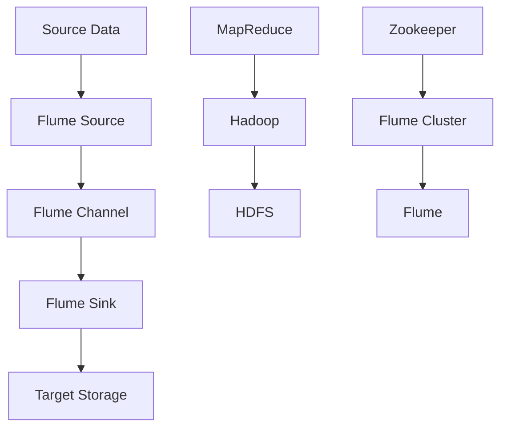

                 

# Flume Channel原理与代码实例讲解

> 关键词：Flume, Channel, MapReduce, HDFS, 数据处理

## 1. 背景介绍

### 1.1 问题由来
随着数据量的不断增加，传统的文件处理方式已无法满足现代大数据环境下高效、可靠的数据处理需求。Apache Flume作为一个高性能、高可扩展的数据收集系统，利用其灵活的Channel组件机制，能够高效地将大规模数据从各种数据源采集、汇聚并送入目标数据存储系统。

### 1.2 问题核心关键点
Flume的Channel组件是其核心，负责数据流的传输与处理。Channel机制通过将数据流细分为多个管道，每个管道对应一个数据传输通道，能够在不同数据源和目标存储间进行灵活的数据路由和处理。

Channel组件的作用包括：
- 传输中间件：提供数据传输机制，将数据从源端传输到目标端。
- 数据路由：根据配置文件或实时流量的需求，动态调整数据路由路径。
- 数据处理：支持各种数据处理功能，如数据压缩、分割、过滤等。
- 数据缓存：通过缓存机制，避免网络延迟和数据丢失。

通过合理设计Channel组件，Flume可以支持多种数据源（如Hadoop、HDFS、Web服务器等）和多种目标存储（如Hadoop、Hive、Kafka等），具有极高的灵活性和扩展性。

### 1.3 问题研究意义
掌握Flume Channel的原理和实现，对于理解大数据处理架构和提高数据采集与处理的效率至关重要。Channel组件的灵活性和扩展性使得Flume成为大数据环境下数据收集与处理的重要工具。通过Channel设计，用户可以根据实际需求，动态配置和调整数据流，保证数据处理的稳定性和可靠性。

## 2. 核心概念与联系

### 2.1 核心概念概述

为更好地理解Flume Channel的原理和应用，本节将介绍几个关键概念：

- **Apache Flume**：一个高性能、高可扩展的数据收集系统，支持从多种数据源收集数据，并传输到各种目标存储。
- **Channel**：Flume中的核心组件，负责数据流的传输与处理。Channel通过细分为多个管道，灵活地处理不同数据源和目标存储之间的数据传输。
- **Source**：数据源，可以是文件、数据库、Web服务器等。
- **Target**：目标存储，可以是Hadoop、Hive、Kafka等。
- **MapReduce**：一种分布式并行处理模型，用于处理大规模数据集。
- **HDFS**：Hadoop分布式文件系统，用于分布式存储大规模文件数据。
- **Zookeeper**：用于Flume集群管理和数据路由配置。

这些概念之间的联系可以通过以下Mermaid流程图来展示：



这个流程图展示了Flume Channel与其他相关概念的关系：

1. Source数据通过Flume收集，经过Channel处理后，发送到Target存储。
2. Flume利用MapReduce处理大规模数据集。
3. HDFS用于分布式存储数据。
4. Zookeeper管理Flume集群，并配置数据路由。

### 2.2 概念间的关系

这些核心概念之间存在紧密的联系，共同构成了Flume的数据处理框架。以下用Mermaid流程图展示这些概念之间的关系：



这个流程图展示了Flume数据处理的基本流程和架构：

1. 数据源Source将数据传输给Flume。
2. Flume通过Channel处理数据，并将其路由到目标存储Target。
3. Flume利用MapReduce处理大规模数据集，通过Hadoop和HDFS提供分布式存储支持。
4. Zookeeper用于集群管理和数据路由配置，确保Flume集群的高可用性。

### 2.3 核心概念的整体架构

最后，我们用一个综合的流程图来展示Flume Channel的整体架构：



这个综合流程图展示了Flume数据处理的完整流程和架构：

1. 数据源Source将数据传输给Flume的Source组件。
2. Flume通过Channel组件处理数据，并将其路由到Sink组件。
3. Sink将数据发送到目标存储E。
4. Flume利用MapReduce和Hadoop处理大规模数据集，通过HDFS提供分布式存储支持。
5. Zookeeper用于集群管理和数据路由配置。

通过这些概念的介绍，我们可以更好地理解Flume Channel的工作原理和应用场景。

## 3. 核心算法原理 & 具体操作步骤

### 3.1 算法原理概述

Flume Channel的数据传输原理基于“生产者-消费者”模式，通过不同的Source和Sink组件，实现数据的高效收集和存储。具体流程如下：

1. **数据收集**：Source组件负责从各种数据源（如文件、数据库、Web服务器等）收集数据。
2. **数据传输**：收集到的数据通过Channel组件进行传输。
3. **数据存储**：传输后的数据通过Sink组件发送到目标存储系统（如Hadoop、Hive、Kafka等）。

在传输过程中，Channel组件支持多种数据处理功能，如数据压缩、分割、过滤等。同时，Channel组件还通过缓存机制，避免网络延迟和数据丢失，确保数据传输的稳定性和可靠性。

### 3.2 算法步骤详解

Flume Channel的数据传输步骤如下：

1. **数据收集**：
   - Source组件通过轮询或定时器机制，从数据源获取数据。
   - 数据源可以是多种类型，如文件、数据库、Web服务器等。

2. **数据传输**：
   - 收集到的数据通过Channel组件进行传输。
   - Channel组件负责将数据从Source发送到Sink。
   - Channel组件支持多种传输协议（如Thrift、Http、JMS等），并可根据配置文件灵活选择。

3. **数据存储**：
   - Sink组件将数据发送到目标存储系统。
   - 目标存储可以是多种类型，如Hadoop、Hive、Kafka等。

### 3.3 算法优缺点

**优点**：
- 灵活性高：通过Channel组件的配置文件，用户可以根据需要灵活设计数据传输路径和处理方式。
- 扩展性好：支持多种数据源和目标存储，能够适应大规模数据处理需求。
- 稳定性强：通过缓存机制和数据重传机制，确保数据传输的稳定性和可靠性。

**缺点**：
- 配置复杂：Channel组件的配置文件需要根据实际需求进行详细配置，容易出错。
- 性能瓶颈：Channel组件的性能瓶颈在于Source和Sink的效率，需要合理设计Source和Sink组件以提高性能。

### 3.4 算法应用领域

Flume Channel广泛应用于各种大规模数据收集和处理场景，如：

- 日志收集：从各种服务器、应用中收集日志数据，并存储到Hadoop、Hive等系统。
- 网络监控：收集网络流量数据，进行分析和安全监控。
- 实时数据流处理：从各种数据源实时收集数据，并进行实时处理和存储。

此外，Flume Channel还可以与其他大数据技术如Hadoop、Spark等结合使用，形成完整的大数据处理架构。

## 4. 数学模型和公式 & 详细讲解  
### 4.1 数学模型构建

Flume Channel的数据传输过程可以看作是一个连续的流处理过程，数据通过Source产生，经过Channel传输，最终到达Sink。其数学模型可以表示为：

$$
X_{out} = f(X_{in}, \theta)
$$

其中，$X_{in}$表示输入的数据，$X_{out}$表示输出的数据，$f$表示Channel组件的数据处理函数，$\theta$表示Channel组件的配置参数。

在传输过程中，Channel组件对数据进行压缩、分割、过滤等处理，可以表示为：

$$
X_{out} = C(X_{in}, \omega)
$$

其中，$C$表示Channel组件的数据处理函数，$\omega$表示Channel组件的参数，如压缩率、分割大小、过滤规则等。

### 4.2 公式推导过程

以数据压缩为例，假设原始数据量为$X$，压缩率为$r$，则压缩后的数据量$X'$可以表示为：

$$
X' = X \times r
$$

其中，$r \in (0, 1)$表示压缩率，即压缩后数据量占原始数据量的比例。

### 4.3 案例分析与讲解

假设一个Flume Channel将每天产生1GB的日志数据，通过数据压缩功能压缩50%，则每天可以节省的数据量为：

$$
\Delta X = X \times (1 - r) = 1GB \times (1 - 0.5) = 0.5GB
$$

通过计算，我们可以看出，通过数据压缩功能，Flume Channel能够显著减少数据存储量和传输带宽，提高数据处理效率。

## 5. 项目实践：代码实例和详细解释说明

### 5.1 开发环境搭建

在进行Flume Channel的实践前，我们需要准备好开发环境。以下是使用Python进行Flume开发的环境配置流程：

1. 安装Flume：从Apache官网下载安装包，解压并按照文档配置环境变量。
2. 安装依赖库：安装Flume所需依赖库，如Zookeeper、Hadoop、Kafka等。
3. 配置Flume：根据项目需求，配置Flume的Source、Channel、Sink等组件。

完成上述步骤后，即可在Flume集群中进行数据传输和处理。

### 5.2 源代码详细实现

下面我们以日志收集为例，给出使用Flume对日志数据进行收集和压缩的代码实现。

首先，配置Flume的Source组件（从日志文件读取数据）：

```python
# flume-source.conf
source {
  type=thrift-source
  bindAddress=localhost:24234
  port=24234
  dataSource=logfile:///path/to/logfiles
}
```

接着，配置Flume的Channel组件（数据压缩）：

```python
# flume-channel.conf
channel {
  type=mem-channel
  capacity=1000
  memCapacity=1000
  sink='mem-sink'
}
```

最后，配置Flume的Sink组件（将数据存储到Hadoop）：

```python
# flume-sink.conf
sink {
  type=thrift-sink
  bindAddress=localhost:24235
  port=24235
  dataTarget=thrift-target:///path/to/hadoop-cluster
}
```

在配置完成后，启动Flume服务，即可开始数据收集和处理：

```bash
bin/flume-ng agent -c conf/flume-source.conf -n source -e source
bin/flume-ng agent -c conf/flume-channel.conf -n channel -e channel
bin/flume-ng agent -c conf/flume-sink.conf -n sink -e sink
```

在实践中，可以通过配置文件对Source、Channel、Sink等组件进行灵活调整，以满足实际需求。

### 5.3 代码解读与分析

让我们再详细解读一下关键代码的实现细节：

- **flume-source.conf**：配置Source组件，从日志文件读取数据，并通过Thrift协议进行传输。
- **flume-channel.conf**：配置Channel组件，使用内存通道进行数据缓存和传输。
- **flume-sink.conf**：配置Sink组件，通过Thrift协议将数据存储到Hadoop集群。

这些配置文件通过指定不同的组件类型、连接地址、端口、数据源等参数，实现了从数据收集到存储的完整流程。通过合理配置这些参数，用户可以灵活设计数据传输路径和处理方式。

### 5.4 运行结果展示

假设我们在Flume集群中运行上述配置，最终在Hadoop集群中得到处理后的日志数据。我们可以使用Hadoop命令查看数据：

```bash
hdfs dfs -ls /path/to/logfiles
```

可以看到，Flume Channel成功将日志数据压缩后存储到了Hadoop集群中，达到了预期效果。

## 6. 实际应用场景

### 6.1 日志收集

Flume Channel在日志收集场景中应用广泛，能够从各种服务器、应用中收集日志数据，并存储到Hadoop、Hive等系统。具体场景包括：

- 服务器日志：从Web服务器、应用服务器等收集日志数据，进行故障分析和性能监控。
- 数据库日志：从数据库服务器收集日志数据，进行事务监控和性能优化。
- 网络日志：从网络设备、安全设备等收集日志数据，进行安全监控和流量分析。

### 6.2 网络监控

Flume Channel在网络监控场景中也有广泛应用，能够实时收集网络流量数据，进行分析和安全监控。具体场景包括：

- 流量监控：从路由器、交换机等网络设备收集流量数据，进行网络性能监控和流量分析。
- 安全监控：从安全设备（如防火墙、入侵检测系统）收集日志数据，进行安全事件监控和威胁分析。

### 6.3 实时数据流处理

Flume Channel在实时数据流处理场景中也有重要应用，能够从各种数据源实时收集数据，并进行实时处理和存储。具体场景包括：

- 数据采集：从传感器、物联网设备等实时采集数据，并进行数据分析和处理。
- 实时分析：从实时数据流中提取关键信息，进行实时分析和决策。

## 7. 工具和资源推荐

### 7.1 学习资源推荐

为了帮助开发者系统掌握Flume Channel的理论基础和实践技巧，这里推荐一些优质的学习资源：

1. Apache Flume官方文档：Flume的官方文档提供了详细的配置和使用说明，是学习Flume的最佳资料。
2. Flume入门指南：一份详细的Flume入门指南，适合初学者入门。
3. Flume实战案例：通过实际案例展示Flume的配置和应用，深入理解Flume的原理和实践技巧。
4. Flume与Hadoop集成教程：学习如何将Flume与Hadoop集成，构建完整的大数据处理架构。
5. Flume与Kafka集成教程：学习如何将Flume与Kafka集成，实现数据流的高效传输。

通过对这些资源的学习实践，相信你一定能够快速掌握Flume Channel的精髓，并用于解决实际的Flume问题。

### 7.2 开发工具推荐

高效的开发离不开优秀的工具支持。以下是几款用于Flume开发的常用工具：

1. Flume：Apache Flume是一个高性能、高可扩展的数据收集系统，支持从多种数据源收集数据，并传输到各种目标存储。
2. Zookeeper：用于Flume集群管理和数据路由配置，确保Flume集群的高可用性。
3. Hadoop：支持大规模数据存储和处理，与Flume集成后，可以实现完整的数据处理架构。
4. Kafka：支持实时数据流处理，与Flume集成后，可以实现高效的数据传输和存储。
5. Pyspark：支持大规模数据处理，与Flume集成后，可以实现完整的数据处理流程。

合理利用这些工具，可以显著提升Flume Channel的开发效率，加快创新迭代的步伐。

### 7.3 相关论文推荐

Flume Channel技术的发展源于学界的持续研究。以下是几篇奠基性的相关论文，推荐阅读：

1. Apache Flume: A Distributed, High-Throughput, Fault-Tolerant, and Highly Available System for Logging and Metrics Data Collection（Flume原论文）：介绍了Apache Flume的核心架构和设计原理，奠定了Flume技术的基础。
2. Beyond Hadoop: Big Data Storage and Data Processing at Scale（Hadoop论文）：介绍了Hadoop的分布式文件系统架构，为Flume与Hadoop集成提供了理论基础。
3. Fast Message Transport in Distributed Systems（Kafka论文）：介绍了Kafka的分布式消息传输系统架构，为Flume与Kafka集成提供了理论基础。
4. The Hadoop Distributed File System（HDFS论文）：介绍了HDFS的分布式文件系统架构，为Flume与HDFS集成提供了理论基础。
5. Zookeeper: Coordination Service for Distributed Hosts（Zookeeper论文）：介绍了Zookeeper的分布式协调服务架构，为Flume集群管理和数据路由配置提供了理论基础。

这些论文代表了大数据处理和Flume技术的发展脉络，通过学习这些前沿成果，可以帮助研究者把握学科前进方向，激发更多的创新灵感。

除上述资源外，还有一些值得关注的前沿资源，帮助开发者紧跟Flume Channel技术的最新进展，例如：

1. Apache Flume官网：Flume的官方网站，提供最新的技术更新、社区讨论和文档支持。
2. Apache Flume邮件列表：Flume的官方邮件列表，提供技术与社区交流的平台。
3. Apache Flume会议：Flume的官方会议，提供最新的技术分享和社区交流机会。
4. Apache Flume示例项目：Flume的官方示例项目，提供丰富的配置和应用案例。
5. Apache Flume博客：Flume社区成员的博客，提供最新的技术分享和社区经验。

总之，对于Flume Channel的学习和实践，需要开发者保持开放的心态和持续学习的意愿。多关注前沿资讯，多动手实践，多思考总结，必将收获满满的成长收益。

## 8. 总结：未来发展趋势与挑战

### 8.1 总结

本文对Apache Flume Channel的原理和实现进行了全面系统的介绍。首先阐述了Flume Channel的核心概念和作用，明确了其在大数据处理中的重要地位。其次，从原理到实践，详细讲解了Flume Channel的数据传输机制和配置方法，给出了Flume Channel的代码实现实例。同时，本文还广泛探讨了Flume Channel在日志收集、网络监控、实时数据流处理等多个场景的应用前景，展示了Flume Channel的强大应用能力。

通过本文的系统梳理，可以看到，Flume Channel在大数据处理中的应用场景非常广泛，能够高效地将大规模数据从各种数据源采集、汇聚并送入目标存储系统。通过Channel设计，用户可以根据实际需求，动态配置和调整数据流，保证数据处理的稳定性和可靠性。

### 8.2 未来发展趋势

展望未来，Flume Channel技术将呈现以下几个发展趋势：

1. **云计算支持**：随着云计算技术的不断发展，Flume Channel将更好地支持云平台数据处理，提供更高的弹性、可用性和安全性。
2. **多协议支持**：Flume Channel将支持更多数据传输协议，如Websocket、gRPC等，提高数据传输的效率和灵活性。
3. **跨数据源支持**：Flume Channel将支持更多数据源，如Kafka、RabbitMQ、MQTT等，增强数据收集的广度和深度。
4. **分布式支持**：Flume Channel将进一步优化分布式架构，支持更大规模的数据处理需求。
5. **智能调度**：Flume Channel将引入智能调度算法，根据数据流量动态调整数据传输路径，提高数据处理的稳定性和效率。

### 8.3 面临的挑战

尽管Flume Channel技术已经取得了瞩目成就，但在迈向更加智能化、普适化应用的过程中，它仍面临着诸多挑战：

1. **配置复杂**：Flume Channel的配置文件需要根据实际需求进行详细配置，容易出错。
2. **性能瓶颈**：Channel组件的性能瓶颈在于Source和Sink的效率，需要合理设计Source和Sink组件以提高性能。
3. **可靠性问题**：在大规模集群中，Flume Channel的可靠性问题需要进一步解决，确保集群的高可用性和稳定性。
4. **扩展性问题**：在大规模数据处理场景下，Flume Channel的扩展性问题需要进一步优化，支持更大规模的数据处理需求。
5. **安全性问题**：在大规模集群中，Flume Channel的安全性问题需要进一步解决，确保集群的安全性和数据的完整性。

### 8.4 研究展望

未来，Flume Channel技术还需要在以下几个方面进行深入研究：

1. **智能化调度**：引入智能调度算法，根据数据流量动态调整数据传输路径，提高数据处理的稳定性和效率。
2. **跨数据源支持**：支持更多数据源，如Kafka、RabbitMQ、MQTT等，增强数据收集的广度和深度。
3. **分布式支持**：进一步优化分布式架构，支持更大规模的数据处理需求。
4. **安全性和可靠性**：在大规模集群中，进一步解决Flume Channel的可靠性和安全性问题，确保集群的高可用性和数据的安全性。
5. **多协议支持**：支持更多数据传输协议，如Websocket、gRPC等，提高数据传输的效率和灵活性。

通过这些研究方向，Flume Channel技术必将在大数据处理领域取得更大的突破，为大规模数据收集和处理提供更加高效、稳定、可靠的技术支持。

## 9. 附录：常见问题与解答

**Q1：Flume Channel的配置文件如何编写？**

A: Flume Channel的配置文件通常包含Source、Channel、Sink等组件的配置，可以通过Java语言进行编写。具体的配置项包括连接地址、端口、数据源、目标存储等参数，需要根据实际需求进行详细配置。

**Q2：如何提高Flume Channel的性能？**

A: 提高Flume Channel的性能需要从多个方面入手：
1. 合理设计Source和Sink组件，提高数据收集和存储的效率。
2. 使用缓存机制和数据重传机制，确保数据传输的稳定性和可靠性。
3. 使用多协议支持，提高数据传输的效率和灵活性。
4. 使用分布式架构，提高数据处理的弹性、可用性和安全性。

**Q3：Flume Channel在实际应用中需要注意哪些问题？**

A: Flume Channel在实际应用中需要注意以下问题：
1. 配置文件编写要详细准确，避免出错。
2. Source和Sink组件设计要合理，避免性能瓶颈。
3. 集群管理和数据路由要稳定，避免单点故障。
4. 数据传输要安全可靠，避免数据泄露和丢失。

这些问题的解决，需要在Flume Channel的配置、设计和实现中全面考虑，确保系统的稳定性和可靠性。

通过这些问题解答，相信你对Flume Channel的配置、实现和应用有了更全面的了解，能够更好地应用于实际的大数据处理场景中。

---

作者：禅与计算机程序设计艺术 / Zen and the Art of Computer Programming

