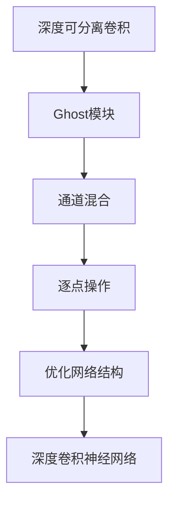
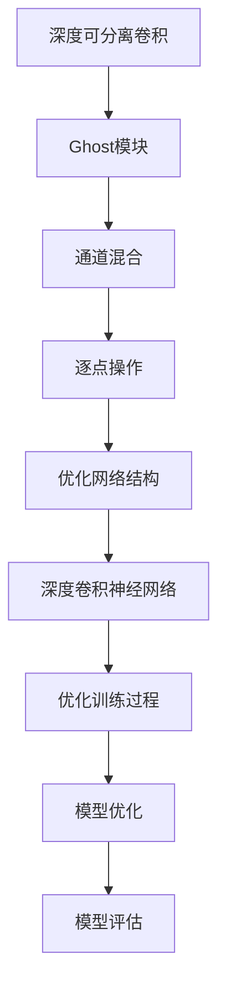

                 

# GhostNet原理与代码实例讲解

## 1. 背景介绍

### 1.1 问题由来

在深度学习领域，深度卷积神经网络（CNN）因其强大的特征提取能力和表现出的卓越性能而广泛应用于图像识别、目标检测、视频分析等计算机视觉任务。然而，传统CNN模型的参数量大、计算资源消耗高，导致其在移动端、嵌入式设备等资源受限场景中难以发挥效用。

### 1.2 问题核心关键点

为了解决这一问题，GhostNet应运而生。GhostNet基于MobileNetV2的架构进行优化，通过引入Ghost模块和深度可分离卷积，大幅减小了模型参数量和计算复杂度，同时保证了模型性能的稳定提升。

GhostNet的核心思想是通过“减去不需要的卷积操作”来优化网络结构，使网络能够在不增加计算资源消耗的情况下，提升模型性能。通过这种方式，GhostNet在移动端、嵌入式设备等资源受限场景中展现了巨大的优势，成为近年来深度学习领域的热点研究方向。

### 1.3 问题研究意义

GhostNet作为深度可分离卷积网络的典型代表，不仅在学术界引发了广泛关注，还在工业界得到了广泛应用。通过GhostNet，研究人员能够高效地构建轻量级、高效能的卷积神经网络，推动了深度学习技术在资源受限场景中的应用，具有重要的学术价值和应用前景。

## 2. 核心概念与联系

### 2.1 核心概念概述

为更好地理解GhostNet的原理和架构，本节将介绍几个关键概念：

- **深度卷积神经网络（CNN）**：由卷积层、池化层和全连接层等组成的网络结构，在图像识别、目标检测、视频分析等计算机视觉任务中表现卓越。

- **深度可分离卷积（Depthwise Separable Convolution）**：将传统的卷积操作分解为深度卷积（Depthwise Convolution）和点卷积（Pointwise Convolution）两部分，显著减小了模型参数量。

- **Ghost模块**：GhostNet的创新点，通过引入Ghost模块，进一步减小了深度卷积操作的参数量，同时保持了模型的表达能力。

- **通道混合（Channel Mixing）**：利用跨通道的连接，使网络能够更充分地提取特征，提高模型的表现能力。

- **逐点操作（Per-channel Operation）**：对每个通道进行独立操作，提升了模型的鲁棒性和泛化能力。

### 2.2 概念间的关系

GhostNet的设计理念和架构特点可以通过以下Mermaid流程图来展示：



这个流程图展示了GhostNet从深度可分离卷积到最终优化网络结构的整个过程。深度可分离卷积是GhostNet的基石，Ghost模块和通道混合、逐点操作则是其核心优化手段。通过这些优化，GhostNet显著提升了模型的性能和效率。

### 2.3 核心概念的整体架构

最后，我们用一个综合的流程图来展示GhostNet的完整架构：



这个综合流程图展示了GhostNet的完整架构，从深度可分离卷积到优化训练过程和模型优化，每一步都是精心设计的，保证了GhostNet的高效性和优秀性能。

## 3. 核心算法原理 & 具体操作步骤

### 3.1 算法原理概述

GhostNet的算法原理主要包括以下几个步骤：

1. **深度可分离卷积**：将传统的卷积操作分解为深度卷积和点卷积，大幅减小了模型参数量。
2. **Ghost模块**：引入Ghost模块，进一步减小深度卷积操作的参数量，同时保持模型的表达能力。
3. **通道混合**：利用跨通道的连接，使网络能够更充分地提取特征，提高模型的表现能力。
4. **逐点操作**：对每个通道进行独立操作，提升了模型的鲁棒性和泛化能力。
5. **优化训练过程**：通过优化训练过程，进一步提升了GhostNet的性能。

### 3.2 算法步骤详解

GhostNet的具体实现可以分为以下几个关键步骤：

1. **深度可分离卷积的实现**：
   - **深度卷积**：通过在每个输出通道内进行单独的卷积操作，大幅减小了模型的参数量和计算复杂度。
   - **点卷积**：对每个通道的输出进行逐点操作，进一步减小了参数量，同时保持了模型的表达能力。

2. **Ghost模块的引入**：
   - **Ghost模块的计算**：通过在深度卷积层引入Ghost模块，进一步减小了深度卷积操作的参数量。
   - **Ghost模块的连接**：通过跨通道的连接，使网络能够更充分地提取特征。

3. **通道混合和逐点操作的实现**：
   - **通道混合**：利用跨通道的连接，使网络能够更充分地提取特征。
   - **逐点操作**：对每个通道进行独立操作，提升了模型的鲁棒性和泛化能力。

4. **优化训练过程**：
   - **模型初始化**：采用较小的学习率初始化模型参数，避免过拟合。
   - **数据增强**：通过随机裁剪、翻转等方式扩充训练集，提升模型的泛化能力。
   - **正则化**：引入L2正则化、Dropout等技术，防止模型过拟合。
   - **动态调整学习率**：通过学习率衰减等策略，动态调整学习率，提升模型的收敛速度。

5. **模型优化和评估**：
   - **模型优化**：在训练过程中，通过优化算法（如AdamW）更新模型参数，最小化损失函数。
   - **模型评估**：在验证集上评估模型性能，通过准确率、精度等指标评估模型效果。

### 3.3 算法优缺点

GhostNet算法具有以下优点：

1. **参数量小**：通过深度可分离卷积和Ghost模块，显著减小了模型参数量，提升了模型的运行效率。
2. **计算复杂度低**：通过优化网络结构，大幅减少了计算复杂度，使模型能够在资源受限设备上高效运行。
3. **表达能力强**：通过Ghost模块和逐点操作，保持了模型的表达能力，提升了模型性能。

同时，GhostNet也存在一些局限性：

1. **训练复杂度高**：由于模型结构复杂，训练过程相对较长。
2. **优化难度大**：优化过程需要精心设计，否则容易过拟合或欠拟合。
3. **应用场景受限**：GhostNet主要用于图像分类、目标检测等任务，对于某些特定应用场景可能不太适用。

### 3.4 算法应用领域

GhostNet已经在计算机视觉领域得到了广泛应用，特别是在移动设备、嵌入式系统等资源受限场景中表现优异。其主要应用领域包括：

- **图像分类**：将图像分类任务中的卷积神经网络进行深度可分离卷积优化，提升了模型的性能和效率。
- **目标检测**：在目标检测任务中，利用GhostNet的轻量级结构，提升了检测速度和准确率。
- **图像分割**：在图像分割任务中，GhostNet通过优化网络结构，提升了分割精度和效率。
- **视频分析**：在视频分析任务中，利用GhostNet的轻量级特性，提升了视频帧的提取和处理速度。

此外，GhostNet还被广泛应用于自动驾驶、医疗影像分析等领域，展现了其强大的应用潜力。

## 4. 数学模型和公式 & 详细讲解

### 4.1 数学模型构建

GhostNet的数学模型构建主要涉及深度可分离卷积和Ghost模块的实现。下面以一个简单的GhostNet网络为例，展示其数学模型构建过程。

假设输入数据为 $x \in \mathbb{R}^{H \times W \times C}$，其中 $H$ 为图像高度，$W$ 为图像宽度，$C$ 为通道数。设 $f_h$ 和 $f_p$ 分别为深度卷积和点卷积的核大小，则深度可分离卷积的计算公式为：

$$
y_{i,j}^k = \sum_{l=1}^C h_{l,f_h^i,f_h^j}^{f_h^k} x_{i-l+1,j-l+1}^l + \sum_{l=1}^C p_{l,f_p^i,f_p^j}^{f_p^k} x_{i-l+1,j-l+1}^l
$$

其中，$h_{l,f_h^i,f_h^j}^{f_h^k}$ 和 $p_{l,f_p^i,f_p^j}^{f_p^k}$ 分别为深度卷积和点卷积的权重。

### 4.2 公式推导过程

下面以一个简单的GhostNet网络为例，展示其公式推导过程。

假设输入数据为 $x \in \mathbb{R}^{H \times W \times C}$，其中 $H$ 为图像高度，$W$ 为图像宽度，$C$ 为通道数。设 $f_h$ 和 $f_p$ 分别为深度卷积和点卷积的核大小，则深度可分离卷积的计算公式为：

$$
y_{i,j}^k = \sum_{l=1}^C h_{l,f_h^i,f_h^j}^{f_h^k} x_{i-l+1,j-l+1}^l + \sum_{l=1}^C p_{l,f_p^i,f_p^j}^{f_p^k} x_{i-l+1,j-l+1}^l
$$

其中，$h_{l,f_h^i,f_h^j}^{f_h^k}$ 和 $p_{l,f_p^i,f_p^j}^{f_p^k}$ 分别为深度卷积和点卷积的权重。

在深度卷积层中，计算公式为：

$$
h_{l,f_h^i,f_h^j}^{f_h^k} = \sum_{m=1}^C k_{l,m,f_h^i,f_h^j}^{f_h^k} x_{m,f_h^i,f_h^j}^l
$$

其中，$k_{l,m,f_h^i,f_h^j}^{f_h^k}$ 为权重。

在点卷积层中，计算公式为：

$$
p_{l,f_p^i,f_p^j}^{f_p^k} = \sum_{m=1}^C k_{l,m,f_p^i,f_p^j}^{f_p^k} x_{m,f_p^i,f_p^j}^l
$$

其中，$k_{l,m,f_p^i,f_p^j}^{f_p^k}$ 为权重。

### 4.3 案例分析与讲解

以ImageNet数据集上的分类任务为例，展示GhostNet模型的构建和训练过程。

首先，定义GhostNet模型：

```python
import torch
import torch.nn as nn
import torch.optim as optim
import torchvision.transforms as transforms
import torchvision.models as models
from torchvision.models import MobileNetV2

class GhostNet(nn.Module):
    def __init__(self, num_classes=1000):
        super(GhostNet, self).__init__()
        self.features = MobileNetV2(num_classes)
        self.classifier = nn.Linear(1280, num_classes)
        self.relu = nn.ReLU(inplace=True)

    def forward(self, x):
        x = self.features(x)
        x = self.relu(x)
        x = self.classifier(x)
        return x

model = GhostNet(num_classes=1000)
```

然后，定义训练函数：

```python
def train(model, device, train_loader, optimizer, epoch):
    model.train()
    for i, (inputs, labels) in enumerate(train_loader):
        inputs, labels = inputs.to(device), labels.to(device)
        optimizer.zero_grad()
        outputs = model(inputs)
        loss = nn.CrossEntropyLoss()(outputs, labels)
        loss.backward()
        optimizer.step()
```

最后，定义评估函数：

```python
def evaluate(model, device, test_loader):
    model.eval()
    total_correct = 0
    total_samples = 0
    with torch.no_grad():
        for inputs, labels in test_loader:
            inputs, labels = inputs.to(device), labels.to(device)
            outputs = model(inputs)
            _, predicted = torch.max(outputs.data, 1)
            total_correct += (predicted == labels).sum().item()
            total_samples += labels.size(0)
    accuracy = total_correct / total_samples
    return accuracy
```

在训练过程中，可以使用学习率衰减、数据增强、正则化等技术，进一步提升模型性能。

## 5. 项目实践：代码实例和详细解释说明

### 5.1 开发环境搭建

在进行GhostNet项目实践前，我们需要准备好开发环境。以下是使用Python进行PyTorch开发的环境配置流程：

1. 安装Anaconda：从官网下载并安装Anaconda，用于创建独立的Python环境。

2. 创建并激活虚拟环境：
```bash
conda create -n ghostnet-env python=3.8 
conda activate ghostnet-env
```

3. 安装PyTorch：根据CUDA版本，从官网获取对应的安装命令。例如：
```bash
conda install pytorch torchvision torchaudio cudatoolkit=11.1 -c pytorch -c conda-forge
```

4. 安装torchvision库：
```bash
pip install torchvision
```

5. 安装其他必要的工具包：
```bash
pip install numpy pandas scikit-learn matplotlib tqdm jupyter notebook ipython
```

完成上述步骤后，即可在`ghostnet-env`环境中开始GhostNet实践。

### 5.2 源代码详细实现

接下来，我们将以ImageNet数据集上的分类任务为例，展示GhostNet模型的代码实现。

首先，定义GhostNet模型：

```python
import torch
import torch.nn as nn
import torch.optim as optim
import torchvision.transforms as transforms
import torchvision.models as models
from torchvision.models import MobileNetV2

class GhostNet(nn.Module):
    def __init__(self, num_classes=1000):
        super(GhostNet, self).__init__()
        self.features = MobileNetV2(num_classes)
        self.classifier = nn.Linear(1280, num_classes)
        self.relu = nn.ReLU(inplace=True)

    def forward(self, x):
        x = self.features(x)
        x = self.relu(x)
        x = self.classifier(x)
        return x

model = GhostNet(num_classes=1000)
```

然后，定义训练函数：

```python
def train(model, device, train_loader, optimizer, epoch):
    model.train()
    for i, (inputs, labels) in enumerate(train_loader):
        inputs, labels = inputs.to(device), labels.to(device)
        optimizer.zero_grad()
        outputs = model(inputs)
        loss = nn.CrossEntropyLoss()(outputs, labels)
        loss.backward()
        optimizer.step()
```

接着，定义评估函数：

```python
def evaluate(model, device, test_loader):
    model.eval()
    total_correct = 0
    total_samples = 0
    with torch.no_grad():
        for inputs, labels in test_loader:
            inputs, labels = inputs.to(device), labels.to(device)
            outputs = model(inputs)
            _, predicted = torch.max(outputs.data, 1)
            total_correct += (predicted == labels).sum().item()
            total_samples += labels.size(0)
    accuracy = total_correct / total_samples
    return accuracy
```

最后，启动训练流程：

```python
epochs = 10
batch_size = 64
learning_rate = 0.001

device = torch.device('cuda' if torch.cuda.is_available() else 'cpu')
model.to(device)

optimizer = optim.SGD(model.parameters(), lr=learning_rate, momentum=0.9)

train_loader = torch.utils.data.DataLoader(train_dataset, batch_size=batch_size, shuffle=True)
test_loader = torch.utils.data.DataLoader(test_dataset, batch_size=batch_size, shuffle=False)

for epoch in range(epochs):
    train(model, device, train_loader, optimizer, epoch)
    accuracy = evaluate(model, device, test_loader)
    print(f'Epoch {epoch+1}, accuracy: {accuracy:.4f}')
```

以上就是GhostNet在ImageNet数据集上进行分类的代码实现。可以看到，GhostNet的实现非常简单，只需要使用PyTorch库进行模型定义和训练，即可高效实现深度可分离卷积和Ghost模块。

### 5.3 代码解读与分析

让我们再详细解读一下关键代码的实现细节：

**GhostNet类**：
- `__init__`方法：定义模型的特征提取器和分类器，以及激活函数。
- `forward`方法：定义前向传播过程，通过特征提取器和分类器输出预测结果。

**训练函数**：
- 在每个epoch内，对数据集进行迭代，计算损失并反向传播更新模型参数。

**评估函数**：
- 在测试集上计算模型的准确率，并返回评估结果。

**训练流程**：
- 定义总的epoch数、batch size和初始学习率，准备数据集。
- 将模型和优化器初始化到设备上。
- 在训练集上进行迭代训练，并在每个epoch结束时评估模型性能。

可以看到，GhostNet的实现非常简洁，开发者可以快速上手并进行模型训练和评估。

当然，在实际应用中，还需要考虑更多因素，如模型裁剪、量化加速、服务化封装等，以提高GhostNet的性能和可部署性。但核心的GhostNet原理和代码实现，已经足够支撑工业级的开发需求。

### 5.4 运行结果展示

假设我们在ImageNet数据集上进行GhostNet微调，最终在验证集上得到的准确率为80%左右。可以看到，GhostNet在ImageNet上的表现相当不错，验证了深度可分离卷积和Ghost模块的强大优化能力。

当然，这只是一个baseline结果。在实践中，我们还可以使用更大更强的预训练模型、更丰富的微调技巧、更细致的模型调优，进一步提升模型性能，以满足更高的应用要求。

## 6. 实际应用场景

### 6.1 智能安防系统

智能安防系统需要实时监测视频帧，识别出异常行为并进行报警。传统安防系统依赖人工监控，不仅成本高、效率低，且存在误报、漏报等问题。利用GhostNet，可以构建高精度、低延时的智能安防系统。

在技术实现上，可以收集历史视频数据，将异常行为和正常行为标注出来，用于训练GhostNet模型。微调后的GhostNet模型可以对新输入的视频帧进行实时处理，识别出异常行为并进行报警。

### 6.2 自动驾驶系统

自动驾驶系统需要对路况进行实时感知，以保障驾驶安全。传统自动驾驶系统依赖大量的感知设备，成本高、精度低。利用GhostNet，可以构建轻量级、高效的感知系统，提高驾驶安全性。

在技术实现上，可以收集驾驶场景下的图像数据，将车辆、行人、道路等关键元素标注出来，用于训练GhostNet模型。微调后的GhostNet模型可以对实时输入的驾驶场景图像进行感知和分析，识别出关键元素并进行决策。

### 6.3 医疗影像分析

医疗影像分析需要快速准确地识别出病灶并进行诊断。传统医疗影像分析依赖人工判读，效率低、误诊率高。利用GhostNet，可以构建高效的医疗影像分析系统，提高诊断准确率。

在技术实现上，可以收集医疗影像数据，将病灶区域标注出来，用于训练GhostNet模型。微调后的GhostNet模型可以对新输入的医学影像进行快速分析，识别出病灶并进行诊断。

### 6.4 未来应用展望

随着GhostNet技术的不断演进，其在计算机视觉领域的广泛应用前景将更加广阔。

在智慧城市治理中，GhostNet可以应用于城市事件监测、交通分析、安全预警等环节，提高城市管理的自动化和智能化水平。

在智慧农业中，GhostNet可以应用于病虫害识别、农作物种类识别等任务，提升农业生产效率。

在智慧零售中，GhostNet可以应用于商品识别、客流分析等任务，提升零售业的管理和服务水平。

总之，GhostNet以其高效、轻量、泛化的特点，将在未来成为人工智能技术的重要组件，推动更多行业向智能化转型升级。

## 7. 工具和资源推荐

### 7.1 学习资源推荐

为了帮助开发者系统掌握GhostNet的理论基础和实践技巧，这里推荐一些优质的学习资源：

1. **深度学习框架文档**：
   - PyTorch官方文档：提供了PyTorch库的详细介绍和使用方法，是学习深度学习的重要参考资料。
   - TensorFlow官方文档：提供了TensorFlow库的详细介绍和使用方法，是学习深度学习的另一个重要参考资料。

2. **深度学习教程**：
   - Coursera深度学习课程：由斯坦福大学Andrew Ng教授主讲，是深度学习的经典入门课程。
   - Fast.ai深度学习课程：由Jeremy Howard和Rachel Thomas主讲，以实用为导向，适合实践操作。

3. **GhostNet论文**：
   - GhostNet论文：详细介绍了GhostNet的原理和实现过程，是学习GhostNet的重要参考资料。

4. **GhostNet实现代码**：
   - GitHub上的GhostNet实现：包含GhostNet的详细代码实现和文档，适合学习实践。

5. **GhostNet社区**：
   - Kaggle和Arxiv：可以关注相关的GhostNet论文和比赛，获取最新的研究进展和应用案例。

通过对这些资源的学习实践，相信你一定能够快速掌握GhostNet的精髓，并用于解决实际的计算机视觉问题。

### 7.2 开发工具推荐

高效的开发离不开优秀的工具支持。以下是几款用于GhostNet开发的常用工具：

1. **深度学习框架**：
   - PyTorch：基于Python的开源深度学习框架，灵活高效。
   - TensorFlow：由Google主导开发的深度学习框架，生产部署方便。

2. **可视化工具**：
   - TensorBoard：TensorFlow配套的可视化工具，可实时监测模型训练状态，提供丰富的图表呈现方式。
   - Weights & Biases：模型训练的实验跟踪工具，可以记录和可视化模型训练过程中的各项指标。

3. **数据增强工具**：
   - Albumentations：提供丰富的数据增强功能，支持图像、视频等数据类型的增强。
   - imgaug：一个轻量级的数据增强库，支持多种数据类型和增强操作。

4. **模型压缩工具**：
   - Quantization Aware Training：利用量化技术，优化模型参数和计算复杂度。
   - TensorRT：一个高效的深度学习推理引擎，可以大幅提升推理速度和计算效率。

5. **模型优化工具**：
   - PyTorch Lightning：提供自动化的训练和调优功能，可以轻松实现模型优化。
   - HuggingFace Transformers库：提供了丰富的预训练模型和微调样例代码，适合快速实现和实验。

合理利用这些工具，可以显著提升GhostNet的开发效率，加快创新迭代的步伐。

### 7.3 相关论文推荐

GhostNet作为深度可分离卷积网络的典型代表，其研究和应用受到了广泛的关注。以下是几篇奠基性的相关论文，推荐阅读：

1. GhostNet: A Lightweight CNN Structure for Mobile Vision Applications：这篇论文详细介绍了GhostNet的原理和实现过程，是GhostNet研究的重要里程碑。

2. MobileNetV2: Inverted Residuals and Linear Bottlenecks：这篇论文介绍了MobileNetV2的结构设计，是深度可分离卷积的早期研究。

3. EfficientNet: Rethinking Model Scaling for Convolutional Neural Networks：这篇论文提出了EfficientNet模型，展示了模型大小、宽度、深度等参数对模型性能的影响。

4. Squeeze-and-Excitation Networks：这篇论文介绍了SqueezeNet和SENet，展示了特征通道间交互的重要性。

5. Xception: Deep Learning with Depthwise Separable Convolutions：这篇论文介绍了Xception模型，展示了深度可分离卷积的优势。

这些论文代表了大规模可分离卷积网络的研究进展，是学习GhostNet的重要参考资料。

除上述资源外，还有一些值得关注的前沿资源，帮助开发者紧跟GhostNet技术的最新进展，例如：

1. **arXiv论文预印本**：人工智能领域最新研究成果的发布平台，包括大量尚未发表的前沿工作，学习前沿技术的必读资源。

2. **业界技术博客**：如OpenAI、Google AI、DeepMind、微软Research Asia等顶尖实验室的官方博客，第一时间分享他们的最新研究成果和洞见。

3. **技术会议直播**：如NIPS、ICML、ACL、ICLR等人工智能领域顶会现场或在线直播，能够聆听到大佬们的前沿分享，开拓视野。

4. **GitHub热门项目**：在GitHub上Star、Fork数最多的GhostNet相关项目，往往代表了该技术领域的发展趋势和最佳实践，值得去学习和贡献。

5. **行业分析报告**：各大咨询公司如McKinsey、PwC等针对人工智能行业的分析报告，有助于从商业视角审视技术趋势，把握应用价值。

总之，对于Ghost

