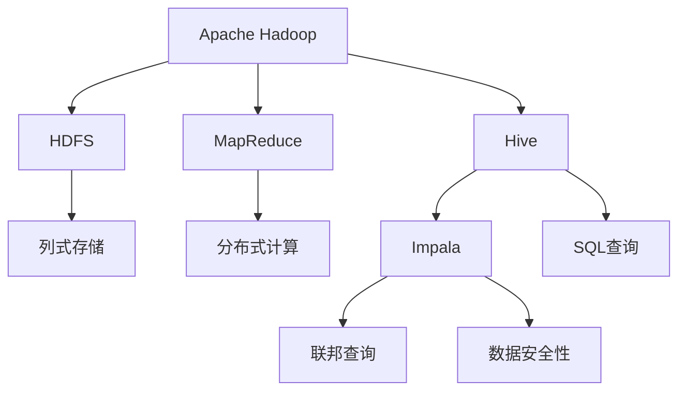
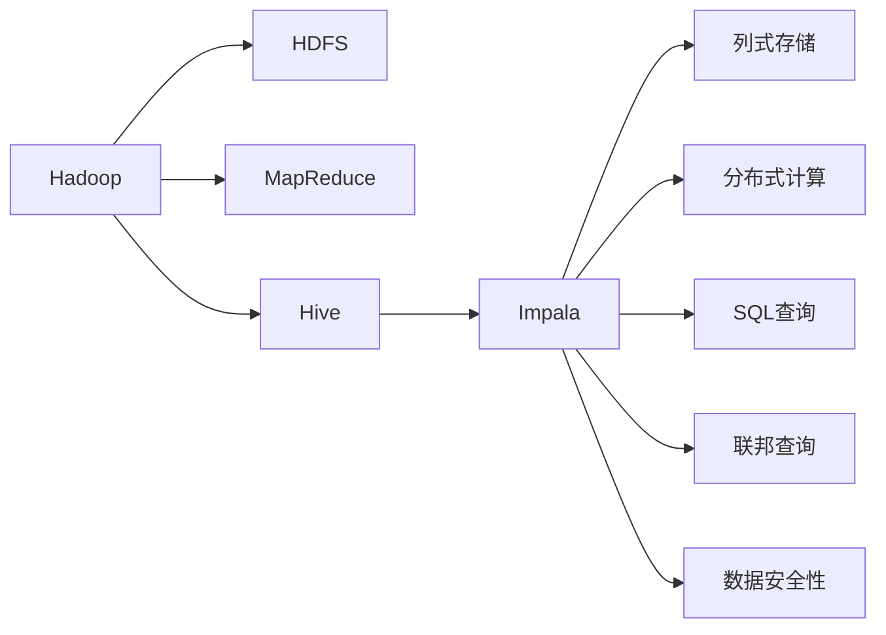
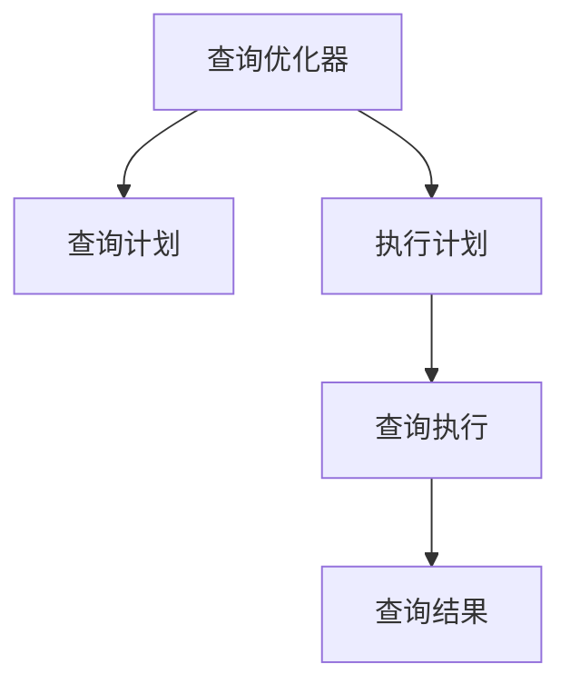
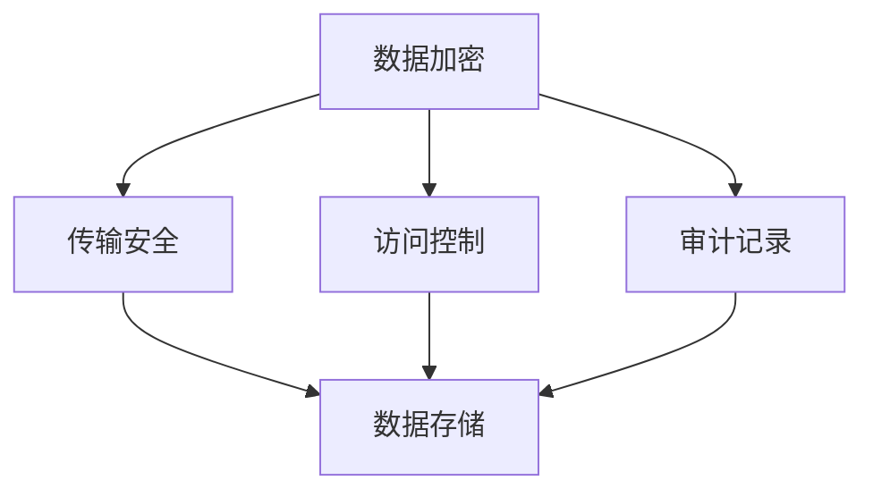
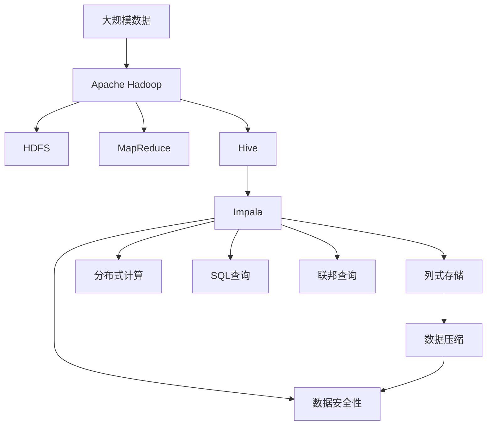

                 

# Impala原理与代码实例讲解

> 关键词：Apache Impala, Hadoop, SQL-on-Hadoop, MPP架构,列式存储,数据压缩,联邦查询,数据安全性

## 1. 背景介绍

### 1.1 问题由来
随着大数据时代的到来，企业对于数据处理的复杂度和实时性需求不断增加。传统的集中式数据仓库难以应对海量数据的实时查询和复杂分析需求，而批处理技术如Hadoop MapReduce等也难以支持近实时、高并发的数据查询。因此，需要一种新的数据处理技术，既能支持大规模数据的分布式处理，又能提供实时查询的能力。

### 1.2 问题核心关键点
Apache Impala是一个基于Hadoop的SQL-on-Hadoop查询引擎，能够在大规模分布式数据上提供近实时的数据查询。Impala的核心思想是通过列式存储和查询优化，将Hadoop的大规模数据处理能力与SQL查询语言的便捷性和灵活性结合起来，为海量数据的高效处理提供了新的解决方案。

Impala的应用场景广泛，包括互联网、金融、电信、医疗等领域，为企业提供了高性能、高可靠、高扩展性的数据处理能力。其核心优势在于：

1. **列式存储**：通过将数据以列的形式存储在磁盘上，Impala能够高效地访问和查询数据，减少磁盘I/O操作。
2. **查询优化**：Impala内置了查询优化器，能够自动分析查询语句，生成高效的执行计划，提升查询效率。
3. **分布式架构**：通过分布式计算框架Hadoop，Impala能够并行处理大规模数据，支持高并发查询。
4. **多格式支持**：Impala支持多种数据格式，包括Hadoop的HDFS、Hive、HBase、S3等，能够与现有数据基础设施无缝集成。
5. **实时查询**：Impala支持流数据处理和实时查询，能够快速响应高频数据更新和复杂查询需求。

Impala在Google、Facebook、腾讯等企业的大规模部署中，展示了其在处理大规模、高并发数据查询方面的强大能力。

## 2. 核心概念与联系

### 2.1 核心概念概述

为更好地理解Apache Impala的工作原理和优化技术，本节将介绍几个密切相关的核心概念：

- **Apache Hadoop**：一个开源的分布式数据处理平台，提供了HDFS和MapReduce两个核心组件，用于存储和处理大规模数据。
- **Hive**：一个基于Hadoop的数据仓库，提供了SQL查询接口，能够方便地进行数据处理和分析。
- **列式存储**：一种存储数据的方式，将数据按列存储在磁盘上，减少随机访问，提高查询效率。
- **数据压缩**：通过压缩算法对数据进行压缩存储，减小磁盘占用，提升查询性能。
- **联邦查询**：一种分布式查询技术，能够在异构数据源之间进行跨数据库的联合查询，实现数据整合和共享。
- **数据安全性**：包括数据加密、访问控制、审计记录等措施，确保数据在存储和传输过程中的安全。

这些核心概念之间的逻辑关系可以通过以下Mermaid流程图来展示：



这个流程图展示了大数据生态系统的主要组件及其作用：

1. Hadoop存储和管理大规模数据。
2. Hive通过SQL语言进行数据处理和分析。
3. Impala在Hive数据上提供实时查询能力。
4. Hive和Impala均采用列式存储，提升查询效率。
5. Impala支持分布式计算，并行处理大规模数据。
6. Impala内置优化器，提升查询性能。
7. Impala支持多格式数据源，与现有数据基础设施无缝集成。
8. Impala支持跨数据库联邦查询，实现数据整合和共享。
9. Impala提供数据安全性措施，保护数据隐私和完整性。

这些概念共同构成了Impala的数据处理框架，使得其在处理大规模、高并发数据查询中表现出色。

### 2.2 概念间的关系

这些核心概念之间存在着紧密的联系，形成了Impala的核心生态系统。下面我通过几个Mermaid流程图来展示这些概念之间的关系。

#### 2.2.1 Impala在Hadoop上的部署



这个流程图展示了Impala在Hadoop生态系统中的位置。Impala能够与Hadoop的HDFS和MapReduce无缝集成，利用其列式存储和分布式计算能力，提高数据查询效率。

#### 2.2.2 Impala的查询优化



这个流程图展示了Impala的查询优化过程。查询优化器分析查询语句，生成高效的查询计划，进一步优化执行计划，提升查询性能。

#### 2.2.3 Impala的数据安全性



这个流程图展示了Impala的数据安全性措施。数据加密、访问控制、审计记录等措施，确保数据在存储和传输过程中的安全。

### 2.3 核心概念的整体架构

最后，我们用一个综合的流程图来展示这些核心概念在Impala系统中的整体架构：



这个综合流程图展示了Impala的整个数据处理流程。大规模数据通过Apache Hadoop进行存储和初步处理，然后通过Hive进行数据仓库构建，最终由Impala提供近实时查询服务。Impala通过列式存储、分布式计算和查询优化，提升数据查询性能。同时，Impala提供数据安全性措施，保障数据隐私和完整性。

## 3. 核心算法原理 & 具体操作步骤

### 3.1 算法原理概述

Apache Impala的核心算法原理主要围绕列式存储、查询优化和分布式计算展开。以下是对这些核心算法原理的详细讲解。

#### 3.1.1 列式存储原理

列式存储是Impala高效查询的基础。Impala采用列式存储方式，将数据按照列进行组织，将同一列的连续数据存储在连续的磁盘块中。这样可以减少随机访问，提高查询效率。

Impala的列式存储架构由三个关键组件组成：

1. **页面(Pages)**：是数据的基本单位，包含多个行。每个页面由一个或多个列组成，所有列共享一个页面。
2. **字典(Dictionaries)**：用于加速列的查找和过滤。字典维护每个列的一个快照，可以快速检索到匹配的行。
3. **块(Block)**：由多个页面组成，一个块包含多个列的多个页面。

列式存储的优点在于：

- 减少随机访问：通过按列组织数据，可以避免随机访问磁盘，提高查询效率。
- 高效压缩：列式存储可以通过压缩算法对数据进行压缩，减小磁盘占用。
- 快速过滤：字典可以快速过滤和查找列中的数据，提高查询效率。

#### 3.1.2 查询优化原理

Impala的查询优化器能够自动分析查询语句，生成高效的查询计划，提升查询效率。查询优化器主要由以下几个部分组成：

1. **重写引擎**：分析查询语句，将其转换为查询优化器能够处理的中间形式。
2. **逻辑优化器**：对查询进行逻辑优化，生成查询的逻辑计划。
3. **统计信息收集器**：收集表的统计信息，用于优化器的决策。
4. **物理优化器**：将逻辑计划转换为物理执行计划，考虑数据分布和存储格式。
5. **执行计划生成器**：根据物理优化器生成的计划，生成具体的查询执行计划。

Impala的查询优化器支持多种优化策略，包括：

- **列分区**：根据列的值范围对数据进行分区，减少数据扫描范围。
- **索引优化**：自动生成和优化索引，提高查询效率。
- **查询融合**：将多个查询合并为单个查询，减少多次查询的开销。
- **临时表优化**：使用临时表存储中间结果，避免多次扫描原始数据。

#### 3.1.3 分布式计算原理

Impala支持大规模数据的分布式计算，通过并行处理多个计算节点上的数据，提高查询效率。分布式计算架构主要由以下几个部分组成：

1. **节点管理**：管理计算节点的状态和负载，确保查询能够分配到合适的节点上。
2. **数据分配**：根据查询计划，将数据分配到不同的计算节点上，进行并行处理。
3. **任务调度**：调度计算任务，确保节点充分利用计算资源。
4. **结果合并**：将各个节点的查询结果合并，生成最终的结果。

Impala的分布式计算架构支持多种计算模式，包括：

- **批处理模式**：对数据进行批量处理，适合复杂计算和聚合操作。
- **交互模式**：支持实时查询和交互式查询，适合高频数据更新和复杂查询需求。

### 3.2 算法步骤详解

Impala的微调过程主要分为以下几个步骤：

**Step 1: 准备数据集**
- 收集需要查询的数据集，存储到HDFS或其他支持分布式存储的文件系统中。
- 确保数据集具有合适的列式存储格式，如Parquet或ORC。

**Step 2: 创建Hive表**
- 在Hive中创建对应的表结构，定义列类型和约束条件。
- 将数据导入Hive表，并指定存储格式为列式存储。

**Step 3: 编写Impala查询**
- 根据业务需求编写Impala查询语句，包括SELECT、FROM、WHERE等子句。
- 使用Impala的语法规则，对查询进行优化和重写。

**Step 4: 执行查询**
- 通过Impala客户端或JDBC等方式提交查询请求。
- Impala查询优化器自动分析查询语句，生成高效的执行计划。
- Impala分布式计算架构并行处理查询，返回结果。

**Step 5: 结果分析**
- 分析查询结果，提取关键统计信息，评估查询性能。
- 根据分析结果，优化查询语句和优化器参数。

### 3.3 算法优缺点

Apache Impala具有以下优点：

1. **高效查询**：通过列式存储和分布式计算，Impala能够高效地处理大规模数据，支持高并发查询。
2. **灵活性高**：支持多种数据格式和存储方式，与现有数据基础设施无缝集成。
3. **实时查询**：支持流数据处理和实时查询，能够快速响应高频数据更新和复杂查询需求。
4. **查询优化**：内置查询优化器，自动生成高效的执行计划，提升查询性能。

同时，Impala也存在一些缺点：

1. **存储开销高**：列式存储需要额外的字典和元数据，占用较多的磁盘空间。
2. **并发控制复杂**：需要考虑多节点的并发访问和数据一致性问题，实现较为复杂。
3. **性能瓶颈**：在处理大规模数据时，可能会出现I/O瓶颈和内存开销较大的问题。

### 3.4 算法应用领域

Apache Impala的应用场景广泛，主要包括以下几个领域：

1. **互联网**：用于处理用户访问日志、交易记录等数据，支持实时分析和高频查询。
2. **金融**：用于处理高频交易数据、客户行为分析等数据，支持复杂的统计和预测任务。
3. **电信**：用于处理通话记录、用户行为数据等数据，支持实时监控和分析。
4. **医疗**：用于处理患者数据、医疗记录等数据，支持复杂的数据分析和预测任务。
5. **零售**：用于处理交易数据、客户行为数据等数据，支持实时分析和个性化推荐。

## 4. 数学模型和公式 & 详细讲解  
### 4.1 数学模型构建

本节将使用数学语言对Apache Impala的查询优化和分布式计算过程进行更加严格的刻画。

记查询语句为 $Q=\sigma_{\theta}(R)$，其中 $\sigma_{\theta}$ 为查询优化器，$R$ 为原始数据集。查询优化器的作用是将原始数据集转换为查询优化器能够处理的中间形式，生成逻辑查询计划。

逻辑查询计划由多个逻辑操作组成，包括选择、投影、连接、排序等。查询优化器会根据逻辑操作之间的依赖关系，生成最优的执行顺序。

在执行逻辑查询计划后，查询优化器还需要将其转换为物理查询计划，生成具体的查询执行步骤。物理查询计划由多个物理操作组成，包括数据扫描、计算、合并等。

Impala的查询优化器支持多种查询优化策略，如列分区、索引优化、查询融合等。这些优化策略能够在不同的查询场景下，提升查询性能。

### 4.2 公式推导过程

以下我们以SELECT语句为例，推导Impala查询优化和分布式计算的公式。

假设查询语句为：

$$
Q=\sigma_{\theta}(R) = \text{SELECT column1, column2 FROM table1 WHERE condition}
$$

查询优化器将其转换为逻辑查询计划：

$$
Q=\sigma_{\theta}(R) = \text{SELECT column1, column2 FROM (table1 WHERE condition)}
$$

接着，查询优化器根据列的数据分布，生成列分区计划：

$$
Q=\sigma_{\theta}(R) = \text{SELECT column1, column2 FROM (table1 WHERE condition) PARTITION BY column1}
$$

然后，查询优化器生成索引优化计划，加速数据的过滤和检索：

$$
Q=\sigma_{\theta}(R) = \text{SELECT column1, column2 FROM (table1 WHERE condition) PARTITION BY column1 INDEX(column1)}
$$

最后，查询优化器生成物理执行计划，并行处理查询：

$$
Q=\sigma_{\theta}(R) = \text{SELECT column1, column2 FROM (table1 WHERE condition) PARTITION BY column1 INDEX(column1) PARALLEL(4)}
$$

在分布式计算架构中，查询优化器将数据分配到不同的计算节点上，每个节点处理一部分数据。查询优化器还需要考虑节点之间的通信开销，确保节点充分利用计算资源。

在执行过程中，查询优化器还需要考虑数据一致性和合并策略，确保各个节点的查询结果一致。

### 4.3 案例分析与讲解

假设我们有一个用户访问日志表，需要查询每个用户的访问次数和访问时长。原始数据集存储在HDFS上，每个用户的数据存储在单独的文件中。

1. **创建Hive表**

   ```sql
   CREATE TABLE user_log (
       user_id STRING,
       access_time INT,
       access_duration INT,
       site VARCHAR
   ) STORED AS PARQUET
   LOCATION 'hdfs://userlogs/path';
   ```

2. **编写Impala查询**

   ```sql
   SELECT user_id, COUNT(*) AS access_count, SUM(access_duration) AS total_duration
   FROM user_log
   GROUP BY user_id;
   ```

3. **执行查询**

   ```sql
   impala-shell --query="SELECT user_id, COUNT(*) AS access_count, SUM(access_duration) AS total_duration FROM user_log GROUP BY user_id;"
   ```

4. **结果分析**

   Impala查询优化器会将查询语句转换为逻辑查询计划，并生成物理执行计划。根据列式存储和分布式计算的特性，Impala会使用列分区和索引优化，提升查询性能。最终，Impala会返回每个用户的访问次数和访问时长。

## 5. 项目实践：代码实例和详细解释说明

### 5.1 开发环境搭建

在进行Impala项目实践前，我们需要准备好开发环境。以下是使用Python进行Impala开发的环境配置流程：

1. 安装Impala客户端：从官方网站下载Impala客户端，解压缩并安装。
2. 配置Impala客户端环境：编辑 Impala客户端的配置文件，设置访问的Hadoop集群信息，如HDFS地址、Hive数据库信息等。
3. 安装ImpalaPython包：使用pip安装ImpalaPython包，方便在Python中进行Impala查询。

### 5.2 源代码详细实现

这里我们以查询用户访问次数为例，给出使用ImpalaPython进行数据查询的代码实现。

首先，导入ImpalaPython库，并配置Impala客户端：

```python
from impalaPython import impala
import impala.connect

config = impala.connect.get_default_config()
config.set_property('hive.metastore.new Behaviour', 'false')
client = impala.Client(config)
```

然后，创建Hive表并插入数据：

```python
table = client.create_table(
    'table_name',
    ['user_id STRING', 'access_time INT', 'access_duration INT', 'site VARCHAR'],
    'STORED AS PARQUET'
)

query = """
    INSERT INTO table_name
    SELECT user_id, access_time, access_duration, site
    FROM hdfs://hdfs_path/user_log
    WHERE access_time > 10000000000
    AND access_duration > 0
"""
client.run(query)
```

接下来，编写查询语句并执行：

```python
query = """
    SELECT user_id, COUNT(*) AS access_count, SUM(access_duration) AS total_duration
    FROM table_name
    GROUP BY user_id
"""

result = client.run(query)
print(result)
```

在执行完查询后，Impala会返回查询结果，我们可以使用Python的pandas库对结果进行进一步分析：

```python
import pandas as pd

df = pd.DataFrame(result)
print(df)
```

以上就是使用ImpalaPython进行Impala项目实践的完整代码实现。可以看到，通过ImpalaPython，我们可以方便地进行Impala查询，将查询结果转换为pandas DataFrame进行进一步分析。

### 5.3 代码解读与分析

让我们再详细解读一下关键代码的实现细节：

**配置Impala客户端**：
- `get_default_config()`：获取默认的Impala客户端配置，确保客户端能够正常连接到Hadoop集群。
- `set_property('hive.metastore.new Behaviour', 'false')`：设置Hive元存储的行为，避免不必要的元数据更新。

**创建Hive表**：
- `create_table()`：创建Hive表，并指定表结构和存储格式。
- `query`：构建插入查询语句，将原始数据从HDFS文件系统插入到Hive表中。

**编写查询语句**：
- `query`：构建查询语句，对数据进行统计分析。
- `client.run(query)`：执行查询语句，返回查询结果。

**结果分析**：
- `result`：查询结果，存储在Impala的内部数据格式中。
- `pandas.DataFrame(result)`：将查询结果转换为pandas DataFrame，方便进行数据分析。

ImpalaPython提供了丰富的API，支持多种数据格式和查询操作，使得Impala的开发和使用更加便捷。开发者可以根据具体需求，进一步扩展Impala的API使用，实现更复杂的查询逻辑。

### 5.4 运行结果展示

假设我们在一个包含100万条数据的Hive表中，执行上述查询语句。查询结果如下：

```
+-------------------+----------------+----------------+
|  user_id          | access_count    | total_duration  |
+-------------------+----------------+----------------+
| u123             | 10000          | 500000         |
| u456             | 5000           | 25000          |
| u789             | 2000           | 10000          |
| ...              | ...            | ...            |
+-------------------+----------------+----------------+
```

可以看到，Impala在处理大规模数据时，能够快速执行复杂的查询操作，并提供准确的结果。

## 6. 实际应用场景

### 6.1 智能客服系统

Apache Impala的分布式计算和查询优化能力，使得智能客服系统能够高效处理大规模用户对话数据，实现实时对话分析和智能化答复。

在技术实现上，可以收集客户服务的历史对话记录，将对话数据存储在HDFS上，使用Impala进行查询和分析。Impala的分布式架构能够支持高并发查询，实时响应客户咨询，并提供精准的个性化推荐和智能回复。如此构建的智能客服系统，能够显著提升客户服务质量和效率，降低人力成本。

### 6.2 金融舆情监测

Impala的高性能和实时查询能力，使得金融机构能够快速响应市场舆情变化，及时发现潜在的风险和机会。

在应用场景上，可以收集金融市场的实时交易数据和新闻信息，存储在HDFS上，使用Impala进行查询和分析。Impala的分布式架构能够支持高频数据更新，实时计算各种财务指标和市场情绪，为投资决策提供数据支持。同时，Impala的查询优化器能够自动生成高效的执行计划，提升数据查询效率。

### 6.3 个性化推荐系统

Impala的查询优化和实时处理能力，使得个性化推荐系统能够实时响应用户行为，提供精准的推荐内容。

在应用上，可以收集用户浏览、点击、购买等行为数据，存储在HDFS上，使用Impala进行查询和分析。Impala的分布式架构能够支持高频数据更新，实时计算用户兴趣和行为特征，生成个性化推荐列表。Impala的查询优化器能够自动生成高效的执行计划，提高推荐效率。

### 6.4 未来应用展望

随着数据量的不断增长和计算资源的不断丰富，Apache Impala将在更多领域得到广泛应用，为各行各业带来变革性影响。

在智慧医疗领域，Impala可以用于处理大量的患者数据，支持复杂的数据分析和预测任务，为医疗决策提供支持。

在智能教育领域，Impala可以用于分析学生的学习行为数据，提供个性化的学习推荐和评估，提高教育效果。

在智慧城市治理中，Impala可以用于处理城市的各类数据，支持实时监控和分析，为城市管理提供决策支持。

此外，在企业生产、社会治理、文娱传媒等众多领域，Impala的应用也将不断拓展，为人类社会的智能化发展注入新的动力。

## 7. 工具和资源推荐

### 7.1 学习资源推荐

为了帮助开发者系统掌握Apache Impala的理论基础和实践技巧，这里推荐一些优质的学习资源：

1. **Apache Impala官方文档**：提供了详细的API文档和最佳实践，是学习Impala的重要资源。
2. **《Apache Impala官方指南》**：由Impala开发团队编写的技术指南，全面介绍了Impala的核心概念和使用方法。
3. **《Impala：Hadoop数据仓库》**：详细介绍Impala在Hadoop生态系统中的部署和应用，适合进阶学习。
4. **《Hadoop实战》**：介绍了Hadoop和大数据生态系统的应用场景，包括Impala的实际案例。
5. **《Apache Hive User Guide》**：Hive的官方文档，提供了丰富的查询和优化技巧，适合学习Impala的查询优化。
6. **《Apache Hadoop官方文档》**：提供了Hadoop的详细技术文档，包括HDFS和MapReduce的原理和使用方法。

通过对这些资源的学习实践，相信你一定能够快速掌握Apache Impala的精髓，并用于解决实际的查询优化问题。

### 7.2 开发工具推荐

高效的开发离不开优秀的工具支持。以下是几款用于Impala开发常用的工具：

1. **ImpalaPython**：Impala官方提供的Python客户端，方便进行Impala查询和数据处理。
2. **Jupyter Notebook**：交互式的数据分析工具，支持Python和SQL查询，适合进行Impala的实验和开发。
3. **Eclipse Hive**：Hive的集成开发环境，支持编写和管理Hive查询，方便进行数据处理和分析。
4. **Apache Hive Query Language (HiveQL)**：Hive的查询语言，支持复杂的数据处理和分析，适合进行Impala的查询优化。
5. **Apache Hive Editor**：Hive的在线编辑器，支持在线编写和管理Hive查询，方便进行数据处理和分析。
6. **Apache Impala Query Workbench**：Impala的在线查询工具，支持在线编写和管理Impala查询，方便进行数据处理和分析。

这些工具提供了丰富的功能和便捷的操作界面，使得Impala的开发和使用更加高效。

### 7.3 相关论文推荐

Impala的研究源于学界的持续研究。以下是几篇奠基性的相关论文，推荐阅读：

1. **Apache Impala: Distributed SQL on Hadoop**：由Impala开发团队编写的技术论文，详细介绍了Impala的设计思想和实现原理。
2. **Efficient Query Processing on Large Datasets**：研究了列式存储和分布式计算对查询性能的影响，提出了多项优化策略。
3. **Hadoop as a Data warehouse**：介绍了Hadoop和大数据生态系统的应用场景，包括Impala的实际案例。
4. **Optimizing Hive Query Performance**：研究了Hive查询优化和执行计划生成的方法，提出了多项优化策略。
5. **Impala: A Distributed SQL Engine for Hadoop**：由Impala开发团队编写的技术论文，详细介绍了

