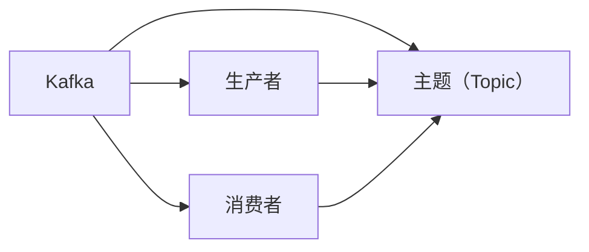

                 

# Kafka生产者消费者API原理与代码实例讲解

> 关键词：Kafka, 生产者消费者API, 异步编程, 消息队列, 数据流处理, 高可用性

## 1. 背景介绍

在分布式系统中，消息队列是一种常用的数据流处理机制，Kafka作为一个开源的分布式流处理平台，提供了稳定可靠的消息传递机制。Kafka的生产者消费者API，允许开发者使用Java或Scala编写自己的消息生产者和消费者。本文将从Kafka生产者消费者API的基本原理入手，详细介绍如何编写高吞吐量、高可靠性的消息生产者和消费者。

## 2. 核心概念与联系

### 2.1 核心概念概述

在深入了解Kafka生产者消费者API之前，我们需要先理解以下几个核心概念：

- **Kafka：**一个分布式的流处理平台，提供高吞吐量、低延迟的数据流处理能力。
- **消息队列：**一种消息传递机制，能够实现解耦、异步、高可靠性等特性。
- **生产者：**将消息发送到Kafka集群中的主题（Topic）。
- **消费者：**从Kafka集群中的主题中读取消息，并进一步处理。
- **异步编程：**利用非阻塞I/O、线程池等技术，提高系统的吞吐量和响应速度。

### 2.2 核心概念间的关系

这些核心概念构成了Kafka消息队列的基础架构，其关系可以通过以下Mermaid流程图来展示：



这个流程图展示了Kafka平台的基本架构，其中Kafka是核心组件，生产者负责将消息发送至 Topic，而消费者从 Topic 中读取消息并进行处理。

## 3. 核心算法原理 & 具体操作步骤

### 3.1 算法原理概述

Kafka生产者消费者API的原理主要基于异步I/O和消息队列模型，允许开发者编写高吞吐量、高可靠性的消息生产者和消费者。其核心思想是通过非阻塞I/O、线程池等技术，实现异步消息传递和处理，提高系统的并发性和可靠性。

### 3.2 算法步骤详解

1. **创建Kafka生产者实例：**
   - 引入Kafka的Java客户端库 `kafka-clients`。
   - 使用 `KafkaProducer` 类创建生产者实例。
   - 配置生产者的参数，如Bootstrap服务器的地址、序列化器类型、消息接收超时时间等。

2. **创建Kafka消费者实例：**
   - 引入Kafka的Java客户端库 `kafka-clients`。
   - 使用 `KafkaConsumer` 类创建消费者实例。
   - 配置消费者的参数，如Bootstrap服务器的地址、消费的主题、键的序列化器、值的序列化器等。

3. **生产者发送消息：**
   - 创建ProducerRecord对象，指定主题、键、值。
   - 调用 `send` 方法将消息发送至Kafka集群。

4. **消费者接收消息：**
   - 在消费者实例中订阅主题。
   - 调用 `poll` 方法接收消息。
   - 处理接收到的消息，调用 `commit` 方法提交消费进度。

### 3.3 算法优缺点

Kafka生产者消费者API的主要优点包括：

- **高吞吐量：**异步I/O和线程池技术使得生产者和消费者可以同时处理大量消息。
- **高可靠性：**消息发送和接收的机制保证了消息的可靠性和持久性。
- **低延迟：**非阻塞I/O和异步处理减少了消息传递和处理的延迟。

其缺点主要在于：

- **复杂性：**生产者和消费者需要编写复杂的异步处理逻辑。
- **延迟不一致：**不同的生产者可能会产生不一致的延迟。

### 3.4 算法应用领域

Kafka生产者消费者API广泛应用于各种分布式系统中，如日志系统、数据管道、事件驱动架构等。常见的应用场景包括：

- 数据采集和聚合：从多个源系统中采集数据，并进行聚合统计。
- 数据分发和通知：将数据分发到多个目标系统中，并发送通知消息。
- 实时流处理：对实时数据流进行处理和分析。

## 4. 数学模型和公式 & 详细讲解 & 举例说明

### 4.1 数学模型构建

Kafka生产者消费者API的数学模型主要基于异步I/O和消息队列模型。生产者发送消息的模型可以表示为：

$$
T_{\text{send}} = \sum_{i=1}^n T_{\text{send},i} + T_{\text{network}}
$$

其中，$T_{\text{send},i}$ 表示第 $i$ 个消息的发送时间，$T_{\text{network}}$ 表示网络传输时间。

消费者的接收模型可以表示为：

$$
T_{\text{receive}} = \sum_{i=1}^n T_{\text{receive},i} + T_{\text{network}}
$$

其中，$T_{\text{receive},i}$ 表示第 $i$ 个消息的接收时间。

### 4.2 公式推导过程

假设生产者和消费者都使用单线程模型，生产者发送消息的平均时间为 $T_{\text{send}}$，消费者接收消息的平均时间为 $T_{\text{receive}}$。生产者的吞吐量为 $T_{\text{throughput}} = \frac{N}{T_{\text{send}}}$，消费者的吞吐量为 $T_{\text{throughput}} = \frac{N}{T_{\text{receive}}}$。由于 $T_{\text{send}}$ 和 $T_{\text{receive}}$ 相互独立，因此生产者和消费者之间的吞吐量比为：

$$
\frac{T_{\text{send}}}{T_{\text{receive}}}
$$

为了最大化吞吐量比，需要优化 $T_{\text{send}}$ 和 $T_{\text{receive}}$。常见的方法包括：

- 生产者采用多线程模型，并行发送消息。
- 消费者使用批量接收和异步处理。

### 4.3 案例分析与讲解

以下是一个简单的Kafka生产者消费者API的案例分析：

**案例：** 在一个订单系统中，生产者负责接收订单信息并发送至Kafka集群，消费者负责从集群中读取订单信息并进行处理。

1. **生产者代码实现：**
   ```java
   import org.apache.kafka.clients.producer.KafkaProducer;
   import org.apache.kafka.clients.producer.ProducerRecord;
   import org.apache.kafka.common.serialization.StringSerializer;

   public class OrderProducer {
       public static void main(String[] args) {
           String bootstrapServers = "localhost:9092";
           String topic = "order-topic";
           KafkaProducer<String, String> producer = new KafkaProducer<>(props);
           producer.send(new ProducerRecord<>(topic, "order1", "value1"));
           producer.send(new ProducerRecord<>(topic, "order2", "value2"));
           producer.flush();
           producer.close();
       }
   }
   ```

2. **消费者代码实现：**
   ```java
   import org.apache.kafka.clients.consumer.KafkaConsumer;
   import org.apache.kafka.clients.consumer.ConsumerRecord;
   import org.apache.kafka.clients.consumer.ConsumerRecords;
   import org.apache.kafka.common.serialization.StringDeserializer;

   public class OrderConsumer {
       public static void main(String[] args) {
           String bootstrapServers = "localhost:9092";
           String topic = "order-topic";
           String groupId = "order-consumer-group";
           KafkaConsumer<String, String> consumer = new KafkaConsumer<>(props);
           consumer.subscribe(Arrays.asList(topic));
           while (true) {
               ConsumerRecords<String, String> records = consumer.poll(Duration.ofMillis(100));
               for (ConsumerRecord<String, String> record : records) {
                   System.out.println(record.value());
                   consumer.commitSync();
               }
           }
       }
   }
   ```

通过以上代码，可以看出生产者如何向Kafka集群发送消息，以及消费者如何从集群中读取消息并进行处理。

## 5. 项目实践：代码实例和详细解释说明

### 5.1 开发环境搭建

要使用Kafka生产者消费者API，需要先搭建Kafka集群，并进行开发环境配置。

1. **安装Kafka：**
   - 从Kafka官网下载最新版本的安装包，解压后进行安装。
   - 启动Kafka集群，包括Zookeeper和Kafka服务。

2. **配置开发环境：**
   - 使用Maven或Gradle引入Kafka的Java客户端库 `kafka-clients`。
   - 配置生产者和消费者的参数，如Bootstrap服务器的地址、序列化器类型、消息接收超时时间等。

### 5.2 源代码详细实现

#### 5.2.1 生产者代码实现：

```java
import org.apache.kafka.clients.producer.KafkaProducer;
import org.apache.kafka.clients.producer.ProducerRecord;
import org.apache.kafka.common.serialization.StringSerializer;

public class OrderProducer {
    public static void main(String[] args) {
        String bootstrapServers = "localhost:9092";
        String topic = "order-topic";
        KafkaProducer<String, String> producer = new KafkaProducer<>(props);
        producer.send(new ProducerRecord<>(topic, "order1", "value1"));
        producer.send(new ProducerRecord<>(topic, "order2", "value2"));
        producer.flush();
        producer.close();
    }
}
```

#### 5.2.2 消费者代码实现：

```java
import org.apache.kafka.clients.consumer.KafkaConsumer;
import org.apache.kafka.clients.consumer.ConsumerRecord;
import org.apache.kafka.clients.consumer.ConsumerRecords;
import org.apache.kafka.common.serialization.StringDeserializer;

public class OrderConsumer {
    public static void main(String[] args) {
        String bootstrapServers = "localhost:9092";
        String topic = "order-topic";
        String groupId = "order-consumer-group";
        KafkaConsumer<String, String> consumer = new KafkaConsumer<>(props);
        consumer.subscribe(Arrays.asList(topic));
        while (true) {
            ConsumerRecords<String, String> records = consumer.poll(Duration.ofMillis(100));
            for (ConsumerRecord<String, String> record : records) {
                System.out.println(record.value());
                consumer.commitSync();
            }
        }
    }
}
```

### 5.3 代码解读与分析

**生产者代码解释：**

- 创建KafkaProducer实例，指定Bootstrap服务器的地址和序列化器类型。
- 发送两条消息至指定Topic。
- 调用`flush`方法刷新缓冲区，确保消息被发送至Kafka集群。
- 调用`close`方法关闭生产者实例。

**消费者代码解释：**

- 创建KafkaConsumer实例，指定Bootstrap服务器的地址、消费的主题、消费者组ID和序列化器类型。
- 订阅指定的Topic。
- 循环接收消息，处理每条消息，并调用`commitSync`方法提交消费进度。

### 5.4 运行结果展示

在运行生产者和消费者代码后，可以使用Kafka命令行工具查看消息的发送和接收情况：

```
kafka-console-producer --topic order-topic --bootstrap-servers localhost:9092
kafka-console-consumer --bootstrap-servers localhost:9092 --topic order-topic --from-beginning --group order-consumer-group
```

生产者输出：

```
Message sent to topic order-topic
Message sent to topic order-topic
```

消费者输出：

```
value1
value2
```

## 6. 实际应用场景

### 6.1 日志系统

在分布式系统中，日志系统是必不可少的组成部分。Kafka生产者消费者API可以用于构建高效、可靠、可扩展的日志系统。通过Kafka集群，日志数据可以实时地发送到日志服务器，并由消费者进行聚合、分析和存储。

### 6.2 数据管道

数据管道是数据流处理的常见方式，Kafka生产者消费者API可以用于构建高效、可靠的数据管道。数据生产者可以将数据源中的数据发送至Kafka集群，数据消费者可以从集群中读取数据并进行处理。

### 6.3 事件驱动架构

事件驱动架构是一种常见的系统设计方式，Kafka生产者消费者API可以用于构建事件驱动的架构。事件生产者可以将事件数据发送至Kafka集群，事件消费者可以从集群中读取事件并进行处理。

### 6.4 未来应用展望

未来，Kafka生产者消费者API将进一步扩展其应用场景，如实时流处理、实时数据分析、实时推荐系统等。Kafka平台也将进一步优化其性能，如支持更高的吞吐量、更低的延迟、更好的容错能力等。

## 7. 工具和资源推荐

### 7.1 学习资源推荐

1. **Kafka官方文档：**Kafka官方提供的详细文档，包括入门教程、API参考、最佳实践等。
2. **《Kafka分布式消息系统》书籍：**一本介绍Kafka核心概念和实现原理的书籍，适合深入学习Kafka的使用。
3. **《Kafka核心技术与实践》课程：**由Kafka开发者讲授的在线课程，涵盖Kafka的核心技术和实践经验。
4. **《Kafka深度剖析》系列文章：**深入剖析Kafka核心机制和架构，适合进阶学习。

### 7.2 开发工具推荐

1. **IntelliJ IDEA：**一款流行的Java IDE，支持Kafka插件，方便开发和调试。
2. **Eclipse：**一款常用的Java IDE，也支持Kafka插件，适合Java开发者使用。
3. **Visual Studio Code：**一款轻量级的代码编辑器，支持Kafka插件，适合Scala开发者使用。

### 7.3 相关论文推荐

1. **"Kafka: Scalable Real-Time Stream Processing"：**Kafka的论文，详细介绍了Kafka的设计原理和实现技术。
2. **"Kafka: High Throughput, Low Latency, Fault Tolerant Messaging"：**Kafka的官方博客文章，介绍了Kafka的高可用性和可靠性设计。
3. **"Building Scalable, Reliable, and Real-Time Stream Processing Systems with Kafka"：**Kafka开发者在ACM上发表的论文，介绍了Kafka的架构和性能优化方法。

## 8. 总结：未来发展趋势与挑战

### 8.1 研究成果总结

Kafka生产者消费者API已经成为分布式系统中的重要技术，广泛应用于日志系统、数据管道、事件驱动架构等领域。通过异步I/O和消息队列模型，Kafka实现了高吞吐量、低延迟、高可靠性的消息传递机制，大大提升了系统的性能和稳定性。

### 8.2 未来发展趋势

未来，Kafka生产者消费者API将进一步扩展其应用场景，如实时流处理、实时数据分析、实时推荐系统等。Kafka平台也将进一步优化其性能，如支持更高的吞吐量、更低的延迟、更好的容错能力等。

### 8.3 面临的挑战

Kafka生产者消费者API仍然面临着一些挑战，如：

1. **性能瓶颈：**在高吞吐量场景下，如何优化生产者和消费者的性能，避免性能瓶颈。
2. **可靠性问题：**在高可用性场景下，如何保证Kafka集群的可靠性和可用性。
3. **数据一致性：**在大规模数据流处理场景下，如何保证数据的一致性和完整性。

### 8.4 研究展望

未来的研究方向包括：

1. **性能优化：**优化Kafka集群和生产者消费者的性能，提升系统的吞吐量和响应速度。
2. **可靠性提升：**提高Kafka集群的可靠性，减少故障和停机时间。
3. **数据一致性保证：**在大规模数据流处理场景下，保证数据的一致性和完整性。
4. **分布式处理：**支持分布式处理模式，提升系统的可扩展性和灵活性。

## 9. 附录：常见问题与解答

**Q1：Kafka生产者消费者API是否适用于所有消息队列场景？**

A: Kafka生产者消费者API适用于高吞吐量、高可靠性的消息队列场景，但对于低延迟、低成本的场景，可能存在更好的选择。

**Q2：Kafka生产者消费者API的性能瓶颈在哪里？**

A: Kafka生产者消费者API的性能瓶颈主要在于生产者和消费者的吞吐量比，以及消息在网络传输过程中的延迟。

**Q3：Kafka生产者消费者API如何保证数据一致性？**

A: Kafka通过使用Raft协议，保证消息的可靠性和一致性。同时，消费者在读取消息后，需要通过`commit`方法提交消费进度，以保证数据的一致性。

**Q4：Kafka生产者消费者API在实际部署中需要注意哪些问题？**

A: Kafka生产者消费者API在实际部署中需要注意配置参数、网络延迟、消息重试等问题。同时，需要合理分配资源，避免资源瓶颈。

---

作者：禅与计算机程序设计艺术 / Zen and the Art of Computer Programming

