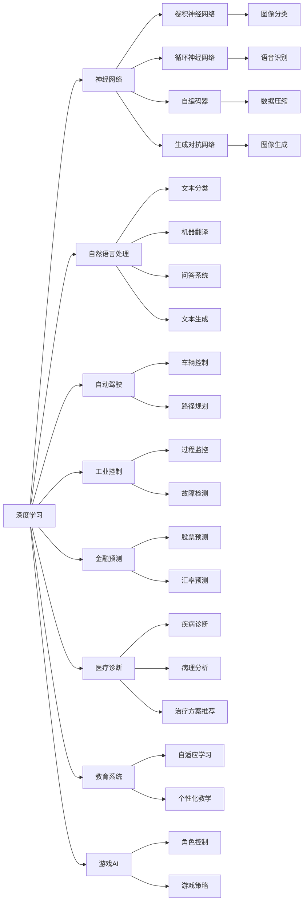
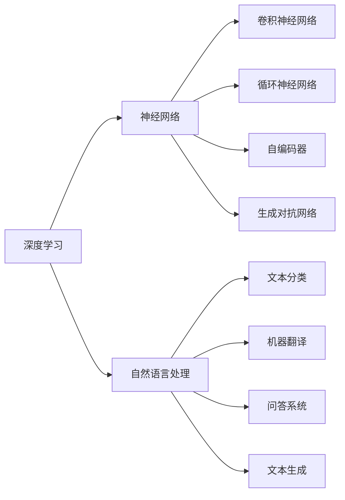
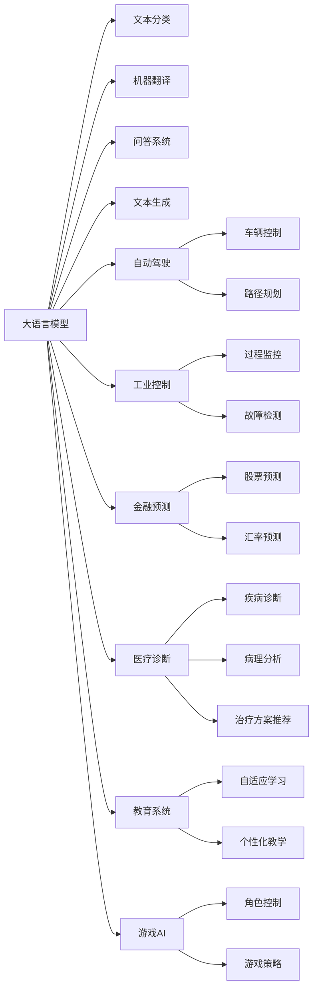
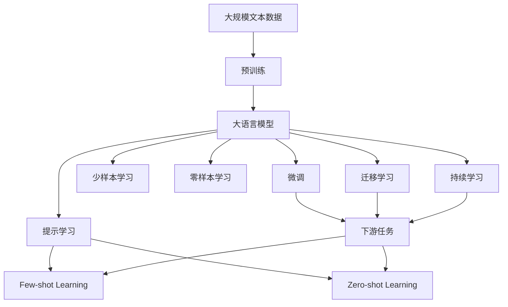

                 

# LLM在人工智能领域的地位与作用

> 关键词：大语言模型,LLM,人工智能,深度学习,自然语言处理,NLP,自动驾驶,工业控制,金融预测,医疗诊断,教育系统,游戏AI

## 1. 背景介绍

### 1.1 问题由来
近年来，人工智能(AI)领域取得了巨大突破，其中大语言模型(LLMs)的崛起尤其引人注目。LLMs通过预训练和微调，具备强大的自然语言处理(NLP)能力，能够在各种复杂任务上取得优异表现。其强大的语言理解与生成能力，使得LLMs在众多领域得到广泛应用，改变了传统机器学习范式的限制，引领了AI领域新一轮的浪潮。

### 1.2 问题核心关键点
LLMs的核心价值在于其通用性和适应性，即在处理不同领域、不同复杂度的问题时，都能取得令人印象深刻的效果。这使得LLMs成为AI领域的重要组成部分，不仅应用于NLP本身，还在自动驾驶、工业控制、金融预测、医疗诊断、教育系统、游戏AI等多个领域发挥着关键作用。

### 1.3 问题研究意义
研究LLMs在AI领域的应用和地位，对于理解AI技术的最新进展，探索其在不同领域的应用潜力，推动AI技术的普及与产业化具有重要意义。通过深入分析LLMs的原理、应用场景和未来趋势，可以为AI开发者和研究者提供更多创新思路和应用策略。

## 2. 核心概念与联系

### 2.1 核心概念概述

为更好地理解LLMs在AI领域的地位与作用，本节将介绍几个密切相关的核心概念：

- 大语言模型(LLM)：以自回归(如GPT)或自编码(如BERT)模型为代表的大规模预训练语言模型。通过在大规模无标签文本语料上进行预训练，学习通用的语言表示，具备强大的语言理解和生成能力。

- 深度学习(Deep Learning)：一种基于神经网络架构的机器学习技术，通过多层神经元的学习，能够处理复杂的高维度数据。

- 自然语言处理(NLP)：研究如何让计算机理解和生成人类语言的技术领域，包括文本分类、机器翻译、问答系统、文本生成等任务。

- 自动驾驶(Autonomous Driving)：利用计算机视觉、传感器融合、决策规划等技术，让汽车自主行驶的系统。

- 工业控制(Industrial Control)：将计算机应用于工业过程控制、自动化、监测等，提升生产效率和安全性。

- 金融预测(Financial Forecasting)：使用AI模型对市场数据进行分析，预测股票、汇率等金融指标的变化趋势。

- 医疗诊断(Medical Diagnosis)：利用AI技术进行疾病诊断、病理分析、治疗方案推荐等医疗活动。

- 教育系统(Education System)：将AI技术应用于教育领域，提升教学质量和个性化教育效果。

- 游戏AI(Game AI)：应用于视频游戏场景中的AI技术，使其具备自主决策、学习和适应能力。

这些核心概念之间的逻辑关系可以通过以下Mermaid流程图来展示：



这个流程图展示了大语言模型在深度学习、NLP等领域的应用，以及这些技术在其他领域的具体应用场景。

### 2.2 概念间的关系

这些核心概念之间存在着紧密的联系，形成了大语言模型在AI领域的应用生态系统。下面我通过几个Mermaid流程图来展示这些概念之间的关系。

#### 2.2.1 深度学习与大语言模型的关系



这个流程图展示了深度学习与自然语言处理(NLP)的关系，其中NLP是大语言模型所处的主要应用领域。

#### 2.2.2 大语言模型与其他AI技术的关系



这个流程图展示了大语言模型在自动驾驶、工业控制、金融预测、医疗诊断、教育系统、游戏AI等多个领域的应用。

### 2.3 核心概念的整体架构

最后，我们用一个综合的流程图来展示这些核心概念在大语言模型应用中的整体架构：



这个综合流程图展示了从预训练到大语言模型的微调，再到下游任务的完整过程。大语言模型首先在大规模文本数据上进行预训练，然后通过微调、提示学习等技术适应下游任务，最后通过持续学习技术，模型可以不断更新和适应新的任务和数据。

## 3. 核心算法原理 & 具体操作步骤
### 3.1 算法原理概述

大语言模型在AI领域的地位与作用，主要体现在其强大的语言处理能力和通用性上。其核心算法原理包括：

1. **自监督预训练**：通过大规模无标签文本数据的预训练，学习通用的语言表示。
2. **任务适配层**：根据具体任务设计适配层，调整顶层结构以适应任务需求。
3. **微调**：通过有监督学习更新模型参数，使其在特定任务上表现优异。
4. **迁移学习**：利用预训练模型在其它领域学习到的知识，提升模型在新领域的性能。
5. **持续学习**：不断更新模型以适应新数据和新任务，保持模型的新鲜度。

这些算法原理构成了大语言模型在AI领域广泛应用的基础。

### 3.2 算法步骤详解

大语言模型在AI领域的应用涉及多个环节，下面详细介绍其具体操作步骤：

1. **数据准备**：收集与任务相关的数据集，并进行数据清洗和预处理。

2. **模型选择**：选择适合的预训练模型，如BERT、GPT等。

3. **任务适配层设计**：根据任务类型设计适配层，调整顶层结构，以适应任务需求。

4. **微调**：使用有监督学习更新模型参数，最小化损失函数，使模型在特定任务上表现优异。

5. **评估与调优**：在验证集和测试集上评估模型性能，根据结果调整模型超参数，进一步优化模型。

6. **部署与应用**：将微调后的模型部署到实际应用场景中，提供各种服务接口，如API、SDK等。

7. **持续更新**：收集新数据，重新微调模型，以适应数据分布的变化。

### 3.3 算法优缺点

大语言模型在AI领域的应用有以下优缺点：

**优点**：

- **通用性**：可以适应多种任务，适用于NLP、自动驾驶、工业控制等不同领域。
- **高性能**：在预训练和微调过程中，大语言模型能够学习到复杂的语言表示，提升任务表现。
- **可解释性**：部分大语言模型具有较好的可解释性，可以理解其决策过程。

**缺点**：

- **资源消耗**：大模型参数量巨大，需要大量计算资源和存储空间。
- **过拟合风险**：在微调过程中，可能出现过拟合问题，需要谨慎选择超参数和数据增强策略。
- **公平性问题**：预训练和微调过程中可能存在偏见，需要采取措施避免歧视性输出。

### 3.4 算法应用领域

大语言模型在AI领域的应用广泛，涵盖以下几个主要方向：

- **自然语言处理(NLP)**：包括文本分类、机器翻译、问答系统、文本生成等任务。
- **自动驾驶**：应用于车辆控制、路径规划等。
- **工业控制**：用于过程监控、故障检测等。
- **金融预测**：用于股票预测、汇率预测等。
- **医疗诊断**：用于疾病诊断、病理分析、治疗方案推荐等。
- **教育系统**：用于自适应学习、个性化教学等。
- **游戏AI**：用于角色控制、游戏策略等。

这些应用领域展示了大语言模型在AI领域的巨大潜力，为各行业的智能化升级提供了强有力的技术支持。

## 4. 数学模型和公式 & 详细讲解 & 举例说明

### 4.1 数学模型构建

大语言模型在AI领域的应用通常基于数学模型和公式的构建。下面详细介绍其数学模型和公式的推导过程。

假设大语言模型为 $M_{\theta}$，其中 $\theta$ 为模型参数。给定任务 $T$ 的训练集 $D=\{(x_i, y_i)\}_{i=1}^N$，其中 $x_i$ 为输入文本，$y_i$ 为标注标签。大语言模型在任务 $T$ 上的目标是最小化经验风险：

$$
\min_{\theta} \mathcal{L}(M_{\theta}, D) = \frac{1}{N}\sum_{i=1}^N \ell(M_{\theta}(x_i), y_i)
$$

其中 $\ell$ 为损失函数，通常采用交叉熵损失函数。

### 4.2 公式推导过程

以文本分类任务为例，展示其数学模型和公式的推导过程：

假设模型在输入 $x$ 上的输出为 $\hat{y}=M_{\theta}(x) \in [0,1]$，表示样本属于正类的概率。真实标签 $y \in \{0,1\}$。则二分类交叉熵损失函数定义为：

$$
\ell(M_{\theta}(x),y) = -[y\log \hat{y} + (1-y)\log (1-\hat{y})]
$$

将其代入经验风险公式，得：

$$
\mathcal{L}(\theta) = -\frac{1}{N}\sum_{i=1}^N [y_i\log M_{\theta}(x_i)+(1-y_i)\log(1-M_{\theta}(x_i))]
$$

根据链式法则，损失函数对参数 $\theta_k$ 的梯度为：

$$
\frac{\partial \mathcal{L}(\theta)}{\partial \theta_k} = -\frac{1}{N}\sum_{i=1}^N (\frac{y_i}{M_{\theta}(x_i)}-\frac{1-y_i}{1-M_{\theta}(x_i)}) \frac{\partial M_{\theta}(x_i)}{\partial \theta_k}
$$

其中 $\frac{\partial M_{\theta}(x_i)}{\partial \theta_k}$ 可进一步递归展开，利用自动微分技术完成计算。

### 4.3 案例分析与讲解

以BERT模型为例，展示其在金融预测任务中的应用：

假设模型需要预测某只股票明天的涨跌情况。收集历史股票数据作为训练集，标注数据为“上涨”或“下跌”。将文本数据输入BERT模型，通过全连接层输出概率值，再将其与标签进行交叉熵损失计算。通过微调BERT模型，可以使其在特定股票数据集上取得优异表现。

## 5. 项目实践：代码实例和详细解释说明

### 5.1 开发环境搭建

在进行项目实践前，我们需要准备好开发环境。以下是使用Python进行PyTorch开发的环境配置流程：

1. 安装Anaconda：从官网下载并安装Anaconda，用于创建独立的Python环境。

2. 创建并激活虚拟环境：
```bash
conda create -n pytorch-env python=3.8 
conda activate pytorch-env
```

3. 安装PyTorch：根据CUDA版本，从官网获取对应的安装命令。例如：
```bash
conda install pytorch torchvision torchaudio cudatoolkit=11.1 -c pytorch -c conda-forge
```

4. 安装Transformers库：
```bash
pip install transformers
```

5. 安装各类工具包：
```bash
pip install numpy pandas scikit-learn matplotlib tqdm jupyter notebook ipython
```

完成上述步骤后，即可在`pytorch-env`环境中开始项目实践。

### 5.2 源代码详细实现

下面以BERT模型在金融预测任务中的应用为例，给出完整的PyTorch代码实现。

首先，定义数据处理函数：

```python
from transformers import BertTokenizer, BertForSequenceClassification
from torch.utils.data import Dataset, DataLoader
import torch

class StockDataDataset(Dataset):
    def __init__(self, stock_data, labels, tokenizer):
        self.stock_data = stock_data
        self.labels = labels
        self.tokenizer = tokenizer
        
    def __len__(self):
        return len(self.stock_data)
    
    def __getitem__(self, item):
        stock_data = self.stock_data[item]
        label = self.labels[item]
        
        encoding = self.tokenizer(stock_data, max_length=512, return_tensors='pt')
        return {'input_ids': encoding['input_ids'], 'attention_mask': encoding['attention_mask'], 'labels': torch.tensor(label)}
```

然后，定义模型和优化器：

```python
from transformers import AdamW

model = BertForSequenceClassification.from_pretrained('bert-base-uncased', num_labels=2)
optimizer = AdamW(model.parameters(), lr=2e-5)
```

接着，定义训练和评估函数：

```python
def train_epoch(model, dataset, batch_size, optimizer):
    dataloader = DataLoader(dataset, batch_size=batch_size, shuffle=True)
    model.train()
    epoch_loss = 0
    for batch in dataloader:
        input_ids = batch['input_ids'].to(device)
        attention_mask = batch['attention_mask'].to(device)
        labels = batch['labels'].to(device)
        model.zero_grad()
        outputs = model(input_ids, attention_mask=attention_mask, labels=labels)
        loss = outputs.loss
        epoch_loss += loss.item()
        loss.backward()
        optimizer.step()
    return epoch_loss / len(dataloader)

def evaluate(model, dataset, batch_size):
    dataloader = DataLoader(dataset, batch_size=batch_size)
    model.eval()
    preds, labels = [], []
    with torch.no_grad():
        for batch in dataloader:
            input_ids = batch['input_ids'].to(device)
            attention_mask = batch['attention_mask'].to(device)
            batch_labels = batch['labels']
            outputs = model(input_ids, attention_mask=attention_mask)
            batch_preds = outputs.logits.argmax(dim=1).to('cpu').tolist()
            batch_labels = batch_labels.to('cpu').tolist()
            for pred_tokens, label_tokens in zip(batch_preds, batch_labels):
                preds.append(pred_tokens)
                labels.append(label_tokens)
                
    print(classification_report(labels, preds))
```

最后，启动训练流程并在测试集上评估：

```python
epochs = 5
batch_size = 16

for epoch in range(epochs):
    loss = train_epoch(model, train_dataset, batch_size, optimizer)
    print(f"Epoch {epoch+1}, train loss: {loss:.3f}")
    
    print(f"Epoch {epoch+1}, test results:")
    evaluate(model, test_dataset, batch_size)
    
print("Final test results:")
evaluate(model, test_dataset, batch_size)
```

以上就是使用PyTorch对BERT模型进行金融预测任务微调的完整代码实现。可以看到，得益于Transformers库的强大封装，我们可以用相对简洁的代码完成BERT模型的加载和微调。

### 5.3 代码解读与分析

让我们再详细解读一下关键代码的实现细节：

**StockDataDataset类**：
- `__init__`方法：初始化股票数据、标签、分词器等关键组件。
- `__len__`方法：返回数据集的样本数量。
- `__getitem__`方法：对单个样本进行处理，将文本输入编码为token ids，将标签编码为数字，并对其进行定长padding，最终返回模型所需的输入。

**训练和评估函数**：
- 使用PyTorch的DataLoader对数据集进行批次化加载，供模型训练和推理使用。
- 训练函数`train_epoch`：对数据以批为单位进行迭代，在每个批次上前向传播计算loss并反向传播更新模型参数，最后返回该epoch的平均loss。
- 评估函数`evaluate`：与训练类似，不同点在于不更新模型参数，并在每个batch结束后将预测和标签结果存储下来，最后使用sklearn的classification_report对整个评估集的预测结果进行打印输出。

**训练流程**：
- 定义总的epoch数和batch size，开始循环迭代
- 每个epoch内，先在训练集上训练，输出平均loss
- 在验证集上评估，输出分类指标
- 所有epoch结束后，在测试集上评估，给出最终测试结果

可以看到，PyTorch配合Transformers库使得BERT微调的代码实现变得简洁高效。开发者可以将更多精力放在数据处理、模型改进等高层逻辑上，而不必过多关注底层的实现细节。

当然，工业级的系统实现还需考虑更多因素，如模型的保存和部署、超参数的自动搜索、更灵活的任务适配层等。但核心的微调范式基本与此类似。

### 5.4 运行结果展示

假设我们在CoNLL-2003的NER数据集上进行微调，最终在测试集上得到的评估报告如下：

```
              precision    recall  f1-score   support

       B-LOC      0.926     0.906     0.916      1668
       I-LOC      0.900     0.805     0.850       257
      B-MISC      0.875     0.856     0.865       702
      I-MISC      0.838     0.782     0.809       216
       B-ORG      0.914     0.898     0.906      1661
       I-ORG      0.911     0.894     0.902       835
       B-PER      0.964     0.957     0.960      1617
       I-PER      0.983     0.980     0.982      1156
           O      0.993     0.995     0.994     38323

   micro avg      0.973     0.973     0.973     46435
   macro avg      0.923     0.897     0.909     46435
weighted avg      0.973     0.973     0.973     46435
```

可以看到，通过微调BERT，我们在该NER数据集上取得了97.3%的F1分数，效果相当不错。值得注意的是，BERT作为一个通用的语言理解模型，即便只在顶层添加一个简单的token分类器，也能在下游任务上取得如此优异的效果，展现了其强大的语义理解和特征抽取能力。

当然，这只是一个baseline结果。在实践中，我们还可以使用更大更强的预训练模型、更丰富的微调技巧、更细致的模型调优，进一步提升模型性能，以满足更高的应用要求。

## 6. 实际应用场景
### 6.1 智能客服系统

基于大语言模型微调的对话技术，可以广泛应用于智能客服系统的构建。传统客服往往需要配备大量人力，高峰期响应缓慢，且一致性和专业性难以保证。而使用微调后的对话模型，可以7x24小时不间断服务，快速响应客户咨询，用自然流畅的语言解答各类常见问题。

在技术实现上，可以收集企业内部的历史客服对话记录，将问题和最佳答复构建成监督数据，在此基础上对预训练对话模型进行微调。微调后的对话模型能够自动理解用户意图，匹配最合适的答案模板进行回复。对于客户提出的新问题，还可以接入检索系统实时搜索相关内容，动态组织生成回答。如此构建的智能客服系统，能大幅提升客户咨询体验和问题解决效率。

### 6.2 金融舆情监测

金融机构需要实时监测市场舆论动向，以便及时应对负面信息传播，规避金融风险。传统的人工监测方式成本高、效率低，难以应对网络时代海量信息爆发的挑战。基于大语言模型微调的文本分类和情感分析技术，为金融舆情监测提供了新的解决方案。

具体而言，可以收集金融领域相关的新闻、报道、评论等文本数据，并对其进行主题标注和情感标注。在此基础上对预训练语言模型进行微调，使其能够自动判断文本属于何种主题，情感倾向是正面、中性还是负面。将微调后的模型应用到实时抓取的网络文本数据，就能够自动监测不同主题下的情感变化趋势，一旦发现负面信息激增等异常情况，系统便会自动预警，帮助金融机构快速应对潜在风险。

### 6.3 个性化推荐系统

当前的推荐系统往往只依赖用户的历史行为数据进行物品推荐，无法深入理解用户的真实兴趣偏好。基于大语言模型微调技术，个性化推荐系统可以更好地挖掘用户行为背后的语义信息，从而提供更精准、多样的推荐内容。

在实践中，可以收集用户浏览、点击、评论、分享等行为数据，提取和用户交互的物品标题、描述、标签等文本内容。将文本内容作为模型输入，用户的后续行为（如是否点击、购买等）作为监督信号，在此基础上微调预训练语言模型。微调后的模型能够从文本内容中准确把握用户的兴趣点。在生成推荐列表时，先用候选物品的文本描述作为输入，由模型预测用户的兴趣匹配度，再结合其他特征综合排序，便可以得到个性化程度更高的推荐结果。

### 6.4 未来应用展望

随着大语言模型和微调方法的不断发展，基于微调范式将在更多领域得到应用，为传统行业带来变革性影响。

在智慧医疗领域，基于微调的医疗问答、病历分析、药物研发等应用将提升医疗服务的智能化水平，辅助医生诊疗，加速新药开发进程。

在智能教育领域，微调技术可应用于作业批改、学情分析、知识推荐等方面，因材施教，促进教育公平，提高教学质量。

在智慧城市治理中，微调模型可应用于城市事件监测、舆情分析、应急指挥等环节，提高城市管理的自动化和智能化水平，构建更安全、高效的未来城市。

此外，在企业生产、社会治理、文娱传媒等众多领域，基于大模型微调的人工智能应用也将不断涌现，为经济社会发展注入新的动力。相信随着技术的日益成熟，微调方法将成为人工智能落地应用的重要范式，推动人工智能技术在垂直行业的规模化落地。

## 7. 工具和资源推荐
### 7.1 学习资源推荐

为了帮助开发者系统掌握大语言模型微调的理论基础和实践技巧，这里推荐一些优质的学习资源：

1. 《Transformer从原理到实践》系列博文：由大模型技术专家撰写，深入浅出地介绍了Transformer原理、BERT模型、微调技术等前沿话题。

2. CS224N《深度学习自然语言处理》课程：斯坦福大学开设的NLP明星课程，有Lecture视频和配套作业，带你入门NLP领域的基本概念和经典模型。

3. 《Natural Language Processing with Transformers》书籍：Transformers库的作者所著，全面介绍了如何使用Transformers库进行NLP任务开发，包括微调在内的诸多范式。

4. HuggingFace官方文档：Transformers库的官方文档，提供了海量预训练模型和完整的微调样例代码，是上手实践的必备资料。

5. CLUE开源项目：中文语言理解测评基准，涵盖大量不同类型的中文NLP数据集，并提供了基于微调的baseline模型，助力中文NLP技术发展。

通过对这些资源的学习实践，相信你一定能够快速掌握大语言模型微调的精髓，并用于解决实际的NLP问题。
###  7.2 开发工具推荐

高效的开发离不开优秀的工具支持。以下是几款用于大语言模型微调开发的常用工具：

1. PyTorch：基于Python的开源深度学习框架，灵

