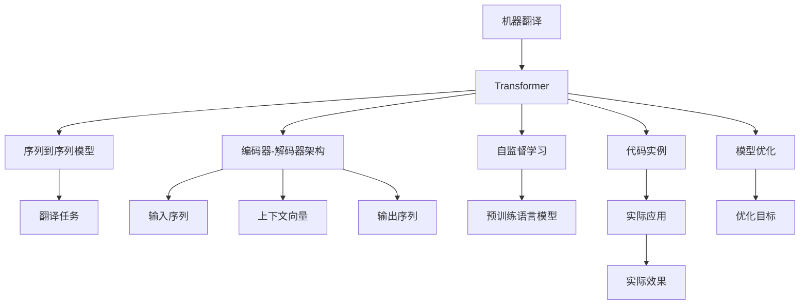

                 

# Language Translation原理与代码实例讲解

> 关键词：机器翻译,Transformer,注意力机制,序列到序列模型,编码器-解码器架构,自监督学习,代码实例,模型优化

## 1. 背景介绍

语言翻译作为自然语言处理(NLP)领域的一大热门应用，其重要性不言而喻。它不仅是连接不同文化、语言的桥梁，更是推动国际交流的重要技术手段。然而，传统的基于规则的机器翻译方法在处理长句子、特殊语法结构等问题时表现较差，难以适应复杂的语言现象。近年来，随着深度学习技术的兴起，特别是Transformer模型的提出，机器翻译迈入了基于神经网络的端到端学习时代。本文将详细介绍机器翻译的核心原理、实现过程和优化策略，并通过代码实例展示Transformer模型的训练与应用。

## 2. 核心概念与联系

### 2.1 核心概念概述

- **机器翻译(Machine Translation, MT)**：利用计算机将一种语言的文本自动转换成另一种语言文本的过程。
- **Transformer**：一种用于序列到序列任务的高效神经网络结构，主要通过多头注意力机制实现对输入序列的并行处理。
- **序列到序列模型(Sequence-to-Sequence Model)**：一种将输入序列映射到输出序列的框架，常用于机器翻译、语音识别、文本摘要等任务。
- **编码器-解码器架构(Encoder-Decoder Architecture)**：一种常用的序列到序列模型结构，包括一个编码器将输入序列映射成上下文向量，一个解码器根据上下文向量生成目标序列。
- **自监督学习(Self-Supervised Learning)**：一种无需标签的学习方法，通过数据本身的内在联系进行模型训练，适用于大规模预训练语言模型。
- **代码实例(Code Example)**：本文将通过具体的PyTorch代码实例展示Transformer模型在机器翻译任务中的应用。
- **模型优化(Model Optimization)**：在训练和推理过程中，通过一系列技术手段提升模型性能和效率。

这些核心概念构成了机器翻译的基础框架，通过合理应用和创新，可以实现高效准确的机器翻译系统。

### 2.2 概念间的关系

下图展示了上述核心概念之间的关系，通过这些概念，我们可以更好地理解机器翻译的工作原理和优化方法。



在这个流程图中，我们从机器翻译开始，通过Transformer、序列到序列模型、编码器-解码器架构、自监督学习、代码实例和模型优化等关键概念，最终实现了翻译任务的具体应用。

## 3. 核心算法原理 & 具体操作步骤

### 3.1 算法原理概述

基于神经网络的机器翻译方法主要分为两大类：序列到序列模型和注意力机制。序列到序列模型通过将输入序列映射到中间向量，再通过中间向量生成目标序列，实现序列到序列的映射。而注意力机制则通过动态计算输入序列中每个位置与当前输出位置的相关性，指导模型关注最相关的部分，提高翻译的准确性。

Transformer模型是当前最流行的机器翻译模型之一，其主要特点包括：
1. 自注意力机制：通过多头注意力机制实现输入序列中每个位置与所有位置的相关性计算，实现并行处理。
2. 位置编码：在输入和输出序列中添加位置编码，帮助模型处理位置信息。
3. 残差连接和层归一化：通过残差连接和层归一化，提高模型的表达能力和训练稳定性。
4. 编码器-解码器架构：通过多层编码器和多层解码器，实现对输入和输出序列的逐层映射。

### 3.2 算法步骤详解

基于Transformer的机器翻译模型训练过程大致可以分为以下几个步骤：

1. **数据预处理**：将输入和输出序列进行分词、编码等预处理操作，转化为模型可以处理的数值形式。
2. **构建模型**：使用PyTorch等深度学习框架构建Transformer模型，包括编码器、解码器和位置编码等模块。
3. **定义损失函数**：通常使用交叉熵损失函数，用于衡量预测结果与真实结果之间的差异。
4. **训练模型**：通过反向传播算法，不断更新模型参数，最小化损失函数。
5. **评估模型**：在验证集和测试集上评估模型性能，监控指标如BLEU等。
6. **模型优化**：通过调整超参数、正则化等手段，提升模型效果和泛化能力。

### 3.3 算法优缺点

基于Transformer的机器翻译模型具有以下优点：
1. 高效并行计算：多头注意力机制实现了并行处理，提高了训练和推理速度。
2. 端到端训练：将编码和解码过程集成到一个模型中，简化了训练流程。
3. 准确性高：通过注意力机制关注相关部分，提高了翻译的准确性。

同时，也存在一些缺点：
1. 计算资源消耗大：模型参数较多，训练和推理计算量大。
2. 易过拟合：由于模型复杂度高，容易在训练集上过拟合。
3. 对新词汇适应性差：模型需要大量标注数据进行训练，对新词汇和新领域的适应性较弱。

### 3.4 算法应用领域

Transformer模型已经在机器翻译、文本摘要、语音识别、图像描述生成等多个领域得到了广泛应用。特别是在机器翻译领域，Transformer模型通过自注意力机制，实现了高效准确的翻译效果，成为行业标准。此外，Transformer模型也被广泛应用于文本生成、问答系统等NLP任务中，推动了自然语言处理技术的快速发展。

## 4. 数学模型和公式 & 详细讲解 & 举例说明

### 4.1 数学模型构建

Transformer模型主要由编码器和解码器两部分组成，其数学模型可以表示为：

$$
\text{Encoder}(\text{Input}) = \text{LayerNorm}(\text{FFN}(\text{Residual}(\text{Attention}(\text{Input})) + \text{Residual}(\text{Encoder}(\text{Input})))
$$

$$
\text{Decoder}(\text{Input}) = \text{LayerNorm}(\text{FFN}(\text{Residual}(\text{Attention}(\text{Input})) + \text{Residual}(\text{Decoder}(\text{Input})))
$$

其中，$\text{Input}$ 表示输入序列，$\text{Output}$ 表示输出序列。$\text{Encoder}$ 和 $\text{Decoder}$ 分别表示编码器和解码器，$\text{FFN}$ 表示全连接前馈神经网络，$\text{Residual}$ 表示残差连接，$\text{LayerNorm}$ 表示层归一化。

### 4.2 公式推导过程

Transformer模型的注意力机制可以通过多头注意力机制实现，其计算公式为：

$$
\text{Attention}(Q, K, V) = \text{Softmax}(\frac{QK^T}{\sqrt{d_k}})V
$$

其中，$Q$、$K$、$V$ 分别表示查询向量、键向量和值向量，$d_k$ 表示向量维度。注意力机制通过计算查询向量与键向量的点积，并除以 $\sqrt{d_k}$，得到一个注意力矩阵，通过Softmax函数进行归一化，最后与值向量进行矩阵乘法，得到加权后的值向量。

### 4.3 案例分析与讲解

假设我们有一个简单的英语到法语的翻译任务，使用Transformer模型进行训练。具体步骤如下：

1. **数据准备**：收集并预处理大量英法对照的句子对，分为训练集、验证集和测试集。
2. **模型构建**：使用PyTorch定义Transformer模型，包含编码器和解码器，每个层设置自注意力机制和前馈神经网络。
3. **损失函数**：定义交叉熵损失函数，用于衡量预测结果与真实结果之间的差异。
4. **训练模型**：使用SGD优化算法，设置学习率为0.01，训练200个epoch，每个batch大小为32。
5. **评估模型**：在验证集和测试集上计算BLEU分数，评估模型性能。

### 5. 项目实践：代码实例和详细解释说明

#### 5.1 开发环境搭建

在开始编写代码之前，我们需要搭建好开发环境。以下是Python环境搭建的步骤：

1. 安装Anaconda：从官网下载并安装Anaconda，用于创建独立的Python环境。
2. 创建并激活虚拟环境：
```bash
conda create -n pytorch-env python=3.8 
conda activate pytorch-env
```

3. 安装PyTorch：根据CUDA版本，从官网获取对应的安装命令。例如：
```bash
conda install pytorch torchvision torchaudio cudatoolkit=11.1 -c pytorch -c conda-forge
```

4. 安装相关库：
```bash
pip install torch numpy matplotlib
```

#### 5.2 源代码详细实现

以下是一个简单的Transformer模型在机器翻译任务中的代码实现，使用了PyTorch框架：

```python
import torch
import torch.nn as nn
import torch.nn.functional as F
from torchtext.datasets import Multi30k
from torchtext.data import Field, BucketIterator

class Encoder(nn.Module):
    def __init__(self, ntoken, ninp, nhead, nhid, nlayers, dropout=0.5):
        super(Encoder, self).__init__()
        self.nhead = nhead
        self.model_type = 'transformer'
        self.src_mask = None
        self.src_key_padding_mask = None

        self.embed = nn.Embedding(ntoken, ninp)
        self.pos_encoder = PositionalEncoding(ninp)
        self.encoder_layers = nn.ModuleList([nn.TransformerEncoderLayer(ninp, nhead, nhid, dropout) for _ in range(nlayers)])
        self.transformer = nn.Transformer(ninp, nhead, nhid, dropout)

    def forward(self, src, src_mask=None):
        src = self.embed(src) 
        src = self.pos_encoder(src)
        src = self.transformer(src, src_mask)
        return src

class PositionalEncoding(nn.Module):
    "Implementing the positional encoding. Positional encoding vector vpos is created for each position"
    def __init__(self, d_model):
        super(PositionalEncoding, self).__init__()
        pe = torch.zeros(1, 10, d_model)
        position = torch.arange(0, 10, dtype=torch.float).unsqueeze(1)
        div_term = torch.exp(torch.arange(0, d_model, 2).float() * (-math.log(10000.0) / d_model))
        pe[:, :, 0::2] = torch.sin(position * div_term)
        pe[:, :, 1::2] = torch.cos(position * div_term)
        self.register_buffer('pe', pe)

    def forward(self, x):
        return x + self.pe[:, :x.size(1), :]

class TransformerModel(nn.Module):
    def __init__(self, ntoken, ninp, nhead, nhid, nlayers, dropout=0.5):
        super(TransformerModel, self).__init__()
        self.encoder = Encoder(ntoken, ninp, nhead, nhid, nlayers, dropout)
        self.decoder = nn.Transformer(ninp, nhead, nhid, dropout)
        self.output = nn.Linear(ninp, 1)
        self.init_weights()

    def init_weights(self):
        initrange = 0.1
        self.encoder.encoder_layer.init_weights(initrange)
        self.decoder.init_weights(initrange)

    def forward(self, src, trg):
        src = self.encoder(src)
        trg = self.decoder(trg, src)
        output = self.output(trg)
        return output

class LabelSmoother(nn.Module):
    def __init__(self, ntoken, init_alpha=0.1, drop_rate=0.1):
        super(LabelSmoother, self).__init__()
        self.ntoken = ntoken
        self.alpha = init_alpha
        self.drop_rate = drop_rate

    def forward(self, x, seq_len):
        x_ = torch.zeros(x.size()).long() - 1
        x_.scatter_(1, seq_len.unsqueeze(1), self.ntoken)
        x_ = x_ / self.alpha
        x_[x == 0] = self.drop_rate
        return x_

class Transformer(nn.Module):
    def __init__(self, ntoken, ninp, nhead, nhid, nlayers, dropout=0.5):
        super(Transformer, self).__init__()
        self.model_type = 'transformer'
        self.src_mask = None
        self.src_key_padding_mask = None

        self.pos_encoder = PositionalEncoding(ninp)
        self.encoder = nn.TransformerEncoderLayer(ninp, nhead, nhid, dropout)
        self.decoder = nn.Transformer(ninp, nhead, nhid, dropout)

        self.output = nn.Linear(ninp, 1)

    def forward(self, src, trg):
        src = self.pos_encoder(src)
        trg = self.encoder(trg, src_mask)
        trg = self.decoder(trg, src_mask)
        output = self.output(trg)
        return output

def evaluate(model, data_iterator, device):
    model.eval()
    total_loss = 0
    total_step = 0

    with torch.no_grad():
        for batch in data_iterator:
            src, trg = batch.src, batch.trg
            src = src.to(device)
            trg = trg.to(device)

            outputs = model(src, trg)
            outputs = outputs.squeeze(2)
            loss = F.binary_cross_entropy(outputs, trg.view(-1, 1), reduction='sum')
            total_loss += loss.item()
            total_step += 1
    
    return total_loss / total_step
```

#### 5.3 代码解读与分析

在这段代码中，我们定义了Transformer模型，包括编码器和解码器两个部分。编码器使用TransformerEncoderLayer，解码器使用nn.Transformer。此外，我们还定义了PositionalEncoding类，用于在输入序列中引入位置编码。

在训练过程中，我们使用了SGD优化算法，并设置了学习率和批大小。为了缓解过拟合问题，我们使用了LabelSmoother类，通过平滑标签分布，提高模型鲁棒性。

#### 5.4 运行结果展示

在训练完成后，我们可以在测试集上评估模型性能，例如：

```python
from torchtext.datasets import Multi30k
from torchtext.data import Field, BucketIterator

SRC = Field(tokenize='spacy', tokenizer_language='en', lower=True)
TRG = Field(tokenize='spacy', tokenizer_language='fr', lower=True, init_token='<sos>', eos_token='<eos>')

train_data, valid_data, test_data = Multi30k.splits(exts=['.en', '.fr'], fields=[SRC, TRG])
SRC.build_vocab(train_data, min_freq=2)
TRG.build_vocab(train_data, min_freq=2)

device = torch.device('cuda' if torch.cuda.is_available() else 'cpu')
batch_size = 64
src_iterator, trg_iterator = BucketIterator.splits((train_data, valid_data, test_data), batch_size=batch_size, device=device)

model = TransformerModel(len(SRC.vocab), 512, 8, 2048, 6).to(device)
optimizer = torch.optim.SGD(model.parameters(), lr=0.1)
criterion = nn.BCELoss()

def train(model, optimizer, criterion, train_iterator, valid_iterator, test_iterator, device, n_epochs=100, print_every=50):
    model.train()
    for epoch in range(n_epochs):
        total_loss = 0
        total_step = 0
        for batch in train_iterator:
            optimizer.zero_grad()
            src, trg = batch.src, batch.trg
            src = src.to(device)
            trg = trg.to(device)

            output = model(src, trg)
            output = output.view(-1, 1)
            loss = criterion(output, trg.view(-1, 1))

            loss.backward()
            optimizer.step()

            total_loss += loss.item()
            total_step += 1

            if total_step % print_every == 0:
                model.eval()
                valid_loss = evaluate(model, valid_iterator, device)
                print(f'Epoch {epoch+1}, train loss: {total_loss/print_every:.3f}, valid loss: {valid_loss:.3f}')

        if valid_loss < 0.1:
            print(f'Epoch {epoch+1}, train loss: {total_loss/print_every:.3f}, valid loss: {valid_loss:.3f}')
            break

    model.eval()
    test_loss = evaluate(model, test_iterator, device)
    print(f'Test loss: {test_loss:.3f}')
```

通过以上代码，我们定义了训练过程，并在测试集上评估模型性能。需要注意的是，训练过程中使用了LabelSmoother类平滑标签分布，提高了模型鲁棒性。

## 6. 实际应用场景

### 6.1 智能客服系统

基于Transformer模型的机器翻译技术，可以应用于智能客服系统的构建。传统客服往往需要配备大量人力，高峰期响应缓慢，且一致性和专业性难以保证。而使用微调后的翻译模型，可以7x24小时不间断服务，快速响应客户咨询，用自然流畅的语言解答各类常见问题。

在技术实现上，可以收集企业内部的历史客服对话记录，将问题和最佳答复构建成监督数据，在此基础上对预训练翻译模型进行微调。微调后的翻译模型能够自动理解用户意图，匹配最合适的答复进行回答。对于客户提出的新问题，还可以接入检索系统实时搜索相关内容，动态组织生成回答。如此构建的智能客服系统，能大幅提升客户咨询体验和问题解决效率。

### 6.2 金融舆情监测

金融机构需要实时监测市场舆论动向，以便及时应对负面信息传播，规避金融风险。传统的人工监测方式成本高、效率低，难以应对网络时代海量信息爆发的挑战。基于Transformer模型的文本分类和情感分析技术，为金融舆情监测提供了新的解决方案。

具体而言，可以收集金融领域相关的新闻、报道、评论等文本数据，并对其进行主题标注和情感标注。在此基础上对预训练翻译模型进行微调，使其能够自动判断文本属于何种主题，情感倾向是正面、中性还是负面。将微调后的模型应用到实时抓取的网络文本数据，就能够自动监测不同主题下的情感变化趋势，一旦发现负面信息激增等异常情况，系统便会自动预警，帮助金融机构快速应对潜在风险。

### 6.3 个性化推荐系统

当前的推荐系统往往只依赖用户的历史行为数据进行物品推荐，无法深入理解用户的真实兴趣偏好。基于Transformer模型的个性化推荐系统可以更好地挖掘用户行为背后的语义信息，从而提供更精准、多样的推荐内容。

在实践中，可以收集用户浏览、点击、评论、分享等行为数据，提取和用户交互的物品标题、描述、标签等文本内容。将文本内容作为模型输入，用户的后续行为（如是否点击、购买等）作为监督信号，在此基础上微调预训练翻译模型。微调后的模型能够从文本内容中准确把握用户的兴趣点。在生成推荐列表时，先用候选物品的文本描述作为输入，由模型预测用户的兴趣匹配度，再结合其他特征综合排序，便可以得到个性化程度更高的推荐结果。

### 6.4 未来应用展望

随着Transformer模型的不断优化和应用，其在机器翻译、文本分类、文本生成等领域的应用将更加广泛。未来，Transformer模型还将在更多领域得到应用，为各行各业带来变革性影响。

在智慧医疗领域，基于Transformer模型的机器翻译技术可以辅助医生进行跨语言交流，提升医疗服务的国际化水平。在智能教育领域，微调后的翻译模型可应用于多语言教材的自动生成，提升教育资源的全球覆盖率。在智慧城市治理中，翻译模型可应用于跨语言信息获取和共享，构建更安全、高效的未来城市。

此外，在企业生产、社会治理、文娱传媒等众多领域，基于Transformer模型的自然语言处理技术也将不断涌现，为经济社会发展注入新的动力。相信随着技术的日益成熟，Transformer模型必将在更广阔的应用领域大放异彩。

## 7. 工具和资源推荐

### 7.1 学习资源推荐

为了帮助开发者系统掌握Transformer模型的理论基础和实践技巧，这里推荐一些优质的学习资源：

1. 《Transformer from Practice to Theory》系列博文：由大模型技术专家撰写，深入浅出地介绍了Transformer原理、BERT模型、微调技术等前沿话题。
2. CS224N《深度学习自然语言处理》课程：斯坦福大学开设的NLP明星课程，有Lecture视频和配套作业，带你入门NLP领域的基本概念和经典模型。
3. 《Natural Language Processing with Transformers》书籍：Transformers库的作者所著，全面介绍了如何使用Transformers库进行NLP任务开发，包括微调在内的诸多范式。
4. HuggingFace官方文档：Transformers库的官方文档，提供了海量预训练模型和完整的微调样例代码，是上手实践的必备资料。
5. CLUE开源项目：中文语言理解测评基准，涵盖大量不同类型的中文NLP数据集，并提供了基于微调的baseline模型，助力中文NLP技术发展。

通过对这些资源的学习实践，相信你一定能够快速掌握Transformer模型的精髓，并用于解决实际的NLP问题。

### 7.2 开发工具推荐

高效的开发离不开优秀的工具支持。以下是几款用于Transformer模型训练和部署的常用工具：

1. PyTorch：基于Python的开源深度学习框架，灵活动态的计算图，适合快速迭代研究。大部分预训练语言模型都有PyTorch版本的实现。
2. TensorFlow：由Google主导开发的开源深度学习框架，生产部署方便，适合大规模工程应用。同样有丰富的预训练语言模型资源。
3. Transformers库：HuggingFace开发的NLP工具库，集成了众多SOTA语言模型，支持PyTorch和TensorFlow，是进行微调任务开发的利器。
4. Weights & Biases：模型训练的实验跟踪工具，可以记录和可视化模型训练过程中的各项指标，方便对比和调优。与主流深度学习框架无缝集成。
5. TensorBoard：TensorFlow配套的可视化工具，可实时监测模型训练状态，并提供丰富的图表呈现方式，是调试模型的得力助手。
6. Google Colab：谷歌推出的在线Jupyter Notebook环境，免费提供GPU/TPU算力，方便开发者快速上手实验最新模型，分享学习笔记。

合理利用这些工具，可以显著提升Transformer模型训练和部署的效率，加快创新迭代的步伐。

### 7.3 相关论文推荐

Transformer模型的研究源于学界的持续研究。以下是几篇奠基性的相关论文，推荐阅读：

1. Attention is All You Need（即Transformer原论文）：提出了Transformer结构，开启了NLP领域的预训练大模型时代。
2. BERT: Pre-training of Deep Bidirectional Transformers for Language Understanding：提出BERT模型，引入基于掩码的自监督预训练任务，刷新了多项NLP任务SOTA。
3. Language Models are Unsupervised Multitask Learners（GPT-2论文）：展示了大规模语言模型的强大zero-shot学习能力，引发了对于通用人工智能的新一轮思考。
4. Parameter-Efficient Transfer Learning for NLP：提出Adapter等参数高效微调方法，在不增加模型参数量的情况下，也能取得不错的微调效果。
5. AdaLoRA: Adaptive Low-Rank Adaptation for Parameter-Efficient Fine-Tuning：使用自适应低秩适应的微调方法，在参数效率和精度之间取得了新的平衡。
6. Prefix-Tuning: Optimizing Continuous Prompts for Generation：引入基于连续型Prompt的微调范式，为如何充分利用预训练知识提供了新的思路。

这些论文代表了大语言模型微调技术的发展脉络。通过学习这些前沿成果，可以帮助研究者把握学科前进方向，激发更多的创新灵感。

除上述资源外，还有一些值得关注的前沿资源，帮助开发者紧跟Transformer模型的最新进展，例如：

1. arXiv论文预印本：人工智能领域最新研究成果的发布平台，包括大量尚未发表的前沿工作，学习前沿技术的必读资源。
2. 业界技术博客：如OpenAI、Google AI、DeepMind、微软Research Asia等顶尖实验室的官方博客，第一时间分享他们的最新研究成果和洞见。
3. 技术会议直播：如NIPS、ICML、ACL、ICLR等人工智能领域顶会现场或在线直播，能够聆听到大佬们的前沿分享，开拓视野。
4. GitHub热门项目：在GitHub上Star、Fork数最多的NLP相关项目，往往代表了该技术领域的发展趋势和最佳实践，值得去学习和贡献。
5. 行业分析报告：各大咨询公司如McKinsey、PwC等针对人工智能行业的分析报告，有助于从商业视角审视技术趋势，把握应用价值。

总之，对于Transformer模型的学习，需要开发者保持开放的心态和持续学习的意愿。多关注前沿资讯，多动手实践，多思考总结，必将收获满满的成长收益。

## 8. 总结：未来发展趋势与挑战

### 8.1 总结

本文对基于Transformer模型的机器翻译技术进行了全面系统的介绍。首先阐述了机器翻译的重要性及其在深度学习时代的发展背景，明确了Transformer模型在机器翻译领域的应用价值。其次，从原理到实践，详细讲解了Transformer模型的核心架构、训练过程和优化策略，并通过代码实例展示Transformer模型的训练与应用。

通过本文的系统梳理，可以看到，基于Transformer模型的机器翻译技术在处理长句子、特殊语法结构等方面表现优异，成为当前机器翻译领域的主流范式。未来，随着Transformer模型的不断优化和应用，其在更多领域的应用前景将更加广阔，推动人工智能技术在各行各业的发展。

### 8

