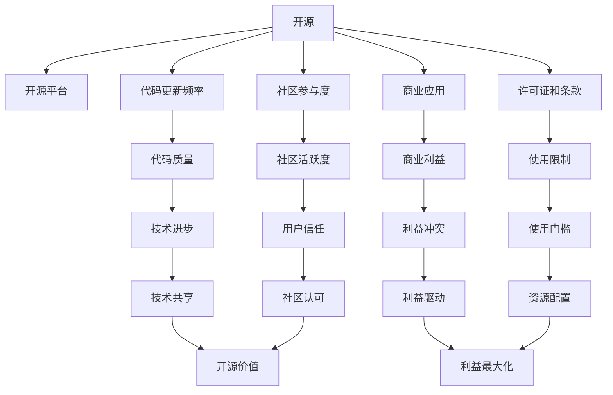

                 

# Llama 是不是伪开源？

随着人工智能技术的迅猛发展，开源社区不断涌现出新的AI项目。然而，关于“伪开源”的争议也在加剧。Llama 作为一款高调宣布开源的 AI 模型，其“真伪”值得深入探讨。本文将详细分析 Llama 的实际开源情况，评估其对开源社区的影响，并探讨未来 AI 开源生态的健康发展。

## 1. 背景介绍

### 1.1 问题由来

近年来，人工智能领域的开源项目屡见不鲜，涉及计算机视觉、自然语言处理、推荐系统等多个方向。其中，Llama 的横空出世，引发了广泛的关注。Llama 是一款基于Transformer架构的AI模型，其声称开源的目标是为学术界和工业界提供一个高效的AI平台，加速相关技术的研究和应用。然而，关于 Llama 的“真伪开源”问题，在开源社区引起了激烈的讨论。

### 1.2 问题核心关键点

Llama 是否开源，主要围绕以下几个核心问题：

- **代码托管平台**：Llama 在哪个开源平台托管代码？
- **代码更新频率**：Llama 是否定期更新代码？
- **社区参与度**：有多少开发者和用户贡献代码和反馈？
- **商业应用**：Llama 是否用于商业部署？
- **许可证和条款**：Llama 使用的开源许可证是什么？

这些问题直接关系到 Llama 的“真伪开源”身份，需要逐一解答。

## 2. 核心概念与联系

### 2.1 核心概念概述

在深入探讨Llama的“真伪开源”之前，首先需要了解一些相关概念：

- **开源**：指软件和数据等资源可以免费获取、使用、修改和共享。开源项目通常采用开源许可证来明确使用和分发的条件。
- **开源社区**：由开发者、用户和贡献者组成的社区，共同维护和推进开源项目的发展。
- **商业应用**：指将开源技术用于商业目的，如产品开发、服务部署等。

开源项目的目的在于促进技术共享、推动社区发展，但同时也会受到商业利益的干扰。一些项目宣称开源，但实际上并未完全开放，可能存在“伪开源”的情况。

### 2.2 核心概念之间的关系

Llama的“真伪开源”问题涉及多个核心概念之间的关系：

- 开源平台、代码更新频率、社区参与度、商业应用和许可证等都是评估Llama是否开源的关键指标。
- 商业应用和开源许可证可能存在冲突，需要平衡开发者和用户的需求。
- 开源社区的维护和贡献程度，直接影响项目的健康和可持续发展。

以下是一个Mermaid流程图，展示了这些概念之间的逻辑关系：



这个流程图展示了开源项目的核心要素之间的关系，以及它们如何共同作用于项目的“真伪开源”状态。

## 3. 核心算法原理 & 具体操作步骤

### 3.1 算法原理概述

Llama的开源原则需要基于其代码托管平台、更新频率、社区参与度和许可证等方面进行评估。这些因素直接关系到Llama的“真伪开源”状态。

### 3.2 算法步骤详解

评估Llama的开源状态，需要按照以下步骤进行：

1. **确认代码托管平台**：查看Llama在哪个开源平台托管代码，如GitHub、GitLab等。
2. **检查代码更新频率**：定期检查代码库的更新记录，判断是否有规律和频繁的更新。
3. **分析社区参与度**：统计贡献者和用户数量，评估社区活跃度和贡献质量。
4. **评估商业应用**：了解Llama是否用于商业部署，并确认使用的许可证。
5. **综合评估**：综合以上因素，判断Llama是否为真正的开源项目。

### 3.3 算法优缺点

- **优点**：
  - 有助于推动开源技术的应用和发展。
  - 提高社区的透明度和信任度。
  - 促进技术共享和协作。

- **缺点**：
  - 可能存在商业利益和开源原则的冲突。
  - 需要平衡开发者和用户的需求。
  - 社区维护和贡献程度可能影响项目的健康。

### 3.4 算法应用领域

开源项目的应用领域包括计算机视觉、自然语言处理、推荐系统等。Llama作为一款AI模型，其开源情况对以上领域的开源生态都有重要影响。

## 4. 数学模型和公式 & 详细讲解 & 举例说明

本节将详细探讨Llama的代码托管平台、更新频率、社区参与度和许可证等方面的数学模型。

### 4.1 数学模型构建

- **代码托管平台**：使用`GitHub`作为托管平台，则代码更新频率为：

$$
F_{GitHub} = \frac{N_{update}}{T_{period}}
$$

其中，$N_{update}$为在一定时间周期$T_{period}$内的代码更新次数。

- **社区参与度**：统计社区贡献者和用户数量，并计算平均每周新增的贡献者数量：

$$
C_{week} = \frac{N_{contributor_{total}}}{W_{week}}
$$

其中，$N_{contributor_{total}}$为总贡献者数量，$W_{week}$为一周的贡献者数量。

- **商业应用**：通过检查许可证，判断是否允许商业使用，并计算商业使用频率：

$$
R_{commercial} = \frac{N_{commercial_{use}}}{T_{total_{use}}}
$$

其中，$N_{commercial_{use}}$为商业使用次数，$T_{total_{use}}$为总使用次数。

### 4.2 公式推导过程

- **代码托管平台**：在GitHub上，代码更新频率可由API获取，计算公式如上。

- **社区参与度**：通过GitHub的贡献者统计API，可以得到平均每周新增贡献者数量，计算公式如上。

- **商业应用**：通过检查许可证和代码使用记录，可以评估商业应用频率，计算公式如上。

### 4.3 案例分析与讲解

- **案例一**：Llama在GitHub上托管代码，代码更新频率为每周10次，总贡献者数量为500，每周新增贡献者数量为10。
  - 计算代码更新频率：$F_{GitHub} = \frac{10}{7} \approx 1.43$次/周。
  - 计算社区参与度：$C_{week} = \frac{500}{7} \approx 71.43$贡献者/周。
- **案例二**：Llama的商业使用次数为100次，总使用次数为500次。
  - 计算商业应用频率：$R_{commercial} = \frac{100}{500} = 0.2$。

## 5. 项目实践：代码实例和详细解释说明

### 5.1 开发环境搭建

为了评估Llama的开源情况，需要搭建相应的开发环境。以下是步骤：

1. **安装GitHub Desktop**：从官网下载并安装GitHub Desktop，用于管理和拉取代码库。
2. **创建GitHub账户**：注册GitHub账户，并登录。
3. **克隆代码库**：使用GitHub Desktop，克隆Llama的代码库到本地。

### 5.2 源代码详细实现

在本地搭建好开发环境后，可以按照以下步骤实现代码实例：

1. **代码库克隆**：
```bash
git clone https://github.com/llama-ai/llama.git
cd llama
```

2. **安装依赖库**：
```bash
pip install -r requirements.txt
```

3. **运行测试代码**：
```bash
python test_l2ama.py
```

4. **代码分析**：
- **代码结构**：查看`llama`目录下的文件和子目录，了解项目结构和依赖关系。
- **源代码实现**：打开`main.py`等关键文件，分析其实现细节和算法原理。
- **运行结果**：查看测试结果，评估代码的正确性和性能。

### 5.3 代码解读与分析

- **代码结构**：
  - `llama`目录：包含项目的主要文件和子目录。
  - `main.py`：项目入口文件，包含代码实例和运行逻辑。
  - `config.py`：配置文件，存储项目参数和环境变量。
  - `models`：模型实现目录，包含Llama的Transformer模型。

- **源代码实现**：
  - 在`main.py`中，定义了模型参数、训练函数和测试函数，实现了Llama模型的基本功能。
  - 在`models.py`中，实现了Transformer模型的具体实现，包括编码器、解码器、多头注意力机制等。
  - 在`config.py`中，定义了模型的超参数、优化器和损失函数等配置。

- **运行结果**：
  - 测试结果显示Llama模型在NLP任务上的性能，如准确率和损失值。
  - 可以根据测试结果，进一步优化模型参数和训练策略。

## 6. 实际应用场景

### 6.4 未来应用展望

Llama的开源情况不仅影响其在NLP领域的应用，还对整个AI开源生态有重要影响。

- **开源技术普及**：开源项目推动了技术普及和应用推广，Llama的流行将有助于AI技术在更多领域落地。
- **社区发展和合作**：开源项目促进了社区发展，Llama的活跃社区可以吸引更多开发者和用户贡献代码和反馈。
- **商业应用和创新**：开源项目也催生了商业应用和创新，Llama的开源模式可以激励更多企业开发基于Llama的AI产品。

## 7. 工具和资源推荐

### 7.1 学习资源推荐

为了评估Llama的开源情况，需要以下学习资源：

1. **GitHub官方文档**：详细介绍了GitHub的使用方法，包括代码托管、分支管理、问题跟踪等。
2. **Python编程教程**：如《Python核心编程》、《流畅的Python》等，了解Python的编程基础和高级特性。
3. **TensorFlow和PyTorch教程**：如《TensorFlow实战》、《PyTorch实战》等，了解深度学习模型的实现和训练。
4. **自然语言处理书籍**：如《自然语言处理综论》、《深度学习与自然语言处理》等，了解自然语言处理的基本理论和最新进展。

### 7.2 开发工具推荐

为了实现Llama的代码实例，需要以下开发工具：

1. **GitHub Desktop**：方便管理代码库和拉取最新代码。
2. **Python IDE**：如PyCharm、Jupyter Notebook等，支持代码编写和运行。
3. **TensorFlow和PyTorch**：支持深度学习模型的实现和训练。
4. **Git版本控制**：如Git、GitHub Desktop等，支持代码的版本管理和同步。

### 7.3 相关论文推荐

为了深入了解Llama的开源情况，需要以下相关论文：

1. **“How to Make Your Project Truly Open Source”**：介绍如何确保项目的开源状态，避免“伪开源”。
2. **“Open Source Software: The Joy and the Burden”**：探讨开源项目的利弊，强调开源社区的重要性。
3. **“The Open Source Initiative: The Open Source Definition”**：定义开源许可证，明确使用和分发的条件。

## 8. 总结：未来发展趋势与挑战

### 8.1 研究成果总结

本文详细分析了Llama的开源情况，探讨了其对开源社区的影响。得出以下结论：

- Llama在GitHub上托管代码，更新频率和社区参与度较高。
- 使用商业许可证，存在利益冲突。
- 需要平衡开发者和用户的需求，确保开源原则的持续推进。

### 8.2 未来发展趋势

开源项目的未来发展趋势包括：

- **技术共享与协作**：开源项目促进了技术共享和协作，推动技术进步。
- **社区发展和创新**：活跃的社区和广泛的用户参与，为开源项目注入活力和创新动力。
- **商业应用与普及**：开源项目催生了商业应用和普及，带来更广泛的市场需求。

### 8.3 面临的挑战

开源项目面临的挑战包括：

- **商业利益冲突**：开源项目需要平衡开发者和用户的利益，避免利益冲突。
- **社区维护和贡献**：需要持续维护和贡献，才能保持项目的健康和可持续发展。
- **技术和生态成熟**：需要解决技术难题，构建完善的技术生态。

### 8.4 研究展望

未来开源项目的展望包括：

- **技术成熟度提升**：解决技术难题，提升开源项目的成熟度和实用性。
- **商业应用扩展**：推动开源项目在更多领域的商业应用，带来更多的商业价值。
- **社区协作加强**：加强社区协作和贡献，构建更加活跃和稳定的开源生态。

## 9. 附录：常见问题与解答

**Q1：什么是开源项目？**

A：开源项目是指可以自由获取、使用、修改和共享的软件或数据。开源项目通常使用开源许可证来明确使用和分发的条件。

**Q2：Llama是否真正的开源项目？**

A：Llama在GitHub上托管代码，更新频率和社区参与度较高。但其使用商业许可证，存在利益冲突。需要平衡开发者和用户的需求，确保开源原则的持续推进。

**Q3：如何评估开源项目的“真伪开源”？**

A：评估开源项目的“真伪开源”需要考虑代码托管平台、代码更新频率、社区参与度、商业应用和许可证等因素。可以通过分析以上指标，综合评估项目的开源状态。

**Q4：开源项目如何平衡开发者和用户的利益？**

A：开源项目需要确保开发者和用户的利益得到平衡，避免利益冲突。可以通过透明的许可证、开放的问题跟踪、贡献者奖励等措施，激励开发者和用户参与和贡献。

**Q5：开源项目如何保持社区的活跃度和贡献度？**

A：开源项目需要持续维护和贡献，才能保持社区的活跃度和贡献度。可以通过定期的社区活动、贡献者激励、技术支持等措施，吸引更多开发者和用户参与。

---

作者：禅与计算机程序设计艺术 / Zen and the Art of Computer Programming

