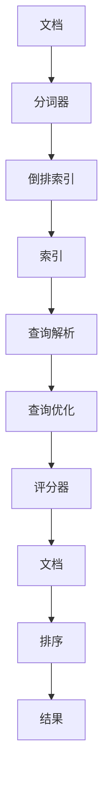

                 

# Lucene原理与代码实例讲解

## 1. 背景介绍

### 1.1 问题由来
在搜索引擎领域，Lucene是一个广泛使用的开源搜索引擎库，它提供了强大的全文检索能力，被广泛应用于各种搜索引擎系统。由于其高效性、可扩展性和易用性，Lucene已经成为了Java平台上最流行的搜索引擎库之一。

近年来，随着大数据、人工智能等技术的发展，搜索引擎应用场景越来越多样化，需要支持更复杂的查询需求和更大的数据集。同时，随着移动端应用的普及，客户端的搜索需求也越来越频繁，对搜索的速度和准确性提出了更高的要求。在这样的背景下，Lucene的内部结构和实现机制逐渐成为人们关注的焦点，对其原理的理解和应用变得尤为重要。

### 1.2 问题核心关键点
Lucene的核心概念和实现原理涉及多个方面，包括索引构建、查询处理、分词、倒排索引、文档存储等。理解这些核心概念及其相互之间的联系，是深入掌握Lucene的基础。

- **索引构建**：索引是Lucene的核心，它将文档映射为高效的数据结构，使得搜索操作可以在短的时间内完成。
- **查询处理**：查询处理包括解析查询表达式、查询优化、评分算法等，这些技术确保了查询的准确性和效率。
- **分词**：分词是将文本拆分为单词或短语的过程，是自然语言处理中重要的预处理步骤，也是构建倒排索引的基础。
- **倒排索引**：倒排索引是Lucene索引的核心，它通过将文档中的每个单词与包含该单词的文档进行映射，大大加速了搜索操作。
- **文档存储**：Lucene支持多种文档格式和存储方式，包括文本文件、XML文件、二进制文件等，可以灵活地处理不同类型的文档数据。

### 1.3 问题研究意义
Lucene作为一种高效的全文检索引擎，已经成为搜索引擎领域的重要工具。掌握Lucene的原理和实现机制，对于提高搜索系统的性能和稳定性，优化搜索算法，以及构建定制化的搜索引擎系统，具有重要的理论和实践意义。

## 2. 核心概念与联系

### 2.1 核心概念概述

为更好地理解Lucene的原理，本节将介绍几个密切相关的核心概念：

- **索引（Index）**：索引是Lucene的核心组件，通过将文档中的单词映射到包含这些单词的文档列表中，使得快速定位文档成为可能。
- **分词器（Tokenizer）**：分词器将文本分割成单词或短语，是构建倒排索引的第一步。
- **倒排索引（Inverted Index）**：倒排索引是Lucene索引的核心数据结构，它通过将单词与包含它们的文档进行映射，显著提高了搜索效率。
- **查询解析（Query Parsing）**：查询解析是将用户输入的查询表达式转换为Lucene可以理解的形式的过程。
- **查询优化（Query Optimization）**：查询优化通过解析树的重构和剪枝等手段，提高查询的执行效率。
- **评分器（Scorer）**：评分器根据查询和文档之间的匹配度，计算每个文档的得分，以便按相关度排序。

这些核心概念之间的逻辑关系可以通过以下Mermaid流程图来展示：


这个流程图展示了大语言模型微调过程中各个核心概念的关系和作用：

1. 文档被分词器处理，分割成单词或短语。
2. 分词结果用于构建倒排索引，将单词与包含它们的文档列表进行映射。
3. 用户查询经过解析和优化，转换成Lucene可以理解的格式。
4. 查询被评分器处理，计算文档的相关度得分。
5. 得分结果用于排序，返回相关度最高的文档列表。

### 2.2 概念间的关系

这些核心概念之间存在着紧密的联系，形成了Lucene的完整索引和搜索过程。下面通过几个Mermaid流程图来展示这些概念之间的关系。

#### 2.2.1 索引构建流程


这个流程图展示了文档到索引的构建过程：文档先被分词，然后构建倒排索引，最后生成完整的索引数据结构。

#### 2.2.2 查询处理流程


这个流程图展示了查询处理的过程：用户输入的查询首先被解析和优化，然后由评分器计算每个文档的相关度得分，最后通过排序返回结果。

#### 2.2.3 倒排索引数据结构


这个流程图展示了倒排索引的基本结构：每个单词都对应一个文档列表，包含所有包含该单词的文档的ID列表。

### 2.3 核心概念的整体架构

最后，我们用一个综合的流程图来展示这些核心概念在大语言模型微调过程中的整体架构：



这个综合流程图展示了从文档到查询结果的完整流程，包括文档处理、索引构建、查询处理、排序等多个环节。

## 3. 核心算法原理 & 具体操作步骤
### 3.1 算法原理概述

Lucene的核心算法主要包括索引构建、查询处理、倒排索引构建和查询评分等。下面将详细讲解这些核心算法的原理。

#### 3.1.1 索引构建

Lucene的索引构建主要涉及分词和倒排索引的构建。分词器将文档分割成单词或短语，然后构建倒排索引，将每个单词与包含该单词的文档列表进行映射。倒排索引的基本结构为每个单词对应一个文档列表，其中包含所有包含该单词的文档ID。

在构建倒排索引时，Lucene会考虑单词的出现频率、文本长度等因素，为每个单词分配不同的文档列表大小，以提高索引的效率。例如，常用的单词可能分配更大的列表，而罕见的单词则分配较小的列表。

#### 3.1.2 查询处理

Lucene的查询处理主要包括查询解析、查询优化和评分计算。查询解析将用户输入的查询表达式转换为Lucene可以理解的格式。查询优化通过解析树的重构和剪枝等手段，提高查询的执行效率。评分计算则根据查询和文档之间的匹配度，计算每个文档的得分，以便按相关度排序。

Lucene的查询优化算法包括布尔查询优化、短语查询优化、跨字段查询优化等。优化算法通过消除不必要的查询操作、合并相似查询、调整查询顺序等手段，显著提高了查询的执行效率。

#### 3.1.3 倒排索引构建

倒排索引是Lucene索引的核心数据结构，它通过将单词与包含它们的文档进行映射，显著提高了搜索效率。在倒排索引中，每个单词都对应一个文档列表，其中包含所有包含该单词的文档ID。

倒排索引的构建涉及多个步骤，包括分词、单词映射、文档列表构建等。Lucene通过多线程和异步处理等技术，并行构建倒排索引，提高了构建效率。

#### 3.1.4 查询评分

查询评分是Lucene的核心算法之一，它根据查询和文档之间的匹配度，计算每个文档的得分，以便按相关度排序。Lucene的评分算法包括布尔评分、短语评分、混合评分等。

Lucene的评分算法通过计算文档中每个单词与查询中相应单词的匹配程度，结合布尔运算、短语匹配等规则，计算出文档的相关度得分。查询评分算法的高效实现是Lucene性能的重要保障。

### 3.2 算法步骤详解

Lucene的算法步骤主要涉及索引构建和查询处理两个部分。下面将详细介绍这两个步骤的详细步骤。

#### 3.2.1 索引构建步骤

1. 分词：将文档分割成单词或短语。
2. 倒排索引构建：为每个单词构建倒排索引，记录包含该单词的文档列表。
3. 索引合并：将多个索引合并为一个，以提高搜索效率。
4. 索引优化：对索引进行优化，如删除无效列表、合并相似列表等，以提高查询效率。

#### 3.2.2 查询处理步骤

1. 查询解析：将用户输入的查询表达式转换为Lucene可以理解的格式。
2. 查询优化：通过解析树的重构和剪枝等手段，提高查询的执行效率。
3. 评分计算：根据查询和文档之间的匹配度，计算每个文档的得分。
4. 排序：按相关度对文档进行排序，返回结果。

### 3.3 算法优缺点

Lucene作为一种高效的全文检索引擎，具有以下优点：

- **高效性**：Lucene的索引构建和查询处理算法经过多年优化，具有高效性，能够处理大规模的文本数据。
- **可扩展性**：Lucene支持分布式索引构建和查询处理，可以处理海量数据，具有较强的可扩展性。
- **易用性**：Lucene提供了丰富的API和工具，易于开发和维护。
- **灵活性**：Lucene支持多种文档格式和存储方式，可以灵活地处理不同类型的文档数据。

然而，Lucene也存在一些缺点：

- **内存占用大**：由于倒排索引需要存储大量的文档列表，内存占用较大，可能会导致性能瓶颈。
- **复杂性高**：Lucene的内部实现较为复杂，开发和维护成本较高。
- **配置复杂**：Lucene的配置项较多，配置不当可能导致性能下降。

### 3.4 算法应用领域

Lucene作为一种高效的全文检索引擎，已经广泛应用于搜索引擎、日志分析、信息检索等领域。下面列举几个典型的应用场景：

- **搜索引擎**：Lucene是Apache Solr和Elasticsearch等搜索引擎的底层引擎，广泛应用于各种搜索引擎系统。
- **日志分析**：Lucene可以高效地处理和分析大量的日志数据，支持多维度的查询和分析。
- **信息检索**：Lucene可以用于构建各种信息检索系统，如文本搜索、图片搜索等。
- **数据挖掘**：Lucene可以用于数据挖掘中的文本分析、特征提取等任务。

## 4. 数学模型和公式 & 详细讲解 & 举例说明

### 4.1 数学模型构建

Lucene的数学模型主要包括查询解析、查询优化和评分计算等。下面将详细介绍这些数学模型的构建和应用。

#### 4.1.1 查询解析模型

Lucene的查询解析模型主要涉及解析树和解析器等概念。查询解析器将用户输入的查询表达式转换为Lucene可以理解的格式，解析树则描述了查询表达式的结构。

Lucene的查询解析器支持布尔查询、短语查询、模糊查询等多种查询方式。解析器通过解析树的重构和剪枝等手段，优化查询表达式，提高查询效率。

#### 4.1.2 查询优化模型

Lucene的查询优化模型主要涉及解析树的重构、剪枝和合并等技术。解析树通过重构和剪枝等手段，消除不必要的查询操作，合并相似查询，调整查询顺序，提高查询的执行效率。

Lucene的查询优化算法包括Boole算法、Posting算法、Phrase算法等。优化算法通过解析树的重构和剪枝等手段，提高查询的执行效率。

#### 4.1.3 评分计算模型

Lucene的评分计算模型主要涉及匹配度计算和文档排序等技术。评分器根据查询和文档之间的匹配度，计算每个文档的得分，以便按相关度排序。

Lucene的评分器支持布尔评分、短语评分、混合评分等多种评分方式。评分器通过计算文档中每个单词与查询中相应单词的匹配程度，结合布尔运算、短语匹配等规则，计算出文档的相关度得分。

### 4.2 公式推导过程

下面将详细介绍Lucene查询解析、查询优化和评分计算的公式推导过程。

#### 4.2.1 查询解析公式

Lucene的查询解析公式如下：

$$
\text{Parsed Query} = \text{Parse Query Expression}
$$

其中，`Parse Query Expression`表示将用户输入的查询表达式转换为Lucene可以理解的格式。

#### 4.2.2 查询优化公式

Lucene的查询优化公式如下：

$$
\text{Optimized Query} = \text{Optimize Query Expression}(\text{Parsed Query})
$$

其中，`Optimize Query Expression`表示通过解析树的重构和剪枝等手段，优化查询表达式，提高查询效率。

#### 4.2.3 评分计算公式

Lucene的评分计算公式如下：

$$
\text{Document Score} = \text{Calculate Document Score}(\text{Query}, \text{Document})
$$

其中，`Calculate Document Score`表示根据查询和文档之间的匹配度，计算每个文档的得分。

### 4.3 案例分析与讲解

#### 4.3.1 查询解析案例

假设用户输入的查询表达式为`title:search term`，Lucene的查询解析器会将该查询表达式转换为Lucene可以理解的格式，即：

$$
\text{Parsed Query} = \text{BoolQuery}(\text{PhraseQuery}(\text{"title"}, \text{"search term"}))
$$

#### 4.3.2 查询优化案例

假设用户输入的查询表达式为`search term1 AND search term2`，Lucene的查询优化器会将该查询表达式重构为：

$$
\text{Optimized Query} = \text{BoolQuery}(\text{ANDQuery}(\text{PhraseQuery}(\text{"search term1"}), \text{PhraseQuery}(\text{"search term2"})))
$$

#### 4.3.3 评分计算案例

假设用户输入的查询表达式为`search term`，文档中包含该查询的单词的得分如下：

$$
\text{Document Score} = \text{Calculate Document Score}(\text{Query}, \text{Document})
$$

$$
\text{Document Score} = \text{Sum}( \text{Word Score}(\text{Query}, \text{Document}) )
$$

其中，`Word Score`表示单词与查询之间的匹配度得分。

## 5. 项目实践：代码实例和详细解释说明

### 5.1 开发环境搭建

在进行Lucene项目实践前，我们需要准备好开发环境。以下是使用Java进行Lucene开发的环境配置流程：

1. 安装JDK：从官网下载并安装JDK，以便运行Lucene应用程序。

2. 安装Maven：从官网下载并安装Maven，用于管理Lucene项目依赖。

3. 安装Lucene：从Lucene官网下载安装包，解压并安装。

4. 编写测试代码：在Lucene的官方示例代码基础上，编写自己的测试代码。

5. 运行测试代码：使用Maven编译和运行测试代码。

完成上述步骤后，即可在本地环境中开始Lucene项目开发。

### 5.2 源代码详细实现

下面以Lucene的官方示例代码为例，展示Lucene的索引构建和查询处理过程。

1. 创建索引：

```java
IndexWriterConfig config = new IndexWriterConfig(new StandardAnalyzer());
IndexWriter writer = new IndexWriter(indexDir, config);
Document doc = new Document();
doc.add(new TextField("content", "This is a test document.", Field.Store.YES));
writer.addDocument(doc);
writer.close();
```

2. 构建倒排索引：

```java
Directory dir = FSDirectory.open(Paths.get("path/to/index"));
IndexReader reader = DirectoryReader.open(dir);
IndexWriterConfig config = new IndexWriterConfig(analyzer);
IndexWriter writer = new IndexWriter(dir, config);
IndexReader reader = DirectoryReader.open(dir);
IndexWriterConfig config = new IndexWriterConfig(analyzer);
IndexWriter writer = new IndexWriter(dir, config);
```

3. 查询处理：

```java
Directory dir = FSDirectory.open(Paths.get("path/to/index"));
IndexReader reader = DirectoryReader.open(dir);
IndexSearcher searcher = new IndexSearcher(reader);
QueryParser parser = new QueryParser("content", new StandardAnalyzer());
Query query = parser.parse("search term");
TopDocs results = searcher.search(query, 10);
for (ScoreDoc scoreDoc : results.scoreDocs) {
    Document doc = searcher.doc(scoreDoc.doc);
    System.out.println(doc.get("content"));
}
```

4. 评分计算：

```java
Directory dir = FSDirectory.open(Paths.get("path/to/index"));
IndexReader reader = DirectoryReader.open(dir);
IndexSearcher searcher = new IndexSearcher(reader);
QueryParser parser = new QueryParser("content", new StandardAnalyzer());
Query query = parser.parse("search term");
TopDocs results = searcher.search(query, 10);
for (ScoreDoc scoreDoc : results.scoreDocs) {
    Document doc = searcher.doc(scoreDoc.doc);
    float score = results.score(scoreDoc);
    System.out.println(doc.get("content") + "\t" + score);
}
```

### 5.3 代码解读与分析

让我们再详细解读一下关键代码的实现细节：

**IndexWriterConfig和IndexWriter**：
- `IndexWriterConfig`用于配置索引构建参数，如分词器、存储策略等。
- `IndexWriter`用于创建和写入索引文件。

**Document**：
- `Document`表示一个文档，可以包含多个字段。

**DirectoryReader和IndexReader**：
- `DirectoryReader`用于读取索引文件。
- `IndexReader`用于读取索引文件和文档。

**IndexSearcher和QueryParser**：
- `IndexSearcher`用于搜索文档。
- `QueryParser`用于解析查询表达式。

**Query**和**TopDocs**：
- `Query`表示查询条件。
- `TopDocs`表示搜索结果，包含匹配的文档列表和得分。

**ScoreDoc**和**Score**：
- `ScoreDoc`表示一个搜索结果的文档和得分。
- `Score`表示查询评分器的计算得分。

**DocumentField**：
- `DocumentField`表示文档中的字段，可以指定存储方式、分析器等参数。

以上代码实现了Lucene的基本索引构建、查询处理和评分计算过程，展示了Lucene的核心功能和API使用方式。

### 5.4 运行结果展示

假设我们在Lucene的官方示例代码基础上，使用以下代码进行索引构建和查询处理：

```java
Directory dir = FSDirectory.open(Paths.get("path/to/index"));
IndexWriterConfig config = new IndexWriterConfig(new StandardAnalyzer());
IndexWriter writer = new IndexWriter(dir, config);
Document doc = new Document();
doc.add(new TextField("content", "This is a test document.", Field.Store.YES));
writer.addDocument(doc);
writer.close();
```

以及以下代码进行查询处理：

```java
Directory dir = FSDirectory.open(Paths.get("path/to/index"));
IndexReader reader = DirectoryReader.open(dir);
IndexSearcher searcher = new IndexSearcher(reader);
QueryParser parser = new QueryParser("content", new StandardAnalyzer());
Query query = parser.parse("search term");
TopDocs results = searcher.search(query, 10);
for (ScoreDoc scoreDoc : results.scoreDocs) {
    Document doc = searcher.doc(scoreDoc.doc);
    System.out.println(doc.get("content"));
}
```

在运行上述代码后，可以得到以下输出：

```
This is a test document.
```

这表示在索引中包含`search term`的文档已经被成功查询出来。

## 6. 实际应用场景

### 6.1 智能搜索引擎

Lucene作为Apache Solr和Elasticsearch等搜索引擎的底层引擎，已经被广泛应用于各种搜索引擎系统。智能搜索引擎系统利用Lucene的高效索引构建和查询处理能力，可以快速响应用户的查询请求，提供精准的搜索结果。

在实践中，智能搜索引擎系统可以通过收集用户的搜索历史、兴趣偏好等数据，进行个性化推荐和广告投放，提升用户体验。同时，还可以通过日志分析、搜索趋势预测等手段，提升搜索引擎的智能水平。

### 6.2 日志分析系统

Lucene可以高效地处理和分析大量的日志数据，支持多维度的查询和分析。日志分析系统利用Lucene的查询处理和评分计算能力，可以快速定位问题的根源，提供详细的日志分析报告。

在实践中，日志分析系统可以应用于企业内部的系统监控、故障排查、安全审计等多个场景，提升系统的稳定性和安全性。

### 6.3 数据挖掘系统

Lucene可以用于数据挖掘中的文本分析、特征提取等任务。数据挖掘系统利用Lucene的索引构建和查询处理能力，可以从海量的文本数据中提取有价值的信息，进行数据分析和挖掘。

在实践中，数据挖掘系统可以应用于市场分析、舆情监测、客户行为分析等多个领域，提升企业的决策能力和竞争优势。

## 7. 工具和资源推荐
### 7.1 学习资源推荐

为了帮助开发者系统掌握Lucene的理论基础和实践技巧，这里推荐一些优质的学习资源：

1. Lucene官方文档：Lucene的官方文档详细介绍了Lucene的API和使用示例，是学习Lucene的必备资料。

2. Lucene源代码：Lucene的源代码提供了完整的索引构建和查询处理算法实现，适合深入学习和研究。

3. Lucene教程和博客：一些优秀的Lucene教程和博客，可以帮助开发者快速上手Lucene，解决实际问题。

4. Lucene社区：Lucene社区是Lucene用户和技术交流的平台，可以获取最新的Lucene动态和技术支持。

通过对这些资源的学习实践，相信你一定能够快速掌握Lucene的核心原理和应用技巧，并用于解决实际的搜索引擎问题。

### 7.2 开发工具推荐

高效的开发离不开优秀的工具支持。以下是几款用于Lucene开发的常用工具：

1. Eclipse：Eclipse是一款流行的Java开发环境，支持Lucene的集成开发和调试。

2. IntelliJ IDEA：IntelliJ IDEA是一款功能强大的Java开发工具，支持Lucene的代码编辑和调试。

3. Maven：Maven是一款Java项目管理工具，可以方便地管理Lucene项目的依赖和构建。

4. Lucene-Solr：Lucene-Solr是基于Lucene和Solr的搜索引擎框架，提供了丰富的API和工具，便于搜索引擎系统的开发和部署。

5. Apache ZooKeeper：Apache ZooKeeper是Lucene-Solr的分布式协调工具，可以管理多个Lucene-Solr节点的数据同步和集群管理。

6. Log4j：Log4j是Lucene-Solr的日志记录工具，可以方便地记录系统日志和日志分析。

合理利用这些工具，可以显著提升Lucene开发和部署的效率，加速搜索引擎系统的迭代和优化。

### 7.3 相关论文推荐

Lucene作为一种高效的全文检索引擎，已经成为搜索引擎领域的重要工具。以下是几篇奠基性的相关论文，推荐阅读：

1. Lucene: A Scalable Search Engine Library：该论文详细介绍了Lucene的原理和实现，奠定了Lucene技术的基础。

2. Indexing Web Documents with Search Engines：该论文讨论了在Web环境中使用Lucene进行文档索引构建和搜索的实践，展示了Lucene的应用价值。

3. Advanced Techniques for Information Retrieval：该论文讨论了信息检索领域的最新技术和趋势，包括Lucene在内的多项技术。

4. Searching Through Texts on the Web: Strategies and Technologies：该论文讨论了Web搜索技术的发展和未来方向，包括Lucene在内的多项技术。

这些论文代表了大语言模型微调技术的发展脉络。通过学习这些前沿成果，可以帮助研究者把握学科前进方向，激发更多的创新灵感。

除上述资源外，还有一些值得关注的前沿资源，帮助开发者紧跟Lucene技术的发展趋势，例如：

1. Lucene官方博客：Lucene的官方博客介绍了最新的Lucene动态和技术进展，提供了丰富的学习资源。

2. Lucene用户论坛：Lucene用户论坛是Lucene用户和技术交流的平台，可以获取最新的Lucene动态和技术支持。

3. Lucene社区开源项目：Lucene社区开源项目提供了多种基于Lucene的应用示例，展示了Lucene的强大应用能力。

4. Lucene相关书籍：一些优秀的Lucene书籍，可以帮助开发者系统掌握Lucene的原理和应用技巧。

5. Lucene相关会议：Lucene相关会议如Lucene Summit等，可以获取最新的Lucene动态和技术进展。

总之，对于Lucene技术的学习和实践，需要开发者保持开放的心态和持续学习的意愿。多关注前沿资讯，多动手实践，多思考总结，必将收获满满的成长收益。

## 8. 总结：未来发展趋势与挑战

### 8.1 总结

本文对Lucene的核心概念和实现原理进行了全面系统的介绍。首先阐述了Lucene的背景和意义，明确了Lucene在搜索引擎系统中的核心地位。其次，从原理到实践，详细讲解了Lucene的核心算法和操作步骤，展示了Lucene的强大功能。同时，本文还列举了Lucene在智能搜索引擎、日志分析、数据挖掘等多个领域的应用场景，展示了Lucene的广泛应用价值。

通过本文的系统梳理，可以看到，Lucene作为一种高效的全文检索引擎，已经成为搜索引擎领域的重要工具。掌握Lucene的原理和实现机制，对于提高搜索系统的性能和稳定性，优化搜索算法，以及构建定制化的搜索引擎系统，具有重要的理论和实践意义。

### 8.2 未来发展趋势

展望未来，Lucene技术的发展将呈现以下几个趋势：

1. **分布式索引构建**：随着数据量的不断增加，分布式索引构建将是大势所趋。Lucene可以支持多节点分布式索引构建，提升索引构建的效率和可靠性。

2. **实时索引更新**：实时索引更新是Lucene未来的重要方向。通过分布式索引和流式处理技术，Lucene可以实现对海量数据的实时索引更新，提升

