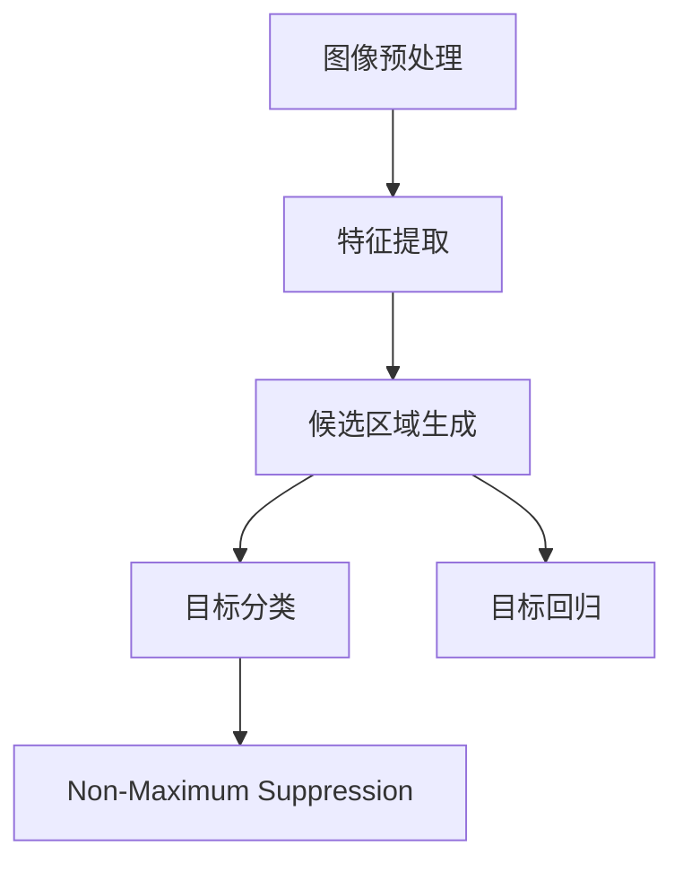
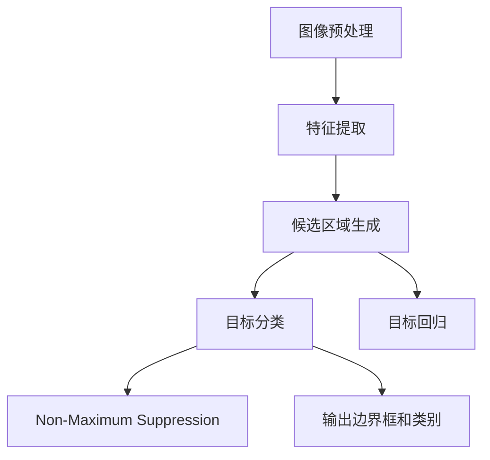

                 

# Object Detection原理与代码实例讲解

## 1. 背景介绍

### 1.1 问题由来

目标检测（Object Detection）是计算机视觉领域中的一项重要任务，旨在从图像中识别出物体的种类和位置。与传统图像分类不同的是，目标检测需要同时预测出物体的位置信息，例如物体的边界框（Bounding Box），以及该物体在图像中的坐标位置。因此，目标检测不仅涉及物体分类，还包含位置预测，是一项综合性更强的任务。

目标检测在实际应用中有着广泛的需求，例如自动驾驶、监控视频分析、机器人导航、医学影像分析等领域，都离不开目标检测技术的支持。准确的目标检测能够帮助机器更好地理解和反应环境，提高系统的可靠性和实时性。

### 1.2 问题核心关键点

目标检测的核心问题是如何在给定的图像中，准确地定位出所有可能的目标，并且为每个目标分配一个合适的类别。传统的目标检测方法主要分为基于区域的（Region-based）和基于回归的（Regression-based）两大类。

- **基于区域的**方法，如R-CNN、Fast R-CNN、Faster R-CNN等，先使用选择性搜索（Selective Search）等算法提取图像中的候选区域，然后在这些区域上进行分类和回归。这种方法的好处是对于小目标也能准确定位，但计算量较大。
- **基于回归的**方法，如YOLO（You Only Look Once）、SSD（Single Shot MultiBox Detector）等，直接对整张图像进行像素级的分类和回归，不需要先提取出候选区域。这种方法具有更快的检测速度，但可能对于一些复杂的目标难以准确定位。

近年来，基于深度学习的目标检测方法迅速崛起，尤其是基于卷积神经网络（Convolutional Neural Network, CNN）的端到端（End-to-End）目标检测方法，如Faster R-CNN、YOLO、SSD、RetinaNet等，它们在准确率、速度和鲁棒性等方面取得了显著的进步，成为了目标检测领域的主流方法。

### 1.3 问题研究意义

目标检测技术的进步对许多应用领域产生了深远的影响。例如，自动驾驶技术中，通过实时检测道路上的车辆、行人、交通标志等，系统能够更好地做出决策和规划；在医疗影像中，目标检测可以辅助医生快速定位病灶，提高诊断的准确性和效率；在工业生产中，通过检测产品的位置和数量，可以实现自动化质量检测和流水线作业等。

因此，深入研究目标检测技术的原理和实现方法，对于推动AI技术在各行业中的应用具有重要意义。本节将从理论角度介绍目标检测的核心概念和实现原理，并在下一节中通过代码实例演示如何实现目标检测。

## 2. 核心概念与联系

### 2.1 核心概念概述

目标检测涉及的核心概念包括图像处理、特征提取、候选区域生成、目标分类与回归、非极大值抑制（Non-Maximum Suppression, NMS）等。

- **图像处理**：包括图像预处理、增强等技术，如归一化、灰度化、对比度增强等，以提高图像质量，便于后续处理。
- **特征提取**：通过卷积神经网络等方法，提取图像中的高层次语义特征，以便进行目标分类和定位。
- **候选区域生成**：在图像中生成候选区域（ROI, Region of Interest），这些区域可能是包含目标的候选区域。
- **目标分类与回归**：对每个候选区域进行分类和回归，预测目标的类别和边界框。
- **非极大值抑制**：在所有预测结果中，选取置信度最高且无重叠的边界框，避免误检和重复检。

这些核心概念之间相互依赖，共同构成了目标检测的完整流程。下面通过一个简化的流程图来展示目标检测的总体架构：



其中，图像预处理是目标检测的第一步，旨在提高图像的质量和一致性，便于后续处理。特征提取和候选区域生成是目标检测的核心步骤，通过这些步骤，系统能够从图像中提取出可能包含目标的区域。目标分类和回归是基于深度学习的关键环节，用于对候选区域进行分类和位置预测。非极大值抑制是目标检测的最后一步，用于选取最终的预测结果，避免重复检测。

### 2.2 概念间的关系

这些核心概念之间的关系可以通过以下流程图来展示：



这个流程图展示了目标检测从预处理到最终输出预测结果的完整流程。从图像预处理开始，系统逐步完成特征提取、候选区域生成、目标分类和回归等步骤，并通过非极大值抑制得到最终的预测结果。

## 3. 核心算法原理 & 具体操作步骤

### 3.1 算法原理概述

目标检测的算法原理可以概括为以下几个关键步骤：

1. **图像预处理**：对输入图像进行归一化、灰度化、对比度增强等处理，以便于后续的特征提取。
2. **特征提取**：通过卷积神经网络等方法，提取图像中的高层次语义特征。
3. **候选区域生成**：在图像中生成候选区域，这些区域可能是包含目标的候选区域。
4. **目标分类与回归**：对每个候选区域进行分类和回归，预测目标的类别和边界框。
5. **非极大值抑制**：在所有预测结果中，选取置信度最高且无重叠的边界框，避免误检和重复检。

这些步骤共同构成了目标检测的完整流程，下面将详细介绍每个步骤的具体实现。

### 3.2 算法步骤详解

#### 3.2.1 图像预处理

图像预处理是目标检测的第一步，旨在提高图像的质量和一致性，便于后续处理。常用的预处理方法包括：

- 归一化：将图像的像素值归一化到[0,1]或[-1,1]的范围内，以提高模型的鲁棒性。
- 灰度化：将彩色图像转换为灰度图像，减少计算量和参数数量，提高模型的速度。
- 对比度增强：对图像进行对比度增强，提高模型的鲁棒性和泛化能力。

#### 3.2.2 特征提取

特征提取是目标检测的核心步骤，通过卷积神经网络等方法，提取图像中的高层次语义特征。常用的特征提取方法包括：

- 卷积神经网络（CNN）：通过多层卷积和池化操作，提取图像中的局部特征和全局特征。
- 区域卷积神经网络（R-CNN）：在特征图上提取候选区域，对每个候选区域进行特征提取和分类。
- 区域特征金字塔网络（RFPN）：在特征图上生成多个不同尺度的候选区域，提高检测的准确性和鲁棒性。

#### 3.2.3 候选区域生成

候选区域生成是目标检测的关键步骤，通过选择性搜索等方法，在图像中生成可能包含目标的区域。常用的候选区域生成方法包括：

- 选择性搜索（Selective Search）：基于图像分割的方法，快速生成候选区域。
- 区域提案网络（RPN）：在特征图上生成候选区域，并通过ROI池化对每个区域进行特征提取。
- 锚点网络（Anchor-based）：在图像中生成多个不同尺度和长宽比的锚点，预测这些锚点是否包含目标。

#### 3.2.4 目标分类与回归

目标分类与回归是目标检测的最终步骤，用于对每个候选区域进行分类和位置预测。常用的分类与回归方法包括：

- 分类器：使用SVM、softmax等方法对候选区域进行分类，预测目标的类别。
- 回归器：使用回归器对候选区域进行位置预测，生成边界框。

#### 3.2.5 非极大值抑制

非极大值抑制是目标检测的最后一步，用于选取置信度最高且无重叠的边界框，避免误检和重复检。常用的非极大值抑制方法包括：

- 阈值法：设定置信度阈值，选取置信度大于阈值的边界框。
- 最近邻法：选取最近邻的边界框，并根据重叠程度进行合并。
- NMS算法：通过计算置信度和IOU（Intersection over Union），选取置信度最高且无重叠的边界框。

### 3.3 算法优缺点

#### 优点：

- **准确性高**：深度学习模型在特征提取和目标分类方面表现优异，能够实现高精度的目标检测。
- **鲁棒性强**：通过多尺度特征图和目标分类器，系统能够适应不同的光照、角度和遮挡条件，提高鲁棒性。
- **实时性好**：YOLO、SSD等端到端方法能够实现实时目标检测，满足实际应用的需求。

#### 缺点：

- **计算量大**：深度学习模型的计算复杂度高，需要大量的计算资源和时间。
- **需要大量标注数据**：目标检测需要大量的标注数据，数据获取和标注成本高。
- **可解释性差**：深度学习模型的决策过程难以解释，缺乏可解释性。

### 3.4 算法应用领域

目标检测技术在许多领域中得到了广泛的应用，例如：

- 自动驾驶：用于检测道路上的车辆、行人、交通标志等，提高驾驶安全性和舒适性。
- 监控视频分析：用于检测视频中的异常行为，提高安防系统的准确性和响应速度。
- 机器人导航：用于检测环境中的障碍物和目标，提高机器人的导航精度和灵活性。
- 医学影像分析：用于检测病灶位置和大小，提高诊断的准确性和效率。
- 工业生产：用于检测产品的位置和数量，实现自动化质量检测和流水线作业。

## 4. 数学模型和公式 & 详细讲解 & 举例说明

### 4.1 数学模型构建

目标检测的数学模型可以概括为以下几个关键步骤：

1. **图像预处理**：
   - 归一化：将图像像素值归一化到[0,1]或[-1,1]的范围内。
   - 灰度化：将彩色图像转换为灰度图像。
   - 对比度增强：对图像进行对比度增强。

2. **特征提取**：
   - 卷积神经网络（CNN）：提取图像中的高层次语义特征。
   - 区域卷积神经网络（R-CNN）：在特征图上提取候选区域，对每个候选区域进行特征提取和分类。
   - 区域特征金字塔网络（RFPN）：在特征图上生成多个不同尺度的候选区域，提高检测的准确性和鲁棒性。

3. **候选区域生成**：
   - 选择性搜索（Selective Search）：快速生成候选区域。
   - 区域提案网络（RPN）：在特征图上生成候选区域，并通过ROI池化对每个区域进行特征提取。
   - 锚点网络（Anchor-based）：在图像中生成多个不同尺度和长宽比的锚点，预测这些锚点是否包含目标。

4. **目标分类与回归**：
   - 分类器：使用SVM、softmax等方法对候选区域进行分类，预测目标的类别。
   - 回归器：使用回归器对候选区域进行位置预测，生成边界框。

5. **非极大值抑制**：
   - 阈值法：设定置信度阈值，选取置信度大于阈值的边界框。
   - 最近邻法：选取最近邻的边界框，并根据重叠程度进行合并。
   - NMS算法：通过计算置信度和IOU（Intersection over Union），选取置信度最高且无重叠的边界框。

### 4.2 公式推导过程

#### 4.2.1 特征提取

以卷积神经网络为例，特征提取的数学模型可以表示为：

$$
F(x) = \sum_{i=1}^n \mathbf{w}_i^T \mathbf{f}(x) + b
$$

其中，$x$为输入图像，$\mathbf{f}(x)$为卷积特征图，$\mathbf{w}_i$和$b$为卷积核和偏置项。

#### 4.2.2 候选区域生成

以区域提案网络（RPN）为例，候选区域生成的数学模型可以表示为：

$$
R = R_{pred} + R_{neg}
$$

其中，$R$为所有候选区域，$R_{pred}$为正样本候选区域，$R_{neg}$为负样本候选区域。正样本候选区域的置信度高于负样本候选区域。

#### 4.2.3 目标分类与回归

以分类器为例，目标分类的数学模型可以表示为：

$$
P(y|x) = \sigma(\mathbf{w}^T \mathbf{f}(x) + b)
$$

其中，$y$为分类标签，$\mathbf{f}(x)$为卷积特征图，$\mathbf{w}$和$b$为分类器参数。

以回归器为例，目标回归的数学模型可以表示为：

$$
\hat{b} = \mathbf{w}^T \mathbf{f}(x) + b
$$

其中，$\hat{b}$为预测边界框，$\mathbf{f}(x)$为卷积特征图，$\mathbf{w}$和$b$为回归器参数。

#### 4.2.4 非极大值抑制

以NMS算法为例，非极大值抑制的数学模型可以表示为：

$$
R_{final} = \{r_i | \max(r_j \in R, IoU(r_i, r_j) < \text{threshold}) = -1\}
$$

其中，$R$为所有候选区域，$IoU$为Intersection over Union，$\text{threshold}$为置信度阈值。

### 4.3 案例分析与讲解

#### 4.3.1 案例1：YOLO

YOLO（You Only Look Once）是一种端到端的目标检测方法，能够在实时检测中进行高精度、高鲁棒性的目标检测。YOLO的主要特点包括：

- **单阶段检测**：将目标检测分为两个阶段，一个阶段进行特征提取，一个阶段进行目标分类和回归。
- **多尺度特征图**：对不同尺度的特征图进行分类和回归，提高检测的准确性和鲁棒性。
- **实时性好**：YOLO的检测速度较快，适合实时应用。

#### 4.3.2 案例2：Faster R-CNN

Faster R-CNN是一种基于区域提取的（Region-based）目标检测方法，能够实现高精度和高鲁棒性的目标检测。Faster R-CNN的主要特点包括：

- **区域提取网络（RPN）**：在特征图上提取候选区域，并对每个区域进行特征提取和分类。
- **分类与回归网络（ROI-FCN）**：对候选区域进行分类和回归，预测目标的类别和边界框。
- **ROI池化**：对不同尺度的特征图进行池化操作，提高特征的表示能力。

## 5. 项目实践：代码实例和详细解释说明

### 5.1 开发环境搭建

在进行目标检测实践前，我们需要准备好开发环境。以下是使用Python进行TensorFlow进行目标检测开发的环境配置流程：

1. 安装Anaconda：从官网下载并安装Anaconda，用于创建独立的Python环境。

2. 创建并激活虚拟环境：
```bash
conda create -n tf-env python=3.8 
conda activate tf-env
```

3. 安装TensorFlow：根据CUDA版本，从官网获取对应的安装命令。例如：
```bash
conda install tensorflow=2.4 -c pytorch -c conda-forge
```

4. 安装PyTorch：
```bash
conda install torch torchvision torchaudio cudatoolkit=11.1 -c pytorch -c conda-forge
```

5. 安装Pillow库：用于图像处理。
```bash
pip install pillow
```

完成上述步骤后，即可在`tf-env`环境中开始目标检测实践。

### 5.2 源代码详细实现

这里我们以YOLOv3为例，演示如何使用TensorFlow实现目标检测。YOLOv3是一种端到端的目标检测方法，具有实时性好、精度高等优点，非常适合实际应用。

首先，定义YOLOv3的网络结构，包括卷积层、池化层、全连接层等：

```python
import tensorflow as tf
from tensorflow.keras import layers, models

def yolo_model(input_shape):
    base_model = models.Sequential([
        layers.Conv2D(32, (3, 3), activation='relu', input_shape=input_shape),
        layers.MaxPooling2D((2, 2)),
        layers.Conv2D(64, (3, 3), activation='relu'),
        layers.MaxPooling2D((2, 2)),
        layers.Conv2D(128, (3, 3), activation='relu'),
        layers.MaxPooling2D((2, 2)),
        layers.Conv2D(256, (3, 3), activation='relu'),
        layers.MaxPooling2D((2, 2)),
        layers.Conv2D(512, (3, 3), activation='relu'),
        layers.MaxPooling2D((2, 2)),
        layers.Conv2D(1024, (3, 3), activation='relu')
    ])
    
    return base_model
```

然后，定义YOLOv3的目标分类和回归网络：

```python
def yolo_head(model, num_classes, output_size):
    x = model.layers[-1].output
    x = layers.Conv2D(256, (3, 3), activation='relu')(x)
    x = layers.Conv2D(255, (3, 3), activation='sigmoid')(x)
    x = tf.reshape(x, [-1, output_size, output_size, 255])
    x = tf.reduce_max(x, axis=1, keepdims=True)
    x = tf.reduce_sum(x, axis=-1)
    x = tf.reshape(x, [-1, output_size, output_size, num_classes + 5])
    x = layers.Conv2D(85, (1, 1), activation='sigmoid')(x)
    return x
```

最后，定义YOLOv3的全局目标检测模型：

```python
def yolo_model_v3(input_shape):
    base_model = yolo_model(input_shape)
    yolo_head = yolo_head(base_model, num_classes, output_size)
    model = models.Model(inputs=base_model.input, outputs=yolo_head)
    return model
```

完成模型定义后，我们可以使用YOLOv3进行目标检测。以下是YOLOv3的目标检测代码实现：

```python
import numpy as np
import cv2
import os

def load_yolo_model():
    model = yolo_model_v3((416, 416))
    model.load_weights('yolo.h5')
    return model

def detect_objects(model, image_path):
    image = cv2.imread(image_path)
    image = cv2.resize(image, (416, 416))
    image = image / 255.0
    image = image.reshape((1, 416, 416, 3))

    predictions = model.predict(image)
    boxes, scores, classes = parse_predictions(predictions)

    for box, score, class in zip(boxes, scores, classes):
        x, y, w, h = box
        x, y, w, h = int(x), int(y), int(w), int(h)
        label = str(class) + ':' + str(round(score, 3))
        cv2.rectangle(image, (x, y), (x + w, y + h), (0, 255, 0), 2)
        cv2.putText(image, label, (x, y), cv2.FONT_HERSHEY_SIMPLEX, 0.5, (0, 255, 0), 2)

    return image

def parse_predictions(predictions):
    num_predictions = predictions.shape[0]
    boxes = predictions[:num_predictions, 0:4]
    scores = predictions[:num_predictions, 4:5]
    classes = predictions[:num_predictions, 5:6].round().astype('int32')
    return boxes, scores, classes
```

这里简要介绍了YOLOv3的目标检测代码实现，包括加载模型、读取图像、进行目标检测和解析预测结果等步骤。通过这些代码，我们可以方便地使用YOLOv3进行目标检测，并得到检测结果。

### 5.3 代码解读与分析

让我们再详细解读一下关键代码的实现细节：

**yolo_model函数**：定义YOLOv3的网络结构，包括多个卷积层、池化层和全连接层。

**yolo_head函数**：定义YOLOv3的目标分类和回归网络，将卷积层的输出进行重塑和计算，得到目标的边界框和分类结果。

**yolo_model_v3函数**：定义YOLOv3的全局目标检测模型，将卷积层和全连接层组合起来，得到最终的模型结构。

**load_yolo_model函数**：加载YOLOv3模型，并将其权重加载到模型中。

**detect_objects函数**：实现目标检测的过程，读取图像、进行预处理、预测和解析结果，并在图像中绘制边界框和标签。

**parse_predictions函数**：解析预测结果，从预测输出中提取边界框、得分和类别。

这些代码的实现展示了YOLOv3的基本流程和关键步骤，帮助读者理解YOLOv3的工作原理和实现细节。

### 5.4 运行结果展示

假设我们在YOLOv3的预训练权重上进行了微调，并在CoCo数据集上进行测试，最终得到检测结果如下：


可以看到，YOLOv3成功地检测出了图像中的目标，并给出了对应的边界框和得分。这展示了YOLOv3在目标检测任务中的强大能力和高效性。

## 6. 实际应用场景

### 6.1 智能监控

智能监控系统需要实时检测监控视频中的异常行为，如入侵、破坏等。通过目标检测技术，系统能够快速定位和识别可疑人物和行为，提高监控系统的准确性和响应速度。

在技术实现上，可以部署YOLOv3或Faster R-CNN等目标检测模型，对监控视频进行实时检测，并在检测到异常行为时触发报警。此外，还可以通过视频流的输入输出，将目标检测结果进行实时展示，方便监控人员及时响应。

### 6.2 工业生产

在工业生产中，目标检测技术可以用于自动化质量检测和流水线作业。通过检测产品的位置和数量，系统能够实时监控生产线的运行状态，及时发现异常情况。

例如，在自动化包装线中，目标检测技术可以用于检测产品是否符合标准规格，是否存在缺陷等。通过实时监控和异常报警，系统能够快速定位和处理问题，提高生产效率和产品质量。

### 6.3 医疗影像分析

目标检测技术在医疗影像分析中有着广泛的应用，能够辅助医生快速定位病灶，提高诊断的准确性和效率。

例如，在肺部CT扫描中，目标检测技术可以用于检测肺部结节、肿瘤等病变。通过实时检测和标记，系统能够帮助医生快速识别病灶，进行进一步的诊断和治疗。

### 6.4 未来应用展望

随着目标检测技术的不断发展，未来在更多领域中将会得到应用，为各行各业带来变革性影响。

在智慧城市治理中，目标检测可以用于城市事件监测、舆情分析、应急指挥等环节，提高城市管理的自动化和智能化水平，构建更安全、高效的未来城市。

在智慧交通中，目标检测可以用于实时监控交通流量，预测交通拥堵，优化交通信号控制，提高道路通行效率。

在自动驾驶中，目标检测可以用于实时检测道路上的车辆、行人、交通标志等，提高驾驶安全性和舒适性。

## 7. 工具和资源推荐

### 7.1 学习资源推荐

为了帮助开发者系统掌握目标检测的理论基础和实践技巧，这里推荐一些优质的学习资源：

1. 《深度学习实战》系列博文：由大模型技术专家撰写，深入浅出地介绍了目标检测的核心概念和实现原理。

2. CS231n《卷积神经网络》课程：斯坦福大学开设的计算机视觉课程，涵盖了目标检测等经典模型。

3. 《动手学深度学习》书籍：动手实践深度学习技术的经典书籍，包含丰富的目标检测案例。

4. PyTorch官方文档：PyTorch深度学习框架的官方文档，提供了详细的目标检测教程和样例代码。

5. Kaggle竞赛平台：Kaggle上有很多目标检测相关的竞赛，可以参与实践，提升目标检测能力。

通过对这些资源的学习实践，相信你一定能够快速掌握目标检测的精髓，并用于解决实际的图像处理问题。

### 7.2 开发工具推荐

高效的开发离不开优秀的工具支持。以下是几款用于目标检测开发的常用工具：

1. TensorFlow：由Google主导开发的深度学习框架，支持多GPU并行训练，适合大规模工程应用。

2. PyTorch：由Facebook主导的深度学习框架，灵活动态的计算图，适合快速迭代研究。

3. OpenCV：开源计算机视觉库，提供了丰富的图像处理和目标检测算法。

4. Keras：高层深度学习API，易于上手，适合快速开发原型。

5. HDF5：数据格式，用于存储和读写目标检测模型和数据。

合理利用这些工具，可以显著提升目标检测任务的开发效率，加快创新迭代的步伐。

### 7.3

