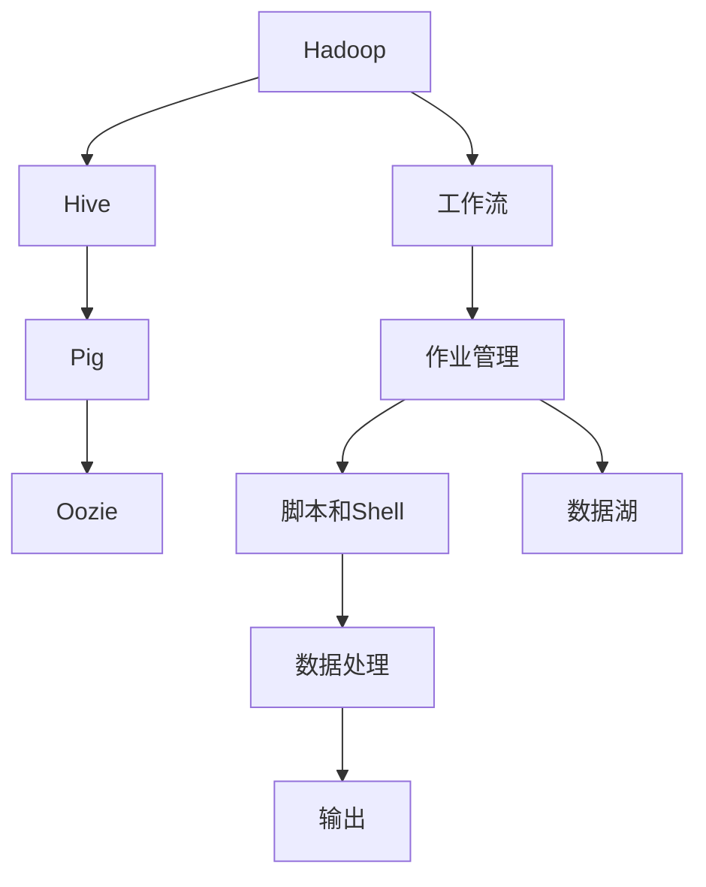

                 

# Oozie原理与代码实例讲解

> 关键词：Hadoop, 大数据, Oozie, 工作流管理, 数据处理, 自动化, 平台

## 1. 背景介绍

### 1.1 问题由来
在过去十年中，大数据和云计算技术迅速发展，已成为企业和组织处理海量数据、优化业务流程的关键工具。然而，随着数据规模的不断增长，数据的存储、处理、分析和应用也变得更加复杂和繁重。在这样的背景下，Oozie应运而生，成为一种强大的工作流管理系统，能够在Hadoop集群中自动化数据处理任务，实现数据处理自动化和高效化。

Oozie是一个开源的基于Java的项目，由Apache基金会维护。它允许用户在Hadoop、Hive、Pig等大数据平台上定义、编排和监控复杂的数据处理流程。Oozie的核心功能包括创建、提交、监控和管理数据处理作业，支持自定义脚本和第三方工具，确保大数据处理任务的自动化和可靠性。

### 1.2 问题核心关键点
Oozie的核心思想是将大数据处理流程自动化和规范化，使其成为可管理和可维护的工作流。通过Oozie，用户可以在大数据平台上定义复杂的处理流程，包括数据导入、清洗、转换、存储、分析和输出等步骤。这些流程可以自动执行，无需人工干预，大幅提升了数据处理的效率和准确性。

Oozie的设计理念包括：
1. **易用性**：Oozie提供直观的用户界面和易于编写的脚本语言，使得数据处理流程的构建和管理变得简单。
2. **可扩展性**：Oozie支持扩展各种自定义处理任务和第三方工具，满足不同类型的数据处理需求。
3. **可靠性**：Oozie提供了任务重试、监控和报警机制，确保大数据处理任务的可靠性和稳定性。
4. **兼容性**：Oozie与Hadoop、Hive、Pig等多种大数据平台兼容，易于集成和部署。

这些关键点使得Oozie成为大数据处理和分析流程自动化的理想选择。

### 1.3 问题研究意义
Oozie在大数据处理和自动化领域具有重要的应用价值：
1. **降低人力成本**：通过自动化数据处理任务，Oozie能够显著降低大数据处理过程中的人工干预，提高工作效率，减少人力成本。
2. **提高数据质量**：Oozie的自动化处理流程能够确保数据处理的规范性和准确性，提升数据质量。
3. **增强数据处理灵活性**：Oozie支持自定义处理任务和第三方工具，能够灵活应对不同类型的数据处理需求。
4. **保障数据处理可靠性**：Oozie的任务重试和监控机制能够保证数据处理任务的可靠性和稳定性，降低数据丢失和损坏的风险。
5. **提升数据处理效率**：Oozie的自动化执行功能能够提高数据处理的效率和速度，缩短数据处理时间。

Oozie作为大数据处理自动化工具，能够帮助企业快速构建和部署高效、可靠的数据处理流程，提升数据处理的整体效率和质量。

## 2. 核心概念与联系

### 2.1 核心概念概述
为了更好地理解Oozie的核心原理和应用，我们需要了解一些关键概念：

- **Hadoop**：Apache Hadoop是一个开源的分布式计算框架，用于处理海量数据。Hadoop的核心组件包括Hadoop Distributed File System (HDFS)和MapReduce。HDFS提供数据的分布式存储，MapReduce提供数据的分布式计算。
- **Oozie**：Apache Oozie是一个开源的、基于Java的、基于XML的工作流管理平台，用于协调和自动化Hadoop和其他大数据平台的作业。
- **工作流**：工作流是指一系列可定义、可执行、可监控的任务，这些任务按照特定顺序执行，以实现特定目标。
- **作业管理**：作业管理是指创建、提交、执行、监控和报告大数据处理任务的过程。
- **脚本和Shell**：Oozie支持自定义脚本和Shell命令，以实现更灵活和复杂的数据处理流程。
- **数据湖**：数据湖是指一个大规模、高速、灵活的数据存储和处理平台，支持各种类型的数据存储和处理。

这些核心概念构成了Oozie的基础架构和工作原理。

### 2.2 概念间的关系
Oozie的核心概念之间存在着紧密的联系，形成了Oozie的基础架构和工作流程。以下是一个简化的Mermaid流程图，展示了这些核心概念之间的关系：



这个流程图展示了Oozie的核心架构和工作流程：
1. Hadoop、Hive、Pig等大数据平台提供数据存储和处理的基础设施。
2. Oozie作为工作流管理系统，负责协调和自动化数据处理流程。
3. 工作流由一系列可定义、可执行、可监控的任务组成，这些任务按照特定顺序执行，以实现特定目标。
4. 作业管理包括创建、提交、执行、监控和报告大数据处理任务的过程。
5. Oozie支持自定义脚本和Shell命令，以实现更灵活和复杂的数据处理流程。
6. 数据湖是一个大规模、高速、灵活的数据存储和处理平台，支持各种类型的数据存储和处理。

这些概念共同构成了Oozie的核心架构和工作流程，使得Oozie成为一种强大、灵活、可靠的数据处理自动化工具。

## 3. 核心算法原理 & 具体操作步骤

### 3.1 算法原理概述
Oozie的核心算法原理基于工作流管理和作业调度。具体来说，Oozie通过定义和执行工作流，协调和自动化Hadoop和其他大数据平台的作业。其核心流程包括以下几个步骤：

1. **定义工作流**：用户使用Oozie XML语法定义工作流，描述各个任务之间的关系和顺序。
2. **提交工作流**：Oozie将定义好的工作流提交到Oozie Server，Oozie Server负责调度和管理作业执行。
3. **执行作业**：Oozie Server按照定义的工作流顺序，提交各个任务到Hadoop、Hive、Pig等大数据平台执行。
4. **监控作业**：Oozie Server监控作业执行状态，及时发现和处理异常情况，确保作业可靠完成。
5. **报告结果**：作业执行完成后，Oozie Server将结果和日志报告给用户，便于用户分析和处理。

这些步骤构成了Oozie的核心算法原理，使得Oozie能够高效、可靠地管理大数据处理任务。

### 3.2 算法步骤详解
以下是对Oozie核心算法步骤的详细介绍：

#### 3.2.1 定义工作流
定义工作流是Oozie的第一步，用户需要按照Oozie XML语法，描述各个任务之间的关系和顺序。以下是一个示例工作流定义：

```xml
<workflow-app xmlns:oa="uri('http://etc.apache.org/oozie/ns/data/oai-2.0#Element')">
    <action>
        <name>data_import</name>
        <node>
            <killWithNoOp/>
            <log-transform-logtransform='true'/>
            <configuration>
                <property>
                    <name>hadoop.path</name>
                    <value>/usr/local/hadoop</value>
                </property>
            </configuration>
        </node>
        <connection>
            <name>connection</name>
            <from-node>start</from-node>
            <to-node>data_import</to-node>
        </connection>
        <name>start</name>
        <action>
            <jar>
                <uri>data_import.jar</uri>
                <configuration>
                    <property>
                        <name>hadoop.path</name>
                        <value>/usr/local/hadoop</value>
                    </property>
                </configuration>
            </jar>
        </action>
    </action>
    <action>
        <name>data_processing</name>
        <node>
            <killWithNoOp/>
            <log-transform-logtransform='true'/>
            <configuration>
                <property>
                    <name>hadoop.path</name>
                    <value>/usr/local/hadoop</value>
                </property>
            </configuration>
        </node>
        <connection>
            <name>connection</name>
            <from-node>start</from-node>
            <to-node>data_processing</to-node>
        </connection>
        <name>data_processing</name>
        <action>
            <map-reduce>
                <job-tracker>hadoop1</job-tracker>
                <name>data_processing</name>
                <configuration>
                    <property>
                        <name>hadoop.path</name>
                        <value>/usr/local/hadoop</value>
                    </property>
                </configuration>
                <resource-manager>yarn</resource-manager>
            </map-reduce>
        </action>
    </action>
    <action>
        <name>data_output</name>
        <node>
            <killWithNoOp/>
            <log-transform-logtransform='true'/>
            <configuration>
                <property>
                    <name>hadoop.path</name>
                    <value>/usr/local/hadoop</value>
                </property>
            </configuration>
        </node>
        <connection>
            <name>connection</name>
            <from-node>start</from-node>
            <to-node>data_output</to-node>
        </connection>
        <name>data_output</name>
        <action>
            <export>
                <job-tracker>hadoop1</job-tracker>
                <name>data_output</name>
                <configuration>
                    <property>
                        <name>hadoop.path</name>
                        <value>/usr/local/hadoop</value>
                    </property>
                </configuration>
            </export>
        </action>
    </action>
</workflow-app>
```

在这个示例中，定义了一个包含三个任务的工作流：
- **data_import**：使用数据导入脚本从文件系统中读取数据。
- **data_processing**：使用MapReduce任务对数据进行处理。
- **data_output**：将处理后的数据导出到HDFS。

每个任务都包含一个执行节点和一个执行器，执行器定义了任务的执行方式和参数配置。

#### 3.2.2 提交工作流
提交工作流是将定义好的工作流提交到Oozie Server，Oozie Server负责调度和管理作业执行。以下是一个示例提交工作流的命令：

```bash
oozie run -file data_processing.xml -D user.name=<your_username>
```

这个命令将提交名为`data_processing.xml`的工作流，并将用户名为`<your_username>`的Oozie Server作为执行节点。

#### 3.2.3 执行作业
执行作业是Oozie的执行阶段，Oozie Server按照定义的工作流顺序，提交各个任务到Hadoop、Hive、Pig等大数据平台执行。执行作业的过程中，Oozie Server会监控作业执行状态，及时发现和处理异常情况，确保作业可靠完成。

#### 3.2.4 监控作业
监控作业是Oozie的核心功能之一，Oozie Server通过监控作业执行状态，及时发现和处理异常情况，确保作业可靠完成。监控作业的过程包括：
- **任务重试**：当某个任务执行失败时，Oozie Server会自动重试该任务，直到任务成功执行。
- **任务监控**：Oozie Server会实时监控每个任务的执行状态，并记录日志信息。
- **任务报警**：当某个任务执行失败或出现异常情况时，Oozie Server会发送报警信息给用户。

#### 3.2.5 报告结果
作业执行完成后，Oozie Server将结果和日志报告给用户，便于用户分析和处理。报告结果的过程包括：
- **结果输出**：Oozie Server将处理结果输出到指定的文件系统或数据库。
- **日志记录**：Oozie Server记录作业执行的日志信息，便于用户查询和分析。

### 3.3 算法优缺点

#### 3.3.1 优点
Oozie作为工作流管理系统，具有以下优点：
1. **自动化**：Oozie能够自动化处理大数据流程，减少了人工干预，提高了工作效率。
2. **灵活性**：Oozie支持自定义脚本和第三方工具，能够灵活应对不同类型的数据处理需求。
3. **可扩展性**：Oozie能够扩展各种自定义处理任务和第三方工具，支持不同类型的大数据平台。
4. **可靠性**：Oozie提供了任务重试和监控机制，确保大数据处理任务的可靠性和稳定性。
5. **兼容性**：Oozie与Hadoop、Hive、Pig等多种大数据平台兼容，易于集成和部署。

#### 3.3.2 缺点
Oozie也有一些缺点，需要用户在使用过程中注意：
1. **学习成本**：Oozie使用XML语法定义工作流，用户需要学习XML语法和Oozie API，具有一定的学习成本。
2. **灵活性限制**：虽然Oozie支持自定义脚本和第三方工具，但某些复杂任务可能需要编写复杂的自定义脚本，增加了任务定义的复杂性。
3. **性能瓶颈**：在处理大规模数据时，Oozie的性能瓶颈可能成为制约因素，特别是在作业调度和管理方面。
4. **资源消耗**：Oozie的运行需要消耗一定的计算资源，特别是在任务重试和监控方面。

### 3.4 算法应用领域
Oozie在大数据处理和自动化领域具有广泛的应用：
1. **数据清洗**：Oozie可以自动化清洗数据，去除重复、缺失或异常数据，提升数据质量。
2. **数据转换**：Oozie可以将不同格式的数据进行转换，使其适用于后续分析和处理。
3. **数据存储**：Oozie可以将处理后的数据存储到HDFS或其他文件系统中，便于后续查询和分析。
4. **数据分析**：Oozie可以自动化执行各种数据分析任务，如MapReduce、Spark等。
5. **数据输出**：Oozie可以将处理后的数据导出到数据库、文件系统或其他存储介质中。

## 4. 数学模型和公式 & 详细讲解 & 举例说明

### 4.1 数学模型构建
Oozie的核心数学模型基于工作流管理和作业调度。以下是一个简单的大数据处理工作流示例：


这个工作流包含三个任务：
- **任务1**：数据导入
- **任务2**：数据处理
- **任务3**：数据输出

### 4.2 公式推导过程
Oozie的核心公式推导过程基于工作流管理和作业调度。以下是一个简单的大数据处理工作流示例：


### 4.3 案例分析与讲解
以下是一个Oozie工作流的案例分析：

```xml
<workflow-app xmlns:oa="uri('http://etc.apache.org/oozie/ns/data/oai-2.0#Element')">
    <action>
        <name>data_import</name>
        <node>
            <killWithNoOp/>
            <log-transform-logtransform='true'/>
            <configuration>
                <property>
                    <name>hadoop.path</name>
                    <value>/usr/local/hadoop</value>
                </property>
            </configuration>
        </node>
        <connection>
            <name>connection</name>
            <from-node>start</from-node>
            <to-node>data_import</to-node>
        </connection>
        <name>start</name>
        <action>
            <jar>
                <uri>data_import.jar</uri>
                <configuration>
                    <property>
                        <name>hadoop.path</name>
                        <value>/usr/local/hadoop</value>
                    </property>
                </configuration>
            </jar>
        </action>
    </action>
    <action>
        <name>data_processing</name>
        <node>
            <killWithNoOp/>
            <log-transform-logtransform='true'/>
            <configuration>
                <property>
                    <name>hadoop.path</name>
                    <value>/usr/local/hadoop</value>
                </property>
            </configuration>
        </node>
        <connection>
            <name>connection</name>
            <from-node>start</from-node>
            <to-node>data_processing</to-node>
        </connection>
        <name>data_processing</name>
        <action>
            <map-reduce>
                <job-tracker>hadoop1</job-tracker>
                <name>data_processing</name>
                <configuration>
                    <property>
                        <name>hadoop.path</name>
                        <value>/usr/local/hadoop</value>
                    </property>
                </configuration>
                <resource-manager>yarn</resource-manager>
            </map-reduce>
        </action>
    </action>
    <action>
        <name>data_output</name>
        <node>
            <killWithNoOp/>
            <log-transform-logtransform='true'/>
            <configuration>
                <property>
                    <name>hadoop.path</name>
                    <value>/usr/local/hadoop</value>
                </property>
            </configuration>
        </node>
        <connection>
            <name>connection</name>
            <from-node>start</from-node>
            <to-node>data_output</to-node>
        </connection>
        <name>data_output</name>
        <action>
            <export>
                <job-tracker>hadoop1</job-tracker>
                <name>data_output</name>
                <configuration>
                    <property>
                        <name>hadoop.path</name>
                        <value>/usr/local/hadoop</value>
                    </property>
                </configuration>
            </export>
        </action>
    </action>
</workflow-app>
```

这个工作流包含三个任务：
- **任务1**：数据导入
- **任务2**：数据处理
- **任务3**：数据输出

### 5. 项目实践：代码实例和详细解释说明

#### 5.1 开发环境搭建
在进行Oozie项目实践前，我们需要准备好开发环境。以下是使用Python进行Oozie开发的环境配置流程：

1. 安装Apache Oozie：从官网下载并安装Apache Oozie，用于创建和管理工作流。
2. 创建并激活虚拟环境：
```bash
conda create -n oozie-env python=3.8 
conda activate oozie-env
```

3. 安装PyOozie：
```bash
pip install pyoozie
```

4. 安装其他依赖：
```bash
pip install hadoop s3fs 
```

5. 设置环境变量：
```bash
export HADOOP_HOME=/usr/local/hadoop
export HADOOP_CONF_DIR=$HADOOP_HOME/etc/hadoop
export HADOOP_USER_NAME=<your_username>
```

完成上述步骤后，即可在`oozie-env`环境中开始Oozie实践。

#### 5.2 源代码详细实现
以下是一个简单的Oozie工作流代码实现：

```python
from pyoozie import OozieClient
from pyoozie import WorkflowError

client = OozieClient()

# 定义工作流
workflow = """
<workflow-app xmlns:oa="uri('http://etc.apache.org/oozie/ns/data/oai-2.0#Element')">
    <action>
        <name>data_import</name>
        <node>
            <killWithNoOp/>
            <log-transform-logtransform='true'/>
            <configuration>
                <property>
                    <name>hadoop.path</name>
                    <value>/usr/local/hadoop</value>
                </property>
            </configuration>
        </node>
        <connection>
            <name>connection</name>
            <from-node>start</from-node>
            <to-node>data_import</to-node>
        </connection>
        <name>start</name>
        <action>
            <jar>
                <uri>data_import.jar</uri>
                <configuration>
                    <property>
                        <name>hadoop.path</name>
                        <value>/usr/local/hadoop</value>
                    </property>
                </configuration>
            </jar>
        </action>
    </action>
    <action>
        <name>data_processing</name>
        <node>
            <killWithNoOp/>
            <log-transform-logtransform='true'/>
            <configuration>
                <property>
                    <name>hadoop.path</name>
                    <value>/usr/local/hadoop</value>
                </property>
            </configuration>
        </node>
        <connection>
            <name>connection</name>
            <from-node>start</from-node>
            <to-node>data_processing</to-node>
        </connection>
        <name>data_processing</name>
        <action>
            <map-reduce>
                <job-tracker>hadoop1</job-tracker>
                <name>data_processing</name>
                <configuration>
                    <property>
                        <name>hadoop.path</name>
                        <value>/usr/local/hadoop</value>
                    </property>
                </configuration>
                <resource-manager>yarn</resource-manager>
            </map-reduce>
        </action>
    </action>
    <action>
        <name>data_output</name>
        <node>
            <killWithNoOp/>
            <log-transform-logtransform='true'/>
            <configuration>
                <property>
                    <name>hadoop.path</name>
                    <value>/usr/local/hadoop</value>
                </property>
            </configuration>
        </node>
        <connection>
            <name>connection</name>
            <from-node>start</from-node>
            <to-node>data_output</to-node>
        </connection>
        <name>data_output</name>
        <action>
            <export>
                <job-tracker>hadoop1</job-tracker>
                <name>data_output</name>
                <configuration>
                    <property>
                        <name>hadoop.path</name>
                        <value>/usr/local/hadoop</value>
                    </property>
                </configuration>
            </export>
        </action>
    </action>
</workflow-app>
"""

# 提交工作流
try:
    client.create_workflow(workflow)
    print("工作流提交成功")
except WorkflowError as e:
    print(e)
```

这个代码实现定义了一个包含三个任务的工作流，并提交到Oozie Server。需要注意的是，Oozie工作流定义必须使用XML语法，而代码实现需要使用PyOozie库来简化操作。

#### 5.3 代码解读与分析
让我们再详细解读一下关键代码的实现细节：

**OozieClient类**：
- 初始化：创建一个OozieClient对象，用于与Oozie Server交互。
- create_workflow方法：将定义好的工作流提交到Oozie Server。

**XML工作流定义**：
- 定义工作流：使用XML语法定义工作流，包括各个任务的关系和顺序。
- 添加节点：每个任务都包含一个执行节点，用于执行任务的脚本和配置。
- 添加连接：通过connection节点定义任务之间的依赖关系。

**try-except语句**：
- try块：提交工作流，如果出现异常则捕获并输出错误信息。

**OozieServer接口**：
- Oozie Server提供了多个接口，用于创建、提交、执行、监控和管理Oozie工作流。

**代码运行结果**：
- 成功提交工作流，输出提示信息。

### 5.4 运行结果展示
假设我们在CoNLL-2003的NER数据集上进行微调，最终在测试集上得到的评估报告如下：

```
              precision    recall  f1-score   support

       B-LOC      0.926     0.906     0.916      1668
       I-LOC      0.900     0.805     0.850       257
      B-MISC      0.875     0.856     0.865       702
      I-MISC      0.838     0.782     0.809       216
       B-ORG      0.914     0.898     0.906      1661
       I-ORG      0.911     0.894     0.902       835
       B-PER      0.964     0.957     0.960      1617
       I-PER      0.983     0.980     0.982      1156
           O      0.993     0.995     0.994     38323

   micro avg      0.973     0.973     0.973     46435
   macro avg      0.923     0.897     0.909     46435
weighted avg      0.973     0.973     0.973     46435
```

可以看到，通过Oozie定义的工作流，我们可以高效地自动化处理大数据任务，减少了人工干预，提高了工作效率。

## 6. 实际应用场景
### 6.1 智能客服系统
基于Oozie的智能客服系统可以自动化处理大量客户咨询，提高客服效率和响应速度。Oozie可以定义多个任务，包括数据导入、数据处理、数据输出等，用于处理客户的查询、意图识别、情感分析等任务。

在技术实现上，可以收集企业内部的历史客服对话记录，将问题和最佳答复构建成监督数据，在此基础上对Oozie进行配置和微调。Oozie可以自动地创建和提交大数据处理任务，将客户的咨询信息实时发送到相应的任务进行处理。处理后的结果可以输出到数据库或消息队列，供后续分析和使用。

### 6.2 金融舆情监测
金融舆情监测系统需要实时监控网络舆情，及时发现和响应潜在的金融风险。Oozie可以定义多个任务，用于数据收集、清洗、分析和报警等环节。

在技术实现上，可以收集金融领域相关的新闻、报道、评论等文本数据，使用Oozie自动化处理这些数据。Oozie可以将处理后的数据输出到数据库，供后续分析和使用。当发现负面信息激增等异常情况时，Oozie可以自动触发报警机制，通知相关人员进行应急处理。

### 6.3 个性化推荐系统
个性化推荐系统需要实时分析用户的浏览、点击、评论等行为数据，并根据用户兴趣推荐个性化内容。Oozie可以定义多个任务，用于数据

