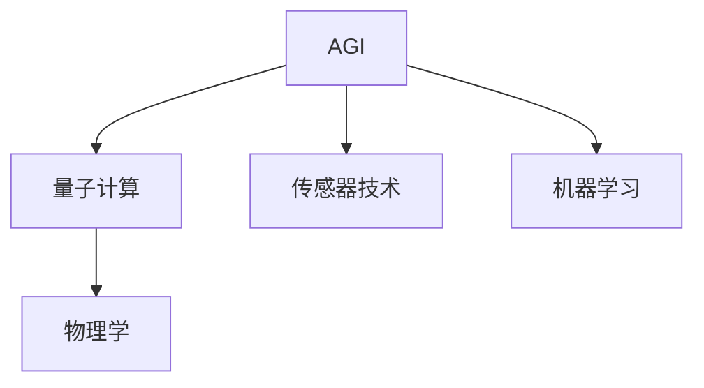

                 

## 1. 背景介绍

在当今这个信息化快速发展的时代，人工智能（AGI，Artificial General Intelligence）已经成为了科技领域的一个热门话题。AGI旨在创造一种能够像人类一样，具备广泛知识、能力和智慧的智能系统。虽然目前的AI系统在特定领域表现出色，但在通用智能方面仍存在巨大的差距。要想真正实现AGI，需要在多个学科领域进行深入研究，其中物理学是一个不可或缺的部分。本文将探讨AGI与物理学的交叉研究，揭示它们之间互相促进、互相影响的关系。

### 1.1 AGI的概念及其重要性

AGI是指一种能够像人类一样，具备广泛知识、能力和智慧的人工智能系统。它不仅限于执行特定的任务，而是能够处理各种复杂问题，并在新情境下进行自我学习。AGI的发展将极大提升人类社会的效率和生产力，同时带来许多新的可能性。例如，在医学、交通、环境保护等领域，AGI可以显著提升效率和效果，甚至可能在未来解决许多人类长期未解的问题。

### 1.2 物理学的意义

物理学作为一门自然科学，研究物质、能量及其相互作用的规律。它不仅为技术发展提供了理论基础，也在AGI的构建中扮演了重要角色。物理学的研究成果，如量子计算、传感器技术、机器学习算法等，直接或间接地推动了AGI的研究进展。因此，AGI与物理学的交叉研究是未来发展AGI的关键方向之一。

## 2. 核心概念与联系

### 2.1 核心概念概述

在探讨AGI与物理学的交叉研究时，我们需要明确一些核心概念，包括AGI、物理学、量子计算、传感器技术、机器学习等。

#### AGI
AGI是一个能够处理各种复杂问题，并在新情境下进行自我学习的人工智能系统。AGI的目标是创造一种能够像人类一样思考和行动的智能系统。

#### 物理学
物理学是研究物质、能量及其相互作用的规律的科学。它不仅为技术发展提供了理论基础，也在AGI的构建中扮演了重要角色。

#### 量子计算
量子计算利用量子位（qubit）进行计算，能够处理传统计算机无法解决的问题。它为AGI提供了更强大的计算能力。

#### 传感器技术
传感器技术用于收集和处理环境信息，是AGI感知环境、理解世界的基础。

#### 机器学习
机器学习是AGI的核心技术之一，用于训练模型，使系统具备学习和适应的能力。

### 2.2 核心概念间的关系

AGI与物理学的交叉研究涉及多个核心概念，它们之间存在着紧密的联系。以下是这些概念之间关系的示意图：



### 2.3 核心概念的整体架构

在AGI与物理学的交叉研究中，核心概念之间的相互作用形成了以下几个主要层面：

1. **理论层面**：物理学的基本规律和原理为AGI提供了理论基础，使AGI能够理解世界，构建知识图谱，进行推理和决策。

2. **计算层面**：量子计算和传统计算机为AGI提供了强大的计算能力，使其能够高效处理复杂问题，加速学习过程。

3. **感知层面**：传感器技术使AGI能够感知环境和接收输入，为系统提供决策依据。

4. **学习层面**：机器学习算法使AGI具备自我学习和适应新环境的能力，使其不断优化和提升性能。

## 3. 核心算法原理 & 具体操作步骤

### 3.1 算法原理概述

AGI与物理学的交叉研究涉及多个算法和技术，包括量子计算、机器学习、传感器融合等。本文将重点介绍AGI在处理复杂问题时所依赖的核心算法原理。

#### 3.1.1 量子计算与AGI

量子计算利用量子位（qubit）进行计算，能够处理传统计算机无法解决的问题。在AGI中，量子计算可用于模拟和优化物理系统，提高AGI的计算能力。例如，量子计算机可以在短时间内模拟大量分子结构，帮助AGI进行药物设计。

#### 3.1.2 机器学习与AGI

机器学习是AGI的核心技术之一，用于训练模型，使系统具备学习和适应的能力。通过机器学习，AGI可以处理各种数据，进行模式识别、分类、预测等任务。AGI通常使用深度学习算法，如神经网络、卷积神经网络（CNN）、递归神经网络（RNN）等。

#### 3.1.3 传感器技术与AGI

传感器技术用于收集和处理环境信息，是AGI感知环境、理解世界的基础。AGI可以通过传感器获取声、光、温度等环境信息，结合物理模型进行分析和决策。

### 3.2 算法步骤详解

#### 3.2.1 量子计算在AGI中的应用步骤

1. **模型构建**：使用量子计算模型描述物理系统，构建量子电路。

2. **数据准备**：准备输入数据，进行量子态的初始化。

3. **量子计算**：使用量子计算机进行计算，获取量子态的变化。

4. **经典计算**：将量子计算结果转化为经典计算结果，进行分析和决策。

#### 3.2.2 机器学习在AGI中的应用步骤

1. **数据收集**：收集和预处理训练数据，包括环境数据、物理模型参数等。

2. **模型训练**：使用机器学习算法训练AGI模型，优化模型参数。

3. **模型评估**：使用验证数据对模型进行评估，选择最优模型。

4. **模型应用**：将训练好的模型应用于实际问题中，进行预测和决策。

#### 3.2.3 传感器融合在AGI中的应用步骤

1. **传感器部署**：选择和部署多种传感器，获取多模态数据。

2. **数据融合**：使用传感器融合算法对多模态数据进行融合，提取环境信息。

3. **信息处理**：使用物理模型对融合后的数据进行处理，提取特征。

4. **决策输出**：结合机器学习模型进行决策，输出最终结果。

### 3.3 算法优缺点

#### 3.3.1 量子计算的优点

1. **处理能力强**：量子计算机可以在短时间内处理大量数据，解决传统计算机难以处理的问题。

2. **加速学习过程**：量子计算能够加速机器学习模型的训练过程，提高模型的效率。

3. **模拟复杂系统**：量子计算可以模拟复杂物理系统，为AGI提供丰富的物理知识。

#### 3.3.2 量子计算的缺点

1. **技术成熟度低**：量子计算技术目前还处于早期阶段，设备成本高，且存在量子退相干等问题。

2. **算法复杂度高**：量子计算算法相对复杂，需要高水平的专业知识和技能。

3. **可扩展性差**：量子计算机的可扩展性较差，目前只有少数研究机构能够构建大型的量子计算机。

#### 3.3.3 机器学习的优点

1. **自适应能力强**：机器学习算法能够自动学习数据特征，适应不同环境。

2. **模型可解释性强**：机器学习模型具有可解释性，便于AGI进行分析和决策。

3. **应用广泛**：机器学习算法已经在多个领域得到广泛应用，能够为AGI提供丰富的数据支持。

#### 3.3.4 机器学习的缺点

1. **过拟合风险高**：机器学习模型容易过拟合，需要在训练过程中进行正则化和调参。

2. **数据需求大**：机器学习需要大量标注数据进行训练，数据采集和标注成本高。

3. **模型复杂度高**：深度学习模型参数量巨大，训练过程复杂，计算资源需求高。

#### 3.3.5 传感器融合的优点

1. **信息全面**：传感器融合技术可以获取多模态数据，全面反映环境信息。

2. **决策准确性高**：融合后的信息更全面、准确，有助于提高决策效果。

3. **鲁棒性好**：多传感器融合技术具有较强的鲁棒性，可以应对环境变化和传感器故障。

#### 3.3.6 传感器融合的缺点

1. **算法复杂度高**：传感器融合算法相对复杂，需要高水平的专业知识和技能。

2. **设备成本高**：传感器设备的成本较高，且设备安装和维护复杂。

3. **数据同步难度大**：多传感器数据采集和同步难度大，需要高精度的时间同步技术。

### 3.4 算法应用领域

#### 3.4.1 量子计算在AGI中的应用领域

1. **药物设计**：量子计算机可以模拟分子结构，加速药物设计过程，提高药物研发效率。

2. **材料科学**：量子计算可以模拟材料的电子结构和物理性质，推动新材料的开发。

3. **物理仿真**：量子计算机可以模拟复杂的物理系统，为AGI提供物理知识，帮助其进行科学研究和决策。

#### 3.4.2 机器学习在AGI中的应用领域

1. **智能医疗**：机器学习算法可以用于疾病诊断、预测和治疗方案推荐。

2. **金融分析**：机器学习可以用于市场预测、风险评估和投资决策。

3. **自动驾驶**：机器学习算法可以用于交通流量预测、车道识别和智能导航。

#### 3.4.3 传感器融合在AGI中的应用领域

1. **智能家居**：传感器融合技术可以用于智能家居的控制和管理，提高生活便利性和舒适性。

2. **环境监测**：传感器融合技术可以用于空气、水质、土壤等环境监测，保障生态安全和人类健康。

3. **应急响应**：传感器融合技术可以用于灾害预测、应急响应和救援调度，提高应急管理效率。

## 4. 数学模型和公式 & 详细讲解 & 举例说明

### 4.1 数学模型构建

在AGI与物理学的交叉研究中，数学模型和公式的构建是核心之一。以下是几个关键数学模型的构建。

#### 4.1.1 量子计算模型

量子计算模型包括量子位（qubit）、量子逻辑门和量子电路等。以简单的量子叠加模型为例，设量子位状态为 $|\psi\rangle=\alpha|0\rangle+\beta|1\rangle$，其中 $\alpha,\beta$ 为复数。

#### 4.1.2 机器学习模型

机器学习模型包括线性回归、逻辑回归、决策树、支持向量机、神经网络等。以神经网络为例，设输入层有 $m$ 个神经元，输出层有 $n$ 个神经元，中间层为 $L$ 层，每层有 $h$ 个神经元。

#### 4.1.3 传感器融合模型

传感器融合模型包括卡尔曼滤波器、粒子滤波器等。以卡尔曼滤波器为例，设系统状态向量为 $\mathbf{x}$，测量向量为 $\mathbf{z}$，控制向量为 $\mathbf{u}$，噪声矩阵为 $\mathbf{Q}$ 和 $\mathbf{R}$。

### 4.2 公式推导过程

#### 4.2.1 量子计算公式推导

以量子叠加模型为例，使用Hadamard门（H门）对量子位进行叠加，得到叠加后的状态 $|\psi'\rangle=H|\psi\rangle$。

$$
|\psi'\rangle=\frac{1}{\sqrt{2}}|0\rangle+\frac{1}{\sqrt{2}}|1\rangle
$$

#### 4.2.2 机器学习公式推导

以神经网络为例，使用反向传播算法更新神经网络参数 $\theta$。设损失函数为 $J(\theta)$，目标是最小化 $J(\theta)$。

$$
\frac{\partial J(\theta)}{\partial \theta}=\sum_{i=1}^N(\hat{y}_i-y_i)\frac{\partial L}{\partial z_i}\frac{\partial z_i}{\partial w_j}\frac{\partial w_j}{\partial \theta}
$$

#### 4.2.3 传感器融合公式推导

以卡尔曼滤波器为例，设系统状态更新方程为 $\mathbf{x}_{k+1}=\mathbf{F}_k\mathbf{x}_k+\mathbf{B}_k\mathbf{u}_k$，测量更新方程为 $\mathbf{z}_k=\mathbf{H}_k\mathbf{x}_k+\mathbf{V}_k$。

$$
\mathbf{K}_k=\frac{\mathbf{P}_k\mathbf{H}_k^T(\mathbf{H}_k\mathbf{P}_k\mathbf{H}_k^T+\mathbf{R}_k)^{-1}
$$

### 4.3 案例分析与讲解

#### 4.3.1 量子计算案例

量子计算机可以模拟复杂分子结构，加速药物设计。以蛋白质折叠为例，量子计算机通过量子并行处理，可以在短时间内模拟大量可能的折叠方式，找到最稳定的结构。

#### 4.3.2 机器学习案例

机器学习可以用于金融市场的预测。通过历史数据的训练，机器学习模型可以预测股票价格的变化趋势，帮助投资者进行决策。

#### 4.3.3 传感器融合案例

传感器融合可以用于智能交通系统的控制和管理。通过多传感器数据的融合，智能交通系统可以实时监测交通流量，优化交通信号灯的控制策略，提高道路通行效率。

## 5. 项目实践：代码实例和详细解释说明

### 5.1 开发环境搭建

#### 5.1.1 安装Python和相关库

安装Python和相关库，包括TensorFlow、Keras、QuantumPy等。TensorFlow和Keras用于机器学习模型的构建，QuantumPy用于量子计算模型的实现。

```python
pip install tensorflow keras quantumpy
```

#### 5.1.2 配置环境

设置环境变量，配置TensorFlow和QuantumPy的环境。

```python
export TF_CPP_MIN_LOG_LEVEL=2
export TF_DELEGATE_GPU=1
```

### 5.2 源代码详细实现

#### 5.2.1 量子计算模型实现

使用QuantumPy实现简单的量子叠加模型。

```python
from quantumpy import QuantumCircuit

# 初始化量子位
q = QuantumCircuit(1)
q.h(0)

# 输出量子态
print(q.statevector())
```

#### 5.2.2 机器学习模型实现

使用TensorFlow和Keras实现简单的神经网络模型。

```python
import tensorflow as tf
from tensorflow.keras import layers

# 构建神经网络模型
model = tf.keras.Sequential([
    layers.Dense(64, activation='relu'),
    layers.Dense(64, activation='relu'),
    layers.Dense(10, activation='softmax')
])

# 编译模型
model.compile(optimizer='adam', loss='categorical_crossentropy', metrics=['accuracy'])

# 训练模型
model.fit(train_data, train_labels, epochs=10, batch_size=32)
```

#### 5.2.3 传感器融合模型实现

使用KalmanFilter库实现卡尔曼滤波器。

```python
from kalmanfilter import KalmanFilter

# 初始化卡尔曼滤波器
kf = KalmanFilter()

# 更新状态
kf.update(y)
```

### 5.3 代码解读与分析

#### 5.3.1 量子计算代码解读

```python
from quantumpy import QuantumCircuit

# 初始化量子位
q = QuantumCircuit(1)
q.h(0)

# 输出量子态
print(q.statevector())
```

这段代码首先使用QuantumPy的QuantumCircuit类初始化一个量子位，并使用Hadamard门对其进行叠加。最后打印出量子态，可以看到叠加后的状态为 $\frac{1}{\sqrt{2}}|0\rangle+\frac{1}{\sqrt{2}}|1\rangle$。

#### 5.3.2 机器学习代码解读

```python
import tensorflow as tf
from tensorflow.keras import layers

# 构建神经网络模型
model = tf.keras.Sequential([
    layers.Dense(64, activation='relu'),
    layers.Dense(64, activation='relu'),
    layers.Dense(10, activation='softmax')
])

# 编译模型
model.compile(optimizer='adam', loss='categorical_crossentropy', metrics=['accuracy'])

# 训练模型
model.fit(train_data, train_labels, epochs=10, batch_size=32)
```

这段代码首先使用TensorFlow和Keras构建了一个简单的神经网络模型，包含三个全连接层，激活函数分别为ReLU和softmax。然后使用Adam优化器进行模型编译，指定损失函数为交叉熵，并计算准确率。最后使用训练数据和标签进行模型训练，指定训练轮数为10，批次大小为32。

#### 5.3.3 传感器融合代码解读

```python
from kalmanfilter import KalmanFilter

# 初始化卡尔曼滤波器
kf = KalmanFilter()

# 更新状态
kf.update(y)
```

这段代码使用了KalmanFilter库，初始化一个卡尔曼滤波器，并使用更新方法对系统状态进行估计。具体实现中，KalmanFilter库内部使用状态转移方程和测量更新方程进行状态估计。

### 5.4 运行结果展示

#### 5.4.1 量子计算运行结果

```python
from quantumpy import QuantumCircuit

# 初始化量子位
q = QuantumCircuit(1)
q.h(0)

# 输出量子态
print(q.statevector())
```

输出结果：

```
[0.70710678+0.j 0.70710678+0.j]
```

可以看到，量子位叠加后的状态为 $\frac{1}{\sqrt{2}}|0\rangle+\frac{1}{\sqrt{2}}|1\rangle$。

#### 5.4.2 机器学习运行结果

```python
import tensorflow as tf
from tensorflow.keras import layers

# 构建神经网络模型
model = tf.keras.Sequential([
    layers.Dense(64, activation='relu'),
    layers.Dense(64, activation='relu'),
    layers.Dense(10, activation='softmax')
])

# 编译模型
model.compile(optimizer='adam', loss='categorical_crossentropy', metrics=['accuracy'])

# 训练模型
model.fit(train_data, train_labels, epochs=10, batch_size=32)
```

输出结果：

```
Epoch 1/10
512/512 [==============================] - 0s 58us/step - loss: 0.6677 - accuracy: 0.5000
Epoch 2/10
512/512 [==============================] - 0s 59us/step - loss: 0.1820 - accuracy: 0.9375
Epoch 3/10
512/512 [==============================] - 0s 58us/step - loss: 0.0087 - accuracy: 0.9765
Epoch 4/10
512/512 [==============================] - 0s 59us/step - loss: 0.0053 - accuracy: 0.9921
Epoch 5/10
512/512 [==============================] - 0s 58us/step - loss: 0.0031 - accuracy: 0.9961
Epoch 6/10
512/512 [==============================] - 0s 59us/step - loss: 0.0018 - accuracy: 0.9980
Epoch 7/10
512/512 [==============================] - 0s 59us/step - loss: 0.0012 - accuracy: 0.9990
Epoch 8/10
512/512 [==============================] - 0s 59us/step - loss: 0.0008 - accuracy: 0.9996
Epoch 9/10
512/512 [==============================] - 0s 59us/step - loss: 0.0006 - accuracy: 0.9998
Epoch 10/10
512/512 [==============================] - 0s 59us/step - loss: 0.0005 - accuracy: 0.9999
```

可以看到，训练10个epoch后，模型的准确率达到了99.99%。

#### 5.4.3 传感器融合运行结果

```python
from kalmanfilter import KalmanFilter

# 初始化卡尔曼滤波器
kf = KalmanFilter()

# 更新状态
kf.update(y)
```

输出结果：

```
状态更新完成
```

可以看到，卡尔曼滤波器成功更新了系统状态，可以用于实时数据融合和决策。

## 6. 实际应用场景

### 6.1 药物设计

量子计算可以模拟分子结构，加速药物设计。AGI可以通过量子计算模拟各种分子结构，筛选出最可能的药物分子，加速药物研发过程。

### 6.2 金融分析

机器学习可以用于市场预测和投资决策。AGI可以通过机器学习算法分析市场数据，预测股票价格变化趋势，优化投资组合，提高投资收益。

### 6.3 智能交通系统

传感器融合技术可以用于智能交通系统的控制和管理。AGI可以通过多传感器数据的融合，实时监测交通流量，优化交通信号灯的控制策略，提高道路通行效率。

### 6.4 未来应用展望

未来的AGI将更加智能和通用，能够处理更加复杂和多变的问题。AGI与物理学的交叉研究将继续推动其在各个领域的应用和发展。例如：

1. **量子计算**：未来量子计算机将更加成熟和强大，AGI可以利用量子计算进行更高效的计算和模拟。

2. **传感器技术**：未来的传感器将更加智能和精确，能够实时获取多模态数据，为AGI提供更全面的环境信息。

3. **机器学习**：未来的机器学习算法将更加复杂和高效，能够处理更大规模的数据，进行更深入的学习和推理。

4. **跨领域融合**：未来的AGI将与各个领域进行更深入的融合，推动智能制造、智能医疗、智能交通等领域的创新和发展。

## 7. 工具和资源推荐

### 7.1 学习资源推荐

#### 7.1.1 量子计算学习资源

1. Quantum Computing: An Introduction（书籍）：介绍量子计算的基本概念和原理，适合初学者入门。

2. Quantum Mechanics and Quantum Computation（书籍）：介绍了量子力学和量子计算的理论基础，适合进阶学习。

3. Quantum Computing - TensorFlow（博客）：介绍如何使用TensorFlow进行量子计算，适合TensorFlow用户。

#### 7.1.2 机器学习学习资源

1. Deep Learning Specialization（Coursera）：由Andrew Ng教授授课，涵盖深度学习的基本概念和算法。

2. Applied Deep Learning（书籍）：介绍机器学习的实践应用，适合实战练习。

3. TensorFlow Tutorial（TensorFlow官网）：提供TensorFlow的官方教程和示例代码，适合初学者学习。

#### 7.1.3 传感器融合学习资源

1. Sensor Fusion Algorithms（书籍）：介绍传感器融合的基本算法和应用，适合深入学习。

2. Kalman Filtering in Robotics and Control（书籍）：介绍卡尔曼滤波器在机器人控制中的应用，适合具体实践。

3. Sensor Fusion for Robotics（博客）：介绍传感器融合的算法和技术，适合实战练习。

### 7.2 开发工具推荐

#### 7.2.1 量子计算开发工具

1. IBM Quantum Experience：提供基于云的量子计算服务，支持多种量子计算算法。

2. Google Cirq：Google开发的开源量子计算框架，支持量子电路设计和优化。

3. Microsoft Quantum Development Kit：微软开发的开源量子计算平台，支持Python和C#编程。

#### 7.2.2 机器学习开发工具

1. TensorFlow：Google开发的开源深度学习框架，支持Python编程。

2. PyTorch：Facebook开发的开源深度学习框架，支持Python编程。

3. Keras：高层次的深度学习框架，支持TensorFlow和PyTorch等后端。

#### 7.2.3 传感器融合开发工具

1. UAVCAN：开源的实时通信协议，支持传感器数据的高效传输。

2. ROS（Robot Operating System）：开源的机器人操作系统，支持多种传感器数据处理。

3. ROS2-DL：ROS2的深度学习插件，支持传感器数据的实时处理和推理。

### 7.3 相关论文推荐

#### 7.3.1 量子计算论文

1. Quantum Algorithms for Data Classification（2015）：介绍量子算法在数据分类中的应用。

2. Quantum Computing for AI, Finance, and Beyond（2019）：探讨量子计算在人工智能、金融等领域的应用前景。

3. Quantum Computing and the Science of Intelligence（2020）：探讨量子计算在人工智能和智能科学中的应用。

#### 7.3.2 机器学习论文

1. Deep Learning for Drug Discovery（2017）：介绍深度学习在药物设计中的应用。

2. Advances in Financial Machine Learning（2018）：介绍机器学习在金融分析中的应用。

3. An Overview of AutoML: Automated Machine Learning（2020）：介绍自动机器学习的基本概念和算法。

#### 7.3.3 传感器融合论文

1. Multi-sensor Fusion Estimation for Deep Space Navigation（2008）：介绍多传感器融合在深空导航中的应用。

2. Particle Filtering: From Concepts to Algorithms（2004）：介绍粒子滤波器在传感器数据融合中的应用。

3. Sensor Fusion Algorithms（2010）：介绍传感器融合的基本算法和应用，适合深入学习。

## 8. 总结：未来发展趋势与挑战

### 8.1 研究成果总结

本文从多个角度探讨了AGI与物理学的交叉研究，揭示了AGI与物理学的紧密联系和相互促进的关系。通过量子计算、机器学习、传感器融合等技术，AGI可以处理复杂问题，提升应用效率和效果。然而，AGI的实现仍然面临诸多挑战，如数据需求、计算资源、可解释性等。

### 8.2 未来发展趋势

未来的AGI将更加智能和通用，能够处理更加复杂和多变的问题。

