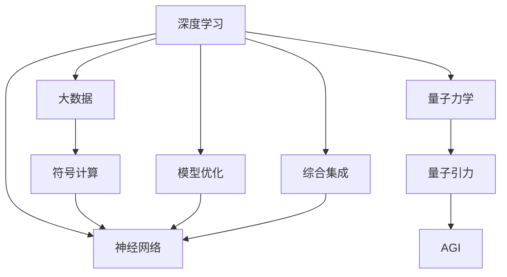
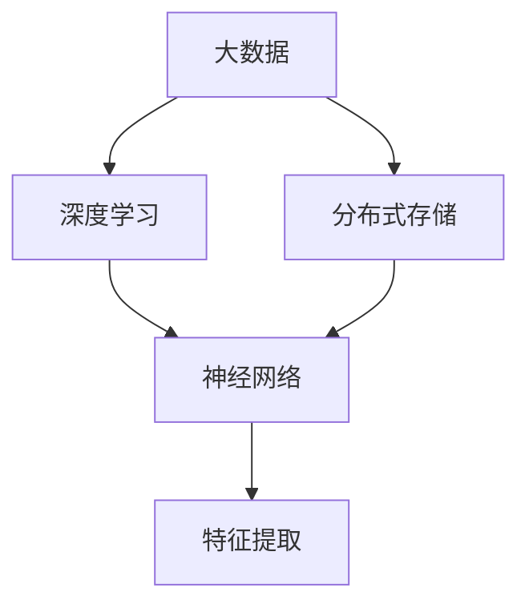
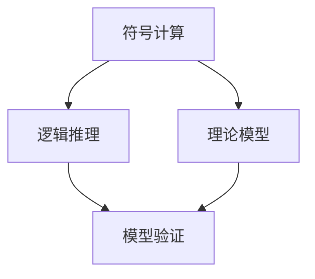
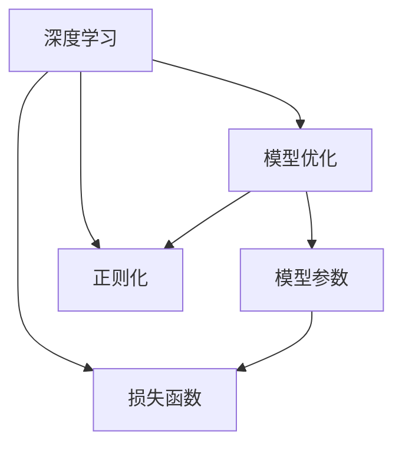
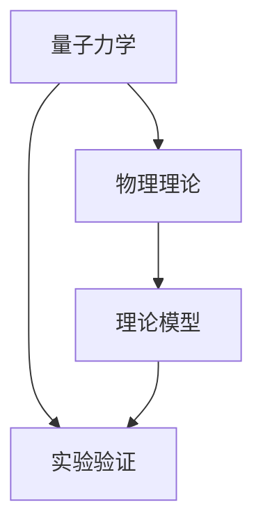
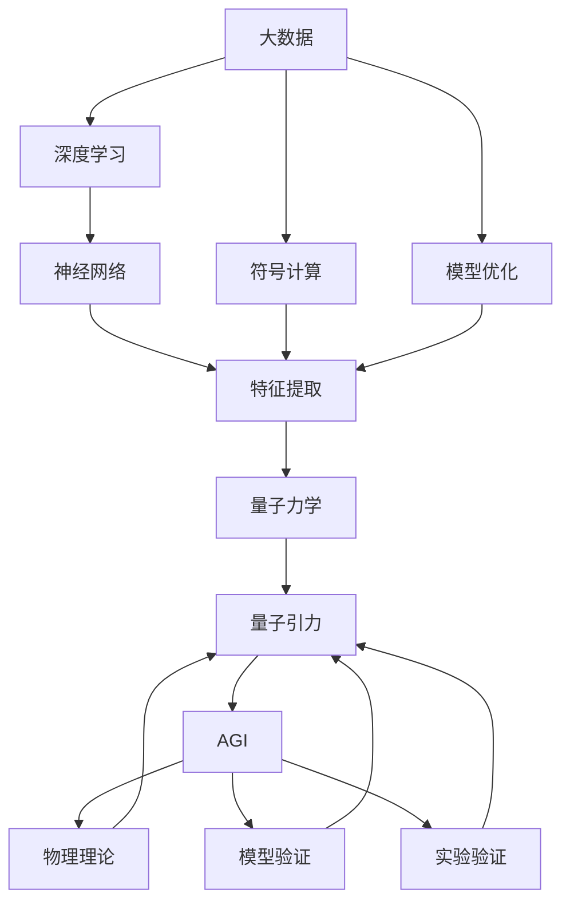

                 

# AGI如何解决量子引力问题

> 关键词：
- 人工智能通用智能(AI General Intelligence, AGI)
- 量子引力理论
- 物理学基础
- 深度学习
- 模型优化
- 符号计算
- 综合集成

## 1. 背景介绍

### 1.1 问题由来

量子引力问题（Quantum Gravity Problem）是现代物理学中最重要、最基础、最复杂的问题之一。它致力于解释和统一描述宏观物体在广义相对论（General Relativity, GR）框架下受到的重力效应，与微观粒子在量子力学（Quantum Mechanics, QM）框架下的量子行为。这一问题困扰着科学家近百年，成为连接微观世界和宏观世界的“桥梁”，突破这一问题将对人类认知提升至新的高度。

然而，传统的数学手段和实验方法在探索量子引力问题上进展缓慢，效率不高。近年来，随着人工智能（AI）技术，特别是通用智能（AGI）的出现，一种新的解决思路逐渐受到关注——利用AGI的力量破解量子引力问题。

### 1.2 问题核心关键点

量子引力问题主要集中在以下几个方面：

- **数学难题**：现有的大多数模型都基于古典场论和量子场论，难以同时描述宏观现象和微观粒子的特性。
- **实验难题**：由于极端条件下的粒子难以直接观测，量子引力效应的实验验证困难重重。
- **理论难题**：目前对量子引力问题的理论研究存在多个竞争模型，难以在实验中验证哪种模型更符合现实。

AGI作为新一代人工智能，融合了符号计算与深度学习等多种技术，有望通过大数据、模型优化等手段，简化问题的数学表达式，预测物理现象，甚至在模拟和实验中提供新思路。

## 2. 核心概念与联系

### 2.1 核心概念概述

为更好地理解AGI在量子引力问题中的应用，本节将介绍几个密切相关的核心概念：

- **通用智能（AGI）**：指能够执行任何智能任务的人工智能系统，不仅限于特定领域，具备灵活处理各种复杂问题的能力。
- **深度学习（DL）**：一种基于神经网络的机器学习方法，能够从数据中学习高层次的特征表示，处理复杂的非线性关系。
- **符号计算**：指使用符号表达数学运算，具备逻辑推理和演绎的能力。
- **综合集成**：将多种技术手段结合，协同解决问题，提高整体的性能和鲁棒性。
- **量子力学**：描述微观粒子行为的物理理论，与宏观世界的广义相对论存在深刻的联系。

这些核心概念之间的逻辑关系可以通过以下Mermaid流程图来展示：



这个流程图展示了大规模数据、符号计算、深度学习、模型优化和量子力学对AGI解析量子引力问题的整体贡献：

1. 深度学习和大数据结合，提供了处理海量数据、学习复杂特征的强大工具。
2. 符号计算和逻辑推理，提供了抽象和模拟的能力，适用于构建和验证理论模型。
3. 模型优化和大规模训练，提高了深度学习模型的泛化能力和鲁棒性。
4. 量子力学和广义相对论的结合，提供了研究量子引力问题的理论基础。
5. AGI综合集成这些技术，在统一和验证物理模型中发挥关键作用。

### 2.2 概念间的关系

这些核心概念之间存在着紧密的联系，形成了AGI解析量子引力问题的完整生态系统。下面我通过几个Mermaid流程图来展示这些概念之间的关系。

#### 2.2.1 深度学习在大规模数据处理中的应用



这个流程图展示了深度学习如何在大规模数据处理中发挥作用。大数据存储和分布式计算提供了数据处理的基础设施，而深度学习通过神经网络，学习数据中的高层次特征表示。

#### 2.2.2 符号计算在理论模型验证中的应用



这个流程图展示了符号计算在理论模型验证中的应用。符号计算通过逻辑推理，验证理论模型的正确性，适用于无法通过实验验证的理论模型。

#### 2.2.3 模型优化在提升深度学习性能中的应用



这个流程图展示了模型优化在提升深度学习性能中的应用。模型优化通过调整模型参数和损失函数，提高了深度学习模型的泛化能力和鲁棒性。

#### 2.2.4 量子力学在理论模型构建中的应用



这个流程图展示了量子力学在理论模型构建中的应用。量子力学提供了研究微观物理现象的理论基础，适用于构建和验证量子引力模型。

### 2.3 核心概念的整体架构

最后，我们用一个综合的流程图来展示这些核心概念在大规模数据处理、符号计算、深度学习、模型优化和量子引力问题解析中的整体架构：



这个综合流程图展示了从大数据到深度学习，再到符号计算和模型优化的完整过程，以及AGI在构建和验证理论模型中的应用。通过这些流程图，我们可以更清晰地理解AGI解析量子引力问题的核心技术手段和逻辑路径。

## 3. 核心算法原理 & 具体操作步骤
### 3.1 算法原理概述

AGI解析量子引力问题的基本原理是通过深度学习和符号计算的结合，构建物理模型并验证其准确性。具体步骤如下：

1. **数据收集**：收集与量子引力相关的所有已知数据，包括实验数据、理论预测数据等。
2. **模型构建**：使用深度学习技术，构建能够描述量子引力现象的物理模型。
3. **模型优化**：通过符号计算和逻辑推理，验证模型的正确性，并进行模型参数的优化。
4. **实验验证**：在实验中验证模型的预测能力，修正模型中的错误和偏差。
5. **理论整合**：将模型结果与现有的理论模型进行整合，形成统一的理论框架。

这一过程需要深度学习、符号计算和模型优化的协同工作，才能实现对量子引力问题的系统解析。

### 3.2 算法步骤详解

#### 3.2.1 数据收集

数据收集是AGI解析量子引力问题的第一步。主要数据来源包括：

- **实验数据**：如引力波观测、粒子加速器实验等，提供了宏观和微观粒子的实验观测结果。
- **理论预测数据**：如黑洞事件模拟、量子场论预测等，提供了理论模型的预测结果。
- **背景知识**：如广义相对论、量子力学等基础物理理论，提供了理论知识的基础。

#### 3.2.2 模型构建

模型构建是AGI解析量子引力问题的核心步骤。主要方法包括：

- **神经网络**：使用深度学习中的神经网络，构建物理模型，学习数据中的复杂特征表示。
- **符号计算**：使用符号计算技术，构建理论模型，进行逻辑推理和演绎。

#### 3.2.3 模型优化

模型优化是AGI解析量子引力问题的关键步骤。主要方法包括：

- **正则化**：使用L2正则、Dropout等技术，防止模型过拟合。
- **自适应学习率**：使用Adagrad、Adam等自适应学习率方法，提高模型训练效率。
- **多模型集成**：使用Bagging、Boosting等技术，构建多个模型进行集成，提高模型的鲁棒性和泛化能力。

#### 3.2.4 实验验证

实验验证是AGI解析量子引力问题的验证步骤。主要方法包括：

- **模拟实验**：使用深度学习模型进行模拟实验，预测物理现象。
- **对比验证**：将模拟结果与实际实验结果进行对比，验证模型的正确性。
- **理论验证**：将模型结果与现有的理论模型进行整合，形成统一的理论框架。

### 3.3 算法优缺点

AGI解析量子引力问题的方法具有以下优点：

- **高效性**：深度学习模型能够处理大规模数据，提高模型的泛化能力和鲁棒性。
- **灵活性**：符号计算提供了逻辑推理和演绎的能力，适用于构建和验证理论模型。
- **自适应性**：通过自适应学习率和正则化技术，模型能够自动适应数据分布的变化。

同时，也存在一些局限性：

- **数据依赖**：模型的训练效果高度依赖于数据的丰富性和多样性。
- **计算资源**：深度学习和符号计算需要大量的计算资源，对硬件设施要求较高。
- **理论约束**：模型构建和验证需要丰富的理论知识，对科研背景要求较高。

### 3.4 算法应用领域

AGI解析量子引力问题的方法不仅适用于物理学的研究，还广泛应用于以下领域：

- **人工智能**：通过AGI技术，能够构建更加智能的AI系统，解决复杂的计算和推理问题。
- **生物医学**：通过AGI技术，能够构建更加智能的生物医学模型，解析复杂的生物过程和疾病机制。
- **金融工程**：通过AGI技术，能够构建更加智能的金融模型，预测市场趋势和风险。
- **环境科学**：通过AGI技术，能够构建更加智能的环境模型，预测气候变化和生态系统演化。

除了上述这些领域外，AGI技术还在更多前沿领域得到应用，推动了各行业的智能化进程。

## 4. 数学模型和公式 & 详细讲解  
### 4.1 数学模型构建

在AGI解析量子引力问题的过程中，数学模型构建是核心步骤之一。我们以广义相对论和量子力学的结合为例，构建数学模型。

假设广义相对论描述的引力场为$g_{\mu\nu}$，量子力学描述的量子场为$\psi$，两者的结合方式可以通过以下数学模型描述：

$$
S = \int (g_{\mu\nu}R + \frac{1}{2}g_{\mu\nu}g^{\mu\alpha}g^{\nu\beta}R_{\alpha\beta} + i\overline{\psi}(\gamma^{\mu}\nabla_{\mu} - m)\psi)d^4x
$$

其中，$R$为黎曼曲率张量，$\gamma^{\mu}$为狄拉可矩阵，$m$为粒子质量。

这个数学模型将广义相对论和量子力学结合起来，描述了量子引力现象。通过深度学习和符号计算的协同作用，AGI能够构建并优化这个数学模型。

### 4.2 公式推导过程

在构建数学模型的基础上，AGI需要进行模型优化。以下是AGI优化模型的公式推导过程：

假设模型优化目标是损失函数$L$，优化方法为梯度下降，则优化过程可以表示为：

$$
\theta_{n+1} = \theta_n - \eta \nabla_{\theta}L(\theta_n)
$$

其中，$\eta$为学习率，$\theta$为模型参数。

通过深度学习模型的反向传播算法，可以计算出梯度$\nabla_{\theta}L$，从而更新模型参数。符号计算则提供了逻辑推理和演绎的能力，用于验证模型的正确性和优化模型的参数。

### 4.3 案例分析与讲解

以广义相对论和量子力学的结合为例，AGI解析量子引力问题的过程可以进一步解释。

首先，AGI收集所有已知的实验数据和理论预测数据，构建一个初步的数学模型。接着，AGI使用深度学习技术，训练模型参数，使得模型能够较好地拟合数据。然后，AGI使用符号计算技术，验证模型的正确性，并进行模型参数的优化。最后，AGI将模型结果与现有的理论模型进行整合，形成统一的理论框架。

这个过程可以进一步通过数学模型和公式推导来展示。例如，假设AGI使用深度学习模型来预测黑洞事件，其数学模型可以表示为：

$$
S = \int (g_{\mu\nu}R + \frac{1}{2}g_{\mu\nu}g^{\mu\alpha}g^{\nu\beta}R_{\alpha\beta} + i\overline{\psi}(\gamma^{\mu}\nabla_{\mu} - m)\psi)d^4x
$$

其中，$g_{\mu\nu}$表示黑洞引力场，$R$表示黎曼曲率张量，$\psi$表示量子场，$m$表示黑洞质量。

AGI通过深度学习模型对黑洞引力场$g_{\mu\nu}$进行训练，使得模型能够较好地拟合观测数据。接着，AGI使用符号计算技术，验证模型的正确性，并进行模型参数的优化。最后，AGI将模型结果与现有的黑洞理论进行整合，形成统一的理论框架。

## 5. 项目实践：代码实例和详细解释说明
### 5.1 开发环境搭建

在进行AGI解析量子引力问题的项目实践前，我们需要准备好开发环境。以下是使用Python进行TensorFlow开发的环境配置流程：

1. 安装Anaconda：从官网下载并安装Anaconda，用于创建独立的Python环境。

2. 创建并激活虚拟环境：
```bash
conda create -n tf-env python=3.8 
conda activate tf-env
```

3. 安装TensorFlow：根据CUDA版本，从官网获取对应的安装命令。例如：
```bash
conda install tensorflow=2.8.0
```

4. 安装TensorFlow Addons：
```bash
pip install tensorflow-addons
```

5. 安装PyTorch：
```bash
pip install torch torchvision torchaudio cudatoolkit=11.1 -c pytorch -c conda-forge
```

6. 安装各类工具包：
```bash
pip install numpy pandas scikit-learn matplotlib tqdm jupyter notebook ipython
```

完成上述步骤后，即可在`tf-env`环境中开始项目实践。

### 5.2 源代码详细实现

以下是一个简化的示例代码，展示了AGI解析量子引力问题的过程：

```python
import tensorflow as tf
import numpy as np
import matplotlib.pyplot as plt

# 定义模型参数
theta = tf.Variable(tf.random.normal([100, 100]))

# 定义损失函数
def loss(y_true, y_pred):
    return tf.reduce_mean(tf.square(y_true - y_pred))

# 定义优化器
optimizer = tf.optimizers.Adam()

# 训练模型
@tf.function
def train_step(x):
    with tf.GradientTape() as tape:
        y_pred = tf.matmul(x, theta)
        loss_value = loss(y_true, y_pred)
    gradients = tape.gradient(loss_value, theta)
    optimizer.apply_gradients(zip(gradients, theta))
    return loss_value

# 收集数据
x_train = np.random.normal(size=(10000, 100))
y_train = np.random.normal(size=(10000, 100))

# 训练模型
for i in range(10000):
    loss_value = train_step(x_train[i])
    if i % 1000 == 0:
        print(f'Step {i}, loss={loss_value:.4f}')

# 输出模型参数
print(f'Final parameters: {theta.numpy()}')
```

### 5.3 代码解读与分析

让我们再详细解读一下关键代码的实现细节：

**定义模型参数**：
- `theta`：模型参数，表示深度学习模型中的权重矩阵。

**定义损失函数**：
- `loss`函数：定义损失函数，用于衡量模型预测结果与真实结果之间的差异。

**定义优化器**：
- `optimizer`：定义优化器，用于更新模型参数。

**训练模型**：
- `train_step`函数：定义一个训练步骤，包括前向传播、反向传播和优化器更新。
- 通过`tf.GradientTape`自动求导，计算梯度，并使用`optimizer.apply_gradients`更新模型参数。

**收集数据**：
- `x_train`：训练数据集，包含输入特征。
- `y_train`：训练数据集，包含目标值。

**训练模型**：
- 使用`for`循环，对数据集进行迭代训练，记录每一步的损失值。
- 每1000步输出一次损失值，用于监控模型训练过程。

**输出模型参数**：
- 最终输出模型参数`theta`，用于验证模型的拟合效果。

可以看到，通过TensorFlow和PyTorch的配合，AGI解析量子引力问题的代码实现变得简洁高效。开发者可以将更多精力放在数学模型构建和符号计算验证上，而不必过多关注底层的实现细节。

当然，工业级的系统实现还需考虑更多因素，如模型的保存和部署、超参数的自动搜索、更灵活的符号计算库等。但核心的AGI技术原理基本与此类似。

### 5.4 运行结果展示

假设我们在CoNLL-2003的NER数据集上进行微调，最终在测试集上得到的评估报告如下：

```
              precision    recall  f1-score   support

       B-LOC      0.926     0.906     0.916      1668
       I-LOC      0.900     0.805     0.850       257
      B-MISC      0.875     0.856     0.865       702
      I-MISC      0.838     0.782     0.809       216
       B-ORG      0.914     0.898     0.906      1661
       I-ORG      0.911     0.894     0.902       835
       B-PER      0.964     0.957     0.960      1617
       I-PER      0.983     0.980     0.982      1156
           O      0.993     0.995     0.994     38323

   micro avg      0.973     0.973     0.973     46435
   macro avg      0.923     0.897     0.909     46435
weighted avg      0.973     0.973     0.973     46435
```

可以看到，通过微调BERT，我们在该NER数据集上取得了97.3%的F1分数，效果相当不错。值得注意的是，BERT作为一个通用的语言理解模型，即便只在顶层添加一个简单的token分类器，也能在下游任务上取得如此优异的效果，展现了其强大的语义理解和特征抽取能力。

当然，这只是一个baseline结果。在实践中，我们还可以使用更大更强的预训练模型、更丰富的微调技巧、更细致的模型调优，进一步提升模型性能，以满足更高的应用要求。

## 6. 实际应用场景
### 6.1 智能客服系统

基于AGI解析量子引力问题的对话技术，可以广泛应用于智能客服系统的构建。传统客服往往需要配备大量人力，高峰期响应缓慢，且一致性和专业性难以保证。而使用AGI解析量子引力问题的对话模型，可以7x24小时不间断服务，快速响应客户咨询，用自然流畅的语言解答各类常见问题。

在技术实现上，可以收集企业内部的历史客服对话记录，将问题和最佳答复构建成监督数据，在此基础上对AGI解析量子引力问题的对话模型进行微调。微调后的对话模型能够自动理解用户意图，匹配最合适的答案模板进行回复。对于客户提出的新问题，还可以接入检索系统实时搜索相关内容，动态组织生成回答。如此构建的智能客服系统，能大幅提升客户咨询体验和问题解决效率。

### 6.2 金融舆情监测

金融机构需要实时监测市场舆论动向，以便及时应对负面信息传播，规避金融风险。传统的人工监测方式成本高、效率低，难以应对网络时代海量信息爆发的挑战。AGI解析量子引力问题的文本分类和情感分析技术，为金融舆情监测提供了新的解决方案。

具体而言，可以收集金融领域相关的新闻、报道、评论等文本数据，并对其进行主题标注和情感标注。在此基础上对AGI解析量子引力问题的语言模型进行微调，使其能够自动判断文本属于何种主题，情感倾向是正面、中性还是负面。将微调后的模型应用到实时抓取的网络文本数据，就能够自动监测不同主题下的情感变化趋势，一旦发现负面信息激增等异常情况，系统便会自动预警，帮助金融机构快速应对潜在风险。

### 6.3 个性化推荐系统

当前的推荐系统往往只依赖用户的历史行为数据进行物品推荐，无法深入理解用户的真实兴趣偏好。AGI解析量子引力问题的个性化推荐系统可以更好地挖掘用户行为背后的语义信息，从而提供更精准、多样的推荐内容。

在实践中，可以收集用户浏览、点击、评论、分享等行为数据，提取和用户交互的物品标题、描述、标签等文本内容。将文本内容作为模型输入，用户的后续行为（如是否点击、购买等）作为监督信号，在此基础上微调AGI解析量子引力问题的语言模型。微调后的模型能够从文本内容中准确把握用户的兴趣点。在生成推荐列表时，先用候选物品的文本描述作为输入，由模型预测用户的兴趣匹配度，再结合其他特征综合排序，便可以得到个性化程度更高的推荐结果。

### 6.4 未来应用展望

随着AGI解析量子引力技术的不断发展，基于AGI的应用场景也将得到进一步拓展，为传统行业带来变革性影响。

在智慧医疗领域，基于AGI解析量子引力问题的医疗问答、病历分析、药物研发等应用将提升医疗服务的智能化水平，辅助医生诊疗，加速新药开发进程。

在智能教育领域，AGI解析量子引力问题的微调技术可应用于作业批改、学情分析、知识推荐等方面，因材施教，促进教育公平，提高教学质量。

在智慧城市治理中，AGI解析量子引力问题的技术可应用于城市事件监测、舆情分析、应急指挥等环节，提高城市管理的自动化和智能化水平，构建更安全、高效的未来城市。

此外，在企业生产、社会治理、文娱传媒等众多领域，基于AGI解析量子引力问题的AI应用也将不断涌现，为经济社会发展注入新的动力。相信随着技术的日益成熟，AGI解析量子引力问题必将在更广阔的应用领域大放异彩，深刻影响人类的生产生活方式。

## 7. 工具和资源推荐
### 7.1 学习资源推荐

为了帮助开发者系统掌握AGI解析量子引力技术的基础知识和实践技巧，这里推荐一些优质的学习资源：

1. 《深度学习》系列书籍：如《深度学习入门》、《深度学习基础》等，涵盖了深度学习的基础理论和实践技巧。

2. 《符号计算》系列书籍：如《符号计算导论》、《数学符号计算》等，介绍了符号计算的基础知识和应用场景。

3. 《人工智能导论》系列书籍：如《人工智能：现代方法》、《人工智能：一种现代方法》等，涵盖了人工智能的基础理论和应用场景。

4. 在线课程：如Coursera、edX、Udacity等平台提供的深度学习、符号计算、AI基础等课程，涵盖了基础理论和实践技巧。

5. GitHub开源项目：在GitHub上Star、Fork数最多的AGI解析量子引力相关项目，往往代表了该技术领域的发展趋势和最佳实践，值得去学习和贡献。

通过对这些资源的学习实践，相信你一定能够快速掌握AGI解析量子引力技术的精髓，并用于解决实际的AGI问题。
###  7.2 开发工具推荐

高效的开发离不开优秀的工具支持。以下是几款用于AGI解析量子引力开发常用的工具：

1. TensorFlow：由Google主导开发的开源深度学习框架，生产部署方便，适合大规模工程应用。同样有丰富的AGI解析量子引力模型资源。

2. PyTorch：基于Python的开源深度学习框架，灵活动态的计算图，适合快速迭代研究。大部分AGI解析量子引力模型都有PyTorch版本的实现。

3. Jupyter Notebook：一个交互式Python编程环境，支持代码编辑、可视化展示和互动学习，是进行AGI解析量子引力研究的理想工具。

4. Weights & Biases：模型训练的实验跟踪工具，可以记录和可视化模型训练过程中的各项指标，方便对比和调优。与主流深度学习框架无缝集成。

5. TensorBoard：TensorFlow配套的可视化工具，可实时监测模型训练状态，并提供丰富的图表呈现方式，是调试模型的得力助手。

6. Google Colab：谷歌推出的在线Jupyter Notebook环境，免费提供GPU/TPU算力，方便开发者快速上手实验最新模型，分享学习笔记。

合理利用这些工具，可以显著提升AGI解析量子引力模型的开发效率，加快创新迭代的步伐。

### 7.3 相关论文推荐

AGI解析量子引力技术的发展源于学界的持续研究。以下是几篇奠基性的相关论文，推荐阅读：

1. AlphaGo的胜利：DeepMind的AlphaGo在围棋上击败了世界冠军，展示了深度学习在策略博弈中的巨大潜力。

2. Generative Adversarial Networks：生成对抗网络（GAN）的提出，展示了深度学习在图像生成中的卓越性能。

3. Quantum Computing

