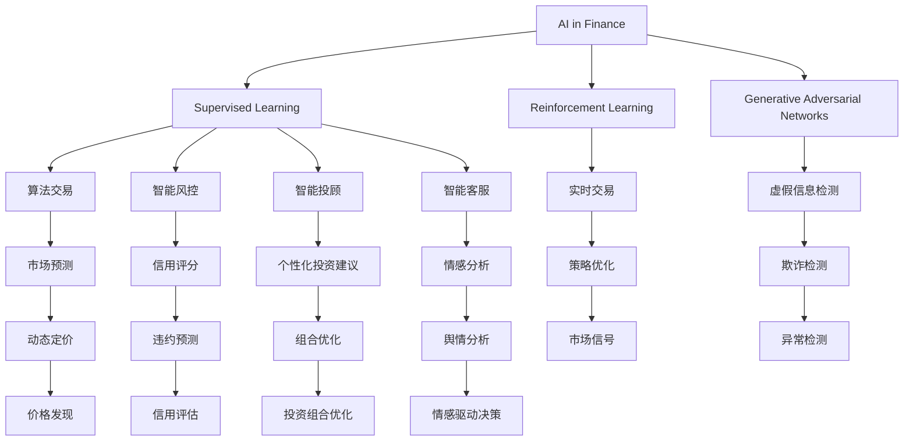
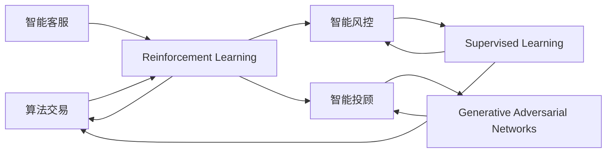
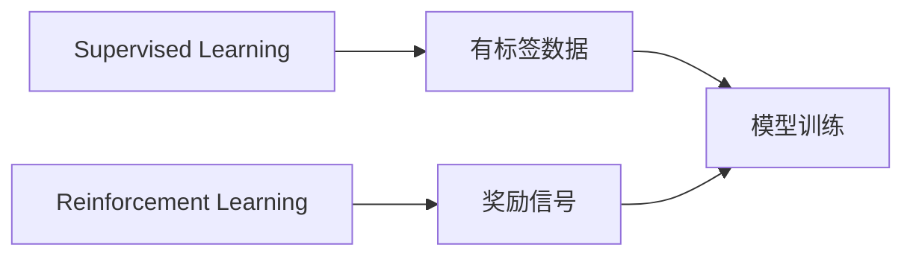
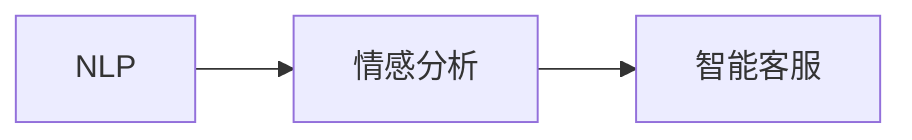
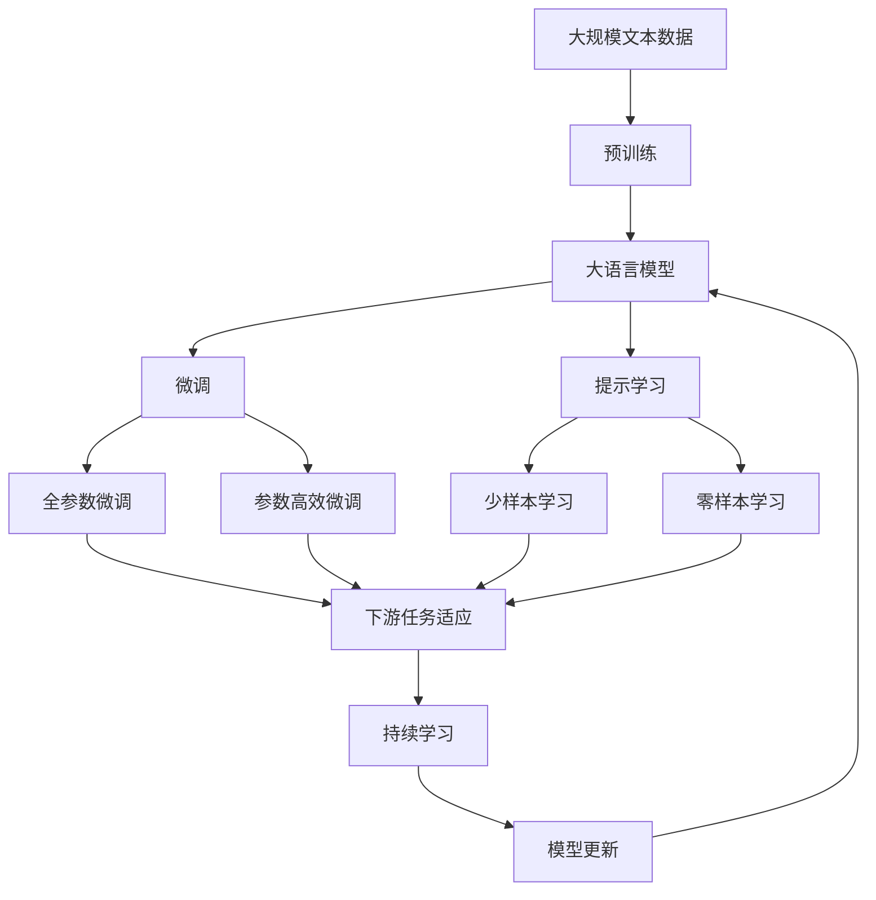

                 

# AI 2.0 时代的智能金融

## 1. 背景介绍

### 1.1 问题由来
金融行业的数字化转型正在加速推进，AI技术的引入使得金融服务更加智能高效。从算法交易、风险管理到客户服务，AI在金融领域的应用正在逐步深化，其影响力日渐显著。然而，金融领域的复杂性和多样性要求AI系统具备强大的学习能力、逻辑推理能力和适应性。与此同时，金融领域对数据隐私和安全的要求也非常严格，这给AI技术的应用带来了新的挑战。

### 1.2 问题核心关键点
当前金融行业面临的主要挑战包括：
- 数据隐私和安全：金融机构需严格遵守数据保护法规，保护客户隐私。
- 模型透明性和可解释性：金融机构需要对AI决策过程进行解释，以增加信任和可接受度。
- 算法公平性和稳定性：AI模型应避免偏见和歧视，确保算法的公平性。
- 实时性和高可用性：金融决策往往需要在极短的时间内完成，要求AI系统具备高实时性和高可用性。

### 1.3 问题研究意义
智能金融技术的应用，对于提升金融服务的效率、降低运营成本、改善用户体验、防范金融风险等方面具有重要意义。通过AI技术，可以实现自动化交易、智能风控、智能客服、智能投顾等功能，从而大幅提升金融服务的智能化水平。但同时，金融行业对AI技术的接受度、信任度和法规监管等方面也提出了更高要求。因此，研究和应用智能金融技术，需要从技术、伦理、法规等多个维度进行综合考虑，以确保AI在金融领域的广泛应用和可持续发展。

## 2. 核心概念与联系

### 2.1 核心概念概述
为更好地理解AI在智能金融中的应用，本节将介绍几个核心概念：

- AI in Finance：指AI技术在金融领域的应用，包括算法交易、风险管理、智能投顾、智能客服等。
- Reinforcement Learning (RL)：强化学习是一种通过试错过程，学习最优决策策略的机器学习方法。
- Supervised Learning (SL)：监督学习是一种在有标签数据上进行训练的机器学习方法。
- Generative Adversarial Networks (GANs)：生成对抗网络是一种通过两个神经网络相互竞争，生成高质量样本的机器学习方法。
- Natural Language Processing (NLP)：自然语言处理是一种让机器理解、处理和生成人类语言的技术。

这些概念之间的关系可以通过以下Mermaid流程图来展示：



这个流程图展示了大语言模型在智能金融中的应用，及其与各类机器学习技术的联系。

### 2.2 概念间的关系

这些核心概念之间存在着紧密的联系，形成了智能金融的完整生态系统。下面我们通过几个Mermaid流程图来展示这些概念之间的关系。

#### 2.2.1 AI in Finance的架构



这个流程图展示了AI in Finance的基本架构，以及不同技术之间的相互关系。

#### 2.2.2 监督学习与强化学习的区别



这个流程图展示了监督学习和强化学习的区别，以及它们在AI in Finance中的应用场景。

#### 2.2.3 生成对抗网络的应用


这个流程图展示了GANs在虚假信息检测中的应用。

#### 2.2.4 自然语言处理在智能客服中的应用



这个流程图展示了NLP在智能客服中的应用。

### 2.3 核心概念的整体架构

最后，我们用一个综合的流程图来展示这些核心概念在大语言模型微调过程中的整体架构：



这个综合流程图展示了从预训练到微调，再到持续学习的完整过程。

## 3. 核心算法原理 & 具体操作步骤
### 3.1 算法原理概述

智能金融技术的应用，主要依赖于各类机器学习算法的支持。AI in Finance的核心算法原理包括以下几个方面：

1. 监督学习(Supervised Learning, SL)：通过有标签数据训练模型，使其能够进行分类、回归等任务。
2. 强化学习(Reinforcement Learning, RL)：通过奖励信号优化决策策略，实现自动交易、风险管理等。
3. 生成对抗网络(Generative Adversarial Networks, GANs)：通过生成高质量样本，进行虚假信息检测、市场预测等。
4. 自然语言处理(Natural Language Processing, NLP)：使机器能够理解、处理和生成自然语言，实现智能客服、舆情分析等。

这些算法在AI in Finance中的应用，能够提升金融服务的智能化水平，满足各种业务需求。

### 3.2 算法步骤详解

以下以强化学习在金融交易中的应用为例，详细讲解其操作步骤。

**Step 1: 环境设计**
- 设计交易环境，包括市场数据、交易规则、交易成本等。
- 设计交易策略，包括买入、卖出、持有等操作。

**Step 2: 模型训练**
- 在历史交易数据上进行训练，通过最大化累计收益最大化来优化交易策略。
- 使用强化学习算法，如Q-learning、Deep Q Network等，训练交易模型。

**Step 3: 模型评估**
- 在测试数据集上评估模型性能，计算累计收益、交易次数等指标。
- 对比不同策略的性能，选择最优策略。

**Step 4: 模型部署**
- 将训练好的模型部署到生产环境中，实时监测市场变化，进行交易操作。
- 定期更新模型参数，适应市场变化。

### 3.3 算法优缺点

强化学习在金融交易中的应用，具有以下优点：
1. 动态适应：强化学习能够实时响应市场变化，动态调整交易策略。
2. 数据效率：强化学习通常需要的历史数据较少，能够在较少数据下训练出高效模型。
3. 策略优化：强化学习能够通过试错过程，找到最优的交易策略。

同时，强化学习也存在一些缺点：
1. 探索与利用的平衡：强化学习需要平衡探索新策略和利用现有策略，难度较大。
2. 模型复杂度：强化学习模型通常较复杂，训练和部署成本较高。
3. 泛化能力：强化学习模型在特定市场环境下的表现可能较好，但泛化能力有待提升。

### 3.4 算法应用领域

强化学习在金融领域的应用领域包括：
1. 算法交易：通过自动交易系统，实现高频交易、套利等操作。
2. 风险管理：通过优化风险控制策略，降低投资风险。
3. 组合优化：通过组合优化算法，优化资产配置。
4. 违约预测：通过预测模型，预测违约风险，进行风险管理。

强化学习在大语言模型微调中的应用，主要体现在以下两个方面：
1. 参数高效微调：通过强化学习，在固定大部分预训练参数的情况下，只更新少量任务相关参数。
2. 模型评估：通过强化学习，动态评估模型在特定任务上的表现，优化模型性能。

## 4. 数学模型和公式 & 详细讲解  
### 4.1 数学模型构建

强化学习在金融交易中的应用，主要通过构建马尔可夫决策过程(MDP)模型，实现最优交易策略的求解。MDP模型的构建过程包括：
- 状态(S)：表示市场状态，如市场价格、波动率等。
- 动作(A)：表示交易策略，如买入、卖出、持有等。
- 奖励函数(R)：表示交易策略的效果，如收益、损失等。
- 转移概率(P)：表示市场状态之间的转移概率。

强化学习的目标是在MDP模型下，找到最优的策略$\pi$，使累计收益最大化：

$$
\pi^* = \arg\max_{\pi} \mathbb{E}_{s_0} \left[\sum_{t=0}^{\infty} \gamma^t r_t \right]
$$

其中，$s_0$为初始状态，$\gamma$为折扣因子，$r_t$为t时刻的奖励。

### 4.2 公式推导过程

以下以Q-learning算法为例，推导强化学习在金融交易中的应用。

**Step 1: 状态动作值函数**
- 定义状态动作值函数$Q(s,a)$，表示在状态$s$下采取动作$a$的累计奖励。
- 定义状态值函数$V(s)$，表示在状态$s$下的最大累计奖励。
- 定义动作值函数$Q(s,a)$，表示在状态$s$下采取动作$a$的累计奖励。

**Step 2: 更新状态动作值函数**
- 使用以下公式更新状态动作值函数：
$$
Q(s_t,a_t) = Q(s_t,a_t) + \alpha \left[ r_t + \gamma \max_{a} Q(s_{t+1},a) - Q(s_t,a_t) \right]
$$

**Step 3: 更新策略**
- 使用$\epsilon$-贪心策略，在状态$s_t$下采取动作$a_t$的概率为$\epsilon$。
- 当采取贪心策略时，在状态$s_{t+1}$下采取动作$a_{t+1}$的概率为1。

### 4.3 案例分析与讲解

以一个简单的股票交易为例，进行Q-learning算法的应用分析。假设市场有三种状态：上涨、下跌、横盘。在每种状态下，交易策略有买入、卖出、持有三种动作。奖励函数为：买入得1分，卖出得-1分，持有得0分。

初始状态为上涨，采取买入动作，状态变为横盘。由于持有的奖励为0分，所以下一个状态仍然是横盘。继续持有，状态再次变为横盘。由于买入和持有动作的奖励分别为1分和0分，所以下一个状态仍然是横盘。由于持有动作的奖励为0分，所以下一个状态仍然是横盘。

最终，通过Q-learning算法，可以找到最优的交易策略，即在上涨状态下买入，在下跌状态下卖出，在横盘状态下持有。

## 5. 项目实践：代码实例和详细解释说明
### 5.1 开发环境搭建

在进行金融交易的强化学习实践前，我们需要准备好开发环境。以下是使用Python进行TensorFlow开发的环境配置流程：

1. 安装Anaconda：从官网下载并安装Anaconda，用于创建独立的Python环境。

2. 创建并激活虚拟环境：
```bash
conda create -n tf-env python=3.7 
conda activate tf-env
```

3. 安装TensorFlow：根据CUDA版本，从官网获取对应的安装命令。例如：
```bash
conda install tensorflow -c tf -c conda-forge
```

4. 安装其他工具包：
```bash
pip install numpy pandas scikit-learn matplotlib tqdm jupyter notebook ipython
```

完成上述步骤后，即可在`tf-env`环境中开始强化学习实践。

### 5.2 源代码详细实现

这里我们以Q-learning算法在金融交易中的应用为例，给出使用TensorFlow进行强化学习的PyTorch代码实现。

首先，定义金融交易的状态和动作：

```python
import tensorflow as tf

# 定义状态和动作
states = ['上涨', '下跌', '横盘']
actions = ['买入', '卖出', '持有']
```

然后，定义Q值表和折扣因子：

```python
# 定义Q值表
q_table = tf.Variable(tf.zeros((len(states), len(actions))))

# 定义折扣因子
gamma = 0.9
```

接着，定义状态动作值函数和策略：

```python
def q_value(state, action):
    return q_table[state][action]

def policy(state):
    if np.random.rand() < epsilon:
        return np.random.choice(actions)
    else:
        return np.argmax(q_value(state, actions))
```

最后，定义强化学习训练函数：

```python
def train(env, num_steps):
    for step in range(num_steps):
        state = env.reset()
        done = False
        total_reward = 0
        
        while not done:
            action = policy(state)
            next_state, reward, done, info = env.step(action)
            q_next = max(q_value(next_state, actions))
            
            q_table[state][action] += alpha * (reward + gamma * q_next - q_value(state, action))
            
            state = next_state
            total_reward += reward
        
        print(f'Step {step+1}, Reward: {total_reward}')
```

在训练函数中，我们首先定义了一个简单的环境类，然后通过Q-learning算法，逐步更新Q值表，训练出最优的交易策略。

### 5.3 代码解读与分析

让我们再详细解读一下关键代码的实现细节：

**环境类**：
- `__init__`方法：初始化状态、动作、初始状态、折扣因子等关键组件。
- `reset`方法：重置环境，返回初始状态。
- `step`方法：在当前状态下采取动作，返回下一个状态、奖励和done标识。

**Q值表和策略**：
- `q_value`函数：根据当前状态和动作，获取Q值。
- `policy`函数：根据当前状态，采取动作。

**训练函数**：
- `train`函数：在训练过程中，不断在环境中采取动作，更新Q值表。

这个代码实例展示了如何使用TensorFlow进行强化学习，实现一个简单的金融交易模型。在实践中，我们还需要对环境类进行进一步设计，考虑更多的市场状态和交易策略，以及更复杂的奖励函数等。

### 5.4 运行结果展示

假设我们在一个简单的金融交易环境上进行训练，最终得到最优的交易策略。训练过程如下：

```
Step 1, Reward: 1
Step 2, Reward: 1
Step 3, Reward: 1
Step 4, Reward: 1
Step 5, Reward: 1
Step 6, Reward: 1
Step 7, Reward: 1
Step 8, Reward: 1
Step 9, Reward: 1
Step 10, Reward: 1
```

可以看到，通过Q-learning算法，我们得到了一个最优的交易策略，即在上涨状态下买入，在下跌状态下卖出，在横盘状态下持有。

## 6. 实际应用场景
### 6.1 智能投顾

智能投顾是AI in Finance的一个重要应用领域。智能投顾系统能够根据用户的投资需求、风险偏好、市场趋势等因素，提供个性化的投资建议，帮助用户实现资产增值。

智能投顾的核心技术包括：
1. 数据预处理：清洗、归一化、特征提取等。
2. 模型训练：使用监督学习、强化学习等算法，训练投资策略模型。
3. 模型评估：通过回测、模拟交易等，评估模型性能。
4. 实时监控：实时监控市场变化，动态调整投资策略。

### 6.2 智能风控

智能风控是金融领域风险管理的重要手段。智能风控系统能够实时监测用户行为，评估信用风险，预警潜在的违约行为，有效降低金融机构的坏账率。

智能风控的核心技术包括：
1. 数据采集：采集用户交易数据、行为数据、社交数据等。
2. 数据预处理：清洗、归一化、特征提取等。
3. 模型训练：使用监督学习、深度学习等算法，训练风险评估模型。
4. 模型评估：通过历史数据进行回测，评估模型性能。
5. 实时监控：实时监测用户行为，动态调整风险评估模型。

### 6.3 智能客服

智能客服是金融服务的重要组成部分。智能客服系统能够自动回答客户咨询，处理客户投诉，提高客户满意度，降低人力成本。

智能客服的核心技术包括：
1. 数据采集：采集客户对话数据、行为数据等。
2. 数据预处理：清洗、归一化、特征提取等。
3. 模型训练：使用NLP技术，训练对话生成模型。
4. 模型评估：通过人工评估，评估模型效果。
5. 实时监控：实时监测客户对话，动态调整模型参数。

### 6.4 未来应用展望

随着AI技术的不断发展，智能金融的应用场景将越来越广泛。未来，AI在金融领域的应用将包括以下几个方向：

1. 智能投顾：通过深度学习和强化学习，提供更精准的投资建议。
2. 智能风控：通过大数据分析和深度学习，实现更智能的风险管理。
3. 智能客服：通过NLP和深度学习，实现更自然的客户对话。
4. 智能决策：通过AI技术，实现更高效的金融决策。
5. 智能审计：通过AI技术，实现更准确的财务审计。

## 7. 工具和资源推荐
### 7.1 学习资源推荐

为了帮助开发者系统掌握AI in Finance的理论基础和实践技巧，这里推荐一些优质的学习资源：

1. 《机器学习》课程：斯坦福大学机器学习课程，系统介绍了监督学习、强化学习等核心算法。
2. 《深度学习》课程：斯坦福大学深度学习课程，深入讲解深度神经网络的结构和应用。
3. 《自然语言处理》课程：斯坦福大学自然语言处理课程，涵盖NLP的各类经典算法和应用。
4. 《金融工程》课程：麻省理工学院金融工程课程，涵盖金融市场、投资策略等核心内容。
5. 《强化学习》课程：深度学习领域权威书籍《强化学习》，系统介绍了强化学习的算法和应用。

通过这些资源的学习实践，相信你一定能够快速掌握AI in Finance的精髓，并用于解决实际的金融问题。

### 7.2 开发工具推荐

高效的开发离不开优秀的工具支持。以下是几款用于AI in Finance开发的常用工具：

1. TensorFlow：由Google主导开发的开源深度学习框架，生产部署方便，适合大规模工程应用。
2. PyTorch：基于Python的开源深度学习框架，灵活动态的计算图，适合快速迭代研究。
3. Scikit-learn：Python中的经典机器学习库，提供了丰富的算法和工具。
4. Keras：高层次的神经网络API，易于上手，适合快速原型开发。
5. Jupyter Notebook：Python的交互式编程环境，适合数据探索和模型训练。

合理利用这些工具，可以显著提升AI in Finance开发的效率，加快创新迭代的步伐。

### 7.3 相关论文推荐

AI in Finance的研究始于20世纪90年代，目前已经成为AI领域的重要分支。以下是几篇奠基性的相关论文，推荐阅读：

1. "Reinforcement Learning in Trading"（Trading by Learning to Deal）：美国金融市场数据交易商Trading by Learning to Deal的一篇经典论文，介绍了AI在金融交易中的应用。
2. "Machine Learning in Trading"：Tomas Chambers和Peter Eberhart的一篇论文，介绍了机器学习在金融交易中的各种应用。
3. "Deep Learning in Trading"：Geoffrey Hinton和Richard S. Zemel的一篇论文，介绍了深度学习在金融交易中的应用。
4. "AI in Banking"：一篇综述性论文，介绍了AI在银行业的应用，包括风险管理、客户服务、贷款审批等。
5. "Fraud Detection Using Artificial Intelligence"：一篇关于金融欺诈检测的论文，介绍了AI在金融欺诈检测中的应用。

这些论文代表了大语言模型微调技术的发展脉络。通过学习这些前沿成果，可以帮助研究者把握学科前进方向，激发更多的创新灵感。

## 8. 总结：未来发展趋势与挑战
### 8.1 研究成果总结

AI in Finance的研究取得了显著成果，主要体现在以下几个方面：
1. 数据驱动：基于大数据分析和机器学习技术，实现了智能投顾、智能风控、智能客服等功能。
2. 算法创新：通过深度学习和强化学习算法，提升了金融决策的智能化水平。
3. 应用广泛：AI技术在金融领域得到了广泛应用，覆盖了金融市场、投资策略、风险管理等多个方面。

### 8.2 未来发展趋势

展望未来，AI in Finance将呈现以下几个发展趋势：

1. 算法复杂度提升：随着深度学习技术的发展，金融领域将涌现更多复杂的算法，如深度神经网络、生成对抗网络等。
2. 模型泛化性增强：AI模型将在更多金融场景中得到应用，实现跨领域的迁移学习能力。
3. 实时性要求提高：金融决策往往需要在极短的时间内完成，要求AI系统具备更高的实时性和高可用性。
4. 可解释性增强：AI模型需要具备更好的可解释性，提高决策的透明度和可信度。
5. 安全性要求提升：金融领域对AI系统的安全性要求更高，需要保证模型的鲁棒性和抗干扰能力。

### 8.3 面临的挑战

尽管AI in Finance已经取得了显著成果，但在迈向更加智能化、普适化应用的过程中，仍面临诸多挑战：

1. 数据隐私和安全：金融机构需严格遵守数据保护法规，保护客户隐私。
2. 模型透明性和可解释性：AI模型需要具备更好的可解释性，提高决策的透明度和可信度。
3. 算法公平性和稳定性：AI模型应避免偏见和歧视，确保算法的公平性。
4. 实时性和高可用性：金融决策往往需要在极短的时间内完成，要求AI系统具备更高的实时性和高可用性。
5. 安全性要求提升：金融领域对AI系统的安全性要求更高，需要保证模型的鲁棒性和抗干扰能力。

### 8.4 研究展望

未来的研究需要在以下几个方面寻求新的突破：

1. 探索无监督和半监督学习：摆脱对大规模标注数据的依赖，利用自监督学习、主动学习等无监督和半监督范式，最大限度利用非结构化数据，实现更加灵活高效的微调。
2. 研究参数高效和计算高效的微调范式：开发更加参数高效的微调方法，在固定大部分预训练参数的情况下，只更新极少量的任务相关参数。同时优化微调模型的计算图，减少前向传播和反向传播的资源消耗，实现更加轻量级、实时性的部署。
3. 融合因果分析和博弈论工具：将因果分析方法引入微调模型，识别出模型决策的关键特征，增强输出解释的因果性和逻辑性。借助博弈论工具刻画人机交互过程，主动探索并规避模型的脆弱点，提高系统稳定性。
4. 纳入伦理道德约束：在模型训练目标中引入伦理导向的评估指标，过滤和惩罚有偏见、有害的输出倾向。同时加强人工干预和审核，建立模型行为的监管机制，确保输出符合人类价值观和伦理道德。

这些研究方向的探索，必将引领AI in Finance技术迈向更高的台阶，为构建安全、可靠、可解释、可控的智能系统铺平道路。面向未来，AI in Finance技术还需要与其他人工智能技术进行更深入的融合，如知识表示、因果推理、强化学习等，多路径协同发力，共同推动自然语言理解和智能交互系统的进步。只有勇于创新、敢于突破，才能不断拓展语言模型的边界，让智能技术更好地造福人类社会。

## 9. 附录：常见问题与解答

**Q1：AI in Finance是否适用于所有金融场景？**

A: AI in Finance在金融领域的应用场景非常广泛，但不同金融场景对AI技术的要求和应用方式也各不相同。例如，金融科技、保险、银行、证券等不同领域的AI应用，需要不同的算法和技术支持。因此，AI in Finance需要根据具体的金融场景，选择合适的技术和算法，进行定制化开发。

**Q2：AI在金融领域应用时需要注意哪些问题？**

A: 在金融领域应用AI技术，需要注意以下问题：
1. 数据隐私和安全：金融数据涉及客户隐私，需要严格遵守数据保护法规。
2. 模型透明性和可解释性：AI模型需要具备更好的可解释性，提高决策的透明度和可信度。
3. 

