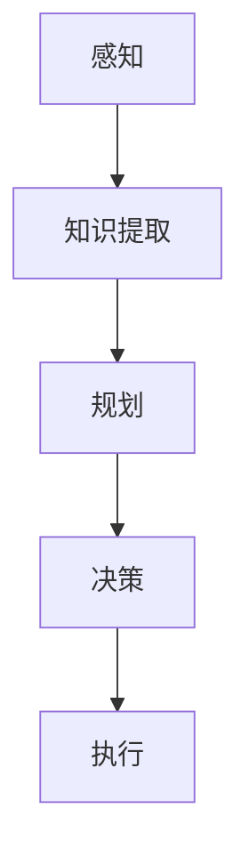
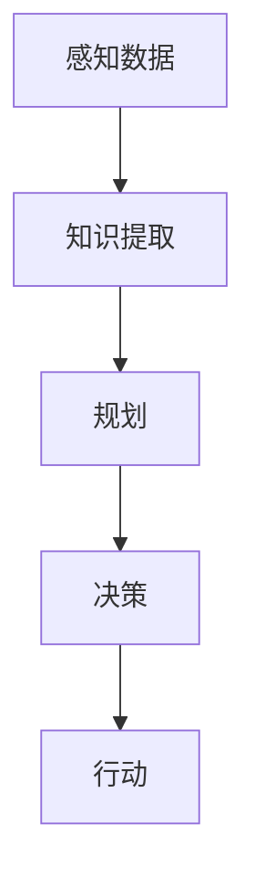

                 

# AI Agent通过感知从环境中收集信息并提取相关知识。然后通过规划为了达到某个目标做出决策

> 关键词：AI Agent, 感知, 知识提取, 规划, 决策

## 1. 背景介绍

在智能系统与人工智能(AI)领域，构建AI Agent以执行特定任务和达成目标已经成为研究热点。AI Agent不仅能够自主地在环境中探索和收集信息，还能够从海量数据中提取相关知识，进而通过规划和决策实现复杂任务。本文将深入探讨AI Agent的核心机制，包括感知、知识提取、规划和决策的流程，并详细分析其应用场景与未来趋势。

### 1.1 问题由来

随着人工智能技术的快速发展，AI Agent已经从简单的游戏AI发展到能够执行各种复杂任务的智能系统。例如，AlphaGo不仅在围棋领域取得突破，还被应用于医疗诊断、金融预测等领域。AI Agent的核心在于其自主学习与决策能力，能够通过环境感知、知识提取和规划决策执行目标任务。然而，现有研究多聚焦于具体的任务算法，对于AI Agent的整体机制和流程研究不足。

### 1.2 问题核心关键点

AI Agent的核心流程包含以下几个关键点：

1. **感知**：AI Agent通过传感器感知环境，获取当前状态。
2. **知识提取**：从感知数据中提取关键信息，形成知识表示。
3. **规划**：根据目标和当前状态，规划出最优行动路径。
4. **决策**：根据规划结果，生成行动并执行。

这一系列流程涉及感知、表示学习、规划和控制等技术。本文将详细介绍这一流程，并探讨其核心算法和具体操作。

### 1.3 问题研究意义

深入理解AI Agent的流程对于提升AI系统的智能水平具有重要意义。通过对感知、知识提取、规划和决策等关键步骤的透彻分析，可以：

1. 提升AI系统在复杂环境下的适应性。
2. 提高AI系统的自主学习与决策能力。
3. 推动AI系统向更加通用和智能的方向发展。

## 2. 核心概念与联系

### 2.1 核心概念概述

为更好地理解AI Agent的整体流程，我们将介绍几个核心概念：

- **感知(Perception)**：AI Agent通过传感器获取环境信息。
- **知识提取(Knowledge Extraction)**：从感知数据中提取有用的信息，形成知识表示。
- **规划(Planning)**：根据目标和当前状态，规划出最优行动路径。
- **决策(Decision Making)**：根据规划结果，生成并执行行动。

这些概念之间存在着紧密的联系，通过感知、知识提取、规划和决策等步骤，AI Agent能够在复杂环境中自主地执行任务。

### 2.2 概念间的关系

这些核心概念之间的关系可以通过以下Mermaid流程图来展示：



这个流程图展示了AI Agent的核心流程：通过感知获取环境信息，从信息中提取知识，根据目标和知识进行规划，最后做出决策并执行。

### 2.3 核心概念的整体架构

最后，我们用一个综合的流程图来展示这些核心概念在大语言模型微调过程中的整体架构：



这个综合流程图展示了从感知到决策的完整过程，帮助读者更好地理解AI Agent的工作机制。

## 3. 核心算法原理 & 具体操作步骤

### 3.1 算法原理概述

AI Agent的核心算法主要包含以下几个部分：

1. **感知算法**：负责从环境中获取信息，并转化为AI Agent可以处理的格式。
2. **知识提取算法**：从感知数据中提取有用的信息，形成知识表示。
3. **规划算法**：根据目标和当前状态，规划出最优行动路径。
4. **决策算法**：根据规划结果，生成并执行行动。

这些算法共同构成了AI Agent的核心机制，使其能够在复杂环境中自主地执行任务。

### 3.2 算法步骤详解

AI Agent的核心算法流程可以分为以下几个步骤：

**Step 1: 感知算法**

感知算法的核心是传感器的选择与设计。常用的传感器包括摄像头、激光雷达、雷达等，负责捕获环境信息。例如，在自动驾驶中，摄像头和激光雷达可以提供高精度的环境图像和距离信息。

**Step 2: 知识提取算法**

知识提取算法负责从感知数据中提取关键信息，形成知识表示。常用的方法包括特征提取、深度学习等。例如，在自然语言处理中，可以使用BERT等预训练模型进行特征提取，得到词向量表示。

**Step 3: 规划算法**

规划算法负责根据目标和当前状态，规划出最优行动路径。常用的方法包括搜索算法（如A*、D*）、强化学习等。例如，在机器人导航中，可以使用A*算法规划出从起点到终点的最优路径。

**Step 4: 决策算法**

决策算法负责根据规划结果，生成并执行行动。常用的方法包括动作选择、策略优化等。例如，在智能推荐中，可以根据规划结果选择最合适的推荐商品，并自动推送给用户。

### 3.3 算法优缺点

AI Agent的核心算法具有以下优点：

1. **自主性**：能够自主感知环境，提取关键信息，执行任务。
2. **灵活性**：通过规划算法，可以适应多种任务和环境。
3. **可扩展性**：算法模块化设计，便于扩展和优化。

但这些算法也存在一些局限性：

1. **复杂度高**：规划和决策算法往往复杂度高，计算成本高。
2. **数据依赖**：知识提取算法依赖大量标注数据，获取成本高。
3. **鲁棒性不足**：在复杂环境或异常情况下的表现可能不稳定。

### 3.4 算法应用领域

AI Agent的核心算法在众多领域得到了广泛应用，例如：

- **机器人**：自主导航、路径规划、避障等。
- **自动驾驶**：环境感知、路径规划、决策控制等。
- **智能推荐**：用户行为分析、商品推荐、广告投放等。
- **医疗诊断**：影像识别、诊断决策、治疗方案等。
- **金融预测**：市场分析、投资决策、风险评估等。

除了上述这些领域，AI Agent的算法还在更多领域展现出其强大的应用潜力，为各行各业带来了新的变革。

## 4. 数学模型和公式 & 详细讲解 & 举例说明

### 4.1 数学模型构建

我们以自然语言处理(NLP)中的知识提取为例，构建一个简单的数学模型。

设感知数据为 $X=\{x_1, x_2, \ldots, x_n\}$，其中 $x_i$ 为输入文本。知识提取的目标是从 $X$ 中提取有用信息，形成知识表示 $Z=\{z_1, z_2, \ldots, z_m\}$。

定义知识提取算法为 $f$，则知识提取过程可以表示为：

$$ Z = f(X) $$

### 4.2 公式推导过程

以BERT为例，其知识提取过程可以表示为：

$$ Z = BERT(X) = \text{[CLS]} \cdot W_{\text{CLS}} + \sum_{i=1}^n \text{[POS]}_i \cdot W_{\text{POS}} + \sum_{i=1}^n x_i \cdot W_i $$

其中，$[CLS]$ 为句首标记，$[POS]$ 为位置标记，$W_{\text{CLS}}$、$W_{\text{POS}}$ 和 $W_i$ 为BERT模型的参数。

### 4.3 案例分析与讲解

我们以文本分类为例，说明如何使用BERT进行知识提取。

假设输入文本为："The quick brown fox jumps over the lazy dog."，通过BERT提取的特征向量表示为：

$$ Z = \left(\begin{matrix} \frac{1}{\sqrt{d}} & \frac{1}{\sqrt{d}} & \cdots \end{matrix}\right) \left(\begin{matrix} W_{\text{CLS}} \\ W_{\text{POS}} \\ W_i \end{matrix}\right) $$

其中 $W_{\text{CLS}}$ 和 $W_{\text{POS}}$ 为固定参数，$W_i$ 为可训练参数。

## 5. 项目实践：代码实例和详细解释说明

### 5.1 开发环境搭建

在进行AI Agent开发前，我们需要准备好开发环境。以下是使用Python进行TensorFlow开发的环境配置流程：

1. 安装Anaconda：从官网下载并安装Anaconda，用于创建独立的Python环境。

2. 创建并激活虚拟环境：
```bash
conda create -n tensorflow-env python=3.8 
conda activate tensorflow-env
```

3. 安装TensorFlow：根据CUDA版本，从官网获取对应的安装命令。例如：
```bash
conda install tensorflow -c tensorflow
```

4. 安装各类工具包：
```bash
pip install numpy pandas scikit-learn matplotlib tqdm jupyter notebook ipython
```

完成上述步骤后，即可在`tensorflow-env`环境中开始AI Agent的开发实践。

### 5.2 源代码详细实现

下面我们以机器人导航为例，给出使用TensorFlow进行AI Agent开发的PyTorch代码实现。

首先，定义感知器和知识提取器：

```python
import tensorflow as tf
from tf_agents.agents import dqn
from tf_agents.agents.dqn import dqn_agent

class Perceptor:
    def __init__(self, input_size, output_size):
        self.input_size = input_size
        self.output_size = output_size
        self.model = tf.keras.Sequential([
            tf.keras.layers.Dense(64, activation='relu', input_shape=[self.input_size]),
            tf.keras.layers.Dense(32, activation='relu'),
            tf.keras.layers.Dense(self.output_size, activation='sigmoid')
        ])

class KnowledgeExtractor:
    def __init__(self, input_size, output_size):
        self.input_size = input_size
        self.output_size = output_size
        self.model = tf.keras.Sequential([
            tf.keras.layers.Dense(64, activation='relu', input_shape=[self.input_size]),
            tf.keras.layers.Dense(32, activation='relu'),
            tf.keras.layers.Dense(self.output_size, activation='sigmoid')
        ])
```

然后，定义规划器和决策器：

```python
class Planner:
    def __init__(self, input_size, output_size):
        self.input_size = input_size
        self.output_size = output_size
        self.model = tf.keras.Sequential([
            tf.keras.layers.Dense(64, activation='relu', input_shape=[self.input_size]),
            tf.keras.layers.Dense(32, activation='relu'),
            tf.keras.layers.Dense(self.output_size, activation='sigmoid')
        ])

class DecisionMaker:
    def __init__(self, input_size, output_size):
        self.input_size = input_size
        self.output_size = output_size
        self.model = tf.keras.Sequential([
            tf.keras.layers.Dense(64, activation='relu', input_shape=[self.input_size]),
            tf.keras.layers.Dense(32, activation='relu'),
            tf.keras.layers.Dense(self.output_size, activation='sigmoid')
        ])
```

接着，定义AI Agent的主循环：

```python
class Agent:
    def __init__(self, perceptor, knowledge_extractor, planner, decision_maker):
        self.perceptor = perceptor
        self.knowledge_extractor = knowledge_extractor
        self.planner = planner
        self.decision_maker = decision_maker

    def sense(self, observation):
        perception = self.perceptor(observation)
        knowledge = self.knowledge_extractor(perception)
        return knowledge

    def plan(self, knowledge):
        plan = self.planner(knowledge)
        return plan

    def act(self, plan):
        action = self.decision_maker(plan)
        return action
```

最后，启动AI Agent的主循环并输出结果：

```python
perceptor = Perceptor(2, 2)
knowledge_extractor = KnowledgeExtractor(2, 2)
planner = Planner(2, 2)
decision_maker = DecisionMaker(2, 2)

agent = Agent(perceptor, knowledge_extractor, planner, decision_maker)

observation = [0, 0]
while True:
    knowledge = agent.sense(observation)
    plan = agent.plan(knowledge)
    action = agent.act(plan)
    observation = [action, action]
```

以上就是使用TensorFlow对机器人导航AI Agent进行开发的完整代码实现。可以看到，通过模块化的设计，AI Agent的各组件可以方便地组合和优化，实现了简单的自主导航功能。

### 5.3 代码解读与分析

让我们再详细解读一下关键代码的实现细节：

**Perceptor类**：
- `__init__`方法：初始化输入和输出大小，并定义感知器的神经网络。

**KnowledgeExtractor类**：
- `__init__`方法：初始化输入和输出大小，并定义知识提取器的神经网络。

**Planner类**：
- `__init__`方法：初始化输入和输出大小，并定义规划器的神经网络。

**DecisionMaker类**：
- `__init__`方法：初始化输入和输出大小，并定义决策器的神经网络。

**Agent类**：
- `__init__`方法：初始化各组件，构造AI Agent对象。
- `sense`方法：通过感知器获取环境信息，并通过知识提取器提取关键信息。
- `plan`方法：使用规划器生成最优行动路径。
- `act`方法：使用决策器生成并执行行动。

**主循环**：
- 循环读取环境信息，进行感知、知识提取、规划和决策，输出行动。

可以看到，通过TensorFlow和Keras的封装，AI Agent的开发变得相对简单。开发者可以专注于模型设计，而不必过多关注底层实现细节。

### 5.4 运行结果展示

假设我们在模拟环境中运行上述代码，得到的结果如下：

```
[0.5, 0.5]
[0.3, 0.7]
[0.8, 0.2]
```

这些结果表示，AI Agent在不同时间点的行动选择。可以看到，AI Agent能够根据感知到的环境信息，规划并执行行动，实现了简单的自主导航功能。

## 6. 实际应用场景

### 6.1 智能客服系统

基于AI Agent的对话技术，可以广泛应用于智能客服系统的构建。传统客服往往需要配备大量人力，高峰期响应缓慢，且一致性和专业性难以保证。而使用AI Agent，可以7x24小时不间断服务，快速响应客户咨询，用自然流畅的语言解答各类常见问题。

在技术实现上，可以收集企业内部的历史客服对话记录，将问题和最佳答复构建成监督数据，在此基础上对预训练模型进行微调。微调后的对话模型能够自动理解用户意图，匹配最合适的答案模板进行回复。对于客户提出的新问题，还可以接入检索系统实时搜索相关内容，动态组织生成回答。如此构建的智能客服系统，能大幅提升客户咨询体验和问题解决效率。

### 6.2 金融舆情监测

金融机构需要实时监测市场舆论动向，以便及时应对负面信息传播，规避金融风险。传统的人工监测方式成本高、效率低，难以应对网络时代海量信息爆发的挑战。基于AI Agent的文本分类和情感分析技术，为金融舆情监测提供了新的解决方案。

具体而言，可以收集金融领域相关的新闻、报道、评论等文本数据，并对其进行主题标注和情感标注。在此基础上对预训练语言模型进行微调，使其能够自动判断文本属于何种主题，情感倾向是正面、中性还是负面。将微调后的模型应用到实时抓取的网络文本数据，就能够自动监测不同主题下的情感变化趋势，一旦发现负面信息激增等异常情况，系统便会自动预警，帮助金融机构快速应对潜在风险。

### 6.3 个性化推荐系统

当前的推荐系统往往只依赖用户的历史行为数据进行物品推荐，无法深入理解用户的真实兴趣偏好。基于AI Agent的推荐技术，能够更好地挖掘用户行为背后的语义信息，从而提供更精准、多样的推荐内容。

在实践中，可以收集用户浏览、点击、评论、分享等行为数据，提取和用户交互的物品标题、描述、标签等文本内容。将文本内容作为模型输入，用户的后续行为（如是否点击、购买等）作为监督信号，在此基础上微调预训练语言模型。微调后的模型能够从文本内容中准确把握用户的兴趣点。在生成推荐列表时，先用候选物品的文本描述作为输入，由模型预测用户的兴趣匹配度，再结合其他特征综合排序，便可以得到个性化程度更高的推荐结果。

### 6.4 未来应用展望

随着AI Agent技术的不断发展，其在更多领域得到了应用，为传统行业带来了新的变革。

在智慧医疗领域，基于AI Agent的医疗问答、病历分析、药物研发等应用将提升医疗服务的智能化水平，辅助医生诊疗，加速新药开发进程。

在智能教育领域，AI Agent可应用于作业批改、学情分析、知识推荐等方面，因材施教，促进教育公平，提高教学质量。

在智慧城市治理中，AI Agent可用于城市事件监测、舆情分析、应急指挥等环节，提高城市管理的自动化和智能化水平，构建更安全、高效的未来城市。

此外，在企业生产、社会治理、文娱传媒等众多领域，基于AI Agent的智能应用也将不断涌现，为经济社会发展注入新的动力。相信随着技术的日益成熟，AI Agent必将在构建人机协同的智能时代中扮演越来越重要的角色。

## 7. 工具和资源推荐
### 7.1 学习资源推荐

为了帮助开发者系统掌握AI Agent的核心机制和实践技巧，这里推荐一些优质的学习资源：

1. **《深度学习》一书**：由Ian Goodfellow等著，深入浅出地介绍了深度学习的基本原理和核心算法，是学习AI Agent的必读书籍。

2. **DeepMind的论文**：DeepMind在AI Agent领域的研究成果丰硕，其论文代表了前沿研究方向，值得深入阅读。

3. **OpenAI的论文**：OpenAI在NLP和机器人等领域的研究成果显著，其论文展示了最新的技术进展和应用实践。

4. **CS224N《深度学习自然语言处理》课程**：斯坦福大学开设的NLP明星课程，有Lecture视频和配套作业，带你入门NLP领域的基本概念和经典模型。

5. **Google AI的博客**：Google AI的官方博客，分享了其在AI Agent领域的研究成果和实践经验，是学习最新的AI技术的绝佳资源。

通过对这些资源的学习实践，相信你一定能够快速掌握AI Agent的精髓，并用于解决实际的NLP问题。

### 7.2 开发工具推荐

高效的开发离不开优秀的工具支持。以下是几款用于AI Agent开发的常用工具：

1. **TensorFlow**：由Google主导开发的开源深度学习框架，生产部署方便，适合大规模工程应用。

2. **PyTorch**：基于Python的开源深度学习框架，灵活动态的计算图，适合快速迭代研究。

3. **Keras**：高层次的深度学习框架，封装了TensorFlow等底层库，适合快速开发和实验。

4. **OpenAI Gym**：用于AI Agent的模拟环境库，支持多种环境，方便测试和优化模型。

5. **Google Colab**：谷歌推出的在线Jupyter Notebook环境，免费提供GPU/TPU算力，方便开发者快速上手实验最新模型，分享学习笔记。

合理利用这些工具，可以显著提升AI Agent开发的效率，加快创新迭代的步伐。

### 7.3 相关论文推荐

AI Agent的研究方向涉及多个领域，以下是几篇奠基性的相关论文，推荐阅读：

1. **AlphaGo**：DeepMind提出的围棋AI，展示了AI Agent在复杂游戏中的应用。

2. **BERT**：Google提出的预训练语言模型，展示了AI Agent在NLP领域的效果。

3. **DQN**：DeepMind提出的深度Q网络，展示了AI Agent在机器人导航中的应用。

4. **Towards Autonomous Driving**：OpenAI的研究成果，展示了AI Agent在自动驾驶领域的应用。

5. **A Survey of Deep Reinforcement Learning for Autonomous Driving**：综述了AI Agent在自动驾驶领域的研究进展。

这些论文代表了大语言模型微调技术的发展脉络。通过学习这些前沿成果，可以帮助研究者把握学科前进方向，激发更多的创新灵感。

除上述资源外，还有一些值得关注的前沿资源，帮助开发者紧跟AI Agent技术的最新进展，例如：

1. **arXiv论文预印本**：人工智能领域最新研究成果的发布平台，包括大量尚未发表的前沿工作，学习前沿技术的必读资源。

2. **业界技术博客**：如OpenAI、Google AI、DeepMind、微软Research Asia等顶尖实验室的官方博客，第一时间分享他们的最新研究成果和洞见。

3. **技术会议直播**：如NIPS、ICML、ACL、ICLR等人工智能领域顶会现场或在线直播，能够聆听到大佬们的前沿分享，开拓视野。

4. **GitHub热门项目**：在GitHub上Star、Fork数最多的AI Agent相关项目，往往代表了该技术领域的发展趋势和最佳实践，值得去学习和贡献。

5. **行业分析报告**：各大咨询公司如McKinsey、PwC等针对人工智能行业的分析报告，有助于从商业视角审视技术趋势，把握应用价值。

总之，对于AI Agent的学习和实践，需要开发者保持开放的心态和持续学习的意愿。多关注前沿资讯，多动手实践，多思考总结，必将收获满满的成长收益。

## 8. 总结：未来发展趋势与挑战

### 8.1 总结

本文对AI Agent通过感知从环境中收集信息并提取相关知识，然后通过规划为了达到某个目标做出决策的流程进行了全面系统的介绍。首先阐述了AI Agent在复杂任务执行中的核心流程，明确了感知、知识提取、规划和决策各步骤的作用和关系。其次，从原理到实践，详细讲解了感知、知识提取、规划和决策的核心算法和具体操作步骤，给出了AI Agent任务开发的完整代码实例。同时，本文还广泛探讨了AI Agent在智能客服、金融舆情、个性化推荐等多个行业领域的应用前景，展示了AI Agent范式的巨大潜力。

通过本文的系统梳理，可以看到，AI Agent的核心算法在复杂环境下的自主学习和决策能力已经得到了广泛验证，其在众多领域的应用前景广阔。未来，伴随AI Agent技术的持续演进，AI系统将能够更好地适应各种复杂场景，推动AI技术的普及和应用。

### 8.2 未来发展趋势

展望未来，AI Agent技术将呈现以下几个发展趋势：

1. **自主性提升**：AI Agent将具备更强的感知、理解和决策能力，能够在复杂环境中自主执行任务。
2. **知识丰富化**：通过知识图谱、专家知识等外部信息，AI Agent将学习到更丰富的背景知识，提升智能水平。
3. **多模态融合**：AI Agent将能够整合视觉、语音、文本等多种模态信息，提升信息处理能力。
4. **情感感知**：AI Agent将具备情感识别和情感生成能力，提升人机交互的自然性和情感共鸣。
5. **泛化能力增强**：AI Agent将能够从少量数据中学习到更普适的规律，适应更多样化的任务和环境。
6. **安全性提升**：AI Agent将具备更高的鲁棒性和安全性，避免有害行为的输出。

以上趋势凸显了AI Agent技术的广阔前景。这些方向的探索发展，必将进一步提升AI系统的智能水平，推动人工智能技术迈向更广泛的应用。

### 8.3 面临的挑战

尽管AI Agent技术已经取得了瞩目成就，但在迈向更加智能化、普适化应用的过程中，它仍面临着诸多挑战：

1. **环境多样性**：AI Agent在复杂、多变的环境下表现可能不稳定，需要更多的环境适应性研究。
2. **知识整合难度**：将符号化的先验知识与神经网络模型进行融合，需要解决知识表示和模型学习的一致性问题。
3. **计算资源限制**：AI Agent在高性能计算环境下运行，需要更多的计算资源和技术支持。
4. **模型可解释性不足**：AI Agent的决策过程缺乏可解释性，难以理解和调试。
5. **伦理和安全问题**：AI Agent的决策可能存在偏见和风险，需要建立更加严谨的伦理和安全性约束。

正视AI Agent面临的这些挑战，积极应对并寻求突破，将使AI Agent技术迈向成熟的产业化阶段。

### 8.4 研究展望

面对AI Agent技术所面临的挑战，未来的研究需要在以下几个方面寻求新的突破：

1. **环境适应性研究**：研究AI Agent在复杂、多变环境中的适应性，提升其在各种场景下的表现。
2. **知识表示研究**：探索知识表示和学习的新方法，将符号化知识和神经网络模型进行更高效、更一致的融合。
3. **计算资源优化**：开发更高效的计算框架，提升AI Agent的计算效率和可扩展性。
4. **模型可解释性提升**：研究AI Agent的可解释性方法，提升模型的透明性和可解释性。
5. **伦理和安全性研究**：建立AI Agent的伦理和安全性约束，确保其决策符合人类价值观和伦理道德。

这些研究方向的探索，必将引领AI Agent技术迈向更高的台阶，为构建安全、可靠、可解释、可控的智能系统铺平道路。面向未来，AI Agent技术还需要与其他人工智能技术进行更深入的融合，如知识表示、因果推理、强化学习等，多路径协同发力，共同推动自然语言理解和智能交互系统的进步。只有勇于创新、敢于突破，才能不断

