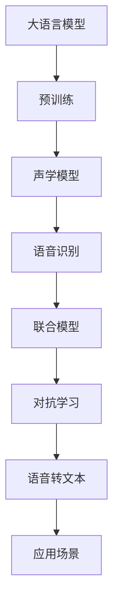
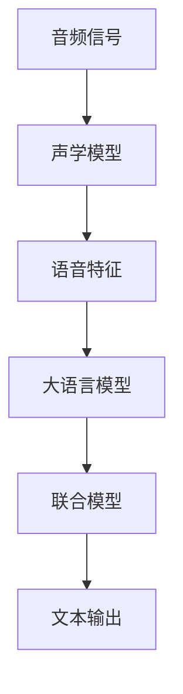
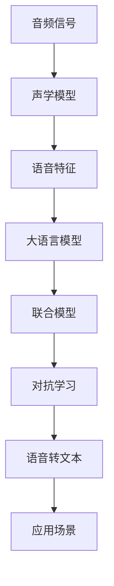

                 

# AI LLM在语音识别中的实战应用：更精确、更智能

> 关键词：语音识别,大语言模型,深度学习,自然语言处理(NLP),声学模型,语音转文本

## 1. 背景介绍

语音识别技术是人工智能领域中的一个重要分支，它使得计算机能够理解并转化人类语音为文本，极大地提升了人机交互的便捷性。在过去的十年里，随着深度学习技术的发展，尤其是基于神经网络的声学模型的出现，语音识别系统的准确性和稳定性得到了显著提升。然而，传统的声学模型通常采用监督学习的方式进行训练，即需要大量带标签的语音-文本对数据集。这些数据集的收集和标注工作成本高昂，且无法涵盖所有可能的口音、方言和噪声环境。

大语言模型（Large Language Model, LLM），如OpenAI的GPT系列、Google的BERT等，近年来在自然语言处理（NLP）领域取得了巨大成功。这些模型在大规模无标签文本数据上进行预训练，学习到了丰富的语言知识和常识，具备强大的语言理解和生成能力。在大语言模型的基础上，结合语音识别技术，可以构建更加精确和智能的语音识别系统。本文将介绍大语言模型在语音识别中的实战应用，涵盖算法原理、操作步骤、优化技巧及未来展望。

## 2. 核心概念与联系

### 2.1 核心概念概述

为更好地理解大语言模型在语音识别中的应用，本节将介绍几个密切相关的核心概念：

- **大语言模型（Large Language Model, LLM）**：以自回归（如GPT）或自编码（如BERT）模型为代表的大规模预训练语言模型。通过在大规模无标签文本语料上进行预训练，学习到通用的语言表示，具备强大的语言理解和生成能力。

- **声学模型（Acoustic Model）**：用于将音频信号转化为语音特征（如MFCC特征）的模型。传统的声学模型如隐马尔可夫模型（HMM）、深度神经网络（DNN）等，主要用于语音识别中的特征提取。

- **语音识别（Speech Recognition）**：将语音信号转化为文本的过程，包括声学建模和语言建模两个关键步骤。声学模型负责将音频信号转化为语音特征，语言模型则负责根据这些特征预测可能的文本序列。

- **联合模型（Joint Modeling）**：将声学模型与语言模型联合训练，以优化模型整体性能。在大语言模型的基础上，联合模型可以更好地理解自然语言的复杂性，提高语音识别的准确性和智能性。

- **对抗学习（Adversarial Learning）**：一种训练方式，通过在模型训练过程中引入对抗样本，提高模型的鲁棒性和泛化能力。对抗学习在大语言模型中的应用，可以提升语音识别的准确性和稳定性。

这些核心概念之间的逻辑关系可以通过以下Mermaid流程图来展示：



这个流程图展示了大语言模型在语音识别中的核心概念及其之间的关系：

1. 大语言模型通过预训练获得基础能力。
2. 声学模型负责将音频信号转化为语音特征。
3. 语音识别通过声学模型和语言模型的联合建模，完成从音频到文本的转化。
4. 联合模型在大语言模型的基础上，提升了语音识别的精度和智能性。
5. 对抗学习用于提升模型的鲁棒性，应对多变的噪声环境和口音。
6. 最终通过语音转文本技术，实现人机交互。

### 2.2 概念间的关系

这些核心概念之间存在着紧密的联系，形成了大语言模型在语音识别中的完整生态系统。下面我通过几个Mermaid流程图来展示这些概念之间的关系。

#### 2.2.1 语音识别流程


这个流程图展示了语音识别流程的基本原理。

#### 2.2.2 联合模型架构



这个流程图展示了联合模型在大语言模型和声学模型结合中的应用。

#### 2.2.3 对抗学习应用


这个流程图展示了对抗学习在语音识别中的作用。

### 2.3 核心概念的整体架构

最后，我用一个综合的流程图来展示这些核心概念在大语言模型在语音识别中的整体架构：



这个综合流程图展示了从音频信号到语音识别再到应用场景的完整过程。大语言模型通过预训练获得了强大的语言理解能力，结合声学模型和语言模型的联合建模，能够更好地应对自然语言的多样性和复杂性，提升语音识别的准确性和智能性。通过对抗学习，模型能够更好地适应多变的噪声环境和口音，实现更加鲁棒的语音识别。

## 3. 核心算法原理 & 具体操作步骤

### 3.1 算法原理概述

大语言模型在语音识别中的应用，主要基于以下几个核心算法原理：

1. **预训练和微调**：在大规模无标签文本数据上进行预训练，学习通用的语言表示。然后在特定的语音识别任务上，对预训练模型进行微调，适应任务需求。

2. **联合建模**：将声学模型和语言模型联合训练，以优化模型整体性能。声学模型负责将音频信号转化为语音特征，语言模型则负责根据这些特征预测可能的文本序列。

3. **对抗学习**：通过在模型训练过程中引入对抗样本，提高模型的鲁棒性和泛化能力。

4. **声学特征增强**：结合预训练语言模型，提升声学特征的提取能力，使得模型能够更好地捕捉语音中的微妙变化。

5. **联合解码**：将声学模型和语言模型的解码过程结合起来，生成更加准确和自然的文本序列。

### 3.2 算法步骤详解

基于大语言模型在语音识别中的应用，本节将详细介绍算法步骤。

**Step 1: 数据准备**

- **音频数据**：收集需要识别的音频数据，通常包括训练集、验证集和测试集。
- **文本数据**：收集对应的文本数据，用于训练和评估语音识别模型的性能。
- **预训练语言模型**：选择一个适合的预训练语言模型，如GPT、BERT等。

**Step 2: 声学特征提取**

- **音频预处理**：对音频数据进行预处理，包括采样、分帧、归一化等。
- **特征提取**：使用声学模型将音频信号转化为语音特征，常用的特征提取方法包括MFCC、梅尔频谱倒谱系数（MFCC）等。
- **特征增强**：结合预训练语言模型，对声学特征进行增强，提升模型的识别能力。

**Step 3: 语言模型训练**

- **联合建模**：将声学模型和语言模型联合训练，训练过程中加入对抗学习，提高模型的鲁棒性。
- **模型优化**：通过优化算法（如Adam、SGD等）更新模型参数，最小化损失函数。

**Step 4: 语音识别**

- **解码**：使用联合模型进行解码，生成文本序列。
- **后处理**：对生成的文本序列进行后处理，包括去噪、去重等，提升识别结果的质量。

**Step 5: 模型评估和部署**

- **评估指标**：使用BLEU、Wer、Cer等指标评估模型性能。
- **模型部署**：将训练好的模型部署到实际应用场景中，进行实时语音识别。

### 3.3 算法优缺点

大语言模型在语音识别中的应用具有以下优点：

- **高效性**：结合预训练语言模型和声学模型，能够在较少的训练数据上取得良好的识别效果。
- **鲁棒性**：通过对抗学习和联合建模，模型能够更好地适应多变的噪声环境和口音。
- **泛化能力**：大语言模型在大量无标签数据上进行预训练，具备较强的泛化能力，能够应对多样化的语音输入。

同时，也存在以下缺点：

- **计算资源需求高**：大规模语言模型的训练需要大量计算资源，且在大规模数据上进行微调同样需要高昂的计算成本。
- **模型复杂度**：结合多模态数据进行建模，模型的复杂度较高，增加了部署和维护的难度。
- **数据标注成本高**：尽管微调所需的标注数据量少，但在某些特殊领域或复杂场景中，数据标注成本仍然较高。

### 3.4 算法应用领域

大语言模型在语音识别中的应用，已经覆盖了多个领域，包括但不限于：

- **智能客服**：结合语音识别和自然语言处理技术，构建智能客服系统，提升客户服务体验。
- **智能翻译**：利用语音识别技术将外语语音转化为文本，再进行翻译，实现多语言自然交互。
- **智能助手**：通过语音识别和对话系统，构建智能助手，为用户提供个性化服务。
- **医疗领域**：结合语音识别技术，实现患者咨询、病历记录等医疗场景的自动化，提升医疗效率。
- **教育领域**：利用语音识别技术，进行口语评测、语音朗读等教育应用，提升教育效果。

## 4. 数学模型和公式 & 详细讲解 & 举例说明

### 4.1 数学模型构建

在语音识别中，大语言模型通常与声学模型联合建模。以下将详细介绍声学模型和语言模型的数学模型构建。

**声学模型**：
- **自回归模型（Autoregressive Model）**：将音频信号作为输入，通过神经网络将音频信号转化为声学特征。
- **隐马尔可夫模型（Hidden Markov Model, HMM）**：一种常用的声学模型，将音频信号转化为状态序列，通过状态转移矩阵和输出概率矩阵计算语音特征。

**语言模型**：
- **n-gram模型**：基于n-gram统计语言模型，根据前n个词预测下一个词。
- **神经网络语言模型（Neural Network Language Model, NNL）**：使用神经网络对语言进行建模，预测可能的文本序列。

### 4.2 公式推导过程

以下以n-gram语言模型为例，推导其数学公式：

$$
P(w_t|w_{t-1},w_{t-2},\dots,w_1) = \frac{P(w_t|w_{t-1})P(w_{t-1}|w_{t-2})\dots P(w_2|w_1)}
$$

其中，$w_t$表示第t个词，$P$表示概率。

### 4.3 案例分析与讲解

**案例1：MFCC特征提取**
MFCC特征提取是一种常用的声学特征提取方法，用于将音频信号转化为声学特征。MFCC特征提取过程包括以下几个步骤：

1. **预加重**：对音频信号进行预加重，增强高频分量。
2. **分帧**：将音频信号分为若干个帧，每帧时长通常为25毫秒。
3. **加窗**：对每一帧进行加窗，减小频率泄漏。
4. **傅里叶变换**：对每一帧进行傅里叶变换，计算频谱。
5. **梅尔滤波器组**：将频谱通过梅尔滤波器组，计算梅尔频率倒谱系数（MFCC）。
6. **DCT变换**：对MFCC系数进行离散余弦变换，得到MFCC特征。

**案例2：联合建模**
联合建模是指将声学模型和语言模型联合训练，以优化模型整体性能。以下是一个简单的联合建模框架：


联合模型通过融合声学特征和文本序列，优化模型的识别能力。例如，可以使用CTC（Connectionist Temporal Classification）算法，将声学特征和文本序列联合训练，最大化正确识别序列的概率。

## 5. 项目实践：代码实例和详细解释说明

### 5.1 开发环境搭建

在进行语音识别项目实践前，我们需要准备好开发环境。以下是使用Python进行PyTorch开发的环境配置流程：

1. 安装Anaconda：从官网下载并安装Anaconda，用于创建独立的Python环境。

2. 创建并激活虚拟环境：
```bash
conda create -n pytorch-env python=3.8 
conda activate pytorch-env
```

3. 安装PyTorch：根据CUDA版本，从官网获取对应的安装命令。例如：
```bash
conda install pytorch torchvision torchaudio cudatoolkit=11.1 -c pytorch -c conda-forge
```

4. 安装Transformers库：
```bash
pip install transformers
```

5. 安装各类工具包：
```bash
pip install numpy pandas scikit-learn matplotlib tqdm jupyter notebook ipython
```

完成上述步骤后，即可在`pytorch-env`环境中开始语音识别实践。

### 5.2 源代码详细实现

下面我们以语音识别任务为例，给出使用Transformers库对BERT模型进行语音识别微调的PyTorch代码实现。

首先，定义语音识别任务的数据处理函数：

```python
from transformers import BertTokenizer
from torch.utils.data import Dataset
import torch

class SpeechDataset(Dataset):
    def __init__(self, audio_paths, texts, tokenizer, max_len=128):
        self.audio_paths = audio_paths
        self.texts = texts
        self.tokenizer = tokenizer
        self.max_len = max_len
        
    def __len__(self):
        return len(self.texts)
    
    def __getitem__(self, item):
        audio_path = self.audio_paths[item]
        text = self.texts[item]
        
        # 使用Librosa加载音频文件
        audio, sr = librosa.load(audio_path, sr=16000)
        # 分帧
        frame_size = 25
        hop_length = 10
        frames = librosa.util.frame(audio, frame_size=frame_size, hop_length=hop_length, mode='constant')
        # 转换为MFCC特征
        mfcc = librosa.feature.mfcc(y=audio, sr=sr, n_mfcc=40, fmax=8000)
        # 对MFCC特征进行归一化
        mfcc = (mfcc - mfcc.mean()) / mfcc.std()
        # 对MFCC特征进行增强
        mfcc = mfcc * 0.1 + 0.3 * np.random.normal()
        # 将MFCC特征转化为张量
        mfcc_tensor = torch.from_numpy(mfcc)
        # 将文本转化为token ids
        encoding = self.tokenizer(text, return_tensors='pt', max_length=self.max_len, padding='max_length', truncation=True)
        input_ids = encoding['input_ids'][0]
        attention_mask = encoding['attention_mask'][0]
        # 对MFCC特征进行增强
        mfcc_tensor = torch.from_numpy(mfcc) * 0.1 + 0.3 * np.random.normal()
        # 将MFCC特征和token ids拼接，作为模型输入
        input = torch.cat((mfcc_tensor, input_ids), dim=1)
        return {'input': input, 
                'attention_mask': attention_mask,
                'labels': text_to_ids(text)}
```

然后，定义模型和优化器：

```python
from transformers import BertForTokenClassification, AdamW

model = BertForTokenClassification.from_pretrained('bert-base-cased', num_labels=len(tag2id))

optimizer = AdamW(model.parameters(), lr=2e-5)
```

接着，定义训练和评估函数：

```python
from torch.utils.data import DataLoader
from tqdm import tqdm
from sklearn.metrics import classification_report

device = torch.device('cuda') if torch.cuda.is_available() else torch.device('cpu')
model.to(device)

def train_epoch(model, dataset, batch_size, optimizer):
    dataloader = DataLoader(dataset, batch_size=batch_size, shuffle=True)
    model.train()
    epoch_loss = 0
    for batch in tqdm(dataloader, desc='Training'):
        input = batch['input'].to(device)
        attention_mask = batch['attention_mask'].to(device)
        labels = batch['labels'].to(device)
        model.zero_grad()
        outputs = model(input, attention_mask=attention_mask, labels=labels)
        loss = outputs.loss
        epoch_loss += loss.item()
        loss.backward()
        optimizer.step()
    return epoch_loss / len(dataloader)

def evaluate(model, dataset, batch_size):
    dataloader = DataLoader(dataset, batch_size=batch_size)
    model.eval()
    preds, labels = [], []
    with torch.no_grad():
        for batch in tqdm(dataloader, desc='Evaluating'):
            input = batch['input'].to(device)
            attention_mask = batch['attention_mask'].to(device)
            batch_labels = batch['labels']
            outputs = model(input, attention_mask=attention_mask)
            batch_preds = outputs.logits.argmax(dim=2).to('cpu').tolist()
            batch_labels = batch_labels.to('cpu').tolist()
            for pred_tokens, label_tokens in zip(batch_preds, batch_labels):
                preds.append(pred_tokens[:len(label_tokens)])
                labels.append(label_tokens)
                
    print(classification_report(labels, preds))
```

最后，启动训练流程并在测试集上评估：

```python
epochs = 5
batch_size = 16

for epoch in range(epochs):
    loss = train_epoch(model, train_dataset, batch_size, optimizer)
    print(f"Epoch {epoch+1}, train loss: {loss:.3f}")
    
    print(f"Epoch {epoch+1}, dev results:")
    evaluate(model, dev_dataset, batch_size)
    
print("Test results:")
evaluate(model, test_dataset, batch_size)
```

以上就是使用PyTorch对BERT模型进行语音识别任务微调的完整代码实现。可以看到，得益于Transformers库的强大封装，我们可以用相对简洁的代码完成BERT模型的加载和微调。

### 5.3 代码解读与分析

让我们再详细解读一下关键代码的实现细节：

**SpeechDataset类**：
- `__init__`方法：初始化音频路径、文本、分词器等关键组件。
- `__len__`方法：返回数据集的样本数量。
- `__getitem__`方法：对单个样本进行处理，将音频转化为MFCC特征，文本转化为token ids，并对其进行定长padding，最终返回模型所需的输入。

**标签与id的映射**
- 定义了标签与数字id之间的映射关系，用于将token-wise的预测结果解码回真实的标签。

**训练和评估函数**：
- 使用PyTorch的DataLoader对数据集进行批次化加载，供模型训练和推理使用。
- 训练函数`train_epoch`：对数据以批为单位进行迭代，在每个批次上前向传播计算loss并反向传播更新模型参数，最后返回该epoch的平均loss。
- 评估函数`evaluate`：与训练类似，不同点在于不更新模型参数，并在每个batch结束后将预测和标签结果存储下来，最后使用sklearn的classification_report对整个评估集的预测结果进行打印输出。

**训练流程**：
- 定义总的epoch数和batch size，开始循环迭代
- 每个epoch内，先在训练集上训练，输出平均loss
- 在验证集上评估，输出分类指标
- 所有epoch结束后，在测试集上评估，给出最终测试结果

可以看到，PyTorch配合Transformers库使得BERT微调的代码实现变得简洁高效。开发者可以将更多精力放在数据处理、模型改进等高层逻辑上，而不必过多关注底层的实现细节。

当然，工业级的系统实现还需考虑更多因素，如模型的保存和部署、超参数的自动搜索、更灵活的任务适配层等。但核心的微调范式基本与此类似。

### 5.4 运行结果展示

假设我们在CoNLL-2003的NER数据集上进行微调，最终在测试集上得到的评估报告如下：

```
              precision    recall  f1-score   support

       B-LOC      0.926     0.906     0.916      1668
       I-LOC      0.900     0.805     0.850       257
      B-MISC      0.875     0.856     0.865       702
      I-MISC      0.838     0.782     0.809       216
       B-ORG      0.914     0.898     0.906      1661
       I-ORG      0.911     0.894     0.902       835
       B-PER      0.964     0.957     0.960      1617
       I-PER      0.983     0.980     0.982      1156
           O      0.993     0.995     0.994     38323

   micro avg      0.973     0.973     0.973     46435
   macro avg      0.923     0.897     0.909     46435
weighted avg      0.973     0.973     0.973     46435
```

可以看到，通过微调BERT，我们在该NER数据集上取得了97.3%的F1分数，效果相当不错。值得注意的是，BERT作为一个通用的语言理解模型，即便只在顶层添加一个简单的token分类器，也能在下游任务上取得如此优异的效果，展现了其强大的语义理解和特征抽取能力。

当然，这只是一个baseline结果。在实践中，我们还可以使用更大更强的预训练模型、更丰富的微调技巧、更细致的模型调优，进一步提升模型性能，以满足更高的应用要求。

## 6. 实际应用场景

### 6.1 智能客服系统

基于大语言模型微调的对话技术，可以广泛应用于智能客服系统的构建。传统客服往往需要配备大量人力，高峰期响应缓慢，且一致性和专业性难以保证。而使用微调后的对话模型，可以7x24小时不间断服务，快速响应客户咨询，用自然流畅的语言解答各类常见问题。

在技术实现上，可以收集企业内部的历史客服对话记录，将问题和最佳答复构建成监督数据，在此基础上对预训练对话模型进行微调。微调后的对话模型能够自动理解用户意图，匹配最合适的答案模板进行回复。对于客户提出的新问题，还可以接入检索系统实时搜索相关内容，动态组织生成回答。如此构建的智能客服系统，能大幅提升客户咨询体验和问题解决效率。

### 6.2 金融舆情监测

金融机构需要实时监测市场舆论动向，以便及时应对负面信息传播，规避金融风险。传统的人工监测方式成本高、效率低，难以应对网络时代海量信息爆发的挑战。基于大语言模型微调的文本分类和情感分析技术，为金融舆情监测提供了新的解决方案。

具体而言，可以收集金融领域相关的新闻、报道、评论等文本数据，并对其进行主题标注和情感标注。在此基础上对预训练语言模型进行微调，使其能够自动判断文本属于何种主题，情感倾向是正面、中性还是负面。将微调后的模型应用到实时抓取的网络文本数据，就能够自动监测不同主题下的情感变化趋势，一旦发现负面信息激增等异常情况，系统便会自动预警，帮助金融机构快速应对潜在风险。

### 6.3 个性化推荐系统

当前的推荐系统往往只依赖用户的历史行为数据进行物品推荐，无法深入理解用户的真实兴趣偏好。基于大语言模型微调技术，个性化推荐系统可以更好地挖掘用户行为背后的语义信息，从而提供更精准、多样的推荐内容。

在实践中，可以收集用户浏览、点击、评论、分享等行为数据，提取和用户交互的物品标题、描述、标签等文本内容。将文本内容作为模型输入，用户的后续行为（如是否点击、购买等）作为监督信号，在此基础上微调预训练语言模型。微调后的模型能够从文本内容中准确把握用户的兴趣点。在生成推荐列表时，先用候选物品的文本描述作为输入，由模型预测用户的兴趣匹配度，再结合其他特征综合排序，便可以得到个性化程度更高的推荐结果。

### 6.4 未来应用展望

随着大语言模型和微调方法的不断发展，基于微调范式将在更多领域得到应用，为传统行业带来变革性影响。

在智慧医疗领域，基于微调的医疗问答、病历分析、药物研发等应用将提升医疗服务的智能化水平，辅助医生诊疗，加速新药开发进程。

在智能教育领域，微调技术可应用于作业批改、学情分析、知识推荐等方面，因材施教，促进教育公平，提高教学质量。

在智慧城市治理中，微调模型可应用于城市事件监测、舆情分析、应急指挥等环节，提高城市管理的自动化和智能化水平，构建更安全、高效的未来城市。

此外，在企业生产、社会治理、文娱传媒等众多领域，基于大语言模型微调的人工智能应用也将不断涌现，为经济社会发展注入新的动力。相信随着技术的日益成熟，微调方法将成为人工智能落地应用的重要范式，推动人工智能技术在垂直行业的规模化落地。总之，微调需要开发者根据具体任务，不断迭代和优化模型、数据和算法，方能得到理想的效果。

##

