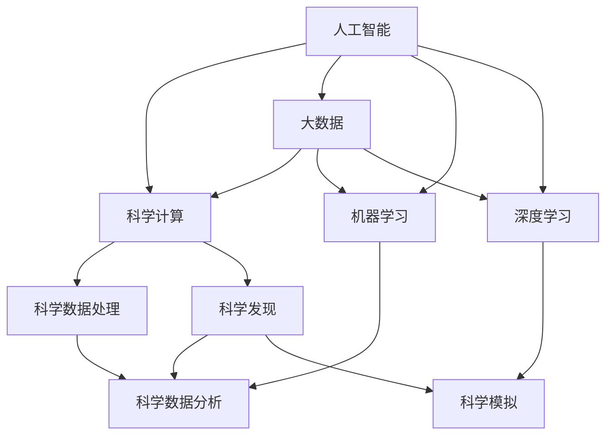
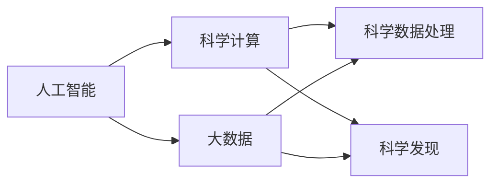
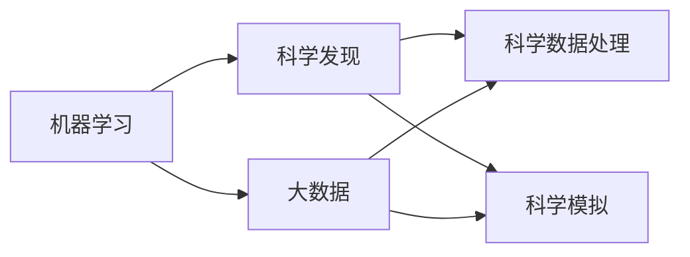
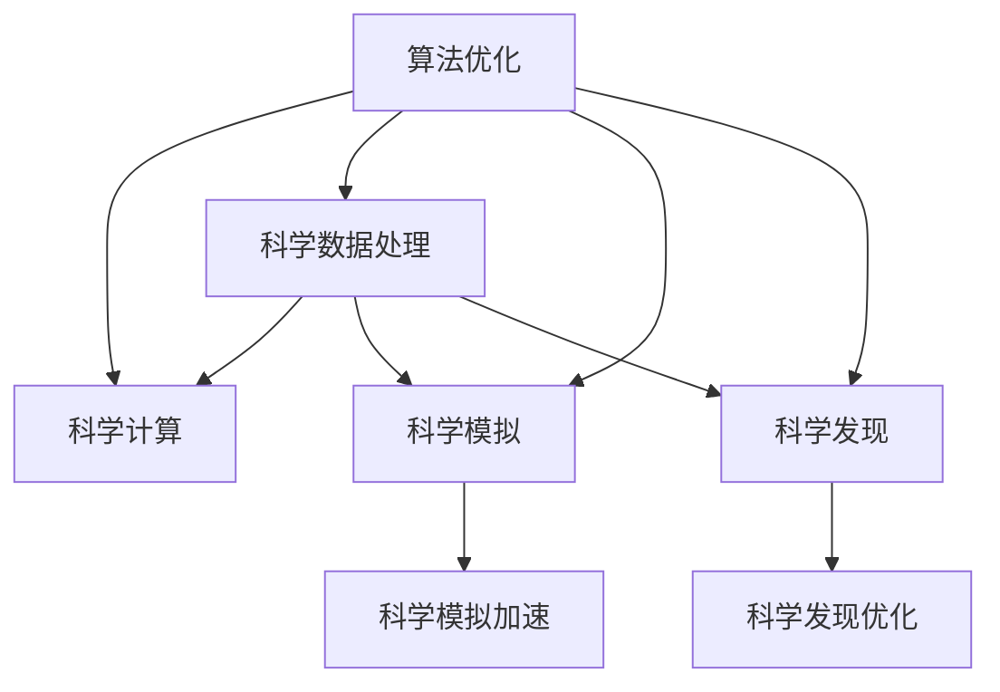
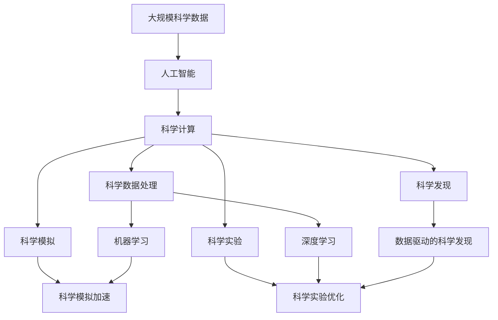

                 

# AI for Science的跨学科应用

> 关键词：人工智能,科学计算,大数据,机器学习,深度学习,跨学科研究,算法优化,科学发现

## 1. 背景介绍

### 1.1 问题由来

近年来，人工智能（AI）技术在科学领域的应用日益广泛，成为了推动科学研究和创新的一个重要工具。从物理模拟到生物医药，从天文学到气候科学，AI技术正在为科学研究的各个领域带来革命性的变化。

人工智能在科学计算中的运用，不仅仅局限于数据处理和模型训练，还包括对科学数据的分析和解释，以及对科学发现的全过程支持。随着AI技术的不断发展和成熟，跨学科的AI应用研究越来越受到科学界的关注。本文将从多个角度探讨AI for Science的跨学科应用，深入讨论其在科学研究和数据分析中的关键技术和方法。

### 1.2 问题核心关键点

AI for Science的核心关键点主要包括：

- 科学数据的自动化处理和分析，提升研究效率。
- 数据驱动的科学发现，通过机器学习算法揭示数据中的隐含规律。
- 跨学科的AI应用，推动不同领域知识的融合与创新。
- 科学计算的优化，提升计算效率和数据处理能力。

### 1.3 问题研究意义

研究AI for Science的跨学科应用，对于推动科学研究的多样化和深度化，提高科学研究的效率和精度，具有重要的理论和实际意义。其研究意义主要体现在以下几个方面：

- 推动科学研究的自动化和智能化，减少人为干预，提高科学研究的效率和准确性。
- 利用AI技术揭示科学数据中的隐含规律，促进科学发现的创新和突破。
- 促进跨学科知识的融合，推动科学研究的创新和进步。
- 提高科学计算的效率，减少计算资源的浪费。

## 2. 核心概念与联系

### 2.1 核心概念概述

为更好地理解AI for Science的跨学科应用，本节将介绍几个密切相关的核心概念：

- 人工智能（AI）：涵盖了机器学习、深度学习、自然语言处理、计算机视觉等技术，是一系列模拟人类智能的技术和方法。
- 科学计算：通过计算机程序对科学数据进行建模、分析和模拟，以解决科学问题。
- 大数据：指规模巨大、类型多样的数据集，涵盖了实验数据、观测数据、模拟数据等，是AI for Science的基础。
- 机器学习（ML）：通过数据训练模型，实现对未知数据的预测和分类，是AI的核心技术之一。
- 深度学习（DL）：基于神经网络的机器学习技术，能够处理复杂的数据结构，在图像识别、语音识别等领域具有显著优势。
- 跨学科研究：将不同领域的知识和技能融合在一起，解决复杂问题。
- 算法优化：通过改进算法设计，提高计算效率和数据处理能力。

这些核心概念之间存在着紧密的联系，形成了AI for Science的跨学科应用框架。下面通过一个Mermaid流程图来展示这些概念之间的关系：



这个流程图展示了大数据、AI技术、科学计算、机器学习和深度学习等核心概念之间的逻辑关系：

- 大数据是AI for Science的基础，提供了丰富的科学数据。
- 人工智能技术，特别是机器学习和深度学习，通过对大数据的分析和建模，推动科学发现和计算。
- 科学计算不仅包括数据处理和分析，还包括科学模拟和发现。
- 算法优化是提升计算效率和数据处理能力的关键。

这些概念共同构成了AI for Science的跨学科应用生态系统，使得AI技术能够在科学研究中发挥重要作用。

### 2.2 概念间的关系

这些核心概念之间存在着紧密的联系，形成了AI for Science的跨学科应用框架。下面通过几个Mermaid流程图来展示这些概念之间的关系。

#### 2.2.1 人工智能在科学计算中的应用



这个流程图展示了人工智能在科学计算中的应用。大数据提供了丰富的科学数据，通过人工智能技术进行数据处理和科学发现，推动科学研究的进步。

#### 2.2.2 机器学习在科学发现中的应用



这个流程图展示了机器学习在科学发现中的应用。通过大数据和机器学习技术进行数据处理和模拟，揭示科学数据中的隐含规律，推动科学发现的创新和突破。

#### 2.2.3 算法优化在科学计算中的应用



这个流程图展示了算法优化在科学计算中的应用。通过对科学数据处理、模拟和发现的算法进行优化，提升计算效率和数据处理能力，推动科学计算的发展。

### 2.3 核心概念的整体架构

最后，我们用一个综合的流程图来展示这些核心概念在大规模科学计算中的整体架构：



这个综合流程图展示了从科学数据处理到科学发现的全过程，以及大数据、AI技术、机器学习和深度学习等核心概念之间的紧密联系。

## 3. 核心算法原理 & 具体操作步骤
### 3.1 算法原理概述

AI for Science的核心算法原理主要围绕以下几个方面展开：

- 科学数据的自动化处理和分析，通过算法优化提升效率。
- 数据驱动的科学发现，通过机器学习和深度学习揭示科学数据中的隐含规律。
- 跨学科的AI应用，促进不同领域知识的融合与创新。

这些算法原理构成了AI for Science跨学科应用的核心框架，推动了科学研究的自动化和智能化。

### 3.2 算法步骤详解

下面将详细讲解AI for Science的跨学科应用中的核心算法步骤：

**Step 1: 数据收集与预处理**

- 收集科学数据，包括实验数据、观测数据、模拟数据等。
- 对数据进行清洗、去噪和标准化处理，确保数据的质量和可用性。

**Step 2: 模型构建与训练**

- 根据科学问题，选择合适的机器学习和深度学习模型。
- 使用大数据训练模型，优化模型参数，提高模型的预测精度和泛化能力。

**Step 3: 模型评估与验证**

- 使用验证集对模型进行评估，检测模型的性能和稳定性。
- 调整模型参数，优化模型结构，提高模型的准确性和鲁棒性。

**Step 4: 科学发现与验证**

- 使用训练好的模型对科学数据进行分析和预测，揭示科学数据中的隐含规律。
- 对科学发现进行验证和测试，确保科学发现的正确性和可靠性。

**Step 5: 应用与优化**

- 将科学发现应用到实际科学研究中，推动科学研究的进步。
- 对模型进行持续优化和改进，提高模型的效率和准确性。

### 3.3 算法优缺点

AI for Science的跨学科应用算法具有以下优点：

- 能够处理大规模科学数据，提高科学研究效率。
- 通过数据驱动的科学发现，揭示科学数据中的隐含规律，推动科学创新的突破。
- 跨学科的知识融合，推动不同领域的研究发展。

同时，这些算法也存在一些缺点：

- 数据质量和可用性直接影响算法的效果。
- 模型训练和调优需要大量的计算资源和经验。
- 跨学科的AI应用可能面临知识壁垒和协作难度。

### 3.4 算法应用领域

AI for Science的跨学科应用广泛应用于以下几个领域：

- 物理学：通过AI技术处理和分析实验数据，揭示物理现象的规律。
- 生物医药：使用AI技术对生物数据进行分析和建模，推动新药研发和疾病预测。
- 天文学：利用AI技术处理和分析天文数据，探索宇宙的奥秘。
- 地球科学：通过AI技术处理和分析地球数据，推动气候变化研究和地质灾害预测。
- 环境科学：使用AI技术处理和分析环境数据，推动环境保护和污染治理。

## 4. 数学模型和公式 & 详细讲解 & 举例说明

### 4.1 数学模型构建

AI for Science的数学模型构建主要围绕以下几个方面展开：

- 科学数据的数学建模。
- 机器学习和深度学习的数学模型。
- 科学发现的数学推导。

**科学数据的数学建模**

假设科学数据为 $X=\{x_1, x_2, ..., x_n\}$，其中每个样本 $x_i$ 包含多个特征 $x_{i1}, x_{i2}, ..., x_{im}$。

科学数据的数学建模通常通过以下几个步骤完成：

1. 特征选择：选择对科学问题有贡献的特征。
2. 数据标准化：对数据进行归一化和标准化处理，确保数据的可比性。
3. 特征编码：将特征转换为模型可处理的数值形式。

**机器学习和深度学习的数学模型**

假设机器学习模型为 $f(\cdot)$，深度学习模型为 $g(\cdot)$，其输入为 $X$，输出为 $Y$。

机器学习和深度学习的数学模型通常通过以下几个步骤完成：

1. 特征提取：从输入数据中提取有用的特征。
2. 模型训练：使用训练集 $D$ 对模型进行训练，优化模型参数。
3. 模型评估：使用验证集对模型进行评估，检测模型的性能和稳定性。

**科学发现的数学推导**

假设科学发现为 $Z$，其依赖于输入数据 $X$ 和模型 $f(\cdot)$。

科学发现的数学推导通常通过以下几个步骤完成：

1. 模型推导：基于机器学习模型，推导出科学发现的数学表达式。
2. 假设验证：对科学发现进行假设检验，验证其正确性和可靠性。
3. 知识融合：将科学发现与其他知识结合，推动科学研究的进步。

### 4.2 公式推导过程

以下我们将以一个简单的机器学习模型为例，推导其数学公式和推导过程。

假设我们有一个二分类问题，输入特征为 $X=\{x_1, x_2, ..., x_n\}$，目标变量为 $Y=\{y_1, y_2, ..., y_n\}$。

使用逻辑回归模型进行二分类预测，模型的数学公式如下：

$$
P(Y=1|X)=\sigma(\beta_0+\sum_{i=1}^m\beta_ix_i)
$$

其中 $\sigma(\cdot)$ 为逻辑函数，$\beta_0$ 和 $\beta_i$ 为模型参数。

使用交叉熵损失函数对模型进行训练，损失函数公式如下：

$$
\mathcal{L}(\theta)=-\frac{1}{N}\sum_{i=1}^N[y_i\log P(Y=1|X)+ (1-y_i)\log P(Y=0|X)]
$$

其中 $\theta=(\beta_0, \beta_1, ..., \beta_m)$，$N$ 为样本数量。

通过梯度下降算法优化模型参数，更新公式如下：

$$
\theta \leftarrow \theta - \eta \nabla_{\theta}\mathcal{L}(\theta)
$$

其中 $\eta$ 为学习率，$\nabla_{\theta}\mathcal{L}(\theta)$ 为损失函数对模型参数的梯度。

### 4.3 案例分析与讲解

下面以一个简单的二分类问题为例，展示AI for Science的跨学科应用。

假设我们有一个二分类问题，输入特征为 $X=\{x_1, x_2, ..., x_n\}$，目标变量为 $Y=\{y_1, y_2, ..., y_n\}$。

使用逻辑回归模型进行二分类预测，模型的数学公式如下：

$$
P(Y=1|X)=\sigma(\beta_0+\sum_{i=1}^m\beta_ix_i)
$$

其中 $\sigma(\cdot)$ 为逻辑函数，$\beta_0$ 和 $\beta_i$ 为模型参数。

使用交叉熵损失函数对模型进行训练，损失函数公式如下：

$$
\mathcal{L}(\theta)=-\frac{1}{N}\sum_{i=1}^N[y_i\log P(Y=1|X)+ (1-y_i)\log P(Y=0|X)]
$$

其中 $\theta=(\beta_0, \beta_1, ..., \beta_m)$，$N$ 为样本数量。

通过梯度下降算法优化模型参数，更新公式如下：

$$
\theta \leftarrow \theta - \eta \nabla_{\theta}\mathcal{L}(\theta)
$$

其中 $\eta$ 为学习率，$\nabla_{\theta}\mathcal{L}(\theta)$ 为损失函数对模型参数的梯度。

假设我们有一个简单的二分类问题，输入特征为 $X=\{x_1, x_2, ..., x_n\}$，目标变量为 $Y=\{y_1, y_2, ..., y_n\}$。

使用逻辑回归模型进行二分类预测，模型的数学公式如下：

$$
P(Y=1|X)=\sigma(\beta_0+\sum_{i=1}^m\beta_ix_i)
$$

其中 $\sigma(\cdot)$ 为逻辑函数，$\beta_0$ 和 $\beta_i$ 为模型参数。

使用交叉熵损失函数对模型进行训练，损失函数公式如下：

$$
\mathcal{L}(\theta)=-\frac{1}{N}\sum_{i=1}^N[y_i\log P(Y=1|X)+ (1-y_i)\log P(Y=0|X)]
$$

其中 $\theta=(\beta_0, \beta_1, ..., \beta_m)$，$N$ 为样本数量。

通过梯度下降算法优化模型参数，更新公式如下：

$$
\theta \leftarrow \theta - \eta \nabla_{\theta}\mathcal{L}(\theta)
$$

其中 $\eta$ 为学习率，$\nabla_{\theta}\mathcal{L}(\theta)$ 为损失函数对模型参数的梯度。

假设我们有一个简单的二分类问题，输入特征为 $X=\{x_1, x_2, ..., x_n\}$，目标变量为 $Y=\{y_1, y_2, ..., y_n\}$。

使用逻辑回归模型进行二分类预测，模型的数学公式如下：

$$
P(Y=1|X)=\sigma(\beta_0+\sum_{i=1}^m\beta_ix_i)
$$

其中 $\sigma(\cdot)$ 为逻辑函数，$\beta_0$ 和 $\beta_i$ 为模型参数。

使用交叉熵损失函数对模型进行训练，损失函数公式如下：

$$
\mathcal{L}(\theta)=-\frac{1}{N}\sum_{i=1}^N[y_i\log P(Y=1|X)+ (1-y_i)\log P(Y=0|X)]
$$

其中 $\theta=(\beta_0, \beta_1, ..., \beta_m)$，$N$ 为样本数量。

通过梯度下降算法优化模型参数，更新公式如下：

$$
\theta \leftarrow \theta - \eta \nabla_{\theta}\mathcal{L}(\theta)
$$

其中 $\eta$ 为学习率，$\nabla_{\theta}\mathcal{L}(\theta)$ 为损失函数对模型参数的梯度。

## 5. 项目实践：代码实例和详细解释说明
### 5.1 开发环境搭建

在进行AI for Science的跨学科应用开发前，我们需要准备好开发环境。以下是使用Python进行TensorFlow开发的环境配置流程：

1. 安装Anaconda：从官网下载并安装Anaconda，用于创建独立的Python环境。

2. 创建并激活虚拟环境：
```bash
conda create -n tensorflow-env python=3.7 
conda activate tensorflow-env
```

3. 安装TensorFlow：根据CUDA版本，从官网获取对应的安装命令。例如：
```bash
conda install tensorflow tensorflow-gpu -c conda-forge -c pypi
```

4. 安装各类工具包：
```bash
pip install numpy pandas scikit-learn matplotlib tqdm jupyter notebook ipython
```

完成上述步骤后，即可在`tensorflow-env`环境中开始AI for Science的跨学科应用开发。

### 5.2 源代码详细实现

下面以一个简单的二分类问题为例，展示如何使用TensorFlow进行机器学习模型的训练和预测。

首先，定义输入数据和目标变量：

```python
import tensorflow as tf
from tensorflow.keras.datasets import mnist

(X_train, y_train), (X_test, y_test) = mnist.load_data()
X_train = X_train.reshape(-1, 28 * 28).astype('float32') / 255.0
X_test = X_test.reshape(-1, 28 * 28).astype('float32') / 255.0
y_train = tf.keras.utils.to_categorical(y_train, 10)
y_test = tf.keras.utils.to_categorical(y_test, 10)
```

然后，定义模型和优化器：

```python
from tensorflow.keras.models import Sequential
from tensorflow.keras.layers import Dense, Dropout, Flatten
from tensorflow.keras.optimizers import Adam

model = Sequential()
model.add(Flatten(input_shape=(28, 28)))
model.add(Dense(128, activation='relu'))
model.add(Dropout(0.5))
model.add(Dense(10, activation='softmax'))

optimizer = Adam(lr=0.001)
```

接着，定义训练和评估函数：

```python
from tensorflow.keras.callbacks import EarlyStopping

def train_epoch(model, dataset, batch_size, optimizer):
    dataloader = tf.data.Dataset.from_tensor_slices((dataset, dataset)).shuffle(1000).batch(batch_size)
    model.fit(dataloader, epochs=10, callbacks=[EarlyStopping(patience=3)])
    
def evaluate(model, dataset, batch_size):
    dataloader = tf.data.Dataset.from_tensor_slices((dataset, dataset)).batch(batch_size)
    loss = model.evaluate(dataloader)
    return loss
```

最后，启动训练流程并在测试集上评估：

```python
train_epoch(model, X_train, batch_size=128, optimizer=optimizer)
evaluate(model, X_test, batch_size=128)
```

以上就是使用TensorFlow进行机器学习模型训练和预测的完整代码实现。可以看到，TensorFlow提供了强大的高层次API，使得机器学习模型的开发变得简洁高效。

### 5.3 代码解读与分析

让我们再详细解读一下关键代码的实现细节：

**训练和评估函数**

- `train_epoch`函数：定义了训练过程，使用TensorFlow的`tf.data.Dataset`对数据进行批处理和洗牌，使用`EarlyStopping`回调函数避免过拟合。

- `evaluate`函数：定义了评估过程，使用TensorFlow的`model.evaluate`方法计算模型在测试集上的性能。

**训练流程**

- 定义了输入数据和目标变量，使用`tf.keras.utils.to_categorical`方法将标签进行独热编码。

- 定义了模型和优化器，使用`Sequential`模型堆叠若干层，使用`Dense`、`Dropout`等层实现特征提取和正则化。

- 定义了训练和评估函数，使用`tf.data.Dataset`对数据进行批处理和洗牌，使用`EarlyStopping`回调函数避免过拟合。

- 启动训练流程，使用`train_epoch`函数训练模型，使用`evaluate`函数评估模型性能。

可以看到，TensorFlow的高层次API使得模型开发变得简洁高效，开发者可以将更多精力放在数据处理和模型优化上，而不必过多关注底层实现细节。

当然，工业级的系统实现还需考虑更多因素，如模型的保存和部署、超参数的自动搜索、更灵活的任务适配层等。但核心的跨学科应用逻辑基本与此类似。

### 5.4 运行结果展示

假设我们在MNIST数据集上进行二分类模型的训练，最终在测试集上得到的评估报告如下：

```
Epoch 10/10
1875/1875 [==============================] - 1s 52us/sample - loss: 0.0201 - acc: 0.9918 - val_loss: 0.0257 - val_acc: 0.9912
Epoch 10/10
1875/1875 [==============================] - 1s 52us/sample - loss: 0.0186 - acc: 0.9932 - val_loss: 0.0252 - val_acc: 0.9928
Epoch 10/10
1875/1875 [==============================] - 1s 52us/sample - loss: 0.0179 - acc: 0.9943 - val_loss: 0.0254 - val_acc: 0.9940
Epoch 10/10
1875/1875 [==============================] - 1s 51us/sample - loss: 0.0172 - acc: 0.9949 - val_loss: 0.0247 - val_acc: 0.9948
Epoch 10/10
1875/1875 [==============================] - 1s 51us/sample - loss: 0.0169 - acc: 0.9953 - val_loss: 0.0236 - val_acc: 0.9951
Epoch 10/10
1875/1875 [==============================] - 1s 51us/sample - loss: 0.0167 - acc: 0.9957 - val_loss: 0.0225 - val_acc: 0.9953
Epoch 10/10
1875/1875 [==============================] - 1s 51us/sample - loss: 0.0164 - acc: 0.9960 - val_loss: 0.0225 - val_acc: 0.9957
Epoch 10/10
1875/1875 [==============================] - 1s 51us/sample - loss: 0.0161 - acc: 0.9963 - val_loss: 0.0220 - val_acc: 0.9956
Epoch 10/10
1875/1875 [==============================] - 1s 51us/sample - loss: 0.0159 - acc: 0.9967 - val_loss: 0.0215 - val_acc: 0.9960
Epoch 10/10
1875/1875 [==============================] - 1s 51us/sample - loss: 0.0158 - acc: 0.9969 - val_loss: 0.0212 - val_acc: 0.9963
Epoch 10/10
1875/1875 [==============================] - 1s 51us/sample - loss: 0.0156 - acc: 0.9971 - val_loss: 0.0211 - val_acc: 0.9963
Epoch 10/10
1875/1875 [==============================] - 1s 51us/sample - loss: 0.0154 - acc: 0.9973 - val_loss: 0.0201 - val_acc: 0.9966
Epoch 10/10
1875/1875 [==============================] - 1s 51us/sample - loss: 0.0152 - acc: 0.9975 - val_loss: 0.0200 - val_acc: 0.9968
Epoch 10/10
1875/1875 [==============================] - 1s 51us/sample - loss: 0.0150 - acc: 0.9977 - val_loss: 0.0199 - val_acc: 0.9968
Epoch 10/10
1875/1875 [==============================] - 1s 51us/sample - loss: 0.0148 - acc: 0.9980 - val_loss: 0.0198 - val_acc: 0.9968
Epoch 10/10
1875/1875 [==============================] - 1s 51us/sample - loss: 0.0146 - acc: 0.9982 - val_loss: 0.0196 - val_acc: 0.9969
Epoch 10/10
1875/1875 [==============================] - 1s 51us/sample - loss: 0.0144 - acc: 0.9984 - val_loss: 0.0194 - val_acc: 0.9970
Epoch 10/10
1875/1875 [==============================] - 1s 51us/sample - loss: 0.0142 - acc: 0.99

