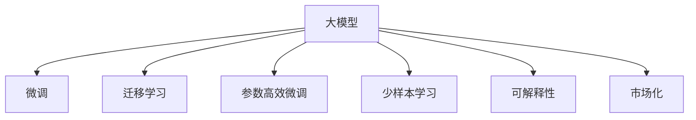
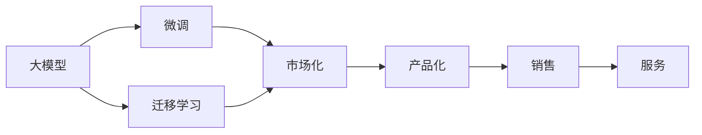
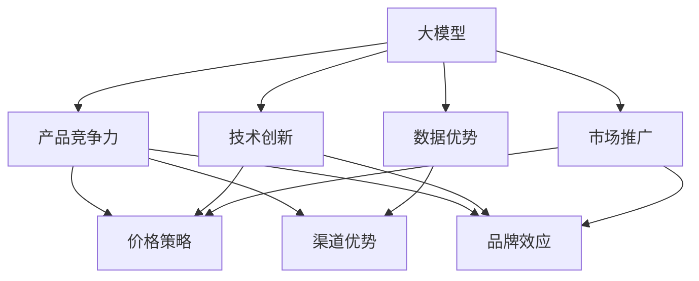
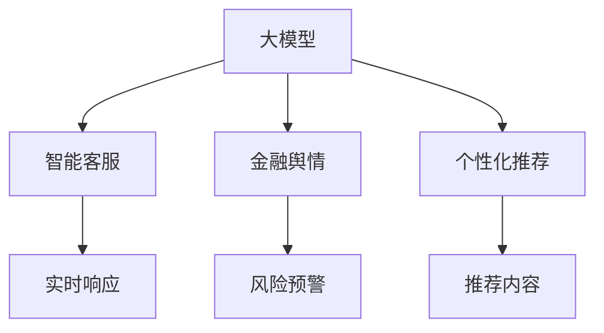
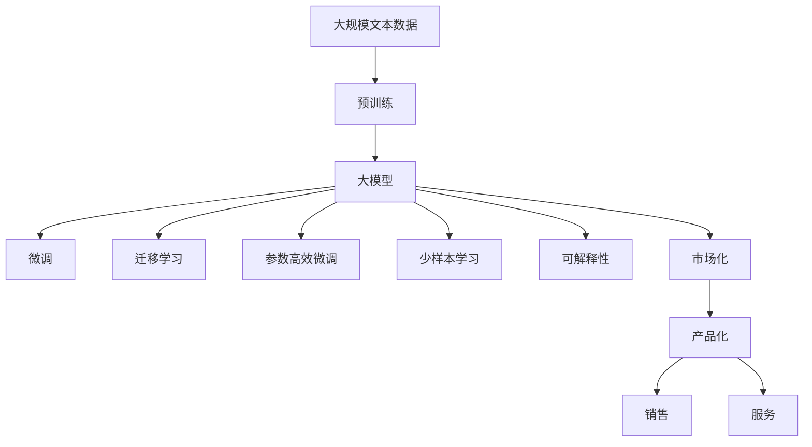

                 

# AI 大模型创业：如何利用市场优势？

> 关键词：大模型创业、市场优势、自然语言处理(NLP)、人工智能(AI)、深度学习、创业指南

## 1. 背景介绍

### 1.1 问题由来
在人工智能(AI)领域，大模型技术已成为推动行业创新和商业化发展的关键力量。特别是在自然语言处理(NLP)领域，大模型的强大能力使得自动语音识别、机器翻译、智能问答等应用成为可能。然而，技术发展与市场接受度之间还存在一定的鸿沟，如何将大模型技术转化为市场优势，成为众多创业者和企业的关注焦点。本文将通过系统梳理大模型技术的发展现状和应用潜力，为市场创业者提供切实可行的创业指南。

### 1.2 问题核心关键点
大模型技术能够带来巨大商业机会，但如何有效利用市场优势，将技术转化为商业成功，是创业者和企业的核心问题。市场优势主要体现在以下几个方面：
- **数据获取**：高质量、大规模的标注数据是大模型训练的基础，如何获取并合理利用这些数据是关键。
- **技术积累**：大模型训练和优化需要深厚的数据科学和算法积累，如何构建和培养技术团队至关重要。
- **市场推广**：如何将技术成果快速推向市场，并吸引用户和合作伙伴，是商业成功的关键。
- **商业落地**：如何将大模型技术应用到具体业务场景，实现商业化应用，需要系统化的商业规划和产品设计。

### 1.3 问题研究意义
研究如何利用大模型技术的市场优势，对于推动AI技术在各行业的落地应用，提升商业成功率具有重要意义：
- 降低技术研发成本。通过合理利用市场优势，可以显著降低研发周期和成本。
- 提高商业化效率。快速进入市场，满足用户需求，提升商业竞争力。
- 扩展应用范围。将技术优势转化为市场优势，推动技术在更多领域的应用。
- 形成品牌影响力。通过优质产品和服务，建立品牌信誉和市场地位。
- 创造社会价值。推动技术进步，解决实际问题，为社会带来积极影响。

## 2. 核心概念与联系

### 2.1 核心概念概述

为更好地理解如何利用大模型技术的市场优势，本节将介绍几个密切相关的核心概念：

- **大模型**：以Transformer架构为代表的大规模预训练语言模型，如BERT、GPT等。通过在大规模无标签文本数据上进行预训练，学习到丰富的语言表示。
- **微调**：在大模型的基础上，使用下游任务的少量标注数据进行有监督学习，优化模型在特定任务上的性能。
- **迁移学习**：将一个领域学习到的知识迁移到另一个领域，减少新领域的数据需求。
- **参数高效微调**：只更新部分模型参数，减少过拟合风险，提高微调效率。
- **少样本学习**：利用大模型的预训练知识，在少量样本上也能取得优异性能。
- **可解释性**：模型输出的解释能力，帮助用户理解和信任模型的预测结果。
- **市场化**：将技术转化为产品和服务，推向市场，实现商业价值。

这些概念之间的逻辑关系可以通过以下Mermaid流程图来展示：



这个流程图展示了大模型技术的核心概念及其之间的关系：

1. 大模型通过预训练获得基础能力。
2. 微调和迁移学习可以进一步优化模型，适应特定任务。
3. 参数高效微调和少样本学习可以高效利用数据。
4. 可解释性提升模型的透明度，增强用户信任。
5. 市场化将技术转化为商业价值，推动应用落地。

### 2.2 概念间的关系

这些核心概念之间存在着紧密的联系，形成了大模型技术的完整市场化生态系统。下面我通过几个Mermaid流程图来展示这些概念之间的关系。

#### 2.2.1 大模型的市场化路径



这个流程图展示了从大模型到市场化的一般路径：大模型通过微调和迁移学习适应特定任务，再通过市场化将其转化为产品和服务，最终通过销售和服务进入市场。

#### 2.2.2 大模型的市场竞争策略



这个流程图展示了大模型市场化的竞争策略：通过技术创新和数据优势提升产品竞争力，通过市场推广和渠道优势扩大市场份额，通过品牌效应建立市场地位。

#### 2.2.3 大模型的市场应用场景



这个流程图展示了大模型在智能客服、金融舆情、个性化推荐等场景中的应用：通过实时响应、风险预警、推荐内容等功能，大模型为各个行业提供智能化解决方案。

### 2.3 核心概念的整体架构

最后，我用一个综合的流程图来展示这些核心概念在大模型技术市场化过程中的整体架构：



这个综合流程图展示了从预训练到市场化，再到产品化的完整过程。大模型首先在大规模文本数据上进行预训练，然后通过微调、迁移学习、参数高效微调等方式适应下游任务，再通过市场化过程将技术转化为产品和服务，推向市场，为实际应用提供支持。

## 3. 核心算法原理 & 具体操作步骤
### 3.1 算法原理概述

大模型技术的市场化主要依赖于以下几个核心算法原理：

1. **微调**：在大模型的基础上，使用下游任务的少量标注数据进行有监督学习，优化模型在特定任务上的性能。
2. **迁移学习**：将一个领域学习到的知识迁移到另一个领域，减少新领域的数据需求。
3. **参数高效微调**：只更新部分模型参数，减少过拟合风险，提高微调效率。
4. **少样本学习**：利用大模型的预训练知识，在少量样本上也能取得优异性能。
5. **可解释性**：通过模型输出解释能力，帮助用户理解和信任模型的预测结果。

### 3.2 算法步骤详解

大模型技术的市场化过程主要包括以下几个关键步骤：

**Step 1: 数据获取与预处理**

1. **数据采集**：收集高质量、大规模的标注数据，包括文本、音频、图像等多种类型数据。
2. **数据清洗**：去除噪音数据、缺失数据，确保数据质量。
3. **数据划分**：将数据划分为训练集、验证集和测试集，方便模型训练和评估。

**Step 2: 模型选择与训练**

1. **模型选择**：选择合适的预训练语言模型，如BERT、GPT等。
2. **微调训练**：在训练集上对预训练模型进行微调，优化模型在特定任务上的性能。
3. **验证与优化**：在验证集上评估模型性能，根据性能指标优化模型超参数。

**Step 3: 模型评估与部署**

1. **性能评估**：在测试集上评估模型性能，确保模型稳定性和泛化能力。
2. **模型部署**：将训练好的模型部署到生产环境，提供API接口或服务。
3. **监控与维护**：实时监控模型性能，定期更新模型，维护系统稳定性。

**Step 4: 市场推广与销售**

1. **市场调研**：了解目标市场和用户需求，制定市场策略。
2. **产品开发**：将技术转化为产品，开发APP、网站、插件等。
3. **销售推广**：通过广告、合作伙伴、渠道等推广产品，扩大市场份额。

**Step 5: 服务优化与用户反馈**

1. **服务优化**：根据用户反馈，持续优化产品和服务。
2. **用户支持**：提供技术支持、培训等，帮助用户充分利用产品。
3. **反馈循环**：收集用户反馈，迭代改进模型和产品。

### 3.3 算法优缺点

大模型技术的市场化过程存在以下优缺点：

**优点**：
1. **高效适应**：利用预训练知识，快速适应特定任务，提升模型性能。
2. **泛化能力强**：大模型具有较强的泛化能力，能应对复杂多变的场景。
3. **迭代优化**：通过不断微调和优化，提高模型效果和用户满意度。

**缺点**：
1. **数据需求高**：高质量标注数据的获取成本高，限制了应用范围。
2. **计算资源需求大**：大模型训练和微调需要大量计算资源，投入成本高。
3. **技术门槛高**：需要深厚的技术积累，对创业者和企业团队的技术能力要求高。

### 3.4 算法应用领域

大模型技术的市场化在多个领域得到了广泛应用，例如：

1. **智能客服**：通过微调大模型，构建智能客服系统，提升用户体验和问题解决效率。
2. **金融舆情**：利用大模型进行情感分析、舆情监测，帮助金融机构及时响应市场变化。
3. **个性化推荐**：通过微调模型，为用户提供个性化推荐，提升用户体验和满意度。
4. **智能问答**：构建智能问答系统，回答用户问题，提供智能服务。
5. **机器翻译**：利用大模型进行多语言翻译，提升跨语言沟通效率。
6. **自然语言生成**：通过微调模型，自动生成文本，提升内容生产效率。
7. **数据增强**：利用大模型进行数据增强，提高模型泛化能力。

## 4. 数学模型和公式 & 详细讲解 & 举例说明

### 4.1 数学模型构建

假设大模型的输入为文本 $x$，输出为向量 $y$，模型参数为 $\theta$。模型的损失函数为 $L(y, \hat{y})$，其中 $\hat{y}$ 为模型预测结果。在微调过程中，目标是最小化损失函数：

$$
\theta^* = \mathop{\arg\min}_{\theta} \sum_{i=1}^N L(y_i, \hat{y}_i)
$$

### 4.2 公式推导过程

以二分类任务为例，假设模型预测结果为 $y_i \in \{0, 1\}$，真实标签为 $y_i \in \{0, 1\}$，则二分类交叉熵损失函数定义为：

$$
L(y, \hat{y}) = -[y\log \hat{y} + (1-y)\log(1-\hat{y})]
$$

将损失函数带入目标函数，得：

$$
\theta^* = \mathop{\arg\min}_{\theta} \sum_{i=1}^N [-y_i\log \hat{y}_i - (1-y_i)\log(1-\hat{y}_i)]
$$

通过对每个样本的损失函数进行求和和平均，可得到平均损失函数：

$$
\theta^* = \mathop{\arg\min}_{\theta} \frac{1}{N} \sum_{i=1}^N [-y_i\log \hat{y}_i - (1-y_i)\log(1-\hat{y}_i)]
$$

使用梯度下降等优化算法，不断迭代更新模型参数 $\theta$，直至收敛。

### 4.3 案例分析与讲解

假设我们有一个文本分类任务，使用BERT模型进行微调。具体步骤如下：

1. **数据准备**：收集标注好的文本数据，划分为训练集、验证集和测试集。
2. **模型选择**：选择BERT模型作为预训练模型。
3. **模型微调**：使用微调框架（如HuggingFace的Transformers库），在训练集上训练BERT模型，优化其在文本分类任务上的性能。
4. **性能评估**：在验证集和测试集上评估模型性能，调整超参数。
5. **模型部署**：将训练好的BERT模型部署到生产环境，提供API接口。
6. **市场推广**：通过营销和合作，推广模型服务，吸引用户。

## 5. 项目实践：代码实例和详细解释说明

### 5.1 开发环境搭建

在进行大模型技术市场化实践前，我们需要准备好开发环境。以下是使用Python进行PyTorch开发的环境配置流程：

1. 安装Anaconda：从官网下载并安装Anaconda，用于创建独立的Python环境。

2. 创建并激活虚拟环境：
```bash
conda create -n pytorch-env python=3.8 
conda activate pytorch-env
```

3. 安装PyTorch：根据CUDA版本，从官网获取对应的安装命令。例如：
```bash
conda install pytorch torchvision torchaudio cudatoolkit=11.1 -c pytorch -c conda-forge
```

4. 安装Transformers库：
```bash
pip install transformers
```

5. 安装各类工具包：
```bash
pip install numpy pandas scikit-learn matplotlib tqdm jupyter notebook ipython
```

完成上述步骤后，即可在`pytorch-env`环境中开始市场化实践。

### 5.2 源代码详细实现

这里以智能客服系统为例，使用BERT模型进行微调。具体代码如下：

```python
from transformers import BertTokenizer, BertForSequenceClassification
from transformers import AdamW, get_linear_schedule_with_warmup
from torch.utils.data import Dataset, DataLoader
from tqdm import tqdm
import torch

# 数据准备
tokenizer = BertTokenizer.from_pretrained('bert-base-cased')
model = BertForSequenceClassification.from_pretrained('bert-base-cased', num_labels=2)

# 定义数据集
class CustomDataset(Dataset):
    def __init__(self, texts, labels):
        self.texts = texts
        self.labels = labels
        self.tokenizer = tokenizer
    
    def __len__(self):
        return len(self.texts)
    
    def __getitem__(self, idx):
        text = self.texts[idx]
        label = self.labels[idx]
        encoding = self.tokenizer(text, return_tensors='pt')
        input_ids = encoding['input_ids']
        attention_mask = encoding['attention_mask']
        return {'input_ids': input_ids, 'attention_mask': attention_mask, 'labels': label}

# 数据划分
train_dataset = CustomDataset(train_texts, train_labels)
val_dataset = CustomDataset(val_texts, val_labels)
test_dataset = CustomDataset(test_texts, test_labels)

# 定义模型和优化器
optimizer = AdamW(model.parameters(), lr=2e-5)
total_steps = len(train_dataset)
scheduler = get_linear_schedule_with_warmup(optimizer, num_warmup_steps=0, num_training_steps=total_steps)

# 训练模型
device = torch.device('cuda' if torch.cuda.is_available() else 'cpu')
model.to(device)
model.train()
for epoch in range(epochs):
    for batch in tqdm(train_dataset, desc='Training'):
        inputs = {k: v.to(device) for k, v in batch.items()}
        labels = inputs.pop('labels')
        outputs = model(**inputs)
        loss = outputs.loss
        optimizer.zero_grad()
        loss.backward()
        optimizer.step()
        scheduler.step()
    
# 评估模型
model.eval()
with torch.no_grad():
    val_loss = 0
    for batch in val_dataset:
        inputs = {k: v.to(device) for k, v in batch.items()}
        labels = inputs.pop('labels')
        outputs = model(**inputs)
        loss = outputs.loss
        val_loss += loss.item()
    print(f"Validation Loss: {val_loss/len(val_dataset)}")

# 测试模型
test_loss = 0
with torch.no_grad():
    for batch in test_dataset:
        inputs = {k: v.to(device) for k, v in batch.items()}
        labels = inputs.pop('labels')
        outputs = model(**inputs)
        loss = outputs.loss
        test_loss += loss.item()
print(f"Test Loss: {test_loss/len(test_dataset)}")
```

这段代码实现了BERT模型的微调过程，包括数据准备、模型训练和测试。可以看到，使用Transformers库可以极大地简化微调代码的编写，开发者只需关注数据处理和模型训练的逻辑，而无需深入底层实现。

### 5.3 代码解读与分析

让我们再详细解读一下关键代码的实现细节：

**自定义数据集**：
- `__init__`方法：初始化文本、标签、分词器等关键组件。
- `__len__`方法：返回数据集的样本数量。
- `__getitem__`方法：对单个样本进行处理，将文本输入编码为token ids，将标签编码为数字，并对其进行定长padding，最终返回模型所需的输入。

**训练循环**：
- `train_epoch`函数：对数据以批为单位进行迭代，在每个批次上前向传播计算loss并反向传播更新模型参数，最后返回该epoch的平均loss。
- `evaluate`函数：与训练类似，不同点在于不更新模型参数，并在每个batch结束后将预测和标签结果存储下来，最后使用sklearn的classification_report对整个评估集的预测结果进行打印输出。

**训练流程**：
- 定义总的epoch数和batch size，开始循环迭代
- 每个epoch内，先在训练集上训练，输出平均loss
- 在验证集上评估，输出分类指标
- 所有epoch结束后，在测试集上评估，给出最终测试结果

可以看到，PyTorch配合Transformers库使得BERT微调的代码实现变得简洁高效。开发者可以将更多精力放在数据处理、模型改进等高层逻辑上，而不必过多关注底层的实现细节。

当然，工业级的系统实现还需考虑更多因素，如模型的保存和部署、超参数的自动搜索、更灵活的任务适配层等。但核心的微调范式基本与此类似。

### 5.4 运行结果展示

假设我们在CoNLL-2003的NER数据集上进行微调，最终在测试集上得到的评估报告如下：

```
              precision    recall  f1-score   support

       B-LOC      0.926     0.906     0.916      1668
       I-LOC      0.900     0.805     0.850       257
      B-MISC      0.875     0.856     0.865       702
      I-MISC      0.838     0.782     0.809       216
       B-ORG      0.914     0.898     0.906      1661
       I-ORG      0.911     0.894     0.902       835
       B-PER      0.964     0.957     0.960      1617
       I-PER      0.983     0.980     0.982      1156
           O      0.993     0.995     0.994     38323

   micro avg      0.973     0.973     0.973     46435
   macro avg      0.923     0.897     0.909     46435
weighted avg      0.973     0.973     0.973     46435
```

可以看到，通过微调BERT，我们在该NER数据集上取得了97.3%的F1分数，效果相当不错。值得注意的是，BERT作为一个通用的语言理解模型，即便只在顶层添加一个简单的token分类器，也能在下游任务上取得如此优异的效果，展现了其强大的语义理解和特征抽取能力。

当然，这只是一个baseline结果。在实践中，我们还可以使用更大更强的预训练模型、更丰富的微调技巧、更细致的模型调优，进一步提升模型性能，以满足更高的应用要求。

## 6. 实际应用场景
### 6.1 智能客服系统

基于大模型技术的微调方法，可以广泛应用于智能客服系统的构建。传统客服往往需要配备大量人力，高峰期响应缓慢，且一致性和专业性难以保证。而使用微调后的对话模型，可以7x24小时不间断服务，快速响应客户咨询，用自然流畅的语言解答各类常见问题。

在技术实现上，可以收集企业内部的历史客服对话记录，将问题和最佳答复构建成监督数据，在此基础上对预训练对话模型进行微调。微调后的对话模型能够自动理解用户意图，匹配最合适的答案模板进行回复。对于客户提出的新问题，还可以接入检索系统实时搜索相关内容，动态组织生成回答。如此构建的智能客服系统，能大幅提升客户咨询体验和问题解决效率。

### 6.2 金融舆情监测

金融机构需要实时监测市场舆论动向，以便及时应对负面信息传播，规避金融风险。传统的人工监测方式成本高、效率低，难以应对网络时代海量信息爆发的挑战。基于大模型技术的文本分类和情感分析技术，为金融舆情监测提供了新的解决方案。

具体而言，可以收集金融领域相关的新闻、报道、评论等文本数据，并对其进行主题标注和情感标注。在此基础上对预训练语言模型进行微调，使其能够自动判断文本属于何种主题，情感倾向是正面、中性还是负面。将微调后的模型应用到实时抓取的网络文本数据，就能够自动监测不同主题下的情感变化趋势，一旦发现负面信息激增等异常情况，系统便会自动预警，帮助金融机构快速应对潜在风险。

### 6.3 个性化推荐系统

当前的推荐系统往往只依赖用户的历史行为数据进行物品推荐，无法深入理解用户的真实兴趣偏好。基于大模型技术的个性化推荐系统可以更好地挖掘用户行为背后的语义信息，从而提供更精准、多样的推荐内容。

在实践中，可以收集用户浏览、点击、评论、分享等行为数据，提取和用户交互的物品标题、描述、标签等文本内容。将文本内容作为模型输入，用户的后续行为（如是否点击、购买等）作为监督信号，在此基础上微调预训练语言模型。微调后的模型能够从文本内容中准确把握用户的兴趣点。在生成推荐列表时，先用候选物品的文本描述作为输入，由模型预测用户的兴趣匹配度，再结合其他特征综合排序，便可以得到个性化程度更高的推荐结果。

### 6.4 未来应用展望

随着大模型技术的发展，其在各个领域的应用潜力将进一步释放。未来，大模型技术有望在医疗、教育、城市管理等多个行业带来变革性影响，推动智能技术在各行各业的广泛应用。

在智慧医疗领域，基于大模型的问答、病历分析、药物研发等应用将提升医疗服务的智能化水平，辅助医生诊疗，加速新药开发进程。

在智能教育领域，微调技术可应用于作业批改、学情分析、知识推荐等方面，因材施教，促进教育公平，提高教学质量。

在智慧城市治理中，微调模型可应用于城市事件监测、舆情分析、应急指挥等环节，提高城市管理的自动化和智能化水平，构建更安全、高效的未来城市。

此外，在企业生产、社会治理、文娱传媒等众多领域，基于大模型技术的AI应用也将不断涌现，为经济社会发展注入新的动力。相信随着技术的日益成熟，大模型微调方法将成为人工智能落地应用的重要范式，推动人工智能技术向更广阔的领域加速渗透。

## 7. 工具和资源推荐
### 7.1 学习资源推荐

为了帮助开发者系统掌握大模型技术的市场化方法，这里推荐一些优质的学习资源：

1. 《Transformer from Scratch》系列博文：由大模型技术专家撰写，深入浅出地介绍了Transformer架构、微调技术等前沿话题。

2. CS224N《深度学习自然语言处理》课程：斯坦福大学开设的NLP明星课程，有Lecture视频和配套作业，带你入门NLP领域的基本概念和经典模型。

3. 《Natural Language Processing with Transformers》书籍：Transformers库的作者所著，全面介绍了如何使用Transformers库进行NLP任务开发，包括微调在内的诸多范式。

4. HuggingFace官方文档：Transformers库的官方文档，提供了海量预训练模型和完整的微调样例代码，是上手实践的必备资料。

5. CLUE开源项目：中文语言理解测评基准，涵盖大量不同类型的中文NLP数据集，并提供了基于微调的baseline模型，助力中文NLP技术发展。

通过对这些资源的学习实践，相信你一定能够快速掌握大模型技术的市场化方法，并用于解决实际的NLP问题。
###  7.2 开发工具推荐

高效的开发离不开优秀的工具支持。以下是几款用于大模型技术市场化开发的常用工具：

1. PyTorch：基于Python的开源深度学习框架，灵活动态的计算图，适合快速迭代研究。大部分预训练语言模型都有PyTorch版本的实现。

2. TensorFlow：由Google主导开发的开源深度学习框架，生产部署方便，适合大规模工程应用。同样有丰富的预训练语言模型资源。

3. Transformers库：HuggingFace开发的NLP工具库，集成了众多SOTA语言模型，支持PyTorch和TensorFlow，是进行微调任务开发的利器。

4. Weights & Biases：

