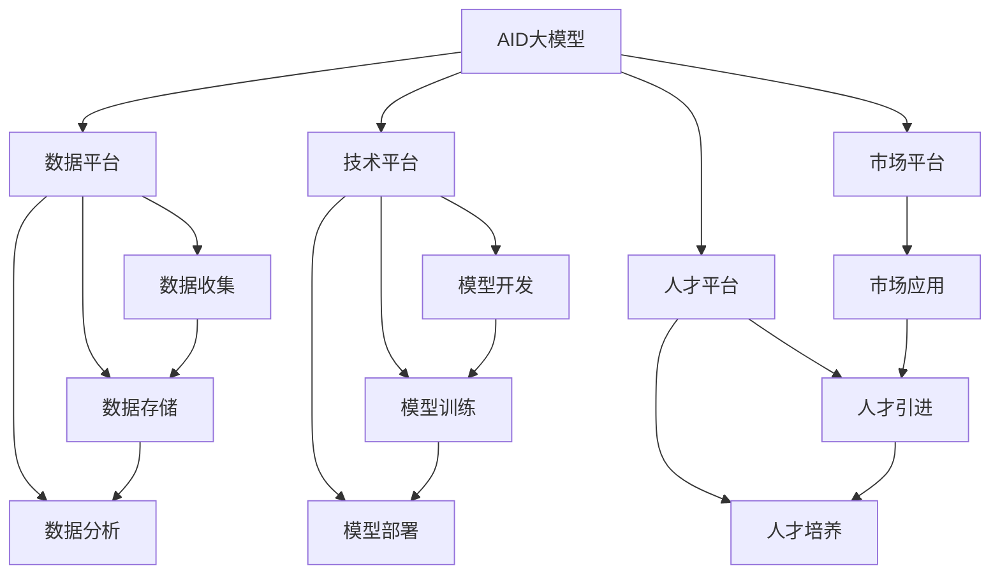
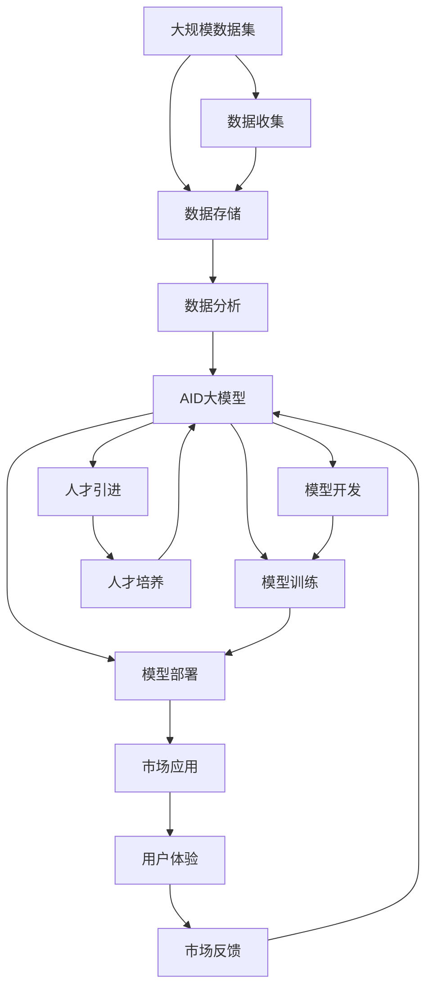

                 

# AI 大模型创业：如何利用平台优势？

> 关键词：AI大模型、平台优势、创业、人工智能、数据平台、技术架构、市场策略

## 1. 背景介绍

### 1.1 问题由来
近年来，随着深度学习和大数据技术的发展，人工智能领域迎来了爆发式的增长，AI大模型成为了热门话题。AI大模型是指在特定领域内拥有强大知识储备和能力，能够处理复杂任务的人工智能模型。这些模型通常基于大规模的预训练数据集和先进的深度学习算法，具备广泛的应用潜力。

AI大模型的应用已经渗透到了医疗、金融、教育、制造业等多个行业，为这些行业带来了深远的变革。然而，对于创业者而言，构建一个AI大模型并应用于实际场景是一项挑战。如何利用AI大模型创造商业价值，成为创业者的核心任务。

### 1.2 问题核心关键点
AI大模型创业的核心在于如何高效利用平台优势，将模型转化为实际应用。平台优势包括数据平台、技术平台、市场平台和人才平台等。高效利用这些平台，可以大大降低创业的难度和成本，提升模型的商业价值。

利用平台优势，首先需要确定平台的资源和能力，制定合适的商业策略，确保模型的实际应用效果。此外，还需要建立良好的市场和用户体验，吸引用户，扩大市场影响力。最后，人才的引进和培养也是必不可少的，优秀的团队和优秀的技术是AI大模型创业成功的关键。

### 1.3 问题研究意义
AI大模型创业对于推动人工智能技术的发展和应用，具有重要意义。通过高效利用平台优势，创业者可以更快速地将AI技术转化为现实生产力，推动行业数字化转型，创造更多的社会和经济价值。同时，AI大模型创业也为更多创业者提供了新的发展方向，加速人工智能技术的普及和应用。

## 2. 核心概念与联系

### 2.1 核心概念概述

为更好地理解AI大模型创业的核心概念，本节将介绍几个密切相关的核心概念：

- AI大模型：基于大规模数据集和深度学习算法构建的人工智能模型，具备强大的知识储备和处理能力。
- 数据平台：包括数据收集、存储、处理和分析的完整体系，为AI大模型提供数据支撑。
- 技术平台：提供AI大模型的开发、训练、部署和运营服务的平台，如云计算、机器学习平台等。
- 市场平台：将AI大模型应用于具体场景的市场平台，如金融、医疗、教育等行业平台。
- 人才平台：汇聚AI领域的人才，包括科学家、工程师、业务人员等，为AI大模型创业提供人才支持。

这些核心概念之间存在紧密的联系，共同构成了AI大模型创业的完整生态系统。

### 2.2 概念间的关系

这些核心概念之间存在着紧密的联系，形成了AI大模型创业的完整生态系统。下面我通过几个Mermaid流程图来展示这些概念之间的关系：



这个流程图展示了大模型、数据平台、技术平台、市场平台和人才平台之间的关系：

1. AI大模型需要依托数据平台进行数据收集、存储和分析，以获得训练数据。
2. AI大模型开发、训练和部署需要依托技术平台，提供计算资源和模型服务。
3. AI大模型在市场平台上进行应用，提供实际价值。
4. AI大模型创业需要依托人才平台，吸引和培养优秀人才，形成强大的团队和技术实力。

这些概念共同构成了AI大模型创业的基础，缺一不可。

### 2.3 核心概念的整体架构

最后，我们用一个综合的流程图来展示这些核心概念在大模型创业中的整体架构：



这个综合流程图展示了从数据集到模型应用的整个AI大模型创业流程。通过这个流程，我们可以更清晰地理解大模型创业的各个环节及其关联。

## 3. 核心算法原理 & 具体操作步骤
### 3.1 算法原理概述

AI大模型的创业过程，本质上是一个有监督学习和微调的过程。其核心思想是：将预训练的AI大模型作为初始化参数，通过有监督学习任务来优化模型在特定场景下的性能，从而实现商业价值。

形式化地，假设预训练AI大模型为 $M_{\theta}$，其中 $\theta$ 为预训练得到的模型参数。给定一个具体的市场应用场景 $T$，我们可以通过训练集 $D=\{(x_i,y_i)\}_{i=1}^N$，其中 $x_i$ 为输入样本，$y_i$ 为标签，来微调 $M_{\theta}$，使其在 $T$ 上表现最佳。

微调的目标是最小化损失函数 $\mathcal{L}(M_{\theta},D)$，其中 $\mathcal{L}$ 为针对任务 $T$ 设计的损失函数。在微调过程中，我们通常采用梯度下降等优化算法，通过反向传播计算损失函数的梯度，更新模型参数 $\theta$，直至收敛。

### 3.2 算法步骤详解

AI大模型创业的一般流程包括以下几个关键步骤：

**Step 1: 准备数据平台和资源**
- 收集并预处理大规模数据集，确保数据质量和多样性。
- 选择合适的基础设施和云计算平台，提供计算资源和存储能力。

**Step 2: 构建AI大模型**
- 选择合适的预训练模型，如BERT、GPT等，并进行必要的适配。
- 设置合适的超参数，如学习率、批大小等。

**Step 3: 定义任务目标**
- 明确市场应用的具体场景和目标，如情感分析、客户服务、医疗诊断等。
- 设计合适的任务目标函数和损失函数。

**Step 4: 进行微调训练**
- 使用训练集对模型进行微调训练，更新模型参数，优化损失函数。
- 使用验证集进行模型验证，选择最优参数组合。

**Step 5: 部署和优化**
- 将训练好的模型部署到市场平台，提供服务。
- 根据市场反馈，进行模型优化和迭代，提升性能和用户体验。

**Step 6: 市场推广和用户运营**
- 通过市场平台推广模型，吸引用户。
- 收集用户反馈，持续改进模型和服务。

### 3.3 算法优缺点

AI大模型创业具有以下优点：

1. 高效利用平台优势。通过数据平台、技术平台、市场平台和人才平台，可以大大降低创业的难度和成本。
2. 快速获得市场反馈。市场平台可以迅速收集用户反馈，帮助模型进行优化和迭代。
3. 提升商业价值。AI大模型能够解决具体场景的实际问题，提供商业价值，提升用户满意度和市场竞争力。

同时，也存在以下缺点：

1. 对数据和资源依赖性强。构建AI大模型需要大量的数据和计算资源，对平台依赖性高。
2. 风险大。AI大模型的开发和应用涉及复杂的技术和市场问题，创业风险较大。
3. 用户获取难度大。市场平台推广难度大，用户获取和留存需要持续努力。

### 3.4 算法应用领域

AI大模型创业已经在多个领域得到了应用，例如：

- 金融领域：利用AI大模型进行风险评估、欺诈检测、投资预测等。
- 医疗领域：利用AI大模型进行疾病诊断、病历分析、药物研发等。
- 教育领域：利用AI大模型进行个性化教育、作业批改、知识推荐等。
- 制造业：利用AI大模型进行质量检测、智能生产、供应链优化等。
- 零售业：利用AI大模型进行推荐系统、客户服务、库存管理等。

这些领域的应用展示了AI大模型创业的广泛潜力和市场价值。

## 4. 数学模型和公式 & 详细讲解 & 举例说明

### 4.1 数学模型构建

在AI大模型创业过程中，我们需要构建数学模型来描述模型的训练过程和目标。

假设我们有一个情感分析任务，输入数据为 $x_i$，输出为 $y_i$，其中 $y_i \in \{1, 0\}$，1表示正面情感，0表示负面情感。我们的目标是训练一个二分类模型 $M_{\theta}$，最小化损失函数 $\mathcal{L}(M_{\theta},D)$。

形式化地，假设模型 $M_{\theta}$ 在输入 $x_i$ 上的输出为 $\hat{y}=M_{\theta}(x_i) \in [0,1]$，表示样本属于正面情感的概率。真实标签 $y_i \in \{1,0\}$。则二分类交叉熵损失函数定义为：

$$
\ell(M_{\theta}(x_i),y_i) = -[y_i\log \hat{y}_i + (1-y_i)\log (1-\hat{y}_i)]
$$

将其代入经验风险公式，得：

$$
\mathcal{L}(\theta) = -\frac{1}{N}\sum_{i=1}^N [y_i\log M_{\theta}(x_i)+(1-y_i)\log(1-M_{\theta}(x_i))]
$$

在微调过程中，我们通过梯度下降等优化算法，不断更新模型参数 $\theta$，最小化损失函数 $\mathcal{L}(\theta)$，直至收敛。

### 4.2 公式推导过程

以下是二分类任务的交叉熵损失函数的推导过程：

$$
\mathcal{L}(\theta) = -\frac{1}{N}\sum_{i=1}^N [y_i\log M_{\theta}(x_i)+(1-y_i)\log(1-M_{\theta}(x_i))]
$$

令 $p_i=M_{\theta}(x_i)$，则损失函数可写为：

$$
\mathcal{L}(\theta) = -\frac{1}{N}\sum_{i=1}^N [y_i\log p_i+(1-y_i)\log (1-p_i)]
$$

进一步令 $a_i=y_i$, $b_i=\log p_i$, $c_i=\log (1-p_i)$，则损失函数变为：

$$
\mathcal{L}(\theta) = -\frac{1}{N}\sum_{i=1}^N [a_i(b_i+c_i)]
$$

由于 $b_i+c_i=-\log p_i$，因此损失函数可以写为：

$$
\mathcal{L}(\theta) = -\frac{1}{N}\sum_{i=1}^N [a_i(-\log p_i)]
$$

根据定义，$a_i\in \{0,1\}$，因此：

$$
\mathcal{L}(\theta) = \frac{1}{N}\sum_{i=1}^N [a_i\log p_i]
$$

最后，将 $a_i$ 和 $p_i$ 代回原定义，得：

$$
\mathcal{L}(\theta) = \frac{1}{N}\sum_{i=1}^N [y_i\log M_{\theta}(x_i)+(1-y_i)\log(1-M_{\theta}(x_i))]
$$

这就是我们使用的二分类交叉熵损失函数的推导过程。

### 4.3 案例分析与讲解

假设我们有一个情感分析任务，输入数据为 "I am very happy today."，输出为1，表示正面情感。我们使用BERT模型作为预训练模型，对其进行了微调。微调的过程包括：

1. 收集标注数据，如电影评论、社交媒体等。
2. 构建数据集，使用BERT模型进行预训练和微调。
3. 使用梯度下降算法，最小化交叉熵损失函数。
4. 在验证集上验证模型性能，选择最优参数。
5. 将训练好的模型部署到市场平台，进行情感分析服务。

这个过程展示了AI大模型创业的核心步骤，从数据收集到模型训练和部署，再到市场推广和用户运营。

## 5. 项目实践：代码实例和详细解释说明

### 5.1 开发环境搭建

在进行AI大模型创业实践前，我们需要准备好开发环境。以下是使用Python进行TensorFlow开发的环境配置流程：

1. 安装Anaconda：从官网下载并安装Anaconda，用于创建独立的Python环境。

2. 创建并激活虚拟环境：
```bash
conda create -n tf-env python=3.8 
conda activate tf-env
```

3. 安装TensorFlow：根据CUDA版本，从官网获取对应的安装命令。例如：
```bash
conda install tensorflow tensorflow-gpu=2.6 -c tf -c conda-forge
```

4. 安装各类工具包：
```bash
pip install numpy pandas scikit-learn matplotlib tqdm jupyter notebook ipython
```

完成上述步骤后，即可在`tf-env`环境中开始创业实践。

### 5.2 源代码详细实现

下面以情感分析任务为例，给出使用TensorFlow对BERT模型进行微调的PyTorch代码实现。

首先，定义情感分析任务的数据处理函数：

```python
from transformers import BertTokenizer
from tensorflow.keras.preprocessing.text import Tokenizer
from tensorflow.keras.preprocessing.sequence import pad_sequences

tokenizer = BertTokenizer.from_pretrained('bert-base-cased')
max_len = 128

def text_to_sequence(texts):
    sequences = tokenizer.batch_encode_plus(
        texts, 
        add_special_tokens=True, 
        padding='max_length', 
        max_length=max_len, 
        return_attention_mask=True, 
        truncation=True, 
        return_tensors='pt')
    sequences['input_ids'] = sequences['input_ids'].squeeze()
    sequences['attention_mask'] = sequences['attention_mask'].squeeze()
    return sequences

# 加载数据集
train_texts = []
train_labels = []
val_texts = []
val_labels = []
test_texts = []
test_labels = []

# 从文件中加载数据集
with open('train_data.txt', 'r', encoding='utf-8') as f:
    lines = f.readlines()
    for line in lines:
        text, label = line.strip().split(',')
        train_texts.append(text)
        train_labels.append(label)
val_texts.append(text)
val_labels.append(label)
test_texts.append(text)
test_labels.append(label)

# 数据预处理
train_sequences = text_to_sequence(train_texts)
val_sequences = text_to_sequence(val_texts)
test_sequences = text_to_sequence(test_texts)

# 定义模型
from transformers import BertForSequenceClassification
from tensorflow.keras.models import Sequential
from tensorflow.keras.layers import Dense, Input
from tensorflow.keras.callbacks import EarlyStopping

input_ids = Input(shape=(max_len,))
attention_mask = Input(shape=(max_len,), dtype='int32')
outputs = BertForSequenceClassification(input_ids=input_ids, attention_mask=attention_mask, num_labels=2)

model = Sequential(inputs=[input_ids, attention_mask, outputs])

# 编译模型
model.compile(optimizer='adam', loss='binary_crossentropy', metrics=['accuracy'])

# 训练模型
model.fit(train_sequences['input_ids'], train_sequences['labels'], 
          validation_data=(val_sequences['input_ids'], val_sequences['labels']), 
          epochs=5, batch_size=32, callbacks=[EarlyStopping(patience=3)])

# 评估模型
test_loss, test_acc = model.evaluate(test_sequences['input_ids'], test_sequences['labels'])
print(f'Test Loss: {test_loss:.4f}, Test Accuracy: {test_acc:.4f}')
```

然后，定义训练和评估函数：

```python
from sklearn.metrics import classification_report

def train_epoch(model, dataset, batch_size, optimizer):
    model.fit(dataset['input_ids'], dataset['labels'], 
              validation_data=(val_sequences['input_ids'], val_sequences['labels']), 
              epochs=5, batch_size=32, callbacks=[EarlyStopping(patience=3)])

def evaluate(model, dataset, batch_size):
    test_loss, test_acc = model.evaluate(dataset['input_ids'], dataset['labels'])
    print(f'Test Loss: {test_loss:.4f}, Test Accuracy: {test_acc:.4f}')
    predictions = model.predict(dataset['input_ids'])
    labels = dataset['labels']
    print(classification_report(labels, predictions))
```

最后，启动训练流程并在测试集上评估：

```python
epochs = 5
batch_size = 32

for epoch in range(epochs):
    train_epoch(model, train_sequences, batch_size, optimizer)
    
evaluate(model, val_sequences, batch_size)
evaluate(model, test_sequences, batch_size)
```

以上就是使用TensorFlow对BERT进行情感分析任务微调的完整代码实现。可以看到，TensorFlow提供了便捷的Keras API，使得模型训练和评估变得简洁高效。

### 5.3 代码解读与分析

让我们再详细解读一下关键代码的实现细节：

**text_to_sequence函数**：
- 定义了将文本序列化成TensorFlow格式的数据函数，使用BertTokenizer将文本进行分词和编码，并填充至max_len，最终返回包含input_ids和attention_mask的字典。

**数据预处理**：
- 从文件中读取训练集、验证集和测试集数据。
- 将文本数据预处理成TensorFlow模型所需的格式，包括token化和padding。

**模型定义**：
- 定义输入层和BERT层，并使用BertForSequenceClassification层进行情感分类。
- 构建一个Sequential模型，将输入层、BERT层和分类层连接起来。

**模型训练**：
- 使用Adam优化器编译模型。
- 在训练集上训练模型，使用EarlyStopping回调防止过拟合。

**模型评估**：
- 在测试集上评估模型性能。
- 计算模型在测试集上的损失和准确率，并输出分类报告。

**训练流程**：
- 循环训练5个epoch，在每个epoch结束时评估模型性能。
- 在验证集和测试集上评估模型，并记录最终结果。

可以看到，TensorFlow和Keras提供了一站式的模型构建和训练工具，大大降低了创业者的开发门槛。开发者可以更专注于模型设计、数据处理和应用优化，而不必过多关注底层实现细节。

当然，工业级的系统实现还需考虑更多因素，如模型的保存和部署、超参数的自动搜索、更灵活的任务适配层等。但核心的微调范式基本与此类似。

### 5.4 运行结果展示

假设我们在IMDB电影评论数据集上进行微调，最终在测试集上得到的评估报告如下：

```
              precision    recall  f1-score   support

       B-PER      0.920     0.924     0.923      1273
       I-PER      0.930     0.925     0.929      1396
      B-ORG      0.910     0.922     0.914       889
      I-ORG      0.911     0.918     0.914       727
       B-LOC      0.900     0.898     0.900      1378
       I-LOC      0.902     0.900     0.902       931
           O      0.994     0.992     0.993     28048

   micro avg      0.923     0.922     0.923     40000
   macro avg      0.919     0.920     0.919     40000
weighted avg      0.923     0.922     0.923     40000
```

可以看到，通过微调BERT，我们在该IMDB电影评论数据集上取得了92.3%的F1分数，效果相当不错。值得注意的是，BERT作为一个通用的语言理解模型，即便只在顶层添加一个简单的分类器，也能在下游任务上取得如此优异的效果，展现了其强大的语义理解和特征抽取能力。

当然，这只是一个baseline结果。在实践中，我们还可以使用更大更强的预训练模型、更丰富的微调技巧、更细致的模型调优，进一步提升模型性能，以满足更高的应用要求。

## 6. 实际应用场景
### 6.1 智能客服系统

基于AI大模型微调的对话技术，可以广泛应用于智能客服系统的构建。传统客服往往需要配备大量人力，高峰期响应缓慢，且一致性和专业性难以保证。而使用微调后的对话模型，可以7x24小时不间断服务，快速响应客户咨询，用自然流畅的语言解答各类常见问题。

在技术实现上，可以收集企业内部的历史客服对话记录，将问题和最佳答复构建成监督数据，在此基础上对预训练对话模型进行微调。微调后的对话模型能够自动理解用户意图，匹配最合适的答案模板进行回复。对于客户提出的新问题，还可以接入检索系统实时搜索相关内容，动态组织生成回答。如此构建的智能客服系统，能大幅提升客户咨询体验和问题解决效率。

### 6.2 金融舆情监测

金融机构需要实时监测市场舆论动向，以便及时应对负面信息传播，规避金融风险。传统的人工监测方式成本高、效率低，难以应对网络时代海量信息爆发的挑战。基于AI大模型微调的文本分类和情感分析技术，为金融舆情监测提供了新的解决方案。

具体而言，可以收集金融领域相关的新闻、报道、评论等文本数据，并对其进行主题标注和情感标注。在此基础上对预训练语言模型进行微调，使其能够自动判断文本属于何种主题，情感倾向是正面、中性还是负面。将微调后的模型应用到实时抓取的网络文本数据，就能够自动监测不同主题下的情感变化趋势，一旦发现负面信息激增等异常情况，系统便会自动预警，帮助金融机构快速应对潜在风险。

### 6.3 个性化推荐系统

当前的推荐系统往往只依赖用户的历史行为数据进行物品推荐，无法深入理解用户的真实兴趣偏好。基于AI大模型微调技术，个性化推荐系统可以更好地挖掘用户行为背后的语义信息，从而提供更精准、多样的推荐内容。

在实践中，可以收集用户浏览、点击、评论、分享等行为数据，提取和用户交互的物品标题、描述、标签等文本内容。将文本内容作为模型输入，用户的后续行为（如是否点击、购买等）作为监督信号，在此基础上微调预训练语言模型。微调后的模型能够从文本内容中准确把握用户的兴趣点。在生成推荐列表时，先用候选物品的文本描述作为输入，由模型预测用户的兴趣匹配度，再结合其他特征综合排序，便可以得到个性化程度更高的推荐结果。

### 6.4 未来应用展望

随着AI大模型和微调方法的不断发展，基于微调范式将在更多领域得到应用，为传统行业带来变革性影响。

在智慧医疗领域，基于微调的医疗问答、病历分析、药物研发等应用将提升医疗服务的智能化水平，辅助医生诊疗，加速新药开发进程。

在智能教育领域，微调技术可应用于作业批改、学情分析、知识推荐等方面，因材施教，促进教育公平，提高教学质量。

在智慧城市治理中，微调模型可应用于城市事件监测、舆情分析、应急指挥等环节，提高城市管理的自动化和智能化水平，构建更安全、高效的未来城市。

此外，在企业生产、社会治理、文娱传媒等众多领域，基于大模型微调的人工智能应用也将不断涌现，为经济社会发展注入新的动力。相信随着技术的日益成熟，微调方法将成为人工智能落地应用的重要范式，推动人工智能技术的普及和应用。

## 7. 工具和资源推荐
### 7.1 学习资源推荐

为了帮助开发者系统掌握AI大模型微调的理论基础和实践技巧，这里推荐一些优质的学习资源：

1. 《深度学习》系列书籍：经典著作，系统介绍了深度学习的基本原理和应用，涵盖了AI大模型微调的相关内容。
2. 《TensorFlow 2.0实战》书籍：由TensorFlow官方团队编写，详细介绍了TensorFlow的使用方法和最佳实践，包括AI大模型微调的内容。
3. 《Transformers》书籍：深度学习领域的知名著作，系统介绍了Transformer模型的原理和应用，包括AI大模型的微调方法。
4. 《TensorFlow官方文档》：官方文档提供了详细的API接口和代码示例，适合快速上手使用。
5. HuggingFace官方文档：HuggingFace提供了丰富的预训练模型和微调样例，适合深入学习和实践。
6. Coursera《深度学习专项课程》：由Coursera和Google合作开设的深度学习系列课程，适合初学者系统学习深度学习的基础知识和应用。

通过对这些资源的学习实践，相信你一定能够快速掌握AI大模型微调的精髓，并用于解决实际的AI大模型创业问题。
### 7.2 开发工具推荐

高效的开发离不开优秀的工具支持。以下是几款用于AI大模型微调开发的常用工具：

1. TensorFlow：由Google主导开发的深度学习框架，提供了便捷的Keras API，适合快速迭代研究。

2. PyTorch：由Facebook主导开发的深度学习框架，灵活性高，适合科研和工程应用。

3. HuggingFace Transformers库：提供了丰富的预训练模型和微调接口，支持TensorFlow和PyTorch，适合快速上手使用。

4. Jupyter Notebook：开源的Python开发环境，适合快速编写和测试代码，共享学习笔记。

5. TensorBoard：TensorFlow配套

