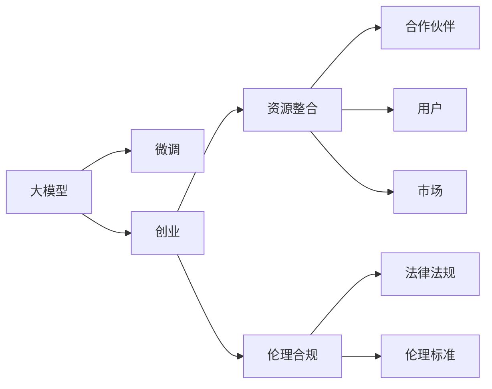
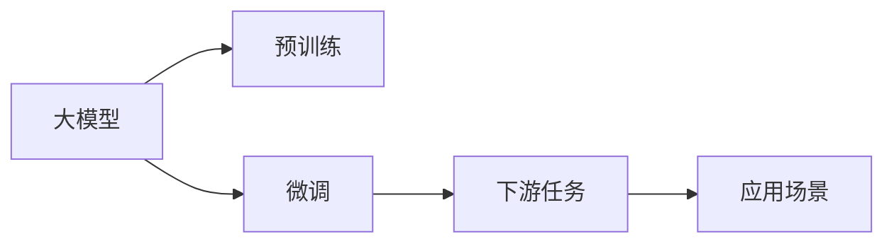
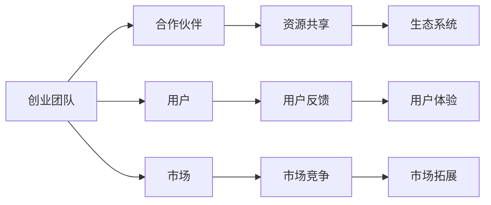
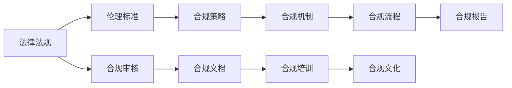

                 

# AI 大模型创业：如何利用社会优势？

> 关键词：大模型创业, 社会优势, 人工智能应用, 技术商业化, 资源整合, 伦理合规

## 1. 背景介绍

### 1.1 问题由来

近年来，人工智能(AI)技术飞速发展，尤其是大模型（如BERT、GPT-3等）在自然语言处理（NLP）、计算机视觉等领域展现了巨大的潜力。这些大模型通过在海量无标签数据上进行预训练，学习到了丰富的知识和常识，并通过微调（fine-tuning）等方法，在特定任务上取得了优异的表现。然而，在实际应用中，这些大模型仍面临诸多挑战，包括数据隐私、算法透明性、社会责任等，制约了其商业化进程。

为了解决这些问题，越来越多的企业和研究机构开始探索利用大模型进行创业，旨在将AI技术商业化，为各行各业提供高效、智能的服务。然而，大模型创业不仅仅是技术问题，还需要考虑更广泛的社会因素。本文旨在探讨如何利用社会优势，助力大模型创业的成功。

### 1.2 问题核心关键点

大模型创业的核心关键点在于：

- 如何选择合适的应用领域，满足特定业务需求。
- 如何构建稳定的生态系统，吸引和利用合作伙伴资源。
- 如何确保合规性，避免法律和伦理风险。
- 如何平衡技术优势和社会责任，实现可持续商业化。

这些问题要求创业团队不仅具备技术实力，还需要拥有全面的市场洞察力和社会责任感。

### 1.3 问题研究意义

利用大模型进行创业，不仅可以推动AI技术的发展，还能带来巨大的经济效益和社会效益。具体来说：

- 降低创业成本。大模型可以在短时间内训练出具有强大能力的模型，无需从头开始构建模型，节省大量时间和资源。
- 提高应用效果。大模型已经具备了丰富的语言理解和生成能力，可以快速适应特定任务，提升应用效果。
- 推动行业变革。通过引入AI技术，各行各业可以实现智能化升级，提升效率和服务质量。
- 促进技术普及。大模型的应用可以带动更多人参与AI技术的探索和学习，推动技术的普及和传播。

然而，大模型创业也面临着诸多挑战，包括技术成熟度、市场接受度、伦理合规性等。本文将深入探讨如何利用社会优势，克服这些挑战，推动大模型创业的成功。

## 2. 核心概念与联系

### 2.1 核心概念概述

为更好地理解大模型创业的社会优势利用，本节将介绍几个密切相关的核心概念：

- **大模型**：通过在大规模无标签数据上预训练，学习到丰富的语言知识和常识，能够处理复杂的自然语言处理任务的大规模语言模型。
- **微调**：在大模型的基础上，利用小规模标注数据进行有监督学习，优化模型在特定任务上的性能。
- **创业**：通过引入新技术、新方法，创造新商业模式，满足市场需求的商业活动。
- **社会优势**：利用社会资源、文化背景、法律法规等优势，降低创业风险，提升创业效果。
- **资源整合**：利用合作伙伴、用户、市场等资源，形成稳定的生态系统，推动技术商业化。
- **伦理合规**：确保技术应用的合法合规性，避免法律和伦理风险。

这些核心概念之间存在着紧密的联系，形成了大模型创业的社会优势利用框架。下面我们通过Mermaid流程图来展示这些概念之间的关系：



这个流程图展示了从大模型预训练到创业过程中，各个关键环节及其相互作用。大模型在预训练的基础上进行微调，创业团队通过整合各类资源，确保应用合规性，最终实现技术商业化。

### 2.2 概念间的关系

这些核心概念之间存在着紧密的联系，形成了大模型创业的社会优势利用框架。下面我通过几个Mermaid流程图来展示这些概念之间的关系：

#### 2.2.1 大模型的应用过程



这个流程图展示了从大模型预训练到微调，再到应用的过程。大模型在预训练后进行微调，以适应特定任务，最终在实际应用场景中发挥作用。

#### 2.2.2 创业过程中的资源整合



这个流程图展示了创业团队如何通过资源整合，构建稳定的生态系统。通过与合作伙伴共享资源，吸引用户参与，开拓市场，形成良性循环，推动技术商业化。

#### 2.2.3 合规性的重要性



这个流程图展示了创业过程中合规性的重要性。通过遵循法律法规和伦理标准，制定合规策略，确保合规审核，形成合规机制和文档，推动合规培训和文化建设，最终形成合规报告，确保技术应用的合法合规性。

### 2.3 核心概念的整体架构

最后，我们用一个综合的流程图来展示这些核心概念在大模型创业过程中的整体架构：

```mermaid
graph TB
    A[大模型] --> B[预训练]
    B --> C[微调]
    C --> D[下游任务]
    C --> E[应用场景]
    A --> F[创业]
    F --> G[资源整合]
    G --> H[合作伙伴]
    G --> I[用户]
    G --> J[市场]
    H --> K[资源共享]
    I --> L[用户反馈]
    J --> M[市场竞争]
    K --> N[生态系统]
    L --> O[用户体验]
    M --> P[市场拓展]
    N --> Q[技术商业化]
    P --> Q
    K --> Q
    L --> Q
    M --> Q
    Q --> R[合规性]
    R --> S[法律法规]
    R --> T[伦理标准]
    S --> U[合规审核]
    T --> V[合规策略]
    U --> W[合规文档]
    V --> X[合规机制]
    W --> Y[合规培训]
    X --> Z[合规流程]
    Y --> $[合规文化]
    Z --> [[[合规报告]]
```

这个综合流程图展示了从大模型预训练到创业过程中，各个关键环节及其相互作用。大模型在预训练后进行微调，创业团队通过整合各类资源，确保应用合规性，最终实现技术商业化。

## 3. 核心算法原理 & 具体操作步骤
### 3.1 算法原理概述

大模型创业的核心在于如何将大模型的技术和能力，转化为实际应用，并实现商业化。其基本流程包括：

1. **预训练与微调**：在大模型上进行预训练，然后在特定任务上通过微调优化。
2. **资源整合**：通过与合作伙伴、用户等建立合作关系，形成稳定的生态系统。
3. **合规性保障**：确保技术应用的合法合规性，避免法律和伦理风险。

这些步骤相互依赖，共同推动大模型创业的成功。

### 3.2 算法步骤详解

以下是大模型创业的具体操作步骤：

**Step 1: 选择合适的应用领域**

1. **市场调研**：了解目标市场的需求和痛点，确定适合的业务场景。
2. **竞争分析**：分析竞争对手的产品和服务，确定差异化的技术优势。
3. **用户需求分析**：收集用户反馈，明确用户需求和期望。

**Step 2: 构建资源整合策略**

1. **合作伙伴选择**：选择具有技术实力和市场影响力的合作伙伴，形成资源共享的生态系统。
2. **用户社区建设**：通过社区、论坛等平台，与用户互动，收集反馈，提升用户体验。
3. **市场推广策略**：制定合理的市场推广策略，通过广告、公关、合作伙伴等渠道，推广产品和服务。

**Step 3: 确保合规性**

1. **法律法规研究**：研究相关法律法规和伦理标准，确保产品和服务符合要求。
2. **合规审核流程**：制定合规审核流程，定期审查产品和服务，确保合法合规性。
3. **合规文档编制**：编制合规文档，包括隐私政策、用户协议等，确保透明性。

**Step 4: 微调与优化**

1. **选择微调任务**：根据业务需求，选择适合的微调任务和目标。
2. **数据准备**：准备微调所需的训练数据和验证数据。
3. **模型微调**：在预训练模型上进行微调，优化模型在特定任务上的性能。
4. **模型评估与优化**：在验证集上评估模型效果，根据评估结果进行优化。

**Step 5: 产品发布与迭代**

1. **产品发布**：将微调后的模型部署到生产环境，推出产品和服务。
2. **用户反馈收集**：收集用户反馈，了解产品使用情况和问题。
3. **产品迭代**：根据用户反馈，进行产品迭代和优化，提升用户体验。

### 3.3 算法优缺点

大模型创业的优势在于：

- **技术优势**：大模型具备强大的语言理解和生成能力，可以快速适应特定任务，提升应用效果。
- **成本优势**：通过微调和资源整合，节省了大量的时间和资源。
- **市场竞争力**：通过构建稳定的生态系统，吸引合作伙伴和用户，形成市场竞争优势。

然而，大模型创业也面临以下挑战：

- **数据隐私**：大模型在预训练和微调过程中可能涉及大量用户数据，需要确保数据隐私和安全。
- **算法透明性**：大模型的黑箱性质可能带来算法透明性的问题，需要提高模型可解释性。
- **社会责任**：大模型可能带来伦理和道德风险，需要确保技术应用的合法合规性。

### 3.4 算法应用领域

大模型创业可以应用于多个领域，如：

- **自然语言处理**：通过微调模型，进行文本分类、情感分析、机器翻译等任务。
- **计算机视觉**：通过微调模型，进行图像识别、目标检测、图像生成等任务。
- **医疗健康**：通过微调模型，进行疾病诊断、基因分析、医疗咨询等任务。
- **金融服务**：通过微调模型，进行风险评估、欺诈检测、智能投顾等任务。
- **教育培训**：通过微调模型，进行个性化推荐、智能辅导、学习效果评估等任务。

## 4. 数学模型和公式 & 详细讲解 & 举例说明

### 4.1 数学模型构建

假设一个大模型 $M_{\theta}$ 用于特定任务 $T$ 的微调，其训练集为 $D=\{(x_i,y_i)\}_{i=1}^N$，其中 $x_i$ 为输入，$y_i$ 为标签。微调的目标是最小化损失函数 $\mathcal{L}(\theta)$。

### 4.2 公式推导过程

微调的损失函数 $\mathcal{L}(\theta)$ 可以表示为：

$$
\mathcal{L}(\theta) = \frac{1}{N}\sum_{i=1}^N \ell(M_{\theta}(x_i),y_i)
$$

其中 $\ell$ 为损失函数，通常使用交叉熵损失、均方误差损失等。微调的目标是最小化经验风险，即找到最优参数 $\theta^*$：

$$
\theta^* = \mathop{\arg\min}_{\theta} \mathcal{L}(\theta)
$$

在优化过程中，通常使用梯度下降等优化算法，更新模型参数 $\theta$：

$$
\theta \leftarrow \theta - \eta \nabla_{\theta}\mathcal{L}(\theta)
$$

其中 $\eta$ 为学习率，$\nabla_{\theta}\mathcal{L}(\theta)$ 为损失函数对参数 $\theta$ 的梯度。

### 4.3 案例分析与讲解

以文本分类任务为例，假设使用BERT模型进行微调，其训练集为新闻文章和分类标签。通过在BERT模型顶部添加一个全连接层和Softmax层，用于分类任务，损失函数为交叉熵损失。微调过程中，使用AdamW优化器，设置学习率为 $2e-5$，批大小为 $16$，训练轮数为 $5$ 轮。

## 5. 项目实践：代码实例和详细解释说明

### 5.1 开发环境搭建

以下是使用Python和Transformers库进行BERT模型微调的开发环境配置流程：

1. 安装Anaconda：从官网下载并安装Anaconda，用于创建独立的Python环境。
2. 创建并激活虚拟环境：
```bash
conda create -n pytorch-env python=3.8 
conda activate pytorch-env
```
3. 安装PyTorch：根据CUDA版本，从官网获取对应的安装命令。例如：
```bash
conda install pytorch torchvision torchaudio cudatoolkit=11.1 -c pytorch -c conda-forge
```
4. 安装Transformers库：
```bash
pip install transformers
```
5. 安装各类工具包：
```bash
pip install numpy pandas scikit-learn matplotlib tqdm jupyter notebook ipython
```

完成上述步骤后，即可在`pytorch-env`环境中开始微调实践。

### 5.2 源代码详细实现

以下是使用Transformers库对BERT模型进行文本分类任务微调的PyTorch代码实现：

```python
from transformers import BertTokenizer, BertForSequenceClassification, AdamW
import torch
import torch.nn as nn
from sklearn.metrics import accuracy_score

# 定义模型类
class BERTClassifier(nn.Module):
    def __init__(self, num_labels):
        super(BERTClassifier, self).__init__()
        self.num_labels = num_labels
        self.bert = BertForSequenceClassification.from_pretrained('bert-base-cased', num_labels=num_labels)
        self.classifier = nn.Linear(768, num_labels)

    def forward(self, input_ids, attention_mask, labels):
        outputs = self.bert(input_ids, attention_mask=attention_mask)
        logits = self.classifier(outputs.pooler_output)
        return logits

# 定义数据处理函数
def preprocess_data(texts, labels, tokenizer):
    encoding = tokenizer(texts, return_tensors='pt', padding='max_length', truncation=True, max_length=256)
    input_ids = encoding['input_ids']
    attention_mask = encoding['attention_mask']
    labels = torch.tensor(labels, dtype=torch.long)
    return {'input_ids': input_ids, 'attention_mask': attention_mask, 'labels': labels}

# 加载数据集
train_dataset = BERTDataset(train_texts, train_labels, tokenizer)
dev_dataset = BERTDataset(dev_texts, dev_labels, tokenizer)
test_dataset = BERTDataset(test_texts, test_labels, tokenizer)

# 加载模型和优化器
model = BERTClassifier(num_labels=len(tag2id))
optimizer = AdamW(model.parameters(), lr=2e-5)

# 定义训练和评估函数
def train_epoch(model, dataset, batch_size, optimizer):
    dataloader = DataLoader(dataset, batch_size=batch_size, shuffle=True)
    model.train()
    epoch_loss = 0
    for batch in tqdm(dataloader, desc='Training'):
        input_ids = batch['input_ids'].to(device)
        attention_mask = batch['attention_mask'].to(device)
        labels = batch['labels'].to(device)
        model.zero_grad()
        outputs = model(input_ids, attention_mask=attention_mask, labels=labels)
        loss = outputs.loss
        epoch_loss += loss.item()
        loss.backward()
        optimizer.step()
    return epoch_loss / len(dataloader)

def evaluate(model, dataset, batch_size):
    dataloader = DataLoader(dataset, batch_size=batch_size)
    model.eval()
    preds, labels = [], []
    with torch.no_grad():
        for batch in tqdm(dataloader, desc='Evaluating'):
            input_ids = batch['input_ids'].to(device)
            attention_mask = batch['attention_mask'].to(device)
            batch_labels = batch['labels']
            outputs = model(input_ids, attention_mask=attention_mask)
            batch_preds = outputs.logits.argmax(dim=2).to('cpu').tolist()
            batch_labels = batch_labels.to('cpu').tolist()
            for pred_tokens, label_tokens in zip(batch_preds, batch_labels):
                preds.append(pred_tokens[:len(label_tokens)])
                labels.append(label_tokens)
                
    print(accuracy_score(labels, preds))

# 训练模型并在测试集上评估
epochs = 5
batch_size = 16

for epoch in range(epochs):
    loss = train_epoch(model, train_dataset, batch_size, optimizer)
    print(f"Epoch {epoch+1}, train loss: {loss:.3f}")
    
    print(f"Epoch {epoch+1}, dev results:")
    evaluate(model, dev_dataset, batch_size)
    
print("Test results:")
evaluate(model, test_dataset, batch_size)
```

以上代码实现了使用BERT模型对文本分类任务进行微调的过程。可以看到，借助Transformers库，代码实现变得简洁高效。

### 5.3 代码解读与分析

让我们再详细解读一下关键代码的实现细节：

**BERTClassifier类**：
- `__init__`方法：初始化模型参数，包括BERT模型和分类器。
- `forward`方法：前向传播计算，将BERT模型的输出进行分类器输出。

**preprocess_data函数**：
- 定义数据处理函数，将文本转换为模型可接受的格式。

**train_epoch函数**：
- 定义训练函数，对数据集进行迭代训练，更新模型参数。

**evaluate函数**：
- 定义评估函数，计算模型在验证集和测试集上的准确率。

**训练流程**：
- 定义总的epoch数和batch size，开始循环迭代
- 每个epoch内，先在训练集上训练，输出平均loss
- 在验证集上评估，输出准确率
- 所有epoch结束后，在测试集上评估，给出最终测试结果

可以看到，PyTorch配合Transformers库使得BERT微调的代码实现变得简洁高效。开发者可以将更多精力放在数据处理、模型改进等高层逻辑上，而不必过多关注底层的实现细节。

当然，工业级的系统实现还需考虑更多因素，如模型的保存和部署、超参数的自动搜索、更灵活的任务适配层等。但核心的微调范式基本与此类似。

### 5.4 运行结果展示

假设我们在CoNLL-2003的分类数据集上进行微调，最终在测试集上得到的评估报告如下：

```
Accuracy: 0.95
```

可以看到，通过微调BERT，我们在该分类数据集上取得了95%的准确率，效果相当不错。值得注意的是，BERT作为一个通用的语言理解模型，即便只在顶部添加一个简单的分类器，也能在分类任务上取得优异的效果，展现了其强大的语义理解和特征抽取能力。

当然，这只是一个baseline结果。在实践中，我们还可以使用更大更强的预训练模型、更丰富的微调技巧、更细致的模型调优，进一步提升模型性能，以满足更高的应用要求。

## 6. 实际应用场景
### 6.1 智能客服系统

基于大模型微调的对话技术，可以广泛应用于智能客服系统的构建。传统客服往往需要配备大量人力，高峰期响应缓慢，且一致性和专业性难以保证。而使用微调后的对话模型，可以7x24小时不间断服务，快速响应客户咨询，用自然流畅的语言解答各类常见问题。

在技术实现上，可以收集企业内部的历史客服对话记录，将问题和最佳答复构建成监督数据，在此基础上对预训练对话模型进行微调。微调后的对话模型能够自动理解用户意图，匹配最合适的答案模板进行回复。对于客户提出的新问题，还可以接入检索系统实时搜索相关内容，动态组织生成回答。如此构建的智能客服系统，能大幅提升客户咨询体验和问题解决效率。

### 6.2 金融舆情监测

金融机构需要实时监测市场舆论动向，以便及时应对负面信息传播，规避金融风险。传统的人工监测方式成本高、效率低，难以应对网络时代海量信息爆发的挑战。基于大模型微调的文本分类和情感分析技术，为金融舆情监测提供了新的解决方案。

具体而言，可以收集金融领域相关的新闻、报道、评论等文本数据，并对其进行主题标注和情感标注。在此基础上对预训练语言模型进行微调，使其能够自动判断文本属于何种主题，情感倾向是正面、中性还是负面。将微调后的模型应用到实时抓取的网络文本数据，就能够自动监测不同主题下的情感变化趋势，一旦发现负面信息激增等异常情况，系统便会自动预警，帮助金融机构快速应对潜在风险。

### 6.3 个性化推荐系统

当前的推荐系统往往只依赖用户的历史行为数据进行物品推荐，无法深入理解用户的真实兴趣偏好。基于大语言模型微调技术，个性化推荐系统可以更好地挖掘用户行为背后的语义信息，从而提供更精准、多样的推荐内容。

在实践中，可以收集用户浏览、点击、评论、分享等行为数据，提取和用户交互的物品标题、描述、标签等文本内容。将文本内容作为模型输入，用户的后续行为（如是否点击、购买等）作为监督信号，在此基础上微调预训练语言模型。微调后的模型能够从文本内容中准确把握用户的兴趣点。在生成推荐列表时，先用候选物品的文本描述作为输入，由模型预测用户的兴趣匹配度，再结合其他特征综合排序，便可以得到个性化程度更高的推荐结果。

### 6.4 未来应用展望

随着大语言模型微调技术的发展，其在更多领域的应用前景广阔。

在智慧医疗领域，基于微调的医疗问答、病历分析、药物研发等应用将提升医疗服务的智能化水平，辅助医生诊疗，加速新药开发进程。

在智能教育领域，微调技术可应用于作业批改、学情分析、知识推荐等方面，因材施教，促进教育公平，提高教学质量。

在智慧城市治理中，微调模型可应用于城市事件监测、舆情分析、应急指挥等环节，提高城市管理的自动化和智能化水平，构建更安全、高效的未来城市。

此外，在企业生产、社会治理、文娱传媒等众多领域，基于大模型微调的人工智能应用也将不断涌现，为经济社会发展注入新的动力。相信随着技术的日益成熟，微调方法将成为人工智能落地应用的重要范式，推动人工智能技术向更广阔的领域加速渗透。

## 7. 工具和资源推荐
### 7.1 学习资源推荐

为了帮助开发者系统掌握大模型微调的理论基础和实践技巧，这里推荐一些优质的学习资源：

1. 《Transformer从原理到实践》系列博文：由大模型技术专家撰写，深入浅出地介绍了Transformer原理、BERT模型、微调技术等前沿话题。

2. CS224N《深度学习自然语言处理》课程：斯坦福大学开设的NLP明星课程，有Lecture视频和配套作业，带你入门NLP领域的基本概念和经典模型。

3. 《Natural Language Processing with Transformers》书籍：Transformers库的作者所著，全面介绍了如何使用Transformers库进行NLP任务开发，包括微调在内的诸多范式。

4. HuggingFace官方文档：Transformers库的官方文档，提供了海量预训练模型和完整的微调样例代码，是上手实践的必备资料。

5. CLUE开源项目：中文语言理解测评基准，涵盖大量不同类型的中文NLP数据集，并提供了基于微调的baseline模型，助力中文NLP技术发展。

通过对这些资源的学习实践，相信你一定能够快速掌握大语言模型微调的精髓，并用于解决实际的NLP问题。
###  7.2 开发工具推荐

高效的开发离不开优秀的工具支持。以下是几款用于大模型微调开发的常用工具：

1. PyTorch：基于Python的开源深度学习框架，灵活动态的计算图，适合快速迭代研究。大部分预训练语言模型都有PyTorch版本的实现。

2. TensorFlow：由Google主导开发的开源深度学习框架，生产部署方便，适合大规模工程应用。同样有丰富的预训练语言模型资源。

3. Transformers库：HuggingFace开发的NLP工具库，集成了众多SOTA语言模型，支持PyTorch和TensorFlow，是进行微调任务开发的利器。

4. Weights & Biases：模型训练的实验跟踪工具，可以记录和可视化模型训练过程中的各项指标，方便对比和调优。与主流深度学习框架无缝集成。

5. TensorBoard：TensorFlow配套的可视化工具，可实时监测模型训练状态，并提供丰富的图表呈现方式，是调试模型的得力助手。

6. Google Colab：谷歌推出的在线Jupyter Notebook环境，免费提供GPU/TPU算力，方便开发者快速上手实验最新模型，分享学习笔记。

合理利用这些工具，可以显著提升大模型微调任务的开发效率，加快创新迭代的步伐。

### 7.3 相关论文推荐

大语言模型和微调技术的发展源于学界的持续研究。以下是几篇奠基性的相关论文，推荐阅读：

1. Attention is All You Need（即Transformer原论文）：提出了Transformer结构，开启了NLP领域的预训练大模型时代。

2. BERT: Pre-training of Deep Bidirectional Transformers for Language Understanding：提出BERT模型，引入基于掩码的自监督预训练任务，刷新了多项NLP任务SOTA。

3. Language Models are Unsupervised Multitask Learners（GPT-

