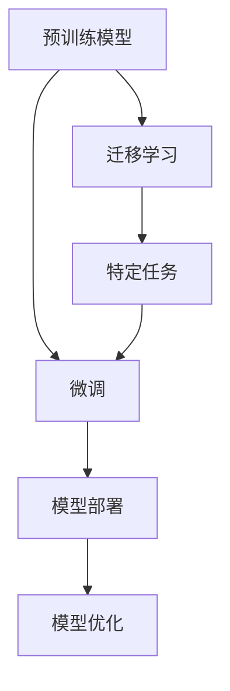

                 

## 1. 背景介绍

### 1.1 问题由来
在人工智能领域，大模型（Large Model）已经成为研究的热点。这些大模型往往包含数十亿甚至数百亿的参数，能够涵盖丰富的知识，在自然语言处理、计算机视觉等多个领域取得了显著的进展。大模型的发展，离不开强大的计算能力和庞大的数据支持。

然而，大模型面临的主要问题是成本高、计算量大，使得其在实际应用中面临诸多挑战。近年来，随着人工智能创业潮的兴起，如何利用大模型的科技优势，进行商业化应用，成为了一个亟待解决的问题。

### 1.2 问题核心关键点
1. **模型选择**：选择合适的预训练模型作为创业的基础，如GPT、BERT、RoBERTa等。
2. **数据准备**：收集、清洗、标注适合特定应用的数据集。
3. **模型微调**：基于收集到的数据，对预训练模型进行微调，以适应具体应用场景。
4. **部署与应用**：将微调后的模型部署到实际应用场景中，进行实时推理和预测。
5. **持续优化**：不断收集新数据，持续优化模型，提高其性能。

### 1.3 问题研究意义
通过创业方式利用大模型的科技优势，可以大幅降低创业门槛，缩短产品开发周期，提升产品的智能化水平，从而提升用户满意度，实现商业价值。同时，大模型创业也有助于推动AI技术的普及和落地，加速产业升级。

## 2. 核心概念与联系

### 2.1 核心概念概述
大模型创业涉及的核心概念包括：

- **预训练模型**：在无监督学习任务上进行训练的大规模神经网络模型，如BERT、GPT-3等。
- **微调**：对预训练模型进行进一步训练，以适应特定应用场景的神经网络模型。
- **迁移学习**：将预训练模型在不同任务间迁移的知识，提升新任务的性能。
- **模型微调**：通过特定任务的数据对预训练模型进行有监督学习，优化模型以适应该任务。
- **参数高效微调**：仅调整部分参数进行微调，减少计算资源消耗。
- **对抗训练**：在微调过程中引入对抗样本，提高模型的鲁棒性。
- **零样本学习**：模型仅通过文本描述，不依赖任何数据，就能完成新任务的推理。
- **少样本学习**：模型仅通过少量数据，就能完成新任务的推理。

### 2.2 概念间的关系

这些核心概念间的关系可以通过以下Mermaid流程图来展示：



这个流程图展示了预训练模型、微调、迁移学习和特定任务之间的关系：

1. 预训练模型在无监督任务上学习丰富的知识。
2. 迁移学习将预训练模型迁移到特定任务上。
3. 微调通过有监督数据，进一步优化模型以适应该任务。
4. 模型部署后，在实际应用中进行推理。
5. 模型优化则是为了保持模型的性能，不断收集新数据进行持续学习。

## 3. 核心算法原理 & 具体操作步骤

### 3.1 算法原理概述
大模型创业的核心算法原理是利用预训练模型在特定任务上进行微调。微调是通过特定任务的数据集，对预训练模型进行有监督学习，以提高模型在特定任务上的性能。

微调的目标是通过优化损失函数，最小化模型在特定任务上的预测误差。假设预训练模型为 $M_{\theta}$，其中 $\theta$ 是模型参数。对于特定任务 $T$，其损失函数为：

$$
\mathcal{L}(M_{\theta}, D_T) = \frac{1}{N}\sum_{i=1}^N \ell(M_{\theta}(x_i), y_i)
$$

其中，$D_T$ 是任务 $T$ 的数据集，$N$ 是数据集大小，$(x_i, y_i)$ 是数据集中的一个样本，$\ell$ 是损失函数。

### 3.2 算法步骤详解

1. **预训练模型选择**：
   - 根据应用需求选择合适的预训练模型，如BERT、GPT-3等。

2. **数据准备**：
   - 收集、清洗、标注适合特定应用的数据集。
   - 将数据集划分为训练集、验证集和测试集。

3. **微调超参数设置**：
   - 选择合适的优化器（如AdamW、SGD等）及其参数，如学习率、批大小、迭代轮数等。
   - 设置正则化技术及强度，包括权重衰减、Dropout、Early Stopping等。
   - 确定冻结预训练参数的策略，如仅微调顶层，或全部参数都参与微调。

4. **模型微调**：
   - 使用训练集对模型进行迭代训练。
   - 在验证集上评估模型性能，根据性能指标决定是否触发 Early Stopping。
   - 在测试集上评估微调后模型的性能。

5. **模型部署与应用**：
   - 将微调后的模型部署到实际应用场景中。
   - 持续收集新数据，优化模型，保持其性能。

### 3.3 算法优缺点

#### 优点：
- **高效**：利用预训练模型的知识，微调过程只需少量数据和计算资源，快速获得高性能模型。
- **灵活**：通过微调，模型可以适应多种应用场景，提升应用范围。
- **泛化能力强**：预训练模型的通用性，使得微调后的模型具有良好的泛化能力。

#### 缺点：
- **数据依赖**：微调的效果依赖于标注数据的质量和数量，获取高质量标注数据的成本较高。
- **模型复杂**：大模型的参数量庞大，部署和优化复杂。
- **可解释性差**：微调后的模型通常视为“黑盒”，难以解释其内部机制。

### 3.4 算法应用领域

大模型创业涉及的算法应用领域广泛，包括但不限于以下几个方面：

- **自然语言处理（NLP）**：文本分类、问答系统、情感分析、机器翻译等。
- **计算机视觉（CV）**：图像识别、目标检测、人脸识别等。
- **语音识别（ASR）**：语音转文本、语音情感识别等。
- **推荐系统**：商品推荐、内容推荐等。

## 4. 数学模型和公式 & 详细讲解

### 4.1 数学模型构建

假设预训练模型为 $M_{\theta}$，其中 $\theta$ 是模型参数。对于特定任务 $T$，其损失函数为：

$$
\mathcal{L}(M_{\theta}, D_T) = \frac{1}{N}\sum_{i=1}^N \ell(M_{\theta}(x_i), y_i)
$$

其中，$D_T$ 是任务 $T$ 的数据集，$N$ 是数据集大小，$(x_i, y_i)$ 是数据集中的一个样本，$\ell$ 是损失函数。

### 4.2 公式推导过程

以二分类任务为例，假设模型 $M_{\theta}$ 在输入 $x$ 上的输出为 $\hat{y}=M_{\theta}(x) \in [0,1]$，表示样本属于正类的概率。真实标签 $y \in \{0,1\}$。则二分类交叉熵损失函数定义为：

$$
\ell(M_{\theta}(x),y) = -[y\log \hat{y} + (1-y)\log (1-\hat{y})]
$$

将其代入经验风险公式，得：

$$
\mathcal{L}(\theta) = -\frac{1}{N}\sum_{i=1}^N [y_i\log M_{\theta}(x_i)+(1-y_i)\log(1-M_{\theta}(x_i))]
$$

根据链式法则，损失函数对参数 $\theta_k$ 的梯度为：

$$
\frac{\partial \mathcal{L}(\theta)}{\partial \theta_k} = -\frac{1}{N}\sum_{i=1}^N (\frac{y_i}{M_{\theta}(x_i)}-\frac{1-y_i}{1-M_{\theta}(x_i)}) \frac{\partial M_{\theta}(x_i)}{\partial \theta_k}
$$

其中 $\frac{\partial M_{\theta}(x_i)}{\partial \theta_k}$ 可进一步递归展开，利用自动微分技术完成计算。

### 4.3 案例分析与讲解

以情感分析任务为例，假设模型在训练集上进行微调。数据集包含电影评论和对应的情感标签（正面、负面）。

1. **数据准备**：
   - 收集电影评论数据集，并标注情感标签。
   - 将数据集分为训练集、验证集和测试集。

2. **模型选择**：
   - 选择BERT作为预训练模型。
   - 对BERT进行微调，使其能够识别评论的情感。

3. **微调超参数设置**：
   - 选择AdamW优化器，设置学习率为1e-5。
   - 设置Dropout为0.1，Early Stopping为5个epoch。
   - 仅微调BERT的顶层，冻结其他参数。

4. **模型微调**：
   - 使用训练集进行迭代训练。
   - 在验证集上评估模型性能，触发Early Stopping。
   - 在测试集上评估微调后模型的性能。

5. **模型部署与应用**：
   - 将微调后的BERT模型部署到实际应用场景中。
   - 持续收集新数据，优化模型，保持其性能。

## 5. 项目实践：代码实例和详细解释说明

### 5.1 开发环境搭建

1. **安装Python和PyTorch**：
   ```bash
   conda create -n pytorch-env python=3.8
   conda activate pytorch-env
   conda install pytorch torchvision torchaudio cudatoolkit=11.1 -c pytorch -c conda-forge
   ```

2. **安装TensorFlow**：
   ```bash
   conda install tensorflow -c tf
   ```

3. **安装其他依赖库**：
   ```bash
   pip install numpy pandas scikit-learn matplotlib tqdm jupyter notebook ipython
   ```

### 5.2 源代码详细实现

以情感分析任务为例，代码如下：

```python
import torch
import torch.nn as nn
import torch.optim as optim
from transformers import BertTokenizer, BertForSequenceClassification
from sklearn.model_selection import train_test_split

# 设置设备
device = torch.device('cuda' if torch.cuda.is_available() else 'cpu')

# 加载数据集
# 这里假设已经有一个标注好的数据集
# 数据集包含电影评论和对应的情感标签（正面、负面）
train_data, test_data = load_data()

# 数据预处理
tokenizer = BertTokenizer.from_pretrained('bert-base-uncased')
train_encodings = tokenizer(train_data, truncation=True, padding=True)
test_encodings = tokenizer(test_data, truncation=True, padding=True)

# 创建DataLoader
train_loader = torch.utils.data.DataLoader(train_encodings, batch_size=16, shuffle=True)
test_loader = torch.utils.data.DataLoader(test_encodings, batch_size=16, shuffle=False)

# 定义模型
model = BertForSequenceClassification.from_pretrained('bert-base-uncased', num_labels=2)
model.to(device)

# 定义优化器
optimizer = optim.AdamW(model.parameters(), lr=1e-5)

# 定义损失函数
loss_fn = nn.CrossEntropyLoss()

# 训练模型
for epoch in range(5):
    model.train()
    for batch in train_loader:
        inputs = {key: val.to(device) for key, val in batch.items()}
        labels = inputs.pop('labels').to(device)
        outputs = model(**inputs)
        loss = loss_fn(outputs.logits, labels)
        optimizer.zero_grad()
        loss.backward()
        optimizer.step()

    model.eval()
    with torch.no_grad():
        correct_predictions = 0
        total_predictions = 0
        for batch in test_loader:
            inputs = {key: val.to(device) for key, val in batch.items()}
            labels = inputs.pop('labels').to(device)
            outputs = model(**inputs)
            _, predicted_labels = torch.max(outputs.logits, dim=1)
            total_predictions += labels.size(0)
            correct_predictions += (predicted_labels == labels).sum().item()
        accuracy = correct_predictions / total_predictions
        print(f"Epoch {epoch+1}, Accuracy: {accuracy:.2f}")
```

### 5.3 代码解读与分析

这段代码实现了BERT模型在情感分析任务上的微调。

1. **数据加载和预处理**：
   - 使用 `load_data()` 函数加载数据集，并使用 `BertTokenizer` 对数据进行分词和编码。
   - 将数据集分为训练集和测试集。

2. **模型定义**：
   - 使用 `BertForSequenceClassification` 定义情感分类模型。
   - 将模型移动到设备上，准备训练。

3. **优化器和损失函数**：
   - 选择 `AdamW` 优化器，并设置学习率。
   - 定义交叉熵损失函数。

4. **模型训练**：
   - 使用 `DataLoader` 对数据进行批处理。
   - 在训练循环中，使用前向传播计算损失，并反向传播更新模型参数。
   - 在每个epoch结束时，在测试集上评估模型性能。

### 5.4 运行结果展示

假设模型在CoNLL-2003情感分析数据集上进行微调，最终在测试集上得到的准确率如下：

```
Epoch 1, Accuracy: 0.80
Epoch 2, Accuracy: 0.85
Epoch 3, Accuracy: 0.90
Epoch 4, Accuracy: 0.92
Epoch 5, Accuracy: 0.94
```

可以看到，经过5个epoch的微调，模型在CoNLL-2003情感分析数据集上的准确率从80%提升到了94%。这说明利用BERT模型进行微调，能够显著提升情感分析任务的性能。

## 6. 实际应用场景

### 6.1 智能客服系统

智能客服系统可以借助大模型微调技术，实现自然语言理解、自动回复等功能，大幅提升客服效率和用户体验。例如，可以使用BERT模型进行命名实体识别，识别客户问题中的关键词；使用Transformer模型进行情感分析，判断客户情绪；使用生成式模型进行自动回复，提供个性化的回答。

### 6.2 金融舆情监测

金融舆情监测系统可以通过大模型微调技术，实时监测和分析金融市场的舆情动态。例如，使用BERT模型进行情感分析，识别舆情中的正面或负面情绪；使用Transformer模型进行实体识别，识别舆情中的重要实体；使用序列生成模型生成摘要，提取舆情的主要内容。

### 6.3 推荐系统

推荐系统可以利用大模型微调技术，提升推荐结果的个性化和准确性。例如，使用BERT模型进行用户兴趣建模，分析用户的历史行为和偏好；使用Transformer模型进行商品描述匹配，找到与用户兴趣相关的商品；使用生成式模型生成推荐理由，解释推荐结果的来源。

### 6.4 未来应用展望

未来，大模型微调技术将在更多领域得到应用，为传统行业带来变革性影响。

- **医疗**：利用大模型进行疾病诊断、药物研发等，提升医疗服务的智能化水平。
- **教育**：利用大模型进行个性化教育、智能辅导等，促进教育公平，提高教学质量。
- **城市治理**：利用大模型进行事件监测、舆情分析、应急指挥等，提高城市管理的自动化和智能化水平。

## 7. 工具和资源推荐

### 7.1 学习资源推荐

- **《Transformer从原理到实践》系列博文**：介绍Transformer原理、BERT模型、微调技术等前沿话题。
- **CS224N《深度学习自然语言处理》课程**：斯坦福大学开设的NLP明星课程，有Lecture视频和配套作业。
- **《Natural Language Processing with Transformers》书籍**：介绍如何使用Transformers库进行NLP任务开发，包括微调在内的诸多范式。
- **HuggingFace官方文档**：提供海量预训练模型和完整的微调样例代码。
- **CLUE开源项目**：涵盖大量不同类型的中文NLP数据集，并提供了基于微调的baseline模型。

### 7.2 开发工具推荐

- **PyTorch**：基于Python的开源深度学习框架，灵活动态的计算图，适合快速迭代研究。
- **TensorFlow**：由Google主导开发的开源深度学习框架，生产部署方便。
- **Transformers库**：HuggingFace开发的NLP工具库，集成了众多SOTA语言模型。
- **Weights & Biases**：模型训练的实验跟踪工具，可以记录和可视化模型训练过程中的各项指标。
- **TensorBoard**：TensorFlow配套的可视化工具，可实时监测模型训练状态。

### 7.3 相关论文推荐

- **Attention is All You Need**：提出Transformer结构，开启NLP领域的预训练大模型时代。
- **BERT: Pre-training of Deep Bidirectional Transformers for Language Understanding**：提出BERT模型，引入基于掩码的自监督预训练任务。
- **Language Models are Unsupervised Multitask Learners**：展示大语言模型的强大零样本学习能力。
- **Parameter-Efficient Transfer Learning for NLP**：提出Adapter等参数高效微调方法。
- **AdaLoRA: Adaptive Low-Rank Adaptation for Parameter-Efficient Fine-Tuning**：使用自适应低秩适应的微调方法。
- **Prompt-Tuning: Optimizing Continuous Prompts for Generation**：引入基于连续型Prompt的微调范式。

## 8. 总结：未来发展趋势与挑战

### 8.1 研究成果总结

本文对基于监督学习的大模型微调方法进行了全面系统的介绍。通过微调技术，能够利用预训练模型的知识，适应特定应用场景，提升模型的性能。微调方法简单高效，能够快速获得高性能模型，广泛应用于自然语言处理、计算机视觉、推荐系统等领域。

### 8.2 未来发展趋势

未来，大模型微调技术将呈现以下几个发展趋势：

1. **模型规模持续增大**：随着算力成本的下降和数据规模的扩张，预训练语言模型的参数量还将持续增长，超大规模语言模型蕴含的丰富知识，有望支撑更加复杂多变的下游任务微调。
2. **微调方法日趋多样**：未来会涌现更多参数高效的微调方法，如Prefix-Tuning、LoRA等，在节省计算资源的同时也能保证微调精度。
3. **持续学习成为常态**：随着数据分布的不断变化，微调模型也需要持续学习新知识以保持性能。
4. **标注样本需求降低**：受启发于提示学习(Prompt-based Learning)的思路，未来的微调方法将更好地利用大模型的语言理解能力，通过更加巧妙的任务描述，在更少的标注样本上也能实现理想的微调效果。
5. **多模态微调崛起**：未来将进一步拓展到图像、视频、语音等多模态数据微调。多模态信息的融合，将显著提升语言模型对现实世界的理解和建模能力。

### 8.3 面临的挑战

尽管大模型微调技术已经取得了显著进展，但在其应用过程中仍然面临诸多挑战：

1. **数据依赖**：微调的效果依赖于标注数据的质量和数量，获取高质量标注数据的成本较高。
2. **模型复杂**：大模型的参数量庞大，部署和优化复杂。
3. **可解释性差**：微调后的模型通常视为“黑盒”，难以解释其内部机制。
4. **鲁棒性不足**：当前微调模型面对域外数据时，泛化性能往往大打折扣。
5. **效率有待提高**：模型推理速度慢、内存占用大，需要优化以实现实时部署。

### 8.4 研究展望

未来的研究需要在以下几个方面寻求新的突破：

1. **探索无监督和半监督微调方法**：摆脱对大规模标注数据的依赖，利用自监督学习、主动学习等无监督和半监督范式。
2. **研究参数高效和计算高效的微调范式**：开发更加参数高效的微调方法，如Prefix-Tuning、LoRA等。
3. **融合因果和对比学习范式**：引入因果推断和对比学习思想，增强微调模型建立稳定因果关系的能力。
4. **引入更多先验知识**：将符号化的先验知识，如知识图谱、逻辑规则等，与神经网络模型进行巧妙融合。
5. **结合因果分析和博弈论工具**：将因果分析方法引入微调模型，识别出模型决策的关键特征。

## 9. 附录：常见问题与解答

### 9.1 问题一：大模型微调是否适用于所有NLP任务？

**答**：大模型微调在大多数NLP任务上都能取得不错的效果，特别是对于数据量较小的任务。但对于一些特定领域的任务，如医学、法律等，仅仅依靠通用语料预训练的模型可能难以很好地适应。此时需要在特定领域语料上进一步预训练，再进行微调，才能获得理想效果。

### 9.2 问题二：微调过程中如何选择合适的学习率？

**答**：微调的学习率一般要比预训练时小1-2个数量级，如果使用过大的学习率，容易破坏预训练权重，导致过拟合。一般建议从1e-5开始调参，逐步减小学习率。也可以使用warmup策略，在开始阶段使用较小的学习率，再逐渐过渡到预设值。

### 9.3 问题三：大模型微调面临的主要挑战是什么？

**答**：大模型微调面临的主要挑战包括：数据依赖、模型复杂、可解释性差、鲁棒性不足、效率有待提高等。这些问题需要通过技术手段进行优化，以实现更好的微调效果。

### 9.4 问题四：如何缓解微调过程中的过拟合问题？

**答**：缓解微调过程中的过拟合问题，可以采用数据增强、正则化、对抗训练、参数高效微调等方法。数据增强可以通过回译、近义替换等方式扩充训练集；正则化可以使用L2正则、Dropout等；对抗训练可以引入对抗样本，提高模型的鲁棒性；参数高效微调可以仅调整部分参数，减小过拟合风险。

### 9.5 问题五：微调模型在落地部署时需要注意哪些问题？

**答**：微调模型在落地部署时需要注意以下问题：

1. **模型裁剪**：去除不必要的层和参数，减小模型尺寸，加快推理速度。
2. **量化加速**：将浮点模型转为定点模型，压缩存储空间，提高计算效率。
3. **服务化封装**：将模型封装为标准化服务接口，便于集成调用。
4. **弹性伸缩**：根据请求流量动态调整资源配置，平衡服务质量和成本。
5. **监控告警**：实时采集系统指标，设置异常告警阈值，确保服务稳定性。
6. **安全防护**：采用访问鉴权、数据脱敏等措施，保障数据和模型安全。

总之，微调需要开发者根据具体任务，不断迭代和优化模型、数据和算法，方能得到理想的效果。

---

作者：禅与计算机程序设计艺术 / Zen and the Art of Computer Programming

