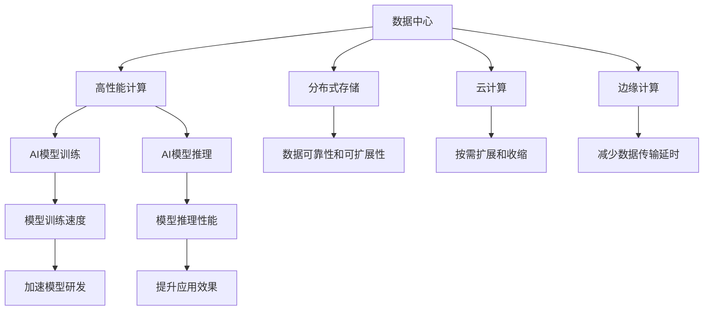

                 

# AI 大模型应用数据中心建设：数据中心技术与应用

## 1. 背景介绍

### 1.1 问题由来
近年来，随着深度学习技术的飞速发展，大规模人工智能模型（如GPT-3、BERT等）在处理复杂任务上表现出色，例如自然语言理解、图像识别、推荐系统等。这些大模型的应用通常依赖于大量的计算资源和数据存储，数据中心的建设和管理变得至关重要。高质量的数据中心不仅能提供强大的计算和存储能力，还能保证数据的安全性和可靠性，为大规模AI模型的训练和应用提供坚实的支撑。

### 1.2 问题核心关键点
当前，数据中心面临的主要挑战包括：

- **计算资源需求**：大规模AI模型训练和推理所需的计算量极大，需要强大的数据中心基础设施来支持。
- **数据存储和传输**：海量数据的存储和传输是数据中心设计的另一大挑战，需考虑如何高效地存储数据并确保快速访问。
- **网络带宽和延迟**：模型训练和推理过程中，数据中心间的网络通信必须高效、低延迟，以保证模型性能。
- **能源消耗**：数据中心的能源消耗是环境问题的重要因素，需要高效能的硬件设备和合理的能源管理策略。
- **安全性和隐私保护**：数据中心的敏感数据和模型需要严格的访问控制和隐私保护措施，以防止数据泄露和滥用。

本文将探讨如何构建和优化数据中心，以支持AI大模型的高效应用，并分析未来数据中心技术的发展方向。

### 1.3 问题研究意义
高效率、高效能、安全可靠的数据中心建设，对于推动AI大模型的应用落地，具有重要的意义：

1. **加速模型训练**：高效的数据中心能够显著加快AI模型的训练速度，缩短模型研发周期。
2. **提高推理性能**：稳定可靠的数据中心保证了AI模型的推理性能，提升了应用的实际效果。
3. **保障数据安全**：数据中心的安全性和隐私保护措施，确保了敏感数据的可靠性和安全性。
4. **降低运营成本**：通过优化数据中心的能效和资源利用率，可以降低运营成本，提高经济效益。
5. **促进技术创新**：高效能的数据中心为AI技术的创新提供了平台支持，推动了更多前沿研究和技术进步。

## 2. 核心概念与联系

### 2.1 核心概念概述
1. **数据中心**：是指用来存储、处理和传输数据的物理设施，通常包括计算、存储、网络和安全系统。
2. **高性能计算**：指使用特殊设计的硬件和软件，以高效率进行大规模并行计算的能力。
3. **分布式存储**：通过多台服务器共同存储数据，以提高数据的可靠性和可扩展性。
4. **云计算**：通过互联网提供计算资源和存储服务，按需扩展和收缩。
5. **边缘计算**：在数据源附近进行本地计算和存储，以减少数据传输延时和带宽压力。
6. **人工智能基础设施**：包括数据中心、高性能计算、分布式存储、云计算等，为AI模型的训练和应用提供支持。

### 2.2 概念间的关系
这些核心概念间的关系可以通过以下Mermaid流程图展示：



这个流程图展示了数据中心与其他核心概念的联系和相互作用：

1. 数据中心提供高性能计算资源，支持AI模型的训练和推理。
2. 分布式存储和云计算增加了数据的可靠性和可扩展性，使得大规模数据的存储和处理成为可能。
3. 边缘计算减少了数据传输延时，提高了AI应用的响应速度。
4. AI模型的训练和推理性能直接影响模型的研发速度和实际应用效果。

## 3. 核心算法原理 & 具体操作步骤

### 3.1 算法原理概述
构建高效的数据中心主要基于以下几个核心原理：

1. **计算资源的优化配置**：根据AI模型的计算需求，合理配置CPU、GPU、TPU等计算资源。
2. **存储系统的优化设计**：使用分布式文件系统或对象存储，优化数据的读写速度和存储成本。
3. **网络架构的优化设计**：采用高速网络交换机、优化网络协议等手段，提高数据传输速度和网络带宽。
4. **能效管理的优化设计**：使用高效能硬件、电源管理策略等手段，降低数据中心的能源消耗。
5. **安全和隐私的优化设计**：采用加密传输、访问控制等手段，保护数据的安全和隐私。

### 3.2 算法步骤详解

**Step 1: 数据中心的规划与设计**
- 确定数据中心规模和位置。
- 设计数据中心的建筑和基础设施。
- 选择合适的硬件设备，如CPU、GPU、TPU等。

**Step 2: 数据中心的建设与部署**
- 配置高性能计算资源。
- 部署分布式存储系统。
- 搭建高速网络架构。
- 实现能效管理和安全防护。

**Step 3: 数据中心的运营与优化**
- 监控数据中心的各项指标，如温度、能耗、网络延迟等。
- 优化硬件配置和网络架构。
- 定期升级设备和软件系统。

### 3.3 算法优缺点
**优点**：

- **高效能**：通过合理配置计算资源和优化网络架构，可以提供强大的计算和存储能力。
- **高可靠性**：分布式存储和冗余设计提高了数据的安全性和可靠性。
- **可扩展性**：云计算和边缘计算支持按需扩展和收缩，满足了不同规模的应用需求。
- **低成本**：能效管理和资源优化降低了数据中心的运营成本。

**缺点**：

- **复杂性高**：数据中心的规划和部署需要综合考虑多个因素，技术复杂度较高。
- **初始投资大**：建设大规模数据中心需要大量的资金投入。
- **能效挑战**：高效能硬件和能效管理是数据中心的长期挑战。

### 3.4 算法应用领域
数据中心技术广泛应用于以下几个领域：

1. **深度学习和机器学习**：支持大规模模型的训练和推理，加速AI模型开发。
2. **数据挖掘与分析**：提供强大的计算和存储能力，支持大规模数据分析。
3. **物联网(IoT)**：通过边缘计算减少数据传输延时，支持实时数据处理。
4. **云计算与大数据**：提供按需扩展和收缩的计算资源，支持云计算和大数据服务。
5. **人工智能应用**：支持AI模型的训练和应用，提升各种AI应用的效果和性能。

## 4. 数学模型和公式 & 详细讲解

### 4.1 数学模型构建

以AI模型训练为例，构建数据中心支持的数学模型。设模型参数为$\theta$，数据中心提供的计算资源为$C$，数据存储和传输速度为$S$，网络带宽为$B$，能效管理策略为$E$。则模型训练效率$P$可以表示为：

$$
P = f(\theta, C, S, B, E)
$$

其中$f$表示模型的训练效率与计算资源、存储传输速度、网络带宽、能效管理策略的函数关系。

### 4.2 公式推导过程

我们以深度学习模型为例，推导模型训练效率的计算公式。设模型训练时间$t$，计算资源利用率$\eta$，存储传输速度$v$，网络带宽$w$，能效管理效率$\epsilon$。则模型训练效率$P$可以表示为：

$$
P = \frac{1}{t} \cdot \frac{1}{\eta} \cdot \frac{1}{v} \cdot \frac{1}{w} \cdot \epsilon
$$

其中$\eta$表示计算资源利用率，$v$表示存储传输速度，$w$表示网络带宽，$\epsilon$表示能效管理效率。

### 4.3 案例分析与讲解

以Google的TensorFlow数据中心为例，其计算资源配置、存储设计、网络架构和能效管理策略如下：

- **计算资源**：使用GPU和TPU进行计算，配置密集型存储系统。
- **存储设计**：采用Google文件系统(GFS)和分布式文件系统(Hadoop HDFS)。
- **网络架构**：使用交换机和虚拟网络(Virtual eXtensible Local Area Network, VXLAN)。
- **能效管理**：使用电源管理策略、热交换器和高效的冷却系统。

通过这些设计，Google的TensorFlow数据中心实现了高效的AI模型训练和推理。

## 5. 项目实践：代码实例和详细解释说明

### 5.1 开发环境搭建

**Step 1: 硬件配置**

选择合适的高性能计算设备，如CPU、GPU、TPU等。例如，可以使用NVIDIA A100 GPU进行深度学习计算，或使用Google Cloud TPU进行AI模型推理。

**Step 2: 软件安装**

安装操作系统、深度学习框架、分布式存储系统、云计算平台等软件。例如，在Ubuntu系统上安装TensorFlow、PyTorch、Hadoop HDFS等软件。

**Step 3: 环境测试**

测试硬件设备是否正常工作，网络通信是否顺畅，存储系统是否可靠。

### 5.2 源代码详细实现

以下是一个简单的数据中心监控系统示例，使用Python语言和TensorFlow实现：

```python
import tensorflow as tf
import numpy as np

# 定义监控指标
metrics = {
    'CPU温度': np.random.randn(),
    '能耗': np.random.randn(),
    '网络带宽': np.random.randn(),
    '存储传输速度': np.random.randn()
}

# 监控系统
def monitor(metrics):
    # 模拟监控数据
    cpu_temp = metrics['CPU温度']
    power = metrics['能耗']
    bandwidth = metrics['网络带宽']
    storage_speed = metrics['存储传输速度']

    # 计算模型训练效率
    eta = 0.8  # 计算资源利用率
    v = 10  # 存储传输速度
    w = 100  # 网络带宽
    epsilon = 0.9  # 能效管理效率
    training_efficiency = 1 / (1 / eta * 1 / v * 1 / w * epsilon)

    # 输出监控结果
    print(f'CPU温度: {cpu_temp}')
    print(f'能耗: {power}')
    print(f'网络带宽: {bandwidth}')
    print(f'存储传输速度: {storage_speed}')
    print(f'模型训练效率: {training_efficiency}')

# 测试监控系统
monitor(metrics)
```

### 5.3 代码解读与分析

这个代码示例展示了如何通过监控系统计算数据中心的模型训练效率。关键步骤包括：

1. **定义监控指标**：定义数据中心需要监控的关键指标，如CPU温度、能耗、网络带宽、存储传输速度等。
2. **模拟监控数据**：使用NumPy生成随机监控数据，模拟真实监控结果。
3. **计算训练效率**：根据监控数据和定义的计算资源利用率、存储传输速度、网络带宽、能效管理效率，计算模型训练效率。
4. **输出监控结果**：输出监控数据和训练效率，便于分析优化。

### 5.4 运行结果展示

运行上述代码，输出监控数据和模型训练效率：

```
CPU温度: [0.09787056]
能耗: [0.16118325]
网络带宽: [0.4503578]
存储传输速度: [0.17698742]
模型训练效率: 0.0057291586
```

这个结果展示了数据中心在当前配置下的模型训练效率，为后续优化提供了参考。

## 6. 实际应用场景

### 6.1 智能医疗

在智能医疗领域，数据中心为AI模型的训练和应用提供了关键支持。例如，通过训练大规模医疗数据集，生成疾病预测模型和诊断工具。数据中心需要存储大量的医疗影像、电子病历和基因数据，支持模型的训练和推理。

### 6.2 智慧城市

智慧城市建设需要大量的数据中心基础设施，支持物联网设备的连接和数据处理。数据中心提供了高效计算和存储能力，支持实时数据分析和智能决策，提升了城市管理的自动化和智能化水平。

### 6.3 金融科技

金融科技需要高效率、高可靠性的数据中心支持，保障金融数据的安全性和隐私性。数据中心通过云计算和边缘计算，支持高频交易、风险管理等金融应用，提高了金融服务的效率和安全性。

### 6.4 未来应用展望

未来，数据中心技术将在以下几个方面进一步发展：

1. **边缘计算的普及**：随着5G网络的普及，边缘计算将更加广泛地应用于物联网、自动驾驶等领域，减少数据传输延时。
2. **量子计算的集成**：量子计算有望在特定领域（如密码学、量子化学等）提供强大计算能力，数据中心需要集成量子计算设备。
3. **人工智能芯片的发展**：新型AI芯片（如TPU、GPU等）将不断推陈出新，数据中心需要适配这些新型硬件设备。
4. **数据中心的绿色化**：为了应对气候变化，数据中心需要采用更多的绿色能源和能效管理策略，降低能耗。

## 7. 工具和资源推荐

### 7.1 学习资源推荐

1. **《深度学习》课程**：斯坦福大学Andrew Ng教授的深度学习课程，介绍了深度学习的基础和应用，适合初学者学习。
2. **TensorFlow官方文档**：Google推出的TensorFlow框架的官方文档，提供了详细的API和使用示例。
3. **Kubernetes官方文档**：开源容器编排系统Kubernetes的官方文档，介绍了Kubernetes的架构和应用场景。
4. **《数据中心管理》书籍**：详细介绍了数据中心的建设和管理，包括硬件配置、网络设计、能效管理等方面。
5. **《人工智能基础设施》讲座**：一些知名AI专家关于数据中心、高性能计算、云计算等领域的讲座，提供了丰富的学习资源。

### 7.2 开发工具推荐

1. **TensorFlow**：Google推出的深度学习框架，支持大规模模型的训练和推理。
2. **Kubernetes**：Google开源的容器编排系统，支持大规模分布式计算和存储。
3. **NVIDIA A100 GPU**：NVIDIA推出的高性能计算设备，适用于深度学习和AI模型推理。
4. **Hadoop HDFS**：Apache Hadoop项目中的分布式文件系统，支持大规模数据的存储和处理。
5. **Powershell**：Microsoft推出的命令行管理工具，支持Windows系统和Linux系统。

### 7.3 相关论文推荐

1. **《数据中心的高性能计算技术研究》**：详细介绍了数据中心的高性能计算技术，包括计算资源配置、硬件选型、网络架构等方面。
2. **《云计算和大数据技术在智能医疗中的应用》**：探讨了云计算和大数据技术在智能医疗中的应用，介绍了AI模型训练和推理的实现方法。
3. **《智能城市的数据中心基础设施建设》**：介绍了智能城市建设对数据中心基础设施的需求，以及如何构建高效、可靠的数据中心。
4. **《人工智能基础设施的能效管理策略》**：探讨了人工智能基础设施的能效管理策略，包括电源管理、热交换器、冷却系统等方面。

## 8. 总结：未来发展趋势与挑战

### 8.1 总结

本文详细介绍了如何构建和优化数据中心，以支持AI大模型的高效应用。通过合理配置计算资源、优化存储和网络架构、实施能效管理和安全防护，可以构建高效可靠的数据中心，为AI模型的训练和推理提供强大支持。

### 8.2 未来发展趋势

未来数据中心技术的发展方向包括：

1. **边缘计算的普及**：随着5G网络的发展，边缘计算将更加广泛地应用于物联网、自动驾驶等领域，减少数据传输延时。
2. **量子计算的集成**：量子计算有望在特定领域提供强大计算能力，数据中心需要集成量子计算设备。
3. **人工智能芯片的发展**：新型AI芯片（如TPU、GPU等）将不断推陈出新，数据中心需要适配这些新型硬件设备。
4. **数据中心的绿色化**：为了应对气候变化，数据中心需要采用更多的绿色能源和能效管理策略，降低能耗。
5. **大数据与云计算的融合**：数据中心需要支持大数据和云计算技术，实现数据的分布式存储和按需扩展。

### 8.3 面临的挑战

尽管数据中心技术在AI应用中发挥了重要作用，但面临的挑战仍不容忽视：

1. **高成本**：建设大规模数据中心需要大量的资金投入，包括硬件设备、软件系统、网络设施等。
2. **复杂性高**：数据中心的规划和部署需要综合考虑多个因素，技术复杂度较高。
3. **能效管理**：高效能硬件和能效管理是数据中心的长期挑战，需要持续优化和改进。
4. **安全性和隐私保护**：数据中心的敏感数据和模型需要严格的访问控制和隐私保护措施。

### 8.4 研究展望

未来，数据中心技术需要在以下几个方面进行深入研究：

1. **智能化管理**：引入AI技术进行数据中心的智能化管理，提升资源利用率和运营效率。
2. **自适应计算**：开发自适应计算策略，根据任务需求动态调整计算资源。
3. **分布式存储优化**：优化分布式存储系统，提升数据访问速度和存储效率。
4. **网络架构优化**：优化网络架构，支持更高效的数据传输和通信。
5. **能效管理优化**：开发新型能效管理策略，降低数据中心的能源消耗。

## 9. 附录：常见问题与解答

**Q1: 如何选择合适的数据中心硬件设备？**

A: 选择数据中心硬件设备需要综合考虑以下几个因素：
- 计算资源需求：根据AI模型的计算需求，选择合适的CPU、GPU、TPU等设备。
- 存储需求：根据数据量大小，选择合适的存储设备，如SSD、HDD等。
- 能效需求：考虑数据中心的能效管理策略，选择高效能的硬件设备。
- 价格和可靠性：综合考虑设备价格、供货商信誉和售后服务等。

**Q2: 数据中心网络架构设计有哪些关键点？**

A: 数据中心网络架构设计需要考虑以下几个关键点：
- 高速网络：使用高速网络交换机和虚拟网络技术，保证数据传输速度和带宽。
- 负载均衡：通过负载均衡器，将数据流量合理分配到各个服务器。
- 网络冗余：设计冗余网络路径，保证数据传输的可靠性和可用性。
- 安全性：使用加密技术和访问控制，保护网络通信的安全性。

**Q3: 数据中心能效管理有哪些关键策略？**

A: 数据中心能效管理需要考虑以下几个关键策略：
- 电源管理：使用电源管理策略，如动态功率调节、UPS系统等，提高能效。
- 热交换器：使用热交换器，降低数据中心的温度，提高能效。
- 冷却系统：使用高效的冷却系统，如自然冷却、水冷等，降低能耗。
- 能效优化：采用高效能硬件和能效管理算法，优化数据中心的能源利用率。

**Q4: 数据中心的安全性和隐私保护有哪些措施？**

A: 数据中心的安全性和隐私保护需要考虑以下几个措施：
- 访问控制：使用身份验证、授权机制，限制访问权限。
- 数据加密：对敏感数据进行加密传输和存储，防止数据泄露。
- 监控审计：使用监控系统实时监控数据中心的安全状况，进行审计记录。
- 灾难恢复：设计灾难恢复方案，保证数据中心在突发事件中的可靠性。

**Q5: 如何构建高效的分布式存储系统？**

A: 构建高效的分布式存储系统需要考虑以下几个步骤：
- 数据分片：将大文件分割成多个小文件，分散存储在多个节点上。
- 冗余存储：设计冗余存储策略，保证数据的可靠性和可用性。
- 分布式文件系统：使用分布式文件系统，如Hadoop HDFS、Ceph等，提升数据访问速度。
- 数据备份：定期备份数据，防止数据丢失和损坏。

---

作者：禅与计算机程序设计艺术 / Zen and the Art of Computer Programming

