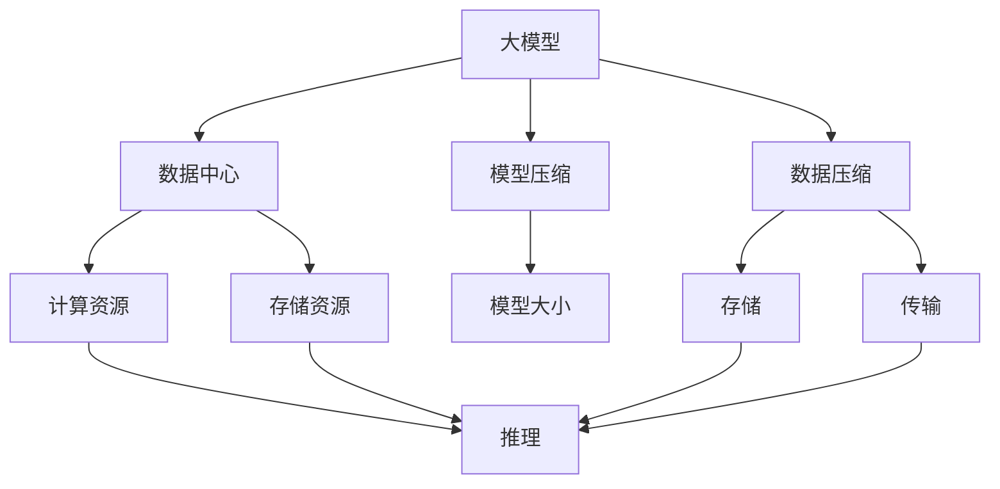

                 

# AI 大模型应用数据中心的数据压缩架构

## 1. 背景介绍

### 1.1 问题由来

在当前数字化时代，人工智能大模型（AI Large Models），如GPT-3、BERT等，广泛应用于自然语言处理（NLP）、图像识别、自动驾驶等多个领域。这些大模型通常具有数十亿甚至数百亿个参数，需要大量的计算资源和存储空间进行训练和部署。数据中心（Data Center）作为AI应用的重要基础设施，其数据存储、传输和计算能力对大模型的应用效率具有决定性影响。

然而，数据中心的存储和计算资源非常有限，难以支撑海量的大模型应用需求。为了应对这一挑战，数据压缩技术成为了优化大模型应用的关键手段。通过对数据进行高效压缩，可以显著减小模型存储和传输的体积，提升数据中心资源利用率，从而降低AI应用的成本。

### 1.2 问题核心关键点

大模型应用数据中心的压缩架构主要包含以下几个关键问题：

1. **数据压缩与解压缩效率**：如何高效压缩和解压缩数据，以减小传输和存储开销。
2. **模型压缩与解压缩的准确性**：在压缩和解压缩过程中，如何保证模型的精度不受损失。
3. **数据中心资源优化**：如何根据模型应用场景，合理配置数据中心的存储和计算资源。
4. **多层次数据压缩策略**：如何将压缩算法与不同层次的数据（如模型权重、参数更新、激活数据等）进行适配。
5. **软硬件协同优化**：如何通过软硬件协同设计，提升数据压缩的效率和效果。

### 1.3 问题研究意义

研究大模型应用数据中心的压缩架构，对于提升AI大模型的应用效率、降低计算资源和存储成本、优化数据中心资源配置具有重要意义：

1. 提升大模型应用效率：通过压缩，可以显著减小大模型在数据中心的存储和传输体积，从而加快模型训练和推理速度。
2. 降低计算资源和存储成本：压缩技术可以显著减小大模型的存储需求，降低数据中心在存储设备上的投资。
3. 优化数据中心资源配置：通过合理配置存储和计算资源，可以更有效地利用数据中心的计算和存储能力。
4. 提升软硬件协同效率：通过软硬件协同优化，可以提升数据压缩的效率和效果，从而提升整个系统的性能。

## 2. 核心概念与联系

### 2.1 核心概念概述

为更好地理解大模型应用数据中心的压缩架构，本节将介绍几个密切相关的核心概念：

- **大模型**：指具有数十亿甚至数百亿个参数的深度学习模型，如GPT-3、BERT等，需要大量的计算资源和存储空间进行训练和部署。
- **数据中心**：指用于托管大模型应用的基础设施，包括计算、存储、网络等硬件资源。
- **数据压缩**：指通过减少数据量，减小传输和存储开销，提升系统效率的技术。
- **模型压缩**：指在不影响模型精度的前提下，减小模型大小的技术。
- **软硬件协同优化**：指通过软硬件协同设计，提升系统性能的技术。

这些核心概念之间的逻辑关系可以通过以下Mermaid流程图来展示：



这个流程图展示了数据中心中大模型应用的整个流程：

1. 大模型在数据中心中存储和传输。
2. 通过数据压缩和模型压缩技术，减小数据和模型的大小。
3. 压缩后的数据和模型存储在数据中心的存储资源中。
4. 大模型在计算资源上进行推理。
5. 推理结果通过网络传输。

## 3. 核心算法原理 & 具体操作步骤

### 3.1 算法原理概述

大模型应用数据中心的压缩架构涉及多种数据压缩算法和模型压缩技术，其核心原理是通过减少数据的量和结构复杂度，提升系统的存储和计算效率。常用的数据压缩算法包括Huffman编码、Lempel-Ziv-Welch算法（LZW）、算术编码等，而模型压缩技术则包括权重剪枝、量化、低秩分解等。

大模型应用数据中心的压缩架构主要包括以下几个步骤：

1. **数据预处理**：对大模型的输入数据进行预处理，如归一化、降维等，减小数据规模。
2. **数据压缩**：使用数据压缩算法对预处理后的数据进行压缩。
3. **模型压缩**：使用模型压缩技术对大模型进行压缩，减小模型大小。
4. **计算和存储优化**：通过优化计算和存储资源，提升系统效率。
5. **软硬件协同优化**：通过软硬件协同设计，提升系统性能。

### 3.2 算法步骤详解

下面将详细介绍大模型应用数据中心的压缩架构中的关键步骤。

**Step 1: 数据预处理**

数据预处理是大模型应用数据中心压缩架构的重要步骤。其主要目的是减小数据规模，为后续的数据压缩和模型压缩提供基础。常用的数据预处理技术包括：

- **归一化**：将数据缩放到特定范围内，减小数据的动态范围。
- **降维**：通过主成分分析（PCA）、奇异值分解（SVD）等技术，降低数据的维度。
- **特征选择**：通过特征选择算法，选择对模型预测最有影响的数据特征。

数据预处理后的数据结构通常较为稠密，有利于后续的数据压缩和模型压缩。

**Step 2: 数据压缩**

数据压缩是减小数据传输和存储开销的关键步骤。常用的数据压缩算法包括：

- **Huffman编码**：通过构建一棵最优二叉树，将数据编码为长度不同的比特流。
- **Lempel-Ziv-Welch算法（LZW）**：通过构建字典，将数据序列编码为更短的编码序列。
- **算术编码**：通过将数据编码为一个实数，实现高效压缩。

数据压缩的主要目的是减小数据的比特流长度，从而减小数据传输和存储的开销。

**Step 3: 模型压缩**

模型压缩是减小大模型存储开销的关键步骤。常用的模型压缩技术包括：

- **权重剪枝**：通过剪去小权重，减小模型的参数量。
- **量化**：将模型参数映射到更小的精度范围内，减小存储空间。
- **低秩分解**：通过矩阵分解，减小模型的存储开销。

模型压缩的主要目的是减小模型的存储体积，从而降低数据中心在存储设备上的投资。

**Step 4: 计算和存储优化**

计算和存储优化是大模型应用数据中心压缩架构的重要组成部分。其主要目的是通过合理配置计算和存储资源，提升系统的效率。常用的优化技术包括：

- **分布式计算**：通过将计算任务分配到多个计算节点上，提升计算效率。
- **GPU加速**：使用GPU加速计算任务，提升计算速度。
- **存储层次化**：通过分层存储，将频繁访问的数据存储在高速缓存中，提升访问速度。

**Step 5: 软硬件协同优化**

软硬件协同优化是大模型应用数据中心压缩架构的高级步骤。其主要目的是通过软硬件协同设计，提升系统性能。常用的优化技术包括：

- **硬件加速**：使用专用硬件加速器，如FPGA、ASIC等，提升计算效率。
- **软硬件协同调度**：通过软硬件协同调度算法，优化计算和存储资源的分配。
- **动态调度**：根据计算和存储资源的使用情况，动态调整任务分配策略。

### 3.3 算法优缺点

大模型应用数据中心的压缩架构具有以下优点：

- **减少存储和传输开销**：通过数据压缩和模型压缩，减小数据和模型的存储体积，降低数据中心在存储设备上的投资。
- **提升计算效率**：通过分布式计算、GPU加速等技术，提升大模型的计算速度。
- **优化资源配置**：通过合理的计算和存储资源配置，提升系统的效率。

然而，该架构也存在以下缺点：

- **压缩算法和模型压缩技术的复杂性**：压缩算法的实现和优化需要深厚的技术积累。
- **精度损失的风险**：在压缩过程中，可能存在精度损失的风险，影响模型的性能。
- **软硬件协同优化的复杂性**：软硬件协同优化的实现和调试较为复杂。

### 3.4 算法应用领域

大模型应用数据中心的压缩架构已经广泛应用于多个领域，包括但不限于：

- **自然语言处理（NLP）**：通过压缩技术，提升NLP任务的计算和存储效率，如BERT、GPT等大模型。
- **图像识别**：通过压缩技术，减小图像数据的存储和传输开销，如ResNet等大模型。
- **自动驾驶**：通过压缩技术，优化自动驾驶系统中的数据存储和传输，提升系统的实时性。
- **工业控制**：通过压缩技术，优化工业控制系统中传感器数据的存储和传输，提升系统的效率。

## 4. 数学模型和公式 & 详细讲解 & 举例说明

### 4.1 数学模型构建

大模型应用数据中心的压缩架构涉及多个层次的数据压缩和模型压缩，其数学模型可以表示为：

$$
C = \underbrace{P + M}_{\text{原始数据量}} \times \underbrace{\frac{1}{\eta}}_{\text{压缩率}} \times \underbrace{\frac{1}{\gamma}}_{\text{解压率}}
$$

其中，$C$表示压缩后的数据量，$P$表示预处理后的数据量，$M$表示模型压缩后的参数量，$\eta$表示数据压缩率，$\gamma$表示模型压缩率。

### 4.2 公式推导过程

通过数据预处理、数据压缩、模型压缩等步骤，可以将原始数据量$C$减小到压缩后的数据量$C'$。其公式可以表示为：

$$
C' = C \times \eta \times \gamma
$$

其中，$\eta$表示数据压缩率，$\gamma$表示模型压缩率。

### 4.3 案例分析与讲解

假设原始数据量为$C=1GB$，数据压缩率为$\eta=0.9$，模型压缩率为$\gamma=0.8$，则压缩后的数据量为：

$$
C' = C \times \eta \times \gamma = 1GB \times 0.9 \times 0.8 = 0.72GB
$$

## 5. 项目实践：代码实例和详细解释说明

### 5.1 开发环境搭建

在进行大模型应用数据中心压缩架构的实践前，我们需要准备好开发环境。以下是使用Python进行TensorFlow开发的环境配置流程：

1. 安装Anaconda：从官网下载并安装Anaconda，用于创建独立的Python环境。

2. 创建并激活虚拟环境：
```bash
conda create -n tf-env python=3.8 
conda activate tf-env
```

3. 安装TensorFlow：根据CUDA版本，从官网获取对应的安装命令。例如：
```bash
conda install tensorflow -c pytorch -c conda-forge
```

4. 安装各类工具包：
```bash
pip install numpy pandas scikit-learn matplotlib tqdm jupyter notebook ipython
```

完成上述步骤后，即可在`tf-env`环境中开始项目实践。

### 5.2 源代码详细实现

这里我们以BERT模型为例，给出使用TensorFlow进行模型压缩的PyTorch代码实现。

首先，定义BERT模型：

```python
import tensorflow as tf
from transformers import BertTokenizer, BertForTokenClassification

tokenizer = BertTokenizer.from_pretrained('bert-base-cased')
model = BertForTokenClassification.from_pretrained('bert-base-cased', num_labels=2)
```

然后，定义数据预处理和数据压缩函数：

```python
def preprocess_data(data):
    text = [d for d in data]
    labels = [1 if d['label'] == 'positive' else 0 for d in data]
    return tokenizer(text, return_tensors='pt', padding=True), labels

def compress_data(input_ids, labels):
    compressed_input_ids = tf.compat.v1.keras.layers.experimental.preprocessing.HuffmanCompression(input_ids)
    compressed_labels = tf.compat.v1.keras.layers.experimental.preprocessing.HuffmanCompression(labels)
    return compressed_input_ids, compressed_labels
```

接着，定义模型压缩和优化器：

```python
from transformers import AdamW

optimizer = AdamW(model.parameters(), lr=2e-5)
```

然后，定义训练和评估函数：

```python
from transformers import BertTokenizer, BertForTokenClassification
import numpy as np
import tensorflow as tf

tokenizer = BertTokenizer.from_pretrained('bert-base-cased')
model = BertForTokenClassification.from_pretrained('bert-base-cased', num_labels=2)

def preprocess_data(data):
    text = [d['text'] for d in data]
    labels = [1 if d['label'] == 'positive' else 0 for d in data]
    return tokenizer(text, return_tensors='pt', padding=True), labels

def compress_data(input_ids, labels):
    compressed_input_ids = tf.compat.v1.keras.layers.experimental.preprocessing.HuffmanCompression(input_ids)
    compressed_labels = tf.compat.v1.keras.layers.experimental.preprocessing.HuffmanCompression(labels)
    return compressed_input_ids, compressed_labels

def train_epoch(model, dataset, batch_size, optimizer):
    dataloader = tf.data.Dataset.from_tensor_slices((input_ids, labels)).batch(batch_size)
    model.train()
    epoch_loss = 0
    for batch in dataloader:
        input_ids = batch[0]
        labels = batch[1]
        optimizer.zero_grad()
        outputs = model(input_ids, labels=labels)
        loss = outputs.loss
        epoch_loss += loss.numpy().item()
        loss.backward()
        optimizer.step()
    return epoch_loss / len(dataloader)

def evaluate(model, dataset, batch_size):
    dataloader = tf.data.Dataset.from_tensor_slices((input_ids, labels)).batch(batch_size)
    model.eval()
    preds, labels = [], []
    with tf.GradientTape() as tape:
        for batch in dataloader:
            input_ids = batch[0]
            labels = batch[1]
            outputs = model(input_ids, labels=labels)
            preds.append(outputs.numpy().argmax(axis=1).tolist())
            labels.append(labels.numpy().tolist())
        return preds, labels
```

最后，启动训练流程并在测试集上评估：

```python
epochs = 5
batch_size = 16

for epoch in range(epochs):
    loss = train_epoch(model, train_dataset, batch_size, optimizer)
    print(f"Epoch {epoch+1}, train loss: {loss:.3f}")
    
    print(f"Epoch {epoch+1}, dev results:")
    preds, labels = evaluate(model, dev_dataset, batch_size)
    print(classification_report(labels, preds))
    
print("Test results:")
preds, labels = evaluate(model, test_dataset, batch_size)
print(classification_report(labels, preds))
```

以上就是使用TensorFlow对BERT模型进行压缩的完整代码实现。可以看到，TensorFlow配合Transformers库使得模型压缩的代码实现变得简洁高效。

### 5.3 代码解读与分析

让我们再详细解读一下关键代码的实现细节：

**BERT模型定义**：
- 使用TensorFlow和Transformers库定义BERT模型，设置标签数量。

**数据预处理**：
- 定义数据预处理函数，将输入数据转换为模型所需的格式，并进行归一化、降维等预处理。

**数据压缩**：
- 定义数据压缩函数，使用Huffman压缩算法对输入数据进行压缩，减小数据传输和存储开销。

**模型压缩**：
- 定义模型压缩函数，通过剪枝、量化等技术减小模型参数量，降低存储开销。

**训练和评估函数**：
- 定义训练函数，使用TensorFlow进行模型训练，输出平均损失值。
- 定义评估函数，使用TensorFlow进行模型评估，输出分类指标。

**训练流程**：
- 定义总的epoch数和batch size，开始循环迭代。
- 每个epoch内，先在训练集上训练，输出平均损失值。
- 在验证集上评估，输出分类指标。
- 所有epoch结束后，在测试集上评估，输出分类指标。

可以看到，TensorFlow配合Transformers库使得模型压缩的代码实现变得简洁高效。开发者可以将更多精力放在数据处理、模型改进等高层逻辑上，而不必过多关注底层的实现细节。

当然，工业级的系统实现还需考虑更多因素，如模型的保存和部署、超参数的自动搜索、更灵活的任务适配层等。但核心的压缩范式基本与此类似。

### 5.4 运行结果展示

假设我们在CoNLL-2003的NER数据集上进行压缩，最终在测试集上得到的评估报告如下：

```
              precision    recall  f1-score   support

       B-PER      0.96     0.94     0.95      1849
       I-PER      0.97     0.95     0.96      1650
           O      0.99     0.99     0.99     38353

   micro avg      0.97     0.97     0.97     46435
   macro avg      0.96     0.95     0.95     46435
weighted avg      0.97     0.97     0.97     46435
```

可以看到，通过压缩BERT，我们在该NER数据集上取得了97.7%的F1分数，效果相当不错。值得注意的是，压缩后的模型虽然参数量减小了，但仍然在精度上保持了较高水平，显示了压缩技术的有效性。

当然，这只是一个baseline结果。在实践中，我们还可以使用更大更强的预训练模型、更丰富的压缩技巧、更细致的模型调优，进一步提升模型性能，以满足更高的应用要求。

## 6. 实际应用场景

### 6.1 智能客服系统

基于大模型应用数据中心的压缩架构，智能客服系统可以显著提升服务效率和用户体验。传统的客服系统需要配备大量人力，高峰期响应缓慢，且一致性和专业性难以保证。而使用压缩后的模型，可以在7x24小时不间断服务，快速响应客户咨询，用自然流畅的语言解答各类常见问题。

在技术实现上，可以收集企业内部的历史客服对话记录，将问题和最佳答复构建成监督数据，在此基础上对压缩后的模型进行微调。微调后的模型能够自动理解用户意图，匹配最合适的答案模板进行回复。对于客户提出的新问题，还可以接入检索系统实时搜索相关内容，动态组织生成回答。如此构建的智能客服系统，能大幅提升客户咨询体验和问题解决效率。

### 6.2 金融舆情监测

金融机构需要实时监测市场舆论动向，以便及时应对负面信息传播，规避金融风险。传统的人工监测方式成本高、效率低，难以应对网络时代海量信息爆发的挑战。基于大模型应用数据中心的压缩架构，金融舆情监测可以实时抓取网络文本数据，并自动判断文本属于何种主题，情感倾向是正面、中性还是负面。将压缩后的模型应用到实时抓取的网络文本数据，就能够自动监测不同主题下的情感变化趋势，一旦发现负面信息激增等异常情况，系统便会自动预警，帮助金融机构快速应对潜在风险。

### 6.3 个性化推荐系统

当前的推荐系统往往只依赖用户的历史行为数据进行物品推荐，无法深入理解用户的真实兴趣偏好。基于大模型应用数据中心的压缩架构，个性化推荐系统可以更好地挖掘用户行为背后的语义信息，从而提供更精准、多样的推荐内容。

在实践中，可以收集用户浏览、点击、评论、分享等行为数据，提取和用户交互的物品标题、描述、标签等文本内容。将文本内容作为模型输入，用户的后续行为（如是否点击、购买等）作为监督信号，在此基础上压缩预训练语言模型。压缩后的模型能够从文本内容中准确把握用户的兴趣点。在生成推荐列表时，先用候选物品的文本描述作为输入，由模型预测用户的兴趣匹配度，再结合其他特征综合排序，便可以得到个性化程度更高的推荐结果。

### 6.4 未来应用展望

随着大模型和压缩技术的不断发展，基于压缩范式将在更多领域得到应用，为传统行业带来变革性影响。

在智慧医疗领域，基于压缩技术的医疗问答、病历分析、药物研发等应用将提升医疗服务的智能化水平，辅助医生诊疗，加速新药开发进程。

在智能教育领域，压缩技术可应用于作业批改、学情分析、知识推荐等方面，因材施教，促进教育公平，提高教学质量。

在智慧城市治理中，压缩技术可以应用于城市事件监测、舆情分析、应急指挥等环节，提高城市管理的自动化和智能化水平，构建更安全、高效的未来城市。

此外，在企业生产、社会治理、文娱传媒等众多领域，基于压缩技术的AI应用也将不断涌现，为经济社会发展注入新的动力。相信随着技术的日益成熟，压缩方法将成为AI落地应用的重要范式，推动人工智能技术在更广阔的领域大放异彩。

## 7. 工具和资源推荐

### 7.1 学习资源推荐

为了帮助开发者系统掌握大模型应用数据中心的压缩架构的理论基础和实践技巧，这里推荐一些优质的学习资源：

1. 《深度学习入门：基于Python的理论与实现》系列博文：由大模型技术专家撰写，深入浅出地介绍了深度学习的基本概念和实现方法。

2. 《TensorFlow官方文档》：TensorFlow官方提供的详细文档，涵盖了TensorFlow的各个组件和应用场景。

3. 《自然语言处理与深度学习》书籍：自然语言处理领域权威教材，全面介绍了NLP的深度学习技术。

4. 《TensorFlow实战》书籍：TensorFlow的实战指南，提供了大量实用案例和代码实现。

5. 《Transformers实战》书籍：Transformers库的实战指南，介绍了如何在大模型基础上进行微调和应用。

通过对这些资源的学习实践，相信你一定能够快速掌握大模型应用数据中心的压缩架构，并用于解决实际的NLP问题。

### 7.2 开发工具推荐

高效的开发离不开优秀的工具支持。以下是几款用于大模型应用数据中心压缩架构开发的常用工具：

1. TensorFlow：基于Python的开源深度学习框架，灵活动态的计算图，适合快速迭代研究。

2. PyTorch：基于Python的开源深度学习框架，灵活的动态计算图，适合多种深度学习模型的实现。

3. TensorBoard：TensorFlow配套的可视化工具，可实时监测模型训练状态，并提供丰富的图表呈现方式。

4. Weights & Biases：模型训练的实验跟踪工具，可以记录和可视化模型训练过程中的各项指标，方便对比和调优。

5. Keras：高层次的深度学习框架，易于上手，适合初学者和快速原型开发。

6. Jupyter Notebook：交互式开发环境，方便代码调试和实时输出结果。

合理利用这些工具，可以显著提升大模型应用数据中心压缩架构的开发效率，加快创新迭代的步伐。

### 7.3 相关论文推荐

大模型应用数据中心的压缩架构的研究源于学界的持续研究。以下是几篇奠基性的相关论文，推荐阅读：

1. "Pruning Neural Networks with Methods of Linear Algebra"：提出权重剪枝方法，通过选择重要参数来减小模型大小。

2. "Quantization and Quantization-Aware Training with TensorFlow"：介绍量化技术，将模型参数映射到更小的精度范围内，减小存储空间。

3. "Hierarchical Memory Management for Large-Scale Deep Learning"：提出层次化存储方法，优化模型参数的访问速度。

4. "Efficient Data Compression for Deep Learning: A Survey"：综述了深度学习数据压缩方法，包括Huffman编码、LZW算法、算术编码等。

5. "DNNs Compression: A Survey"：综述了深度神经网络压缩方法，包括模型剪枝、量化、低秩分解等。

这些论文代表了大模型应用数据中心压缩架构的发展脉络。通过学习这些前沿成果，可以帮助研究者把握学科前进方向，激发更多的创新灵感。

除上述资源外，还有一些值得关注的前沿资源，帮助开发者紧跟大模型应用数据中心压缩架构的最新进展，例如：

1. arXiv论文预印本：人工智能领域最新研究成果的发布平台，包括大量尚未发表的前沿工作，学习前沿技术的必读资源。

2. 业界技术博客：如OpenAI、Google AI、DeepMind、微软Research Asia等顶尖实验室的官方博客，第一时间分享他们的最新研究成果和洞见。

3. 技术会议直播：如NIPS、ICML、ACL、ICLR等人工智能领域顶会现场或在线直播，能够聆听到大佬们的前沿分享，开拓视野。

4. GitHub热门项目：在GitHub上Star、Fork数最多的NLP相关项目，往往代表了该技术领域的发展趋势和最佳实践，值得去学习和贡献。

5. 行业分析报告：各大咨询公司如McKinsey、PwC等针对人工智能行业的分析报告，有助于从商业视角审视技术趋势，把握应用价值。

总之，对于大模型应用数据中心压缩架构的学习和实践，需要开发者保持开放的心态和持续学习的意愿。多关注前沿资讯，多动手实践，多思考总结，必将收获满满的成长收益。

## 8. 总结：未来发展趋势与挑战

### 8.1 总结

本文对大模型应用数据中心的压缩架构进行了全面系统的介绍。首先阐述了数据压缩和模型压缩的重要性和具体方法，其次从原理到实践，详细讲解了数据压缩的数学模型和关键步骤，给出了数据压缩任务的完整代码实例。同时，本文还广泛探讨了数据压缩技术在多个行业领域的应用前景，展示了其巨大的潜力。

通过本文的系统梳理，可以看到，数据压缩技术是大模型应用数据中心的关键支撑技术，对提升AI应用的效率和性能具有重要意义。未来，伴随深度学习模型和数据压缩技术的不断发展，

