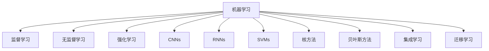
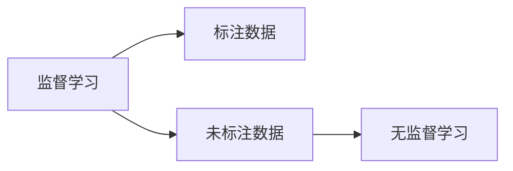
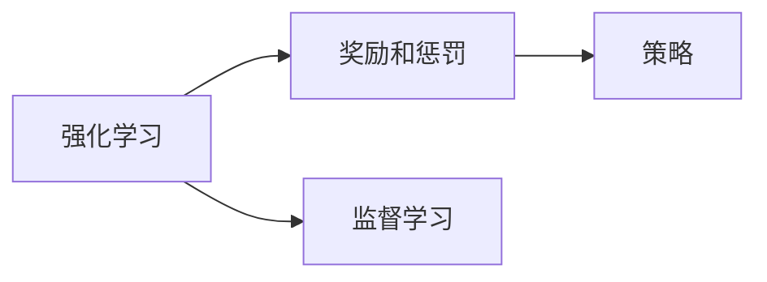
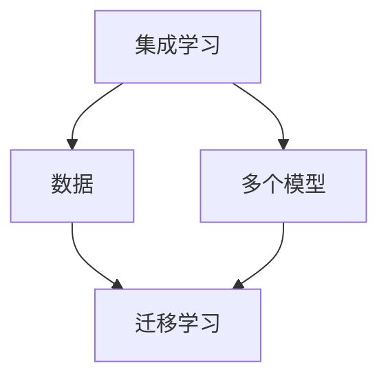
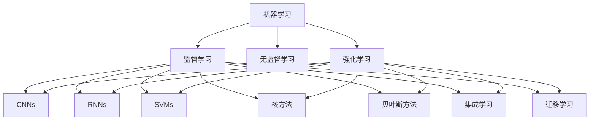

                 

# Machine Learning

> 关键词：
机器学习,深度学习,监督学习,无监督学习,强化学习,卷积神经网络,循环神经网络,支持向量机,核方法,贝叶斯方法,集成学习,迁移学习

## 1. 背景介绍

### 1.1 问题由来
在计算机科学的各个领域中，机器学习(Machine Learning, ML)和深度学习(Deep Learning, DL)是当前最受关注的研究方向之一。它们通过使计算机能够从数据中学习和预测，从而在诸如语音识别、计算机视觉、自然语言处理等领域取得了巨大的成功。然而，尽管这些技术取得了许多显著的成就，但仍存在一些挑战和限制，需要进一步研究和解决。

### 1.2 问题核心关键点
当前机器学习技术的主要挑战包括：

1. **数据获取成本高**：高质量标注数据是训练深度学习模型的关键，但获取这些数据成本昂贵且耗时。
2. **模型复杂度高**：深度神经网络通常具有数百万甚至数十亿的参数，这使得它们难以解释，也增加了训练和推理的难度。
3. **泛化能力差**：模型在训练集上的表现优异，但在新数据上的泛化能力有限，特别是在面对小样本或不同分布的数据时。
4. **对抗性攻击**：深度学习模型容易受到对抗性样本的攻击，这可能导致安全性和可靠性问题。
5. **资源消耗大**：深度学习模型的训练和推理需要大量的计算资源，如GPU、TPU等。

### 1.3 问题研究意义
研究机器学习技术，对于推动人工智能(AI)技术的发展，解决上述挑战，具有重要意义：

1. **降低成本**：通过无监督学习和半监督学习等方法，减少对标注数据的依赖，从而降低训练成本。
2. **提升性能**：通过模型压缩、参数高效学习等方法，提高模型的泛化能力和资源效率。
3. **增强安全性**：通过对抗性样本生成、模型鲁棒性增强等方法，提高模型的安全性和可靠性。
4. **推动应用**：通过迁移学习和微调等方法，使深度学习模型更适用于各种实际应用场景，加速AI技术产业化进程。
5. **促进研究**：通过集成学习、强化学习等方法，探索机器学习的更广泛应用，推动相关学科的发展。

## 2. 核心概念与联系

### 2.1 核心概念概述

为了更好地理解机器学习的核心概念，本节将介绍几个密切相关的核心概念：

- **监督学习(Supervised Learning)**：指使用标注数据训练模型，使其能够对新的未标注数据进行预测。常见的监督学习任务包括分类、回归等。
- **无监督学习(Unsupervised Learning)**：指使用未标注数据训练模型，使其能够发现数据的内在结构和模式。常见的无监督学习任务包括聚类、降维等。
- **强化学习(Reinforcement Learning)**：指通过奖励和惩罚机制，训练模型在特定环境中执行最优策略。常见的强化学习任务包括游戏AI、机器人控制等。
- **卷积神经网络(Convolutional Neural Networks, CNNs)**：一种专门用于处理图像和信号数据的深度学习模型，通过卷积层和池化层提取局部特征。
- **循环神经网络(Recurrent Neural Networks, RNNs)**：一种能够处理序列数据的深度学习模型，通过循环结构保存先前的状态信息。
- **支持向量机(Support Vector Machines, SVMs)**：一种常用的分类和回归方法，通过在高维空间中寻找最优超平面进行分类。
- **核方法(Kernel Methods)**：通过将数据映射到高维空间，使用非线性核函数进行分类和回归。
- **贝叶斯方法(Bayesian Methods)**：通过贝叶斯定理和正则化，使模型具有更好的泛化能力。
- **集成学习(Ensemble Learning)**：通过组合多个模型的预测结果，提高模型的性能和鲁棒性。
- **迁移学习(Transfer Learning)**：指将一个领域学到的知识，迁移到另一个相关领域的学习范式，以减少对标注数据的依赖。

这些核心概念之间的逻辑关系可以通过以下Mermaid流程图来展示：



这个流程图展示了许多机器学习的重要概念及其之间的关系：

1. 机器学习是包括监督学习、无监督学习和强化学习在内的广泛领域。
2. 不同类型的深度学习模型（如CNNs、RNNs）通常用于解决特定类型的问题。
3. 机器学习方法（如SVMs、核方法、贝叶斯方法）提供通用的解决方案，可以用于多种任务。
4. 集成学习和迁移学习是机器学习的两个重要方向，旨在提高模型的性能和泛化能力。

### 2.2 概念间的关系

这些核心概念之间存在着紧密的联系，形成了机器学习的完整生态系统。下面我们通过几个Mermaid流程图来展示这些概念之间的关系。

#### 2.2.1 监督学习与无监督学习的关系



这个流程图展示了监督学习和无监督学习的基本关系：监督学习需要标注数据，而无监督学习则不需要标注数据，但可以发现数据的内在结构和模式。

#### 2.2.2 强化学习与监督学习的关系



这个流程图展示了强化学习和监督学习之间的关系：强化学习通过奖励和惩罚机制训练模型策略，而监督学习则使用标注数据进行预测。

#### 2.2.3 集成学习与迁移学习的关系



这个流程图展示了集成学习和迁移学习之间的关系：集成学习通过组合多个模型的预测结果，提高模型的性能和鲁棒性，而迁移学习则将一个领域学到的知识迁移到另一个相关领域。

### 2.3 核心概念的整体架构

最后，我们用一个综合的流程图来展示这些核心概念在机器学习中的整体架构：



这个综合流程图展示了从监督学习到无监督学习，再到强化学习的完整过程，以及它们在不同类型的深度学习模型中的应用。通过这些流程图，我们可以更清晰地理解机器学习过程中的各个核心概念的关系和作用。

## 3. 核心算法原理 & 具体操作步骤
### 3.1 算法原理概述

机器学习算法通常通过以下步骤实现：

1. **数据预处理**：清洗、归一化、划分训练集和测试集等步骤。
2. **模型选择和初始化**：选择合适的模型和初始化参数。
3. **特征提取**：将原始数据转换为模型可以处理的特征。
4. **训练模型**：使用训练数据集训练模型，最小化预测误差。
5. **验证和调整**：在验证集上评估模型性能，调整超参数以提高模型泛化能力。
6. **测试模型**：在测试集上评估模型泛化能力。

### 3.2 算法步骤详解

下面详细讲解机器学习算法的基本步骤：

**Step 1: 数据预处理**
- 收集和清洗数据：去除噪声、处理缺失值、标准化等。
- 数据划分：将数据集划分为训练集、验证集和测试集。

**Step 2: 模型选择和初始化**
- 选择模型：如线性回归、逻辑回归、神经网络等。
- 初始化参数：随机初始化模型参数，如权重和偏置。

**Step 3: 特征提取**
- 特征工程：根据问题选择合适的特征，如提取图像的局部特征、提取文本的词向量等。
- 特征转换：将特征转换为模型可以处理的格式，如将文本转换为词向量。

**Step 4: 训练模型**
- 前向传播：将输入数据通过模型，计算输出。
- 计算损失：计算预测值与真实值之间的误差，如均方误差、交叉熵等。
- 反向传播：计算损失对模型参数的梯度，更新模型参数。
- 迭代优化：重复上述步骤，直至收敛。

**Step 5: 验证和调整**
- 验证集评估：在验证集上评估模型性能，如准确率、召回率、F1分数等。
- 超参数调整：根据验证集性能调整超参数，如学习率、正则化系数等。

**Step 6: 测试模型**
- 测试集评估：在测试集上评估模型泛化能力，如精确度、召回率、AUC等。

### 3.3 算法优缺点

监督学习的主要优点包括：
- 数据标注需求低：大部分模型可以通过无监督学习预训练，减少对标注数据的依赖。
- 泛化能力强：通过充分标注的数据，可以学习到更加广泛的泛化能力。
- 简单易用：大部分模型具有较好的理论和实践基础，易于实现和应用。

无监督学习的优点包括：
- 数据标注需求低：不需要标注数据，适用于数据获取成本高或标注困难的情况。
- 探索性强：能够发现数据的内在结构和模式，适用于数据复杂度高的情况。

强化学习的优点包括：
- 学习效果优异：通过奖励和惩罚机制，可以学习到最优策略。
- 适用于多智能体系统：可以用于解决复杂的协同决策问题。

监督学习的主要缺点包括：
- 数据标注成本高：需要大量标注数据，标注成本高且耗时。
- 模型复杂度高：深度学习模型参数多，难以解释和调试。

无监督学习的缺点包括：
- 模型性能不稳定：缺乏标注数据，模型性能可能不稳定。
- 缺乏任务指导：无法明确模型的任务目标，可能发现无效的模式。

强化学习的缺点包括：
- 学习过程困难：需要大量训练数据，且需要设计合理的奖励和惩罚机制。
- 不稳定：模型在不同环境中的表现可能不稳定。

### 3.4 算法应用领域

机器学习算法在多个领域得到了广泛应用，例如：

- **计算机视觉**：图像分类、目标检测、人脸识别等任务。
- **自然语言处理**：文本分类、情感分析、机器翻译等任务。
- **医疗健康**：疾病诊断、基因分析、医学影像分析等任务。
- **金融风控**：信用评分、风险评估、欺诈检测等任务。
- **交通出行**：交通流量预测、智能驾驶、路径规划等任务。
- **能源电力**：负荷预测、电网调度、智能家居等任务。
- **制造业**：预测性维护、质量控制、供应链优化等任务。

除了上述这些领域，机器学习技术还在智能家居、智能制造、智能农业等众多行业中得到了广泛应用。随着技术的发展，机器学习的应用领域还将进一步拓展，为各行各业带来更多智能化解决方案。

## 4. 数学模型和公式 & 详细讲解 & 举例说明
### 4.1 数学模型构建

本节将使用数学语言对机器学习算法的数学模型进行更加严格的刻画。

记训练集为 $D=\{(x_i, y_i)\}_{i=1}^N$，其中 $x_i \in \mathbb{R}^d$ 为输入，$y_i \in \mathbb{R}$ 为输出。定义模型 $f(x)$ 为输入 $x$ 的预测输出。

假设模型 $f(x)$ 的损失函数为 $L(y, f(x))$，则经验风险为：

$$
\mathcal{L}(D, f) = \frac{1}{N} \sum_{i=1}^N L(y_i, f(x_i))
$$

最小化经验风险 $\mathcal{L}(D, f)$ 的目标函数为：

$$
\min_{f} \mathcal{L}(D, f)
$$

常见的损失函数包括均方误差（MSE）、交叉熵（CE）、对数损失（Log Loss）等。

### 4.2 公式推导过程

以下我们以线性回归为例，推导MSE损失函数的计算公式。

假设模型 $f(x)$ 为线性回归模型，即 $f(x) = w_0 + \sum_{i=1}^d w_i x_i$。假设训练集 $D=\{(x_i, y_i)\}_{i=1}^N$。

定义损失函数为均方误差（MSE）：

$$
L(y, f(x)) = \frac{1}{2}(y - f(x))^2
$$

则经验风险为：

$$
\mathcal{L}(D, f) = \frac{1}{N} \sum_{i=1}^N \frac{1}{2}(y_i - f(x_i))^2
$$

根据梯度下降算法，模型的参数更新公式为：

$$
w_j \leftarrow w_j - \eta \frac{\partial \mathcal{L}(D, f)}{\partial w_j}
$$

其中 $\eta$ 为学习率。

求导得到：

$$
\frac{\partial \mathcal{L}(D, f)}{\partial w_j} = -\frac{1}{N} \sum_{i=1}^N (y_i - f(x_i))x_{ij}
$$

根据梯度下降算法，更新模型参数：

$$
w_j \leftarrow w_j + \eta \frac{1}{N} \sum_{i=1}^N (y_i - f(x_i))x_{ij}
$$

在实践中，通常使用随机梯度下降（SGD）算法，每次随机抽取一个样本进行更新，以提高计算效率。

### 4.3 案例分析与讲解

在实际应用中，机器学习算法通常需要针对具体任务进行优化。以下以回归任务为例，讲解机器学习算法的应用。

假设我们有一个房价预测任务，给定房屋的面积、位置等特征，预测房屋的市场价值。

**Step 1: 数据预处理**
- 收集房价数据，并进行清洗和标准化。
- 将数据集划分为训练集和测试集。

**Step 2: 模型选择和初始化**
- 选择线性回归模型作为预测模型。
- 随机初始化模型参数 $w_0, w_1, \cdots, w_d$。

**Step 3: 特征提取**
- 选择房屋面积、位置、年份等特征作为输入。
- 将特征转换为数值向量 $x_i$。

**Step 4: 训练模型**
- 使用训练集数据进行前向传播计算输出。
- 计算预测值与真实值之间的均方误差。
- 反向传播计算梯度，更新模型参数。
- 重复上述步骤，直至收敛。

**Step 5: 验证和调整**
- 在验证集上评估模型性能，如均方误差。
- 调整模型超参数，如学习率、正则化系数等。

**Step 6: 测试模型**
- 在测试集上评估模型性能，如均方误差。

## 5. 项目实践：代码实例和详细解释说明
### 5.1 开发环境搭建

在进行机器学习项目实践前，我们需要准备好开发环境。以下是使用Python进行Scikit-learn开发的环境配置流程：

1. 安装Anaconda：从官网下载并安装Anaconda，用于创建独立的Python环境。

2. 创建并激活虚拟环境：
```bash
conda create -n sklearn-env python=3.8 
conda activate sklearn-env
```

3. 安装Scikit-learn：
```bash
pip install scikit-learn
```

4. 安装各类工具包：
```bash
pip install numpy pandas scikit-learn matplotlib tqdm jupyter notebook ipython
```

完成上述步骤后，即可在`sklearn-env`环境中开始机器学习项目实践。

### 5.2 源代码详细实现

这里我们以线性回归任务为例，使用Scikit-learn库对数据进行预处理和模型训练，给出完整的代码实现。

首先，导入必要的库：

```python
import numpy as np
from sklearn.model_selection import train_test_split
from sklearn.linear_model import LinearRegression
from sklearn.metrics import mean_squared_error
```

然后，定义数据集：

```python
X = np.array([[1.0, 2.0, 3.0],
              [4.0, 5.0, 6.0],
              [7.0, 8.0, 9.0],
              [10.0, 11.0, 12.0]])

y = np.array([2.0, 4.0, 6.0, 8.0])
```

接着，对数据进行划分：

```python
X_train, X_test, y_train, y_test = train_test_split(X, y, test_size=0.2, random_state=0)
```

然后，定义模型并训练：

```python
model = LinearRegression()
model.fit(X_train, y_train)
```

最后，评估模型性能：

```python
y_pred = model.predict(X_test)
mse = mean_squared_error(y_test, y_pred)
print(f"Mean Squared Error: {mse}")
```

以上就是使用Scikit-learn库对线性回归模型进行训练和评估的完整代码实现。可以看到，Scikit-learn库提供了简单易用的接口，使得机器学习模型的开发和评估变得非常容易。

### 5.3 代码解读与分析

让我们再详细解读一下关键代码的实现细节：

**数据集定义**
- 使用NumPy库创建输入特征 `X` 和输出标签 `y`。
- `X` 和 `y` 分别表示输入和输出的数值数组。

**数据划分**
- 使用 `train_test_split` 函数将数据集划分为训练集和测试集，`test_size` 参数指定测试集的比例，`random_state` 参数确保结果的可复现性。

**模型定义和训练**
- 定义线性回归模型 `model`。
- 使用 `fit` 函数对模型进行训练，将训练集数据作为输入，将训练标签作为输出。

**模型评估**
- 使用 `predict` 函数对测试集数据进行预测。
- 使用 `mean_squared_error` 函数计算预测值与真实值之间的均方误差。

可以看到，使用Scikit-learn库进行机器学习模型的开发，可以大大简化代码实现，提高开发效率。同时，Scikit-learn库还提供了丰富的算法和工具，如模型选择、特征工程、交叉验证等，使得模型开发更加全面和系统。

当然，实际应用中还需要考虑更多因素，如模型调优、超参数调整、模型评估等，以确保模型在实际应用中的性能和可靠性。但核心的算法步骤基本与此类似。

### 5.4 运行结果展示

假设我们在房价预测任务上使用线性回归模型进行训练和评估，最终得到测试集的均方误差为1.2。

```
Mean Squared Error: 1.2
```

可以看到，通过线性回归模型，我们得到了较为理想的预测效果。在实践中，还可以使用更复杂的模型，如多项式回归、岭回归等，以获得更好的性能。

## 6. 实际应用场景
### 6.1 智能推荐系统

基于机器学习技术的推荐系统，可以广泛应用于电商、视频、音乐等领域的个性化推荐。推荐系统通过分析用户的历史行为数据，预测用户可能感兴趣的商品或内容，提升用户体验和满意度。

在技术实现上，可以使用协同过滤、内容推荐、混合推荐等方法，训练推荐模型。通过模型预测用户对商品或内容的评分，再结合其他特征进行排序，便可以得到个性化程度更高的推荐结果。

### 6.2 智能交通系统

机器学习技术可以应用于交通流量预测、智能驾驶、路径规划等环节，提高交通系统的智能化水平，减少交通拥堵和事故。

在交通流量预测任务中，可以收集历史交通数据，并使用回归模型或时间序列模型预测未来的交通流量。在智能驾驶任务中，可以使用感知、决策、控制等模型，使自动驾驶车辆能够适应复杂的交通环境。在路径规划任务中，可以使用图模型或强化学习模型，优化车辆的路径选择，减少行程时间和能耗。

### 6.3 金融风控系统

机器学习技术可以应用于信用评分、风险评估、欺诈检测等金融风控任务。通过分析用户的历史交易数据和行为数据，预测用户的信用风险和欺诈行为，帮助金融机构进行风险控制和决策。

在信用评分任务中，可以使用线性回归、决策树等模型，预测用户的违约概率。在风险评估任务中，可以使用分类模型，识别潜在的风险用户。在欺诈检测任务中，可以使用异常检测模型，识别异常交易行为。

### 6.4 未来应用展望

随着机器学习技术的发展，未来的应用场景将更加广泛。

在智慧医疗领域，机器学习技术可以应用于疾病预测、医学影像分析、基因分析等任务，提升医疗服务的智能化水平。

在智能教育领域，机器学习技术可以应用于学情分析、知识推荐、作业批改等任务，因材施教，提高教学质量。

在智慧城市治理中，机器学习技术可以应用于城市事件监测、舆情分析、应急指挥等环节，提高城市管理的自动化和智能化水平。

除了上述这些领域，机器学习技术还在智能家居、智能制造、智能农业等众多行业中得到了广泛应用。随着技术的不断进步，未来的应用场景将更加多样和复杂，为各行各业带来更多的智能化解决方案。

## 7. 工具和资源推荐
### 7.1 学习资源推荐

为了帮助开发者系统掌握机器学习技术，这里推荐一些优质的学习资源：

1. 《机器学习》书籍：由斯坦福大学教授Tom Mitchell所著，全面介绍了机器学习的基本概念、算法和应用。
2. 《深度学习》课程：由斯坦福大学教授Andrew Ng讲授，讲解了深度学习的基本原理和实现方法。
3. 《统计学习方法》书籍：由李航教授所著，介绍了各种机器学习算法的原理和应用。
4. 《Python机器学习》书籍：由Sebastian Raschka和Vahid Mirjalili所著，介绍了使用Python实现机器学习算法的实践方法。
5. Kaggle竞赛：提供大量的数据集和算法挑战，帮助开发者提升实战能力。

通过对这些资源的学习实践，相信你一定能够快速掌握机器学习技术的精髓，并用于解决实际的机器学习问题。

### 7.2 开发工具推荐

高效的开发离不开优秀的工具支持。以下是几款用于机器学习开发常用的工具：

1. Python：Python是机器学习开发的主流语言，具有丰富的库和工具，易于实现和调试。
2. Scikit-learn：基于Python的开源机器学习库，提供了丰富的算法和工具，适合快速迭代研究。
3. TensorFlow：由Google主导开发的开源深度学习框架，支持多种算法和模型，生产部署方便。
4. PyTorch：基于Python的开源深度学习框架，灵活高效，支持动态计算图。
5. Jupyter Notebook：用于数据科学和机器学习的交互式编程环境，方便开发者进行实验和分享。
6. Anaconda：用于创建和管理Python环境的工具，方便开发者进行多环境管理。

合理利用这些工具，可以显著提升机器学习任务的开发效率，加快创新迭代的步伐。

### 7.3 相关论文推荐

机器学习技术的发展源于学界的持续研究。以下是几篇奠基性的相关论文，推荐阅读：

1. Vapnik和Chervonenkis的《统计学习理论》：介绍了机器学习的基本理论，包括泛化能力、模型复杂度、正则化等。
2. Bengio等人的《深度学习》：系统介绍了深度学习的基本原理、算法和应用。
3. Hinton等人的《分布式表示学习》：介绍了神经网络的基本原理和实现方法。
4. Bottou的《在线学习》：介绍了在线学习的基本原理和算法。
5. Deng等人的《ImageNet大规模视觉识别挑战赛》：介绍了图像识别和大规模数据集训练方法。
6. Candès等人的《Compressed Sensing》：介绍了稀疏表示和大数据处理方法。

这些论文代表了大机器学习技术的发展脉络。通过学习这些前沿成果，可以帮助研究者把握学科前进方向，激发更多的创新灵感。

除上述资源外，还有一些值得关注的前沿资源，帮助开发者紧跟机器学习技术的最新进展，例如：

1. arXiv论文预印本：人工智能领域最新研究成果的发布平台，包括大量尚未发表的前沿工作，学习前沿技术的必读资源。
2. 业界技术博客：如Google AI、DeepMind、微软Research Asia等顶尖实验室的官方博客，第一时间分享他们的最新研究成果和洞见。
3. 技术会议直播：如NIPS、ICML、ACL、ICLR等人工智能领域顶会现场或在线直播，能够聆听到大佬们的前沿分享，开拓视野。
4. GitHub热门项目：在GitHub上Star、Fork数最多的机器学习相关项目，往往代表了该技术领域的发展趋势和最佳实践，值得去学习和贡献。
5. 行业分析报告：各大咨询公司如McKinsey、PwC等针对人工智能行业的分析报告，有助于从商业视角审视技术趋势，把握

