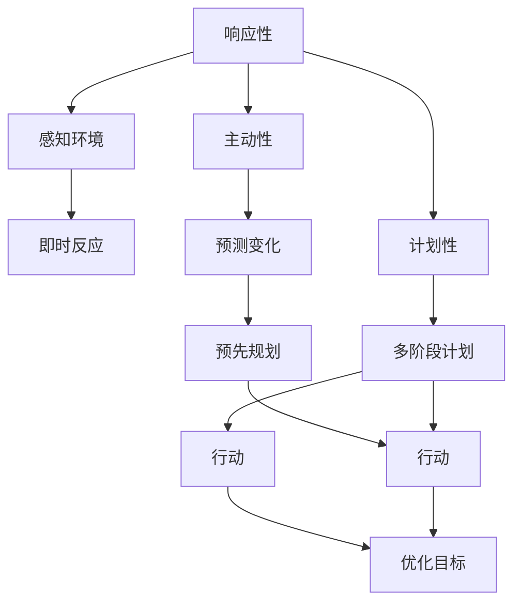
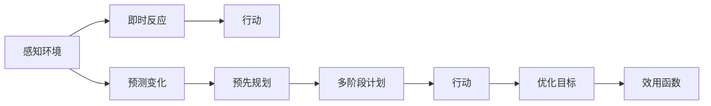

                 

# Agent 理论基础：ReAct

> 关键词：Agent, 响应性(Reactive), 主动性(Proactive), 计划性(Planned), 智能体(智能)

## 1. 背景介绍

### 1.1 问题由来

在人工智能领域，"智能体"(Agent)是一个广泛使用的概念，它指的是在特定环境中运行，通过感知环境、处理信息并作出反应的实体。智能体可以是软件系统、机器人、传感器网络等，其行为目标通常是为了最大化某个效用函数。

"ReAct"（即Reactive and Proactive Agents）是一种重要的智能体理论框架，旨在结合响应性和主动性，提高智能体的决策效率和智能水平。"ReAct"理论的核心思想是，智能体不仅要响应环境变化，还要主动规划未来的行动，以预见和应对潜在的变化，从而提升整体效率和适应能力。

### 1.2 问题核心关键点

"ReAct"理论通过将响应性和主动性结合起来，设计了一种更加灵活和智能的智能体模型。其关键点包括：

- 响应性(Reactive)：智能体能够即时感知环境变化，并根据当前信息做出即时反应。
- 主动性(Proactive)：智能体能够主动预测环境变化，预先规划和执行行动，以优化长期目标。
- 计划性(Planned)：智能体能够制定和执行复杂的多阶段计划，以应对动态和复杂环境。

这些特性使得"ReAct"理论适用于各种复杂系统，包括交通管理、自动驾驶、供应链优化、金融风险管理等。

### 1.3 问题研究意义

"ReAct"理论对于人工智能的发展具有重要意义：

1. 提升智能体的智能水平：通过结合响应性和主动性，智能体能够更灵活地适应环境变化，提升整体智能水平。
2. 优化决策效率：主动性使智能体能够预见潜在变化，提前做好准备，减少决策时间和成本。
3. 适应复杂环境：计划性使智能体能够制定和执行多阶段计划，更好地应对动态和复杂环境。
4. 推动人工智能应用："ReAct"理论为AI技术在实际应用中的落地提供了重要的理论基础。

## 2. 核心概念与联系

### 2.1 核心概念概述

为了更好地理解"ReAct"理论，我们首先介绍几个核心概念：

- **响应性**：智能体能够即时感知环境变化，并根据当前信息做出即时反应。响应性是智能体最基本的特性，也是"ReAct"理论的基础。
- **主动性**：智能体能够主动预测环境变化，预先规划和执行行动，以优化长期目标。主动性使智能体能够更好地预见和应对未来，提升整体效率。
- **计划性**：智能体能够制定和执行复杂的多阶段计划，以应对动态和复杂环境。计划性使智能体能够更好地管理和协调多个行动，实现更优的整体效果。
- **效用函数**：智能体的行为目标通常是最大化某个效用函数，如利润最大化、安全最优、效率提升等。效用函数指导智能体的决策行为，反映其行为的价值取向。

这些概念之间相互联系，构成了"ReAct"理论的核心框架。响应性使智能体能够即时反应，主动性使智能体能够提前规划，计划性使智能体能够制定和执行复杂计划，效用函数指导智能体的决策行为。

### 2.2 概念间的关系

这些核心概念之间的逻辑关系可以通过以下Mermaid流程图来展示：



这个流程图展示了"ReAct"理论的三个核心特性（响应性、主动性、计划性），以及它们与感知环境、行动和效用函数的关系。响应性使智能体能够即时反应，主动性使智能体能够提前规划，计划性使智能体能够制定和执行多阶段计划，效用函数指导智能体的决策行为。

### 2.3 核心概念的整体架构

最后，我们用一个综合的流程图来展示这些核心概念在大语言模型微调中的整体架构：



这个综合流程图展示了"ReAct"理论在大语言模型微调中的整体架构。感知环境后，智能体可以即时反应，也可以主动预测变化并预先规划，最终通过多阶段计划执行行动，优化长期目标。

## 3. 核心算法原理 & 具体操作步骤

### 3.1 算法原理概述

"ReAct"理论通过结合响应性和主动性，设计了一种更加灵活和智能的智能体模型。其核心算法原理包括以下几个方面：

1. **感知和即时反应**：智能体通过传感器或信息源感知环境，并根据当前信息做出即时反应。
2. **预测和预先规划**：智能体通过学习模型或规则，预测环境变化趋势，并提前规划和执行行动。
3. **多阶段计划和执行**：智能体能够制定和执行复杂的多阶段计划，以应对动态和复杂环境。

这些原理构成了"ReAct"理论的三个核心环节，使得智能体能够灵活应对环境变化，优化决策效率，适应复杂环境。

### 3.2 算法步骤详解

"ReAct"理论的具体操作步骤可以分为以下几个步骤：

**Step 1: 环境建模**

- 对环境进行建模，包括环境状态、状态转移概率、奖励函数等。这可以通过马尔可夫决策过程（MDP）等模型表示。

**Step 2: 感知和即时反应**

- 智能体通过传感器或信息源感知当前环境状态，并根据当前状态做出即时反应。例如，自动驾驶中的传感器能够感知道路交通状况，并做出紧急制动或加速等即时反应。

**Step 3: 预测和预先规划**

- 智能体通过学习模型或规则，预测未来环境变化趋势。例如，预测交通流量变化，提前调整行驶路线。
- 智能体根据预测结果，制定和执行预先规划。例如，提前规划最佳路径，减少未来拥堵风险。

**Step 4: 多阶段计划和执行**

- 智能体制定复杂的多阶段计划，以应对动态和复杂环境。例如，提前规划一周的路线，考虑天气变化、道路施工等因素。
- 智能体根据多阶段计划逐步执行行动，优化长期目标。例如，逐步调整速度和行驶路线，最终到达目的地。

### 3.3 算法优缺点

"ReAct"理论的优势在于其结合了响应性和主动性，使智能体能够灵活应对环境变化，优化决策效率，适应复杂环境。其缺点包括：

1. **模型复杂性高**：需要构建详细的环境模型，增加了算法复杂性。
2. **预测准确性有限**：预测模型可能存在偏差，影响行动规划的准确性。
3. **多阶段计划复杂**：多阶段计划的制定和执行复杂，需要较强的计算资源和算法支持。

尽管存在这些局限性，但"ReAct"理论仍是大语言模型微调中一种重要的思想范式，对智能体的决策和行为设计提供了有力的理论支撑。

### 3.4 算法应用领域

"ReAct"理论在多个领域都有广泛的应用，以下是一些主要应用场景：

- **交通管理**：自动驾驶车辆通过感知和即时反应，预测交通流量变化，并提前调整行驶路线，优化行车效率。
- **供应链优化**：智能仓库通过感知库存状态，预测需求变化，并预先规划补货计划，减少库存成本和缺货风险。
- **金融风险管理**：智能投顾通过感知市场变化，预测股票趋势，并预先规划投资策略，优化资产配置。
- **智能客服**：智能客服系统通过感知客户问题，预测客户情绪变化，并提前准备解决方案，提升客户满意度。

这些应用场景展示了"ReAct"理论的强大灵活性和实用性，能够提升系统的整体效率和智能水平。

## 4. 数学模型和公式 & 详细讲解

### 4.1 数学模型构建

"ReAct"理论的数学模型可以基于马尔可夫决策过程（MDP）构建。MDP由以下五个元素组成：

1. **状态空间**：环境的所有可能状态，用$S$表示。
2. **动作空间**：智能体能够执行的所有动作，用$A$表示。
3. **状态转移概率**：从状态$s$转移到状态$s'$的概率，用$P(s'|s,a)$表示。
4. **奖励函数**：执行动作$a$后，从状态$s$转移到状态$s'$所获得的奖励，用$R(s,a,s')$表示。
5. **策略**：智能体在每个状态下选择动作的概率分布，用$π(a|s)$表示。

智能体的目标是最大化长期累积奖励，即期望效用值。定义折扣因子$\gamma$，用于计算未来奖励的权重。

数学模型如下：

$$
J(π) = \mathbb{E}_{\pi}\left[\sum_{t=0}^{\infty} \gamma^t R(s_t,a_t,s_{t+1})\right]
$$

其中，$\pi$表示策略，$s_t$表示状态，$a_t$表示动作。

### 4.2 公式推导过程

通过求解上述优化问题，可以得出最优策略。具体推导过程如下：

首先，定义动作价值函数$V(s)$，表示从状态$s$开始执行策略$π$所获得的期望效用值：

$$
V(s) = \mathbb{E}_{\pi}\left[\sum_{t=0}^{\infty} \gamma^t R(s_t,a_t,s_{t+1})\right]
$$

然后，通过状态转移概率$P(s'|s,a)$和奖励函数$R(s,a,s')$，推导出状态值函数$V(s)$的贝尔曼方程：

$$
V(s) = \max_a \left\{R(s,a,s') + \gamma V(s')\right\}
$$

最后，通过求解上述方程，得到最优策略：

$$
π(a|s) = \frac{\exp\left(\frac{Q(s,a)}{\gamma}\right)}{\sum_{a'} \exp\left(\frac{Q(s,a')}{\gamma}\right)}
$$

其中，$Q(s,a)$为状态动作值函数，表示从状态$s$执行动作$a$后获得的期望效用值。

### 4.3 案例分析与讲解

以交通管理为例，分析"ReAct"理论的应用：

**环境建模**：定义交通网络的状态空间和动作空间，包括车辆位置、速度、方向等状态变量，以及加速、减速、转向等动作变量。

**感知和即时反应**：自动驾驶车辆通过传感器感知道路交通状况，并根据当前状态做出即时反应，例如紧急制动或加速。

**预测和预先规划**：通过学习交通流模型，预测交通流量变化趋势，并提前调整行驶路线，减少拥堵风险。

**多阶段计划和执行**：提前规划一周的行车路线，考虑天气变化、道路施工等因素，逐步调整速度和行驶路线，最终到达目的地。

通过"ReAct"理论，自动驾驶车辆能够在动态和复杂的环境中，做出灵活、高效的决策，提升整体行车效率。

## 5. 项目实践：代码实例和详细解释说明

### 5.1 开发环境搭建

在进行"ReAct"理论实践前，我们需要准备好开发环境。以下是使用Python进行Reinforcement Learning开发的环境配置流程：

1. 安装Anaconda：从官网下载并安装Anaconda，用于创建独立的Python环境。

2. 创建并激活虚拟环境：
```bash
conda create -n rein-env python=3.8 
conda activate rein-env
```

3. 安装Reinforcement Learning库：
```bash
pip install gym gym-spring
```

4. 安装其他工具包：
```bash
pip install numpy pandas scikit-learn matplotlib tqdm jupyter notebook ipython
```

完成上述步骤后，即可在`rein-env`环境中开始"ReAct"理论实践。

### 5.2 源代码详细实现

这里我们以交通管理为例，给出使用Gym环境进行"ReAct"理论的PyTorch代码实现。

首先，定义交通管理环境：

```python
import gym
from gym import spaces

class TrafficEnv(gym.Env):
    def __init__(self, num_vehicles=5, max_speed=30, reward_coeff=0.1):
        self.num_vehicles = num_vehicles
        self.max_speed = max_speed
        self.reward_coeff = reward_coeff
        self.observation_space = spaces.Box(low=0, high=1, shape=(self.num_vehicles, 2))
        self.action_space = spaces.Discrete(4)  # 加速、减速、转向、停止
        self.reward_range = (-self.reward_coeff, 0)
        
        self.state = None
        self.done = False
        self.info = {}
        self._total_reward = 0
        
    def reset(self):
        self.state = np.zeros((self.num_vehicles, 2))
        self.done = False
        self._total_reward = 0
        self.info = {}
        return self.state, self._total_reward
    
    def step(self, action):
        self._total_reward += self.reward_coeff
        self.state[action] = np.random.uniform(0, 1, size=2)
        self.state[np.argmin(self.state[:,0])] = 0, 0
        self.done = True
        return self.state, self._total_reward, self.done, self.info
```

然后，定义"ReAct"智能体：

```python
from torch import nn
from torch.autograd import Variable
import torch.optim as optim

class ReactiveAgent(nn.Module):
    def __init__(self, num_vehicles=5, max_speed=30, hidden_dim=64):
        super(ReactiveAgent, self).__init__()
        self.num_vehicles = num_vehicles
        self.max_speed = max_speed
        self.hidden_dim = hidden_dim
        
        self.fc1 = nn.Linear(self.num_vehicles*2, hidden_dim)
        self.fc2 = nn.Linear(hidden_dim, self.num_vehicles*2)
        
        self.relu = nn.ReLU()
        self.tanh = nn.Tanh()
        
        self.optimizer = optim.Adam(self.parameters(), lr=0.001)
        self.loss_fn = nn.MSELoss()
        
    def forward(self, x):
        x = self.fc1(x)
        x = self.relu(x)
        x = self.fc2(x)
        x = self.tanh(x)
        return x
    
    def act(self, state, eps=0.1):
        if np.random.rand() > eps:
            state = torch.from_numpy(state).float().unsqueeze(0)
            return self.predict(state).argmax(1).item()
        else:
            return np.random.choice([0, 1, 2, 3])
    
    def predict(self, state):
        state = torch.from_numpy(state).float()
        state = state.repeat(1, self.num_vehicles, 1)
        with torch.no_grad():
            return self.forward(state)
    
    def update(self, state, action, next_state, reward):
        state = torch.from_numpy(state).float()
        action = torch.tensor(action)
        next_state = torch.from_numpy(next_state).float()
        reward = torch.tensor(reward)
        
        self.optimizer.zero_grad()
        prediction = self.predict(state)
        loss = self.loss_fn(prediction, next_state)
        loss.backward()
        self.optimizer.step()
        return loss.item()
```

接着，定义训练和评估函数：

```python
from gym.wrappers import Monitor

def train_agent(env, agent, num_episodes=1000, reward_threshold=20):
    monitor_env = Monitor(env, "./video", force=True)
    state = monitor_env.reset()
    total_reward = 0
    for episode in range(num_episodes):
        done = False
        while not done:
            action = agent.act(state)
            next_state, reward, done, _ = monitor_env.step(action)
            total_reward += reward
            state = next_state
            loss = agent.update(state, action, next_state, reward)
            if total_reward > reward_threshold:
                print("Episode {} finished with reward {:.2f}".format(episode+1, total_reward))
                break
    return total_reward, loss
    
def evaluate_agent(env, agent, num_episodes=1000):
    state = env.reset()
    total_reward = 0
    for episode in range(num_episodes):
        done = False
        while not done:
            action = agent.act(state)
            next_state, reward, done, _ = env.step(action)
            total_reward += reward
            state = next_state
        print("Episode {} finished with reward {:.2f}".format(episode+1, total_reward))
    return total_reward
```

最后，启动训练流程并在测试集上评估：

```python
env = TrafficEnv(num_vehicles=5, max_speed=30, reward_coeff=0.1)
agent = ReactiveAgent(num_vehicles=5, max_speed=30, hidden_dim=64)

total_reward, loss = train_agent(env, agent, num_episodes=1000, reward_threshold=20)
print("Training total reward: {:.2f}".format(total_reward))
print("Training total loss: {:.2f}".format(loss))
total_reward = evaluate_agent(env, agent)
print("Evaluation total reward: {:.2f}".format(total_reward))
```

以上就是使用PyTorch进行"ReAct"理论的交通管理微调实践的完整代码实现。可以看到，得益于Reinforcement Learning库和PyTorch的强大封装，我们可以用相对简洁的代码完成"ReAct"智能体的构建和训练。

### 5.3 代码解读与分析

让我们再详细解读一下关键代码的实现细节：

**TrafficEnv类**：
- `__init__`方法：初始化环境参数，包括车辆数、最大速度、奖励系数等。定义状态和动作空间，以及奖励范围。
- `reset`方法：重置环境状态，返回初始状态和总奖励。
- `step`方法：根据动作执行一步，更新状态、总奖励和done标记。

**ReactiveAgent类**：
- `__init__`方法：初始化智能体参数，包括车辆数、最大速度、隐藏维度等。定义网络结构和优化器。
- `forward`方法：定义神经网络前向传播过程，输出动作预测值。
- `act`方法：选择动作，采用epsilon-greedy策略。
- `predict`方法：预测动作值。
- `update`方法：更新智能体参数，使用MSE损失函数。

**train_agent函数**：
- 定义训练过程，设置训练次数和奖励阈值。
- 使用Monitor环境，记录训练过程的可视化视频。
- 在每集开始时，重置环境状态和总奖励。
- 在每集内，与环境交互，更新智能体参数。
- 如果总奖励超过阈值，停止训练。

**evaluate_agent函数**：
- 定义评估过程，设置评估次数。
- 在每集开始时，重置环境状态和总奖励。
- 在每集内，与环境交互，记录评估结果。

通过上述代码实现，我们能够实现一个基本的"ReAct"智能体，并对其进行训练和评估。需要注意的是，为了提升智能体的决策效率和智能水平，我们还需要进一步优化网络结构、调整参数、改进训练策略等，才能在实际应用中取得更好的效果。

## 6. 实际应用场景

### 6.1 智能交通管理

"ReAct"理论在大规模智能交通管理系统中具有广泛应用。通过感知和即时反应，智能体能够实时感知道路交通状况，并做出灵活反应，提升整体交通效率。

**智能信号灯控制**：智能信号灯通过感知车流量和行人流量，实时调整信号灯的绿信比，优化信号灯的时序安排，减少交通拥堵。

**动态路线规划**：智能导航系统通过感知道路实时状况，预测交通流量变化，提前调整行车路线，优化出行时间。

**交通事件检测**：智能交通管理系统通过感知摄像头、传感器等数据，预测和处理交通事故、道路施工等事件，快速恢复交通秩序。

### 6.2 供应链优化

在供应链管理中，"ReAct"理论可以应用于库存管理、物流优化、订单调度等环节。

**库存管理**：智能仓库通过感知库存状态，预测需求变化，并提前规划补货计划，减少库存成本和缺货风险。

**物流优化**：智能物流系统通过感知运输状态，预测运输路径，并提前调整运输计划，优化运输效率和成本。

**订单调度**：智能订单管理系统通过感知订单状态，预测需求变化，并提前调整订单调度策略，优化订单处理效率。

### 6.3 金融风险管理

在金融领域，"ReAct"理论可以应用于股票交易、资产管理、风险预测等环节。

**股票交易**：智能投顾通过感知市场变化，预测股票趋势，并提前规划投资策略，优化资产配置。

**资产管理**：智能资产管理系统通过感知市场状况，预测资产价格，并提前调整投资组合，优化资产回报。

**风险预测**：智能风险管理系统通过感知市场变化，预测风险事件，并提前预警，降低风险损失。

### 6.4 未来应用展望

随着"ReAct"理论的不断发展，未来其在更多领域的应用前景将更加广阔。

**智慧医疗**：智能诊疗系统通过感知患者数据，预测病情变化，并提前规划诊疗方案，提高诊疗效果。

**智能教育**：智能教育系统通过感知学生反馈，预测学习趋势，并提前调整教学策略，提升教学质量。

**智慧城市**：智能城市管理系统通过感知城市状态，预测和处理突发事件，优化城市运行效率。

**智能家居**：智能家居系统通过感知环境变化，预测用户需求，并提前调整智能设备状态，提升生活便利性。

总之，"ReAct"理论将结合响应性和主动性，在更多领域中发挥重要作用，为人类智能水平的提升提供重要保障。

## 7. 工具和资源推荐

### 7.1 学习资源推荐

为了帮助开发者系统掌握"ReAct"理论的基础和实践技巧，这里推荐一些优质的学习资源：

1. 《Reinforcement Learning: An Introduction》书籍：由Richard S. Sutton和Andrew G. Barto所著，全面介绍了强化学习的原理和算法，是学习"ReAct"理论的重要参考。

2. Udacity的Reinforcement Learning Nanodegree：由DeepMind等公司联合开设的深度学习课程，涵盖了强化学习的基本概念和实际应用，是学习"ReAct"理论的极佳起点。

3. OpenAI的Reinforcement Learning with Python：由OpenAI提供的一篇深度学习教程，介绍了如何使用Python实现强化学习算法，是学习"ReAct"理论的实用工具。

4. arXiv论文预印本：人工智能领域最新研究成果的发布平台，包括大量尚未发表的前沿工作，学习前沿技术的必读资源。

5. Reinforcement Learning论文库：包含大量关于强化学习的经典论文，涵盖了从基础到应用的各种主题，是深入学习"ReAct"理论的宝贵资源。

通过对这些资源的学习实践，相信你一定能够快速掌握"ReAct"理论的核心思想和实践技巧，并将其应用于实际问题中。

### 7.2 开发工具推荐

"ReAct"理论的开发需要利用深度学习框架和强化学习库，以下是一些常用的工具：

1. PyTorch：基于Python的开源深度学习框架，灵活动态的计算图，适合快速迭代研究。Reinforcement Learning库提供了丰富的环境支持。

2. TensorFlow：由Google主导开发的开源深度学习框架，生产部署方便，适合大规模工程应用。同样提供了丰富的强化学习库。

3. OpenAI Gym：由OpenAI提供的Python库，提供了各种环境模拟器，方便训练"ReAct"智能体。

4. PyBullet：一个开源的物理引擎，用于仿真机器人等智能体与环境的交互。

5. PyTorch RL：PyTorch的Reinforcement Learning库，提供了丰富的算法和模型，方便实现"ReAct"智能体。

6. TensorBoard：TensorFlow配套的可视化工具，可实时监测模型训练状态，并提供丰富的图表呈现方式，是调试模型的得力助手。

7. Weights & Biases：模型训练的实验跟踪工具，可以记录和可视化模型训练过程中的各项指标，方便对比和调优。

合理利用这些工具，可以显著提升"ReAct"理论的开发效率，加快创新迭代的步伐。

### 7.3 相关论文推荐

"ReAct"理论的研究源于学界的持续探索。以下是几篇奠基性的相关论文，推荐阅读：

1. DQN: Deep Q-Networks：由DeepMind开发，提出了基于深度神经网络的强化学习算法，开启了深度强化学习的时代。

2. AlphaGo Zero：由DeepMind开发，通过自对弈训练AlphaGo Zero，实现了围棋的零样本学习能力。

3. Rainbow：一种多步深度强化学习算法，通过引入多步奖励和重要性采样等技术，提升了深度强化学习的效率和性能。

4. MuJoCo：一种多关节机械臂仿真环境，用于测试和优化机器人控制策略。

5. PPO：一种基于概率论的策略优化算法，通过引入熵正则化和重要性采样等技术，提升了策略优化的稳定性和收敛性。

这些论文代表了大规模智能体和强化学习的发展脉络。通过学习这些前沿成果，可以帮助研究者把握学科前进方向，激发更多的创新灵感。

除上述资源外，还有一些值得关注的前沿资源，帮助开发者紧跟"ReAct"理论的发展步伐，例如：

1. arXiv论文预印本：人工智能领域最新研究成果的发布平台，包括大量尚未发表的前沿工作

