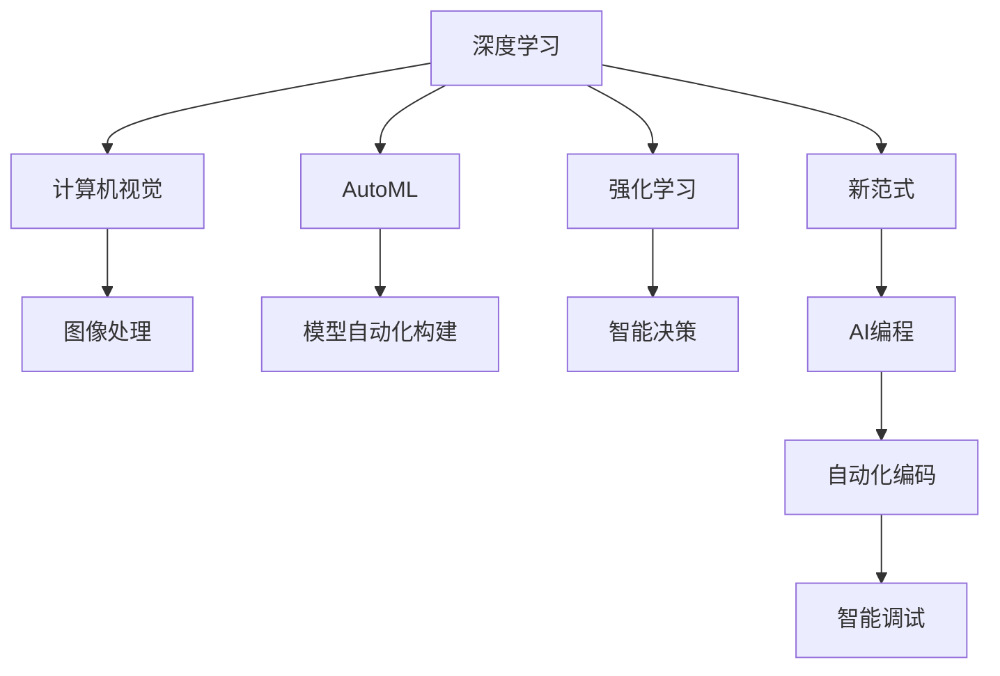

                 

# Andrej Karpathy谈AI编程的新范式

> 关键词：AI编程,新范式,Python,深度学习,自动机器学习(AutoML),强化学习(Reinforcement Learning),计算机视觉(Computer Vision)

## 1. 背景介绍

人工智能领域经历了几十年的发展，已经逐步从早期的人工模拟转变为深度学习和机器学习的自动化与智能化。尤其是在近年来，深度学习技术不断突破，使AI编程成为一种全新的范式，极大地影响了软件开发与编程实践。Andrej Karpathy，作为人工智能领域的著名专家，曾在其博客中详细讨论了AI编程的新范式，本节将基于其观点，系统梳理AI编程的核心内容与实践路径。

## 2. 核心概念与联系

### 2.1 核心概念概述

为了理解AI编程的新范式，我们首先明确几个核心概念：

- **AI编程**：一种基于机器学习和深度学习的编程方法，其目的是通过自动化和智能化的方法，减少人工编程工作量，提高编程效率和质量。

- **深度学习**：一种基于神经网络的机器学习技术，通过多层次的非线性变换，自动提取和识别数据特征，实现复杂模式的预测和分类。

- **自动机器学习(AutoML)**：一种无需手工调参的机器学习方法，通过自动化算法选择、模型优化等步骤，快速构建高性能的AI模型。

- **强化学习(Reinforcement Learning, RL)**：一种通过试错来学习最优策略的机器学习方法，应用广泛，包括游戏、机器人控制、金融预测等。

- **计算机视觉(Computer Vision)**：一种利用图像处理和模式识别技术，实现计算机对视觉信息的理解与处理的技术领域，广泛应用于自动驾驶、医学影像分析等。

这些核心概念共同构成了AI编程的基础框架，而通过深度学习、AutoML、RL等技术的应用，AI编程的效率和质量得到了显著提升。

### 2.2 核心概念间的关系

为了更清晰地理解这些核心概念的相互关系，下面使用Mermaid流程图来展示它们之间的联系：



这个流程图展示了深度学习、AutoML、RL等技术如何通过计算机视觉的应用，逐步构建出AI编程的新范式。深度学习作为基础，提供了强大的特征提取和模式识别能力；AutoML进一步自动化了模型构建和调参过程，减少了人工干预；RL则通过试错学习，实现智能决策和自动化编码，最终推动了AI编程的全面自动化。

## 3. 核心算法原理 & 具体操作步骤

### 3.1 算法原理概述

AI编程的新范式主要基于深度学习、AutoML和RL等技术，其核心算法原理可以总结如下：

- **深度学习**：通过构建多层次的神经网络模型，自动学习输入数据的高阶特征表示，实现复杂模式的识别和预测。

- **AutoML**：通过自动化算法选择和模型优化，自动构建高性能的AI模型，并自动化调参以提高模型性能。

- **RL**：通过试错学习，自动探索最优策略，实现智能化决策和自动化编码。

### 3.2 算法步骤详解

AI编程的具体操作步骤可以概括为以下步骤：

1. **数据准备**：收集并准备训练数据，包括数据清洗、预处理、划分训练集和验证集等。

2. **模型选择与构建**：根据任务类型，选择合适的深度学习模型，并使用AutoML技术自动化构建模型。

3. **模型训练与调参**：使用AutoML技术自动选择合适的优化器和超参数，并使用深度学习算法训练模型。

4. **模型评估与优化**：在验证集上评估模型性能，并根据评估结果调整模型结构和超参数，进行模型优化。

5. **自动化编码与调试**：使用RL技术自动生成和调试代码，实现自动化编码和智能调试。

6. **模型部署与应用**：将训练好的模型部署到实际应用场景中，进行实时预测和决策。

### 3.3 算法优缺点

AI编程的新范式在效率和质量上都有显著提升，但同时也存在一些缺点：

- **优点**：
  - **高效性**：减少了人工编程的工作量，提高了开发效率。
  - **质量高**：通过自动化和智能化方法，减少了人为错误，提高了代码质量。
  - **适应性强**：能够自动适应复杂多变的数据和场景，提升了模型的泛化能力。

- **缺点**：
  - **复杂度高**：需要大量数据和计算资源，模型构建和调参过程相对复杂。
  - **可解释性差**：由于深度学习的"黑盒"特性，模型决策过程难以解释，增加了调试和维护难度。
  - **资源消耗大**：模型训练和调参需要消耗大量计算资源，增加了系统的运行成本。

### 3.4 算法应用领域

AI编程的新范式在多个领域都有广泛的应用，主要包括：

- **计算机视觉**：自动图像处理、目标检测、图像分割等。
- **自然语言处理**：自动文本生成、机器翻译、情感分析等。
- **机器人控制**：自动决策与动作规划，智能控制。
- **游戏AI**：自动游戏策略生成，智能对抗。
- **自动驾驶**：自动路径规划、环境感知、决策与控制。

## 4. 数学模型和公式 & 详细讲解 & 举例说明

### 4.1 数学模型构建

在AI编程中，数学模型和公式起着至关重要的作用。这里我们以深度学习中的卷积神经网络（Convolutional Neural Network, CNN）为例，展示模型的构建过程。

卷积神经网络的主要数学模型为：

$$
y = W_1 \sigma(W_0 x + b_0) + b_1
$$

其中，$W_0$ 和 $W_1$ 是卷积核和全连接层的权重矩阵，$b_0$ 和 $b_1$ 是偏置项，$\sigma$ 是非线性激活函数，$x$ 是输入数据，$y$ 是输出结果。

### 4.2 公式推导过程

卷积神经网络的推导过程如下：

1. **卷积层**：通过卷积操作提取输入数据的局部特征，形式为：

$$
h = W * x + b
$$

其中，$W$ 是卷积核，$x$ 是输入数据，$b$ 是偏置项，$h$ 是卷积层输出。

2. **池化层**：通过池化操作降低特征维度，常用方法有最大池化和平均池化，形式为：

$$
h' = \max(h) \quad \text{或} \quad h' = \frac{1}{n} \sum h
$$

其中，$n$ 是池化窗口大小。

3. **全连接层**：通过全连接层将特征映射到输出空间，形式为：

$$
y = W * h + b
$$

其中，$W$ 是权重矩阵，$h$ 是特征映射，$b$ 是偏置项，$y$ 是输出结果。

### 4.3 案例分析与讲解

假设我们要进行手写数字识别任务，数据集为MNIST。使用卷积神经网络的步骤如下：

1. **模型构建**：使用PyTorch库定义卷积神经网络模型，包括卷积层、池化层、全连接层等。

2. **数据准备**：将MNIST数据集加载到模型中，进行数据预处理和增强。

3. **模型训练**：在GPU上训练模型，使用交叉熵损失函数和Adam优化器，迭代优化模型参数。

4. **模型评估**：在测试集上评估模型性能，使用准确率和混淆矩阵等指标衡量模型效果。

5. **模型优化**：根据评估结果，调整模型结构和超参数，进一步提高模型性能。

## 5. 项目实践：代码实例和详细解释说明

### 5.1 开发环境搭建

为了实现AI编程的实际应用，我们需要搭建Python开发环境，并使用常用的深度学习框架，如TensorFlow和PyTorch等。具体步骤如下：

1. **安装Python**：从官网下载安装最新版本的Python，并设置系统环境变量。

2. **安装深度学习框架**：使用pip命令安装TensorFlow和PyTorch，并指定GPU支持。

3. **安装相关库**：安装常用的机器学习和计算机视觉库，如numpy、scikit-learn、PIL等。

4. **搭建开发环境**：使用Anaconda或Miniconda创建虚拟环境，并安装所需依赖库。

### 5.2 源代码详细实现

以下是一个使用TensorFlow实现卷积神经网络的Python代码示例：

```python
import tensorflow as tf
from tensorflow.keras import layers

# 定义卷积神经网络模型
model = tf.keras.Sequential([
    layers.Conv2D(32, (3, 3), activation='relu', input_shape=(28, 28, 1)),
    layers.MaxPooling2D((2, 2)),
    layers.Conv2D(64, (3, 3), activation='relu'),
    layers.MaxPooling2D((2, 2)),
    layers.Flatten(),
    layers.Dense(10, activation='softmax')
])

# 编译模型
model.compile(optimizer=tf.keras.optimizers.Adam(learning_rate=0.001),
              loss=tf.keras.losses.SparseCategoricalCrossentropy(from_logits=True),
              metrics=['accuracy'])

# 训练模型
model.fit(train_images, train_labels, epochs=10, validation_data=(test_images, test_labels))
```

### 5.3 代码解读与分析

上述代码中，我们首先定义了一个简单的卷积神经网络模型，包括两个卷积层、两个池化层和两个全连接层。然后，使用TensorFlow的高级API编译模型，设置优化器和损失函数。最后，使用训练数据对模型进行拟合。

在实际应用中，我们还需要进行模型评估、模型优化等步骤，以进一步提升模型的性能。

### 5.4 运行结果展示

训练完成后，我们可以在测试集上评估模型性能，并绘制混淆矩阵：

```python
import matplotlib.pyplot as plt
import seaborn as sns

# 加载测试集
test_images, test_labels = load_data()

# 评估模型
test_loss, test_acc = model.evaluate(test_images, test_labels, verbose=2)

# 绘制混淆矩阵
cm = confusion_matrix(test_labels, model.predict(test_images))
plt.figure(figsize=(6, 6))
sns.heatmap(cm, annot=True, fmt='d', cmap='Blues')
plt.xlabel('Predicted')
plt.ylabel('Actual')
plt.show()
```

通过混淆矩阵，我们可以看到模型在不同类别上的表现，评估模型的分类效果。

## 6. 实际应用场景

### 6.1 计算机视觉

计算机视觉是AI编程的重要应用领域之一，通过卷积神经网络等深度学习技术，可以实现图像分类、目标检测、图像分割等任务。例如，可以使用卷积神经网络进行医学影像分析，自动识别肿瘤、病变等关键区域。

### 6.2 自然语言处理

自然语言处理也是AI编程的重要应用领域，通过循环神经网络等深度学习技术，可以实现文本分类、情感分析、机器翻译等任务。例如，可以使用循环神经网络进行情感分析，自动识别文本情感倾向。

### 6.3 机器人控制

机器人控制是AI编程的另一个重要应用领域，通过强化学习技术，可以实现自主导航、路径规划、智能决策等任务。例如，可以使用深度强化学习训练机器人，使其能够在复杂环境中自主导航和避障。

### 6.4 未来应用展望

未来，AI编程将进一步向智能化、自动化方向发展，将在更多领域得到应用。例如，在自动驾驶领域，AI编程可以用于实时环境感知、路径规划和决策制定；在金融领域，AI编程可以用于高频交易、风险评估和欺诈检测等。

## 7. 工具和资源推荐

### 7.1 学习资源推荐

为了帮助开发者系统掌握AI编程的核心内容与实践路径，这里推荐一些优质的学习资源：

1. **《Deep Learning》（深度学习）**：Ian Goodfellow、Yoshua Bengio、Aaron Courville等著名学者合著的经典教材，系统介绍了深度学习的理论和实践。

2. **《Hands-On Machine Learning with Scikit-Learn, Keras, and TensorFlow》**：Aurélien Géron的实战书籍，深入浅出地介绍了机器学习工具的使用和应用。

3. **DeepLearning.AI Coursera课程**：由吴恩达教授主讲，涵盖了深度学习的基本概念和前沿技术，适合初学者和进阶者。

4. **PyTorch官方文档**：PyTorch官方文档，提供了详细的API文档和代码示例，是学习和使用PyTorch的重要参考。

5. **TensorFlow官方文档**：TensorFlow官方文档，提供了详细的API文档和代码示例，是学习和使用TensorFlow的重要参考。

### 7.2 开发工具推荐

以下是几款用于AI编程开发的常用工具：

1. **PyTorch**：由Facebook开发的深度学习框架，提供了丰富的API和强大的计算图功能。

2. **TensorFlow**：由Google开发的深度学习框架，适用于大规模分布式计算和高性能计算。

3. **Jupyter Notebook**：用于数据处理、模型训练和结果展示的交互式编程工具，支持多种语言和库。

4. **Google Colab**：谷歌提供的免费GPU计算资源，方便进行深度学习实验和共享学习笔记。

5. **GitHub**：全球最大的代码托管平台，提供了丰富的开源项目和代码示例，方便学习和参考。

### 7.3 相关论文推荐

为了深入了解AI编程的最新研究进展，推荐阅读以下几篇经典论文：

1. **《Deep Residual Learning for Image Recognition》**：He et al. 2016，提出了深度残差网络，提高了图像分类精度。

2. **《Imagenet Classification with Deep Convolutional Neural Networks》**：Krizhevsky et al. 2012，提出了基于卷积神经网络的图像分类方法，取得了突破性效果。

3. **《Attention Is All You Need》**：Vaswani et al. 2017，提出了Transformer模型，改进了机器翻译的效果。

4. **《AutoML: Efficient Automated Machine Learning》**：Bergstra et al. 2019，介绍了自动机器学习的基本原理和实现方法。

5. **《Playing Atari with Deep Reinforcement Learning》**：Mnih et al. 2015，展示了深度强化学习在Atari游戏中的应用，取得了令人印象深刻的成果。

## 8. 总结：未来发展趋势与挑战

### 8.1 研究成果总结

通过本文的系统梳理，可以看到，AI编程的新范式在多个领域已经取得了显著的应用成果，深度学习、AutoML和RL等技术的发展，使得AI编程在效率和质量上得到了显著提升。但同时也需要关注其缺点，如复杂度高、可解释性差、资源消耗大等。

### 8.2 未来发展趋势

未来，AI编程的发展趋势将更加智能化和自动化，将在更多领域得到应用。同时，深度学习、AutoML和RL等技术也将进一步融合，形成更加全面和高效的新范式。

### 8.3 面临的挑战

尽管AI编程的发展前景广阔，但也面临着诸多挑战：

1. **数据需求**：深度学习和大规模数据训练是AI编程的基础，但获取大规模高质量数据成本高、难度大。

2. **计算资源**：AI编程需要大量的计算资源，但现有的计算基础设施不足，限制了AI编程的普及和应用。

3. **模型复杂度**：深度学习模型复杂度高，难以解释，增加了调试和维护难度。

4. **可解释性**：深度学习模型的"黑盒"特性，使得其决策过程难以解释，增加了应用的复杂性。

5. **伦理和安全性**：AI编程的应用涉及到伦理和安全性问题，如隐私保护、决策公平性等，需要进一步研究和规范。

### 8.4 研究展望

为了应对这些挑战，未来的研究需要在以下几个方面进行深入探索：

1. **数据增强和生成**：通过数据增强和生成技术，减少对大规模高质量数据的依赖，提高AI编程的灵活性和适应性。

2. **模型简化和压缩**：通过模型简化和压缩技术，减少计算资源消耗，提高AI编程的效率和可部署性。

3. **可解释性技术**：通过可解释性技术，增强AI编程模型的透明性和可解释性，提高应用的可靠性和可信度。

4. **伦理和安全技术**：通过伦理和安全技术，保障AI编程的应用符合伦理道德要求，确保数据和模型的安全性。

这些方向的研究将推动AI编程向更加智能化、自动化和可信化的方向发展，为构建更强大、更可靠的AI系统奠定基础。

## 9. 附录：常见问题与解答

**Q1：AI编程的新范式是否适用于所有领域？**

A: AI编程的新范式适用于多个领域，但不同的领域可能需要不同的技术和方法。例如，计算机视觉和自然语言处理等领域已经成熟应用，而机器人控制和自动驾驶等新兴领域仍需进一步探索。

**Q2：AI编程的新范式与传统编程相比有何优势？**

A: AI编程的新范式能够自动处理大量数据，减少人工编程的工作量，提高开发效率。同时，由于深度学习模型的强大能力，AI编程在性能和质量上也具有显著优势。

**Q3：AI编程的新范式是否需要大量的计算资源？**

A: 是的，AI编程的新范式需要大量的计算资源，尤其是在深度学习模型训练和调参过程中。因此，需要配备高性能的计算设备，如GPU、TPU等。

**Q4：AI编程的新范式是否可解释性差？**

A: 是的，由于深度学习模型的复杂性和"黑盒"特性，AI编程的新范式可解释性较差。但通过可解释性技术和模型简化，可以增强其透明性和可理解性。

**Q5：AI编程的新范式是否容易受到数据质量的影响？**

A: 是的，AI编程的新范式对数据质量高度依赖，低质量数据会影响模型的性能和效果。因此，需要进行数据清洗和预处理，确保数据的质量和一致性。

**Q6：AI编程的新范式是否适合大规模应用？**

A: 是的，AI编程的新范式在多个大规模应用领域已经取得了显著成果，如自动驾驶、机器人控制等。未来，随着技术的发展，将会在更多领域得到广泛应用。

**Q7：AI编程的新范式是否容易受到伦理和安全问题的困扰？**

A: 是的，AI编程的新范式涉及到伦理和安全性问题，如隐私保护、决策公平性等。因此，需要在设计和应用中注重伦理和安全性，确保系统的公正和透明。

通过本文的系统梳理，可以看到，AI编程的新范式在多个领域已经取得了显著的应用成果，但同时也面临着诸多挑战。只有不断探索和改进，才能使AI编程在更多领域发挥其独特优势，推动人工智能技术的不断发展。

---

作者：禅与计算机程序设计艺术 / Zen and the Art of Computer Programming

