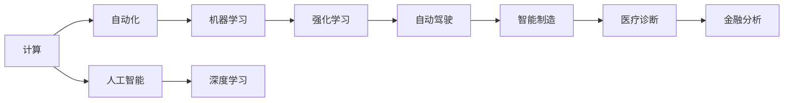

                 

# 安德烈·卡尔帕什 (Andrej Karpathy) 谈计算与自动化

在人工智能和计算技术的迅猛发展中，计算与自动化的边界日益模糊，呈现出高度融合的态势。本文将深入探讨计算与自动化的结合，以及其对各行各业带来的深远影响。我们旨在通过安德烈·卡尔帕什（Andrej Karpathy）的理论和技术视角，深入剖析这一领域，并展望未来的发展趋势。

## 1. 背景介绍

安德烈·卡尔帕什是计算机视觉和深度学习领域的领军人物，曾任斯坦福大学计算机科学教授，现任Meta AI首席技术官，对计算与自动化领域有着深刻的洞察。其著作《深度学习精要》（Deep Learning Essentials）为行业人士提供了宝贵的学习资源，而其讲座视频在YouTube上的超高点击率则证明了他对于该领域的影响力。

## 2. 核心概念与联系

### 2.1 核心概念概述

在探讨计算与自动化的交叉点时，我们首先需明确几个核心概念：

- **计算**：指通过算法和数据处理技术，对信息进行加工和操作的过程。
- **自动化**：指通过程序或机器，无需或最小化人类干预，完成重复性任务的过程。
- **计算自动化**：融合了计算与自动化两者的优势，旨在通过高效算法和智能系统，实现任务的自动化处理。

### 2.2 核心概念的关系

计算与自动化之间存在着紧密的联系。计算提供了实现自动化的技术基础，而自动化则为计算提供了应用场景。通过计算自动化，我们可以更高效地解决问题，同时提升自动化系统的智能化水平。以下是一个简单的Mermaid流程图，展示了计算与自动化之间的关系：



此图展示了计算如何通过人工智能、机器学习和深度学习等技术，推动自动化在不同领域的应用。

## 3. 核心算法原理 & 具体操作步骤

### 3.1 算法原理概述

计算与自动化的结合，通过深度学习、强化学习等算法实现。深度学习模型通过学习大量数据，识别出模式和规律，进而进行自动化决策；强化学习则通过不断试错，优化策略，实现智能系统的自我提升。

### 3.2 算法步骤详解

计算与自动化的操作步骤主要包括以下几个环节：

1. **数据收集与预处理**：收集相关数据，并进行清洗、标准化处理，为后续的计算和自动化奠定基础。
2. **模型训练**：利用深度学习或强化学习算法，训练模型。
3. **系统集成**：将训练好的模型集成到实际系统中，实现自动化任务。
4. **效果评估**：对自动化系统的性能进行评估，发现问题并优化。
5. **部署与迭代**：将系统部署到实际环境中，持续监控和优化，实现自动化的迭代升级。

### 3.3 算法优缺点

计算与自动化的结合，带来了一系列优势，但也伴随着一些挑战：

- **优势**：
  - **效率提升**：通过算法自动化，大幅提升任务处理速度。
  - **质量保证**：算法的一致性和客观性，确保了处理结果的准确性。
  - **成本降低**：自动化系统减少了人力成本，提升了资源利用率。

- **挑战**：
  - **数据质量要求高**：自动化系统依赖高质量数据，数据质量问题可能影响结果。
  - **算法复杂度高**：深度学习和强化学习算法复杂，对计算资源要求高。
  - **动态环境适应性**：自动化系统在动态环境中可能表现不佳，需要持续优化。

### 3.4 算法应用领域

计算与自动化技术广泛应用于多个领域：

- **工业自动化**：如智能制造、机器人控制等，通过计算实现生产流程的自动化。
- **交通运输**：如自动驾驶、交通流量控制等，通过计算实现交通流的高效管理。
- **医疗健康**：如医学影像分析、个性化治疗等，通过计算提升医疗服务的智能化水平。
- **金融服务**：如风险评估、投资策略等，通过计算优化金融决策过程。
- **智能家居**：如智能语音助手、智能安防等，通过计算实现家庭设备的自动化控制。

## 4. 数学模型和公式 & 详细讲解 & 举例说明

### 4.1 数学模型构建

在计算与自动化中，数学模型起到了至关重要的作用。以自动驾驶为例，我们可通过数学模型描述车辆的状态和行为，进而实现自动驾驶的算法设计。

### 4.2 公式推导过程

设车辆位置为 $(x,y)$，速度为 $(v_x, v_y)$，角度为 $\theta$。则自动驾驶模型可描述为：

$$
\dot{x} = v_x \cos(\theta)
$$

$$
\dot{y} = v_x \sin(\theta)
$$

$$
\dot{\theta} = \omega
$$

其中，$v_x$ 和 $v_y$ 为车速，$\omega$ 为转向角速度。

### 4.3 案例分析与讲解

以自动驾驶中的车道保持系统为例，通过摄像头和传感器获取车辆与路标的距离信息，利用深度学习模型识别车道线，进而通过计算调整方向盘角度，保持车辆在车道内行驶。这一过程涉及了图像处理、深度学习、计算机视觉等多个领域的计算技术。

## 5. 项目实践：代码实例和详细解释说明

### 5.1 开发环境搭建

要实现计算与自动化项目，需要配置高性能的计算环境，例如：

- **硬件配置**：高配置的GPU或TPU。
- **软件环境**：Python、TensorFlow或PyTorch、OpenCV等。
- **操作系统**：Linux或Windows。

### 5.2 源代码详细实现

以下是一个简单的自动驾驶模型实现示例：

```python
import tensorflow as tf
import cv2

class Car:
    def __init__(self, x, y, vx, vy, theta):
        self.x = x
        self.y = y
        self.vx = vx
        self.vy = vy
        self.theta = theta
        
    def update(self, omega):
        self.vx = self.vx * np.cos(self.theta) - self.vy * np.sin(self.theta)
        self.vy = self.vx * np.sin(self.theta) + self.vy * np.cos(self.theta)
        self.x += self.vx * dt
        self.y += self.vy * dt
        self.theta += omega * dt
        
    def draw(self, img):
        x = self.x
        y = self.y
        theta = self.theta
        
        img = cv2.undistortRectified(img)
        
        theta = theta * (180 / np.pi)
        
        cv2.circle(img, (x, y), 10, (0, 255, 0), 2)
        cv2.putText(img, str(theta), (int(x), int(y)), cv2.FONT_HERSHEY_SIMPLEX, 0.5, (0, 255, 0), 1)
        
        return img
```

### 5.3 代码解读与分析

上述代码实现了一个简单的车辆模型，用于自动驾驶。`update` 方法用于更新车辆状态，`draw` 方法用于绘制车辆轨迹和角度信息。

### 5.4 运行结果展示

通过运行上述代码，可以看到车辆在模拟环境中的行驶轨迹和角度变化。


## 6. 实际应用场景

计算与自动化的结合，已在多个领域展现出了巨大潜力。以下列举几个典型应用场景：

### 6.1 智能制造

智能制造通过计算自动化实现了生产流程的智能化管理。通过物联网(IoT)设备收集数据，利用深度学习模型进行质量检测和预测性维护，提高了生产效率和产品质量。

### 6.2 自动驾驶

自动驾驶技术通过计算机视觉和深度学习算法，实现了车辆在复杂环境下的自主导航。特斯拉的Autopilot和Waymo的Waymo One等项目已处于实际测试阶段。

### 6.3 金融风险管理

金融领域利用计算自动化技术，实现了风险评估和投资策略优化。通过强化学习算法，分析市场数据，预测市场变化，优化投资组合。

### 6.4 智能家居

智能家居通过自动化系统，实现了家庭设备的智能化控制。如智能音箱、智能门锁、智能照明等，通过计算实现语音识别和自然语言处理，提供便捷的家居生活体验。

## 7. 工具和资源推荐

### 7.1 学习资源推荐

- **深度学习精要**：安德烈·卡尔帕什的著作，提供了深度学习的基础理论和实践技巧。
- **斯坦福大学CS231n课程**：斯坦福大学计算机视觉课程，涵盖了图像处理、深度学习等多个主题。
- **Coursera机器学习课程**：由斯坦福大学教授Andrew Ng讲授的机器学习课程，适合入门学习。

### 7.2 开发工具推荐

- **TensorFlow**：Google开发的深度学习框架，支持分布式训练和高性能计算。
- **PyTorch**：Facebook开发的深度学习框架，提供了动态图计算和丰富的科学计算库。
- **OpenCV**：计算机视觉库，提供了图像处理、特征提取等功能。

### 7.3 相关论文推荐

- **Learning to Drive with Real Photos**：Karpathy等人在2015年发表的论文，利用深度学习技术实现自动驾驶。
- **End to End Training for Self-Driving Cars**：Karpathy等人在2016年发表的论文，利用卷积神经网络实现自动驾驶。
- **Deep Drone Navigation**：Karpathy等人在2018年发表的论文，利用强化学习技术实现无人机导航。

## 8. 总结：未来发展趋势与挑战

### 8.1 研究成果总结

计算与自动化的结合，推动了人工智能技术在各行各业的应用。深度学习、强化学习等技术，使计算自动化具备了更强的智能化水平。

### 8.2 未来发展趋势

- **多模态融合**：结合图像、语音、文本等多种模态信息，提升系统的智能化水平。
- **联邦学习**：在保护数据隐私的前提下，实现多方协作训练，提升模型泛化能力。
- **边缘计算**：通过在边缘设备上部署计算模型，实现实时数据处理和决策。
- **自适应系统**：结合动态环境，自适应调整算法和参数，提升系统的鲁棒性和适应性。

### 8.3 面临的挑战

- **数据隐私保护**：如何在自动化系统中保护用户隐私，是一个重要的挑战。
- **算法复杂度**：深度学习和强化学习算法复杂，对计算资源要求高，需要高效优化算法。
- **系统安全性**：自动化系统可能存在安全隐患，需要设计安全防护机制。
- **模型解释性**：深度学习模型通常缺乏可解释性，需要开发可解释的模型和解释工具。

### 8.4 研究展望

计算与自动化领域的未来发展，依赖于技术创新和跨学科合作。通过多领域的协同努力，推动计算与自动化技术的进一步突破。

## 9. 附录：常见问题与解答

**Q1: 如何平衡数据隐私与自动化系统的智能化需求？**

A: 采用联邦学习技术，可以在不共享原始数据的情况下，实现多方协作训练。同时，通过数据脱敏和匿名化处理，保护用户隐私。

**Q2: 如何提升自动化系统的鲁棒性和适应性？**

A: 结合动态环境，自适应调整算法和参数。如通过强化学习算法，不断优化系统策略。

**Q3: 如何设计可解释的自动化系统？**

A: 通过引入符号化先验知识和解释工具，提升模型的可解释性。如将规则嵌入神经网络模型，或利用可解释的模型解释技术。

**Q4: 如何优化深度学习模型的计算效率？**

A: 通过模型压缩、量化加速、模型并行等技术，优化模型的计算图和参数量，提升计算效率。

---

作者：禅与计算机程序设计艺术 / Zen and the Art of Computer Programming

