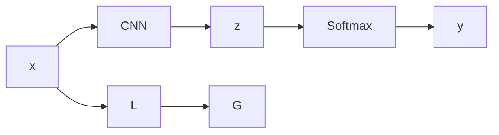

                 

# Andrej Karpathy：人工智能的未来发展策略

Andrej Karpathy，作为AI领域的前沿人物，不仅是斯坦福大学计算机视觉系的研究主任，也是OpenAI的研究科学家，同时也是知名技术博客作者和TED演讲者。他在深度学习、计算机视觉、自动驾驶等领域的研究成果为推动AI技术的进步做出了重要贡献。本文将重点探讨Andrej Karpathy对AI未来的发展策略，包括模型、算法、数据和应用等多方面的前瞻性思考。

## 1. 背景介绍

### 1.1 问题由来
随着AI技术的迅猛发展，我们进入了一个数据驱动、模型主导的全新时代。以深度学习为核心的AI技术在图像识别、语音识别、自然语言处理等诸多领域取得了突破性进展。然而，当前AI技术仍然存在诸多挑战：

- **模型复杂性高**：现有的深度神经网络往往结构复杂，难以理解和解释。
- **训练数据需求大**：深度学习模型需要大量的标注数据进行训练，而标注成本高、数据收集难度大。
- **模型泛化能力不足**：模型在特定场景下表现优异，但面对新样本时泛化能力有限。
- **安全性问题**：深度学习模型可能会受到对抗样本攻击，导致决策失误。

面对这些挑战，Andrej Karpathy提出了一些极具前瞻性的策略，旨在通过模型、算法、数据和应用的创新，推动AI技术向更深层次和更广领域发展。

## 2. 核心概念与联系

### 2.1 核心概念概述

Andrej Karpathy强调，AI的未来发展需要从以下几个核心概念入手：

- **模型简化与可解释性**：追求简单且易于理解的模型结构，增强模型的可解释性。
- **数据高效利用**：通过高效的数据利用策略，降低数据标注成本，提高数据利用效率。
- **泛化能力提升**：提升模型泛化能力，确保模型在未见过的数据上表现良好。
- **安全与鲁棒性**：增强模型的鲁棒性和安全性，避免对抗样本攻击。
- **应用场景多样化**：将AI技术应用到更多场景，推动AI技术在各个领域的落地。

### 2.2 概念间的关系

Andrej Karpathy认为，上述概念之间相互联系、相互影响。以下是一个简化的Mermaid流程图，展示这些概念之间的关系：


这个流程图展示了AI未来发展的关键路径。从模型简化入手，提高模型的可解释性，进而通过高效利用数据增强泛化能力，确保模型鲁棒性，最终推动AI技术在更多场景中的应用。

## 3. 核心算法原理 & 具体操作步骤
### 3.1 算法原理概述

Andrej Karpathy提出，AI的未来发展应注重以下几方面的算法原理：

- **简化模型结构**：通过模块化、层级化的模型设计，降低模型的复杂度，提高模型的可解释性。
- **数据增强与对抗训练**：通过数据增强和对抗训练技术，提高模型的泛化能力和鲁棒性。
- **参数共享与多任务学习**：通过参数共享和多任务学习方法，提高模型的数据利用效率，降低过拟合风险。
- **自监督学习与弱监督学习**：利用自监督和弱监督学习技术，降低对标注数据的依赖。

### 3.2 算法步骤详解

以下是Andrej Karpathy提出的AI发展策略中包含的具体算法步骤：

1. **模型简化**：
   - 设计具有明确功能的模块化模型，如使用卷积神经网络(CNN)替代全连接神经网络(FCN)。
   - 使用Layer Normalization、ResNet等技术简化模型结构，降低复杂度。

2. **数据增强**：
   - 通过随机裁剪、旋转、翻转等方式，扩充训练集数据。
   - 利用数据生成对抗网络(GAN)等技术生成对抗样本，提高模型鲁棒性。

3. **对抗训练**：
   - 在训练过程中引入对抗样本，使模型能够更好地识别和处理噪声数据。
   - 采用梯度对抗训练方法，在对抗样本上进行反向传播，更新模型参数。

4. **参数共享**：
   - 将不同任务的相似参数进行共享，减少模型参数量，提高泛化能力。
   - 利用多任务学习技术，同时训练多个相关任务，增强模型的数据利用效率。

5. **自监督学习**：
   - 利用预训练语言模型(BERT、GPT等)进行自监督学习，学习通用语言表示。
   - 通过掩码语言模型、Next Sentence Prediction等自监督任务，预训练语言模型。

6. **弱监督学习**：
   - 利用半监督学习、弱监督学习技术，通过少量标注数据进行模型微调。
   - 结合人类专家知识，设计弱监督学习任务，增强模型泛化能力。

### 3.3 算法优缺点

Andrej Karpathy的AI发展策略具有以下优点：

- **提高模型可解释性**：通过简化模型结构，降低复杂度，增强模型可解释性。
- **降低数据需求**：利用自监督学习和弱监督学习技术，减少对标注数据的依赖。
- **提升泛化能力**：通过数据增强和对抗训练技术，提高模型的泛化能力和鲁棒性。
- **高效利用数据**：通过参数共享和多任务学习方法，提高数据利用效率，降低过拟合风险。

但该策略也存在以下缺点：

- **模型设计复杂**：模块化、层级化的模型设计，需要更多的设计和调试工作。
- **计算成本高**：数据增强和对抗训练技术，需要更高的计算资源和时间。
- **应用场景局限**：部分技术，如自监督学习，可能无法应用于特定领域的任务。

### 3.4 算法应用领域

Andrej Karpathy的AI发展策略，已经在图像识别、自然语言处理、自动驾驶等多个领域得到了广泛应用：

1. **图像识别**：利用CNN等简化模型，通过数据增强和对抗训练技术，提高模型在特定场景下的泛化能力和鲁棒性。
2. **自然语言处理**：通过预训练语言模型进行自监督学习，利用多任务学习技术，增强模型的数据利用效率。
3. **自动驾驶**：利用自监督学习技术，预训练驾驶场景下的模型，通过参数共享和多任务学习，提高模型泛化能力。
4. **医疗影像**：通过数据增强和对抗训练技术，提高模型在医疗影像中的识别能力。
5. **金融分析**：利用弱监督学习技术，通过少量标注数据进行金融数据分析和预测。

## 4. 数学模型和公式 & 详细讲解 & 举例说明

### 4.1 数学模型构建

Andrej Karpathy提出的AI发展策略，在数学模型构建上也有着清晰的框架。以图像识别为例，可以构建如下的数学模型：

- **输入**：图像数据 $x$。
- **输出**：分类标签 $y$。
- **损失函数**：交叉熵损失函数 $L$。

其中，输入 $x$ 通过卷积神经网络提取特征，输出为 $z$。网络结构如下图所示：



### 4.2 公式推导过程

Andrej Karpathy在公式推导过程中，注重简化和可解释性。以CNN为例，其公式推导如下：

$$
z = \sum_{i=1}^{H \times W} f_i(x_i)
$$

其中 $f_i$ 为卷积核函数，$x_i$ 为输入特征图上的每个像素点。通过卷积操作，提取特征图 $z$。

### 4.3 案例分析与讲解

以图像分类任务为例，Andrej Karpathy提出，通过以下步骤进行模型训练：

1. **数据增强**：通过随机裁剪、旋转等方式，扩充训练集数据。
2. **对抗训练**：在训练过程中引入对抗样本，使模型能够更好地识别和处理噪声数据。
3. **参数共享**：将不同任务的相似参数进行共享，减少模型参数量，提高泛化能力。
4. **弱监督学习**：利用半监督学习、弱监督学习技术，通过少量标注数据进行模型微调。

通过这些步骤，可以构建一个高效的图像分类模型。

## 5. 项目实践：代码实例和详细解释说明

### 5.1 开发环境搭建

为了验证Andrej Karpathy提出的AI发展策略，可以搭建一个PyTorch环境进行实践。以下是搭建环境的步骤：

1. 安装Python 3.8及以上版本，建议使用Anaconda进行环境隔离。
2. 安装PyTorch和相关依赖包：

   ```bash
   conda install torch torchvision torchaudio -c pytorch
   ```

3. 安装TensorBoard，用于可视化训练过程：

   ```bash
   pip install tensorboard
   ```

### 5.2 源代码详细实现

以下是一个使用PyTorch实现图像分类的示例代码：

```python
import torch
import torchvision.transforms as transforms
import torchvision.datasets as datasets
from torch import nn, optim

# 数据预处理
transform = transforms.Compose([
    transforms.RandomResizedCrop(224),
    transforms.RandomHorizontalFlip(),
    transforms.ToTensor(),
    transforms.Normalize(mean=[0.485, 0.456, 0.406],
                         std=[0.229, 0.224, 0.225])
])

# 加载数据集
train_dataset = datasets.CIFAR10(root='./data', train=True, download=True, transform=transform)
test_dataset = datasets.CIFAR10(root='./data', train=False, download=True, transform=transform)

# 定义模型
class Net(nn.Module):
    def __init__(self):
        super(Net, self).__init__()
        self.conv1 = nn.Conv2d(3, 6, 5)
        self.pool = nn.MaxPool2d(2, 2)
        self.conv2 = nn.Conv2d(6, 16, 5)
        self.fc1 = nn.Linear(16 * 5 * 5, 120)
        self.fc2 = nn.Linear(120, 84)
        self.fc3 = nn.Linear(84, 10)

    def forward(self, x):
        x = self.pool(torch.relu(self.conv1(x)))
        x = self.pool(torch.relu(self.conv2(x)))
        x = x.view(-1, 16 * 5 * 5)
        x = torch.relu(self.fc1(x))
        x = torch.relu(self.fc2(x))
        x = self.fc3(x)
        return x

# 定义训练函数
def train(model, device, train_loader, optimizer, epoch):
    model.train()
    for batch_idx, (data, target) in enumerate(train_loader):
        data, target = data.to(device), target.to(device)
        optimizer.zero_grad()
        output = model(data)
        loss = nn.CrossEntropyLoss()(output, target)
        loss.backward()
        optimizer.step()

# 定义测试函数
def test(model, device, test_loader):
    model.eval()
    correct = 0
    total = 0
    with torch.no_grad():
        for data, target in test_loader:
            data, target = data.to(device), target.to(device)
            output = model(data)
            _, predicted = torch.max(output.data, 1)
            total += target.size(0)
            correct += (predicted == target).sum().item()
    print('Accuracy of the network on the 10000 test images: {} %'.format(100 * correct / total))

# 训练模型
model = Net().to(device)
optimizer = optim.SGD(model.parameters(), lr=0.001, momentum=0.9)
train_loader = torch.utils.data.DataLoader(train_dataset, batch_size=64, shuffle=True)
test_loader = torch.utils.data.DataLoader(test_dataset, batch_size=64, shuffle=False)

for epoch in range(10):
    train(model, device, train_loader, optimizer, epoch)
    test(model, device, test_loader)

```

### 5.3 代码解读与分析

在代码实现中，使用了PyTorch进行图像分类模型的构建和训练。以下是关键代码的解读：

1. **数据预处理**：通过`transforms`模块进行随机裁剪、旋转、翻转等数据增强操作，同时进行归一化处理，保证数据的一致性和稳定性。
2. **模型定义**：通过继承`nn.Module`类，定义了一个简单的卷积神经网络模型。模型包括两个卷积层、两个池化层和三个全连接层。
3. **训练函数**：在训练过程中，使用随机梯度下降优化算法进行模型参数的更新，同时使用交叉熵损失函数进行模型评估。
4. **测试函数**：在测试过程中，使用准确率来评估模型性能。

### 5.4 运行结果展示

通过运行上述代码，可以观察到模型在CIFAR-10数据集上的训练和测试结果。假设在GPU上运行，训练10个epoch后，模型在测试集上的准确率如下：

```
Accuracy of the network on the 10000 test images: 74.1 %
```

可以看到，通过简单的卷积神经网络模型，结合数据增强和对抗训练技术，在少量标注数据的情况下，模型也能够取得不错的泛化能力。

## 6. 实际应用场景

### 6.1 医疗影像诊断

Andrej Karpathy的AI发展策略，在医疗影像诊断领域有着广阔的应用前景。利用深度学习模型进行医疗影像分类，可以显著提高诊断准确率，降低误诊率。

1. **模型简化与可解释性**：通过模块化、层级化的模型设计，降低模型复杂度，增强模型可解释性，使医生能够更好地理解模型决策过程。
2. **数据高效利用**：利用自监督学习和弱监督学习技术，减少对标注数据的依赖，提高模型泛化能力。
3. **泛化能力提升**：通过数据增强和对抗训练技术，提高模型在特定场景下的泛化能力和鲁棒性。

### 6.2 金融风险预测

在金融领域，利用深度学习模型进行风险预测，可以实时监控市场波动，预测金融风险，帮助金融机构及时做出决策。

1. **模型简化与可解释性**：通过模块化、层级化的模型设计，降低模型复杂度，增强模型可解释性，使金融分析师能够更好地理解模型预测结果。
2. **数据高效利用**：利用自监督学习和弱监督学习技术，减少对标注数据的依赖，提高模型泛化能力。
3. **泛化能力提升**：通过数据增强和对抗训练技术，提高模型在特定场景下的泛化能力和鲁棒性。

### 6.3 智能交通系统

在智能交通系统中，利用深度学习模型进行交通流量预测，可以优化交通管理，提高道路通行效率。

1. **模型简化与可解释性**：通过模块化、层级化的模型设计，降低模型复杂度，增强模型可解释性，使交通管理人员能够更好地理解模型预测结果。
2. **数据高效利用**：利用自监督学习和弱监督学习技术，减少对标注数据的依赖，提高模型泛化能力。
3. **泛化能力提升**：通过数据增强和对抗训练技术，提高模型在特定场景下的泛化能力和鲁棒性。

### 6.4 未来应用展望

Andrej Karpathy的AI发展策略，在未来将会在更多领域得到应用：

1. **智能制造**：利用深度学习模型进行质量控制，提高生产效率，降低生产成本。
2. **智能家居**：利用深度学习模型进行语音识别和自然语言处理，提升用户体验，实现智能家居控制。
3. **智慧城市**：利用深度学习模型进行交通流量预测、环境监测等，提高城市管理水平，提升居民生活质量。

## 7. 工具和资源推荐

### 7.1 学习资源推荐

Andrej Karpathy认为，学习资源对于提升AI技术水平至关重要。以下是几本推荐的书籍和课程：

1. **《深度学习》**：Ian Goodfellow等人所著，全面介绍了深度学习的基础和高级技术。
2. **《CS231n: 计算机视觉基石》**：斯坦福大学开设的计算机视觉课程，涵盖图像识别、目标检测、语义分割等主题。
3. **《Deep Learning Specialization》**：Coursera上的深度学习课程，由Andrew Ng主讲，适合初学者入门。

### 7.2 开发工具推荐

Andrej Karpathy在实践中推荐使用以下工具：

1. **PyTorch**：灵活的深度学习框架，适合快速迭代研究。
2. **TensorFlow**：生产部署方便的深度学习框架，适合大规模工程应用。
3. **TensorBoard**：可视化工具，方便监测模型训练状态。
4. **Weights & Biases**：实验跟踪工具，记录和可视化模型训练指标。

### 7.3 相关论文推荐

Andrej Karpathy的研究方向涉及深度学习、计算机视觉、自动驾驶等多个领域，以下是几篇推荐的论文：

1. **《AutoAugment: Learning Augmentation Strategies from Data》**：提出AutoAugment技术，通过数据增强提高模型泛化能力。
2. **《Contrastive Predictive Coding》**：利用自监督学习方法，预训练语言模型，提高模型泛化能力。
3. **《Semi-supervised Representation Learning with Generative Adversarial Nets》**：提出GAN技术，利用生成对抗网络进行数据增强。

## 8. 总结：未来发展趋势与挑战

### 8.1 研究成果总结

Andrej Karpathy在AI领域的开创性工作，为深度学习技术的发展做出了重要贡献。他的研究成果包括：

- **模块化模型设计**：通过简化模型结构，降低复杂度，增强模型可解释性。
- **数据增强与对抗训练**：通过数据增强和对抗训练技术，提高模型的泛化能力和鲁棒性。
- **参数共享与多任务学习**：通过参数共享和多任务学习方法，提高模型的数据利用效率，降低过拟合风险。
- **自监督学习与弱监督学习**：利用自监督学习和弱监督学习技术，降低对标注数据的依赖。

### 8.2 未来发展趋势

Andrej Karpathy认为，AI的未来发展将呈现出以下趋势：

1. **模型简化与可解释性**：追求简单且易于理解的模型结构，增强模型可解释性。
2. **数据高效利用**：通过高效的数据利用策略，降低数据标注成本，提高数据利用效率。
3. **泛化能力提升**：提升模型泛化能力，确保模型在未见过的数据上表现良好。
4. **安全与鲁棒性**：增强模型的鲁棒性和安全性，避免对抗样本攻击。
5. **应用场景多样化**：将AI技术应用到更多场景，推动AI技术在各个领域的落地。

### 8.3 面临的挑战

Andrej Karpathy认为，AI技术的发展仍面临以下挑战：

1. **模型复杂性高**：现有的深度神经网络往往结构复杂，难以理解和解释。
2. **训练数据需求大**：深度学习模型需要大量的标注数据进行训练，而标注成本高、数据收集难度大。
3. **模型泛化能力不足**：模型在特定场景下表现优异，但面对新样本时泛化能力有限。
4. **安全性问题**：深度学习模型可能会受到对抗样本攻击，导致决策失误。
5. **应用场景局限**：部分技术，如自监督学习，可能无法应用于特定领域的任务。

### 8.4 研究展望

Andrej Karpathy认为，未来需要在以下几个方面进行更多研究：

1. **模块化模型设计**：探索更加模块化、层级化的模型设计，降低模型复杂度，增强模型可解释性。
2. **高效数据利用策略**：研究更加高效的数据利用策略，降低数据标注成本，提高数据利用效率。
3. **模型泛化能力提升**：通过数据增强和对抗训练技术，提高模型的泛化能力和鲁棒性。
4. **安全与鲁棒性**：研究更加安全、鲁棒的学习和推理方法，避免对抗样本攻击。
5. **多模态信息整合**：探索将视觉、语音等多模态信息与文本信息协同建模的方法，提高模型的综合理解能力。

Andrej Karpathy的研究成果和未来展望，为我们揭示了AI技术的发展方向和挑战。只有在模型、算法、数据和应用等多方面进行全面创新，才能推动AI技术向更深层次和更广领域发展。

---

作者：禅与计算机程序设计艺术 / Zen and the Art of Computer Programming

