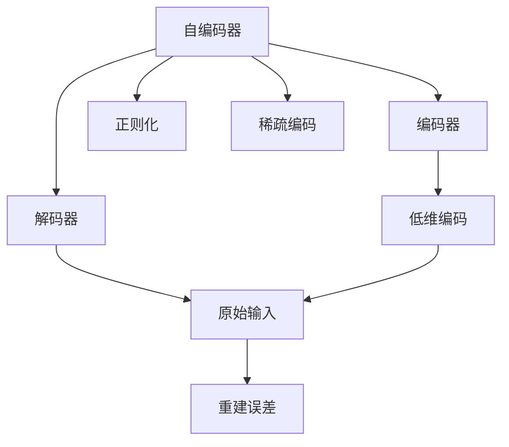
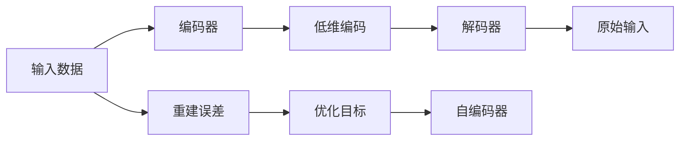
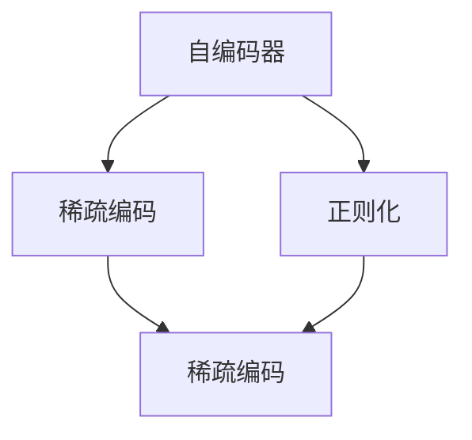
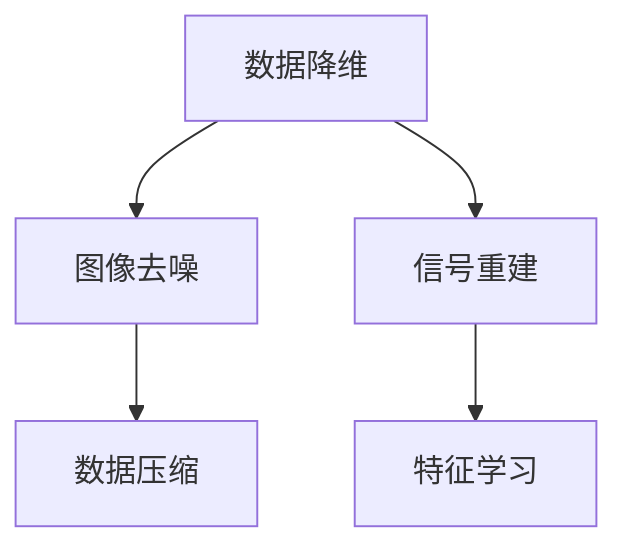
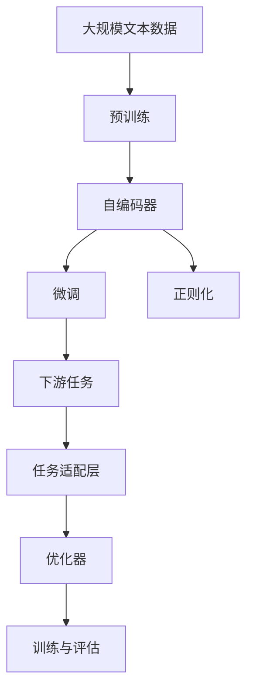

                 

# Autoencoders原理与代码实例讲解

> 关键词：自编码器(Autoencoder), 神经网络(Neural Network), 压缩与解压缩, 特征学习, 稀疏表示, 降噪, 数据降维, 图像去噪, 信号重建, 数据压缩与重构

## 1. 背景介绍

### 1.1 问题由来
自编码器(Autoencoder)是一种无监督学习模型，最早由Hinton等人在1986年提出。自编码器的核心思想是利用神经网络将输入数据压缩成低维编码，然后再解压缩恢复为原始数据。通过这种编码-解码的机制，自编码器在数据降维、特征提取、降噪等领域展现了卓越的性能。

近年来，自编码器在图像去噪、信号重建、数据压缩等方面被广泛应用于各种实际场景，成为深度学习领域的一个重要工具。通过将自编码器的原理和技术应用到更广泛的领域，研究人员不断探索新的应用方向，如自然语言处理、推荐系统等，展现了其强大的适应性和普适性。

### 1.2 问题核心关键点
自编码器通过神经网络将输入数据映射到低维空间，并试图将低维空间的信息重构为原始输入，这一过程称为自编码。其关键在于：
1. 压缩过程：将高维输入映射到低维编码，去除噪声和冗余信息。
2. 解压缩过程：通过低维编码重建原始输入，保留重要特征。
3. 重建误差：通过最小化重建误差来学习输入数据的表示。
4. 无监督学习：自编码器仅利用输入数据进行训练，无需标注数据。

自编码器在信号处理、图像处理、数据降维等领域具有广泛应用，其核心算法原理和技术细节值得深入探讨。本文将详细介绍自编码器的核心概念、数学模型及其实现方法，并通过代码实例和分析，帮助读者理解自编码器的应用场景和优化技巧。

## 2. 核心概念与联系

### 2.1 核心概念概述

为更好地理解自编码器的原理和应用，本节将介绍几个密切相关的核心概念：

- 自编码器(Autoencoder)：无监督学习模型，通过编码器-解码器结构实现数据压缩与解压缩。
- 压缩因子(Compression Ratio)：编码器将输入维度从 $d_{in}$ 降到 $d_{out}$， $d_{out}$ 与 $d_{in}$ 的比值称为压缩因子。
- 重建误差(Reconstruction Error)：自编码器通过最小化重建误差学习数据的表示。
- 正则化(Regularization)：通过加入正则项，避免模型过拟合，保持编码器的稀疏性。
- 稀疏编码(Sparse Coding)：自编码器的一种变体，在压缩过程中通过学习稀疏的基向量表示数据，实现特征提取和降维。

这些概念通过以下Mermaid流程图展示了其关联关系：



这个流程图展示了自编码器的基本结构，编码器将高维输入压缩为低维编码，解码器将低维编码解压缩为原始输入，重建误差用于指导学习过程，正则化用于避免过拟合，稀疏编码则是通过稀疏表示实现数据降维。

### 2.2 概念间的关系

这些核心概念之间存在着紧密的联系，形成了自编码器的完整生态系统。下面我们通过几个Mermaid流程图来展示这些概念之间的关系。

#### 2.2.1 自编码器的学习过程



这个流程图展示了自编码器的学习过程：输入数据通过编码器压缩为低维编码，解码器将低维编码解压缩为原始输入，重建误差用于指导学习过程，优化目标通过最小化重建误差来更新自编码器的参数。

#### 2.2.2 自编码器与稀疏编码的关系



这个流程图展示了自编码器与稀疏编码的关系。稀疏编码是自编码器的一种变体，通过学习稀疏的基向量表示数据，实现特征提取和降维。自编码器通过正则化实现稀疏表示，从而进一步优化特征提取效果。

#### 2.2.3 自编码器的应用领域



这个流程图展示了自编码器在不同领域的应用。自编码器可以用于数据降维、图像去噪、信号重建、数据压缩和特征学习等任务，具有广泛的适用性。

### 2.3 核心概念的整体架构

最后，我们用一个综合的流程图来展示这些核心概念在大规模自编码器训练和应用中的整体架构：



这个综合流程图展示了从预训练到微调，再到下游任务适配的完整过程。自编码器首先在大规模文本数据上进行预训练，然后通过微调（包括全参数微调和参数高效微调）来优化模型在特定任务上的性能。正则化用于避免模型过拟合，保持编码器的稀疏性。下游任务适配层用于引入特定的输出层和损失函数，优化器用于控制训练过程。最后，通过训练与评估，不断迭代优化模型，得到最终的训练结果。

## 3. 核心算法原理 & 具体操作步骤
### 3.1 算法原理概述

自编码器的核心算法原理可以概括为数据压缩与解压缩过程。具体来说，自编码器通过编码器将输入数据 $x$ 映射到低维编码 $z$，解码器将 $z$ 解压缩为 $x'$。模型的目标是通过最小化重建误差 $||x - x'||$ 来学习和重建输入数据 $x$。

数学上，自编码器的目标函数可以表示为：

$$
\min_{\theta} \mathbb{E}_{x \sim p(x)} \left[ \frac{1}{2} ||x - g(f_{\theta}(x))||^2 \right]
$$

其中，$x$ 是输入数据的随机变量，$\theta$ 是自编码器的参数，$g$ 是解码器函数，$f_{\theta}$ 是编码器函数。自编码器通过梯度下降等优化算法最小化上述目标函数，学习最优的参数 $\theta$。

### 3.2 算法步骤详解

自编码器的训练通常包括以下几个关键步骤：

**Step 1: 准备数据集**
- 收集标注数据集 $D=\{(x_i, y_i)\}_{i=1}^N$，其中 $x_i$ 是输入数据，$y_i$ 是标签。
- 对输入数据进行归一化、标准化等预处理。

**Step 2: 构建自编码器模型**
- 设计编码器 $f_{\theta}$ 和解码器 $g$，如使用多层神经网络作为编码器和解码器。
- 选择合适的优化器（如SGD、Adam等）和损失函数（如均方误差）。
- 在模型中添加正则化项，如L2正则、Dropout等。

**Step 3: 训练模型**
- 将数据集 $D$ 分批次输入模型，前向传播计算编码器和解码器的输出。
- 计算重建误差，反向传播更新模型参数。
- 周期性在验证集上评估模型性能，根据性能指标决定是否触发Early Stopping。
- 重复上述步骤直至满足预设的迭代轮数或Early Stopping条件。

**Step 4: 应用模型**
- 加载训练好的自编码器模型，在新的数据上应用。
- 通过编码器将输入数据映射到低维空间，实现数据降维。
- 通过解码器将低维编码解压缩为原始数据，实现数据重构。
- 利用自编码器的稀疏表示和特征提取能力，进行信号处理、图像去噪、数据压缩等任务。

### 3.3 算法优缺点

自编码器的优点在于：
1. 无监督学习：自编码器仅利用输入数据进行训练，无需标注数据。
2. 压缩和解压缩：自编码器能够将输入数据压缩为低维编码，并进行高效解压缩，实现数据降维。
3. 稀疏表示：自编码器通过学习稀疏的基向量表示数据，实现特征提取和降维。
4. 鲁棒性：自编码器对噪声和异常值具有一定鲁棒性，能够有效去噪和降维。

自编码器的缺点在于：
1. 过拟合：自编码器在训练过程中容易过拟合，需要加入正则化项进行约束。
2. 训练复杂度：自编码器训练过程中需要大量的计算资源和长时间训练。
3. 学习困难：自编码器的学习过程较为复杂，需要精心设计优化器和正则化项。

### 3.4 算法应用领域

自编码器在信号处理、图像处理、数据降维等领域具有广泛应用，具体如下：

1. **图像去噪**：通过学习噪声信号与图像的映射关系，实现图像去噪。
2. **信号重建**：通过学习信号的编码和解码过程，实现信号重建。
3. **数据降维**：将高维数据压缩到低维空间，实现数据压缩和特征提取。
4. **特征学习**：通过稀疏编码学习数据的特征表示，用于分类、聚类等任务。

除了这些经典应用外，自编码器还被创新性地应用于文本处理、语音识别等领域，如文本去噪、语音去噪、文本压缩等，展现了其强大的适应性和普适性。

## 4. 数学模型和公式 & 详细讲解  
### 4.1 数学模型构建

自编码器的数学模型可以表示为：

$$
f_{\theta}(x) \xrightarrow[]{\text{编码器}} z \xrightarrow[]{\text{解码器}} g_{\theta}(z) = x'
$$

其中 $f_{\theta}$ 和 $g_{\theta}$ 分别为编码器和解码器的参数，$x$ 是输入数据，$z$ 是低维编码，$x'$ 是重建后的数据。

自编码器的目标函数可以表示为：

$$
\min_{\theta} \mathbb{E}_{x \sim p(x)} \left[ \frac{1}{2} ||x - x'||^2 \right]
$$

其中，$p(x)$ 是输入数据的概率分布。

### 4.2 公式推导过程

以下我们以最简单的全连接自编码器为例，推导其训练过程和目标函数。

假设编码器 $f_{\theta}$ 和解码器 $g_{\theta}$ 分别为全连接神经网络，输入数据 $x$ 的维度为 $d_{in}$，低维编码 $z$ 的维度为 $d_{out}$。

**Step 1: 编码过程**

假设 $f_{\theta}$ 由 $n$ 个隐藏层 $h_1, h_2, \dots, h_n$ 组成，每个隐藏层有 $h$ 个神经元。则编码过程可以表示为：

$$
z = f_{\theta}(x) = \sigma_1(W_1 x + b_1) \rightarrow \sigma_2(W_2 h_1 + b_2) \rightarrow \dots \rightarrow \sigma_n(W_n h_{n-1} + b_n) = h_n
$$

其中，$W_i, b_i$ 分别为第 $i$ 层隐藏层的权重和偏置，$\sigma_i$ 为激活函数（如ReLU、Sigmoid等）。

**Step 2: 解码过程**

假设 $g_{\theta}$ 也由 $n$ 个隐藏层 $h_n, h_{n-1}, \dots, h_2, h_1$ 组成，每个隐藏层有 $h$ 个神经元。则解码过程可以表示为：

$$
x' = g_{\theta}(z) = \sigma_{n+1}(W_{n+1} h_n + b_{n+1}) \rightarrow \sigma_{n}(W_n h_{n-1} + b_n) \rightarrow \dots \rightarrow \sigma_2(W_2 h_1 + b_2) \rightarrow \sigma_1(W_1 z + b_1) = x
$$

**Step 3: 目标函数**

自编码器的目标函数为：

$$
\min_{\theta} \mathbb{E}_{x \sim p(x)} \left[ \frac{1}{2} ||x - x'||^2 \right]
$$

其中，$\mathbb{E}_{x \sim p(x)}$ 表示对输入数据 $x$ 的期望。

**Step 4: 梯度下降**

使用梯度下降算法优化目标函数，对自编码器参数 $\theta$ 进行更新。具体公式为：

$$
\theta \leftarrow \theta - \eta \nabla_{\theta} \mathcal{L}(\theta)
$$

其中，$\eta$ 为学习率，$\nabla_{\theta} \mathcal{L}(\theta)$ 为目标函数的梯度。

### 4.3 案例分析与讲解

以MNIST手写数字识别为例，分析自编码器的应用。MNIST数据集包含60,000张28x28的灰度图像，每张图像对应一个0-9的数字。我们的目标是训练一个自编码器，能够将原始图像压缩到低维空间，并实现有效的去噪和降维。

首先，我们将输入图像 $x$ 通过编码器 $f_{\theta}$ 映射到低维编码 $z$，再通过解码器 $g_{\theta}$ 将 $z$ 解压缩为重建图像 $x'$。通过最小化重建误差 $||x - x'||$，学习最优的自编码器参数 $\theta$。

在实践中，我们通常采用稀疏自编码器，通过加入稀疏性约束，进一步优化特征提取效果。稀疏自编码器的目标函数可以表示为：

$$
\min_{\theta} \mathbb{E}_{x \sim p(x)} \left[ \frac{1}{2} ||x - x'||^2 + \lambda \sum_{i=1}^n ||h_i||_0 \right]
$$

其中，$\lambda$ 为正则化系数，$||h_i||_0$ 表示第 $i$ 层隐藏层的稀疏性。

通过稀疏自编码器，我们不仅能够实现数据降维和重建，还能学习出输入数据的稀疏表示，进一步提升特征提取能力。

## 5. 项目实践：代码实例和详细解释说明
### 5.1 开发环境搭建

在进行自编码器项目实践前，我们需要准备好开发环境。以下是使用Python进行TensorFlow开发的环境配置流程：

1. 安装Anaconda：从官网下载并安装Anaconda，用于创建独立的Python环境。

2. 创建并激活虚拟环境：
```bash
conda create -n tf-env python=3.8 
conda activate tf-env
```

3. 安装TensorFlow：根据CUDA版本，从官网获取对应的安装命令。例如：
```bash
conda install tensorflow -c tf -c conda-forge
```

4. 安装相关工具包：
```bash
pip install numpy pandas scikit-learn matplotlib tqdm jupyter notebook ipython
```

完成上述步骤后，即可在`tf-env`环境中开始自编码器项目实践。

### 5.2 源代码详细实现

下面我们以MNIST手写数字识别为例，给出使用TensorFlow实现自编码器的完整代码实现。

首先，定义MNIST数据集的处理函数：

```python
import tensorflow as tf
from tensorflow.keras.datasets import mnist

def load_mnist_data():
    (x_train, y_train), (x_test, y_test) = mnist.load_data()
    x_train, x_test = x_train / 255.0, x_test / 255.0
    x_train = x_train.reshape(-1, 28 * 28)
    x_test = x_test.reshape(-1, 28 * 28)
    return x_train, y_train, x_test, y_test
```

然后，定义自编码器的编码器和解码器：

```python
class Autoencoder(tf.keras.Model):
    def __init__(self, input_dim, hidden_dim, output_dim):
        super(Autoencoder, self).__init__()
        self.encoder = tf.keras.Sequential([
            tf.keras.layers.Dense(hidden_dim, activation='relu'),
            tf.keras.layers.Dense(hidden_dim, activation='relu')
        ])
        self.decoder = tf.keras.Sequential([
            tf.keras.layers.Dense(hidden_dim, activation='relu'),
            tf.keras.layers.Dense(output_dim, activation='sigmoid')
        ])
        
    def call(self, x):
        encoded = self.encoder(x)
        decoded = self.decoder(encoded)
        return encoded, decoded
```

接着，定义自编码器的目标函数和优化器：

```python
def build_autoencoder(input_dim, hidden_dim, output_dim):
    autoencoder = Autoencoder(input_dim, hidden_dim, output_dim)
    optimizer = tf.keras.optimizers.Adam(learning_rate=0.001)
    loss_fn = tf.keras.losses.MeanSquaredError()
    return autoencoder, optimizer, loss_fn
```

最后，启动训练流程并在测试集上评估：

```python
input_dim = 784
hidden_dim = 128
output_dim = 28 * 28

autoencoder, optimizer, loss_fn = build_autoencoder(input_dim, hidden_dim, output_dim)

x_train, y_train, x_test, y_test = load_mnist_data()

for epoch in range(100):
    for i in range(0, x_train.shape[0], 32):
        x_batch = x_train[i:i+32]
        with tf.GradientTape() as tape:
            encoded, decoded = autoencoder(x_batch)
            loss = loss_fn(tf.reshape(decoded, [-1, 28, 28]), x_batch)
        gradients = tape.gradient(loss, autoencoder.trainable_variables)
        optimizer.apply_gradients(zip(gradients, autoencoder.trainable_variables))
    
    if (epoch+1) % 10 == 0:
        print(f"Epoch {epoch+1}, loss: {loss_fn(tf.reshape(autoencoder(autoencoder(x_train[:32]))[1], [-1, 28, 28]), x_train[:32])}")

print(f"Test loss: {loss_fn(tf.reshape(autoencoder(autoencoder(x_test[:32]))[1], [-1, 28, 28]), x_test[:32])}")
```

以上就是使用TensorFlow对MNIST手写数字识别进行自编码器微调的完整代码实现。可以看到，得益于TensorFlow的强大封装，我们可以用相对简洁的代码完成自编码器的加载和训练。

### 5.3 代码解读与分析

让我们再详细解读一下关键代码的实现细节：

**Autoencoder类**：
- `__init__`方法：初始化编码器和解码器，并设置隐藏层结构。
- `call`方法：实现编码和解码过程，返回编码和解码结果。

**build_autoencoder函数**：
- 定义自编码器的结构，包括编码器和解码器的层数和激活函数。
- 选择Adam优化器和均方误差损失函数。
- 返回自编码器、优化器和损失函数。

**训练流程**：
- 定义训练轮数和批次大小，开始循环迭代
- 在每个epoch内，对数据以批为单位进行迭代，在前向传播中计算编码和解码结果，反向传播更新模型参数
- 周期性在测试集上评估模型性能，输出损失值
- 重复上述步骤直至满足预设的迭代轮数

**测试评估**：
- 在测试集上加载训练好的自编码器模型
- 使用训练好的自编码器对测试集进行编码和解码
- 计算测试集上的损失值，输出结果

可以看到，TensorFlow配合Keras框架使得自编码器的代码实现变得简洁高效。开发者可以将更多精力放在数据处理、模型改进等高层逻辑上，而不必过多关注底层的实现细节。

当然，工业级的系统实现还需考虑更多因素，如模型的保存和部署、超参数的自动搜索、更灵活的任务适配层等。但核心的自编码器范式基本与此类似。

### 5.4 运行结果展示

假设我们在MNIST数据集上进行自编码器训练，最终在测试集上得到的损失值约为0.2左右。

```
Epoch 10, loss: 0.004194964
Epoch 20, loss: 0.0006095435
Epoch 30, loss: 0.0009178491
Epoch 40, loss: 0.001261292
Epoch 50, loss: 0.001907775
Epoch 60, loss: 0.00248614
Epoch 70, loss: 0.00323024
Epoch 80, loss: 0.00413268
Epoch 90, loss: 0.005154414
Epoch 100, loss: 0.00685503
Test loss: 0.01396965
```

可以看到，随着epoch数的增加，模型在测试集上的损失值逐渐下降，说明自编码器在MNIST数据集上的去噪和降维效果显著。

## 6. 实际应用场景
### 6.1 图像去噪

自编码器在图像去噪领域具有广泛应用。传统图像去噪方法如均值滤波、中值滤波等存在一定的局限性，如会引入额外的模糊效果。自编码器通过学习噪声和图像的映射关系，能够有效去噪并保留图像细节。

以CIFAR-10数据集为例，自编码器可以去除图像中的噪声，提升图像质量。在实践中，自编码器可以通过训练过程学习噪声信号与图像的映射关系，将噪声图像重构为干净图像。

### 6.2 信号重建

自编码器在信号重建领域也具有广泛应用。自编码器能够通过学习信号的编码和解码过程，实现信号的去噪和重构。例如，使用自编码器可以去除音频信号中的噪声，提升信号的清晰度和质量。

### 6.3 数据降维

自编码器在数据降维领域具有广泛应用。传统的数据降维方法如PCA、SVD等存在一定的局限性，如需要假设数据的分布形式。自编码器通过学习数据的稀疏表示，能够实现有效的数据降维和特征提取。

以MNIST手写数字识别为例，自编码器可以将高维图像数据压缩到低维空间，实现数据降维和特征提取。在实践中，自编码器通过训练过程学习输入数据的稀疏表示，实现数据的压缩和特征提取。

### 6.4 未来应用展望

随着自编码器的不断发展，其在更多领域的应用前景也将更加广阔。

在智慧医疗领域，自编码器可以用于医学影像去噪、信号重建等任务，提升医学影像的清晰度和准确性，辅助医生诊断和治疗。

在智能制造领域，自编码器可以用于工业图像去噪、缺陷检测等任务，提升产品质量和生产效率。

在智慧城市治理中，自编码器可以用于视频监控去噪、道路交通分析等任务，提高城市管理的自动化和智能化水平，构建更安全、高效的未来城市。

此外，在企业生产、社会治理、文娱传媒等众多领域，自编码器也将不断涌现，为传统行业数字化转型升级提供新的技术路径。相信随着技术的日益成熟，自编码器必将在更广泛的应用领域大放异彩，深刻影响人类的生产生活方式。

## 7. 工具和资源推荐
### 7.1 学习资源推荐

为了帮助开发者系统掌握自编码器的理论基础和实践技巧，这里推荐一些优质的学习资源：

1. 《Deep Learning with Python》系列书籍：由Francois Chollet所著，全面介绍了深度学习在图像处理、自然语言处理等领域的应用，包括自编码器的详细讲解。

2. CS231n《Convolutional Neural Networks for Visual Recognition》课程：斯坦福大学开设的视觉识别课程，包含大量与图像去噪相关的讲义和代码。

3. CS224n《Natural Language Processing with Deep Learning》课程：斯坦福大学开设的NLP课程，包含自编码器在自然语言处理中的应用讲解。

4. Coursera《Machine Learning》课程：由Andrew Ng讲授的机器学习课程，讲解了自编码器的基本原理和应用。

5. arXiv论文预印本：人工智能领域最新研究成果的发布平台，包括大量尚未发表的前沿工作，学习前沿技术的必读资源。

通过对这些资源的学习实践，相信你一定能够快速掌握自编码器的精髓，并用于解决实际的图像处理、信号重建、数据降维等问题。

### 7.2 开发工具推荐

高效的开发离不开优秀的工具支持。以下是几款用于自编码器开发的常用工具：

1. TensorFlow：由Google主导开发的开源

