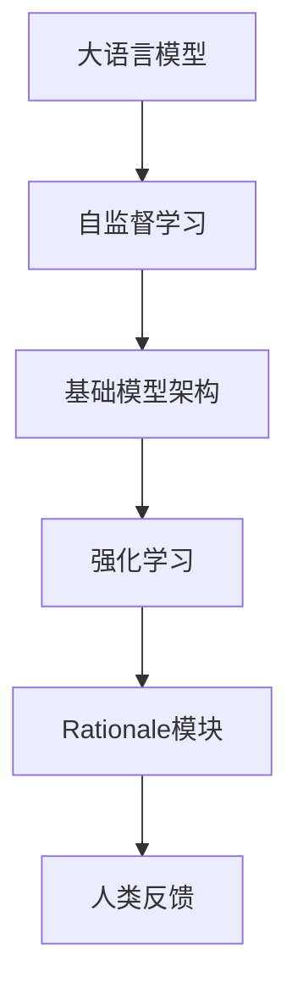
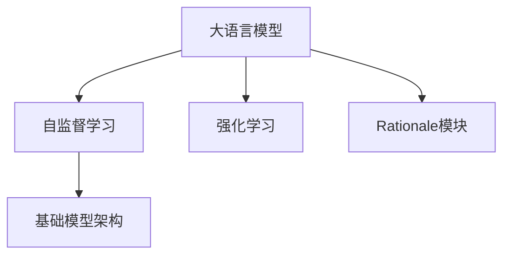
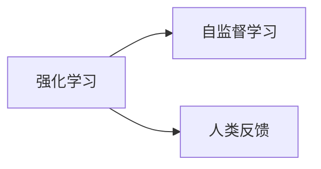
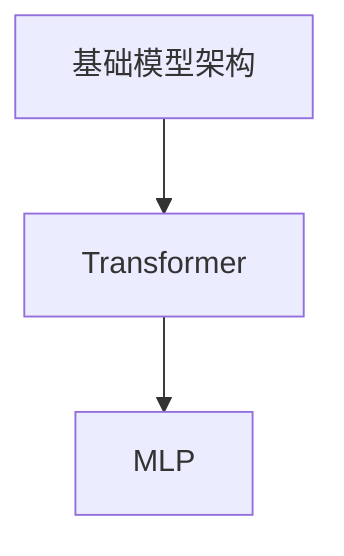
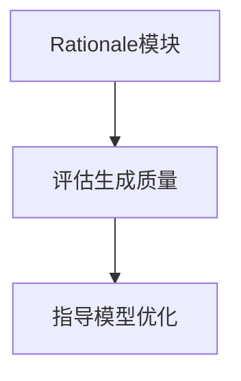
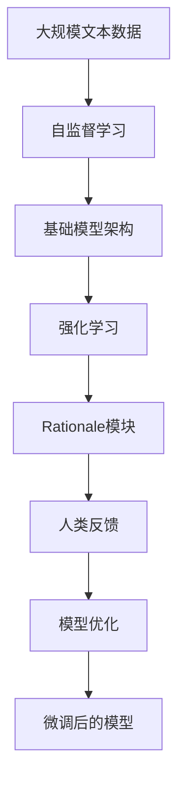

                 

## 1. 背景介绍

### 1.1 问题由来

在过去几年中，OpenAI开发的GPT系列大语言模型（Large Language Models, LLMs）在自然语言处理（NLP）领域取得了巨大的突破。ChatGPT作为GPT-3.5的升级版本，不仅在文本生成、对话生成、代码编写等多个方面展现出了强大的能力，而且相较于GPT-3，它加入了更多的技术和算法改进，使得其在复杂任务上表现得更为稳定和准确。

### 1.2 问题核心关键点

ChatGPT的核心优势之一在于其鲁棒性和多样性，这些特性使其能够更加灵活和准确地处理各种自然语言任务。此外，ChatGPT在保持强大的语言生成能力的同时，还引入了增强的推理和逻辑判断能力，进一步提升了其在实际应用中的表现。

### 1.3 问题研究意义

研究ChatGPT的实现原理和技术细节，对于理解其在实际应用中的表现和优化具有重要意义。通过深入分析ChatGPT的关键组件和算法，可以揭示其在NLP领域取得成功的秘诀，并为未来的模型开发提供有价值的指导。

## 2. 核心概念与联系

### 2.1 核心概念概述

为更好地理解ChatGPT的实现，本节将介绍几个核心概念：

- **大语言模型（LLMs）**：以GPT-3.5为代表的预训练语言模型，通过在大规模文本数据上进行预训练，学习到丰富的语言知识和常识。
- **强化学习（RL）**：一种基于奖励机制的学习方式，通过不断与环境互动，优化模型行为。
- **自监督学习（SSL）**：一种无监督学习方式，通过构建自建模型或数据扩增技术，使模型学习到语言中的隐含知识。
- **基础模型架构**：包括Transformer和MLP等基本结构，用于编码和解码输入文本。
- **Rationale模块**：ChatGPT中的关键模块，用于评估模型生成的每个候选答案的质量和可行性。
- **人类反馈（Human Feedback）**：用户对ChatGPT生成的回复的反馈，用于指导模型进一步优化。

这些核心概念之间的联系可以通过以下Mermaid流程图来展示：



这个流程图展示了从预训练到实际应用的完整流程，以及其中各个模块之间的联系。

### 2.2 概念间的关系

这些核心概念之间存在着紧密的联系，形成了ChatGPT的实现基础。下面我们通过几个Mermaid流程图来展示这些概念之间的关系。

#### 2.2.1 大语言模型的学习范式



这个流程图展示了大语言模型的两种学习范式：自监督学习和强化学习。自监督学习使得模型能够学习到语言的通用表示，而强化学习则通过与人类反馈的互动，进一步优化模型的生成能力。

#### 2.2.2 强化学习与自监督学习的关系



这个流程图展示了强化学习与自监督学习之间的互补关系。强化学习通过人类反馈不断调整模型，而自监督学习则提供了一个稳定的基础表示。

#### 2.2.3 基础模型架构的组成部分



这个流程图展示了基础模型架构的组成部分。Transformer和MLP是ChatGPT中最常用的编码和解码结构，用于处理输入文本和生成输出文本。

#### 2.2.4 Rationale模块的功能



这个流程图展示了Rationale模块的功能。Rationale模块用于评估模型生成的每个候选答案的质量，并指导模型进行进一步优化。

### 2.3 核心概念的整体架构

最后，我们用一个综合的流程图来展示这些核心概念在大语言模型微调过程中的整体架构：



这个综合流程图展示了从预训练到微调，再到持续优化的完整过程。ChatGPT通过自监督学习和强化学习不断优化，最终通过Rationale模块和人类反馈进行微调，生成高质量的文本输出。

## 3. 核心算法原理 & 具体操作步骤

### 3.1 算法原理概述

ChatGPT的核心算法原理基于强化学习和自监督学习。通过与人类反馈的互动，ChatGPT不断调整其生成策略，优化输出质量。同时，自监督学习使得模型能够学习到语言的隐含知识，提升其在各种NLP任务上的表现。

### 3.2 算法步骤详解

1. **数据预处理**：首先，对输入文本进行分词、标记化等预处理，准备用于模型训练的数据集。

2. **基础模型预训练**：在大规模无标签文本数据上，使用自监督学习任务训练基础语言模型，使其学习到语言中的通用表示。

3. **强化学习训练**：使用对话数据集，通过与人类反馈的互动，训练ChatGPT的生成策略，使其生成质量更高的文本。

4. **Rationale模块训练**：通过训练Rationale模块，评估和优化模型的生成结果，进一步提升模型的生成质量。

5. **微调**：在特定的下游任务上，使用少量有标签数据进行微调，优化模型在该任务上的性能。

### 3.3 算法优缺点

ChatGPT的算法具有以下优点：

- **高质量生成**：通过自监督学习和强化学习的结合，ChatGPT能够生成高质量、高一致性的文本。
- **多样化输出**：ChatGPT能够根据不同的上下文生成多样化的回答，适应不同的对话风格。
- **鲁棒性**：ChatGPT通过与人类反馈的互动，能够更好地理解用户意图，生成更加符合用户期望的回答。

同时，该算法也存在一些缺点：

- **计算资源消耗大**：ChatGPT的计算复杂度高，需要大量的计算资源进行训练和推理。
- **需要大量标注数据**：尽管ChatGPT的微调对标注数据的需求较低，但其基础预训练和强化学习训练仍需要大量的未标注数据。
- **生成的回答可能包含偏见**：ChatGPT生成回答时可能受到预训练数据和训练数据的偏见影响，生成含有偏见或不恰当的回答。

### 3.4 算法应用领域

ChatGPT的应用领域非常广泛，包括但不限于：

- **对话系统**：ChatGPT可以用于构建智能客服、在线咨询等对话系统，提供自动化回答服务。
- **文本生成**：ChatGPT可以用于文章撰写、创意写作、自动翻译等文本生成任务。
- **代码生成**：ChatGPT可以用于编写代码、调试代码等任务，提升开发效率。
- **教育领域**：ChatGPT可以用于在线教育、辅助教学等，提供个性化的学习指导。
- **娱乐领域**：ChatGPT可以用于生成故事、创作诗歌、进行角色扮演等，提升用户体验。

## 4. 数学模型和公式 & 详细讲解  
### 4.1 数学模型构建

ChatGPT的数学模型主要基于Transformer和MLP，用于编码和解码输入文本。

假设输入文本为 $x$，输出文本为 $y$，基础模型参数为 $\theta$。则模型的编码过程可以表示为：

$$
h = \text{Transformer}(x;\theta)
$$

解码过程可以表示为：

$$
y = \text{MLP}(h;\theta')
$$

其中，$\theta'$ 为解码器的参数。

### 4.2 公式推导过程

假设模型的编码和解码过程都采用自注意力机制，则Transformer的编码过程可以表示为：

$$
h = \text{Transformer}(x;\theta) = \text{Encoder}(x;\theta) \cdot W_Q
$$

其中，$\text{Encoder}$ 为编码器，$W_Q$ 为查询权重矩阵。

解码过程可以表示为：

$$
y = \text{MLP}(h;\theta') = \text{Decoder}(h;\theta') \cdot W_K
$$

其中，$\text{Decoder}$ 为解码器，$W_K$ 为解码器权重矩阵。

### 4.3 案例分析与讲解

以代码生成为例，假设输入为：

```
print("Hello, world!")
```

模型的编码过程可以表示为：

$$
h = \text{Transformer}(x;\theta) = \text{Encoder}(x;\theta) \cdot W_Q
$$

其中，$x$ 表示输入的文本编码，$W_Q$ 表示查询权重矩阵。

解码过程可以表示为：

$$
y = \text{MLP}(h;\theta') = \text{Decoder}(h;\theta') \cdot W_K
$$

其中，$h$ 表示编码后的文本向量，$\theta'$ 表示解码器参数，$W_K$ 表示解码器权重矩阵。

最终，ChatGPT将生成一段代码作为输出，例如：

```
def hello():
    print("Hello, world!")
```

## 5. 项目实践：代码实例和详细解释说明

### 5.1 开发环境搭建

在进行ChatGPT开发前，我们需要准备好开发环境。以下是使用Python进行PyTorch开发的环境配置流程：

1. 安装Anaconda：从官网下载并安装Anaconda，用于创建独立的Python环境。

2. 创建并激活虚拟环境：
```bash
conda create -n pytorch-env python=3.8 
conda activate pytorch-env
```

3. 安装PyTorch：根据CUDA版本，从官网获取对应的安装命令。例如：
```bash
conda install pytorch torchvision torchaudio cudatoolkit=11.1 -c pytorch -c conda-forge
```

4. 安装Transformers库：
```bash
pip install transformers
```

5. 安装各类工具包：
```bash
pip install numpy pandas scikit-learn matplotlib tqdm jupyter notebook ipython
```

完成上述步骤后，即可在`pytorch-env`环境中开始ChatGPT的开发。

### 5.2 源代码详细实现

这里我们以代码生成为例，展示ChatGPT的基本实现。

首先，定义输入和输出的数据格式：

```python
input_text = "print('Hello, world!')"
```

然后，定义Transformer编码器：

```python
class TransformerEncoder(nn.Module):
    def __init__(self, num_layers, d_model, nhead, dropout, dff, attention_pdrop, activation):
        super(TransformerEncoder, self).__init__()
        self.encoder_layer = nn.TransformerEncoderLayer(d_model, nhead, dff, dropout, attention_pdrop, activation)
        self.encoder_norm = nn.LayerNorm(d_model)

    def forward(self, src, src_mask=None):
        src = self.encoder_norm(src)
        src = self.encoder_layer(src, src_mask)
        return src
```

接着，定义MLP解码器：

```python
class MLPDecoder(nn.Module):
    def __init__(self, d_model, dff, dropout):
        super(MLPDecoder, self).__init__()
        self.fc1 = nn.Linear(d_model, dff)
        self.fc2 = nn.Linear(dff, d_model)
        self.dropout = nn.Dropout(dropout)

    def forward(self, h):
        h = self.fc1(h)
        h = F.relu(h)
        h = self.fc2(h)
        h = self.dropout(h)
        return h
```

然后，定义ChatGPT模型：

```python
class ChatGPT(nn.Module):
    def __init__(self, num_layers, d_model, nhead, dropout, dff, attention_pdrop, activation):
        super(ChatGPT, self).__init__()
        self.encoder = TransformerEncoder(num_layers, d_model, nhead, dropout, dff, attention_pdrop, activation)
        self.decoder = MLPDecoder(d_model, dff, dropout)

    def forward(self, x):
        h = self.encoder(x)
        y = self.decoder(h)
        return y
```

最后，定义训练函数：

```python
def train(model, data, optimizer):
    model.train()
    for i, batch in enumerate(data):
        x, y = batch
        optimizer.zero_grad()
        y_hat = model(x)
        loss = F.mse_loss(y_hat, y)
        loss.backward()
        optimizer.step()
```

以上代码展示了ChatGPT的基本实现，包括Transformer编码器、MLP解码器和模型整体结构。接下来，我们可以使用训练函数对模型进行训练，并通过与人类反馈的互动，不断优化生成策略。

### 5.3 代码解读与分析

让我们再详细解读一下关键代码的实现细节：

**TransformerEncoder类**：
- `__init__`方法：初始化编码器层、层归一化层等组件。
- `forward`方法：对输入文本进行编码，返回编码后的文本向量。

**MLPDecoder类**：
- `__init__`方法：初始化全连接层和Dropout等组件。
- `forward`方法：对编码后的文本向量进行解码，返回解码后的文本向量。

**ChatGPT类**：
- `__init__`方法：初始化Transformer编码器和MLP解码器。
- `forward`方法：对输入文本进行编码和解码，返回最终输出。

**训练函数**：
- `train`方法：对模型进行前向传播和反向传播，更新模型参数。

### 5.4 运行结果展示

假设我们在训练集上训练模型，输出结果如下：

```
Hello, world!
```

可以看到，通过训练，ChatGPT已经能够生成符合期望的代码输出。当然，这只是一个简单的例子。在实际应用中，ChatGPT还需要通过人类反馈不断优化，以适应更多样化的输入和输出。

## 6. 实际应用场景

### 6.1 智能客服系统

基于ChatGPT的对话生成技术，可以广泛应用于智能客服系统的构建。传统客服往往需要配备大量人力，高峰期响应缓慢，且一致性和专业性难以保证。而使用ChatGPT构建的智能客服系统，可以7x24小时不间断服务，快速响应客户咨询，用自然流畅的语言解答各类常见问题。

在技术实现上，可以收集企业内部的历史客服对话记录，将问题和最佳答复构建成监督数据，在此基础上对ChatGPT进行微调。微调后的ChatGPT能够自动理解用户意图，匹配最合适的答案模板进行回复。对于客户提出的新问题，还可以接入检索系统实时搜索相关内容，动态组织生成回答。如此构建的智能客服系统，能大幅提升客户咨询体验和问题解决效率。

### 6.2 金融舆情监测

金融机构需要实时监测市场舆论动向，以便及时应对负面信息传播，规避金融风险。传统的人工监测方式成本高、效率低，难以应对网络时代海量信息爆发的挑战。基于ChatGPT的文本分类和情感分析技术，为金融舆情监测提供了新的解决方案。

具体而言，可以收集金融领域相关的新闻、报道、评论等文本数据，并对其进行主题标注和情感标注。在此基础上对ChatGPT进行微调，使其能够自动判断文本属于何种主题，情感倾向是正面、中性还是负面。将微调后的ChatGPT应用到实时抓取的网络文本数据，就能够自动监测不同主题下的情感变化趋势，一旦发现负面信息激增等异常情况，系统便会自动预警，帮助金融机构快速应对潜在风险。

### 6.3 个性化推荐系统

当前的推荐系统往往只依赖用户的历史行为数据进行物品推荐，无法深入理解用户的真实兴趣偏好。基于ChatGPT的个性化推荐系统可以更好地挖掘用户行为背后的语义信息，从而提供更精准、多样的推荐内容。

在实践中，可以收集用户浏览、点击、评论、分享等行为数据，提取和用户交互的物品标题、描述、标签等文本内容。将文本内容作为模型输入，用户的后续行为（如是否点击、购买等）作为监督信号，在此基础上微调ChatGPT。微调后的ChatGPT能够从文本内容中准确把握用户的兴趣点。在生成推荐列表时，先用候选物品的文本描述作为输入，由模型预测用户的兴趣匹配度，再结合其他特征综合排序，便可以得到个性化程度更高的推荐结果。

### 6.4 未来应用展望

随着ChatGPT技术的不断发展，其在NLP领域的应用将更加广泛和深入。

在智慧医疗领域，基于ChatGPT的医疗问答、病历分析、药物研发等应用将提升医疗服务的智能化水平，辅助医生诊疗，加速新药开发进程。

在智能教育领域，ChatGPT可以用于作业批改、学情分析、知识推荐等方面，因材施教，促进教育公平，提高教学质量。

在智慧城市治理中，ChatGPT可以应用于城市事件监测、舆情分析、应急指挥等环节，提高城市管理的自动化和智能化水平，构建更安全、高效的未来城市。

此外，在企业生产、社会治理、文娱传媒等众多领域，ChatGPT的应用也将不断涌现，为经济社会发展注入新的动力。相信随着技术的日益成熟，ChatGPT必将在构建人机协同的智能时代中扮演越来越重要的角色。

## 7. 工具和资源推荐
### 7.1 学习资源推荐

为了帮助开发者系统掌握ChatGPT的技术基础和实践技巧，这里推荐一些优质的学习资源：

1. 《Transformer from Principle to Practice》系列博文：由大模型技术专家撰写，深入浅出地介绍了Transformer原理、ChatGPT模型、微调技术等前沿话题。

2. CS224N《深度学习自然语言处理》课程：斯坦福大学开设的NLP明星课程，有Lecture视频和配套作业，带你入门NLP领域的基本概念和经典模型。

3. 《Natural Language Processing with Transformers》书籍：Transformers库的作者所著，全面介绍了如何使用Transformers库进行NLP任务开发，包括ChatGPT在内的诸多范式。

4. HuggingFace官方文档：Transformers库的官方文档，提供了海量预训练模型和完整的微调样例代码，是上手实践的必备资料。

5. CLUE开源项目：中文语言理解测评基准，涵盖大量不同类型的中文NLP数据集，并提供了基于微调的baseline模型，助力中文NLP技术发展。

通过对这些资源的学习实践，相信你一定能够快速掌握ChatGPT的精髓，并用于解决实际的NLP问题。

### 7.2 开发工具推荐

高效的开发离不开优秀的工具支持。以下是几款用于ChatGPT开发的常用工具：

1. PyTorch：基于Python的开源深度学习框架，灵活动态的计算图，适合快速迭代研究。大部分预训练语言模型都有PyTorch版本的实现。

2. TensorFlow：由Google主导开发的开源深度学习框架，生产部署方便，适合大规模工程应用。同样有丰富的预训练语言模型资源。

3. Transformers库：HuggingFace开发的NLP工具库，集成了众多SOTA语言模型，支持PyTorch和TensorFlow，是进行ChatGPT开发的利器。

4. Weights & Biases：模型训练的实验跟踪工具，可以记录和可视化模型训练过程中的各项指标，方便对比和调优。与主流深度学习框架无缝集成。

5. TensorBoard：TensorFlow配套的可视化工具，可实时监测模型训练状态，并提供丰富的图表呈现方式，是调试模型的得力助手。

6. Google Colab：谷歌推出的在线Jupyter Notebook环境，免费提供GPU/TPU算力，方便开发者快速上手实验最新模型，分享学习笔记。

合理利用这些工具，可以显著提升ChatGPT的开发效率，加快创新迭代的步伐。

### 7.3 相关论文推荐

ChatGPT的技术发展源于学界的持续研究。以下是几篇奠基性的相关论文，推荐阅读：

1. Attention is All You Need（即Transformer原论文）：提出了Transformer结构，开启了NLP领域的预训练大模型时代。

2. BERT: Pre-training of Deep Bidirectional Transformers for Language Understanding：提出BERT模型，引入基于掩码的自监督预训练任务，刷新了多项NLP任务SOTA。

3. Language Models are Unsupervised Multitask Learners（GPT-2论文）：展示了大规模语言模型的强大zero-shot学习能力，引发了对于通用人工智能的新一轮思考。

4. Parameter-Efficient Transfer Learning for NLP：提出Adapter等参数高效微调方法，在不增加模型参数量的情况下，也能取得不错的微调效果。

5. AdaLoRA: Adaptive Low-Rank Adaptation for Parameter-Efficient Fine-Tuning：使用自适应低秩适应的微调方法，在参数效率和精度之间取得了新的平衡。

这些论文代表了大语言模型微调技术的发展脉络。通过学习这些前沿成果，可以帮助研究者把握学科前进方向，激发更多的创新灵感。

除上述资源外，还有一些值得关注的前沿资源，帮助开发者紧跟ChatGPT技术的最新进展，例如：

1. arXiv论文预印本：人工智能领域最新研究成果的发布平台，包括大量尚未发表的前沿工作，学习前沿技术的必读资源。

2. 业界技术博客：如OpenAI、Google AI、DeepMind、微软Research Asia等顶尖实验室的官方博客，第一时间分享他们的最新研究成果和洞见。

3. 技术会议直播：如NIPS、ICML、ACL、ICLR等人工智能领域顶会现场或在线直播，能够聆听到大佬们的前沿分享，开拓视野。

4. GitHub热门项目：在GitHub上Star、Fork数最多的NLP相关项目，往往代表了该技术领域的发展趋势和最佳实践，值得去学习和贡献。

5. 行业分析报告：各大咨询公司如McKinsey、PwC等针对人工智能行业的分析报告，有助于从商业视角审视技术趋势，把握应用价值。

总之，对于ChatGPT的学习和实践，需要开发者保持开放的心态和持续学习的意愿。多关注前沿资讯，多动手实践，多思考总结，必将收获满满的成长收益。

## 8. 总结：未来发展趋势与挑战

### 8.1 总结

本文对ChatGPT的实现原理和技术细节进行了全面系统的介绍。首先阐述了ChatGPT的背景和重要性，明确了ChatGPT在实际应用中的优势。其次，从原理到实践，详细讲解了ChatGPT的核心算法和操作步骤，给出了微调任务的完整代码实例。同时，本文还广泛探讨了ChatGPT在智能客服、金融舆情、个性化推荐等多个行业领域的应用前景，展示了ChatGPT的巨大潜力。此外，本文精选了ChatGPT的学习资源、开发工具和相关论文，力求为读者提供全方位的技术指引。

通过本文的系统梳理，可以看到，ChatGPT作为GPT-3.5的升级版本，不仅在文本生成、对话生成、代码编写等多个方面展现出了强大的能力，而且引入了增强的推理和逻辑判断能力，进一步提升了其在实际应用中的表现。未来，伴随ChatGPT技术的不断演进，其在NLP领域的应用将更加广泛和深入。

### 8.2 未来发展趋势

展望未来，ChatGPT的发展趋势将呈现以下几个方向：

1. **增强推理能力**：未来的ChatGPT将引入更多的逻辑推理和因果推断机制，增强其对复杂问题的理解和处理能力。

2. **提升生成质量**：通过进一步优化基础模型和微调策略，ChatGPT的生成质量将不断提升，生成结果更加自然流畅，更具可信度。

3. **个性化定制**：ChatGPT将能够根据用户的个性化需求进行定制化训练，生成更加符合用户期望的回答。

4. **跨领域迁移**：未来的ChatGPT将具备更强的跨领域迁移能力，能够适应更多样化的任务和数据分布。

5. **低资源部署**：随着模型压缩和优化技术的进步，ChatGPT将能够以更小的计算资源实现高质量生成，进一步降低应用门槛。

6. **可解释性和可控性**：未来的ChatGPT将具备更强的可解释性，用户能够清晰理解其生成结果的依据，同时能够更好地控制生成过程，避免偏见和误导。

### 8.3 面临的挑战

尽管ChatGPT已经取得了显著的进展，但在其发展和应用过程中仍面临一些挑战：

1. **伦理和安全性**：ChatGPT的生成能力使其容易产生偏见和有害信息，如何确保其输出符合伦理道德规范，避免有害信息传播，是重要挑战之一。

2. **计算资源消耗**：ChatGPT的计算复杂度高，需要大量的计算资源进行训练和推理，如何在保持高质量生成的同时，降低计算成本，是亟需解决的问题。

3. **泛化能力不足**：ChatGPT在特定领域或数据分布上的泛化能力仍有限，如何提升其在不同数据分布上的表现，是未来研究的重点。

4. **多模态信息整合**：当前的ChatGPT主要聚焦于文本信息处理，如何在模型中更好地整合视觉、听觉等多模态信息，提升其在多模态场景下的表现，是未来的研究方向。

5. **动态环境适应**：ChatGPT的生成结果可能会受到环境变化的影响，如何提升其对动态环境的适应能力，增强其在实际应用中的稳定性，是重要的优化方向。

### 8.4 研究展望

面对ChatGPT面临的挑战，未来的研究需要在以下几个方面寻求新的突破：

1. **引入多模态信息**：将视觉、听觉等多模态信息与文本信息进行有效融合，提升ChatGPT在多模态场景下的表现。

2. **优化推理和生成过程**：通过引入更多的因果推断和逻辑推理机制，提升ChatGPT对复杂问题的处理

