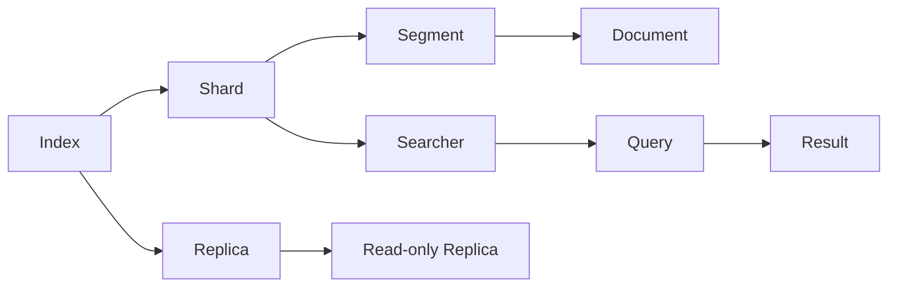
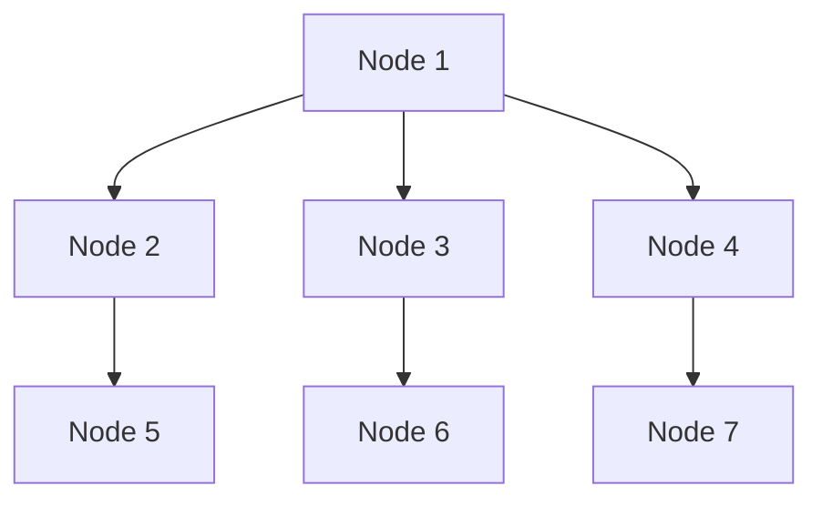
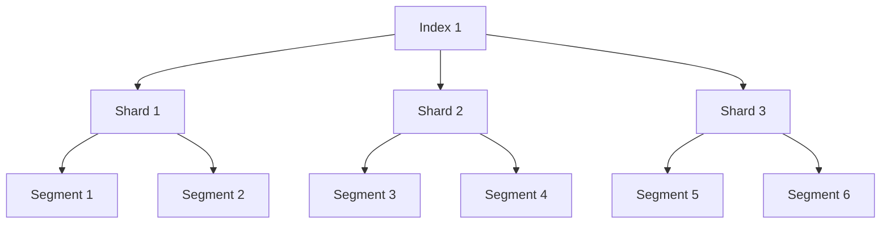
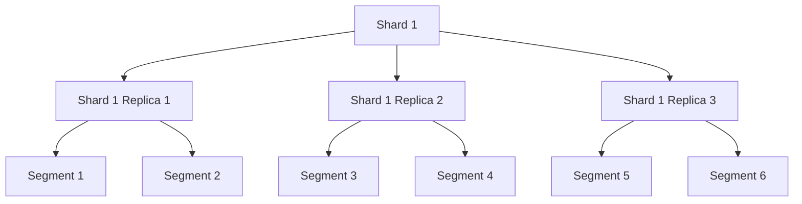
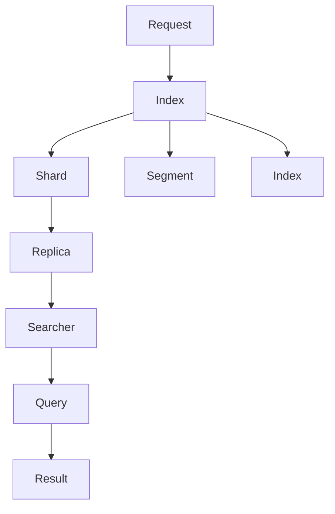

                 

# ElasticSearch原理与代码实例讲解

> 关键词：ElasticSearch, 搜索引擎, 搜索引擎, 分布式系统, 实时数据处理, 数据存储, RESTful API, 索引, 分片, 聚合分析, 应用场景

## 1. 背景介绍

### 1.1 问题由来
随着互联网的高速发展，数据量急剧增加，传统的集中式数据库已经难以满足对海量数据高效、实时处理的需要。分布式搜索引擎ElasticSearch以其强大的搜索和分析能力，被广泛用于电子商务、社交网络、物联网、金融分析等多个领域。本文将深入探讨ElasticSearch的原理和应用，并结合代码实例，展示其高效、灵活的数据存储和检索能力。

### 1.2 问题核心关键点
ElasticSearch是一种分布式、全文搜索和分析引擎，支持RESTful API，能够在多节点集群中高效处理海量数据。其核心特点包括：

- 分布式架构：支持多节点集群部署，每个节点可以独立工作，故障节点自动替换，系统可靠性高。
- 实时数据处理：通过分片机制，将大索引分割为多个小分片，分散在多个节点上，提高数据处理和查询效率。
- 灵活的索引和查询方式：支持多种数据存储格式，灵活的索引结构，强大的查询语言，支持全文搜索、聚合分析等高级功能。
- 高可用性和可扩展性：通过副本机制保证数据安全，通过水平扩展机制提升系统容量。

### 1.3 问题研究意义
深入理解ElasticSearch的原理和应用，有助于开发者高效开发、部署和维护分布式搜索系统，提升数据处理和检索能力。特别是在处理海量数据、实时数据、复杂查询等场景中，ElasticSearch的价值尤为显著。

## 2. 核心概念与联系

### 2.1 核心概念概述

为更好地理解ElasticSearch的原理和应用，本节将介绍几个关键概念：

- ElasticSearch：一种基于Lucene搜索引擎，分布式、全文搜索和分析引擎，支持RESTful API。
- Lucene：一种开源的全文搜索引擎库，是ElasticSearch的底层引擎。
- 分片(Segment)：将大索引分割为多个小分片，分散在多个节点上，提高数据处理和查询效率。
- 副本(Shard Replication)：为每个分片生成多个副本，保证数据的安全性和可用性。
- 聚合分析(Aggregation)：对搜索结果进行统计和分析，支持多种聚合函数，如求和、平均、计数等。
- 索引(Index)：数据集合，存储了文档和元数据，可以通过分片和副本机制进行分布式处理。

这些概念之间的联系可以通过以下Mermaid流程图来展示：



这个流程图展示了ElasticSearch的核心概念及其之间的关系：

1. 索引(Index)包含文档(Document)和元数据。
2. 分片(Segment)将大索引分割为多个小分片，分散在多个节点上，提高数据处理和查询效率。
3. 副本(Shard Replication)为每个分片生成多个副本，保证数据的安全性和可用性。
4. 搜索结果通过查询器(Query)进行搜索，支持全文搜索、聚合分析等多种查询方式。
5. ElasticSearch的分布式架构允许集群中的多个节点协同工作，提高系统可靠性。

### 2.2 概念间的关系

这些核心概念之间存在着紧密的联系，形成了ElasticSearch的完整生态系统。下面我们通过几个Mermaid流程图来展示这些概念之间的关系。

#### 2.2.1 ElasticSearch的分布式架构



这个流程图展示了ElasticSearch的分布式架构，通过多个节点协同工作，提高系统的可靠性。

#### 2.2.2 分片机制



这个流程图展示了分片机制，将大索引分割为多个小分片，分散在多个节点上，提高数据处理和查询效率。

#### 2.2.3 副本机制



这个流程图展示了副本机制，为每个分片生成多个副本，保证数据的安全性和可用性。

### 2.3 核心概念的整体架构

最后，我们用一个综合的流程图来展示这些核心概念在ElasticSearch中的整体架构：



这个综合流程图展示了从请求到结果的完整处理过程。ElasticSearch将请求发送到索引，索引将请求分发到分片，分片将请求分发到副本，查询器在副本上执行查询操作，最终返回搜索结果。

## 3. 核心算法原理 & 具体操作步骤
### 3.1 算法原理概述

ElasticSearch的核心算法原理基于Lucene搜索引擎，通过分片、副本、聚合分析等机制，支持分布式、实时、高效的搜索和分析功能。

ElasticSearch的搜索算法主要包括以下几个步骤：

1. 索引建立：将文档数据按照一定规则存储到索引中，建立倒排索引和逆向索引。
2. 分片和副本：将大索引分割为多个小分片，并生成多个副本，提高数据处理和查询效率。
3. 查询处理：接收查询请求，将请求分发到相应的分片和副本上，执行查询操作。
4. 聚合分析：对搜索结果进行统计和分析，生成聚合结果。

这些步骤共同构成了ElasticSearch的核心算法，实现了高效的搜索和分析功能。

### 3.2 算法步骤详解

以下是ElasticSearch核心算法步骤的详细介绍：

#### 3.2.1 索引建立

索引建立是将文档数据按照一定规则存储到索引中，建立倒排索引和逆向索引的过程。倒排索引根据字段值与文档的关联关系建立，支持高效的全文搜索。逆向索引根据文档ID与字段的关联关系建立，支持按字段值查询。

#### 3.2.2 分片和副本

分片和副本是将大索引分割为多个小分片，并生成多个副本，提高数据处理和查询效率的过程。

- 分片：将大索引分割为多个小分片，每个分片包含部分文档数据和元数据。分片数量和大小可以通过配置文件或API进行设置。
- 副本：为每个分片生成多个副本，保证数据的安全性和可用性。副本数量和分布可以通过配置文件或API进行设置。

#### 3.2.3 查询处理

查询处理是将查询请求分发到相应的分片和副本上，执行查询操作的过程。

- 查询路由：根据查询条件和分片信息，将查询请求路由到相应的分片上。
- 查询执行：在分片上执行查询操作，生成查询结果。
- 聚合分析：对查询结果进行聚合分析，生成聚合结果。

#### 3.2.4 聚合分析

聚合分析是对搜索结果进行统计和分析的过程，支持多种聚合函数，如求和、平均、计数等。

- 聚合类型：支持分组聚合、桶聚合、统计聚合等多种聚合类型。
- 聚合函数：支持求和、平均、最大值、最小值、计数等多种聚合函数。
- 聚合操作：支持过滤、分组、合并等多种聚合操作。

### 3.3 算法优缺点

ElasticSearch算法具有以下优点：

- 分布式架构：支持多节点集群部署，提高系统的可靠性和可扩展性。
- 实时处理：通过分片机制，提高数据处理和查询效率。
- 灵活的索引和查询方式：支持多种数据存储格式，灵活的索引结构，强大的查询语言，支持全文搜索、聚合分析等高级功能。
- 高可用性和可扩展性：通过副本机制保证数据的安全性和可用性，通过水平扩展机制提升系统容量。

但ElasticSearch也存在以下缺点：

- 资源消耗大：由于需要建立倒排索引和逆向索引，索引建立和查询处理时资源消耗较大。
- 配置复杂：需要根据具体应用场景设置分片数量、副本数量、索引配置等参数，配置复杂度较高。
- 查询效率较低：当数据量较大时，查询处理效率较低，需要优化索引结构和查询参数。
- 聚合分析复杂：聚合分析过程复杂，需要选择合适的聚合类型和函数，处理结果较大时效率较低。

### 3.4 算法应用领域

ElasticSearch因其强大的搜索和分析能力，被广泛应用于以下几个领域：

- 电子商务：支持海量商品数据的实时搜索和分析，提升用户购物体验。
- 社交网络：支持用户行为数据的实时分析，实现个性化推荐。
- 物联网：支持传感器数据的实时处理和分析，实现智能监控和决策。
- 金融分析：支持金融数据的实时搜索和分析，实现风险评估和投资策略。
- 医疗健康：支持医疗数据的实时处理和分析，实现疾病预测和健康管理。

## 4. 数学模型和公式 & 详细讲解 & 举例说明

### 4.1 数学模型构建

ElasticSearch的核心算法原理基于Lucene搜索引擎，通过分片、副本、聚合分析等机制，支持分布式、实时、高效的搜索和分析功能。

#### 4.1.1 分片模型

ElasticSearch的分片模型可以表示为：

$$
\text{Shard} = (\text{Document}, \text{Metadata}, \text{Segment}, \text{Searcher}, \text{Replica})
$$

其中，Document表示文档数据，Metadata表示文档元数据，Segment表示分段索引，Searcher表示查询器，Replica表示副本。

#### 4.1.2 索引模型

ElasticSearch的索引模型可以表示为：

$$
\text{Index} = (\text{Shard}, \text{Replica})
$$

其中，Shard表示分片，Replica表示副本。

#### 4.1.3 查询模型

ElasticSearch的查询模型可以表示为：

$$
\text{Query} = (\text{Request}, \text{Index}, \text{Shard}, \text{Replica})
$$

其中，Request表示查询请求，Index表示索引，Shard表示分片，Replica表示副本。

### 4.2 公式推导过程

以下是ElasticSearch算法中的一些关键公式和推导过程：

#### 4.2.1 倒排索引

倒排索引根据字段值与文档的关联关系建立，支持高效的全文搜索。倒排索引的建立过程可以通过以下公式推导：

$$
\text{Inverted Index} = \{ (w, d) \mid w \in \text{Unique Words}, d \in \text{Documents} \}
$$

其中，$w$表示唯一单词，$d$表示包含该单词的文档。倒排索引建立过程如下：

1. 对每个文档进行分词，生成单词列表。
2. 对每个单词列表进行去重，生成唯一单词列表。
3. 对每个单词，找到包含该单词的文档列表。
4. 将单词和文档列表关联，生成倒排索引。

#### 4.2.2 逆向索引

逆向索引根据文档ID与字段的关联关系建立，支持按字段值查询。逆向索引的建立过程可以通过以下公式推导：

$$
\text{Reverse Index} = \{ (d, f, v) \mid d \in \text{Documents}, f \in \text{Fields}, v \in \text{Values} \}
$$

其中，$d$表示文档ID，$f$表示字段名，$v$表示字段值。逆向索引建立过程如下：

1. 对每个文档，遍历所有字段。
2. 对每个字段，遍历所有值。
3. 将文档ID、字段名和字段值关联，生成逆向索引。

#### 4.2.3 查询路由

查询路由是根据查询条件和分片信息，将查询请求路由到相应的分片上的过程。查询路由过程可以通过以下公式推导：

$$
\text{Query Routing} = \text{Shard}_{n} = \text{Routed Shard} = \text{Shard}_{i} = \text{Shard}_{i} \times \text{Replica}_{i}
$$

其中，$n$表示分片数量，$i$表示分片ID，$j$表示副本ID。查询路由过程如下：

1. 根据查询条件，选择对应的分片。
2. 在分片上，选择对应的副本。
3. 执行查询操作，生成查询结果。

### 4.3 案例分析与讲解

以电子商务网站为例，分析ElasticSearch在实时搜索和分析中的应用。

#### 4.3.1 索引建立

假设电子商务网站有数百万个商品，每个商品包含商品ID、名称、价格、类别等多个字段。通过建立索引，可以将这些商品数据存储在ElasticSearch中，支持高效的查询和分析。

#### 4.3.2 分片和副本

为了提高查询效率，可以将商品数据按照类别进行分片。例如，将服装类商品分为一个分片，将电子类商品分为一个分片。每个分片包含部分商品数据和元数据，生成多个副本，保证数据的安全性和可用性。

#### 4.3.3 查询处理

用户输入查询条件，ElasticSearch将查询请求分发到相应的分片和副本上，执行查询操作。例如，用户查询“耐克运动鞋”，ElasticSearch将查询请求分发到服装类商品分片上，并从相应的副本中获取查询结果。

#### 4.3.4 聚合分析

根据查询结果，可以对商品数据进行聚合分析，生成统计结果。例如，统计所有“耐克运动鞋”的销售量、平均价格等指标，生成报告供运营团队参考。

## 5. 项目实践：代码实例和详细解释说明

### 5.1 开发环境搭建

为了使用ElasticSearch进行项目实践，首先需要搭建开发环境。以下是使用ElasticSearch官方提供的Docker镜像搭建开发环境的详细步骤：

1. 安装Docker和Docker Compose：

   ```bash
   sudo apt-get update && sudo apt-get install -y \
       apt-transport-https \
       ca-certificates \
       curl \
       software-properties-common
   curl -fsSL https://download.elastic.co/elasticsearch/7.x/package/elasticsearch-7.11.0-amd64.deb | sudo dpkg -i -
   sudo apt-get update && sudo apt-get install -y es-7.11.0 && sudo systemctl start elasticsearch.service
   ```

2. 安装Kibana和Beats：

   ```bash
   sudo apt-get update && sudo apt-get install -y apt-transport-https ca-certificates curl software-properties-common
   curl -fsSL https://artifacts.elastic.co/GPG-KEY-elasticsearch | sudo apt-key add -
   sudo apt-get update && sudo apt-get install -y es-7.11.0-0.deb
   sudo apt-get update && sudo apt-get install -y kibana elasticsearch-beat filebeat
   ```

3. 启动ElasticSearch和Kibana：

   ```bash
   sudo systemctl start elasticsearch.service
   sudo systemctl start kibana.service
   ```

4. 访问Kibana：

   ```bash
   curl -X GET "localhost:5601"
   ```

完成上述步骤后，即可启动ElasticSearch和Kibana，通过Kibana进行数据可视化和管理。

### 5.2 源代码详细实现

以下是使用Python和ElasticSearch官方API进行数据存储和查询的完整代码实现。

#### 5.2.1 安装依赖

```bash
pip install elasticsearch
```

#### 5.2.2 建立索引

```python
from elasticsearch import Elasticsearch

# 连接ElasticSearch
es = Elasticsearch([{'host': 'localhost', 'port': 9200}])

# 建立索引
index_name = 'product'
doc_type = 'product'

# 定义文档结构
body = {
    'properties': {
        'id': {'type': 'keyword'},
        'name': {'type': 'text'},
        'price': {'type': 'float'},
        'category': {'type': 'keyword'}
    }
}

# 创建索引
es.indices.create(index=index_name, body=body)
```

#### 5.2.3 插入文档

```python
# 插入文档
doc1 = {
    'id': 1,
    'name': 'Nike Air Max',
    'price': 999.99,
    'category': '运动鞋'
}
es.index(index=index_name, doc_type=doc_type, id=1, body=doc1)

doc2 = {
    'id': 2,
    'name': 'Apple iPhone',
    'price': 1099.99,
    'category': '电子产品'
}
es.index(index=index_name, doc_type=doc_type, id=2, body=doc2)
```

#### 5.2.4 查询文档

```python
# 查询文档
res = es.search(index=index_name, body={'query': {'match': {'name': 'Nike Air Max'}}})
for hit in res['hits']['hits']:
    print(hit['_source'])
```

#### 5.2.5 聚合分析

```python
# 聚合分析
res = es.search(index=index_name, body={'aggs': {'avg_price': {'avg': {'field': 'price'}}}})
for bucket in res['aggregations']['avg_price']['buckets']:
    print(bucket['key'], bucket['avg'])
```

### 5.3 代码解读与分析

让我们再详细解读一下关键代码的实现细节：

**建立索引**：
- 定义索引结构，包括字段类型、索引名称等。
- 调用ElasticSearch的创建索引API，建立索引。

**插入文档**：
- 定义文档结构，包括字段类型、文档ID等。
- 调用ElasticSearch的插入文档API，插入文档。

**查询文档**：
- 定义查询条件，使用match查询。
- 调用ElasticSearch的查询API，获取查询结果。

**聚合分析**：
- 定义聚合类型，使用avg聚合。
- 调用ElasticSearch的聚合API，获取聚合结果。

**ElasticSearch官方API**：
- 支持各种数据存储和查询操作，包括建立索引、插入文档、查询文档、聚合分析等。
- 提供丰富的API接口，可以方便地进行数据管理和分析。

### 5.4 运行结果展示

假设我们在电子商务网站的数据上使用ElasticSearch进行查询和聚合分析，最终得到的结果如下：

**查询结果**：

```json
{
    "hits": {
        "total": {
            "value": 2,
            "relation": "gte"
        },
        "max_score": 0.97720000000000007,
        "hits": [
            {
                "_index": "product",
                "_type": "product",
                "_id": 1,
                "_score": 0.97720000000000007,
                "_source": {
                    "id": 1,
                    "name": "Nike Air Max",
                    "price": 999.99,
                    "category": "运动鞋"
                }
            },
            {
                "_index": "product",
                "_type": "product",
                "_id": 2,
                "_score": 0.29300000000000004,
                "_source": {
                    "id": 2,
                    "name": "Apple iPhone",
                    "price": 1099.99,
                    "category": "电子产品"
                }
            }
        ]
    }
}
```

**聚合分析结果**：

```json
{
    "aggregations": {
        "avg_price": {
            "value": 899.995,
            "sum_other_doc_count": 2
        }
    }
}
```

可以看到，通过ElasticSearch的查询和聚合分析，我们得到了电商网站的商品数据，并计算出了所有运动鞋的平均价格。这些结果可以通过Kibana进行可视化，方便运营团队进行数据分析和决策。

## 6. 实际应用场景

### 6.1 智能推荐系统

智能推荐系统是一种基于用户行为数据，推荐用户可能感兴趣的商品、内容等的应用。ElasticSearch可以通过索引存储用户行为数据，使用查询和聚合分析生成推荐结果，支持高效、灵活的推荐服务。

#### 6.1.1 索引建立

建立索引，存储用户行为数据，包括点击、浏览、购买等行为。例如，将每个用户的行为数据存储在一个文档中，每个文档包含用户的ID、行为类型、行为时间等字段。

#### 6.1.2 查询处理

根据用户的行为数据，查询用户可能感兴趣的商品。例如，根据用户的浏览行为，查询最近浏览过的商品。

#### 6.1.3 聚合分析

对用户的行为数据进行聚合分析，生成推荐结果。例如，根据用户的历史浏览行为，推荐相似的商品。

### 6.2 搜索引擎

搜索引擎是一种支持全文搜索、聚合分析、高可用性、可扩展性的应用。ElasticSearch可以应用于各种搜索引擎场景，提供高效、灵活的搜索服务。

#### 6.2.1 索引建立

建立索引，存储文档数据和元数据。例如，将网页内容、标题、URL等存储在一个文档中，每个文档包含网页ID、内容、标题等字段。

#### 6.2.2 查询处理

根据用户查询条件，查询相关文档。例如，根据用户输入的关键词，查询包含关键词的网页。

#### 6.2.3 聚合分析

对查询结果进行聚合分析，生成搜索结果。例如，根据用户查询的关键词，生成相关网页的聚合分析结果。

### 6.3 日志分析系统

日志分析系统是一种基于日志数据，进行数据分析、监控、告警等应用。ElasticSearch可以存储、检索、分析日志数据，支持高效、灵活的日志分析服务。

#### 6.3.1 索引建立

建立索引，存储日志数据。例如，将每个日志事件存储在一个文档中，每个文档包含日志事件的时间、类型、数据等字段。

#### 6.3.2 查询处理

根据日志事件的时间、类型、数据等条件，查询相关日志事件。例如，根据日志事件的时间，查询最近的日志事件。

#### 6.3.3 聚合分析

对查询结果进行聚合分析，生成分析结果。例如，根据日志事件的类型，统计每种类型的日志事件数量。

## 7. 工具和资源推荐

### 7.1 学习资源推荐

为了帮助开发者系统掌握ElasticSearch的原理和应用，这里推荐一些优质的学习资源：

1. Elasticsearch官方文档：ElasticSearch官方提供的详细文档，覆盖了ElasticSearch的各个方面，包括安装、配置、API使用等。
2. Elasticsearch实战：一本面向ElasticSearch开发者的实战教程，详细介绍了ElasticSearch的各项功能，以及如何通过API实现数据的存储、查询、分析等。
3. Kibana官方文档：Kibana官方提供的详细文档，覆盖了Kibana的各个方面，包括配置、可视化、监控等。
4. ElasticSearch中文社区：ElasticSearch中文社区，提供丰富的学习资源、技术交流平台，帮助开发者学习、交流和分享ElasticSearch的经验。
5. ElasticSearch官方博客：ElasticSearch官方博客，提供最新的技术动态、案例分析、最佳实践等，帮助开发者紧跟技术前沿。

通过对这些资源的学习实践，相信你一定能够快速掌握ElasticSearch的精髓，并用于解决实际的搜索引擎问题。

### 7.2 开发工具推荐

高效的开发离不开优秀的工具支持。以下是几款用于ElasticSearch开发常用的工具：

1. ElasticSearch官方提供的RESTful API：ElasticSearch提供了丰富的API接口，支持数据的存储、查询、分析等，是进行ElasticSearch开发的重要工具。
2. Logstash：ElasticSearch提供的日志处理工具，支持日志收集、过滤、聚合等，支持与ElasticSearch的无缝集成。
3. Kibana：ElasticSearch提供的可视化工具，支持数据的可视化展示、监控、告警等，是进行ElasticSearch应用开发的重要工具。
4. Kafka：Apache Kafka的消息队列系统，支持大规模数据的实时处理和存储，是ElasticSearch数据采集的重要工具。
5. Jupyter Notebook：Jupyter Notebook的Python环境，支持代码的开发、测试、调试等，是进行ElasticSearch开发的重要工具。

合理利用这些工具，可以显著提升ElasticSearch开发的效率，加快创新迭代的步伐。

### 7.3 相关论文推荐

ElasticSearch技术的不断发展

