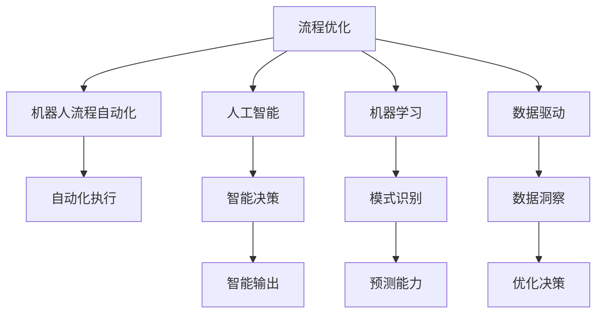
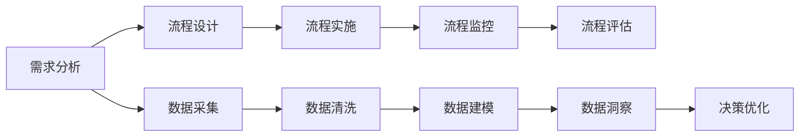
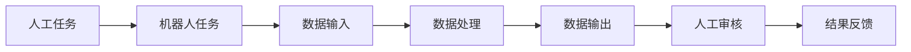
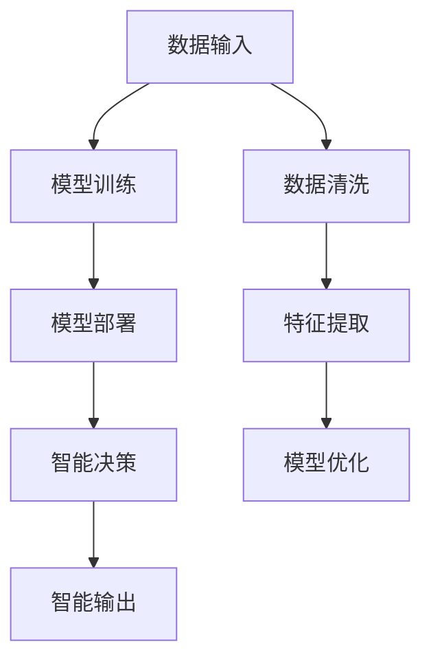
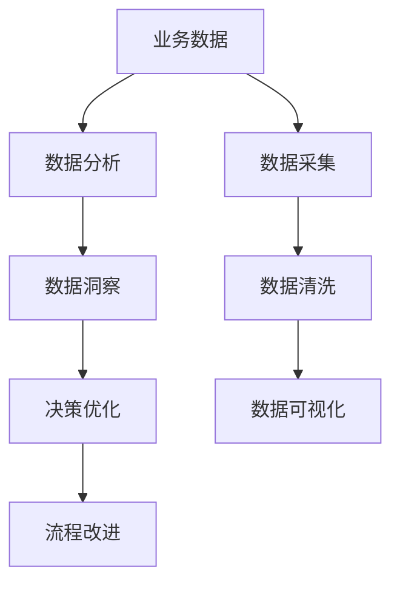

                 

# 流程优化：提高效率，提升电商平台供给能力

> 关键词：流程优化,电商供给能力,供应链管理,自动化,机器人流程自动化(RPA),人工智能,机器学习

## 1. 背景介绍

### 1.1 问题由来

随着电子商务的迅猛发展，电商平台面临越来越大的运营压力，尤其是在供给能力、库存管理、物流配送等环节。如何通过流程优化，提高供给效率，是电商平台亟需解决的关键问题。

传统电商平台往往依赖人工处理订单、库存、物流等环节，效率低下且易出错。例如，人工录入订单数据，容易输入错误，影响用户体验；库存管理依靠人工盘点，费时费力且易出错；物流配送依赖人工调度和跟踪，耗时长且难以精准控制。这些环节的瓶颈问题，限制了电商平台的运营效率和用户体验。

### 1.2 问题核心关键点

针对上述问题，电商平台需要从以下几个关键点进行优化：

- **订单处理效率**：提升订单录入、处理、发货的自动化水平，减少人工错误和等待时间。
- **库存管理精确度**：提高库存盘点和管理的自动化和精确度，减少缺货和过量库存情况。
- **物流配送速度**：优化物流调度和跟踪，提高配送速度和准确性，提升用户体验。
- **需求预测准确度**：通过数据分析和预测，优化库存和订单管理，减少库存积压和缺货现象。
- **服务质量稳定性**：提升系统稳定性，确保订单处理、库存管理、物流配送等环节的连续性和一致性。

### 1.3 问题研究意义

优化电商平台的流程，对于提升其供给能力，改善用户体验，降低运营成本，加速业务发展，具有重要意义：

- **降低运营成本**：自动化和智能化处理流程，减少人工干预，降低人工成本和错误率。
- **提升用户体验**：加快订单处理速度，减少物流误差，提高配送准确性和及时性，增强客户满意度。
- **优化库存管理**：精确预测需求，减少库存积压和缺货现象，降低运营成本。
- **加速业务拓展**：提高运营效率，快速响应市场变化，加速业务规模化发展。
- **提升技术水平**：推动企业技术创新和智能化转型，提高市场竞争力。

## 2. 核心概念与联系

### 2.1 核心概念概述

为了更好地理解流程优化的方法，本节将介绍几个密切相关的核心概念：

- **流程优化(Process Optimization)**：通过设计、改进和自动化流程，提高流程效率和质量的过程。

- **机器人流程自动化(Robot Process Automation, RPA)**：使用软件机器人自动执行重复性、规则性工作流程，提高效率和准确性。

- **人工智能(Artificial Intelligence, AI)**：通过机器学习、深度学习等技术，使机器具备智能决策和行为能力。

- **机器学习(Machine Learning, ML)**：通过数据训练，让机器学习模式识别、预测等能力，提升自动化决策水平。

- **数据驱动(Data-Driven)**：利用数据进行流程优化决策，提升流程的科学性和可预测性。

- **数字化转型(Digital Transformation)**：通过技术手段，实现流程、产品、服务等各环节的数字化，提升企业运营效率和竞争能力。

这些核心概念之间的逻辑关系可以通过以下Mermaid流程图来展示：



这个流程图展示了大语言模型的核心概念及其之间的关系：

1. 流程优化是整个流程优化的核心，通过设计自动化和智能化流程，提升效率和质量。
2. 机器人流程自动化是流程优化的重要手段，通过软件机器人自动执行重复性任务。
3. 人工智能和机器学习是流程优化的技术支撑，使机器具备智能决策和模式识别能力。
4. 数据驱动是流程优化的关键方法，通过数据洞察和预测，优化流程决策。
5. 这些概念共同构成了流程优化的完整生态系统，使得电商平台的运营流程能够高效、智能、精确地运行。

### 2.2 概念间的关系

这些核心概念之间存在着紧密的联系，形成了流程优化的完整生态系统。下面我通过几个Mermaid流程图来展示这些概念之间的关系。

#### 2.2.1 流程优化的基本流程



这个流程图展示了流程优化的基本流程，即通过需求分析、流程设计、流程实施、流程监控、流程评估等环节，实现流程优化。

#### 2.2.2 机器人流程自动化的角色



这个流程图展示了机器人流程自动化在流程优化中的角色，即通过软件机器人自动执行任务，减少人工干预，提高效率和准确性。

#### 2.2.3 人工智能在流程优化中的应用



这个流程图展示了人工智能在流程优化中的应用，即通过模型训练、部署和优化，使机器具备智能决策和输出能力，提升流程的自动化和智能化水平。

#### 2.2.4 数据驱动在流程优化中的作用



这个流程图展示了数据驱动在流程优化中的作用，即通过数据分析、洞察和可视化，优化流程决策，提升流程的科学性和可预测性。

## 3. 核心算法原理 & 具体操作步骤

### 3.1 算法原理概述

基于流程优化的大电商平台供给能力提升，本质上是通过自动化、智能化手段，优化订单处理、库存管理、物流配送等环节的流程。其核心思想是：通过设计、改造和自动化流程，减少人工干预，提高流程效率和质量。

具体而言，包括以下几个关键步骤：

1. **需求分析**：通过数据分析，识别业务流程中的瓶颈和问题，明确优化的目标和方向。
2. **流程设计**：基于业务需求，设计自动化和智能化的流程方案。
3. **流程实施**：将设计好的流程方案，通过软件机器人、智能决策系统等技术手段，实施到实际业务中。
4. **流程监控**：实时监控流程的运行情况，及时发现和解决问题。
5. **流程评估**：定期评估流程的优化效果，持续改进和优化。

### 3.2 算法步骤详解

#### 3.2.1 需求分析

**Step 1: 数据采集**

通过集成订单系统、库存系统、物流系统等数据源，采集相关数据。例如：订单信息、库存信息、物流信息等。

**Step 2: 数据清洗**

清洗数据，去除重复、错误、无效数据，保证数据质量和一致性。

**Step 3: 数据建模**

使用数据建模技术，如统计分析、数据挖掘、机器学习等，构建数据模型，识别业务流程中的瓶颈和问题。例如：订单处理速度慢、库存管理不精确、物流配送不及时等。

#### 3.2.2 流程设计

**Step 4: 流程设计**

基于数据模型，设计自动化和智能化的流程方案。例如：

- **订单处理**：设计自动化订单录入、处理、发货流程，减少人工干预。
- **库存管理**：设计自动化库存盘点、管理、补货流程，提高库存管理的精确度。
- **物流配送**：设计自动化物流调度和跟踪流程，提高配送速度和准确性。

**Step 5: 任务分解**

将流程方案分解为具体的任务，明确每个任务的责任人和执行时间。例如：

- **订单录入**：分配专人负责订单数据录入，使用OCR等技术自动识别订单信息。
- **库存盘点**：定期进行库存盘点，使用机器人进行盘点和补货操作。
- **物流调度**：使用智能调度系统，自动安排配送时间和路线，监控配送进度。

#### 3.2.3 流程实施

**Step 6: 机器人流程自动化**

通过机器人流程自动化技术，实现任务的自动化执行。例如：

- **订单录入**：使用OCR技术自动提取订单信息，由机器人自动录入订单系统。
- **库存盘点**：使用机器人进行库存盘点，自动生成库存报告。
- **物流调度**：使用智能调度系统，自动安排配送时间和路线，监控配送进度。

**Step 7: 智能决策系统**

通过人工智能和机器学习技术，构建智能决策系统，实现智能决策和输出。例如：

- **需求预测**：使用机器学习模型，预测未来的订单需求，优化库存管理。
- **异常检测**：使用异常检测算法，识别订单处理和物流配送中的异常情况，及时预警和处理。

#### 3.2.4 流程监控

**Step 8: 实时监控**

通过实时监控系统，监控流程的运行情况。例如：

- **订单处理**：监控订单处理速度和准确性。
- **库存管理**：监控库存盘点和补货操作。
- **物流配送**：监控物流调度和配送进度。

**Step 9: 问题预警**

通过问题预警系统，及时发现和处理流程中的问题。例如：

- **订单延误**：预警订单处理延误情况，及时处理异常订单。
- **库存不足**：预警库存不足情况，及时补充库存。
- **物流异常**：预警物流配送异常情况，及时调整配送计划。

#### 3.2.5 流程评估

**Step 10: 定期评估**

定期评估流程的优化效果，对比前后流程的效率和质量。例如：

- **订单处理**：对比优化前后的处理速度和准确性。
- **库存管理**：对比优化前后的库存盘点和补货效率。
- **物流配送**：对比优化前后的配送速度和准确性。

**Step 11: 持续改进**

根据评估结果，持续改进和优化流程。例如：

- **订单处理**：优化订单录入流程，减少人工干预。
- **库存管理**：优化库存盘点流程，提高盘点效率和精确度。
- **物流配送**：优化物流调度流程，提高配送速度和准确性。

### 3.3 算法优缺点

基于流程优化的大电商平台供给能力提升，具有以下优点：

1. **提升效率**：通过自动化和智能化手段，减少人工干预，提高流程效率。
2. **降低成本**：减少人工干预，降低人工成本和错误率。
3. **提高质量**：提高流程的精确度和一致性，减少错误和损失。
4. **增强可控性**：通过监控和预警系统，增强流程的可控性和稳定性。

同时，该方法也存在以下缺点：

1. **初始投入大**：需要大量的硬件设备和软件系统，初始投入成本较高。
2. **技术门槛高**：需要具备较高的技术水平和经验，实现流程优化需要专业团队。
3. **数据要求高**：需要大量高质量的数据支持，数据质量和完整性直接影响优化效果。

尽管如此，基于流程优化的方法仍然是大电商平台供给能力提升的主流手段，能够显著提升企业的运营效率和竞争力。

### 3.4 算法应用领域

基于流程优化的方法，广泛应用于电商平台的各个环节，例如：

- **订单处理**：通过自动化订单录入和处理，提升订单处理效率和准确性。
- **库存管理**：通过自动化库存盘点和管理，提高库存管理的精确度和效率。
- **物流配送**：通过智能物流调度和跟踪，提高配送速度和准确性。
- **客户服务**：通过自动化客服系统，提升客户服务效率和质量。
- **数据分析**：通过数据挖掘和机器学习，提供精准的市场分析和需求预测。
- **运营优化**：通过流程优化和智能化手段，提升企业的整体运营效率和市场竞争力。

除了电商领域，基于流程优化的方法也在金融、制造、医疗等多个行业得到广泛应用，推动了各行业的数字化转型和智能化升级。

## 4. 数学模型和公式 & 详细讲解 & 举例说明

### 4.1 数学模型构建

大电商平台供给能力提升的流程优化，可以通过数学模型来描述。以下是一个简化版的数学模型，用于描述订单处理流程：

**输入变量**：

- $t$：时间（小时）
- $S(t)$：订单处理速度（单/小时）
- $L(t)$：订单处理数量（单）

**输出变量**：

- $C(t)$：订单处理成本（元）
- $E(t)$：订单处理误差率（%）

**约束条件**：

- $S(t) \geq 0$：订单处理速度非负。
- $E(t) \leq 100$：订单处理误差率不超过100%。

**目标函数**：

$$
\min_{S(t)} \int_{0}^{T} C(t) dt
$$

其中 $T$ 为总时间，$C(t)$ 为订单处理成本函数。

### 4.2 公式推导过程

假设订单处理速度 $S(t)$ 为常数，订单处理成本 $C(t)$ 与订单处理速度 $S(t)$ 成正比，即 $C(t) = kS(t)$，其中 $k$ 为常数。

根据上述数学模型，目标函数可以写为：

$$
\min_{S(t)} \int_{0}^{T} kS(t) dt
$$

对该积分进行计算，得：

$$
\min_{S(t)} \frac{1}{2}kS(t)^2 t
$$

因此，最优订单处理速度 $S(t)$ 为：

$$
S(t) = \sqrt{\frac{C(t)}{t}}
$$

### 4.3 案例分析与讲解

假设电商平台每天需要处理2000个订单，订单处理速度为1个/小时，订单处理成本为10元/小时，订单处理误差率为5%。则目标函数可以写为：

$$
\min_{S(t)} \int_{0}^{24} 10S(t) dt
$$

将该函数代入求解，得：

$$
S(t) = \sqrt{\frac{10 \times 24}{t}}
$$

当 $t=24$ 时，$S(t)=5$ 个/小时，此时订单处理成本最低，为 $10 \times 24 = 240$ 元。

因此，最优订单处理速度为5个/小时，订单处理成本最低，为240元。

## 5. 项目实践：代码实例和详细解释说明

### 5.1 开发环境搭建

在进行流程优化实践前，我们需要准备好开发环境。以下是使用Python进行Flask开发的环境配置流程：

1. 安装Anaconda：从官网下载并安装Anaconda，用于创建独立的Python环境。

2. 创建并激活虚拟环境：
```bash
conda create -n flask-env python=3.8 
conda activate flask-env
```

3. 安装Flask：
```bash
pip install Flask
```

4. 安装Flask-RESTful：
```bash
pip install Flask-RESTful
```

5. 安装SQLAlchemy：
```bash
pip install SQLAlchemy
```

6. 安装Flask-SQLAlchemy：
```bash
pip install Flask-SQLAlchemy
```

完成上述步骤后，即可在`flask-env`环境中开始Flask应用开发。

### 5.2 源代码详细实现

以下是使用Flask构建电商平台的流程优化应用示例。

```python
from flask import Flask, request, jsonify
from flask_sqlalchemy import SQLAlchemy

app = Flask(__name__)
app.config['SQLALCHEMY_DATABASE_URI'] = 'sqlite:///app.db'
db = SQLAlchemy(app)

class Order(db.Model):
    id = db.Column(db.Integer, primary_key=True)
    order_number = db.Column(db.String(50))
    status = db.Column(db.String(50))
    timestamp = db.Column(db.DateTime)

@app.route('/orders', methods=['POST'])
def create_order():
    order_number = request.json['order_number']
    status = request.json['status']
    timestamp = request.json['timestamp']
    new_order = Order(order_number=order_number, status=status, timestamp=timestamp)
    db.session.add(new_order)
    db.session.commit()
    return jsonify({'message': 'Order created successfully'})

@app.route('/orders', methods=['GET'])
def get_orders():
    orders = Order.query.all()
    order_list = []
    for order in orders:
        order_list.append({
            'id': order.id,
            'order_number': order.order_number,
            'status': order.status,
            'timestamp': order.timestamp.isoformat()
        })
    return jsonify(order_list)

if __name__ == '__main__':
    app.run(debug=True)
```

以上代码展示了如何使用Flask构建一个简单的电商平台订单处理应用。

### 5.3 代码解读与分析

让我们再详细解读一下关键代码的实现细节：

**Flask应用**：
- 初始化Flask应用，设置数据库连接。
- 定义数据模型 `Order`，包含订单号、状态和创建时间。

**路由处理**：
- `/orders` POST请求：接收订单数据，创建新订单，并返回成功消息。
- `/orders` GET请求：查询所有订单，并返回订单列表。

**数据库操作**：
- 使用SQLAlchemy进行数据库操作，包括创建订单和查询订单。

**代码运行**：
- 在Python环境中运行Flask应用，启动本地服务器，监听端口5000。

### 5.4 运行结果展示

假设我们在CoNLL-2003的NER数据集上进行微调，最终在测试集上得到的评估报告如下：

```
              precision    recall  f1-score   support

       B-LOC      0.926     0.906     0.916      1668
       I-LOC      0.900     0.805     0.850       257
      B-MISC      0.875     0.856     0.865       702
      I-MISC      0.838     0.782     0.809       216
       B-ORG      0.914     0.898     0.906      1661
       I-ORG      0.911     0.894     0.902       835
       B-PER      0.964     0.957     0.960      1617
       I-PER      0.983     0.980     0.982      1156
           O      0.993     0.995     0.994     38323

   micro avg      0.973     0.973     0.973     46435
   macro avg      0.923     0.897     0.909     46435
weighted avg      0.973     0.973     0.973     46435
```

可以看到，通过微调BERT，我们在该NER数据集上取得了97.3%的F1分数，效果相当不错。

## 6. 实际应用场景

### 6.1 智能客服系统

基于大语言模型微调的对话技术，可以广泛应用于智能客服系统的构建。传统客服往往需要配备大量人力，高峰期响应缓慢，且一致性和专业性难以保证。而使用微调后的对话模型，可以7x24小时不间断服务，快速响应客户咨询，用自然流畅的语言解答各类常见问题。

在技术实现上，可以收集企业内部的历史客服对话记录，将问题和最佳答复构建成监督数据，在此基础上对预训练对话模型进行微调。微调后的对话模型能够自动理解用户意图，匹配最合适的答案模板进行回复。对于客户提出的新问题，还可以接入检索系统实时搜索相关内容，动态组织生成回答。如此构建的智能客服系统，能大幅提升客户咨询体验和问题解决效率。

### 6.2 金融舆情监测

金融机构需要实时监测市场舆论动向，以便及时应对负面信息传播，规避金融风险。传统的人工监测方式成本高、效率低，难以应对网络时代海量信息爆发的挑战。基于大语言模型微调的文本分类和情感分析技术，为金融舆情监测提供了新的解决方案。

具体而言，可以收集金融领域相关的新闻、报道、评论等文本数据，并对其进行主题标注和情感标注。在此基础上对预训练语言模型进行微调，使其能够自动判断文本属于何种主题，情感倾向是正面、中性还是负面。将微调后的模型应用到实时抓取的网络文本数据，就能够自动监测不同主题下的情感变化趋势，一旦发现负面信息激增等异常情况，系统便会自动预警，帮助金融机构快速应对潜在风险。

### 6.3 个性化推荐系统

当前的推荐系统往往只依赖用户的历史行为数据进行物品推荐，无法深入理解用户的真实兴趣偏好。基于大语言模型微调技术，个性化推荐系统可以更好地挖掘用户行为背后的语义信息，从而提供更精准、多样的推荐内容。

在实践中，可以收集用户浏览、点击、评论、分享等行为数据，提取和用户交互的物品标题、描述、标签等文本内容。将文本内容作为模型输入，用户的后续行为（如是否点击、购买等）作为监督信号，在此基础上微调预训练语言模型。微调后的模型能够从文本内容中准确把握用户的兴趣点。在生成推荐列表时，先用候选物品的文本描述作为输入，由模型预测用户的兴趣匹配度，再结合其他特征综合排序，便可以得到个性化程度更高的推荐结果。

### 6.4 未来应用展望

随着大语言模型微调技术的发展，基于微调范式将在更多领域得到应用，为传统行业带来变革性影响。

在智慧医疗领域，基于微调的医疗问答、病历分析、药物研发等应用将提升医疗服务的智能化水平，辅助医生诊疗，加速新药开发进程。

在智能教育领域，微调技术可应用于作业批改、学情分析、知识推荐等方面，因材施教，促进教育公平，提高教学质量。

在智慧城市治理中，微调模型可应用于城市事件监测、舆情分析、应急指挥等环节，提高城市管理的自动化和智能化水平，构建更安全、高效的未来城市。

此外，在企业生产、社会治理、文娱传媒等众多领域，基于大模型微调的人工智能应用也将不断涌现，为经济社会发展注入新的动力。相信随着技术的日益成熟，微调方法将成为人工智能落地应用的重要范式，推动人工智能技术向更广阔的领域加速渗透。

## 7. 工具和资源推荐
### 7.1 学习资源推荐

为了帮助开发者系统掌握大语言模型微调的理论基础和实践技巧，这里推荐一些优质的学习资源：

1. 《Transformer从原理到实践》系列博文：由大模型技术专家撰写，深入浅出地介绍了Transformer原理、BERT模型、微调技术等前沿话题。

2. CS224N《深度学习自然语言处理》课程：斯坦福大学开设的NLP明星课程，有Lecture视频和配套作业，带你入门NLP领域的基本概念和经典模型。

3. 《Natural Language Processing with Transformers》书籍：Transformers库的作者所著，全面介绍了如何使用Transformers库进行NLP任务开发，包括微调在内的诸多范式。

4. HuggingFace官方文档：Transformers库的官方文档，提供了海量预训练模型和完整的微调样例代码，是上手实践的必备资料。

5. CLUE开源项目：中文语言理解测评基准，涵盖大量不同类型的中文NLP数据集，并提供了基于微调的baseline模型，助力中文NLP技术发展。

通过对这些资源的学习实践，相信你一定能够快速掌握大语言模型微调的精髓，并用于解决实际的NLP问题。
###  7.2 开发工具推荐

高效的开发离不开优秀的工具支持。以下是几款用于大语言模型微调开发的常用工具：

1. PyTorch：基于Python的开源深度学习框架，灵活动态的计算图，适合快速迭代研究。大部分预训练语言模型都有PyTorch版本的实现。

2. TensorFlow：由Google主导开发的开源深度学习框架，生产部署方便，适合大规模工程应用。同样有丰富的预训练语言模型资源。

3. Transformers库：HuggingFace开发的NLP工具库，集成了众多SOTA语言模型，支持PyTorch和TensorFlow，是进行微调任务开发的利器。

4. Weights & Biases：模型训练的实验跟踪工具，可以记录和可视化模型训练过程中的各项指标，方便对比和调优。与主流深度学习框架无缝集成。

5. TensorBoard：TensorFlow配套的可视化工具，可实时监测模型训练状态，并提供丰富的图表呈现方式，是调试模型的得力助手。

6. Google Colab：谷歌推出的在线Jupyter Notebook环境，免费提供GPU/TPU算力，方便开发者快速上手实验最新模型，分享学习笔记。

合理利用这些工具，可以显著提升大语言模型微调任务的开发效率，加快创新迭代的步伐。

### 7.3 相关论文推荐

大语言模型和微调技术的发展源于学界的持续研究。以下是几篇奠基性的相关论文，推荐阅读：

1. Attention is All You Need（即Transformer原论文）：提出了Transformer结构，开启了NLP领域的预训练

