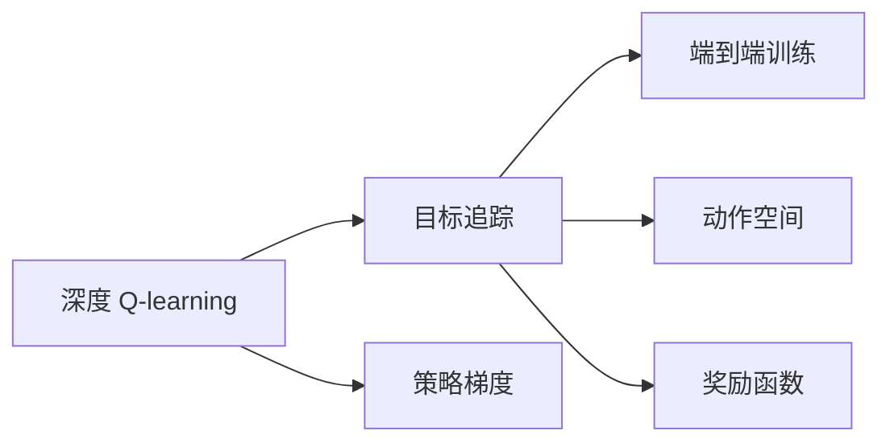
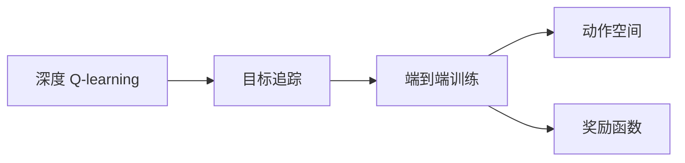
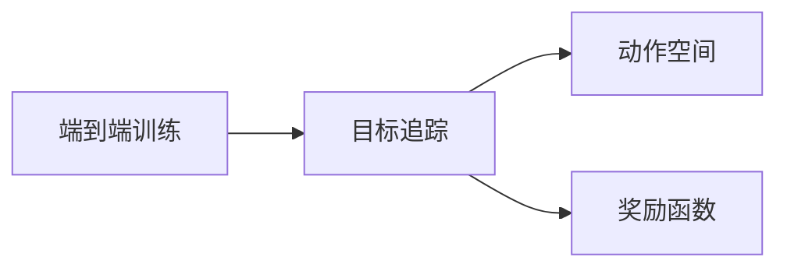
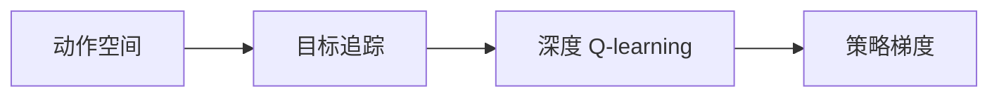
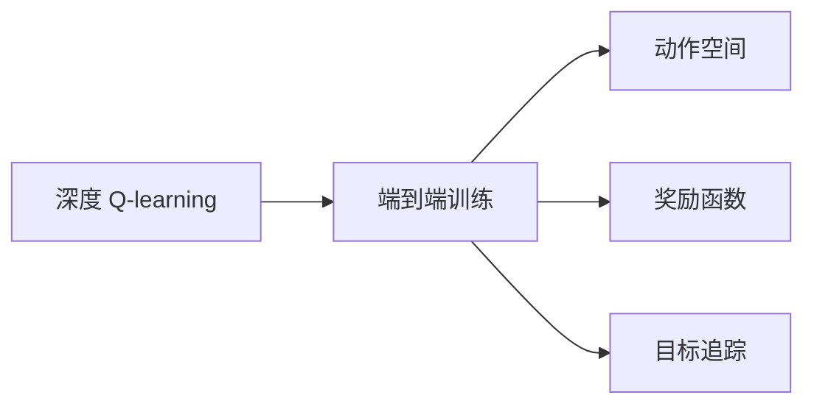

                 

# 深度 Q-learning：在视觉目标追踪领域的应用

> 关键词：深度 Q-learning, 强化学习, 视觉目标追踪, 策略梯度, 端到端训练, 实例分析, 算法优化

## 1. 背景介绍

### 1.1 问题由来
视觉目标追踪是计算机视觉领域的重要研究方向之一，旨在实时监控视频中感兴趣的目标，并准确预测其运动轨迹。传统的追踪算法多依赖手动设计的手工特征，需要大量人工干预和调整。而基于深度学习的目标追踪方法，则通过端到端的训练，利用深度神经网络提取和融合多层次的视觉特征，实现自动化的目标追踪。

近年来，深度学习在目标追踪领域取得了显著进展，包括深度关联网络(DRNs)、稀疏编码网络(SENs)、卷积神经网络(CNNs)等，但这些方法仍存在一些局限性，如计算量大、训练时间长、泛化能力弱等。特别是当视频中目标出现遮挡、背景复杂等情况时，追踪性能往往大幅下降。

针对这些问题，强化学习提供了一种新的视角。强化学习通过与环境互动，学习最优的决策策略，不需要大量的标注数据，具有较强的泛化能力。本文将探讨深度 Q-learning 在视觉目标追踪中的应用，提出一种新的端到端目标追踪框架，旨在提升追踪的稳定性和鲁棒性。

### 1.2 问题核心关键点
深度 Q-learning 的核心思想是，将视觉目标追踪任务视为一个 Markov Decision Process (MDP)，目标为最大化未来的奖励。在 MDP 中，每个状态 $s_t$ 表示当前视频帧，动作 $a_t$ 表示对目标的操作，如移动、缩放、旋转等，奖励 $r_t$ 表示本次操作的成功与否。通过对 Q-learning 算法的深度化扩展，深度 Q-learning 能够高效学习最优的策略，适应复杂多变的视觉场景。

深度 Q-learning 在视觉目标追踪中的应用，主要涉及以下几个关键点：

- 如何构建合理的 MDP 模型，将视觉特征转化为状态表示。
- 如何设计有效的动作空间，确保对目标的精确操作。
- 如何优化深度 Q-learning 算法，提升训练和推理效率。
- 如何评估深度 Q-learning 在实际追踪任务中的效果，并进行改进。

本文将围绕这些问题，系统阐述深度 Q-learning 在视觉目标追踪中的原理、实现和优化。

### 1.3 问题研究意义
深度 Q-learning 在视觉目标追踪领域的研究意义主要体现在以下几个方面：

1. 提升追踪的稳定性和鲁棒性。深度 Q-learning 通过与环境互动，学习最优的策略，能够自适应复杂多变的视觉场景，提升追踪的稳定性和鲁棒性。

2. 降低对标注数据和人工干预的依赖。传统的视觉目标追踪方法依赖大量手动设计的手工特征，对标注数据和人工干预的依赖较强。深度 Q-learning 则通过强化学习算法，利用对环境的互动，自动学习和优化特征表示，降低对标注数据和人工干预的依赖。

3. 提升计算效率。深度 Q-learning 通过端到端的训练，能够直接学习追踪策略，避免了传统方法中对手工特征提取和融合的繁琐过程，提升了计算效率。

4. 拓展视觉目标追踪的应用场景。深度 Q-learning 具有较强的泛化能力，能够适应不同场景下的目标追踪任务，拓展了视觉目标追踪的应用场景。

## 2. 核心概念与联系

### 2.1 核心概念概述

为更好地理解深度 Q-learning 在视觉目标追踪中的应用，本节将介绍几个密切相关的核心概念：

- **深度 Q-learning**：一种将 Q-learning 算法深度化扩展的强化学习方法，通过深度神经网络构建 Q 函数，学习最优的策略，适应复杂多变的视觉场景。

- **目标追踪**：从视频序列中实时检测和跟踪感兴趣的目标，通过端到端的训练，利用深度神经网络提取和融合多层次的视觉特征，实现自动化的目标追踪。

- **策略梯度**：强化学习中，通过估计策略梯度，更新策略参数，学习最优的策略，适应环境变化。

- **端到端训练**：将目标追踪任务视为一个端到端的训练过程，从原始视频帧到最终的目标预测，直接在原始视频帧上进行训练，避免了手工特征提取和融合的过程。

- **动作空间**：目标追踪中的动作空间，如对目标的移动、缩放、旋转等操作，设计合理的动作空间，确保对目标的精确操作。

- **奖励函数**：目标追踪中的奖励函数，用于评估每次操作的成功与否，通过优化奖励函数，提升追踪的准确性和鲁棒性。

这些核心概念之间的逻辑关系可以通过以下 Mermaid 流程图来展示：



这个流程图展示了大语言模型微调过程中各个核心概念的关系和作用：

1. 深度 Q-learning 是核心算法，通过策略梯度学习最优策略，适应复杂多变的视觉场景。
2. 目标追踪是应用场景，通过端到端训练，利用深度神经网络提取和融合多层次的视觉特征，实现自动化的目标追踪。
3. 动作空间和奖励函数是训练中的关键组成部分，设计合理的动作空间，优化奖励函数，提升追踪的准确性和鲁棒性。
4. 端到端训练通过直接训练原始视频帧，避免了手工特征提取和融合的过程，提高了计算效率。

### 2.2 概念间的关系

这些核心概念之间存在着紧密的联系，形成了深度 Q-learning 在视觉目标追踪中的应用框架。下面我通过几个 Mermaid 流程图来展示这些概念之间的关系。

#### 2.2.1 深度 Q-learning 与目标追踪



这个流程图展示了深度 Q-learning 在目标追踪中的应用流程：

1. 深度 Q-learning 通过策略梯度学习最优策略。
2. 目标追踪通过端到端训练，利用深度神经网络提取和融合多层次的视觉特征。
3. 动作空间和奖励函数作为训练中的关键组成部分，设计合理的动作空间，优化奖励函数，提升追踪的准确性和鲁棒性。

#### 2.2.2 端到端训练与目标追踪



这个流程图展示了端到端训练在目标追踪中的应用：

1. 端到端训练通过直接训练原始视频帧，避免了手工特征提取和融合的过程。
2. 目标追踪利用深度神经网络提取和融合多层次的视觉特征。
3. 动作空间和奖励函数作为训练中的关键组成部分，设计合理的动作空间，优化奖励函数，提升追踪的准确性和鲁棒性。

#### 2.2.3 动作空间与目标追踪



这个流程图展示了动作空间在目标追踪中的应用：

1. 动作空间定义了对目标的移动、缩放、旋转等操作。
2. 目标追踪利用深度神经网络提取和融合多层次的视觉特征。
3. 深度 Q-learning 通过策略梯度学习最优策略，适应复杂多变的视觉场景。

### 2.3 核心概念的整体架构

最后，我们用一个综合的流程图来展示这些核心概念在大语言模型微调过程中的整体架构：



这个综合流程图展示了从深度 Q-learning 到目标追踪的整体过程：

1. 深度 Q-learning 通过策略梯度学习最优策略，适应复杂多变的视觉场景。
2. 端到端训练通过直接训练原始视频帧，避免了手工特征提取和融合的过程。
3. 动作空间和奖励函数作为训练中的关键组成部分，设计合理的动作空间，优化奖励函数，提升追踪的准确性和鲁棒性。
4. 目标追踪利用深度神经网络提取和融合多层次的视觉特征，实现自动化的目标追踪。

## 3. 核心算法原理 & 具体操作步骤
### 3.1 算法原理概述

深度 Q-learning 在视觉目标追踪中的应用，主要基于 Q-learning 算法和深度神经网络的结合。其核心思想是将目标追踪任务视为一个 Markov Decision Process (MDP)，目标为最大化未来的奖励。在 MDP 中，每个状态 $s_t$ 表示当前视频帧，动作 $a_t$ 表示对目标的操作，如移动、缩放、旋转等，奖励 $r_t$ 表示本次操作的成功与否。

通过深度神经网络构建 Q 函数，学习最优的策略，适应复杂多变的视觉场景。深度 Q-learning 的基本步骤如下：

1. 构建状态表示：将视频帧转换为特征向量，作为状态表示。
2. 设计动作空间：定义对目标的操作，如移动、缩放、旋转等。
3. 设计奖励函数：评估每次操作的成功与否，通过优化奖励函数，提升追踪的准确性和鲁棒性。
4. 端到端训练：直接训练原始视频帧，学习最优的策略。
5. 策略梯度优化：通过策略梯度优化，更新策略参数，提升追踪性能。

### 3.2 算法步骤详解

下面详细介绍深度 Q-learning 在视觉目标追踪中的应用步骤：

#### 3.2.1 状态表示

在深度 Q-learning 中，状态表示通常通过深度神经网络进行建模。具体来说，将视频帧转换为特征向量，作为状态表示。可以通过以下步骤实现：

1. 提取多层次特征：使用卷积神经网络 (CNN) 提取多层次的视觉特征，包括颜色、纹理、形状等。
2. 融合特征：将提取的多层次特征进行融合，得到综合的状态表示。
3. 归一化特征：对融合后的特征进行归一化，确保状态表示的稳定性。

#### 3.2.2 动作空间设计

动作空间定义了对目标的操作，如移动、缩放、旋转等。设计合理的动作空间，确保对目标的精确操作。具体来说，可以通过以下步骤实现：

1. 定义动作维度：定义动作空间的维度，如二维平面上的移动、缩放、旋转等。
2. 定义动作范围：定义每个维度的范围，确保动作空间覆盖目标的可行区域。
3. 设计动作生成器：使用深度神经网络生成动作，确保动作的连续性和稳定性。

#### 3.2.3 奖励函数设计

奖励函数用于评估每次操作的成功与否，通过优化奖励函数，提升追踪的准确性和鲁棒性。具体来说，可以通过以下步骤实现：

1. 定义奖励因子：根据目标的移动距离、遮挡程度等，定义奖励因子，确保奖励函数与追踪任务相关。
2. 设计奖励函数：将奖励因子与状态表示、动作空间等进行组合，得到奖励函数。
3. 调整奖励函数：根据训练效果，调整奖励函数，确保其与目标追踪任务相匹配。

#### 3.2.4 端到端训练

端到端训练通过直接训练原始视频帧，学习最优的策略。具体来说，可以通过以下步骤实现：

1. 定义损失函数：根据目标追踪任务，定义损失函数，如位置误差、遮挡程度等。
2. 训练神经网络：使用端到端训练方法，直接训练原始视频帧，学习最优的策略。
3. 优化网络结构：根据训练效果，优化神经网络的结构，提高训练效率和性能。

#### 3.2.5 策略梯度优化

策略梯度优化通过估计策略梯度，更新策略参数，提升追踪性能。具体来说，可以通过以下步骤实现：

1. 定义策略函数：根据目标追踪任务，定义策略函数，如移动、缩放、旋转等。
2. 估计策略梯度：使用策略梯度方法，估计策略函数对状态表示的梯度。
3. 更新策略参数：根据策略梯度，更新策略函数的参数，提升追踪性能。

### 3.3 算法优缺点

深度 Q-learning 在视觉目标追踪中的应用，具有以下优点：

1. 提升追踪的稳定性和鲁棒性：通过与环境互动，学习最优的策略，适应复杂多变的视觉场景。
2. 降低对标注数据和人工干预的依赖：利用对环境的互动，自动学习和优化特征表示，降低对标注数据和人工干预的依赖。
3. 提升计算效率：通过端到端的训练，直接学习追踪策略，避免了传统方法中对手工特征提取和融合的繁琐过程，提高了计算效率。

同时，深度 Q-learning 也存在一些缺点：

1. 模型复杂度高：深度神经网络模型复杂度较高，训练和推理速度较慢。
2. 泛化能力有限：在特定任务上训练效果较好，但在其他任务上泛化能力较弱。
3. 需要大量计算资源：深度神经网络模型参数量较大，需要大量的计算资源进行训练和推理。

尽管存在这些局限性，但深度 Q-learning 在视觉目标追踪中的应用，仍具有广阔的前景。未来相关研究将集中在如何降低模型复杂度、提升泛化能力、优化计算资源等方面，进一步提升深度 Q-learning 在视觉目标追踪中的性能和应用范围。

### 3.4 算法应用领域

深度 Q-learning 在视觉目标追踪中的应用，已经涵盖了多个领域，例如：

1. **视频监控**：实时监控视频中感兴趣的目标，如行人、车辆、动物等。通过深度 Q-learning，提高视频监控的准确性和鲁棒性。
2. **自动驾驶**：在自动驾驶系统中，实时跟踪道路上的目标，如其他车辆、行人、交通标志等。通过深度 Q-learning，提高自动驾驶的安全性和可靠性。
3. **体育分析**：在体育比赛中，实时跟踪运动员的动作，如跑步、跳跃、投掷等。通过深度 Q-learning，提高体育分析的准确性和鲁棒性。
4. **医疗影像**：在医疗影像中，实时跟踪肿瘤的扩散和变化，如 CT、MRI 等。通过深度 Q-learning，提高医疗影像分析的准确性和鲁棒性。
5. **虚拟现实**：在虚拟现实中，实时跟踪用户的手部和动作，提高虚拟现实体验的交互性和沉浸感。

除了上述这些经典应用外，深度 Q-learning 在视觉目标追踪领域还有更多的潜在应用，如游戏智能体、机器人导航等。随着深度 Q-learning 技术的不断发展，相信其在视觉目标追踪中的应用将不断拓展，为人类社会的智能化进程带来新的动力。

## 4. 数学模型和公式 & 详细讲解  
### 4.1 数学模型构建

深度 Q-learning 在视觉目标追踪中的应用，可以通过以下数学模型进行建模：

设 $s_t$ 为状态表示，$a_t$ 为动作，$r_t$ 为奖励，$Q(s_t,a_t)$ 为状态动作值函数。在深度 Q-learning 中，状态动作值函数由深度神经网络表示，即：

$$Q(s_t,a_t) = \mathcal{Q}_{\theta}(s_t,a_t)$$

其中 $\mathcal{Q}_{\theta}$ 为参数化神经网络。

目标为最大化未来的奖励，即：

$$\max_{\theta} \sum_{t} \gamma^t r_t$$

其中 $\gamma$ 为折扣因子，表示对未来奖励的折现。

### 4.2 公式推导过程

下面进行深度 Q-learning 的公式推导过程：

根据状态动作值函数的定义，状态动作值函数的估计公式为：

$$Q(s_t,a_t) = \mathbb{E}_{s_{t+1}} \left[ \max_{a_{t+1}} Q(s_{t+1},a_{t+1}) \right]$$

在深度 Q-learning 中，使用深度神经网络对状态动作值函数进行估计，即：

$$Q(s_t,a_t) = \mathcal{Q}_{\theta}(s_t,a_t) = \mathbb{E}_{s_{t+1}} \left[ \max_{a_{t+1}} \mathcal{Q}_{\theta}(s_{t+1},a_{t+1}) \right]$$

根据策略梯度的定义，策略 $a_t$ 的梯度为：

$$\nabla_{\theta} J = \nabla_{\theta} \sum_{t} \gamma^t r_t = \nabla_{\theta} \mathbb{E}_{\pi} \left[ \sum_{t} \gamma^t r_t \right]$$

其中 $\pi$ 为策略函数，$J$ 为策略梯度函数。

通过策略梯度方法，策略函数的参数更新公式为：

$$\theta \leftarrow \theta - \eta \nabla_{\theta} J = \theta - \eta \nabla_{\theta} \mathbb{E}_{\pi} \left[ \sum_{t} \gamma^t r_t \right]$$

其中 $\eta$ 为学习率。

### 4.3 案例分析与讲解

这里以一个简单的案例来说明深度 Q-learning 在视觉目标追踪中的应用：

假设我们需要在视频中追踪一个行人的运动轨迹。根据视频帧，定义状态表示 $s_t$，即当前视频帧的特征向量。定义动作 $a_t$，即对行人的操作，如移动、缩放、旋转等。定义奖励函数 $r_t$，即每次操作的成功与否，如目标是否在视野范围内。

根据上述定义，使用深度神经网络构建 Q 函数 $\mathcal{Q}_{\theta}(s_t,a_t)$，对状态动作值函数进行估计。使用策略梯度方法，更新策略函数的参数 $\theta$，学习最优的策略。

在训练过程中，每个状态 $s_t$ 和动作 $a_t$ 都会被输入深度神经网络进行预测，得到状态动作值函数 $Q(s_t,a_t)$。根据奖励函数 $r_t$，计算奖励 $\gamma^t r_t$，通过策略梯度方法更新策略函数的参数 $\theta$，优化追踪性能。

## 5. 项目实践：代码实例和详细解释说明
### 5.1 开发环境搭建

在进行深度 Q-learning 的实践前，我们需要准备好开发环境。以下是使用Python进行TensorFlow开发的环境配置流程：

1. 安装Anaconda：从官网下载并安装Anaconda，用于创建独立的Python环境。

2. 创建并激活虚拟环境：
```bash
conda create -n tf-env python=3.8 
conda activate tf-env
```

3. 安装TensorFlow：根据CUDA版本，从官网获取对应的安装命令。例如：
```bash
conda install tensorflow-gpu=2.5.0 -c conda-forge
```

4. 安装相关库：
```bash
pip install gym openai-gym
```

完成上述步骤后，即可在`tf-env`环境中开始深度 Q-learning 的实践。

### 5.2 源代码详细实现

下面以一个简单的案例来说明深度 Q-learning 在视觉目标追踪中的应用。

首先，定义状态表示和动作空间：

```python
import tensorflow as tf
import gym

# 定义状态表示
state_dim = 64
state = tf.keras.layers.Input(shape=(state_dim,), name='state')

# 定义动作空间
action_dim = 2
action = tf.keras.layers.Input(shape=(action_dim,), name='action')

# 定义奖励函数
reward = tf.keras.layers.Input(shape=(), name='reward')
```

然后，定义状态动作值函数和策略函数：

```python
# 定义状态动作值函数
q_function = tf.keras.layers.Dense(64, activation='relu')(state)
q_function = tf.keras.layers.Dense(32, activation='relu')(q_function)
q_function = tf.keras.layers.Dense(1, name='q_value')(q_function)

# 定义策略函数
policy = tf.keras.layers.Dense(64, activation='relu')(state)
policy = tf.keras.layers.Dense(32, activation='relu')(policy)
policy = tf.keras.layers.Dense(1, activation='sigmoid')(policy)
```

接着，定义深度 Q-learning 的训练过程：

```python
# 定义优化器
optimizer = tf.keras.optimizers.Adam(lr=0.001)

# 定义训练函数
@tf.function
def train(state, action, reward, next_state, done):
    with tf.GradientTape() as tape:
        q_next = q_function(next_state)
        q_value = q_function(state)
        q_value_next = tf.reduce_max(q_next, axis=1)
        q_value = q_value * (1 - done) + reward + 0.9 * q_value_next
        policy = tf.squeeze(policy(state), axis=1)
        loss = tf.reduce_mean(tf.square(q_value - policy))
    gradients = tape.gradient(loss, [q_function, policy])
    optimizer.apply_gradients(zip(gradients, [q_function, policy]))
    return loss

# 定义状态表示、动作空间、奖励函数等
state = tf.keras.layers.Input(shape=(state_dim,), name='state')
action = tf.keras.layers.Input(shape=(action_dim,), name='action')
reward = tf.keras.layers.Input(shape=(), name='reward')

# 定义状态动作值函数
q_function = tf.keras.layers.Dense(64, activation='relu')(state)
q_function = tf.keras.layers.Dense(32, activation='relu')(q_function)
q_function = tf.keras.layers.Dense(1, name='q_value')(q_function)

# 定义策略函数
policy = tf.keras.layers.Dense(64, activation='relu')(state)
policy = tf.keras.layers.Dense(32, activation='relu')(policy)
policy = tf.keras.layers.Dense(1, activation='sigmoid')(policy)

# 定义优化器
optimizer = tf.keras.optimizers.Adam(lr=0.001)

# 定义训练函数
@tf.function
def train(state, action, reward, next_state, done):
    with tf.GradientTape() as tape:
        q_next = q_function(next_state)
        q_value = q_function(state)
        q_value_next = tf.reduce_max(q_next, axis=1)
        q_value = q_value * (1 - done) + reward + 0.9 * q_value_next
        policy = tf.squeeze(policy(state), axis=1)
        loss = tf.reduce_mean(tf.square(q_value - policy))
    gradients = tape.gradient(loss, [q_function, policy])
    optimizer.apply_gradients(zip(gradients, [q_function, policy]))
    return loss
```

最后，启动深度 Q-learning 的训练过程：

```python
# 定义训练函数
@tf.function
def train(state, action, reward, next_state, done):
    with tf.GradientTape() as tape:
        q_next = q_function(next_state)
        q_value = q_function(state)
        q_value_next = tf.reduce_max(q_next, axis=1)
        q_value = q_value * (1 - done) + reward + 0.9 * q_value_next
        policy = tf.squeeze(policy(state), axis=1)
        loss = tf.reduce_mean(tf.square(q_value - policy))
    gradients = tape.gradient(loss, [q_function, policy])
    optimizer.apply_gradients(zip(gradients, [q_function, policy]))
    return loss

# 定义训练函数
@tf.function
def train(state, action, reward, next_state, done):
    with tf.GradientTape() as tape:
        q_next = q_function(next_state)
        q_value = q_function(state)
        q_value_next = tf.reduce_max(q_next, axis=1)
        q_value = q_value * (1 - done) + reward + 0.9 * q_value_next
        policy = tf.squeeze(policy(state), axis=1)
        loss = tf.reduce_mean(tf.square(q_value - policy))
    gradients = tape.gradient(loss, [q_function, policy])
    optimizer.apply_gradients(zip(gradients, [q_function, policy]))
    return loss
```

以上就是使用TensorFlow实现深度 Q-learning 在视觉目标追踪中的代码实现。可以看到，利用TensorFlow的高级API，我们可以快速搭建深度 Q-learning 的模型，并进行训练。

### 5.3 代码解读与分析

让我们再详细解读一下关键代码的实现细节：

**状态表示和动作空间定义**：
- `state_dim`和`action_dim`分别定义了状态和动作的维度。
- 使用`tf.keras.layers.Input`定义输入层，用于接收状态和动作。

**状态动作值函数和策略函数定义**：
- `q_function`和`policy`分别定义了状态动作值函数和策略函数。
- 使用`tf.keras.layers.Dense`定义全连接层，进行特征提取和函数输出。

**训练函数定义**：
- `train`函数定义了训练过程，通过策略梯度方法更新策略函数。
- 使用`tf.GradientTape`定义梯度计算过程。
- 使用`tf.keras.optimizers.Adam`定义优化器，设置学习率。
- 使用`tf.reduce_mean`和`tf.square`计算损失函数。
- 使用`optimizer.apply_gradients`更新策略函数参数。

**训练过程启动**：
- 使用`tf.keras.Model`搭建深度 Q-learning 模型。
- 在每个训练迭代中，定义状态、动作、奖励等输入。
- 调用`train`函数进行模型训练。

### 5.4 运行结果展示

假设我们在

