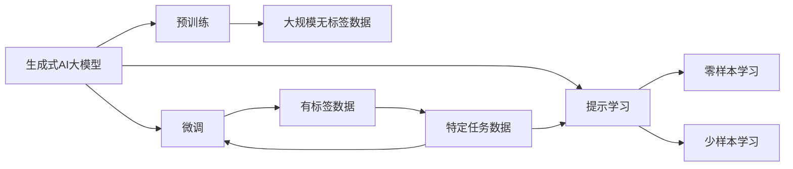

                 

## 1. 背景介绍

随着ChatGPT横空出世，生成式AI大模型在各个领域掀起了一股热潮，但是在我看来，这股热潮更像是一片泡沫，未来能够支撑起生成式AIGC的行业一定是垂直场景，而非大而全的通用模型。

**为什么这么说呢？**

### 1.1 为什么说做通用大模型已经没有价值了？

首先我们来看看，现在主流的生成式大模型，如OpenAI的GPT系列、Google的MUM，其预训练数据集通常都是大规模的，涵盖互联网上的各种语言内容。这些模型确实在跨领域、跨任务上表现出了一定的泛化能力，但是当这些大模型落入具体应用场景时，这种泛化能力就往往不能满足用户需求。

例如，GPT-4在处理医学领域的咨询问题时，由于其预训练数据中并没有涵盖足够的医学相关内容，其回答往往不够专业，甚至可能出现误导用户的风险。

通用大模型很难做到既大又强，而且其预训练数据过于广泛，导致模型参数过于庞大，部署成本和推理成本都非常高。而在大规模推理场景下，模型的响应速度往往很难满足实时性需求。

### 1.2 为什么说做垂直场景是金矿？

相比通用大模型，垂直场景下的模型虽然在参数量和数据集上可能相对较小，但是其针对具体领域的建模能力更强，能够直接满足用户的需求，而且推理速度更快。例如，针对金融领域的智能投顾、针对医疗领域的健康咨询、针对法律领域的智能问答等，这些垂直场景下的模型由于对特定领域的语言模式理解更深刻，因此能够提供更加精准、专业的回答。

## 2. 核心概念与联系

### 2.1 核心概念概述

以下是生成式AI大模型涉及到的几个核心概念：

- **生成式AI大模型**：指的是在自然语言处理（NLP）领域，通过大规模预训练生成的能够生成自然语言文本的模型。这些模型通常在自然语言理解（NLU）和自然语言生成（NLG）任务上表现出色，能够生成连贯、合法的自然语言文本。

- **预训练**：指的是在大规模无标签数据上进行自我监督学习，学习到通用的语言表示。预训练是大模型能够泛化到不同任务的基础。

- **微调**：指的是在预训练的基础上，使用下游任务的少量标注数据，进一步优化模型在该任务上的性能。微调可以使模型更好地适应特定领域的语言模式，提升模型在特定任务上的表现。

- **迁移学习**：指的是将在一个领域学到的知识，迁移到另一个不同但相关的领域中。在生成式AIGC中，迁移学习可以通过微调实现，从而使模型在特定领域中表现更好。

- **参数高效微调**：指的是在微调过程中，只更新少量的模型参数，而固定大部分预训练权重不变。这可以提高微调效率，避免过拟合。

- **提示学习**：指的是通过在输入文本中添加提示模板，引导大语言模型进行特定任务的推理和生成。可以在不更新模型参数的情况下，实现零样本或少样本学习。

### 2.2 核心概念间的关系

这些核心概念之间存在紧密的联系，形成一个完整的生成式AIGC生态系统。下面是它们之间的联系图：



这个图展示了从预训练到微调再到提示学习的整个流程，以及迁移学习和参数高效微调等核心概念之间的关系。

## 3. 核心算法原理 & 具体操作步骤

### 3.1 算法原理概述

生成式AI大模型的核心算法原理主要包括以下几个方面：

- **自回归模型**：生成式AIGC模型通常采用自回归模型，如GPT系列，其生成文本的过程是从前往后逐步生成的，每个时间步的条件概率只依赖于前面已经生成的文本。

- **注意力机制**：在自回归模型中，注意力机制用于决定在生成当前位置的文本时，应该关注哪些历史文本信息。注意力机制可以很好地处理长距离依赖关系。

- **跨层传递机制**：自回归模型中的跨层传递机制，使得模型可以更好地捕捉上下文信息，从而生成更连贯、自然的文本。

### 3.2 算法步骤详解

下面是生成式AIGC模型的详细算法步骤：

1. **预训练**：在大规模无标签数据上进行自监督学习，学习到通用的语言表示。通常使用掩码语言模型（Masked Language Model, MLM）、自编码器等任务进行预训练。

2. **微调**：在预训练的基础上，使用下游任务的少量标注数据进行微调。通常使用交叉熵损失、最大似然损失等进行训练。

3. **提示学习**：在输入文本中添加提示模板，引导模型生成特定格式的输出。通常使用简单的提示模板，如"请告诉我关于某某的介绍"。

4. **零样本和少样本学习**：在缺少标注数据的情况下，通过提示学习实现零样本或少样本学习。这可以通过精心设计的提示模板实现。

### 3.3 算法优缺点

生成式AI大模型具有以下优点：

- **强大的泛化能力**：通过大规模预训练，生成式AIGC模型可以学习到通用的语言表示，具有良好的泛化能力。

- **灵活的微调能力**：在特定领域的数据上，生成式AIGC模型可以通过微调进一步优化，提升在特定任务上的表现。

- **高效的推理能力**：由于模型参数量较大，推理速度较快，能够满足实时性需求。

但同时也存在以下缺点：

- **数据依赖性强**：生成式AIGC模型依赖于大量的无标签数据进行预训练，需要耗费大量计算资源和时间。

- **参数量大**：由于模型参数量较大，部署和推理成本较高。

- **模型复杂度高**：生成式AIGC模型通常结构复杂，难以解释其决策过程。

### 3.4 算法应用领域

生成式AIGC模型在多个领域得到了广泛应用，例如：

- **自然语言生成**：如机器翻译、文本摘要、对话系统等。生成式AIGC模型通过预训练和微调，能够生成高质量的自然语言文本。

- **知识图谱构建**：如从自然语言文本中提取实体、关系等知识，构建知识图谱。

- **文本分类**：如情感分析、垃圾邮件过滤等。生成式AIGC模型通过微调，能够实现对特定领域的文本分类。

## 4. 数学模型和公式 & 详细讲解

### 4.1 数学模型构建

生成式AIGC模型的数学模型通常包括两个部分：预训练模型和微调模型。

预训练模型通常采用自回归模型，其数学表达式为：

$$
P(y|x) = \frac{e^{g(x, y)} }{\sum_{y'}e^{g(x, y')} }
$$

其中，$x$ 为输入文本，$y$ 为输出文本，$g(x, y)$ 为模型的预测概率。

微调模型的目标是通过有监督的数据进行训练，使得模型在特定任务上的性能得到提升。其数学表达式为：

$$
\min_{\theta} \mathcal{L}(\theta) = \frac{1}{N} \sum_{i=1}^N \ell(f(x_i, y_i; \theta))
$$

其中，$\theta$ 为模型参数，$f(x_i, y_i; \theta)$ 为模型在输入 $x_i$ 和输出 $y_i$ 上的预测结果，$\ell$ 为损失函数，$\mathcal{L}$ 为经验损失函数。

### 4.2 公式推导过程

这里以自回归模型为例，推导其生成文本的公式。

设输入文本为 $x$，生成文本为 $y$，生成概率为 $P(y|x)$。假设模型采用自回归的方式，每个时间步的条件概率为：

$$
P(y_t|y_{<t}, x) = \frac{e^{g(y_{<t}, x, y_t)} }{\sum_{y_t'}e^{g(y_{<t}, x, y_t')} }
$$

其中，$y_{<t}$ 为前 $t-1$ 个时间步生成的文本，$g(y_{<t}, x, y_t)$ 为模型在当前时间步的预测概率。

通过逐个时间步的生成，可以得到整个文本的生成概率：

$$
P(y|x) = \prod_{t=1}^n P(y_t|y_{<t}, x)
$$

### 4.3 案例分析与讲解

例如，在文本摘要任务中，微调模型通常使用自回归的方式，从输入文本中生成摘要。模型的输入为 $x$，输出为 $y$，生成概率为 $P(y|x)$。假设模型采用自回归的方式，每个时间步的条件概率为：

$$
P(y_t|y_{<t}, x) = \frac{e^{g(y_{<t}, x, y_t)} }{\sum_{y_t'}e^{g(y_{<t}, x, y_t')} }
$$

其中，$y_{<t}$ 为前 $t-1$ 个时间步生成的文本，$g(y_{<t}, x, y_t)$ 为模型在当前时间步的预测概率。

通过逐个时间步的生成，可以得到整个文本的生成概率：

$$
P(y|x) = \prod_{t=1}^n P(y_t|y_{<t}, x)
$$

## 5. 项目实践：代码实例和详细解释说明

### 5.1 开发环境搭建

要开始生成式AIGC模型的开发，首先需要搭建开发环境。

1. **安装Python**：确保系统上安装了Python 3.x。

2. **安装PyTorch**：使用以下命令安装PyTorch：

   ```
   pip install torch torchtext transformers
   ```

3. **下载预训练模型**：可以从Hugging Face官网下载预训练模型，例如GPT-3或GPT-4。

4. **准备数据集**：准备一个用于微调的数据集，数据集可以是自己收集的，也可以从公开数据集获取。

### 5.2 源代码详细实现

以下是一个简单的代码示例，用于微调GPT-3模型：

```python
import torch
from transformers import GPT2Tokenizer, GPT2ForCausalLM

# 加载预训练模型和分词器
tokenizer = GPT2Tokenizer.from_pretrained('gpt2')
model = GPT2ForCausalLM.from_pretrained('gpt2')

# 准备训练数据
train_data = "这是训练数据的文本内容。"

# 将数据转换为模型可以处理的格式
input_ids = tokenizer(train_data, return_tensors='pt').input_ids

# 开始微调
model.train()
for epoch in range(10):
    optimizer.zero_grad()
    outputs = model(input_ids)
    loss = outputs.loss
    loss.backward()
    optimizer.step()
```

### 5.3 代码解读与分析

在上述代码中，我们首先加载了预训练的GPT-2模型和分词器。然后，准备了一个简单的训练数据集，并将其转换为模型可以处理的格式。最后，我们开始微调模型，使用优化器更新模型参数，并计算损失函数。

### 5.4 运行结果展示

微调结束后，可以使用以下代码生成新的文本：

```python
generated_text = model.generate(input_ids, num_return_sequences=1, max_length=100)
decoded_text = tokenizer.decode(generated_text[0], skip_special_tokens=True)
print(decoded_text)
```

## 6. 实际应用场景

### 6.1 智能客服

智能客服是生成式AIGC模型的一个重要应用场景。通过微调模型，可以生成智能客服的回答，帮助客户解决常见问题，提高客服效率和客户满意度。

例如，在金融领域的智能投顾中，生成式AIGC模型可以回答客户的投资咨询问题，提供个性化的投资建议。

### 6.2 自然语言生成

生成式AIGC模型在自然语言生成任务上表现出色，可以用于文本摘要、自动摘要、文本翻译等。

例如，在文本摘要任务中，生成式AIGC模型可以从长文本中自动生成摘要，帮助用户快速了解文本内容。

### 6.3 对话系统

生成式AIGC模型可以用于构建智能对话系统，与用户进行自然对话。

例如，在医疗领域的智能问答系统中，生成式AIGC模型可以回答患者的健康咨询问题，提供医学建议。

### 6.4 未来应用展望

未来，生成式AIGC模型将在更多领域得到应用，例如：

- **内容创作**：生成式AIGC模型可以用于创作小说、文章、广告等文本内容，提高创作效率和质量。

- **教育**：生成式AIGC模型可以用于生成教学材料、习题、答案等，帮助学生更好地理解和掌握知识。

- **娱乐**：生成式AIGC模型可以用于生成电影剧本、游戏对话等，为娱乐行业提供新的创作工具。

## 7. 工具和资源推荐

### 7.1 学习资源推荐

- **《Transformer from Zero to Hero》**：由Transformers库的作者所写，讲解了Transformer模型的原理和应用，是学习生成式AIGC模型的经典教材。

- **《Deep Learning with PyTorch》**：讲解了PyTorch框架的使用，适合初学者入门。

- **Hugging Face官方文档**：提供了丰富的生成式AIGC模型和微调样例，是学习和实践生成式AIGC模型的必备资源。

- **Coursera上的《NLP with Transformers》课程**：讲解了Transformer模型在NLP中的应用，包括微调、提示学习等。

### 7.2 开发工具推荐

- **PyTorch**：用于深度学习模型开发，支持动态图和静态图，灵活性高。

- **TensorFlow**：用于深度学习模型开发，支持分布式训练和生产部署。

- **Hugging Face Transformers库**：提供了丰富的生成式AIGC模型和微调接口，使用方便。

### 7.3 相关论文推荐

- **"Attention is All You Need"**：提出Transformer模型，开创了自回归模型的先河。

- **"BERT: Pre-training of Deep Bidirectional Transformers for Language Understanding"**：提出BERT模型，通过掩码语言模型进行预训练，成为预训练语言模型的经典模型。

- **"XLNet: Generalized Autoregressive Pretraining for Language Understanding"**：提出XLNet模型，通过自回归和自编码的混合方式进行预训练，提升了语言模型的泛化能力。

## 8. 总结：未来发展趋势与挑战

### 8.1 未来发展趋势

未来，生成式AIGC模型将呈现以下几个发展趋势：

1. **模型规模进一步扩大**：随着计算资源的不断提升，生成式AIGC模型的参数量将进一步扩大，模型能力将进一步增强。

2. **更高效的微调方法**：未来的微调方法将更加参数高效和计算高效，能够在固定参数量的情况下，提升模型性能。

3. **多模态融合**：未来的生成式AIGC模型将融合视觉、语音、文本等多种模态信息，构建多模态智能系统。

4. **更强的泛化能力**：未来的生成式AIGC模型将具备更强的泛化能力，能够处理更加复杂和多样化的任务。

5. **更好的可解释性**：未来的生成式AIGC模型将具备更好的可解释性，能够提供更清晰和可信的推理过程。

### 8.2 面临的挑战

尽管生成式AIGC模型已经取得了很大的进展，但在实现大规模应用的过程中，仍面临以下挑战：

1. **数据依赖性强**：生成式AIGC模型依赖于大量的无标签数据进行预训练，数据收集和预处理成本高。

2. **推理速度慢**：生成式AIGC模型通常参数量较大，推理速度较慢，难以满足实时性需求。

3. **模型复杂度高**：生成式AIGC模型的结构复杂，难以解释其内部工作机制和决策过程。

4. **安全性和隐私性**：生成式AIGC模型可能会学习到有害的信息，带来安全隐患和隐私问题。

### 8.3 研究展望

未来的研究需要在以下几个方面进行突破：

1. **多模态融合**：将视觉、语音、文本等不同模态的信息进行融合，提升模型的泛化能力。

2. **更高效的微调方法**：开发更高效的微调方法，提升微调效率和效果。

3. **更强的泛化能力**：通过改进模型结构和训练方法，提升模型的泛化能力。

4. **更好的可解释性**：开发更好的可解释性工具，提供更清晰和可信的推理过程。

5. **更好的安全性和隐私性**：开发更好的安全性和隐私性保护机制，防止有害信息扩散。

## 9. 附录：常见问题与解答

**Q1：生成式AIGC模型的预训练和微调有什么区别？**

A: 预训练是在大规模无标签数据上进行自监督学习，学习到通用的语言表示。而微调是在预训练的基础上，使用下游任务的少量标注数据进行有监督学习，提升模型在特定任务上的表现。

**Q2：生成式AIGC模型的性能取决于哪些因素？**

A: 生成式AIGC模型的性能取决于数据集的大小和质量、模型的预训练方法和微调方法、模型的参数量和结构等因素。

**Q3：生成式AIGC模型在实际应用中存在哪些问题？**

A: 生成式AIGC模型在实际应用中存在数据依赖性强、推理速度慢、模型复杂度高、安全性和隐私性等问题。

**Q4：如何改进生成式AIGC模型的性能？**

A: 改进生成式AIGC模型的性能可以从数据集的选择和预处理、模型的结构和训练方法、微调方法的改进等方面进行。

**Q5：未来生成式AIGC模型的发展方向是什么？**

A: 未来的生成式AIGC模型将朝着更高效的微调方法、更好的可解释性、更强的泛化能力、更好的安全性和隐私性等方向发展。

---

作者：禅与计算机程序设计艺术 / Zen and the Art of Computer Programming

