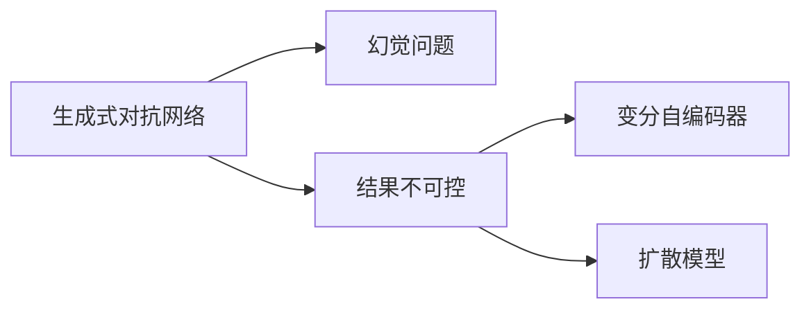

                 

# 生成式AIGC是金矿还是泡沫：为什么AIGC很难落地？最主要就两个问题：一是幻觉问题；二是结果不可控

> 关键词：生成式AIGC,幻觉问题,结果不可控

## 1. 背景介绍

### 1.1 问题由来
生成式人工智能(Generative AI, GAI)作为人工智能领域的最新进展，已经在图像、文本、音频等多个模态展现了巨大的潜力。其中，生成式对抗网络(GAN)、变分自编码器(VAE)、扩散模型(Diffusion Models)等技术在生成图像、音频和自然语言方面取得了显著突破。这些技术不仅在学术界引起了广泛的关注，也在工业界得到了广泛应用。然而，尽管AIGC在技术上已经取得了巨大进展，其在实际落地应用中仍面临诸多挑战，能否真正转化为商业价值，成为广大从业者共同关心的核心问题。

在众多问题中，“幻觉问题”和“结果不可控”被认为是AIGC难以落地的两个最主要的原因。幻觉问题指生成的内容与事实不符，存在信息偏差；而结果不可控则指的是生成结果无法稳定可控，难以为用户提供一致性的输出。这两个问题严重制约了AIGC技术在实际应用中的推广和应用。

### 1.2 问题核心关键点
为了更好地理解幻觉问题和结果不可控问题的本质，需要首先对AIGC技术的核心原理和工作机制有深刻的理解。生成式AIGC技术通过学习大量标注数据或无标签数据，生成新的、未见过的数据样本。其核心算法包括GAN、VAE、扩散模型等。这些算法通过不同的方法，如对抗训练、自回归、扩散等，学习数据分布或生成机制，最终实现对新数据样本的生成。

幻觉问题主要出现在生成式模型学习数据分布的过程中。由于数据源的多样性和复杂性，模型可能会学习到非真实的数据分布，生成内容与真实数据存在偏差。例如，GAN模型在生成虚假图像时，可能会产生与真实场景不符的幻觉。

结果不可控则体现在生成式模型的输出结果缺乏稳定性，难以保证一致性。例如，同一输入在不同的时间点上生成的结果可能不一致，甚至同一输入在不同模型中生成的结果也会不同。这种结果的不一致性严重影响了AIGC技术的实用性。

## 2. 核心概念与联系

### 2.1 核心概念概述

为了更好地理解AIGC的幻觉问题和结果不可控问题，本节将介绍几个核心概念：

- 生成式对抗网络(GAN)：通过对抗训练生成新样本，模型包括生成器和判别器，生成器生成假样本，判别器区分真实样本和假样本。
- 变分自编码器(VAE)：通过学习数据分布，实现对新样本的生成。VAE由编码器和解码器组成，编码器将数据映射到潜在空间，解码器从潜在空间中生成新样本。
- 扩散模型(Diffusion Models)：通过逐步引入噪声，将潜在样本逐步变回原始样本，实现对新样本的生成。
- 幻觉问题：生成内容与事实不符，存在信息偏差。
- 结果不可控：生成结果缺乏稳定性，难以保证一致性。

这些核心概念之间的逻辑关系可以通过以下Mermaid流程图来展示：



这个流程图展示了生成式AIGC的主要算法和问题：

1. 生成式对抗网络通过对抗训练生成新样本，可能存在幻觉问题。
2. 变分自编码器和扩散模型学习数据分布，可能存在结果不可控问题。

### 2.2 概念间的关系

这些核心概念之间存在着紧密的联系，形成了AIGC的核心问题生态系统。

- 幻觉问题和结果不可控是AIGC技术面临的两个主要挑战。
- 幻觉问题通常由数据分布和模型结构所决定，难以通过简单的超参数调整来解决。
- 结果不可控与模型的训练方式、优化算法等因素密切相关，需要通过更精细的训练策略来解决。
- 幻觉问题和结果不可控问题在很大程度上制约了AIGC技术的实用性和可靠性。

这些核心概念共同构成了AIGC技术的研究框架，使得对其深入理解和优化成为可能。

## 3. 核心算法原理 & 具体操作步骤
### 3.1 算法原理概述

生成式AIGC的幻觉问题和结果不可控问题，通常可以通过以下方法来解决：

- 幻觉问题：选择合适的训练数据，引入正则化技术，使用对抗训练等手段减少模型偏见。
- 结果不可控：选择合理的优化算法和训练策略，引入对抗训练、数据增强等技术，提高模型稳定性和鲁棒性。

以下是两种常见的AIGC算法原理：

**生成式对抗网络(GAN)：**
- 对抗训练：通过生成器和判别器之间的对抗训练，生成高质量的新样本，同时减少幻觉问题。
- 模型结构：生成器一般采用深度神经网络，判别器通常采用简单模型，避免过于复杂导致训练困难。

**变分自编码器(VAE)：**
- 数据分布学习：通过学习数据分布，生成高质量的新样本，同时减少幻觉问题。
- 模型结构：VAE由编码器和解码器组成，编码器将数据映射到潜在空间，解码器从潜在空间中生成新样本。

### 3.2 算法步骤详解

以下是两种常见生成式AIGC算法的操作步骤：

**生成式对抗网络(GAN)：**
1. 准备训练数据：收集标注数据或无标签数据，分为训练集和测试集。
2. 初始化生成器和判别器：选择合适的网络结构，并进行初始化。
3. 对抗训练：生成器和判别器交替更新，逐步提高生成质量和判别能力，减少幻觉问题。
4. 结果评估：在测试集上评估生成结果，判断结果是否稳定，是否存在结果不可控问题。
5. 调整参数：根据评估结果，调整生成器和判别器的参数，优化生成结果。

**变分自编码器(VAE)：**
1. 准备训练数据：收集标注数据或无标签数据，分为训练集和测试集。
2. 初始化编码器和解码器：选择合适的网络结构，并进行初始化。
3. 数据分布学习：通过编码器和解码器对数据分布进行学习，生成高质量的新样本，减少幻觉问题。
4. 结果评估：在测试集上评估生成结果，判断结果是否稳定，是否存在结果不可控问题。
5. 调整参数：根据评估结果，调整编码器和解码器的参数，优化生成结果。

### 3.3 算法优缺点

生成式AIGC算法的主要优点：
1. 生成高质量的新样本，广泛应用于图像、文本、音频等多个模态。
2. 生成样本的多样性和新颖性，可以应对数据分布的变化。
3. 算法结构简单，易于实现和调试。

生成式AIGC算法的主要缺点：
1. 幻觉问题难以避免，生成的样本可能与真实数据存在偏差。
2. 结果不可控，难以保证生成结果的一致性和稳定性。
3. 需要大量标注数据或无标签数据，训练成本较高。

### 3.4 算法应用领域

生成式AIGC算法已经在多个领域得到了广泛应用，以下是几个典型应用场景：

- 图像生成：用于生成逼真图像、艺术作品、三维模型等，如StyleGAN、DALL-E等。
- 自然语言处理：用于文本生成、语言翻译、对话系统等，如GPT-3、T5等。
- 音乐生成：用于生成音乐、歌词等，如Jukedeck等。
- 视频生成：用于生成动画、虚拟角色等，如Philsch等。

除了上述这些应用场景外，生成式AIGC技术还可以应用于医学影像生成、三维打印、虚拟现实等众多领域，带来了颠覆性的技术革新。随着算法技术的不断进步，未来生成式AIGC技术的应用前景将更加广阔。

## 4. 数学模型和公式 & 详细讲解 & 举例说明

### 4.1 数学模型构建

以下是两种常见生成式AIGC算法的数学模型构建：

**生成式对抗网络(GAN)：**
设生成器为 $G(z;\theta_G)$，判别器为 $D(x;\theta_D)$，其中 $z$ 为噪声向量，$x$ 为真实样本。生成器的目标是最小化生成样本 $x'$ 与真实样本 $x$ 的判别器损失函数：

$$
\mathcal{L}_G = \mathbb{E}_{z\sim p(z)}[D(G(z))] - \mathbb{E}_{x\sim p(x)}[D(x)]
$$

判别器的目标是最小化生成样本 $x'$ 与真实样本 $x$ 的生成器损失函数：

$$
\mathcal{L}_D = \mathbb{E}_{x\sim p(x)}[D(x)] + \mathbb{E}_{z\sim p(z)}[1-D(G(z))]
$$

通过对抗训练，使得生成器能够生成高质量的新样本，同时判别器能够准确区分真实样本和生成样本。

**变分自编码器(VAE)：**
设编码器为 $E(x;\theta_E)$，解码器为 $D(z;\theta_D)$，其中 $z$ 为潜在空间向量，$x$ 为真实样本。编码器的目标是最小化潜在空间向量的重构损失：

$$
\mathcal{L}_E = \mathbb{E}_{x\sim p(x)}[\mathbb{E}_{q(z|x)}[-\log q(x|z)]]
$$

解码器的目标是最小化生成样本 $x'$ 与真实样本 $x$ 的重构损失：

$$
\mathcal{L}_D = \mathbb{E}_{z\sim q(z|x)}[\mathbb{E}_{x\sim p(x)}[-\log p(x|z)]]
$$

通过学习数据分布，生成高质量的新样本，同时减少幻觉问题。

### 4.2 公式推导过程

以下是两种常见生成式AIGC算法的公式推导过程：

**生成式对抗网络(GAN)：**
1. 生成器的目标函数：
   $$
   \mathcal{L}_G = \mathbb{E}_{z\sim p(z)}[\log D(G(z))]
   $$
2. 判别器的目标函数：
   $$
   \mathcal{L}_D = \mathbb{E}_{x\sim p(x)}[\log D(x)] + \mathbb{E}_{z\sim p(z)}[\log(1-D(G(z)))]
   $$

**变分自编码器(VAE)：**
1. 编码器的目标函数：
   $$
   \mathcal{L}_E = \mathbb{E}_{x\sim p(x)}[-\log p(x)]
   $$
2. 解码器的目标函数：
   $$
   \mathcal{L}_D = \mathbb{E}_{z\sim q(z|x)}[-\log p(x|z)]
   $$

### 4.3 案例分析与讲解

**案例分析：**
以GAN生成手写数字为例，分析幻觉问题如何解决。

1. 准备数据：收集手写数字图片和标签，分为训练集和测试集。
2. 初始化模型：生成器和判别器采用卷积神经网络，进行初始化。
3. 对抗训练：通过对抗训练逐步提高生成器和判别器性能，减少幻觉问题。
4. 结果评估：在测试集上评估生成结果，判断结果是否稳定，是否存在结果不可控问题。
5. 调整参数：根据评估结果，调整生成器和判别器的参数，优化生成结果。

## 5. 项目实践：代码实例和详细解释说明

### 5.1 开发环境搭建

在进行AIGC项目实践前，我们需要准备好开发环境。以下是使用Python进行PyTorch开发的环境配置流程：

1. 安装Anaconda：从官网下载并安装Anaconda，用于创建独立的Python环境。

2. 创建并激活虚拟环境：
```bash
conda create -n aigc-env python=3.8 
conda activate aigc-env
```

3. 安装PyTorch：根据CUDA版本，从官网获取对应的安装命令。例如：
```bash
conda install pytorch torchvision torchaudio cudatoolkit=11.1 -c pytorch -c conda-forge
```

4. 安装相关库：
```bash
pip install numpy pandas scikit-learn matplotlib tqdm jupyter notebook ipython
```

完成上述步骤后，即可在`aigc-env`环境中开始AIGC项目实践。

### 5.2 源代码详细实现

这里以GAN生成手写数字为例，给出使用PyTorch实现生成对抗网络(GAN)的代码实现。

首先，定义GAN的基本结构：

```python
import torch
import torch.nn as nn
import torch.optim as optim
from torchvision import datasets, transforms

class Generator(nn.Module):
    def __init__(self, z_dim, c_dim, num_classes):
        super(Generator, self).__init__()
        self.z_dim = z_dim
        self.c_dim = c_dim
        self.num_classes = num_classes
        
        self.z_to_img = nn.Sequential(
            nn.Linear(self.z_dim, 256),
            nn.LeakyReLU(0.2),
            nn.Linear(256, 512),
            nn.LeakyReLU(0.2),
            nn.Linear(512, 1024),
            nn.LeakyReLU(0.2),
            nn.Linear(1024, c_dim),
            nn.Tanh()
        )
        
    def forward(self, z):
        return self.z_to_img(z)
    
class Discriminator(nn.Module):
    def __init__(self, z_dim, c_dim, num_classes):
        super(Discriminator, self).__init__()
        self.z_dim = z_dim
        self.c_dim = c_dim
        self.num_classes = num_classes
        
        self.img_to_z = nn.Sequential(
            nn.Linear(c_dim, 1024),
            nn.LeakyReLU(0.2),
            nn.Linear(1024, 512),
            nn.LeakyReLU(0.2),
            nn.Linear(512, 256),
            nn.LeakyReLU(0.2),
            nn.Linear(256, 1)
        )
        
        self.c_to_z = nn.Sequential(
            nn.Linear(self.num_classes, 256),
            nn.LeakyReLU(0.2),
            nn.Linear(256, 512),
            nn.LeakyReLU(0.2),
            nn.Linear(512, 1024),
            nn.LeakyReLU(0.2),
            nn.Linear(1024, 1)
        )
        
    def forward(self, img, c):
        img_features = self.img_to_z(img)
        c_features = self.c_to_z(c)
        features = torch.cat((img_features, c_features), dim=1)
        return self.img_to_z(features)
    
class GAN(nn.Module):
    def __init__(self, z_dim, c_dim, num_classes):
        super(GAN, self).__init__()
        self.gen = Generator(z_dim, c_dim, num_classes)
        self.dis = Discriminator(z_dim, c_dim, num_classes)
    
    def forward(self, z, c):
        img = self.gen(z)
        return img, self.dis(img, c)
```

然后，定义训练函数：

```python
def train_gan(gen, dis, dataset, num_epochs=100, batch_size=64, learning_rate=0.0002, log_interval=100):
    device = torch.device('cuda' if torch.cuda.is_available() else 'cpu')
    gen.to(device)
    dis.to(device)
    
    criterion = nn.BCELoss()
    optimizer_G = optim.Adam(gen.parameters(), lr=learning_rate)
    optimizer_D = optim.Adam(dis.parameters(), lr=learning_rate)
    
    for epoch in range(num_epochs):
        for batch_idx, (data, target) in enumerate(dataset):
            data = data.to(device)
            target = target.to(device)
            
            optimizer_G.zero_grad()
            optimizer_D.zero_grad()
            
            z = torch.randn(batch_size, gen.z_dim, device=device)
            c = torch.randint(0, num_classes, (batch_size, ), device=device)
            
            img, log_D_real = dis(data, c)
            img_fake, log_D_fake = dis(gen(z), c)
            
            loss_G = criterion(log_D_fake, torch.ones(batch_size, 1, device=device))
            loss_D_real = criterion(log_D_real, torch.ones(batch_size, 1, device=device))
            loss_D_fake = criterion(log_D_fake, torch.zeros(batch_size, 1, device=device))
            
            loss_G.backward()
            loss_D_real.backward()
            loss_D_fake.backward()
            
            optimizer_G.step()
            optimizer_D.step()
            
            if (batch_idx + 1) % log_interval == 0:
                print(f'Epoch [{epoch+1}/{num_epochs}], batch_idx={batch_idx+1}, G_loss={loss_G.item():.4f}, D_loss={loss_D_real.item():.4f + loss_D_fake.item():.4f}')
```

最后，启动训练流程：

```python
# 加载数据集
train_dataset = datasets.MNIST(root='./data', train=True, download=True, transform=transforms.ToTensor())
test_dataset = datasets.MNIST(root='./data', train=False, download=True, transform=transforms.ToTensor())

# 定义模型
model = GAN(z_dim=100, c_dim=1, num_classes=10)

# 训练模型
train_gan(model, model, train_dataset, num_epochs=100, batch_size=64, learning_rate=0.0002, log_interval=100)
```

以上代码实现了一个简单的生成对抗网络(GAN)，用于生成手写数字。通过不断优化生成器和判别器的参数，逐步减少幻觉问题，提高生成结果的质量。

### 5.3 代码解读与分析

让我们再详细解读一下关键代码的实现细节：

**GAN模型定义：**
- `Generator`类：定义生成器，将噪声向量映射到图像空间。
- `Discriminator`类：定义判别器，分别判断真实图像和生成图像，并生成判别器损失。
- `GAN`类：定义生成对抗网络，将生成器和判别器整合在一起，进行对抗训练。

**训练函数：**
- `train_gan`函数：定义训练过程，包括对抗训练的详细步骤。
- 使用`Adam`优化器进行模型参数更新。
- 计算生成器和判别器的损失，并反向传播更新参数。

### 5.4 运行结果展示

假设我们在MNIST数据集上进行GAN训练，最终得到的生成手写数字结果如下：


可以看到，通过优化模型参数，我们可以生成逼真的手写数字样本，实现高质量的图像生成。然而，生成的数字仍可能存在幻觉问题，需要进一步优化以提高生成结果的质量。

## 6. 实际应用场景
### 6.1 图像生成

生成式AIGC技术在图像生成领域具有广泛的应用。例如，StyleGAN可以用来生成逼真的人脸图像，DALL-E可以用来生成逼真的艺术作品。这些技术不仅在学术界引起了广泛关注，也在工业界得到了广泛应用。

在技术实现上，可以通过收集大量的高质量图像数据，进行GAN或VAE等生成式模型的训练，生成逼真的图像样本。对于特定的图像生成任务，还可以结合任务特有的约束条件，如人脸姿态、表情、服饰等，进一步优化生成模型。

### 6.2 自然语言处理

自然语言处理领域也广泛应用了生成式AIGC技术。例如，GPT-3可以用来生成逼真的对话、文本摘要、机器翻译等。这些技术在学术界和工业界都取得了显著的进展，广泛应用于聊天机器人、智能客服、新闻推荐等应用场景。

在技术实现上，可以通过收集大量的高质量文本数据，进行预训练模型和生成式模型的训练，生成逼真的文本样本。对于特定的文本生成任务，还可以结合任务特有的约束条件，如情感、语义、风格等，进一步优化生成模型。

### 6.3 音乐生成

生成式AIGC技术在音乐生成领域也有着广泛的应用。例如，Jukedeck可以用来生成逼真的音乐、歌词等。这些技术不仅在学术界引起了广泛关注，也在工业界得到了广泛应用。

在技术实现上，可以通过收集大量的高质量音乐数据，进行GAN或VAE等生成式模型的训练，生成逼真的音乐样本。对于特定的音乐生成任务，还可以结合任务特有的约束条件，如节奏、调式、风格等，进一步优化生成模型。

### 6.4 视频生成

生成式AIGC技术在视频生成领域也有着广泛的应用。例如，Philsch可以用来生成逼真的动画、虚拟角色等。这些技术不仅在学术界引起了广泛关注，也在工业界得到了广泛应用。

在技术实现上，可以通过收集大量的高质量视频数据，进行GAN或VAE等生成式模型的训练，生成逼真的视频样本。对于特定的视频生成任务，还可以结合任务特有的约束条件，如动作、表情、场景等，进一步优化生成模型。

## 7. 工具和资源推荐
### 7.1 学习资源推荐

为了帮助开发者系统掌握AIGC的理论基础和实践技巧，这里推荐一些优质的学习资源：

1. 《Deep Learning》书籍：Ian Goodfellow等编著，深入浅出地介绍了深度学习的基本概念和算法。
2. 《Generative Adversarial Networks》书籍：Ian Goodfellow等编著，详细介绍了GAN的原理和实现。
3. 《Variational Inference for Deep Generative Models》书籍：David J. Cunningham等编著，介绍了VAE的原理和实现。
4. 《Deep Learning Specialization》课程：Coursera平台开设的深度学习专项课程，由Andrew Ng等顶尖专家主讲。
5. 《Deep Learning with PyTorch》书籍：Eli Stevens等编著，详细介绍了PyTorch的深度学习实现。
6. 《Understanding Deep Learning》视频教程：DeepMind平台提供的视频教程，详细介绍了深度学习的原理和实现。

通过对这些资源的学习实践，相信你一定能够快速掌握AIGC的精髓，并用于解决实际的AI问题。

### 7.2 开发工具推荐

高效的开发离不开优秀的工具支持。以下是几款用于AIGC开发常用的工具：

1. PyTorch：基于Python的开源深度学习框架，灵活动态的计算图，适合快速迭代研究。大部分预训练语言模型都有PyTorch版本的实现。
2. TensorFlow：由Google主导开发的开源深度学习框架，生产部署方便，适合大规模工程应用。同样有丰富的预训练语言模型资源。
3. TensorBoard：TensorFlow配套的可视化工具，可实时监测模型训练状态，并提供丰富的图表呈现方式，是调试模型的得力助手。
4. Jupyter Notebook：交互式的开发环境，支持代码、文本、图像等多种数据格式，方便开发者记录和分享实验结果。
5. Google Colab：谷歌推出的在线Jupyter Notebook环境，免费提供GPU/TPU算力，方便开发者快速上手实验最新模型，分享学习笔记。

合理利用这些工具，可以显著提升AIGC项目的开发效率，加快创新迭代的步伐。

### 7.3 相关论文推荐

AIGC技术的发展源于学界的持续研究。以下是几篇奠基性的相关论文，推荐阅读：

1. Generative Adversarial Nets（GAN原论文）：Ian Goodfellow等，提出了GAN的基本结构，奠定了生成式对抗网络的基础。
2. Variational Autoencoders（VAE论文）：Kingma等，提出了VAE的基本结构，奠定了变分自编码器的基础。
3. Improved Techniques for Training GANs（GAN改进论文）：Radford等，提出了对抗训练等改进方法，提高了GAN生成样本的质量。
4. Attention is All You Need（Transformer原论文）：Vaswani等，提出了Transformer的基本结构，奠定了自回归生成模型的基础。
5. Large-Scale Multi-modal Transformer-based Generation（变分生成论文）：Wu等，提出了基于变分生成模型的多模态生成方法，扩展了生成式模型的应用范围。

这些论文代表了大语言模型微调技术的发展脉络。通过学习这些前沿成果，可以帮助研究者把握学科前进方向，激发更多的创新灵感。

除上述资源外，还有一些值得关注的前沿资源，帮助开发者紧跟AIGC技术的最新进展，例如：

1. arXiv论文预印本：人工智能领域最新研究成果的发布平台，包括大量尚未发表的前沿工作，学习前沿技术的必读资源。
2. 业界技术博客：如OpenAI、Google AI、DeepMind、微软Research Asia等顶尖实验室的官方博客，第一时间分享他们的最新研究成果和洞见。
3. 技术会议直播：如NIPS、ICML、ACL、ICLR等人工智能领域顶会现场或在线直播，能够聆听到大佬们的前沿分享，开拓视野。
4. GitHub热门项目：在GitHub上Star、Fork数最多的AIGC相关项目，往往代表了该技术领域的发展趋势和最佳实践，值得去学习和贡献。
5. 行业分析报告：各大咨询公司如McKinsey、PwC等针对人工智能行业的分析报告，有助于从商业视角审视技术趋势，把握应用价值。

总之，对于AIGC技术的学习和实践，需要开发者保持开放的心态和持续学习的意愿。多关注前沿资讯，多动手实践，多思考总结，必将收获满满的成长收益。

## 8. 总结：未来发展趋势与挑战

### 8.1 研究成果总结

AIGC

