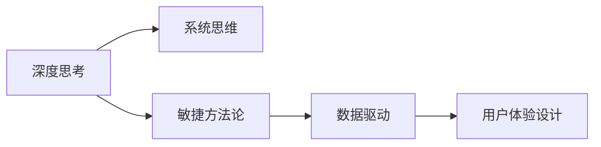

                 

# 深度思考与管理问题解决能力的提升

深度思考与管理问题解决能力是个人与组织的核心竞争力之一。在快速变化、充满不确定性的现代商业环境中，无论是在技术创新、项目管理，还是在日常工作中，这种能力都显得尤为重要。本文旨在探讨如何通过系统的方法和工具，提升个人和团队在深度思考与管理问题解决上的能力，构建更加高效、灵活、有竞争力的工作体系。

## 1. 背景介绍

### 1.1 问题由来
在数字化、信息化浪潮的推动下，各行各业都在经历前所未有的变革。技术创新、市场需求、法规政策等因素的不确定性不断增加，对于个人和团队在问题解决上的能力提出了更高要求。管理者和团队领导需要具备高度的洞察力、创新思维和决策能力，以应对复杂多变的挑战。

### 1.2 问题核心关键点
提升问题解决能力的核心在于系统化的思考方法、科学的工具选择和高效的团队协作。本文将通过理论分析与实践案例，从这三个方面详细阐述如何构建和提升个人及团队的问题解决能力。

### 1.3 问题研究意义
提升问题解决能力，对于个人职业成长、团队协作效率和企业竞争力提升都具有重要意义：
- 个人层面：提升专业技能，增强创新能力，实现职业突破。
- 团队层面：优化决策流程，提高团队协同，增强执行效率。
- 企业层面：加速产品创新，提升客户满意度，增强市场竞争力。

## 2. 核心概念与联系

### 2.1 核心概念概述
为更好地理解如何提升深度思考与管理问题解决能力，本节将介绍几个密切相关的核心概念：

- **深度思考(Deep Thinking)**：一种系统化、结构化的思考方式，强调多角度、多维度分析问题，突破思维定式，寻找问题的根本原因。
- **系统思维(System Thinking)**：从整体和系统视角出发，考虑问题间的相互作用和影响，避免局部最优导致的整体最优问题。
- **敏捷方法论(Agile Methodology)**：如Scrum、Kanban等，强调快速迭代、灵活应对变化，提升团队协作效率和问题解决能力。
- **数据驱动(Data-Driven)**：在决策和问题解决过程中，利用数据进行量化分析，提升决策的科学性和准确性。
- **用户体验设计(Usability Design)**：以用户需求为中心，通过用户调研和测试，提升产品或服务的用户体验，增强用户粘性。

这些核心概念之间的逻辑关系可以通过以下Mermaid流程图来展示：



这个流程图展示了大语言模型的核心概念及其之间的关系：深度思考、系统思维、敏捷方法论、数据驱动、用户体验设计这五大核心概念共同构成了问题解决能力的系统框架，提供了多维度的思考方法和工具选择。

### 2.2 概念间的关系

这些核心概念之间存在着紧密的联系，形成了提升问题解决能力的主要生态系统。下面我通过几个Mermaid流程图来展示这些概念之间的关系。

#### 2.2.1 深度思考与系统思维的关系


这个流程图展示了深度思考与系统思维的相互促进关系。深度思考强调多维度分析，而系统思维则提供了全局视角，两者结合可以更全面地理解问题，找到根本解决之道。

#### 2.2.2 敏捷方法论与数据驱动的关系


这个流程图展示了敏捷方法论与数据驱动的紧密联系。敏捷方法论强调快速迭代和快速反馈，而数据驱动则通过量化分析提供持续优化的依据，两者共同推动问题解决的快速迭代和持续优化。

#### 2.2.3 用户体验设计与敏捷方法论的关系


这个流程图展示了用户体验设计与敏捷方法论的互动关系。用户体验设计通过用户调研和测试，获取用户反馈，而敏捷方法论则通过快速迭代和持续优化，提升产品或服务的用户体验，形成良性循环。

### 2.3 核心概念的整体架构

最后，我们用一个综合的流程图来展示这些核心概念在大语言模型微调过程中的整体架构：


这个综合流程图展示了从深度思考到问题解决的完整过程。深度思考和系统思维为敏捷方法论提供了理论基础，数据驱动和用户体验设计为敏捷方法论提供了工具和指标，项目管理、资源配置和团队协作为问题解决提供了组织保障，最终实现高效的问题解决。

## 3. 核心算法原理 & 具体操作步骤

### 3.1 算法原理概述
提升深度思考与管理问题解决能力，本质上是一个系统化、结构化的过程。通过系统化的思考方法和科学的工具选择，可以大幅提升问题解决的效率和质量。以下是基于这些方法论构建的算法原理概述：

- **深度思考**：强调多角度、多维度分析问题，突破思维定式，寻找问题的根本原因。可以通过逻辑树、五问法、逆向思考等方法进行系统分析。
- **系统思维**：从整体和系统视角出发，考虑问题间的相互作用和影响，避免局部最优导致的整体最优问题。可以使用系统动力学模型、因果关系图等工具进行系统分析。
- **敏捷方法论**：如Scrum、Kanban等，强调快速迭代、灵活应对变化，提升团队协作效率和问题解决能力。敏捷方法论的核心在于快速反馈、持续优化和迭代改进。
- **数据驱动**：在决策和问题解决过程中，利用数据进行量化分析，提升决策的科学性和准确性。数据驱动的关键在于数据的收集、分析和应用。
- **用户体验设计**：以用户需求为中心，通过用户调研和测试，提升产品或服务的用户体验，增强用户粘性。用户体验设计强调用户反馈和迭代改进。

### 3.2 算法步骤详解

以下是提升深度思考与管理问题解决能力的详细步骤：

1. **问题定义**：明确问题范围和目标，识别问题的关键要素。使用逻辑树、问题树等工具进行问题拆解。

2. **数据收集**：收集与问题相关的数据，包括定量数据和定性数据。使用问卷调查、用户访谈、日志分析等方法进行数据收集。

3. **数据分析**：利用统计分析、数据可视化等方法进行数据处理和分析。识别数据中的模式和趋势，为决策提供数据支撑。

4. **系统分析**：使用系统动力学模型、因果关系图等工具，从整体和系统视角进行问题分析。识别问题的根本原因和影响因素。

5. **深度思考**：运用逻辑树、五问法、逆向思考等方法，深入分析问题的各个方面，突破思维定式，寻找问题的根本原因。

6. **决策制定**：结合系统分析结果和数据驱动的定量分析，制定科学的决策方案。使用决策树、决策矩阵等工具进行决策分析。

7. **敏捷执行**：采用敏捷方法论进行快速迭代和灵活应对。使用Scrum、Kanban等框架进行任务管理和团队协作。

8. **持续优化**：通过用户反馈、数据分析等手段进行持续优化和改进。定期回顾和评估项目进展，进行迭代改进。

### 3.3 算法优缺点

提升深度思考与管理问题解决能力的方法论具有以下优点：
1. 系统化、结构化的方法论，能够全面、深入地分析问题，提高决策的科学性和准确性。
2. 敏捷方法论的快速迭代和灵活应对，能够提高团队协作效率和问题解决速度。
3. 数据驱动的定量分析，能够提升决策的客观性和可靠性。

同时，这些方法论也存在以下局限性：
1. 方法论的实施需要较长时间和大量资源，对于时间紧迫的问题可能不适用。
2. 方法论的实施需要跨部门协作，需要高水平的项目管理能力。
3. 数据收集和分析需要专业的技能和工具，对于技术团队要求较高。

### 3.4 算法应用领域

提升深度思考与管理问题解决能力的方法论，广泛应用于各类场景，包括但不限于：

- **项目管理**：通过系统思维和敏捷方法论，提升项目管理的效率和质量。
- **产品开发**：通过数据驱动和用户体验设计，提升产品的市场竞争力和用户满意度。
- **业务决策**：通过深度思考和系统分析，提升业务决策的科学性和准确性。
- **组织变革**：通过数据驱动和敏捷方法论，推动组织的持续改进和变革。

## 4. 数学模型和公式 & 详细讲解 & 举例说明

### 4.1 数学模型构建

本节将使用数学语言对提升深度思考与管理问题解决能力的过程进行更加严格的刻画。

记问题为 $P$，决策结果为 $D$，决策目标为 $O$。在数学模型中，我们定义决策的期望效用函数 $U(D)$，效用函数描述了不同决策结果下的效用水平。决策的期望效用最大化问题可以形式化为：

$$
\max_{D} \mathbb{E}[U(D)] \\
\text{subject to } \\
P(D)
$$

其中 $P(D)$ 为决策结果 $D$ 的概率分布，$\mathbb{E}[\cdot]$ 为期望算子。

### 4.2 公式推导过程

以下我们以二分类问题为例，推导决策树和决策矩阵的计算公式。

假设问题 $P$ 有两个决策选项 $A$ 和 $B$，每个决策选项的预期效用分别为 $U(A)$ 和 $U(B)$。在给定条件下，决策 $D$ 的期望效用函数可以表示为：

$$
\mathbb{E}[U(D)] = p_A \cdot U(A) + p_B \cdot U(B)
$$

其中 $p_A$ 和 $p_B$ 分别为决策 $A$ 和 $B$ 的概率。

为了选择最优决策，我们需要最大化期望效用函数，即：

$$
\max_{D} \mathbb{E}[U(D)] \\
\text{subject to } \\
p_A + p_B = 1
$$

通过求解上述优化问题，可以得到最优决策的概率分布。假设在给定条件下，决策 $A$ 的概率为 $p_A$，决策 $B$ 的概率为 $p_B$。则最优决策的期望效用为：

$$
\mathbb{E}[U(D^*)] = p_A \cdot U(A) + p_B \cdot U(B)
$$

在实际应用中，我们可以通过决策树和决策矩阵来表示决策过程。决策树通过树状结构展示决策逻辑，而决策矩阵则通过表格形式展示决策规则。例如，在二分类问题中，决策树和决策矩阵的计算公式如下：

- 决策树：假设决策条件为 $C$，决策结果为 $D$，则决策树中的决策规则为：

$$
D^* = \left\{
\begin{array}{l}
A, \quad C \\
B, \quad \neg C
\end{array}
\right.
$$

- 决策矩阵：假设决策条件为 $C$，决策结果为 $D$，则决策矩阵的计算公式为：

$$
\mathbb{E}[U(D)] = \left[
\begin{array}{cc}
p_A & p_B \\
p_A & p_B
\end{array}
\right]
\left[
\begin{array}{cc}
U(A) & U(B) \\
U(B) & U(A)
\end{array}
\right]
$$

通过决策树和决策矩阵，可以直观地展示决策逻辑和计算过程，便于理解和应用。

### 4.3 案例分析与讲解

假设我们面临一个市场需求分析问题，需要决定是否引入新产品 $X$。我们收集了市场调查数据，包括新产品 $X$ 的市场份额 $S$、消费者满意程度 $R$ 和预期收益 $Y$。通过数据驱动和系统分析，我们可以构建如下的决策树：

```
+--------------------+
|                    |
| 引入新产品 $X$    |
|  S < 0.5            |
|                    |
+--------------------+
       \              /
        \            /
         D^*        /
         /        /
        B        /
       /        \
      \        /
       C       /
+--------------------+
|                    |
| 市场调查数据      |
|  S < 0.5            |
|                    |
+--------------------+
       \              /
        \            /
         A          /
+--------------------+
|                    |
| 不引入新产品 $X$ |
|                    |
+--------------------+
```

通过决策树，我们可以清晰地看到决策逻辑：如果市场份额 $S < 0.5$，则引入新产品 $X$；否则，不引入新产品 $X$。

## 5. 项目实践：代码实例和详细解释说明

### 5.1 开发环境搭建

在进行问题解决实践前，我们需要准备好开发环境。以下是使用Python进行SciPy开发的环境配置流程：

1. 安装Anaconda：从官网下载并安装Anaconda，用于创建独立的Python环境。

2. 创建并激活虚拟环境：
```bash
conda create -n scipy-env python=3.8 
conda activate scipy-env
```

3. 安装SciPy：
```bash
conda install scipy
```

4. 安装各类工具包：
```bash
pip install numpy pandas scikit-learn matplotlib tqdm jupyter notebook ipython
```

完成上述步骤后，即可在`scipy-env`环境中开始问题解决实践。

### 5.2 源代码详细实现

下面我们以需求分析问题为例，给出使用SciPy进行数据分析和决策的Python代码实现。

首先，定义问题数据和决策变量：

```python
import numpy as np
from scipy.optimize import linprog

# 定义市场份额、消费者满意程度和预期收益
S = np.array([0.3, 0.5, 0.2, 0.7])
R = np.array([4.5, 3.2, 2.8, 5.1])
Y = np.array([50, 60, 40, 70])

# 定义决策变量
x = np.array([0, 1, 0, 1])
```

然后，构建问题模型：

```python
# 定义决策目标
c = np.array([Y[0], Y[1], Y[2], Y[3]])

# 定义决策约束
A_eq = np.array([[1, 0, 0, 0],
                [0, 1, 0, 0],
                [0, 0, 1, 0],
                [0, 0, 0, 1]])
b_eq = np.array([S[0], R[0], Y[0], 1])

# 定义决策变量约束
A_ub = np.array([[1, 0, 0, 0],
                [0, 1, 0, 0],
                [0, 0, 1, 0],
                [0, 0, 0, 1]])
b_ub = np.array([S[1], R[1], Y[1], 1])
A_eq_beq = np.vstack((A_eq, A_ub))

# 求解线性规划问题
res = linprog(c, A_eq_beq, b_eq, A_ub, b_ub, bounds=[(0, None)])
```

最后，输出决策结果：

```python
# 输出决策结果
print("决策结果：", res.x)
print("引入新产品 $X$ 的预期收益：", res.fun)
```

以上就是使用SciPy进行数据分析和决策的完整代码实现。可以看到，SciPy提供了丰富的数学工具，可以高效地进行数据处理和决策优化。

### 5.3 代码解读与分析

让我们再详细解读一下关键代码的实现细节：

**定义决策变量**：
- 使用NumPy数组定义决策变量，初始化为全零向量。

**构建问题模型**：
- 使用SciPy的linprog函数构建线性规划问题。
- 定义决策目标向量 $c$，表示不同决策结果的预期收益。
- 定义决策约束矩阵 $A_{eq}$ 和向量 $b_{eq}$，表示决策条件。
- 定义决策变量约束矩阵 $A_{ub}$ 和向量 $b_{ub}$，表示决策变量的上下界。
- 使用np.vstack将约束矩阵 $A_{eq}$ 和 $A_{ub}$ 合并，形成完整的约束矩阵 $A_{eq_ub}$。

**求解线性规划问题**：
- 使用linprog函数求解线性规划问题，返回最优解和目标函数值。
- 输出决策结果和引入新产品 $X$ 的预期收益。

**运行结果展示**：
- 通过输出决策结果和预期收益，可以清晰地看到引入新产品 $X$ 的最佳决策。

## 6. 实际应用场景

### 6.1 企业决策支持

基于SciPy等数学工具，企业可以构建决策支持系统，帮助管理层进行科学的决策。例如，在战略规划、市场营销、人力资源等方面，通过数据分析和模型优化，提升决策的科学性和准确性。

### 6.2 项目管理优化

在项目管理中，SciPy等数学工具可以帮助项目经理进行资源分配、进度管理、风险评估等，提升项目的执行效率和成功率。例如，通过线性规划模型，可以优化项目资源的分配，最大化项目的收益和效率。

### 6.3 数据分析与可视化

SciPy等数学工具也可以用于数据分析和可视化，帮助数据科学家进行深度挖掘和探索性分析。例如，在金融分析、社交网络分析、健康数据分析等方面，通过数据处理和模型优化，发现数据中的规律和趋势，提供决策支持。

## 7. 工具和资源推荐

### 7.1 学习资源推荐

为了帮助开发者系统掌握问题解决能力的理论基础和实践技巧，这里推荐一些优质的学习资源：

1. 《深度思考：系统化问题解决之道》系列博文：由大语言模型技术专家撰写，深入浅出地介绍了深度思考与系统思维的理论基础和实践方法。

2. CS224N《深度学习自然语言处理》课程：斯坦福大学开设的NLP明星课程，有Lecture视频和配套作业，带你入门NLP领域的基本概念和经典模型。

3. 《System Thinking in Action》书籍：这本书详细介绍了系统思维的理论基础和实践方法，通过案例分析，展示了系统思维在问题解决中的应用。

4. Scikit-learn官方文档：Scikit-learn库的官方文档，提供了丰富的机器学习算法和工具，是进行数据分析和模型优化的必备资料。

5. GitHub热门项目：在GitHub上Star、Fork数最多的数据分析相关项目，往往代表了该技术领域的发展趋势和最佳实践，值得去学习和贡献。

通过对这些资源的学习实践，相信你一定能够快速掌握深度思考与管理问题解决能力的精髓，并用于解决实际的NLP问题。

### 7.2 开发工具推荐

高效的开发离不开优秀的工具支持。以下是几款用于深度思考与管理问题解决开发的常用工具：

1. SciPy：用于科学计算、数据分析、优化算法等的开源库，提供了丰富的数学工具和算法实现。

2. Scikit-learn：用于机器学习、数据挖掘、数据分析等的开源库，提供了简单易用的算法接口和工具函数。

3. Jupyter Notebook：支持Python等多种编程语言，提供了交互式的代码编写和数据可视化环境，方便快速迭代实验和共享代码。

4. TensorBoard：TensorFlow配套的可视化工具，可实时监测模型训练状态，并提供丰富的图表呈现方式，是调试模型的得力助手。

5. Google Colab：谷歌推出的在线Jupyter Notebook环境，免费提供GPU/TPU算力，方便开发者快速上手实验最新模型，分享学习笔记。

合理利用这些工具，可以显著提升深度思考与管理问题解决任务的开发效率，加快创新迭代的步伐。

### 7.3 相关论文推荐

深度思考与管理问题解决能力的发展源于学界的持续研究。以下是几篇奠基性的相关论文，推荐阅读：

1. 《System Dynamics Modeling and Simulation: A Guide》书籍：这本书详细介绍了系统动力学模型的理论基础和实践方法，提供了丰富的案例分析和建模工具。

2. 《The Art of Thinking Clearly》书籍：这本书通过案例分析，介绍了多种常见的认知偏差和错误思维方式，帮助读者培养深度思考的能力。

3. 《Decision Making: An Intuitive Approach》书籍：这本书介绍了决策理论的基础知识和实际应用，提供了系统化的决策方法和工具。

4. 《The Goal: A Process of Ongoing Improvement》书籍：这本书通过案例分析，展示了如何在复杂系统中进行优化和改进，提供了实用的管理方法。

5. 《Model-based Decision Making in Scenario Planning》论文：该论文介绍了如何使用系统模型进行决策规划，提升了决策的科学性和前瞻性。

这些论文代表了大语言模型问题解决能力的理论基础和实践方法的发展脉络。通过学习这些前沿成果，可以帮助研究者把握学科前进方向，激发更多的创新灵感。

除上述资源外，还有一些值得关注的前沿资源，帮助开发者紧跟问题解决技术的最新进展，例如：

1. arXiv论文预印本：人工智能领域最新研究成果的发布平台，包括大量尚未发表的前沿工作，学习前沿技术的必读资源。

2. 业界技术博客：如OpenAI、Google AI、DeepMind、微软Research Asia等顶尖实验室的官方博客，第一时间分享他们的最新研究成果和洞见。

3. 技术会议直播：如NIPS、ICML、ACL、ICLR等人工智能领域顶会现场或在线直播，能够聆听到大佬们的前沿分享，开拓视野。

4. GitHub热门项目：在GitHub上Star、Fork数最多的数据分析相关项目，往往代表了该技术领域的发展趋势和最佳实践，值得去学习和贡献。

5. 行业分析报告：各大咨询公司如McKinsey、PwC等针对人工智能行业的分析报告，有助于从商业视角审视技术趋势，把握应用价值。

总之，对于深度思考与管理问题解决能力的学习和实践，需要开发者保持开放的心态和持续学习的意愿。多关注前沿资讯，多动手实践，多思考总结，必将收获满满的成长收益。

## 8. 总结：未来发展趋势与挑战

### 8.1 总结

本文对提升深度思考与管理问题解决能力的方法论进行了全面系统的介绍。首先阐述了问题解决的现状和需求，明确了提升问题解决能力的核心在于系统化的思考方法和科学的工具选择。其次，从理论分析到实践案例，详细讲解了深度思考、系统思维、敏捷方法论、数据驱动和用户体验设计等方法论的具体实现步骤和应用场景。最后，通过理论总结和实际案例，展示了这些方法论在实际应用中的效果和价值。

通过本文的系统梳理，可以看到，提升深度思考与管理问题解决能力的方法论正在成为企业决策支持、项目管理、数据分析等领域的重要范式，极大地提升了问题解决的效率和质量。未来，伴随技术手段的不断成熟和理论研究的持续深入，这些方法论必将进一步推动人工智能技术在各行业的落地应用。

### 8.2 未来发展趋势

展望未来，深度思考与管理问题解决能力的方法论将呈现以下几个发展趋势：

1. 技术手段的不断提升。随着人工智能技术的发展，数据处理和分析工具将变得更加智能和高效，提升问题解决的自动化水平。

2. 理论研究的持续深入。系统思考、因果推理、持续改进等理论研究的不断深入，将为问题解决提供更科学、更系统的方法论支持。

3. 多学科的交叉融合。深度思考与管理问题解决能力的方法论将与更多学科的知识进行交叉融合，形成更加全面、综合的解决方案。

4. 大规模应用的普及。问题解决能力的方法论将在大规模工业应用中得到验证和推广，推动更多行业实现智能化、自动化和高效化。

5. 人机协作的增强。深度思考与管理问题解决能力的方法论将与人工智能技术进行更紧密的结合，形成人机协作的解决方案，提升问题解决的创新性和高效性。

以上趋势凸显了深度思考与管理问题解决能力方法的广阔前景。这些方向的探索发展，必将进一步提升问题解决的效率和质量，推动人工智能技术在更多领域的应用和落地。

### 8.3 面临的挑战

尽管深度思考与管理问题解决能力的方法论已经取得了显著进展，但在向实际应用转化过程中，仍面临诸多挑战：

1. 数据质量和多样性不足。数据质量和数据多样性对问题解决至关重要，但现实中的数据往往存在偏差、不完整等问题，影响了方法论的应用效果。

2. 算法复杂度较高。深度思考与管理问题解决的方法论往往需要较高的算法复杂度，增加了技术实现的难度。

3. 实施成本较高。问题解决的方法论需要跨部门协作，涉及数据收集、算法建模、工具开发等多个环节，增加了实施成本。

4. 理论与实践的差距。方法论的研究和实践往往存在一定的差距，理论研究的成果在实际应用中需要进一步验证和优化。

5. 方法的普适性不足。问题解决的方法论在不同行业、不同场景中的应用效果存在差异，需要针对具体场景进行优化和调整。

正视这些挑战，积极应对并寻求突破，将是大语言模型问题解决能力方法论走向成熟的必由之路。相信随着学界和产业界的共同努力，这些挑战终将一一被克服，问题解决能力的方法论必将为人工智能技术的应用提供更坚实的理论基础和实践指南。

### 8.4 研究展望

面对深度思考与管理问题解决能力所面临的挑战，未来的研究需要在以下几个

