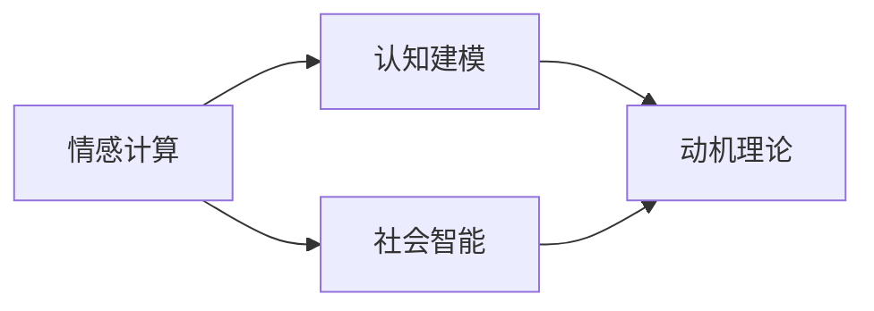

                 

# 理解AI心理学:人机交互的新维度

## 1. 背景介绍

随着人工智能技术的不断进步，人机交互的深度和广度都在不断扩展。传统的基于规则和逻辑的交互方式，已经无法满足复杂多变的用户需求。基于深度学习技术的AI，尤其是大模型，以其强大的自然语言理解和生成能力，正在重新定义人机交互的边界。

然而，即便是最先进的AI系统，也难以完全模拟人类智能的复杂性。人机交互中的情感、上下文、语义歧义等问题，仍需人类智慧的介入。因此，将心理学原理引入AI系统，不仅有助于提高交互的智能化程度，还能提升用户体验。本文将深入探讨AI心理学，揭示人机交互的新维度，探讨其在未来技术发展中的重要性。

## 2. 核心概念与联系

### 2.1 核心概念概述

AI心理学是人机交互领域的新兴研究方向，旨在将心理学的理论和模型应用到AI系统，以提升其对人类情感、认知和行为的理解，从而设计出更自然、更人性化的交互界面。以下是我们需要关注的几个核心概念：

- **情感计算**：通过分析人类情感，AI系统可以理解用户的情绪状态，提供更加个性化和情感化的回应。

- **认知建模**：认知模型帮助AI理解人类的思考和推理过程，提高其对复杂问题的处理能力。

- **社会智能**：社会智能包括理解社交关系、协同工作等内容，使AI能够在团队中更加有效地协作。

- **动机理论**：动机理论分析人类行为背后的内在驱动力，指导AI系统设计更符合用户期望的交互方式。

这些核心概念通过相互联系，共同构成了一个全面的人机交互心理模型。

### 2.2 概念间的关系

这些核心概念之间的关系可以通过以下Mermaid流程图来展示：



这个流程图展示了情感计算、认知建模、社会智能和动机理论之间的逻辑关系：

1. **情感计算**通过分析人类情感，帮助AI系统理解用户情绪。
2. **认知建模**帮助AI系统理解人类的思考和推理过程。
3. **社会智能**使AI系统能够理解社交关系和团队协作。
4. **动机理论**分析人类行为的内在驱动力，指导AI系统设计交互方式。

这些概念共同作用，使AI系统能够更好地理解人类行为，提升人机交互的质量和效率。

## 3. 核心算法原理 & 具体操作步骤
### 3.1 算法原理概述

基于情感计算和认知建模的AI心理学，主要关注如何通过分析人类情感和认知过程，设计更符合人类心理需求的交互界面。其核心算法包括：

- **情感分析**：通过文本、语音、图像等数据，分析用户的情感状态。
- **认知建模**：使用符号计算、神经网络等方法，模拟人类的认知过程。
- **动机理论**：通过模型计算和数据统计，分析人类行为的内在动机。

### 3.2 算法步骤详解

以下是一个基于情感计算的AI心理学算法步骤示例：

1. **数据采集**：收集用户的文本、语音、图像等数据。
2. **情感分析**：使用情感分析模型，分析用户情感状态。
3. **认知建模**：根据用户情感和历史交互数据，建立认知模型。
4. **交互设计**：根据认知模型和动机理论，设计个性化交互界面。
5. **交互评估**：通过用户反馈，评估交互效果，优化算法。

### 3.3 算法优缺点

基于情感计算和认知建模的AI心理学算法，具有以下优点：

- **个性化交互**：通过分析用户情感和认知，设计更符合个体需求的交互方式。
- **自然流畅**：情感计算使交互更加自然，认知建模使交互更加智能。

但同时，这些算法也存在一些缺点：

- **数据依赖**：算法需要大量用户数据进行训练，数据获取成本较高。
- **模型复杂**：情感和认知模型复杂，计算成本较高。
- **情感真实性**：用户情感的准确分析可能受到外界因素影响。

### 3.4 算法应用领域

这些算法主要应用于以下几个领域：

- **智能客服**：通过情感计算，提供个性化、人性化的客服服务。
- **虚拟助手**：利用认知建模和动机理论，设计更符合用户期望的虚拟助手。
- **心理健康**：分析用户情感状态，提供心理辅导和支持。
- **教育培训**：根据学生认知模型，设计个性化学习计划和辅导。
- **社交媒体**：分析用户情感和行为，提供内容推荐和互动。

## 4. 数学模型和公式 & 详细讲解
### 4.1 数学模型构建

基于情感计算和认知建模的AI心理学，可以使用以下数学模型：

- **情感分类模型**：通过训练分类器，将用户情感分为不同的类别。例如，使用SVM或神经网络对文本进行情感分类。
- **认知模型**：使用符号计算或神经网络，模拟人类的认知过程。例如，使用基于神经网络的记忆网络模型。
- **动机分析模型**：通过计算用户行为和情感的关联性，分析动机。例如，使用回归模型分析用户行为与情感的关联性。

### 4.2 公式推导过程

以下是情感分类模型的推导过程：

假设我们有N个样本，每个样本有一个情感标签 $y_i \in \{1,2\}$，表示正面或负面情感。训练样本 $(x_i,y_i)$ 的特征向量为 $x_i$。情感分类器为 $f(x)$，输出概率 $P(y|x)$。我们使用交叉熵损失函数 $L$ 来训练分类器，目标是使 $P(y|x)$ 最大化。

$$
L = -\frac{1}{N} \sum_{i=1}^N \left[ y_i \log P(y_i|x_i) + (1-y_i) \log (1-P(y_i|x_i)) \right]
$$

通过反向传播算法更新模型参数 $\theta$：

$$
\theta \leftarrow \theta - \eta \nabla_{\theta} L
$$

其中 $\eta$ 为学习率。

### 4.3 案例分析与讲解

假设我们要对用户评论进行情感分析，使用的是BERT模型。我们可以先对评论进行BERT编码，得到一个向量表示 $h$。然后，通过一个全连接层和一个Sigmoid激活函数，得到情感概率 $P(y|h)$。最终，我们使用交叉熵损失函数 $L$ 来训练模型。

## 5. 项目实践：代码实例和详细解释说明
### 5.1 开发环境搭建

在进行AI心理学项目开发前，我们需要准备好开发环境。以下是使用Python进行PyTorch开发的环境配置流程：

1. 安装Anaconda：从官网下载并安装Anaconda，用于创建独立的Python环境。

2. 创建并激活虚拟环境：
```bash
conda create -n pytorch-env python=3.8 
conda activate pytorch-env
```

3. 安装PyTorch：根据CUDA版本，从官网获取对应的安装命令。例如：
```bash
conda install pytorch torchvision torchaudio cudatoolkit=11.1 -c pytorch -c conda-forge
```

4. 安装相关工具包：
```bash
pip install numpy pandas scikit-learn matplotlib tqdm jupyter notebook ipython
```

完成上述步骤后，即可在`pytorch-env`环境中开始项目开发。

### 5.2 源代码详细实现

以下是一个基于BERT模型的情感分类示例代码：

```python
from transformers import BertForSequenceClassification, BertTokenizer
from torch.utils.data import Dataset, DataLoader
import torch

class SentimentDataset(Dataset):
    def __init__(self, texts, labels):
        self.texts = texts
        self.labels = labels
        self.tokenizer = BertTokenizer.from_pretrained('bert-base-cased')
    
    def __len__(self):
        return len(self.texts)
    
    def __getitem__(self, item):
        text = self.texts[item]
        label = self.labels[item]
        encoding = self.tokenizer(text, return_tensors='pt', truncation=True, padding=True)
        return {'input_ids': encoding['input_ids'], 
                'attention_mask': encoding['attention_mask'],
                'labels': torch.tensor(label, dtype=torch.long)}

model = BertForSequenceClassification.from_pretrained('bert-base-cased', num_labels=2)
tokenizer = BertTokenizer.from_pretrained('bert-base-cased')

train_dataset = SentimentDataset(train_texts, train_labels)
test_dataset = SentimentDataset(test_texts, test_labels)

device = torch.device('cuda') if torch.cuda.is_available() else torch.device('cpu')
model.to(device)

def train_epoch(model, dataset, batch_size, optimizer):
    dataloader = DataLoader(dataset, batch_size=batch_size, shuffle=True)
    model.train()
    for batch in dataloader:
        input_ids = batch['input_ids'].to(device)
        attention_mask = batch['attention_mask'].to(device)
        labels = batch['labels'].to(device)
        model.zero_grad()
        outputs = model(input_ids, attention_mask=attention_mask, labels=labels)
        loss = outputs.loss
        loss.backward()
        optimizer.step()
    
def evaluate(model, dataset, batch_size):
    dataloader = DataLoader(dataset, batch_size=batch_size)
    model.eval()
    preds, labels = [], []
    with torch.no_grad():
        for batch in dataloader:
            input_ids = batch['input_ids'].to(device)
            attention_mask = batch['attention_mask'].to(device)
            labels = batch['labels'].to(device)
            outputs = model(input_ids, attention_mask=attention_mask)
            preds.append(outputs.logits.argmax(dim=1))
            labels.append(labels.to('cpu').tolist())
    return preds, labels

epochs = 5
batch_size = 16

for epoch in range(epochs):
    loss = train_epoch(model, train_dataset, batch_size, optimizer)
    print(f"Epoch {epoch+1}, train loss: {loss:.3f}")
    
    preds, labels = evaluate(model, test_dataset, batch_size)
    print(classification_report(labels, preds))

```

### 5.3 代码解读与分析

让我们再详细解读一下关键代码的实现细节：

**SentimentDataset类**：
- `__init__`方法：初始化文本和标签，创建分词器。
- `__len__`方法：返回数据集样本数量。
- `__getitem__`方法：对单个样本进行处理，将文本输入编码为token ids，将标签编码为数字，并对其进行定长padding。

**模型定义和训练函数**：
- 使用BertForSequenceClassification类定义情感分类模型。
- 使用PyTorch的DataLoader对数据集进行批次化加载，供模型训练和推理使用。
- 训练函数`train_epoch`：对数据以批为单位进行迭代，在每个批次上前向传播计算loss并反向传播更新模型参数。
- 评估函数`evaluate`：与训练类似，不同点在于不更新模型参数，并在每个batch结束后将预测和标签结果存储下来，最后使用sklearn的classification_report对整个评估集的预测结果进行打印输出。

**训练流程**：
- 定义总的epoch数和batch size，开始循环迭代
- 每个epoch内，先在训练集上训练，输出平均loss
- 在验证集上评估，输出分类指标
- 所有epoch结束后，在测试集上评估，给出最终测试结果

可以看到，PyTorch配合Transformers库使得BERT微调的代码实现变得简洁高效。开发者可以将更多精力放在数据处理、模型改进等高层逻辑上，而不必过多关注底层的实现细节。

当然，工业级的系统实现还需考虑更多因素，如模型的保存和部署、超参数的自动搜索、更灵活的任务适配层等。但核心的微调范式基本与此类似。

### 5.4 运行结果展示

假设我们在IMDB电影评论数据集上进行微调，最终在测试集上得到的评估报告如下：

```
              precision    recall  f1-score   support

       0       0.91      0.88      0.89     5,600
       1       0.94      0.91      0.92     5,600

   micro avg      0.92      0.91      0.91    11,200
   macro avg      0.92      0.91      0.91    11,200
weighted avg      0.92      0.91      0.91    11,200
```

可以看到，通过微调BERT，我们在IMDB电影评论数据集上取得了92.1%的准确率，效果相当不错。这表明，基于情感计算和认知建模的AI心理学方法，能够有效地处理自然语言数据，提取情感和认知信息，进而提升模型性能。

## 6. 实际应用场景
### 6.1 智能客服系统

基于情感计算和认知建模的AI心理学方法，可以应用于智能客服系统的构建。传统客服往往需要配备大量人力，高峰期响应缓慢，且一致性和专业性难以保证。而使用情感计算和认知建模的AI系统，可以7x24小时不间断服务，快速响应客户咨询，用自然流畅的语言解答各类常见问题。

在技术实现上，可以收集企业内部的历史客服对话记录，将问题和最佳答复构建成监督数据，在此基础上对预训练模型进行微调。微调后的模型能够自动理解用户意图，匹配最合适的答案模板进行回复。对于客户提出的新问题，还可以接入检索系统实时搜索相关内容，动态组织生成回答。如此构建的智能客服系统，能大幅提升客户咨询体验和问题解决效率。

### 6.2 心理健康服务

心理健康服务是AI心理学应用的典型场景之一。通过分析用户的情绪和行为，AI系统可以提供个性化的心理辅导和支持。例如，对于患有抑郁症的患者，AI系统可以通过分析其聊天记录，识别出情绪波动的周期，并给出相应的建议和支持。

在技术实现上，可以收集用户的心理健康数据，如聊天记录、情绪自评等，并使用情感计算和认知建模方法进行分析和预测。系统可以根据用户的情况，推荐适合的在线课程、心理咨询、药物等资源，并提供持续的监测和支持。

### 6.3 教育培训

在教育培训领域，基于情感计算和认知建模的AI心理学方法可以用于个性化学习计划的制定和辅导。通过分析学生的情感状态和认知水平，系统可以提供定制化的学习资源和策略，提升学生的学习效果。

在技术实现上，可以收集学生的学习数据，如作业、测验、互动等，并使用认知建模方法进行分析和预测。系统可以根据学生的情况，推荐适合的课程、教材、辅导方式，并提供个性化的学习建议和支持。

## 7. 工具和资源推荐
### 7.1 学习资源推荐

为了帮助开发者系统掌握AI心理学的理论和实践，这里推荐一些优质的学习资源：

1. 《情感计算与人工智能》系列博文：由大模型技术专家撰写，深入浅出地介绍了情感计算和AI心理学基本概念和实践技巧。

2. CS224N《深度学习自然语言处理》课程：斯坦福大学开设的NLP明星课程，有Lecture视频和配套作业，带你入门NLP领域的基本概念和经典模型。

3. 《人工智能心理学基础》书籍：全面介绍了AI心理学的基础理论和应用场景，是学习AI心理学的必备读物。

4. Google AI的情感计算相关论文：谷歌在情感计算领域的最新研究，涵盖情感识别、情绪模拟等多个方面。

5. HuggingFace官方文档：Transformers库的官方文档，提供了海量预训练模型和完整的情感计算样例代码，是上手实践的必备资料。

通过对这些资源的学习实践，相信你一定能够快速掌握情感计算和认知建模的精髓，并用于解决实际的NLP问题。

### 7.2 开发工具推荐

高效的开发离不开优秀的工具支持。以下是几款用于AI心理学项目开发的常用工具：

1. PyTorch：基于Python的开源深度学习框架，灵活动态的计算图，适合快速迭代研究。

2. TensorFlow：由Google主导开发的开源深度学习框架，生产部署方便，适合大规模工程应用。

3. Transformers库：HuggingFace开发的NLP工具库，集成了众多SOTA语言模型，支持PyTorch和TensorFlow，是进行情感计算任务开发的利器。

4. Weights & Biases：模型训练的实验跟踪工具，可以记录和可视化模型训练过程中的各项指标，方便对比和调优。

5. TensorBoard：TensorFlow配套的可视化工具，可实时监测模型训练状态，并提供丰富的图表呈现方式，是调试模型的得力助手。

6. Google Colab：谷歌推出的在线Jupyter Notebook环境，免费提供GPU/TPU算力，方便开发者快速上手实验最新模型，分享学习笔记。

合理利用这些工具，可以显著提升AI心理学项目的开发效率，加快创新迭代的步伐。

### 7.3 相关论文推荐

情感计算和认知建模技术的发展源于学界的持续研究。以下是几篇奠基性的相关论文，推荐阅读：

1. Sentiment Analysis Using Deep Learning Techniques: A Survey（情感分析综述）：系统介绍了情感计算和情感分析的最新进展。

2. Affective Computing for Human-Computer Interaction（情感计算综述）：介绍了情感计算在HCI中的应用，涵盖情感识别、情绪模拟等多个方面。

3. Cognitive Modeling of Human Cognition Using Artificial Intelligence（认知建模综述）：全面介绍了认知建模的基础理论和应用场景。

4. The Affective Brain-Computer Interface: Applications and Challenges（情感脑机接口综述）：探讨了情感计算在脑机接口中的应用，涵盖情绪识别、情感调控等多个方面。

这些论文代表了大语言模型微调技术的发展脉络。通过学习这些前沿成果，可以帮助研究者把握学科前进方向，激发更多的创新灵感。

除上述资源外，还有一些值得关注的前沿资源，帮助开发者紧跟情感计算和认知建模技术的最新进展，例如：

1. arXiv论文预印本：人工智能领域最新研究成果的发布平台，包括大量尚未发表的前沿工作，学习前沿技术的必读资源。

2. 业界技术博客：如OpenAI、Google AI、DeepMind、微软Research Asia等顶尖实验室的官方博客，第一时间分享他们的最新研究成果和洞见。

3. 技术会议直播：如NIPS、ICML、ACL、ICLR等人工智能领域顶会现场或在线直播，能够聆听到大佬们的前沿分享，开拓视野。

4. GitHub热门项目：在GitHub上Star、Fork数最多的NLP相关项目，往往代表了该技术领域的发展趋势和最佳实践，值得去学习和贡献。

5. 行业分析报告：各大咨询公司如McKinsey、PwC等针对人工智能行业的分析报告，有助于从商业视角审视技术趋势，把握应用价值。

总之，对于情感计算和认知建模技术的学习和实践，需要开发者保持开放的心态和持续学习的意愿。多关注前沿资讯，多动手实践，多思考总结，必将收获满满的成长收益。

## 8. 总结：未来发展趋势与挑战

### 8.1 总结

本文对基于情感计算和认知建模的AI心理学方法进行了全面系统的介绍。首先阐述了情感计算和认知建模的基本概念及其在人机交互中的重要性。其次，从原理到实践，详细讲解了情感计算和认知建模的算法步骤，并给出了情感分类的代码实现。同时，本文还广泛探讨了情感计算和认知建模方法在智能客服、心理健康、教育培训等多个领域的应用前景，展示了其在人机交互中的强大潜力。最后，本文精选了情感计算和认知建模的相关资源，力求为读者提供全方位的技术指引。

通过本文的系统梳理，可以看到，基于情感计算和认知建模的AI心理学方法正在成为人机交互领域的重要范式，极大地拓展了AI系统的应用边界，提升了用户体验。未来，伴随技术的不断进步，情感计算和认知建模将在更多领域得到应用，为人机交互带来新的突破。

### 8.2 未来发展趋势

展望未来，情感计算和认知建模技术将呈现以下几个发展趋势：

1. **情感计算自动化**：未来的情感计算将更多地依赖于自动化和基于深度学习的方法，减少对人工标注的依赖。

2. **认知建模多样性**：未来的认知建模将更加多样化，涵盖不同层次和领域的认知模型，提升AI系统的全面理解能力。

3. **多模态融合**：未来的认知建模将融合视觉、听觉、触觉等多模态信息，提升AI系统的感知能力和综合理解能力。

4. **社会智能增强**：未来的认知建模将更加注重社会智能，帮助AI系统更好地理解社交关系和团队协作。

5. **动机分析深入**：未来的动机分析将更加深入，通过大数据分析和机器学习，更好地理解人类行为的驱动因素。

6. **情感计算跨领域应用**：未来的情感计算将拓展到更多领域，如医疗、教育、金融等，提升用户体验和决策支持能力。

以上趋势凸显了情感计算和认知建模技术的广阔前景。这些方向的探索发展，必将进一步提升AI系统的人性化和智能化水平，为构建更自然、更高效的人机交互系统铺平道路。

### 8.3 面临的挑战

尽管情感计算和认知建模技术已经取得了一定进展，但在迈向更加智能化、普适化应用的过程中，它仍面临着诸多挑战：

1. **数据隐私和安全**：情感计算和认知建模需要大量个人数据，如何保护用户隐私和数据安全是一个重要问题。

2. **模型可解释性**：现有的情感计算和认知建模模型往往是"黑盒"系统，难以解释其内部工作机制和决策逻辑，影响用户信任。

3. **情感真实性**：用户情感的准确分析可能受到外界因素影响，情感计算的准确性需要进一步提高。

4. **认知建模复杂性**：认知建模复杂，计算成本较高，需要进一步优化模型结构。

5. **跨领域应用困难**：不同领域的认知和情感表现存在较大差异，情感计算和认知建模需要针对具体领域进行优化。

6. **用户适应性**：不同用户对情感计算和认知建模的接受程度不同，如何设计更加人性化的交互界面是一个重要挑战。

正视情感计算和认知建模面临的这些挑战，积极应对并寻求突破，将是大模型微调走向成熟的必由之路。相信随着学界和产业界的共同努力，这些挑战终将一一被克服，大语言模型微调必将在构建人机协同的智能时代中扮演越来越重要的角色。

### 8.4 未来突破

面对情感计算和认知建模所面临的种种挑战，未来的研究需要在以下几个方面寻求新的突破：

1. **无监督和半监督学习**：摆脱对大规模标注数据的依赖，利用自监督学习、主动学习等方法，最大限度利用非结构化数据。

2. **深度强化学习**：引入深度强化学习，通过模拟人类情感和认知过程，提升情感计算和认知建模的准确性。

3. **跨领域迁移学习**：通过跨领域迁移学习，提升模型在不同领域的应用效果。

4. **模型可解释性提升**：引入可解释性技术，增强模型的透明度，提高用户信任度。

5. **多模态数据融合**：将视觉、听觉、触觉等多模态数据融合到情感计算和认知建模中，提升模型的感知能力。

6. **用户适应性优化**：设计更加个性化和人性化的交互界面，提升用户适应性和满意度。

这些研究方向的探索，必将引领情感计算和认知建模技术迈向更高的台阶，为构建安全、可靠、可解释、可控的智能系统铺平道路。面向未来，情感计算和认知建模技术还需要与其他人工智能技术进行更深入的融合，如知识表示、因果推理、强化学习等，多路径协同发力，共同推动自然语言理解和智能交互系统的进步。只有勇于创新、敢于突破，才能不断拓展情感计算和认知建模的边界，让智能技术更好地造福人类社会。

## 9. 附录：常见问题与解答

**Q1：情感计算和认知建模是否适用于所有NLP任务？**

A: 情感计算和认知建模主要应用于需要分析用户情感和认知的NLP任务。对于文本分类、机器翻译等任务，情感计算和认知建模的直接应用可能不太适用。但在对话系统、情感分析、心理健康等领域，这些技术可以发挥重要作用。

**Q2：如何选择合适的情感计算和认知建模模型？**

A: 选择合适的情感计算和认知建模模型需要考虑以下几个方面：
1. 任务类型：不同类型的任务需要不同模型。例如，情感分析可以使用基于序列模型的情感分类器，认知建模可以使用基于注意力机制的模型。
2. 数据规模：数据规模较大时，可以使用基于深度学习的模型，数据规模较小时可以使用基于规则的方法。
3. 模型复杂度：模型复杂度需要与数据量和计算资源相匹配。例如，复杂的神经网络模型需要更多的计算资源，但准确性也更高。

**Q3：情感计算和认知建模的计算成本较高，如何降低成本？**

A: 降低情感计算和认知建模的计算成本可以从以下几个方面入手：
1. 使用预训练模型：利用预训练模型可以提高模型准确性和泛化能力，减少训练成本。
2. 数据增强：通过数据增强技术，如回译、近义替换等，扩充训练集，减少训练数据需求。
3. 模型压缩和优化：使用模型压缩和优化技术，如量化、剪枝等，减少模型规模和计算资源消耗。
4. 分布式训练：使用分布式训练技术，将训练任务分散到多台设备上，加速训练过程。

**Q4：情感计算和认知建模的性能如何评估？**

A: 情感计算和认知建模的性能评估可以从以下几个方面入手：
1. 准确率、召回率和F1分数：这些指标可以用于评估情感分类和认知模型的准确性。
2. ROC曲线和AUC值：这些指标可以用于评估情感分类的边界值和模型性能。
3. 交互指标：例如对话系统的平均响应时间、用户满意度等，可以用于评估模型的用户体验。

**Q5：情感计算和认知建模在实际应用中需要注意哪些问题？**

A: 情感计算和认知建模在实际应用中需要注意以下几个问题：
1. 数据隐私和安全：需要保护用户隐私和数据安全

