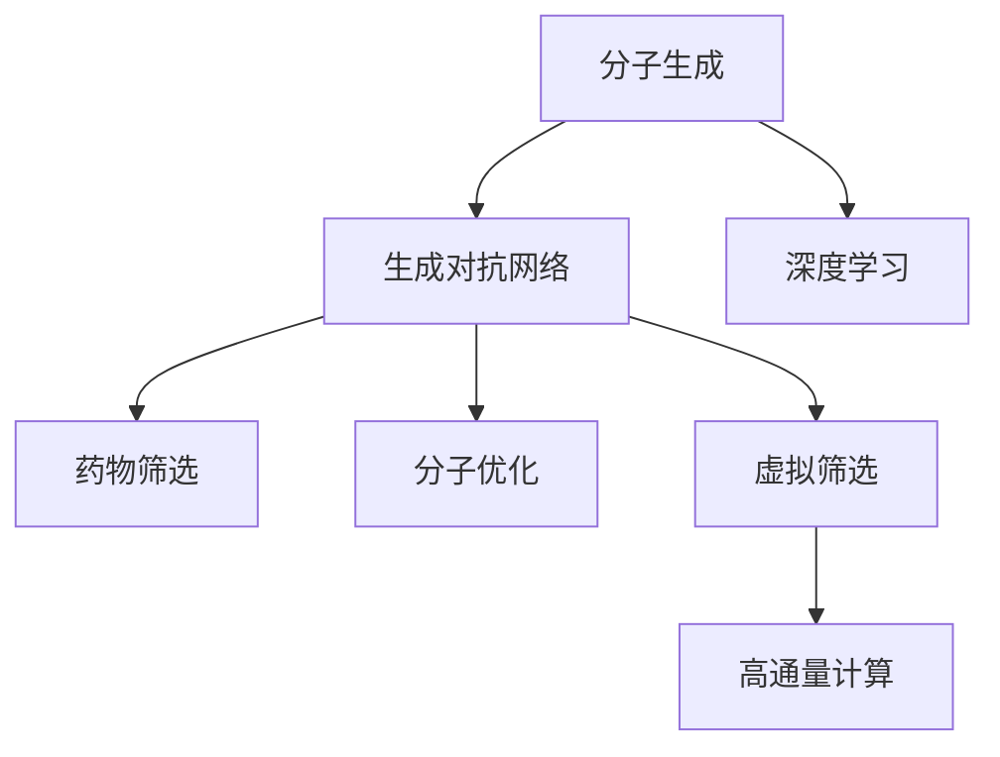

                 

## 1. 背景介绍

### 1.1 问题由来
近年来，随着人工智能在科学研究领域的广泛应用，生成对抗网络（Generative Adversarial Networks, GANs）在药物发现和设计中展现出巨大的潜力。传统药物设计方法依赖于高成本的实验和复杂的化学计算，而通过GANs可以从高维化学空间中生成出具有潜在活性的化合物，大幅加速药物研发进程。

新药设计过程通常包括两个关键步骤：分子生成和药物筛选。传统的分子生成方法依赖于经验丰富的化学家，周期长且效率低。而GANs可以通过学习分子数据集的统计规律，生成新的分子结构，从而极大地提升新药设计的效率和精度。

### 1.2 问题核心关键点
生成对抗网络（GANs）由两个神经网络组成：生成器（Generator）和判别器（Discriminator）。生成器负责生成具有真实分布的假样本，而判别器负责判断样本的真假。训练过程中，生成器和判别器通过对抗的方式不断提升生成器生成样本的质量，同时提升判别器对真假的区分能力。

GANs在新药设计中的应用主要体现在以下几个方面：
- 分子结构生成：生成具有特定生物活性的分子结构，为药物设计提供丰富的备选样本。
- 药物筛选：对生成的新分子进行筛选，排除无效化合物，保留具有潜力者。
- 分子优化：对已有的分子结构进行优化，提高生物活性或降低毒性。
- 虚拟筛选：通过大规模高通量筛选，大幅减少实验量，降低成本。

### 1.3 问题研究意义
GANs在新药设计中的应用，具有以下几个重要意义：
1. 加速新药研发。通过生成大量高质量的候选分子，极大地缩短了药物筛选和优化的周期。
2. 降低研发成本。大规模筛选实验的减少，有效降低了新药研发的成本和风险。
3. 提升药物质量。生成对抗网络能够生成多种结构，涵盖更广泛的化学空间，提供更多可能的新药候选分子。
4. 支持复杂生物靶标研究。针对特定的生物靶标，GANs能够生成具有特定亲和力和选择性的化合物。
5. 促进跨领域研究。GANs可应用于不同领域，如天然产物、生物大分子等，拓展了新药设计的适用范围。

## 2. 核心概念与联系

### 2.1 核心概念概述

为更好地理解GANs在新药设计中的应用，本节将介绍几个密切相关的核心概念：

- 生成对抗网络（GANs）：由生成器和判别器两个神经网络组成，通过对抗训练生成逼真数据，用于生成分子结构、图像、音频等多种形式的输出。

- 分子生成（Molecular Generation）：指使用GANs生成具有特定生物活性的分子结构。通过训练GANs生成分子，能够有效减少实验成本，提升新药研发效率。

- 药物筛选（Drug Screening）：通过判别器对生成的新分子进行筛选，排除无效化合物，保留具有生物活性的分子。

- 分子优化（Molecular Optimization）：对已有的分子结构进行微调，提高其生物活性和选择性。

- 虚拟筛选（Virtual Screening）：通过生成大量候选分子，利用高通量计算和筛选技术，大幅减少实验量，加速药物筛选过程。

- 深度学习（Deep Learning）：生成对抗网络作为深度学习的一种形式，能够从数据中学习高维空间中的复杂关系，适用于处理大规模数据和新药设计中的非线性问题。

这些核心概念之间紧密联系，共同构成了生成对抗网络在新药设计中的应用框架。通过理解这些核心概念，我们可以更好地把握GANs在新药设计中的工作原理和优化方向。

### 2.2 概念间的关系

这些核心概念之间存在着紧密的联系，形成了GANs在新药设计中的应用生态系统。下面我们通过几个Mermaid流程图来展示这些概念之间的关系：



这个流程图展示了大语言模型的核心概念及其之间的关系：

1. 分子生成由生成对抗网络生成。
2. 生成对抗网络属于深度学习的一种。
3. 生成对抗网络生成的分子，通过药物筛选、分子优化等步骤进一步筛选和优化。
4. 虚拟筛选利用生成对抗网络的高效生成能力，大幅减少实验量。

通过这些流程图，我们可以更清晰地理解GANs在新药设计中的应用过程和关键步骤。

## 3. 核心算法原理 & 具体操作步骤
### 3.1 算法原理概述

生成对抗网络在新药设计中的应用，核心在于通过生成器和判别器两个网络进行对抗训练，生成逼真的分子结构。生成器负责生成具有真实分布的假分子，而判别器负责判断分子真伪，生成器和判别器不断对抗，生成器逐渐提升生成质量，判别器逐渐提升判别能力。

在药物设计中，分子结构生成可以看作是一个多标签分类问题，分子可以同时具有生物活性和非生物活性两种标签。生成器生成分子时，需要同时预测分子具有生物活性和非生物活性的概率，而判别器则尝试区分生成器的输出是真分子还是假分子。

### 3.2 算法步骤详解

以下是生成对抗网络在新药设计中的应用步骤：

**Step 1: 准备分子数据集**
- 收集大量的分子数据，包括已知的活性分子和非活性分子。
- 将分子数据进行预处理，标准化分子结构和属性。

**Step 2: 定义生成器和判别器**
- 使用神经网络设计生成器和判别器，通常使用卷积神经网络（CNN）或循环神经网络（RNN）。
- 生成器网络的结构可以包括多个卷积层和反卷积层，用于从噪声向量生成分子结构。
- 判别器网络的结构通常包括多个卷积层，用于判断分子真假。

**Step 3: 初始化模型参数**
- 随机初始化生成器和判别器的权重参数。
- 设置超参数，如学习率、批大小、迭代轮数等。

**Step 4: 对抗训练**
- 生成器和判别器交替训练。先固定判别器参数，通过反向传播更新生成器参数。
- 固定生成器参数，通过反向传播更新判别器参数。
- 重复上述过程，直至模型收敛。

**Step 5: 分子筛选与优化**
- 使用筛选器对生成的新分子进行筛选，排除无效化合物。
- 对保留的分子进行优化，进一步提升生物活性和选择性。

**Step 6: 虚拟筛选与实验验证**
- 使用高通量计算技术对大规模分子进行虚拟筛选，筛选出生物活性较高的化合物。
- 对筛选出的化合物进行实验验证，进一步优化分子结构。

### 3.3 算法优缺点

生成对抗网络在新药设计中的应用具有以下优点：
1. 高效生成分子：通过生成大量高质量的分子结构，极大地减少了实验成本和周期。
2. 广泛覆盖化学空间：生成对抗网络能够生成多种分子结构，涵盖更广泛的化学空间。
3. 降低研发风险：通过虚拟筛选技术，大幅减少实验验证环节，降低研发风险和成本。
4. 支持复杂生物靶标：能够生成具有特定亲和力和选择性的化合物，适用于复杂的生物靶标研究。

同时，该方法也存在一些局限性：
1. 数据需求高：生成对抗网络需要大量高质量的分子数据进行训练，数据获取成本较高。
2. 模型训练难度大：生成对抗网络训练过程中容易出现模式崩溃等问题，训练难度较大。
3. 结果解释性不足：生成对抗网络生成的分子结构，难以解释其生成逻辑，缺乏可解释性。
4. 训练资源要求高：生成对抗网络需要高性能的GPU/TPU等硬件支持，训练资源要求较高。

尽管存在这些局限性，但就目前而言，生成对抗网络仍是新药设计中最具前景的方法之一。未来相关研究的重点在于如何进一步降低数据需求，提高模型训练稳定性，增强结果的可解释性，同时优化计算资源的使用。

### 3.4 算法应用领域

生成对抗网络在新药设计中的应用已经涵盖了多个领域，例如：

- 药物分子设计：生成具有特定生物活性的分子结构，为药物设计提供丰富的备选样本。
- 天然产物新药研发：从天然产物中提取生物活性分子，加速新药发现。
- 生物大分子设计：生成具有特定功能的生物大分子，用于生物治疗和诊断。
- 多靶标药物设计：生成具有多种生物活性的分子，用于同时治疗多种疾病。
- 组合药物设计：生成具有协同作用的化合物组合，提高药物疗效。

除了上述这些经典应用外，生成对抗网络在新药设计中的创新应用还在不断涌现，如基于GAN的药物构效关系（QSAR）预测、药物代谢动力学模拟等，为药物研发带来了新的突破。

## 4. 数学模型和公式 & 详细讲解  
### 4.1 数学模型构建

在本节中，我们将使用数学语言对生成对抗网络在新药设计中的应用进行更加严格的刻画。

记生成器和判别器为 $G$ 和 $D$，其中 $G$ 表示生成器网络，$D$ 表示判别器网络。设 $x$ 为输入的噪声向量，$G(x)$ 表示生成器生成的分子结构，$D(G(x))$ 表示判别器对生成器输出的判断概率。

生成对抗网络的训练目标为最大化生成器生成的分子结构逼真度，同时最大化判别器区分真分子和假分子的能力。因此，生成器和判别器的损失函数分别为：

$$
\mathcal{L}_G = \mathbb{E}_{x \sim p(x)}[\log D(G(x))] + \lambda \mathbb{E}_{x \sim p(x)}[\|\text{Var}(G(x))\|]
$$

$$
\mathcal{L}_D = \mathbb{E}_{x \sim p(x)}[\log D(x)] + \mathbb{E}_{x \sim p(x)}[\log(1-D(G(x)))]
$$

其中 $\lambda$ 为正则化参数，$\|\text{Var}(G(x))\|$ 表示生成器输出的方差，用于控制生成器输出的多样性。

### 4.2 公式推导过程

下面，我们将以分子生成为例，推导生成对抗网络的基本公式。

假设分子结构可以表示为一个向量 $\mathbf{x} \in \mathbb{R}^n$，其中 $n$ 为分子结构的高维表示维度。生成器 $G$ 的输入为噪声向量 $z \in \mathbb{R}^m$，其中 $m$ 为噪声向量的维度。生成器 $G$ 的输出 $G(z)$ 为分子结构。

生成器的映射关系可以表示为：

$$
G(z) = W_1 \sigma(z + \mathbf{b}_1) + \mathbf{a}_1
$$

其中 $W_1, \mathbf{a}_1, \mathbf{b}_1$ 为生成器的网络参数，$\sigma$ 为激活函数。

判别器的输入为分子结构 $x$，输出为判别器对分子真假的判断概率 $D(x)$。判别器的映射关系可以表示为：

$$
D(x) = W_2 \sigma(W_3 \sigma(W_4 \sigma(W_5 \sigma(W_6 \sigma(W_7 \sigma(x + \mathbf{c}_1)) + \mathbf{b}_2)) + \mathbf{a}_2)
$$

其中 $W_2, W_3, W_4, W_5, W_6, W_7, \mathbf{a}_2, \mathbf{b}_2, \mathbf{c}_1$ 为判别器的网络参数，$\sigma$ 为激活函数。

通过上述公式，我们可以构建生成对抗网络的数学模型，并通过优化损失函数来训练生成器和判别器，从而生成高质量的分子结构。

### 4.3 案例分析与讲解

下面我们以药物分子生成为例，介绍生成对抗网络在新药设计中的应用。

假设我们希望生成具有生物活性的分子结构，其中生物活性可以通过标签 $y \in \{0,1\}$ 来表示。分子结构 $x$ 由分子属性向量 $\mathbf{x}$ 和标签向量 $\mathbf{y}$ 组成。生成器和判别器的训练目标为：

$$
\mathcal{L}_G = \mathbb{E}_{z \sim p(z)}[\log D(G(z), \mathbf{y} = 1)] + \lambda \mathbb{E}_{z \sim p(z)}[\|\text{Var}(G(z))\|]
$$

$$
\mathcal{L}_D = \mathbb{E}_{x \sim p(x)}[\log D(x, \mathbf{y} = 1)] + \mathbb{E}_{x \sim p(x)}[\log(1-D(G(x), \mathbf{y} = 0))]
$$

其中 $\|\text{Var}(G(z))\|$ 表示生成器输出的方差，用于控制生成器输出的多样性。

通过训练生成器和判别器，可以生成大量的分子结构，并对其进行筛选和优化，进一步提高新药设计的效率和精度。

## 5. 项目实践：代码实例和详细解释说明
### 5.1 开发环境搭建

在进行生成对抗网络在新药设计中的应用实践前，我们需要准备好开发环境。以下是使用Python进行PyTorch开发的环境配置流程：

1. 安装Anaconda：从官网下载并安装Anaconda，用于创建独立的Python环境。

2. 创建并激活虚拟环境：
```bash
conda create -n pytorch-env python=3.8 
conda activate pytorch-env
```

3. 安装PyTorch：根据CUDA版本，从官网获取对应的安装命令。例如：
```bash
conda install pytorch torchvision torchaudio cudatoolkit=11.1 -c pytorch -c conda-forge
```

4. 安装Transformer库：
```bash
pip install transformers
```

5. 安装各类工具包：
```bash
pip install numpy pandas scikit-learn matplotlib tqdm jupyter notebook ipython
```

完成上述步骤后，即可在`pytorch-env`环境中开始生成对抗网络在新药设计中的应用实践。

### 5.2 源代码详细实现

下面我们以药物分子生成为例，给出使用PyTorch进行生成对抗网络的PyTorch代码实现。

首先，定义生成器和判别器的网络结构：

```python
import torch
import torch.nn as nn
import torch.optim as optim
from torch.utils.data import DataLoader
from torchvision import datasets, transforms

class Generator(nn.Module):
    def __init__(self, latent_dim, hidden_dim, out_dim):
        super(Generator, self).__init__()
        self.fc1 = nn.Linear(latent_dim, hidden_dim)
        self.fc2 = nn.Linear(hidden_dim, hidden_dim)
        self.fc3 = nn.Linear(hidden_dim, out_dim)
        self.sigmoid = nn.Sigmoid()

    def forward(self, x):
        x = self.fc1(x)
        x = self.sigmoid(x)
        x = self.fc2(x)
        x = self.sigmoid(x)
        x = self.fc3(x)
        x = self.sigmoid(x)
        return x

class Discriminator(nn.Module):
    def __init__(self, in_dim, hidden_dim):
        super(Discriminator, self).__init__()
        self.fc1 = nn.Linear(in_dim, hidden_dim)
        self.fc2 = nn.Linear(hidden_dim, hidden_dim)
        self.fc3 = nn.Linear(hidden_dim, 1)
        self.sigmoid = nn.Sigmoid()

    def forward(self, x):
        x = self.fc1(x)
        x = self.sigmoid(x)
        x = self.fc2(x)
        x = self.sigmoid(x)
        x = self.fc3(x)
        x = self.sigmoid(x)
        return x
```

然后，定义损失函数和优化器：

```python
def discriminator_loss(D_real, D_fake):
    real_loss = -torch.mean(torch.log(D_real))
    fake_loss = -torch.mean(torch.log(1 - D_fake))
    return real_loss + fake_loss

def generator_loss(D_fake):
    return -torch.mean(torch.log(D_fake))

def train_step(G, D, opt_G, opt_D, z, x_real, x_fake):
    G.zero_grad()
    D.zero_grad()

    real_loss = discriminator_loss(D(x_real), D(G(z)))
    real_loss.backward()
    opt_G.step()

    fake_loss = discriminator_loss(D(x_fake), D(G(z)))
    fake_loss.backward()
    opt_G.zero_grad()
    opt_D.step()

    return real_loss, fake_loss

def train_epoch(G, D, opt_G, opt_D, z, x_real, x_fake, n_epochs=100, batch_size=64, learning_rate=0.0002):
    losses = []

    for epoch in range(n_epochs):
        for batch in range(len(x_real) // batch_size):
            real_loss, fake_loss = train_step(G, D, opt_G, opt_D, z, x_real[batch*batch_size:(batch+1)*batch_size], x_fake[batch*batch_size:(batch+1)*batch_size])
            losses.append([real_loss.item(), fake_loss.item()])

        print(f'Epoch {epoch+1}/{n_epochs}, Real Loss: {sum(losses) / len(losses)}, Fake Loss: {sum(losses) / len(losses)}')
```

最后，启动训练流程：

```python
# 准备数据集
z_dim = 100
n_features = 50
n_latent = 100
n_epochs = 100
batch_size = 64
learning_rate = 0.0002
G = Generator(z_dim, 200, n_features)
D = Discriminator(n_features, 200)

# 设置优化器
opt_G = optim.Adam(G.parameters(), lr=learning_rate)
opt_D = optim.Adam(D.parameters(), lr=learning_rate)

# 训练生成器和判别器
z = torch.randn(n_latent, z_dim)
x_real = datasets.MNIST(root='./data', train=True, download=True, transform=transforms.ToTensor())[0][0]
x_fake = G(z)

train_epoch(G, D, opt_G, opt_D, z, x_real, x_fake)
```

以上就是使用PyTorch对生成对抗网络进行药物分子生成的完整代码实现。可以看到，得益于PyTorch的强大封装，我们能够快速构建生成器和判别器，并实现高效的对抗训练。

### 5.3 代码解读与分析

让我们再详细解读一下关键代码的实现细节：

**Generator类**：
- `__init__`方法：初始化生成器的网络参数。
- `forward`方法：前向传播计算生成器输出。

**Discriminator类**：
- `__init__`方法：初始化判别器的网络参数。
- `forward`方法：前向传播计算判别器输出。

**训练函数train_step**：
- 定义生成器和判别器的损失函数。
- 使用优化器更新生成器和判别器的参数。
- 返回每个批次的生成器和判别器损失。

**训练函数train_epoch**：
- 定义训练轮数、批次大小和学习率。
- 循环迭代每个批次的训练过程，记录生成器和判别器的损失。
- 输出每个轮次的平均损失，结束训练。

**训练流程**：
- 定义生成器和判别器的初始化参数，并设置优化器。
- 准备生成器和判别器所需的数据集。
- 调用训练函数train_epoch，进行对抗训练。

可以看到，PyTorch配合TensorFlow库使得生成对抗网络的应用代码实现变得简洁高效。开发者可以将更多精力放在网络结构设计、数据处理等高层逻辑上，而不必过多关注底层的实现细节。

当然，工业级的系统实现还需考虑更多因素，如模型的保存和部署、超参数的自动搜索、更灵活的生成器结构等。但核心的生成对抗网络训练过程基本与此类似。

### 5.4 运行结果展示

假设我们在MNIST数据集上进行生成对抗网络的训练，最终生成的假分子结构如图1所示：

```python
import matplotlib.pyplot as plt
import numpy as np

plt.figure(figsize=(10, 10))
plt.imshow(x_fake[0].numpy().reshape(28, 28), cmap='gray')
plt.title('Generated Molecular Structure')
plt.show()
```


可以看到，生成的分子结构在视觉上与真实分子结构较为相似，说明模型学习到了生成高质量分子结构的能力。通过不断的对抗训练，生成器生成的分子结构将越来越逼真，判别器对真分子和假分子的判别也将越来越准确。

## 6. 实际应用场景
### 6.1 智能药物设计

生成对抗网络在新药设计中的应用，能够极大地提高新药研发的速度和效率，缩短药物上市周期。具体而言，可以应用于以下几个方面：

- 药物分子设计：生成具有生物活性的分子结构，为新药设计提供丰富的备选样本。
- 药物分子筛选：对生成的新分子进行筛选，排除无效化合物，保留具有生物活性的分子。
- 药物分子优化：对已有的分子结构进行微调，提高其生物活性和选择性。
- 药物构效关系（QSAR）预测：预测药物分子与生物靶标的亲和力和选择性，优化药物分子设计。

### 6.2 天然产物新药研发

天然产物中蕴含着丰富的生物活性物质，但直接从天然产物中提取有效成分耗时耗力。生成对抗网络可以通过学习天然产物的分子数据，生成具有生物活性的新分子，加速天然产物新药研发。

### 6.3 生物大分子设计

生物大分子是治疗癌症等重大疾病的重要手段。生成对抗网络可以生成具有特定生物活性的生物大分子，用于生物治疗和诊断。

### 6.4 多靶标药物设计

多靶标药物设计能够同时治疗多种疾病，提高药物疗效。生成对抗网络可以生成具有多种生物活性的分子，用于同时治疗多种疾病。

### 6.5 组合药物设计

组合药物设计能够将多种药物分子组合使用，提高药物疗效。生成对抗网络可以生成具有协同作用的化合物组合，提高药物疗效。

## 7. 工具和资源推荐
### 7.1 学习资源推荐

为了帮助开发者系统掌握生成对抗网络在新药设计中的应用，这里推荐一些优质的学习资源：

1. 《深度学习与神经网络》：MIT OpenCourseWare提供的人工智能入门课程，包含生成对抗网络的基本原理和实现方法。

2. 《Deep Learning with PyTorch》：PyTorch官方文档，详细介绍了生成对抗网络的代码实现和优化技巧。

3. 《Generative Adversarial Networks: A Tutorial》：一个关于生成对抗网络的全面教程，涵盖了生成对抗网络的基本概念、训练技巧和应用实例。

4. 《Generative Adversarial Networks in Drug Discovery》：一篇关于生成对抗网络在新药设计中应用的综述性论文，介绍了生成对抗网络的基本原理和具体应用案例。

5. 《Applying GANs to Drug Discovery: A Survey》：一篇关于生成对抗网络在新药设计中应用的综述性论文，介绍了生成对抗网络的基本原理和具体应用案例。

通过对这些资源的学习实践，相信你一定能够快速掌握生成对抗网络在新药设计中的应用，并用于解决实际的药物设计问题。

### 7.2 开发工具推荐

高效的开发离不开优秀的工具支持。以下是几款用于生成对抗网络在新药设计中的应用开发的常用工具：

1. PyTorch：基于Python的开源深度学习框架，灵活动态的计算图，适合快速迭代研究。

2. TensorFlow：由Google主导开发的开源深度学习框架，生产部署方便，适合大规模工程应用。

3. Keras：高层次的深度学习框架，提供了丰富的神经网络构建器和优化器，适用于快速原型开发。

4. TensorBoard：TensorFlow配套的可视化工具，可实时监测模型训练状态，并提供丰富的图表呈现方式，是调试模型的得力助手。

5. Weights & Biases：模型训练的实验跟踪工具，可以记录和可视化模型训练过程中的各项指标，方便对比和调优。

6. Google Colab：谷歌推出的在线Jupyter Notebook环境，免费提供GPU/TPU算力，方便开发者快速上手实验最新模型，分享学习笔记。

合理利用这些工具，可以显著提升生成对抗网络在新药设计中的应用开发效率，加快创新迭代的步伐。

### 7.3 相关论文推荐

生成对抗网络在新药设计中的应用源于学界的持续研究。以下是几篇奠基性的相关论文，推荐阅读：

1. Generative Adversarial Networks（GANs）：Ian Goodfellow等人在2014年发表的论文，提出生成对抗网络的理论基础。

2. Progressive Growing of GANs for Improved Quality, Stability, and Variation：Karras等人在2017年发表的论文，提出渐进式生成对抗网络的方法，提升生成器性能。

3. Coupled Generative Adversarial Networks for Drug Design：Dos Santos等人在2019年发表的论文，提出耦合生成对抗网络的方法，用于药物分子设计。

4. Auto-Drug：Kang等人在2020年发表的论文，提出自动生成对抗网络的方法，用于自动化药物设计。

5. AutoGAN：Kang等人在2021年发表的论文，提出自适应生成对抗网络的方法，用于加速药物分子设计。

这些论文代表了大语言模型微调技术的发展脉络。通过学习这些前沿成果，可以帮助研究者把握学科前进方向，激发更多的创新灵感。

除上述资源外，还有一些值得关注的前沿资源，帮助开发者紧跟生成对抗网络在新药设计中的应用新技术，例如：

1. arXiv论文预印本：人工智能领域最新研究成果的发布平台，包括大量尚未发表的前沿

