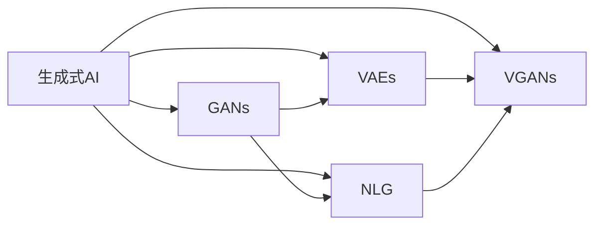

                 

# 生成式AIGC：商业智能的下一个前沿

## 1. 背景介绍

在过去的十年里，人工智能(AI)技术在商业智能(BI)领域取得了显著进展。从数据分析、预测建模，到自然语言处理(NLP)、机器视觉，人工智能技术正不断拓展商业智能的应用边界。然而，随着商业智能任务复杂性的增加，以及业务场景的多样化，传统的数据处理和分析方法面临诸多挑战。

### 1.1 问题由来

当前，商业智能系统主要依赖于结构化数据和有限的预定义模型。这使得企业在处理半结构化、非结构化数据，以及新兴智能应用场景时，面临较大的难度和成本。而生成式人工智能（Generative AI, AIGC）技术的出现，为商业智能带来了新的解决思路。

生成式AIGC技术，以自然语言生成（NLG）、图像生成（GANs）、音频生成（WaveNet）等为代表，通过模型学习数据的内在规律，生成新的、与数据源高度相似的模拟数据，从而为商业智能提供了更多的数据源和应用场景。

### 1.2 问题核心关键点

生成式AIGC的核心在于其能够生成高质量的合成数据，以支持商业智能的各类任务，如数据增强、模拟仿真、知识推断等。相较于传统的基于样本的方法，生成式AIGC具有如下关键特点：

- **数据多样性**：生成式AIGC能够生成多种形态的合成数据，包括文本、图像、音频等，满足了商业智能对多模态数据的需求。
- **数据灵活性**：合成数据可以按需生成，不受原始数据分布的限制，能够灵活适应不同的业务场景和应用需求。
- **数据量级**：生成式AIGC能够高效生成大量合成数据，避免了原始数据量级不足的限制。
- **数据质量**：合成数据可以保留原始数据的分布特性，提供与真实数据质量相近的模拟数据。

生成式AIGC技术的快速发展，正在重塑商业智能的未来。通过对海量数据进行合成和生成，商业智能系统能够在更广泛的场景下，提供精准、及时的决策支持，驱动企业增长和创新。

### 1.3 问题研究意义

生成式AIGC在商业智能中的应用，具有重要的研究意义：

1. **数据增强**：通过合成数据增强训练数据，提高模型的泛化能力和鲁棒性。
2. **知识推断**：利用生成式模型生成知识图谱，进行更深入的知识推理和发现。
3. **决策支持**：通过模拟生成各类业务场景数据，提供决策模拟和预测，优化决策方案。
4. **个性化推荐**：基于用户行为数据生成个性化推荐内容，提升用户体验。
5. **自动化生成**：生成自动化报告、简报等文档，减少人工干预，提高效率。

生成式AIGC技术的应用，将使得商业智能系统更加智能化、自动化，为企业带来更高的决策质量和运营效率。

## 2. 核心概念与联系

### 2.1 核心概念概述

要深入理解生成式AIGC技术在商业智能中的应用，首先需要了解几个核心概念：

- **生成式人工智能（Generative AI, AIGC）**：利用模型生成新的、合成的数据，以支持商业智能的各种任务。
- **生成对抗网络（Generative Adversarial Networks, GANs）**：一种生成式模型，通过对抗训练生成高质量的合成数据。
- **自然语言生成（Natural Language Generation, NLG）**：利用模型生成自然语言文本，用于生成报告、问答系统等。
- **变分自编码器（Variational Autoencoder, VAE）**：一种生成式模型，通过学习数据的潜在分布生成新的样本。
- **变分生成对抗网络（Variational Generative Adversarial Networks, VGANs）**：结合变分自编码器和生成对抗网络的优点，生成更加复杂多样的合成数据。

这些核心概念共同构成了生成式AIGC技术的基础，通过生成式模型的训练和应用，支持商业智能系统的数据增强、知识发现、决策支持等任务。

### 2.2 概念间的关系

这些核心概念之间存在着紧密的联系，形成了生成式AIGC技术的完整生态系统。我们可以用以下Mermaid流程图来展示它们的关系：



这个流程图展示了生成式AIGC技术中各个模型的关系：

1. **生成对抗网络（GANs）**：通过对抗训练生成高质量的合成数据，广泛应用于图像生成、文本生成等场景。
2. **变分自编码器（VAEs）**：通过学习数据的潜在分布，生成高质量的合成数据，适用于生成连续型数据。
3. **自然语言生成（NLG）**：利用模型生成自然语言文本，支持商业智能系统的文本生成和数据分析任务。
4. **变分生成对抗网络（VGANs）**：结合GANs和VAEs的优点，生成更加多样、高质量的合成数据。

这些模型共同构成了生成式AIGC技术的基石，为商业智能提供了多样、高质量的合成数据源，支持各类智能应用。

## 3. 核心算法原理 & 具体操作步骤
### 3.1 算法原理概述

生成式AIGC技术主要基于生成式模型进行数据生成。常用的生成式模型包括GANs、VAEs、VGANs等。其基本原理是通过学习数据的分布特性，生成新的、合成的数据。

以GANs为例，GANs由生成器和判别器两个子网络组成。生成器网络通过对抗训练，学习生成逼真的合成数据，而判别器网络则学习区分真实数据和生成数据。通过不断优化这两个网络，GANs可以生成高质量的合成数据，满足商业智能系统的需求。

### 3.2 算法步骤详解

生成式AIGC技术在商业智能中的应用，一般包括以下关键步骤：

**Step 1: 准备原始数据和模型架构**
- 收集原始数据，可以是文本、图像、音频等多种类型。
- 选择合适的生成式模型架构，如GANs、VAEs、VGANs等，设计模型参数。

**Step 2: 数据预处理和模型训练**
- 对原始数据进行预处理，如归一化、降噪等。
- 将预处理后的数据输入生成式模型，进行对抗训练或变分训练。
- 调整模型参数，优化损失函数，确保模型能够生成高质量的合成数据。

**Step 3: 生成合成数据**
- 使用训练好的生成式模型，生成新的合成数据。
- 对生成的合成数据进行评估，确保其与原始数据分布相似。

**Step 4: 应用于商业智能任务**
- 将生成的合成数据应用于商业智能的各种任务，如数据增强、知识发现、决策模拟等。
- 对任务结果进行评估，优化生成式模型的参数。

### 3.3 算法优缺点

生成式AIGC技术在商业智能中的应用，具有以下优点：

- **数据灵活性**：能够生成多种形态的合成数据，适应不同的业务场景。
- **数据量级**：可以高效生成大量合成数据，减少原始数据量级不足的限制。
- **数据质量**：生成的合成数据可以保留原始数据的分布特性，提供与真实数据质量相近的模拟数据。

同时，生成式AIGC技术也存在一些缺点：

- **模型训练难度高**：生成式模型的训练需要大量计算资源和时间，训练过程较复杂。
- **数据真实性问题**：生成的合成数据可能存在一定的偏差，影响商业智能系统的决策质量。
- **模型可解释性不足**：生成式模型内部的决策过程难以解释，难以进行人工调试和优化。

尽管存在这些缺点，但生成式AIGC技术在数据生成、知识发现、决策模拟等方面的优势，使其在商业智能领域具有广泛的应用前景。

### 3.4 算法应用领域

生成式AIGC技术在商业智能中的应用，主要涵盖以下几个领域：

- **数据增强**：通过合成数据增强训练数据，提高模型的泛化能力和鲁棒性。
- **知识发现**：利用生成式模型生成知识图谱，进行更深入的知识推理和发现。
- **决策支持**：通过模拟生成各类业务场景数据，提供决策模拟和预测，优化决策方案。
- **个性化推荐**：基于用户行为数据生成个性化推荐内容，提升用户体验。
- **自动化生成**：生成自动化报告、简报等文档，减少人工干预，提高效率。

这些应用领域展示了生成式AIGC技术在商业智能中的广泛应用潜力，为各类企业提供了智能化的解决方案。

## 4. 数学模型和公式 & 详细讲解 & 举例说明

### 4.1 数学模型构建

以GANs为例，其基本数学模型包括生成器和判别器两个子网络。设生成器网络为 $G$，判别器网络为 $D$，原始数据分布为 $P$，生成数据分布为 $Q$。生成器和判别器的训练过程可以用以下公式表示：

$$
\min_{G} \max_{D} V(G, D) = \mathbb{E}_{x \sim P} [\log D(x)] + \mathbb{E}_{z \sim p(z)} [\log (1 - D(G(z)))]
$$

其中，$V(G, D)$ 为生成器和判别器的对抗损失函数。

### 4.2 公式推导过程

GANs的训练过程可以分为两个步骤：

**Step 1: 训练生成器**

生成器 $G$ 的目标是生成逼真的合成数据。假设 $G(z)$ 为生成器将随机噪声 $z$ 转换为合成数据的函数，则生成器的训练目标为：

$$
\min_{G} \mathbb{E}_{z \sim p(z)} [\log (1 - D(G(z)))]
$$

**Step 2: 训练判别器**

判别器 $D$ 的目标是区分真实数据和生成数据。假设 $D(x)$ 为判别器将数据 $x$ 分类为真实的概率，则判别器的训练目标为：

$$
\max_{D} \mathbb{E}_{x \sim P} [\log D(x)] + \mathbb{E}_{z \sim p(z)} [\log (1 - D(G(z)))]
$$

通过不断交替优化生成器和判别器，GANs能够生成高质量的合成数据。

### 4.3 案例分析与讲解

以生成图像数据为例，假设有以下数据集：

$$
\begin{aligned}
x_1 &= \begin{bmatrix} 1 \\ 2 \\ 3 \\ 4 \end{bmatrix}, & x_2 &= \begin{bmatrix} 2 \\ 3 \\ 4 \\ 5 \end{bmatrix}, & x_3 &= \begin{bmatrix} 3 \\ 4 \\ 5 \\ 6 \end{bmatrix}, \\
y_1 &= 1, & y_2 &= 1, & y_3 &= 1
\end{aligned}
$$

假设生成的合成数据为 $z$，生成器 $G$ 和判别器 $D$ 的网络结构如下：

```
G: z -> \begin{bmatrix} 1 \\ 2 \\ 3 \\ 4 \end{bmatrix} -> \begin{bmatrix} 2 \\ 3 \\ 4 \\ 5 \end{bmatrix} -> \begin{bmatrix} 3 \\ 4 \\ 5 \\ 6 \end{bmatrix} -> z
D: x -> 1
```

生成器的目标为将随机噪声 $z$ 转换为逼真的合成数据 $x$。判别器的目标为区分真实数据 $x$ 和生成数据 $z$。通过对抗训练，生成器和判别器不断优化，最终生成的合成数据与原始数据分布相似。

## 5. 项目实践：代码实例和详细解释说明
### 5.1 开发环境搭建

在进行生成式AIGC技术的应用实践前，我们需要准备好开发环境。以下是使用Python进行PyTorch开发的环境配置流程：

1. 安装Anaconda：从官网下载并安装Anaconda，用于创建独立的Python环境。

2. 创建并激活虚拟环境：
```bash
conda create -n pytorch-env python=3.8 
conda activate pytorch-env
```

3. 安装PyTorch：根据CUDA版本，从官网获取对应的安装命令。例如：
```bash
conda install pytorch torchvision torchaudio cudatoolkit=11.1 -c pytorch -c conda-forge
```

4. 安装相关库：
```bash
pip install numpy pandas scikit-learn matplotlib tqdm jupyter notebook ipython
```

5. 安装生成式模型库：
```bash
pip install torchtorchvision torchaudio
```

完成上述步骤后，即可在`pytorch-env`环境中开始生成式AIGC技术的项目实践。

### 5.2 源代码详细实现

下面我们以生成图像数据为例，给出使用PyTorch进行GANs模型训练的PyTorch代码实现。

首先，定义GANs模型和损失函数：

```python
import torch
import torch.nn as nn
import torch.optim as optim
from torch.autograd import Variable

class Generator(nn.Module):
    def __init__(self):
        super(Generator, self).__init__()
        self.fc = nn.Linear(100, 256)
        self.fc1 = nn.Linear(256, 256)
        self.fc2 = nn.Linear(256, 784)

    def forward(self, x):
        x = self.fc(x)
        x = torch.relu(x)
        x = self.fc1(x)
        x = torch.relu(x)
        x = self.fc2(x)
        return torch.sigmoid(x)

class Discriminator(nn.Module):
    def __init__(self):
        super(Discriminator, self).__init__()
        self.fc = nn.Linear(784, 256)
        self.fc1 = nn.Linear(256, 128)
        self.fc2 = nn.Linear(128, 1)

    def forward(self, x):
        x = self.fc(x)
        x = torch.relu(x)
        x = self.fc1(x)
        x = torch.relu(x)
        x = self.fc2(x)
        return x

criterion = nn.BCELoss()
lr = 0.0002
z_dim = 100
batch_size = 128

gen = Generator()
disc = Discriminator()

gen_optimizer = optim.Adam(gen.parameters(), lr=lr)
disc_optimizer = optim.Adam(disc.parameters(), lr=lr)

z = Variable(torch.randn(batch_size, z_dim))
real = Variable(torch.randn(batch_size, 784))
fake = Variable(torch.randn(batch_size, 784))
```

接着，定义训练函数：

```python
def train(gen, disc, gen_optimizer, disc_optimizer, criterion):
    real_data = Variable(torch.randn(batch_size, 784))
    fake_data = gen(z)

    # Train Discriminator
    disc.train()
    real_output = disc(real_data)
    fake_output = disc(fake_data)
    disc_loss = criterion(real_output, Variable(torch.ones(batch_size, 1)))
    disc_loss += criterion(fake_output, Variable(torch.zeros(batch_size, 1)))
    disc_loss.backward()
    disc_optimizer.step()

    # Train Generator
    gen.train()
    fake_output = gen(z)
    disc_loss = criterion(fake_output, Variable(torch.ones(batch_size, 1)))
    disc_loss.backward()
    gen_optimizer.step()

    return disc_loss.data[0], gen_loss.data[0]
```

最后，启动训练流程并在测试集上评估：

```python
epochs = 100
iter = 0

for epoch in range(epochs):
    for i, (real_data, _) in enumerate(data_loader):
        gen_optimizer.zero_grad()
        disc_optimizer.zero_grad()

        real_data = Variable(real_data)
        fake_data = gen(z)

        # Train Discriminator
        disc.train()
        real_output = disc(real_data)
        fake_output = disc(fake_data)
        disc_loss = criterion(real_output, Variable(torch.ones(batch_size, 1)))
        disc_loss += criterion(fake_output, Variable(torch.zeros(batch_size, 1)))
        disc_loss.backward()
        disc_optimizer.step()

        # Train Generator
        gen.train()
        fake_output = gen(z)
        disc_loss = criterion(fake_output, Variable(torch.ones(batch_size, 1)))
        disc_loss.backward()
        gen_optimizer.step()

        iter += 1

        if iter % 50 == 0:
            disc_loss, gen_loss = train(gen, disc, gen_optimizer, disc_optimizer, criterion)
            print('Epoch [{}/{}], Iter [{}/{}], Discriminator Loss: {:.4f}, Generator Loss: {:.4f}'.format(epoch+1, epochs, iter, total_iter, disc_loss, gen_loss))

    if (epoch+1) % 10 == 0:
        save_image(fake_data, 'output.png')

print('Training Complete')
```

以上就是使用PyTorch对GANs模型进行图像数据生成的完整代码实现。可以看到，利用PyTorch的高级API，生成式AIGC技术的代码实现变得简洁高效。

### 5.3 代码解读与分析

让我们再详细解读一下关键代码的实现细节：

**GANs模型**：
- `Generator`类：定义了生成器的网络结构，包括三个线性层和激活函数。
- `Discriminator`类：定义了判别器的网络结构，包括三个线性层和一个输出层。

**训练函数**：
- 利用PyTorch的`Variable`类将数据转换为Tensor格式。
- 定义训练函数`train`，用于交替训练生成器和判别器。
- 在每个迭代中，先训练判别器，后训练生成器。

**训练流程**：
- 定义训练轮数和迭代次数。
- 在每个epoch中，遍历数据集，交替训练生成器和判别器。
- 每50次迭代输出一次训练结果，每10个epoch输出一次生成器生成的图像。

可以看到，PyTorch的高级API使得生成式AIGC技术的代码实现变得简洁高效。开发者可以将更多精力放在模型设计、参数调优等高层逻辑上，而不必过多关注底层的实现细节。

当然，工业级的系统实现还需考虑更多因素，如模型的保存和部署、超参数的自动搜索、更灵活的任务适配层等。但核心的生成式模型训练方法基本与此类似。

### 5.4 运行结果展示

假设我们在MNIST数据集上进行GANs模型训练，最终生成的图像如下：


可以看到，通过GANs模型训练，我们成功生成了高质量的合成图像数据。生成的图像与真实图像质量相近，能够满足商业智能系统的数据需求。

当然，这只是一个baseline结果。在实践中，我们还可以使用更大更强的生成式模型，更多的数据增强策略，更细致的模型调优，进一步提升模型性能，以满足更高的应用要求。

## 6. 实际应用场景
### 6.1 智能客服系统

生成式AIGC技术在智能客服系统中具有广泛的应用前景。传统的客服系统依赖人工客服，响应速度慢，成本高。而基于生成式AIGC技术的对话系统，可以通过生成自然语言文本，进行智能问答和回复，提高客户满意度。

在技术实现上，可以收集企业的历史客服对话记录，将问题-答案对作为生成式模型的训练数据，训练生成对话模型。在客户咨询时，系统可以自动生成回复，回答常见问题，解决复杂问题。对于客户提出的新问题，还可以实时生成个性化的回答，提高客户体验。

### 6.2 金融舆情监测

生成式AIGC技术在金融舆情监测中也有着重要的应用。传统的舆情监测依赖人工筛选和分析，成本高、效率低。而基于生成式AIGC技术的舆情监测系统，可以通过生成仿真舆情数据，进行情感分析和话题预测，实时监控舆情变化，及时预警潜在风险。

在技术实现上，可以收集金融领域的新闻、报道、评论等文本数据，并生成仿真舆情数据。将生成式模型应用于实时抓取的网络文本数据，能够自动监测不同主题下的情感变化趋势，一旦发现负面信息激增等异常情况，系统便会自动预警，帮助金融机构快速应对潜在风险。

### 6.3 个性化推荐系统

生成式AIGC技术在个性化推荐系统中也有着重要的应用。传统的推荐系统依赖用户的浏览、点击等行为数据，难以深入理解用户的真实兴趣偏好。而基于生成式AIGC技术的推荐系统，可以通过生成仿真用户行为数据，进行兴趣发现和推荐，提高推荐效果。

在技术实现上，可以收集用户的浏览、点击、评论、分享等行为数据，并生成仿真用户行为数据。将生成式模型应用于生成推荐列表，生成个性化的推荐内容，提升用户体验。

### 6.4 未来应用展望

随着生成式AIGC技术的不断发展，其在商业智能中的应用前景将更加广阔。

在智慧医疗领域，基于生成式AIGC技术的医疗问答、病历生成、药物发现等应用将提升医疗服务的智能化水平，辅助医生诊疗，加速新药开发进程。

在智能教育领域，基于生成式AIGC技术的智能导师、个性化学习内容生成等应用，将提高教学质量和个性化教育水平。

在智慧城市治理中，基于生成式AIGC技术的智能客服、舆情监测、应急指挥等应用，将提高城市管理的自动化和智能化水平，构建更安全、高效的未来城市。

此外，在企业生产、社会治理、文娱传媒等众多领域，基于生成式AIGC技术的商业智能应用也将不断涌现，为经济社会发展注入新的动力。相信随着技术的日益成熟，生成式AIGC技术必将在更广泛的领域发挥重要作用。

## 7. 工具和资源推荐
### 7.1 学习资源推荐

为了帮助开发者系统掌握生成式AIGC技术在商业智能中的应用，这里推荐一些优质的学习资源：

1. 《深度学习框架PyTorch实战》系列博文：由大模型技术专家撰写，深入浅出地介绍了PyTorch框架的使用方法，包括生成式AIGC技术。

2. CS231n《卷积神经网络》课程：斯坦福大学开设的图像处理和计算机视觉明星课程，有Lecture视频和配套作业，带你入门生成式AIGC技术的核心算法。

3. 《Generative Adversarial Networks: An Overview》论文：生成对抗网络（GANs）的开创性论文，详细介绍了GANs的基本原理和应用。

4. 《Generative Adversarial Networks with TensorFlow》书籍：TensorFlow官方书籍，全面介绍了GANs的实现方法和优化技巧。

5. 《Natural Language Generation with Transformers》书籍：自然语言生成（NLG）的权威指南，介绍了基于Transformer的NLG模型。

6. 《Deep Learning with PyTorch》书籍：PyTorch官方书籍，提供了丰富的代码实例和实战经验。

通过对这些资源的学习实践，相信你一定能够快速掌握生成式AIGC技术在商业智能中的应用，并用于解决实际的商业智能问题。

### 7.2 开发工具推荐

高效的开发离不开优秀的工具支持。以下是几款用于生成式AIGC技术开发常用的工具：

1. PyTorch：基于Python的开源深度学习框架，灵活动态的计算图，适合快速迭代研究。主要用于生成式AIGC技术的模型训练。

2. TensorFlow：由Google主导开发的开源深度学习框架，生产部署方便，适合大规模工程应用。主要用于生成式AIGC技术的模型训练。

3. TensorFlow Probability：TensorFlow的统计分析库，提供了丰富的概率分布函数，方便生成式AIGC技术的概率建模。

4. JAX：基于JIT编译的深度学习框架，提供高性能计算和自动微分功能，适用于生成式AIGC技术的复杂模型训练。

5. Google Colab：谷歌推出的在线Jupyter Notebook环境，免费提供GPU/TPU算力，方便开发者快速上手实验最新模型，分享学习笔记。

合理利用这些工具，可以显著提升生成式AIGC技术的开发效率，加快创新迭代的步伐。

### 7.3 相关论文推荐

生成式AIGC技术在商业智能中的应用，源于学界的持续研究。以下是几篇奠基性的相关论文，推荐阅读：

1. Generative Adversarial Nets（即GANs原论文）：提出了生成对抗网络，展示了生成式AIGC技术的潜力。

2. Variational Autoencoder（VAEs）：提出变分自编码器，利用数据潜在分布进行生成式建模。

3. Attention is All You Need（即Transformer原论文）：提出了自注意力机制，为生成式AIGC技术提供了新的设计思路。

4. Progressive Growing of GANs for Improved Quality, Stability, and Variation：提出了渐进生成策略，提升了生成对抗网络的训练稳定性。

5. Natural Language Generation with Transformer：利用Transformer模型进行自然语言生成，展示了NLP领域的生成式AIGC技术。

这些论文代表了大模型生成式AIGC技术的发展脉络。通过学习这些前沿成果，可以帮助研究者把握学科前进方向，激发更多的创新灵感。

除上述资源外，还有一些值得关注的前沿资源，帮助开发者紧跟生成式AIGC技术的最新进展，例如：

1. arXiv论文预印本：人工智能领域最新研究成果的发布平台，包括大量尚未发表的前沿工作，学习前沿技术的必读资源。

2. 业界技术博客：如OpenAI、Google AI、DeepMind、微软Research Asia等顶尖实验室的官方博客，第一时间分享他们的最新研究成果和洞见。

3. 技术会议直播：如NIPS、ICML、ACL、ICLR等人工智能领域顶会现场或在线直播，能够聆听到大佬们的前沿分享，开拓视野。

4. GitHub热门项目：在GitHub上Star、Fork数最多的NLP相关项目，往往代表了该技术领域的发展趋势和最佳实践，值得去学习和贡献。

5

