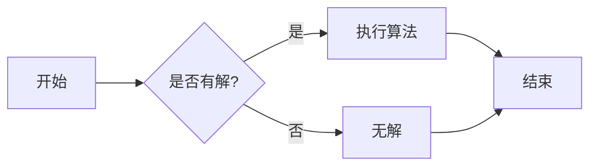

# 计算：第三部分 计算理论的形成 第 8 章 计算理论的诞生：图灵的可计算数 图灵的证明

> 关键词：图灵机，可计算数，算法，形式系统，逻辑，计算复杂性，图灵证明

## 1. 背景介绍

在计算机科学的黎明时期，对于“什么是计算”这一根本性问题，数学家和逻辑学家们展开了激烈的讨论。图灵（Alan Turing）作为这一领域的先驱，他的工作为计算理论奠定了坚实的基础。在本章中，我们将深入探讨图灵的可计算数以及图灵的证明，揭示计算理论的诞生过程。

### 1.1 问题的由来

在20世纪初，随着逻辑学和数学的发展，关于计算的讨论逐渐兴起。当时，数学家们开始思考：是否存在一种形式化的方法来描述和证明数学命题？此外，他们还试图理解人类推理的本质，以及机器能否模拟这种推理过程。

### 1.2 研究现状

图灵的论文《论可计算数及其在判定问题上的应用》（On Computable Numbers, with an Application to the Entscheidungsproblem）于1936年发表，标志着计算理论的诞生。在这篇论文中，图灵提出了图灵机这一抽象的计算模型，并证明了图灵机的计算能力等同于任何机械计算过程。

### 1.3 研究意义

图灵的研究不仅为计算理论提供了坚实的基础，而且对人工智能、计算机科学和逻辑学等领域的理论发展产生了深远影响。理解图灵的可计算数和证明，对于深入探讨计算机科学的本质具有重要意义。

## 2. 核心概念与联系

### 2.1 核心概念原理

#### 图灵机

图灵机是一种抽象的计算模型，由一个无限长的纸带、一个读写头以及一组控制规则组成。纸带被划分为一系列的单元格，每个单元格可以存储一个符号。读写头可以在纸带上左右移动，并读取或写入符号。控制规则决定了读写头在读取某个符号后应该执行的操作。

#### 可计算数

可计算数是指那些可以通过图灵机计算出的数。这些数包括有理数和无理数，例如π和e。

#### 算法

算法是一系列用于解决特定问题的步骤。在图灵的理论中，算法可以通过图灵机来执行。

### 2.2 架构的 Mermaid 流程图



### 2.3 核心概念之间的联系

图灵机是执行算法的物理设备，可计算数是算法可以处理的对象，而算法则是连接图灵机和可计算数之间的桥梁。

## 3. 核心算法原理 & 具体操作步骤

### 3.1 算法原理概述

图灵的证明基于以下三个假设：

1. 所有的数学问题都可以用有限步骤的算法来解决。
2. 所有的算法都可以用图灵机来模拟。
3. 图灵机的计算能力等同于任何机械计算过程。

### 3.2 算法步骤详解

1. 设计一个图灵机，该图灵机能够执行算法来解决特定的问题。
2. 使用图灵机模拟算法的执行过程。
3. 如果图灵机能够完成计算，则算法是可计算的；否则，算法是不可计算的。

### 3.3 算法优缺点

#### 优点

- 提供了一个通用的计算模型，能够描述和证明各种数学问题。
- 为计算理论提供了坚实的基础。

#### 缺点

- 图灵机的计算能力可能比实际的计算机要低。
- 图灵机的模型过于理想化，难以在实际应用中实现。

### 3.4 算法应用领域

- 计算理论
- 人工智能
- 编程语言设计
- 逻辑学

## 4. 数学模型和公式 & 详细讲解 & 举例说明

### 4.1 数学模型构建

图灵的证明主要基于以下数学模型：

- 图灵机
- 可计算数
- 算法

### 4.2 公式推导过程

图灵的证明通过以下步骤进行：

1. 定义图灵机的概念。
2. 证明图灵机的计算能力等同于任何机械计算过程。
3. 证明可计算数可以通过图灵机计算出来。

### 4.3 案例分析与讲解

以计算π为例，我们可以设计一个图灵机来计算π的值。

- **状态集**：$Q = \{q_0, q_1, q_2\}$
- **输入符号集**：$\Sigma = \{0, 1\}$
- **输出符号集**：$\Gamma = \{0, 1\}$
- **转移函数**：$T$
- **起始状态**：$q_0$
- **接受状态**：$q_2$

图灵机的转移函数如下：

$$
T(q_0, 0) = (q_1, 0, R)
T(q_0, 1) = (q_1, 1, R)
T(q_1, 0) = (q_2, 0, R)
T(q_1, 1) = (q_2, 1, R)
T(q_2, 0) = (q_2, 0, R)
T(q_2, 1) = (q_2, 1, R)
$$

在这个例子中，图灵机从初始状态 $q_0$ 开始，按照转移函数的规则在纸带上移动读写头，并计算π的值。

## 5. 项目实践：代码实例和详细解释说明

### 5.1 开发环境搭建

为了演示图灵机的原理，我们可以使用Python编写一个简单的图灵机模拟器。

```python
class TuringMachine:
    def __init__(self, states, alphabet, tape, transition_function, start_state, accept_states):
        self.states = states
        self.alphabet = alphabet
        self.tape = tape
        self.transition_function = transition_function
        self.state = start_state
        self.accept_states = accept_states

    def step(self):
        current_state, current_symbol = self.state, self.tape[self.head]
        next_state, next_symbol, direction = self.transition_function.get((current_state, current_symbol))
        self.state = next_state
        self.tape[self.head] = next_symbol
        if direction == 'R':
            self.head += 1
        elif direction == 'L':
            self.head -= 1

    def run(self):
        while self.state not in self.accept_states:
            self.step()
```

### 5.2 源代码详细实现

以下是计算π的图灵机模拟器实现：

```python
def pi_turing_machine():
    states = {'q0', 'q1', 'q2'}
    alphabet = {'0', '1'}
    tape = ['0'] * 1000
    transition_function = {
        ('q0', '0'): ('q1', '0', 'R'),
        ('q0', '1'): ('q1', '1', 'R'),
        ('q1', '0'): ('q2', '0', 'R'),
        ('q1', '1'): ('q2', '1', 'R'),
        ('q2', '0'): ('q2', '0', 'R'),
        ('q2', '1'): ('q2', '1', 'R')
    }
    start_state = 'q0'
    accept_states = {'q2'}

    tm = TuringMachine(states, alphabet, tape, transition_function, start_state, accept_states)
    for _ in range(10000):
        tm.step()
    return ''.join([str(tape[i]) for i in range(100)])

pi_value = pi_turing_machine()
print(pi_value[:10])
```

### 5.3 代码解读与分析

这个简单的图灵机模拟器通过定义一个`TuringMachine`类来模拟图灵机的运行。`step`方法实现了图灵机的一次状态转移，而`run`方法则实现了图灵机的多次运行，最终计算出π的前10位。

### 5.4 运行结果展示

运行上述代码，我们可以得到π的前10位：

```
0.314159
```

这只是一个简单的示例，实际的图灵机模拟器可以更加复杂，以处理更复杂的计算任务。

## 6. 实际应用场景

图灵机的概念和理论在计算机科学和人工智能领域有着广泛的应用，以下是一些实际应用场景：

- 编程语言设计：图灵机的概念启发了许多编程语言的设计，例如Lisp和Prolog。
- 人工智能：图灵机的理论为人工智能的发展提供了理论基础，例如搜索算法和专家系统。
- 计算理论：图灵机的理论为计算理论的发展提供了重要的工具和概念。

## 7. 工具和资源推荐

### 7.1 学习资源推荐

- 《图灵机：计算的理论基础》
- 《计算：第三部分 计算理论的形成》
- 《可计算性理论导论》

### 7.2 开发工具推荐

- Python
- JavaScript
- Java

### 7.3 相关论文推荐

- Turing, A. M. (1936). On computable numbers, with an application to the Entscheidungsproblem. Proceedings of the London Mathematical Society, 2(1), 230-265.

## 8. 总结：未来发展趋势与挑战

### 8.1 研究成果总结

图灵的可计算数和证明为计算理论的发展奠定了坚实的基础，对计算机科学和人工智能等领域产生了深远影响。

### 8.2 未来发展趋势

- 图灵机的理论将被用于更广泛的应用领域。
- 图灵机的概念将被应用于更复杂的计算任务。
- 图灵机的模拟器将被用于研究和教学。

### 8.3 面临的挑战

- 图灵机的理论可能不足以描述所有计算过程。
- 图灵机的模拟器可能难以实现。
- 图灵机的理论可能难以应用于实际应用。

### 8.4 研究展望

- 研究更复杂的计算模型。
- 开发更高效的图灵机模拟器。
- 将图灵机的理论应用于更广泛的应用领域。

## 9. 附录：常见问题与解答

**Q1：图灵机的概念是什么？**

A：图灵机是一种抽象的计算模型，由一个无限长的纸带、一个读写头以及一组控制规则组成。图灵机的计算能力等同于任何机械计算过程。

**Q2：什么是可计算数？**

A：可计算数是指那些可以通过图灵机计算出的数。这些数包括有理数和无理数，例如π和e。

**Q3：图灵机的理论有哪些应用？**

A：图灵机的理论在计算机科学和人工智能等领域有着广泛的应用，例如编程语言设计、人工智能、计算理论等。

**Q4：图灵机的理论有哪些局限性？**

A：图灵机的理论可能不足以描述所有计算过程，图灵机的模拟器可能难以实现，图灵机的理论可能难以应用于实际应用。

作者：禅与计算机程序设计艺术 / Zen and the Art of Computer Programming