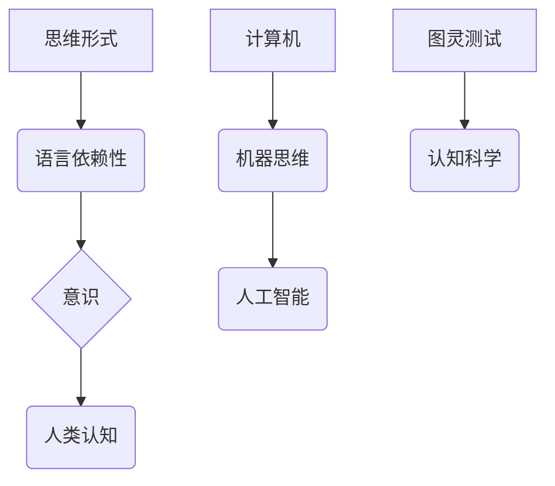

# 语言对于任何经过检验的思维形式都不是必需的

> 关键词：思维形式，意识，计算机，人工智能，图灵测试，认知科学

## 1. 背景介绍

自人类文明以来，语言一直是沟通与思维的基石。我们依赖语言来表达思想、传递信息、构建复杂的社会结构。然而，随着计算机科学的兴起，一种新的思维形式开始崭露头角：机器思维。机器思维不需要语言作为媒介，它通过算法、逻辑和计算来模拟人类的认知过程。本文将探讨语言对于机器思维的重要性，并分析机器思维如何超越语言的限制，实现更为广泛和深入的认知。

### 1.1 思维与语言的关联

在传统的认知科学中，思维被视为一种语言性的活动。我们通过语言来构建概念、进行推理、解决问题。这种观点认为，思维的形式和内容都深深地植根于语言之中。

### 1.2 机器思维的兴起

随着人工智能技术的发展，机器思维逐渐成为可能。机器思维不依赖于语言，它通过算法和计算来模拟人类的认知过程，如学习、推理、决策等。

### 1.3 语言与机器思维的矛盾

尽管语言在人类思维中扮演着重要角色，但机器思维似乎可以独立于语言存在。这种矛盾引发了关于语言在认知中的作用和机器思维可能性的讨论。

## 2. 核心概念与联系

### 2.1 思维形式

思维形式是指思维活动中所采用的基本结构和方式。传统的思维形式依赖于语言，而机器思维则探索非语言性的思维形式。

### 2.2 意识

意识是人类认知的高级形式，它涉及自我感知、情感体验等。机器意识是机器思维的一个分支，它试图模拟人类的意识过程。

### 2.3 计算机与人工智能

计算机是机器思维的基础平台，而人工智能则是实现机器思维的技术手段。机器思维通过人工智能算法在计算机上实现。

### 2.4 图灵测试与认知科学

图灵测试是评估机器智能的一种方法，它探讨机器是否能够模仿人类的思维和意识。认知科学则研究人类思维和意识的本质。



## 3. 核心算法原理 & 具体操作步骤

### 3.1 算法原理概述

机器思维的核心算法原理包括：

- **机器学习**：通过数据学习模式和规律。
- **深度学习**：使用神经网络模拟人脑结构，进行复杂的学习任务。
- **自然语言处理**：使机器能够理解和使用语言。

### 3.2 算法步骤详解

1. **数据收集**：收集用于训练的数据。
2. **模型选择**：选择合适的机器学习或深度学习模型。
3. **训练**：使用收集的数据训练模型。
4. **评估**：评估模型的性能。
5. **部署**：将模型部署到实际应用中。

### 3.3 算法优缺点

**优点**：

- **高效**：机器思维可以快速处理大量数据。
- **精确**：机器思维可以避免人类的认知偏差。
- **持续学习**：机器思维可以通过新的数据不断改进。

**缺点**：

- **局限性**：机器思维受限于训练数据和算法。
- **缺乏意识**：机器思维没有真正的意识。
- **伦理问题**：机器思维的决策可能存在伦理风险。

### 3.4 算法应用领域

机器思维的应用领域包括：

- **自然语言处理**：机器翻译、语音识别、文本生成等。
- **图像识别**：人脸识别、物体检测、医学图像分析等。
- **推荐系统**：电影推荐、商品推荐、新闻推荐等。

## 4. 数学模型和公式 & 详细讲解 & 举例说明

### 4.1 数学模型构建

机器思维的数学模型通常包括：

- **神经网络**：模拟人脑神经元连接的数学模型。
- **决策树**：基于树状结构的决策模型。
- **支持向量机**：基于优化理论的分类模型。

### 4.2 公式推导过程

以神经网络为例，其激活函数的公式为：

$$
a_i = f(\sum_{j} w_{ij} \times x_j + b_i)
$$

其中，$a_i$ 是第 $i$ 个神经元的激活值，$w_{ij}$ 是连接权重，$x_j$ 是输入值，$b_i$ 是偏置项，$f$ 是激活函数。

### 4.3 案例分析与讲解

以卷积神经网络(CNN)在图像识别中的应用为例，CNN通过多层卷积和池化操作提取图像特征，并通过全连接层进行分类。

## 5. 项目实践：代码实例和详细解释说明

### 5.1 开发环境搭建

1. 安装Python、NumPy、TensorFlow或PyTorch等开发工具。
2. 准备图像数据集。

### 5.2 源代码详细实现

以下是一个简单的CNN模型实现示例：

```python
import tensorflow as tf
from tensorflow.keras import layers, models

# 构建模型
model = models.Sequential()
model.add(layers.Conv2D(32, (3, 3), activation='relu', input_shape=(28, 28, 1)))
model.add(layers.MaxPooling2D((2, 2)))
model.add(layers.Conv2D(64, (3, 3), activation='relu'))
model.add(layers.MaxPooling2D((2, 2)))
model.add(layers.Conv2D(64, (3, 3), activation='relu'))

# 添加全连接层
model.add(layers.Flatten())
model.add(layers.Dense(64, activation='relu'))
model.add(layers.Dense(10, activation='softmax'))

# 编译模型
model.compile(optimizer='adam',
              loss='sparse_categorical_crossentropy',
              metrics=['accuracy'])
```

### 5.3 代码解读与分析

上述代码构建了一个简单的CNN模型，用于识别MNIST手写数字数据集。

### 5.4 运行结果展示

运行模型后，可以得到模型在训练集和测试集上的准确率。

## 6. 实际应用场景

### 6.1 自然语言处理

机器思维在自然语言处理领域的应用包括：

- 机器翻译
- 语音识别
- 文本摘要
- 问答系统

### 6.2 图像识别

机器思维在图像识别领域的应用包括：

- 人脸识别
- 物体检测
- 医学图像分析

### 6.3 推荐系统

机器思维在推荐系统领域的应用包括：

- 商品推荐
- 电影推荐
- 新闻推荐

## 7. 工具和资源推荐

### 7.1 学习资源推荐

- 《深度学习》
- 《神经网络与深度学习》
- 《自然语言处理综论》

### 7.2 开发工具推荐

- TensorFlow
- PyTorch
- Keras

### 7.3 相关论文推荐

- “A Systematic Comparison of Several Neural Network Training Methods” by Krizhevsky, Sutskever, and Hinton
- “Convolutional Neural Networks for Visual Recognition” by Krizhevsky, Sutskever, and Hinton
- “Attention Is All You Need” by Vaswani, Shazeer, Parmar, Uszkoreit, Jones, Gomez, Polosukhin, Bart, and Chen

## 8. 总结：未来发展趋势与挑战

### 8.1 研究成果总结

本文探讨了语言对于机器思维的重要性，并分析了机器思维如何超越语言的限制。我们介绍了机器思维的核心算法原理和应用领域，并给出了实际应用场景的例子。

### 8.2 未来发展趋势

- 机器思维将继续发展，并可能在未来实现真正的意识。
- 机器思维将与其他领域（如生物学、心理学）融合，形成新的交叉学科。
- 机器思维将在更多领域得到应用，如医疗、教育、交通等。

### 8.3 面临的挑战

- 机器思维的伦理和安全问题需要得到解决。
- 机器思维的可解释性需要进一步提高。
- 机器思维需要更好地适应复杂多变的环境。

### 8.4 研究展望

未来的研究将集中在以下几个方面：

- 机器意识的实现
- 机器思维的可解释性
- 机器思维与人类思维的交互

## 9. 附录：常见问题与解答

**Q1：机器思维是否能够完全取代人类思维？**

A：机器思维可以模拟人类的某些认知过程，但无法完全取代人类思维。人类思维具有创造性和情感体验等特点，这是机器思维难以复制的。

**Q2：机器思维是否会威胁人类的安全？**

A：机器思维本身不具备威胁人类安全的意图。然而，如果不当使用，机器思维可能会带来负面影响。因此，需要加强对机器思维的研究和管理。

**Q3：机器思维在哪些领域最具潜力？**

A：机器思维在医疗、教育、交通、金融等领域最具潜力，可以帮助人类解决复杂问题，提高生产效率。

**Q4：如何确保机器思维的伦理和安全？**

A：确保机器思维的伦理和安全需要多方面的努力，包括制定相关法规、加强技术研发、提高公众意识等。

作者：禅与计算机程序设计艺术 / Zen and the Art of Computer Programming