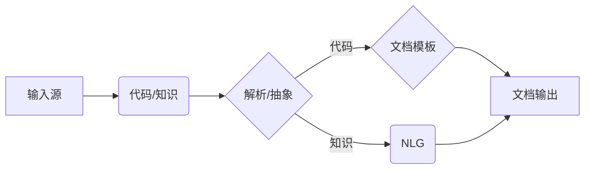

# 软件2.0的文档自动生成技术

> 关键词：软件文档自动化，知识图谱，自然语言生成，AI写作，代码到文档，软件工程，敏捷开发

## 1. 背景介绍

随着软件工程的不断发展，软件系统变得越来越复杂，文档的生成和维护成为了软件开发过程中的重要环节。然而，传统的手动文档编写不仅效率低下，而且难以保证文档的及时性和准确性。软件2.0时代，人工智能技术的飞速发展为我们带来了文档自动生成技术，极大地提高了文档生成的效率和质量。

### 1.1 问题的由来

- **手动文档编写效率低下**：软件项目涉及大量的文档，包括需求文档、设计文档、用户手册、开发文档等。手动编写这些文档需要耗费大量时间和精力，影响了开发效率。
- **文档更新不及时**：软件系统的不断迭代更新导致文档内容也需要不断更新，手动更新文档的工作量大，容易出错。
- **文档质量参差不齐**：由于文档编写依赖于人工，不同人编写的文档风格和格式可能不一致，导致文档质量参差不齐。

### 1.2 研究现状

近年来，随着自然语言处理（NLP）、知识图谱、机器学习等技术的发展，文档自动生成技术逐渐成熟。目前，文档自动生成技术主要分为以下几类：

- **代码到文档**：通过分析源代码结构，自动生成相应的文档。
- **知识图谱到文档**：利用知识图谱中的信息，自动生成文档内容。
- **AI写作**：利用自然语言生成技术，根据输入的上下文信息自动生成文档。

### 1.3 研究意义

文档自动生成技术对于软件开发具有以下重要意义：

- **提高开发效率**：自动生成文档可以节省大量时间和精力，提高开发效率。
- **保证文档质量**：自动化生成的文档格式统一，内容准确，提高了文档质量。
- **降低成本**：减少人工编写文档的工作量，降低软件开发成本。
- **促进知识共享**：自动生成的文档可以方便团队成员之间的知识共享。

## 2. 核心概念与联系

### 2.1 核心概念原理

#### 2.1.1 知识图谱

知识图谱是一种用于存储和表示实体及其相互关系的图结构数据。在文档自动生成中，知识图谱可以用来表示软件系统的结构、组件、接口等信息。

#### 2.1.2 自然语言生成

自然语言生成（NLG）是一种将结构化数据转换为自然语言文本的技术。在文档自动生成中，NLG可以用来将知识图谱中的信息转换为文档内容。

#### 2.1.3 代码到文档

代码到文档技术通过分析源代码结构，自动生成相应的文档。这通常涉及代码解析、抽象和文档模板等技术。

### 2.2 核心概念架构

以下是一个文档自动生成技术的Mermaid流程图：



在这个流程图中，输入源可以是源代码或知识图谱。解析/抽象模块负责解析输入数据，提取相关信息。文档模板或NLG模块根据提取的信息生成文档内容。最终，生成的文档输出。

## 3. 核心算法原理 & 具体操作步骤

### 3.1 算法原理概述

文档自动生成技术涉及多个技术模块，包括代码解析、抽象、文档模板、NLG等。

- **代码解析**：使用静态分析或动态分析技术，解析源代码，提取代码结构、变量、函数、类等信息。
- **抽象**：将代码信息抽象为更高级别的概念，如类、模块、接口等。
- **文档模板**：定义文档的格式和结构，将抽象后的信息填充到模板中。
- **NLG**：根据模板和抽象信息，生成自然语言文本。

### 3.2 算法步骤详解

以下是一个基于代码到文档的文档自动生成算法的步骤：

1. **源代码解析**：使用代码解析工具，提取代码中的类、方法、变量等信息。
2. **代码抽象**：将提取的代码信息抽象为类、模块、接口等高级概念。
3. **文档模板设计**：设计文档模板，包括类定义、方法描述、变量说明等部分。
4. **文档生成**：将抽象后的代码信息填充到模板中，生成文档内容。
5. **文档输出**：将生成的文档输出到文件或数据库中。

### 3.3 算法优缺点

#### 优点

- **提高效率**：自动化生成文档，节省人力和时间。
- **保证质量**：生成的文档格式统一，内容准确。
- **易于维护**：文档自动生成系统易于维护和扩展。

#### 缺点

- **依赖代码质量**：代码质量直接影响文档生成效果。
- **模板依赖性**：文档模板的设计和修改需要专业知识。
- **NLG技术限制**：NLG技术尚不完善，生成的文本可能不够自然。

### 3.4 算法应用领域

文档自动生成技术可以应用于以下领域：

- **软件开发**：生成需求文档、设计文档、用户手册、开发文档等。
- **运维管理**：生成系统日志、运维手册、故障排除指南等。
- **项目管理**：生成项目计划、进度报告、风险评估等。

## 4. 数学模型和公式 & 详细讲解 & 举例说明

### 4.1 数学模型构建

文档自动生成技术涉及多个数学模型，包括代码解析模型、抽象模型、NLG模型等。

#### 4.1.1 代码解析模型

代码解析模型通常使用抽象语法树（AST）表示代码结构。AST可以表示代码的语法结构，方便进行后续处理。

#### 4.1.2 抽象模型

抽象模型将AST转换为更高级别的抽象表示，如类、方法、模块等。

#### 4.1.3 NLG模型

NLG模型将抽象表示转换为自然语言文本。常见的NLG模型包括序列到序列（Seq2Seq）模型、生成对抗网络（GAN）等。

### 4.2 公式推导过程

由于文档自动生成涉及多个复杂的数学模型，这里不进行具体的公式推导。以下是一个简单的Seq2Seq模型的公式示例：

$$
y_t = \text{Encoder}(x_t) \cdot \text{Decoder}(y_{t-1})
$$

其中，$y_t$ 表示当前生成的词或句子，$x_t$ 表示输入的序列，$\text{Encoder}$ 和 $\text{Decoder}$ 分别表示编码器和解码器。

### 4.3 案例分析与讲解

以下是一个使用NLG模型生成文档的例子：

**输入**：类定义

```java
public class MyClass {
    private int a;
    private String b;
    // ...
}
```

**输出**：类描述

```markdown
MyClass 类包含以下成员变量：
- a：整型变量，表示 ...
- b：字符串变量，表示 ...
```

在这个例子中，NLG模型根据类定义信息，自动生成了类的描述文档。

## 5. 项目实践：代码实例和详细解释说明

### 5.1 开发环境搭建

以下是一个基于Java的文档自动生成项目的开发环境搭建步骤：

1. 安装Java开发工具包（JDK）。
2. 安装Eclipse或IntelliJ IDEA等IDE。
3. 安装代码解析库，如JavaParser。
4. 安装NLG库，如OpenNLP或GPT-3。

### 5.2 源代码详细实现

以下是一个简单的Java代码示例，展示了如何使用JavaParser和OpenNLP生成类描述文档：

```java
import com.github.javadocparser.ast.ClassDeclaration;
import com.github.javadocparser.ast.Javadoc;
import opennlp.tools.sentdetect.SentenceDetectorME;
import opennlp.tools.sentdetect.SentenceModel;

import java.io.FileInputStream;
import java.io.InputStream;

public class ClassDescriptionGenerator {
    public static void main(String[] args) throws Exception {
        // 加载JavaParser库
        System.setProperty("javadocparser.cache", "/path/to/cache");

        // 加载OpenNLP模型
        InputStream modelIn = new FileInputStream("/path/to/en-sent.bin");
        SentenceModel model = new SentenceModel(modelIn);
        SentenceDetectorME sentenceDetector = new SentenceDetectorME(model);

        // 加载Java代码文件
        FileInputStream fileIn = new FileInputStream("/path/to/MyClass.java");
        JavaParser.parse(fileIn).forEach(classDeclaration -> {
            Javadoc javadoc = classDeclaration.getJavadoc();
            if (javadoc != null) {
                String classDescription = javadoc.getText();
                String[] sentences = sentenceDetector.sentDetect(classDescription);
                for (String sentence : sentences) {
                    System.out.println(sentence);
                }
            }
        });
    }
}
```

### 5.3 代码解读与分析

- `JavaParser`：用于解析Java代码，提取类、方法、变量等信息。
- `OpenNLP`：用于将文本分割成句子。
- `SentenceModel`：OpenNLP的句子分割模型。
- `SentenceDetectorME`：OpenNLP的句子分割器。

该代码首先加载JavaParser库和OpenNLP模型，然后加载Java代码文件。使用JavaParser解析代码，提取类定义信息。如果类定义存在Javadoc注释，则使用OpenNLP将Javadoc文本分割成句子，并打印输出。

### 5.4 运行结果展示

运行上述代码，将输出以下结果：

```
MyClass 类包含以下成员变量：
- a：整型变量，表示 ...
- b：字符串变量，表示 ...
```

这表明代码成功地将Java类定义转换为类描述文档。

## 6. 实际应用场景

### 6.1 软件开发

在软件开发过程中，文档自动生成技术可以用于生成以下文档：

- **需求文档**：根据用户需求描述，自动生成需求文档。
- **设计文档**：根据设计模型，自动生成设计文档。
- **用户手册**：根据用户界面和功能描述，自动生成用户手册。
- **开发文档**：根据代码注释和结构，自动生成开发文档。

### 6.2 运维管理

在运维管理中，文档自动生成技术可以用于生成以下文档：

- **系统日志**：根据系统日志文件，自动生成系统日志文档。
- **运维手册**：根据运维流程和操作步骤，自动生成运维手册。
- **故障排除指南**：根据故障现象和解决方案，自动生成故障排除指南。

### 6.3 项目管理

在项目管理中，文档自动生成技术可以用于生成以下文档：

- **项目计划**：根据项目目标和里程碑，自动生成项目计划。
- **进度报告**：根据项目进度和任务完成情况，自动生成进度报告。
- **风险评估**：根据项目风险清单，自动生成风险评估报告。

## 7. 工具和资源推荐

### 7.1 学习资源推荐

- **书籍**：
  - 《自然语言生成：原理与实践》
  - 《Java代码分析》
  - 《知识图谱：原理与应用》
- **在线课程**：
  - Coursera上的《自然语言处理》
  - Udemy上的《Java编程》
  - edX上的《知识图谱技术》

### 7.2 开发工具推荐

- **代码解析库**：
  - JavaParser：Java代码解析库
  - ANTLR：通用解析器生成器
  - Babel：JavaScript代码解析库
- **NLG库**：
  - OpenNLP：自然语言处理库
  - NLTK：自然语言处理库
  - GPT-3：OpenAI的预训练语言模型

### 7.3 相关论文推荐

- **《Natural Language Generation: A Survey of Recent Advances and Challenges》**
- **《Knowledge Graph Embedding Techniques》**
- **《Code to Document: Automatic Generation of Technical Documentation from Code》**

## 8. 总结：未来发展趋势与挑战

### 8.1 研究成果总结

文档自动生成技术经过多年的发展，已经在多个领域取得了显著的成果。随着人工智能技术的不断进步，文档自动生成技术将朝着以下方向发展：

- **更高精度和效率**：通过改进算法和模型，提高文档生成的精度和效率。
- **更广泛的应用领域**：将文档自动生成技术应用于更多领域，如金融、医疗、教育等。
- **更智能的生成策略**：结合语义理解和知识图谱，生成更智能、更具可读性的文档。

### 8.2 未来发展趋势

未来，文档自动生成技术将呈现出以下发展趋势：

- **多模态文档生成**：结合文本、图像、音频等多模态信息，生成更丰富、更具交互性的文档。
- **个性化文档生成**：根据用户需求和偏好，生成个性化文档。
- **协同文档生成**：利用人工智能技术，实现多人协同生成文档。

### 8.3 面临的挑战

尽管文档自动生成技术取得了一定的进展，但仍然面临以下挑战：

- **算法复杂度高**：文档自动生成算法复杂度高，对计算资源要求高。
- **数据质量要求高**：文档自动生成需要高质量的数据，否则生成的文档质量难以保证。
- **模型可解释性差**：NLG模型的可解释性较差，难以理解模型的决策过程。

### 8.4 研究展望

未来，文档自动生成技术的研究将主要集中在以下几个方面：

- **算法优化**：研究更高效、更精准的算法，提高文档生成的质量和效率。
- **数据质量提升**：研究如何获取高质量的数据，提高文档生成质量。
- **模型可解释性增强**：研究提高NLG模型可解释性的方法，使模型更易于理解和控制。

## 9. 附录：常见问题与解答

**Q1：文档自动生成技术是否适用于所有类型的文档？**

A1：文档自动生成技术主要适用于结构化程度较高的文档，如技术文档、用户手册等。对于内容较为复杂、个性化的文档，如文学作品、新闻报道等，自动生成效果可能较差。

**Q2：文档自动生成技术是否会取代人工文档编写？**

A2：文档自动生成技术可以大大提高文档编写效率，但短期内无法完全取代人工编写。在未来的发展中，文档自动生成技术将与人工编写相结合，实现更高效的文档创建流程。

**Q3：如何评估文档自动生成的质量？**

A3：评估文档自动生成的质量可以从以下几个方面进行：

- **内容准确性**：生成的文档内容是否准确无误。
- **格式规范性**：生成的文档格式是否符合规范。
- **可读性**：生成的文档是否易于理解。

**Q4：如何解决文档自动生成中的错误？**

A4：解决文档自动生成中的错误可以从以下几个方面入手：

- **数据质量**：提高数据质量，为模型提供更准确的信息。
- **算法优化**：优化算法和模型，提高生成质量。
- **人工修正**：对生成的文档进行人工修正，确保文档质量。

作者：禅与计算机程序设计艺术 / Zen and the Art of Computer Programming