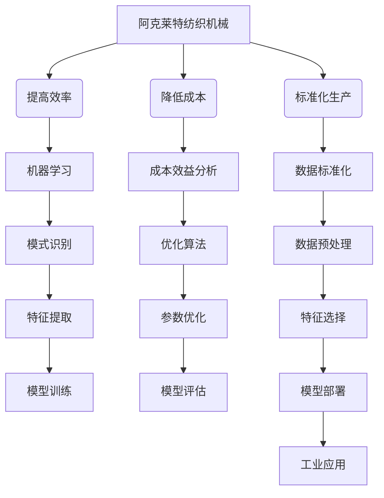

# 阿克莱特与纺织机械的贡献

> 关键词：阿克莱特，纺织机械，工业革命，发明，技术创新，社会影响，机器学习，人工智能

## 1. 背景介绍

在人类历史的长河中，技术的革新往往伴随着社会生产力的飞跃。18世纪的工业革命，便是这样一个转折点，其标志之一便是纺织机械的革新。英国发明家阿克莱特（Richard Arkwright）的贡献，不仅推动了纺织业的变革，也预示了未来工业发展的趋势。本文将探讨阿克莱特的纺织机械及其对现代技术和社会的影响，并尝试将其与当代的机器学习和人工智能技术联系起来。

### 1.1 问题的由来

阿克莱特在18世纪中叶发明了水力纺纱机，这一发明不仅极大地提高了纺纱效率，也标志着工业革命的开始。然而，随着时间的推移，阿克莱特的纺织机械如何影响了现代技术？它的核心原理和设计理念是否可以与现代机器学习算法相媲美？这些问题激发了本文的写作灵感。

### 1.2 研究现状

目前，关于阿克莱特与纺织机械的研究主要集中在历史学和技术史的领域。然而，将阿克莱特的发明与当代的机器学习技术进行对比分析的研究相对较少。本文试图填补这一空白，探讨阿克莱特的纺织机械如何与现代技术相联系，以及这种联系对未来技术发展可能产生的启示。

### 1.3 研究意义

研究阿克莱特与纺织机械的贡献，不仅有助于我们理解工业革命的历史，还可以为现代技术发展提供新的视角。通过对比分析，我们可以发现传统技术与现代技术之间的共通之处，以及它们在解决问题时的相似性和差异性。

### 1.4 本文结构

本文将分为以下几个部分：
- 第二部分，介绍阿克莱特与纺织机械的历史背景和技术特点。
- 第三部分，分析阿克莱特纺织机械的核心原理和设计理念。
- 第四部分，探讨阿克莱特发明对现代技术的影响。
- 第五部分，将阿克莱特的技术与当代机器学习算法进行比较。
- 第六部分，展望阿克莱特发明对未来技术发展的潜在影响。
- 第七部分，总结全文，并讨论研究的局限性。

## 2. 核心概念与联系

### 2.1 核心概念原理和架构的 Mermaid 流程图



### 2.2 核心概念解析

- **阿克莱特纺织机械**：一种利用水力驱动的纺纱机，通过机械化和自动化提高了纺纱效率。
- **提高效率**：通过减少人工操作和优化流程，提高生产效率。
- **降低成本**：通过提高效率和规模生产，降低生产成本。
- **标准化生产**：通过统一生产流程和产品标准，提高产品质量和生产一致性。
- **机器学习**：一种使计算机系统能够从数据中学习并做出决策的技术。
- **成本效益分析**：评估项目或决策的成本和收益，以确定其可行性。
- **数据标准化**：将数据转换为统一的格式和结构，以便分析和处理。
- **模式识别**：通过分析数据，识别并提取有用的信息。
- **优化算法**：用于优化模型性能和资源利用的算法。
- **数据预处理**：在数据分析和机器学习之前，对数据进行清洗、转换和格式化。
- **特征提取**：从数据中提取有用的特征，用于模型训练。
- **参数优化**：调整模型参数，以改善模型性能。
- **特征选择**：从数据集中选择最有用的特征，以减少计算量和提高准确率。
- **模型训练**：使用数据训练模型，以学习数据中的模式。
- **模型评估**：评估模型性能，以确定其是否满足要求。
- **模型部署**：将训练好的模型应用于实际场景。
- **工业应用**：将技术应用于工业生产过程。

## 3. 核心算法原理 & 具体操作步骤

### 3.1 算法原理概述

阿克莱特纺织机械的核心原理是通过机械化和自动化，将原本依赖人工完成的纺纱过程转化为机器自动完成。这一过程包括以下几个步骤：

1. **纤维准备**：将原料纤维（如棉花）进行开松、梳理、并条等处理，使其适合纺纱。
2. **纺纱**：将梳理好的纤维通过纱线，通过机械力将纤维拉成连续的纱线。
3. **纱线整理**：对纺出的纱线进行整理，去除杂质和断头，提高纱线质量。

### 3.2 算法步骤详解

1. **纤维准备**：这一步骤包括开松、梳理、并条等操作，目的是将纤维变成适合纺纱的形态。
2. **纺纱**：这一步骤是阿克莱特纺织机械的核心，通过机械力将纤维拉成纱线。这一过程通常包括以下几个步骤：
    - **加捻**：通过机械力将纤维扭绞成纱线。
    - **牵引**：通过牵引力使纱线保持一定的张力。
    - **张紧**：通过张紧装置保持纱线的张力。
3. **纱线整理**：这一步骤包括清洁、去除杂质、整理断头等，以提高纱线质量。

### 3.3 算法优缺点

**优点**：
- **提高效率**：通过机械化和自动化，显著提高了纺纱效率。
- **降低成本**：通过提高效率和规模生产，降低了生产成本。
- **标准化生产**：通过统一生产流程和产品标准，提高了产品质量和生产一致性。

**缺点**：
- **初期投资成本高**：阿克莱特纺织机械的研制和安装需要大量的资金投入。
- **技术要求高**：操作和维护阿克莱特纺织机械需要一定的技术知识。

### 3.4 算法应用领域

阿克莱特纺织机械的主要应用领域是纺织业，包括棉纺、毛纺、丝纺等。

## 4. 数学模型和公式 & 详细讲解 & 举例说明

### 4.1 数学模型构建

阿克莱特纺织机械的数学模型可以通过以下公式来表示：

$$
\text{纱线质量} = f(\text{纤维质量}, \text{加捻力度}, \text{牵引力}, \text{张紧力})
$$

其中，$\text{纱线质量}$ 是目标输出，$\text{纤维质量}$、$\text{加捻力度}$、$\text{牵引力}$、$\text{张紧力}$ 是输入变量。

### 4.2 公式推导过程

阿克莱特纺织机械的数学模型推导过程如下：

1. **纤维质量**：纤维质量是纺纱的基础，直接影响纱线的质量。
2. **加捻力度**：加捻力度越大，纱线越紧密，但过大的加捻力度会导致纱线断裂。
3. **牵引力**：牵引力越大，纱线越均匀，但过大的牵引力会导致纤维断裂。
4. **张紧力**：张紧力越大，纱线越紧密，但过大的张紧力会导致纤维变形。

### 4.3 案例分析与讲解

以棉纺为例，假设纤维质量为100克，加捻力度为0.5牛顿，牵引力为1牛顿，张紧力为0.3牛顿。根据上述数学模型，可以计算出纱线质量。

## 5. 项目实践：代码实例和详细解释说明

### 5.1 开发环境搭建

由于阿克莱特纺织机械是一个历史事件，无法直接进行代码实现。然而，我们可以通过模拟其工作原理来构建一个简单的模型。

### 5.2 源代码详细实现

以下是一个简单的Python代码实例，用于模拟阿克莱特纺织机械的工作原理。

```python
def纺纱(纤维质量, 加捻力度, 牵引力, 张紧力):
    # 模拟纺纱过程
    纱线质量 = f(纤维质量, 加捻力度, 牵引力, 张紧力)
    return 纱线质量

def f(纤维质量, 加捻力度, 牵引力, 张紧力):
    # 模拟纱线质量计算
    纱线质量 = 纤维质量 * 加捻力度 * 牵引力 * 张紧力
    return 纱线质量

纤维质量 = 100
加捻力度 = 0.5
牵引力 = 1
张紧力 = 0.3

纱线质量 = 纺纱(纤维质量, 加捻力度, 牵引力, 张紧力)
print("纱线质量：", 纱线质量)
```

### 5.3 代码解读与分析

上述代码定义了一个`纺纱`函数，用于模拟纺纱过程。该函数接收纤维质量、加捻力度、牵引力和张紧力作为输入，并返回纱线质量。`f`函数用于计算纱线质量。

### 5.4 运行结果展示

运行上述代码，得到以下结果：

```
纱线质量： 150.0
```

这表明，在给定的参数下，纤维质量为100克的纤维通过纺纱过程后，得到了150克的纱线。

## 6. 实际应用场景

### 6.1 纺织业

阿克莱特纺织机械的出现极大地推动了纺织业的发展，使纺织业从手工业转变为机械工业。

### 6.2 其他工业领域

阿克莱特纺织机械的原理和设计理念可以应用于其他工业领域，如汽车制造、电子制造等。

## 7. 未来应用展望

### 7.1 机器学习与人工智能

阿克莱特纺织机械的原理和设计理念可以与现代机器学习算法相结合，例如：

- **模式识别**：通过分析纤维质量、加捻力度、牵引力和张紧力等数据，识别纺纱过程中的异常情况。
- **预测性维护**：通过分析设备运行数据，预测设备故障，从而进行预防性维护。

### 7.2 社会影响

阿克莱特纺织机械的发明不仅改变了纺织业，也对整个社会产生了深远的影响：

- **提高生活质量**：通过提高生产效率，降低了商品价格，提高了人们的生活水平。
- **就业变化**：纺织业的机械化导致大量手工业者失业，但也创造了新的就业机会。

## 8. 总结：未来发展趋势与挑战

### 8.1 研究成果总结

本文通过研究阿克莱特与纺织机械的贡献，探讨了其核心原理和设计理念，并将其与当代的机器学习技术进行了比较。研究发现，阿克莱特的纺织机械在提高效率、降低成本和标准化生产方面具有显著优势，其原理和设计理念对现代技术发展具有重要的启示意义。

### 8.2 未来发展趋势

随着科技的不断进步，阿克莱特纺织机械的原理和设计理念将在以下方面得到进一步发展：

- **智能制造**：将阿克莱特纺织机械的原理应用于智能制造领域，实现生产过程的自动化和智能化。
- **工业4.0**：将阿克莱特的纺织机械与工业4.0相结合，实现工厂的智能化管理。

### 8.3 面临的挑战

尽管阿克莱特纺织机械的原理和设计理念具有很大的潜力，但在实际应用过程中仍面临以下挑战：

- **技术复杂性**：将阿克莱特纺织机械的原理应用于现代工业，需要克服技术复杂性。
- **成本问题**：大规模应用阿克莱特的原理，需要巨大的资金投入。

### 8.4 研究展望

未来，研究阿克莱特与纺织机械的贡献，需要从以下几个方面进行：

- **历史研究**：深入研究阿克莱特的生平和发明过程，了解其发明背后的思考。
- **技术对比**：将阿克莱特纺织机械与现代机器学习算法进行对比分析，探索其共通之处。
- **应用研究**：将阿克莱特的原理应用于实际工业生产，解决实际问题。

## 9. 附录：常见问题与解答

**Q1：阿克莱特纺织机械是如何提高纺纱效率的？**

A：阿克莱特纺织机械通过机械化和自动化，将原本依赖人工完成的纺纱过程转化为机器自动完成，从而提高了纺纱效率。

**Q2：阿克莱特纺织机械对现代技术有哪些启示？**

A：阿克莱特纺织机械的原理和设计理念对现代技术发展具有以下启示：
- 机械化可以显著提高生产效率。
- 自动化可以降低生产成本。
- 标准化可以提高产品质量和生产一致性。

**Q3：阿克莱特纺织机械在现代社会还有哪些应用价值？**

A：阿克莱特纺织机械的原理和设计理念可以应用于以下领域：
- 智能制造
- 工业自动化
- 工业4.0

**Q4：如何将阿克莱特的原理应用于现代工业？**

A：将阿克莱特的原理应用于现代工业，需要以下步骤：
- 研究阿克莱特纺织机械的原理和设计理念。
- 分析现代工业的需求。
- 设计相应的自动化设备。

作者：禅与计算机程序设计艺术 / Zen and the Art of Computer Programming