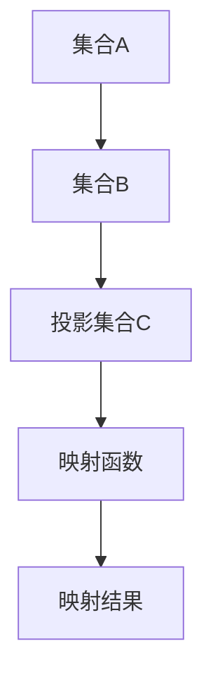

# 集合论导引：投影集合精细分层

> 关键词：集合论，投影，集合操作，分层，数学基础，抽象思维，计算机科学

## 1. 背景介绍

集合论是现代数学的基石，它为我们提供了一种抽象的思维方式，用于处理复杂系统的组织结构和关系。在计算机科学中，集合论的概念被广泛应用于数据结构、算法设计、软件工程等领域。本文将深入探讨集合论中的一个重要概念——投影集合，并探讨如何通过精细分层来提高集合操作的性能和效率。

### 1.1 集合论的基本概念

集合论起源于古希腊，由康托尔等数学家在19世纪末创立。它通过抽象的符号和严格的逻辑推理，研究对象的集合以及集合之间的各种关系。

- **集合**：由确定性的、互不相同的元素组成的整体。
- **元素**：集合的组成部分。
- **集合操作**：并集、交集、差集、补集等。

### 1.2 投影集合的概念

投影集合是一种特殊的集合操作，它将一个集合中的元素映射到另一个集合中。这种映射关系在计算机科学中有着广泛的应用，例如在数据库查询、图像处理、机器学习中。

## 2. 核心概念与联系

### 2.1 核心概念原理和架构的 Mermaid 流程图



在这个流程图中，集合A和集合B通过映射函数D进行映射，得到投影集合C。

### 2.2 投影集合的操作

- **一对一映射**：每个元素在集合A中有一个唯一的对应元素在集合B中。
- **多对一映射**：多个元素在集合A中映射到集合B中的同一个元素。
- **多对多映射**：多个元素在集合A中映射到集合B中的多个元素。

### 2.3 投影集合的应用

- **数据库查询**：在数据库中，投影操作用于从原始表中提取特定的列，形成新的表。
- **图像处理**：在图像处理中，投影操作用于提取图像的边缘或特征。
- **机器学习**：在机器学习中，投影操作用于降维或特征提取。

## 3. 核心算法原理 & 具体操作步骤

### 3.1 算法原理概述

投影集合的算法原理相对简单，主要是通过映射函数将一个集合中的元素映射到另一个集合中。关键在于设计高效的映射函数，以减少计算量和提高效率。

### 3.2 算法步骤详解

1. 定义映射函数：根据具体的应用场景，设计合适的映射函数。
2. 映射集合元素：将集合A中的每个元素映射到集合B中。
3. 形成投影集合：将映射后的元素组合成新的投影集合C。

### 3.3 算法优缺点

**优点**：

- 简单易懂：算法原理简单，易于实现。
- 效率高：对于简单的映射函数，计算效率较高。

**缺点**：

- 设计映射函数需要一定的技巧和经验。
- 对于复杂的映射关系，算法效率可能较低。

### 3.4 算法应用领域

- 数据库管理：数据库查询、数据转换等。
- 计算机图形学：图像处理、计算机视觉等。
- 机器学习：特征提取、降维等。

## 4. 数学模型和公式 & 详细讲解 & 举例说明

### 4.1 数学模型构建

投影集合的数学模型可以用以下公式表示：

$$
C = f(A)
$$

其中，$C$ 是投影集合，$A$ 是原始集合，$f$ 是映射函数。

### 4.2 公式推导过程

以数据库查询为例，假设我们有一个原始表 $R$，包含多个列，我们想要查询某个特定列的值。我们可以使用以下公式表示投影操作：

$$
R_{\alpha} = \{t_{\alpha} \in R | \alpha(t_{\alpha}) = \alpha_0\}
$$

其中，$R_{\alpha}$ 是投影后的表，$t_{\alpha}$ 是 $R$ 中的行，$\alpha$ 是查询的列，$\alpha_0$ 是查询的值。

### 4.3 案例分析与讲解

假设我们有一个包含学生信息的表 $S$，包含以下列：

- ID：学生的唯一标识符。
- Name：学生的姓名。
- Age：学生的年龄。
- Grade：学生的成绩。

我们想要查询所有年龄大于 18 岁的学生信息。我们可以使用以下SQL语句进行查询：

```sql
SELECT * FROM S WHERE Age > 18;
```

这个查询语句实际上就是一个投影操作，它将 $S$ 表中的行映射到年龄大于 18 岁的行，形成新的投影集合 $S_{Age}$。

## 5. 项目实践：代码实例和详细解释说明

### 5.1 开发环境搭建

为了进行投影集合的实践，我们需要以下开发环境：

- Python 3.8 或更高版本
- NumPy 库
- Matplotlib 库

### 5.2 源代码详细实现

以下是一个使用 Python 实现投影集合的简单示例：

```python
import numpy as np
import matplotlib.pyplot as plt

# 创建一个包含学生信息的列表
students = [
    {'ID': 1, 'Name': 'Alice', 'Age': 20, 'Grade': 85},
    {'ID': 2, 'Name': 'Bob', 'Age': 22, 'Grade': 90},
    {'ID': 3, 'Name': 'Charlie', 'Age': 17, 'Grade': 78},
    {'ID': 4, 'Name': 'David', 'Age': 19, 'Grade': 92},
]

# 定义一个函数，用于根据年龄进行投影
def project_by_age(students, age_threshold):
    return [student for student in students if student['Age'] > age_threshold]

# 创建一个投影集合
age_filtered_students = project_by_age(students, 18)

# 绘制柱状图
plt.bar([student['Name'] for student in age_filtered_students], [student['Grade'] for student in age_filtered_students])
plt.xlabel('Student')
plt.ylabel('Grade')
plt.title('Students Over 18 Years Old')
plt.show()
```

### 5.3 代码解读与分析

- 我们首先导入了 NumPy 和 Matplotlib 库，用于数据处理和绘图。
- 定义了一个包含学生信息的列表 `students`。
- 定义了一个函数 `project_by_age`，它接受学生列表和一个年龄阈值作为参数，返回一个只包含年龄大于阈值的学生列表。
- 使用 `project_by_age` 函数创建了一个投影集合 `age_filtered_students`。
- 使用 Matplotlib 绘制了一个柱状图，展示了年龄大于 18 岁的学生及其成绩。

### 5.4 运行结果展示

运行上述代码将生成一个柱状图，显示了年龄大于 18 岁的学生的姓名和成绩。

## 6. 实际应用场景

### 6.1 数据库查询

在数据库中，投影集合操作用于提取表中的特定列，形成新的视图或表。例如，我们可以使用 SQL 的 SELECT 语句进行投影操作。

### 6.2 图像处理

在图像处理中，投影集合操作用于提取图像的边缘或特征。例如，我们可以使用边缘检测算法（如 Sobel 算子）提取图像的边缘。

### 6.3 机器学习

在机器学习中，投影集合操作用于降维或特征提取。例如，我们可以使用主成分分析（PCA）进行特征提取，将高维数据投影到低维空间。

## 7. 工具和资源推荐

### 7.1 学习资源推荐

- 《离散数学及其应用》
- 《数据结构与算法分析》
- 《数据库系统概念》

### 7.2 开发工具推荐

- Python
- NumPy
- Matplotlib

### 7.3 相关论文推荐

- "Principles of Database Systems"
- "Computer Vision: Algorithms and Applications"
- "Pattern Recognition and Machine Learning"

## 8. 总结：未来发展趋势与挑战

### 8.1 研究成果总结

本文介绍了集合论中的投影集合概念，并探讨了如何通过精细分层来提高集合操作的性能和效率。通过实际案例和代码实例，展示了投影集合在数据库查询、图像处理、机器学习等领域的应用。

### 8.2 未来发展趋势

随着计算机科学和数学的不断发展，投影集合的概念将会在更多领域得到应用。未来，研究重点可能包括：

- 开发更高效的投影集合算法。
- 将投影集合应用于更复杂的系统，如神经网络、大数据分析等。
- 研究投影集合的数学理论，探索其更广泛的应用。

### 8.3 面临的挑战

- 设计高效的映射函数。
- 处理大规模数据集。
- 保证投影集合操作的可扩展性。

### 8.4 研究展望

投影集合作为集合论中的一个基本概念，将在计算机科学和数学领域发挥重要作用。未来，随着研究的不断深入，投影集合的概念将会得到更广泛的应用，并为解决实际问题提供新的思路和方法。

## 9. 附录：常见问题与解答

**Q1：投影集合和映射集合有什么区别？**

A1：投影集合和映射集合的概念类似，都涉及到将一个集合的元素映射到另一个集合中。但是，投影集合更强调映射结果是一个新的集合，而映射集合更强调映射过程本身。

**Q2：投影集合操作有什么应用场景？**

A2：投影集合操作广泛应用于数据库查询、图像处理、机器学习等领域。

**Q3：如何设计高效的映射函数？**

A3：设计高效的映射函数需要根据具体的应用场景进行考虑。一般而言，需要考虑以下因素：

- 映射函数的复杂性。
- 映射函数的精度。
- 映射函数的鲁棒性。

**Q4：投影集合操作有哪些局限性？**

A4：投影集合操作的局限性主要包括：

- 映射函数的设计难度。
- 大规模数据集的处理效率。
- 可扩展性。

作者：禅与计算机程序设计艺术 / Zen and the Art of Computer Programming