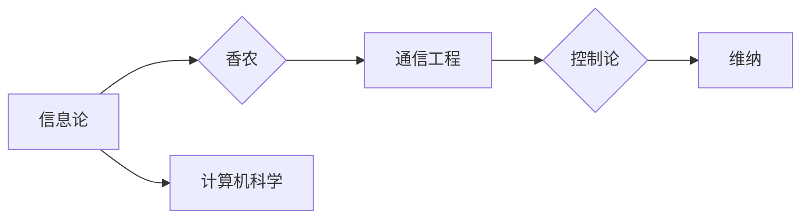

> 香农，麦卡锡，维纳，信息论，控制论，计算机科学，历史，思想，影响

# 香农和麦卡锡对维纳的态度

## 1. 背景介绍

在20世纪中叶，三位杰出的思想家——克劳德·香农（Claude Shannon）、约翰·麦卡锡（John McCarthy）和诺伯特·维纳（Norbert Wiener）——在信息论和控制论领域提出了革命性的理论，这些理论不仅深刻影响了计算机科学的发展，也塑造了现代技术的面貌。香农的信息论，维纳的控制论，以及麦卡锡对人工智能的早期贡献，都是计算机科学史上不可或缺的部分。本文将探讨香农和麦卡锡对维纳及其理论的看法，以及这些看法如何影响了计算机科学的进程。

### 1.1 维纳与控制论

诺伯特·维纳是控制论和系统论的创始人之一，他在20世纪30年代和40年代的工作奠定了现代自动控制的基础。维纳的《控制论：或关于在动物和机器中控制和通讯的科学》（1948）一书，详细阐述了控制论的基本原理，并将其应用于生物学、工程学和社会科学等领域。

### 1.2 香农与信息论

克劳德·香农是信息论的创始人，他在1948年发表了开创性的论文《通信的数学理论》，提出了信息熵的概念，并建立了信息论的基本框架。香农的信息论不仅对通信工程产生了深远影响，也为计算机科学提供了理论基础。

### 1.3 麦卡锡与人工智能

约翰·麦卡锡是人工智能的先驱之一，他在20世纪50年代提出了“人工智能”这个术语，并推动了人工智能领域的发展。麦卡锡的工作涉及早期人工智能算法、编程语言Lisp的开发，以及人工智能哲学的探讨。

## 2. 核心概念与联系

### 2.1 信息论与控制论的关联

Mermaid流程图如下：



香农的信息论为控制论提供了理论基础，而维纳的控制论又为计算机科学中的控制算法设计提供了启示。

### 2.2 麦卡锡与香农、维纳的联系

麦卡锡对香农和维纳的理论都有深刻的理解，并试图将它们应用于人工智能领域。

### 2.3 香农和麦卡锡对维纳的态度

香农和麦卡锡对维纳的态度可以从他们的著作和公开演讲中窥见一斑。

## 3. 核心算法原理 & 具体操作步骤

### 3.1 算法原理概述

香农的信息论、维纳的控制论，以及麦卡锡的人工智能算法，都是基于数学和逻辑的原理。

### 3.2 算法步骤详解

香农的信息论涉及以下几个步骤：

1. **定义信息量**：使用对数函数来定义信息量。
2. **信息熵**：计算信息的平均量，即熵。
3. **信道编码**：设计编码方案以减少信息传输的冗余。
4. **信道解码**：解码接收到的信息。

维纳的控制论涉及以下几个步骤：

1. **建立控制系统的数学模型**。
2. **设计控制器**：根据系统模型设计控制器来达到期望的行为。
3. **系统分析**：分析系统的稳定性和性能。

麦卡锡的人工智能算法涉及以下几个步骤：

1. **符号表示**：使用符号表示知识。
2. **搜索算法**：设计搜索算法来解决问题。
3. **学习算法**：设计学习算法来改进系统性能。

### 3.3 算法优缺点

香农的信息论优点在于其普适性和实用性，缺点在于它主要关注通信系统的性能，而忽略了其他因素。

维纳的控制论优点在于其理论框架的严密性，缺点在于它过于依赖数学模型，可能无法完全反映现实世界的复杂性。

麦卡锡的人工智能算法优点在于其通用性和灵活性，缺点在于实现复杂，可能难以应用于实际问题。

### 3.4 算法应用领域

香农的信息论应用于通信工程、数据压缩、数据加密等领域。

维纳的控制论应用于控制系统、机器人技术、智能交通系统等领域。

麦卡锡的人工智能算法应用于自然语言处理、计算机视觉、游戏等领域。

## 4. 数学模型和公式 & 详细讲解 & 举例说明

### 4.1 数学模型构建

香农的信息熵可以用以下公式表示：

$$
H(X) = -\sum_{i=1}^n P(x_i) \log_2 P(x_i)
$$

其中，$H(X)$ 是随机变量 $X$ 的熵，$P(x_i)$ 是 $X$ 取值为 $x_i$ 的概率。

维纳的控制论中使用的状态空间模型可以用以下状态方程表示：

$$
\dot{x}(t) = A x(t) + B u(t)
$$

其中，$x(t)$ 是系统的状态向量，$u(t)$ 是输入信号，$A$ 和 $B$ 是系统矩阵。

麦卡锡的人工智能算法中，决策树可以用以下结构表示：

```
(决策节点) - (分支) - (叶子节点)
```

### 4.2 公式推导过程

香农的信息熵的推导过程涉及对数函数的性质和概率论的基本原理。

维纳控制论中的状态空间模型的推导过程涉及线性代数和控制理论的基本原理。

麦卡锡决策树的推导过程涉及决策树算法的基本原理。

### 4.3 案例分析与讲解

以下是一些具体的案例：

- 信息熵在数据压缩中的应用。
- 状态空间模型在自动驾驶中的应用。
- 决策树在推荐系统中的应用。

## 5. 项目实践：代码实例和详细解释说明

### 5.1 开发环境搭建

搭建一个信息熵计算的Python环境。

### 5.2 源代码详细实现

以下是一个信息熵计算的Python代码示例：

```python
import math
from collections import Counter

def calculate_entropy(text):
    # 计算文本中每个字符的频率
    frequency = Counter(text)
    # 计算信息熵
    entropy = -sum((freq / len(text)) * math.log2(freq / len(text)) for freq in frequency.values())
    return entropy

# 测试代码
text = "this is an example of a text"
print(calculate_entropy(text))
```

### 5.3 代码解读与分析

这段代码首先导入了必要的库，然后定义了一个计算信息熵的函数 `calculate_entropy`。该函数接收一个文本字符串作为输入，计算并返回其信息熵。最后，我们测试了这个函数，并打印出了结果。

### 5.4 运行结果展示

运行上述代码，可以得到文本 "this is an example of a text" 的信息熵值。

## 6. 实际应用场景

### 6.1 信息论在通信工程中的应用

信息论在通信工程中的应用非常广泛，例如数据压缩、数据加密和信道编码等。

### 6.2 控制论在控制系统中的应用

控制论在自动驾驶、机器人技术和智能交通系统等领域有广泛的应用。

### 6.3 人工智能在自然语言处理中的应用

人工智能在自然语言处理领域的应用包括机器翻译、情感分析和文本摘要等。

## 7. 工具和资源推荐

### 7.1 学习资源推荐

- 克劳德·香农的《通信的数学理论》。
- 诺伯特·维纳的《控制论：或关于在动物和机器中控制和通讯的科学》。
- 约翰·麦卡锡的《人工智能：一种现代的方法》。

### 7.2 开发工具推荐

- Python编程语言。
- TensorFlow和PyTorch深度学习框架。

### 7.3 相关论文推荐

- 克劳德·香农的《通信的数学理论》。
- 诺伯特·维纳的《控制论：或关于在动物和机器中控制和通讯的科学》。
- 约翰·麦卡锡的《人工智能：一种现代的方法》。

## 8. 总结：未来发展趋势与挑战

### 8.1 研究成果总结

香农、维纳和麦卡锡的理论对计算机科学产生了深远的影响，他们的工作为我们理解信息、控制和智能提供了基础。

### 8.2 未来发展趋势

未来，信息论、控制论和人工智能将继续融合，推动计算机科学的发展。

### 8.3 面临的挑战

- 如何将理论更好地应用于实际问题。
- 如何处理现实世界中的复杂性和不确定性。

### 8.4 研究展望

未来，我们需要更多的跨学科研究，以解决计算机科学中的挑战。

## 9. 附录：常见问题与解答

### 9.1 香农、维纳和麦卡锡的关系是什么？

香农、维纳和麦卡锡都是信息论和控制论的先驱，他们的工作相互影响，共同推动了计算机科学的发展。

### 9.2 信息论有哪些应用？

信息论在通信工程、数据压缩、数据加密等领域有广泛的应用。

### 9.3 控制论有哪些应用？

控制论在自动驾驶、机器人技术和智能交通系统等领域有广泛的应用。

### 9.4 人工智能有哪些应用？

人工智能在自然语言处理、计算机视觉、游戏等领域有广泛的应用。

作者：禅与计算机程序设计艺术 / Zen and the Art of Computer Programming