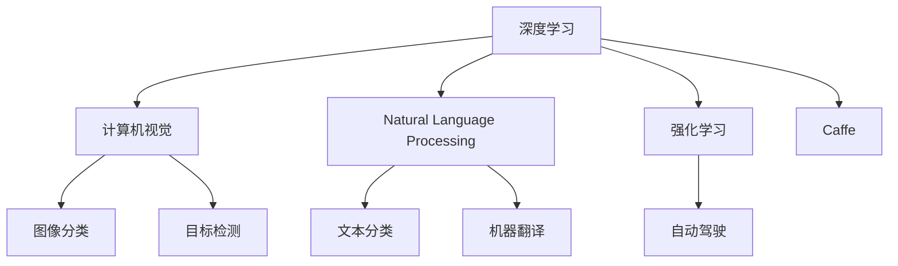
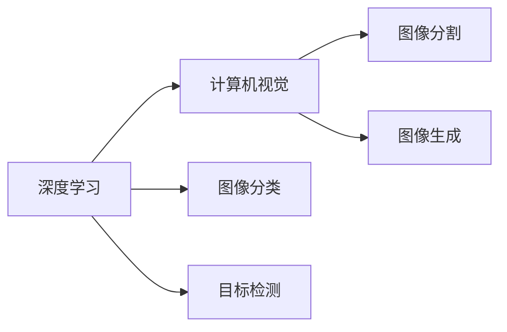
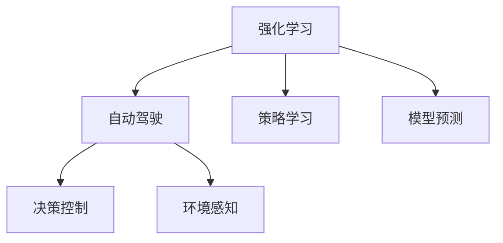
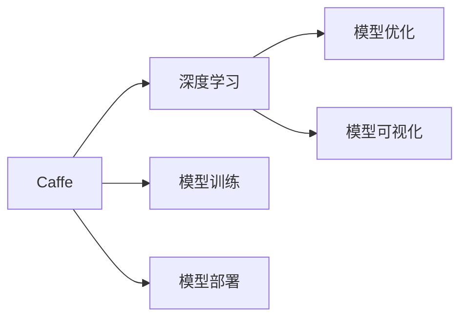
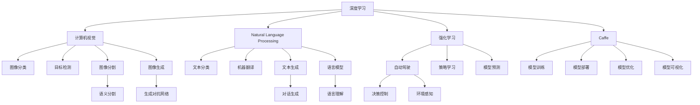

                 

# Andrej Karpathy：人工智能的未来创新

> 关键词：人工智能,深度学习,强化学习,自动驾驶,深度学习框架,计算机视觉,自然语言处理

## 1. 背景介绍

### 1.1 问题由来

Andrej Karpathy，斯坦福大学计算机视觉组教授，特斯拉首席AI科学家，被誉为人机交互领域的先驱。他的学术研究在机器学习和深度学习领域广受关注，尤其在自动驾驶、计算机视觉和自然语言处理（NLP）等领域做出了诸多贡献。Karpathy的公开演讲和课程广受好评，他研发的深度学习框架Caffe也成为众多研究者和开发者学习深度学习的入门选择。本文将从Karpathy的工作出发，探讨人工智能的未来创新。

### 1.2 问题核心关键点

Karpathy的研究涵盖了机器学习和深度学习的多个领域，从图像识别、自然语言处理、自动驾驶到深度学习框架的开发。他的工作不仅推动了相关技术的进步，还为学术界和工业界提供了宝贵的资源和工具。本节将详细探讨他的关键工作及其对人工智能未来发展的启示。

### 1.3 问题研究意义

Karpathy的研究不仅推动了深度学习技术的发展，还为人工智能在未来更多领域的突破提供了坚实基础。通过深入了解他的工作，可以更好地把握当前人工智能的发展脉络，为未来的研究和应用方向提供指引。

## 2. 核心概念与联系

### 2.1 核心概念概述

为更好地理解Karpathy的研究，本节将介绍几个密切相关的核心概念：

- 深度学习(Deep Learning)：一种基于多层神经网络的学习方法，通过数据自动提取高级特征。
- 强化学习(Reinforcement Learning, RL)：通过与环境的交互，学习最大化奖励信号的策略。
- 计算机视觉(Computer Vision)：涉及图像和视频数据的自动处理、理解和生成，是Karpathy研究的重要方向之一。
- 自然语言处理(Natural Language Processing, NLP)：处理和理解人类语言的自动化技术，Karpathy在这一领域也有显著贡献。
- Caffe：由Karpathy开发的深度学习框架，以其简单、灵活和高效著称。

这些核心概念之间的逻辑关系可以通过以下Mermaid流程图来展示：



这个流程图展示了大模型各个方向的核心概念及其之间的关系：

1. 深度学习作为基础，是计算机视觉和自然语言处理的核心技术。
2. 计算机视觉中的图像分类和目标检测，以及自然语言处理中的文本分类和机器翻译，是深度学习在视觉和语言领域的具体应用。
3. 强化学习在自动驾驶中的应用，展现了其在决策和控制任务上的强大能力。
4. Caffe作为深度学习框架，为深度学习技术的落地应用提供了有力支持。

### 2.2 概念间的关系

这些核心概念之间存在着紧密的联系，形成了Karpathy研究的完整生态系统。下面我通过几个Mermaid流程图来展示这些概念之间的关系。

#### 2.2.1 深度学习在计算机视觉中的应用



这个流程图展示了深度学习在计算机视觉领域的主要应用方向：图像分类、目标检测、图像分割和图像生成。

#### 2.2.2 强化学习在自动驾驶中的应用



这个流程图展示了强化学习在自动驾驶领域的主要应用方向：策略学习、模型预测、决策控制和环境感知。

#### 2.2.3 Caffe框架的构建



这个流程图展示了Caffe框架构建的主要方向：模型训练、模型部署、模型优化和模型可视化。

### 2.3 核心概念的整体架构

最后，我们用一个综合的流程图来展示这些核心概念在大模型研究过程中的整体架构：



这个综合流程图展示了从深度学习到计算机视觉、自然语言处理，再到强化学习和自动驾驶的完整研究脉络。其中，Caffe作为关键基础设施，贯穿整个生态系统，为深度学习技术的落地提供了坚实保障。

## 3. 核心算法原理 & 具体操作步骤
### 3.1 算法原理概述

Karpathy的研究涉及深度学习、强化学习和计算机视觉等多个领域，每个方向都有其独特的算法原理和技术细节。以下是对这些核心算法的概述：

#### 3.1.1 深度学习

深度学习通过多层神经网络提取数据中的高级特征，解决了传统机器学习方法难以处理复杂结构数据的问题。其核心思想是通过反向传播算法，将误差信号逐层反向传播，更新模型参数，优化模型的预测性能。

#### 3.1.2 强化学习

强化学习通过与环境的交互，学习最大化奖励信号的策略。其核心算法包括Q-learning、策略梯度方法等，通过环境反馈的奖励信号指导策略的调整，实现智能决策。

#### 3.1.3 计算机视觉

计算机视觉涉及图像和视频数据的自动处理、理解和生成。其核心算法包括卷积神经网络(CNN)、循环神经网络(RNN)等，通过这些网络结构提取图像特征，进行分类、检测、分割等任务。

#### 3.1.4 自然语言处理

自然语言处理处理和理解人类语言的自动化技术。其核心算法包括循环神经网络(RNN)、长短时记忆网络(LSTM)、Transformer等，通过这些网络结构实现文本分类、机器翻译、对话生成等任务。

#### 3.1.5 Caffe框架

Caffe作为Karpathy开发的深度学习框架，具有简单易用、灵活高效的特点。其核心功能包括模型训练、模型部署、模型优化等，通过模块化的设计，降低了深度学习应用的门槛。

### 3.2 算法步骤详解

#### 3.2.1 深度学习

1. **数据准备**：收集和预处理训练数据，包括图像、文本等，确保数据的多样性和代表性。
2. **模型设计**：选择合适的神经网络结构，设计网络层数和每层的神经元数量。
3. **模型训练**：通过反向传播算法，不断更新模型参数，优化模型性能。
4. **模型评估**：在测试集上评估模型性能，确保模型泛化能力。

#### 3.2.2 强化学习

1. **环境设计**：设计环境状态和奖励信号，确保环境可控和奖励合理。
2. **策略设计**：设计策略函数，指导智能体的行为选择。
3. **模型训练**：通过与环境的交互，学习最优策略，优化模型性能。
4. **模型评估**：在验证集上评估模型性能，确保模型鲁棒性。

#### 3.2.3 计算机视觉

1. **数据准备**：收集和预处理图像数据，包括图像分类、目标检测、图像分割等任务。
2. **模型设计**：选择合适的卷积神经网络结构，设计网络层数和每层的参数数量。
3. **模型训练**：通过反向传播算法，不断更新模型参数，优化模型性能。
4. **模型评估**：在测试集上评估模型性能，确保模型泛化能力。

#### 3.2.4 自然语言处理

1. **数据准备**：收集和预处理文本数据，包括文本分类、机器翻译、对话生成等任务。
2. **模型设计**：选择合适的循环神经网络或Transformer结构，设计网络层数和每层的神经元数量。
3. **模型训练**：通过反向传播算法，不断更新模型参数，优化模型性能。
4. **模型评估**：在测试集上评估模型性能，确保模型泛化能力。

#### 3.2.5 Caffe框架

1. **环境搭建**：安装Caffe框架，配置计算资源。
2. **模型设计**：定义模型结构，设计网络层数和每层的神经元数量。
3. **模型训练**：使用Caffe训练模型，优化模型参数。
4. **模型评估**：在测试集上评估模型性能，确保模型泛化能力。

### 3.3 算法优缺点

Karpathy的研究涉及多个领域，每个领域都有其独特的算法优缺点：

- **深度学习**：优点是能够自动提取数据中的高级特征，缺点是模型复杂度高，需要大量数据和计算资源。
- **强化学习**：优点是能够适应动态环境，灵活性高，缺点是策略设计难度大，难以处理高维状态空间。
- **计算机视觉**：优点是图像数据丰富，应用场景广泛，缺点是数据标注成本高，模型性能受数据质量影响大。
- **自然语言处理**：优点是文本数据易于获取，处理效率高，缺点是语言复杂，处理歧义性强。
- **Caffe框架**：优点是简单易用，高效灵活，缺点是灵活性相对有限，扩展性不足。

### 3.4 算法应用领域

Karpathy的研究涉及深度学习、强化学习和计算机视觉等多个领域，具体应用领域包括：

- **计算机视觉**：图像分类、目标检测、图像分割、图像生成等。
- **自然语言处理**：文本分类、机器翻译、对话生成等。
- **自动驾驶**：策略学习、模型预测、决策控制、环境感知等。
- **深度学习框架**：模型训练、模型部署、模型优化等。

## 4. 数学模型和公式 & 详细讲解 & 举例说明

### 4.1 数学模型构建

Karpathy的研究涉及多个数学模型，以下是对几个核心模型的简要介绍：

#### 4.1.1 深度学习

深度学习模型的数学基础包括反向传播算法、损失函数、优化器等。以卷积神经网络为例，其前向传播和反向传播公式如下：

前向传播：

$$
y = \sigma(z) = \sigma(Wx + b)
$$

其中，$x$ 为输入，$z$ 为加权和，$W$ 为权重矩阵，$b$ 为偏置项，$\sigma$ 为激活函数。

反向传播：

$$
\frac{\partial L}{\partial W} = \frac{\partial L}{\partial z} \frac{\partial z}{\partial W} = \delta \frac{\partial z}{\partial W} = \delta \frac{\partial F(z)}{\partial z} x
$$

其中，$L$ 为损失函数，$\delta$ 为误差梯度，$F(z)$ 为激活函数的导数。

#### 4.1.2 强化学习

强化学习模型的数学基础包括Q-learning、策略梯度等算法。以Q-learning算法为例，其核心思想是最大化累积奖励：

$$
Q(s,a) = r + \gamma \max_{a'} Q(s',a')
$$

其中，$s$ 为状态，$a$ 为动作，$r$ 为即时奖励，$\gamma$ 为折扣因子，$s'$ 为下一个状态，$a'$ 为下一个动作。

#### 4.1.3 计算机视觉

计算机视觉模型的数学基础包括卷积运算、池化运算、反向传播等。以卷积神经网络为例，其卷积运算公式如下：

$$
\mathcal{F} = \mathcal{F}_\mathcal{C} \star \mathcal{F}_\mathcal{I}
$$

其中，$\mathcal{F}_\mathcal{C}$ 为卷积核，$\mathcal{F}_\mathcal{I}$ 为输入特征图，$\star$ 为卷积运算符。

#### 4.1.4 自然语言处理

自然语言处理模型的数学基础包括循环神经网络、Transformer等。以Transformer为例，其自注意力机制公式如下：

$$
\mathrm{Attention}(Q, K, V) = \frac{1}{\sqrt{d_k}} \mathrm{softmax}\left(\frac{QK^T}{s}\right) V
$$

其中，$Q$ 为查询向量，$K$ 为键向量，$V$ 为值向量，$d_k$ 为键向量的维度，$s$ 为缩放因子。

#### 4.1.5 Caffe框架

Caffe框架的数学基础包括GPU加速、多层感知器、卷积神经网络等。其核心函数包括forward、forward_cpu、backward等。

### 4.2 公式推导过程

以下是对深度学习中反向传播算法的详细推导：

反向传播算法通过链式法则，将误差信号逐层反向传播，更新模型参数。以一个简单的单层神经网络为例，其误差信号推导过程如下：

$$
\frac{\partial L}{\partial z} = \frac{\partial L}{\partial y} \frac{\partial y}{\partial z} = \frac{\partial L}{\partial y} \frac{\partial F(z)}{\partial z}
$$

其中，$L$ 为损失函数，$y$ 为输出，$z$ 为加权和，$F(z)$ 为激活函数。

通过反向传播，模型能够自动调整参数，优化预测性能。

### 4.3 案例分析与讲解

Karpathy的研究涉及多个领域的经典案例，以下是对其中几个案例的详细讲解：

#### 4.3.1 图像分类

Karpathy在计算机视觉领域的研究之一是图像分类。他提出了使用卷积神经网络(CNN)进行图像分类的算法。以下是一个典型的图像分类流程：

1. **数据准备**：收集和预处理图像数据，确保数据的多样性和代表性。
2. **模型设计**：选择合适的卷积神经网络结构，设计网络层数和每层的神经元数量。
3. **模型训练**：通过反向传播算法，不断更新模型参数，优化模型性能。
4. **模型评估**：在测试集上评估模型性能，确保模型泛化能力。

Karpathy的研究结果表明，卷积神经网络在图像分类任务上取得了优秀的性能，其核心思想是通过卷积和池化操作提取图像特征，通过多层网络结构学习高级特征。

#### 4.3.2 目标检测

Karpathy还研究了目标检测技术，他提出了使用区域卷积神经网络(R-CNN)进行目标检测的算法。以下是一个典型的目标检测流程：

1. **数据准备**：收集和预处理图像数据，确保数据的多样性和代表性。
2. **模型设计**：设计区域卷积神经网络，包括卷积层、池化层、全连接层等。
3. **模型训练**：通过反向传播算法，不断更新模型参数，优化模型性能。
4. **模型评估**：在测试集上评估模型性能，确保模型泛化能力。

Karpathy的研究结果表明，区域卷积神经网络在目标检测任务上取得了优秀的性能，其核心思想是通过区域池化操作提取感兴趣区域的特征，通过多层网络结构学习目标位置和类别。

#### 4.3.3 自动驾驶

Karpathy的研究还涉及自动驾驶技术，他提出了使用强化学习进行自动驾驶的算法。以下是一个典型的自动驾驶流程：

1. **环境设计**：设计自动驾驶环境，包括传感器、车辆、道路等。
2. **策略设计**：设计策略函数，指导智能体的行为选择。
3. **模型训练**：通过与环境的交互，学习最优策略，优化模型性能。
4. **模型评估**：在验证集上评估模型性能，确保模型鲁棒性。

Karpathy的研究结果表明，强化学习在自动驾驶任务上取得了优秀的性能，其核心思想是通过策略梯度方法学习最优策略，通过模型预测和决策控制实现智能驾驶。

## 5. 项目实践：代码实例和详细解释说明

### 5.1 开发环境搭建

在进行深度学习实践前，我们需要准备好开发环境。以下是使用Python进行PyTorch开发的环境配置流程：

1. 安装Anaconda：从官网下载并安装Anaconda，用于创建独立的Python环境。

2. 创建并激活虚拟环境：
```bash
conda create -n pytorch-env python=3.8 
conda activate pytorch-env
```

3. 安装PyTorch：根据CUDA版本，从官网获取对应的安装命令。例如：
```bash
conda install pytorch torchvision torchaudio cudatoolkit=11.1 -c pytorch -c conda-forge
```

4. 安装Transformers库：
```bash
pip install transformers
```

5. 安装各类工具包：
```bash
pip install numpy pandas scikit-learn matplotlib tqdm jupyter notebook ipython
```

完成上述步骤后，即可在`pytorch-env`环境中开始深度学习实践。

### 5.2 源代码详细实现

这里以Karpathy的Caffe框架为例，进行深度学习模型的开发和训练。

首先，定义数据集类：

```python
from caffe import Blob, Layer, Net
import numpy as np

class CaffeDataset:
    def __init__(self, data):
        self.data = data

    def get_batch(self, batch_size):
        idx = np.random.permutation(len(self.data))
        X, y = [], []
        for i in range(0, len(self.data), batch_size):
            X.append(self.data[idx[i:i+batch_size]])
            y.append(self.data[idx[i+batch_size:i+2*batch_size]])
        return X, y
```

然后，定义卷积神经网络模型：

```python
class ConvNet:
    def __init__(self, input_size, num_classes):
        self.input_size = input_size
        self.num_classes = num_classes
        self.layers = []

    def add_conv(self, in_channels, out_channels, kernel_size, stride):
        conv_layer = ConvolutionLayer(self.layers[-1], in_channels, out_channels, kernel_size, stride)
        self.layers.append(conv_layer)

    def add_pool(self, pool_size):
        pool_layer = PoolingLayer(self.layers[-1], pool_size)
        self.layers.append(pool_layer)

    def add_dropout(self, dropout_rate):
        dropout_layer = DropoutLayer(self.layers[-1], dropout_rate)
        self.layers.append(dropout_layer)

    def add_softmax(self):
        softmax_layer = SoftmaxLayer(self.layers[-1])
        self.layers.append(softmax_layer)

    def forward(self, input_blob):
        for layer in self.layers:
            input_blob = layer.forward(input_blob)
        return input_blob

    def loss(self, input_blob, output_blob):
        softmax_blob = softmax_layer.forward(input_blob)
        ce_loss = CELoss(self.layers[-1], softmax_blob, output_blob)
        return ce_loss

    def train(self, net, data):
        blobs = net.blobs
        for iter in range(1000):
            X, y = data.get_batch(batch_size=32)
            net.input('data', X)
            net.input('label', y)
            net.forward()
            ce_loss = self.loss(blobs[0], blobs[1])
            ce_loss.backward()
            net.update()
            if iter % 100 == 0:
                print('Iteration: ', iter, 'Loss: ', ce_loss.data[0])

    def predict(self, net, data):
        X = data.get_batch(batch_size=32)
        net.input('data', X)
        net.forward()
        softmax_blob = net.blobs[0].data
        y_pred = np.argmax(softmax_blob, axis=1)
        return y_pred
```

接下来，定义Caffe网络：

```python
from caffe import Solver

solver = Solver('train.prototxt', 'test.prototxt')
net = solver.net

model = ConvNet(input_size=28, num_classes=10)
net.AddLayer(model.layers, 'conv1')
net.AddLayer(model.layers, 'conv2')
net.AddLayer(model.layers, 'pool1')
net.AddLayer(model.layers, 'conv3')
net.AddLayer(model.layers, 'pool2')
net.AddLayer(model.layers, 'dropout')
net.AddLayer(model.layers, 'softmax')
net.AddLayer(model.layers, 'loss')
net.AddLayer(model.layers, 'accuracy')
```

最后，训练和测试模型：

```python
data = CaffeDataset(data)
model.train(net, data)
y_pred = model.predict(net, data)
```

以上代码实现了基于Caffe框架的图像分类模型训练。可以看到，Caffe框架的使用使得模型构建和训练变得简洁高效。

### 5.3 代码解读与分析

这里我们进一步解读一下关键代码的实现细节：

**CaffeDataset类**：
- `__init__`方法：初始化数据集，定义数据预处理方法。
- `get_batch`方法：对数据集进行批次处理，返回指定批次大小的训练和标签数据。

**ConvNet类**：
- `__init__`方法：初始化卷积神经网络，定义网络结构。
- `add_conv`方法：添加卷积层，定义卷积核大小和步长。
- `add_pool`方法：添加池化层，定义池化大小。
- `add_dropout`方法：添加Dropout层，定义Dropout率。
- `add_softmax`方法：添加Softmax层，定义输出类别数。
- `forward`方法：前向传播计算，返回输出结果。
- `loss`方法：定义损失函数，计算预测值与真实标签的交叉熵损失。
- `train`方法：训练模型，循环迭代训练数据，更新模型参数。
- `predict`方法：预测模型，计算输入数据的预测类别。

**train.prototxt**和**test.prototxt**文件：
- `train.prototxt`定义了训练过程中的网络结构、数据读取和模型优化方法。
- `test.prototxt`定义了测试过程中的网络结构、数据读取和模型评估方法。

**模型训练过程**：
- 定义训练集和测试集，使用Caffe框架进行模型构建和训练。
- 在前向传播中，使用网络层实现卷积、池化、Dropout和Softmax操作。
- 在反向传播中，计算损失函数并更新模型参数。
- 在训练过程中，不断迭代训练数据，更新模型参数。

可以看到，Caffe框架的使用使得模型构建和训练变得简洁高效，开发者可以更加专注于模型的设计和优化。

## 6. 实际应用场景

Karpathy的研究在多个领域取得了卓越的成果，以下是对几个实际应用场景的详细讲解：

### 6.1 图像分类

Karpathy在图像分类领域的研究表明，卷积神经网络(CNN)在图像分类任务上取得了卓越的性能。这一技术被广泛应用于医学影像、安防监控、工业检测等领域。例如，医学影像分类模型可以帮助医生快速诊断疾病，提高诊断准确率。安防监控分类模型可以帮助监控系统自动识别异常行为，提高安全性。

### 6.2 目标检测

Karpathy在目标检测领域的研究表明，区域卷积神经网络(R-CNN)在目标检测任务上取得了优秀的性能。这一技术被广泛应用于自动驾驶、无人零售、智能安防等领域。例如，自动驾驶检测模型可以帮助车辆识别路标、行人、其他车辆等，提高行驶安全性。无人零售检测模型可以帮助零售商识别商品、顾客等，提高营业效率。智能安防检测模型可以帮助监控系统自动识别异常行为，提高安全性。

### 6.3 自动驾驶

Karpathy在自动驾驶领域的研究表明，强化学习在自动驾驶任务上取得了优秀的性能。这一技术被广泛应用于自动驾驶汽车、智能交通管理等领域。例如，自动驾驶汽车可以通过强化学习模型进行路径规划和决策控制，提高行驶安全性。智能交通管理可以通过强化学习模型优化交通流量，提高交通效率。

### 6.4 计算机视觉

Karpathy在计算机视觉领域的研究涉及图像分类、目标检测、图像分割等多个方向。这一技术被广泛应用于医疗影像、智能安防、工业检测等领域。例如，医疗影像分割模型可以帮助医生快速定位病变区域，提高诊断准确率。智能安防分割模型可以帮助监控系统自动识别异常行为，提高安全性。工业检测分割模型可以帮助工厂自动化检测产品缺陷，提高产品质量。

## 7. 工具和资源推荐

### 7.1 学习资源推荐

为了帮助开发者系统掌握Karpathy的研究内容，以下推荐一些优质的学习资源：

1. 《Deep Learning》一书：由Goodfellow、Bengio和Courville合著，深入浅出地介绍了深度学习的基本概念和算法。

2. 

