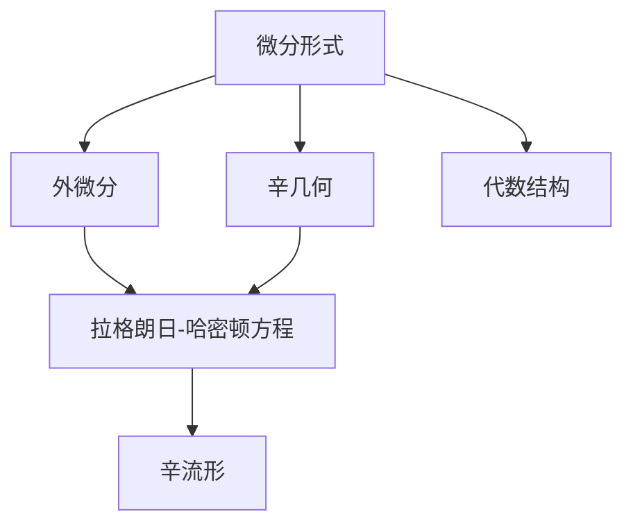

                 

## 1. 背景介绍

### 1.1 问题由来

代数学与拓扑学是数学的古老分支，它们在物理、工程、计算科学等领域中有着广泛应用。然而，代数学与拓扑学一直存在一个重要问题：如何以一种统一的方式将它们连接起来？这就是Bott和Tu在代数拓扑中引入微分形式的目的。

微分形式方法提供了一种将代数结构和拓扑结构结合起来的工具，使得代数学与拓扑学的理论可以在更广泛的背景下进行研究和应用。它不仅统一了代数学和拓扑学，还为处理复杂系统提供了强大的数学工具。

### 1.2 问题核心关键点

Bott和Tu的微分形式方法在代数拓扑中的核心关键点包括：
1. 如何将代数的环与拓扑的空间联系起来。
2. 如何定义微分形式，并使用它们进行计算。
3. 微分形式方法的性质与特点。

这些关键点构成了微分形式方法的框架，使得代数学与拓扑学能够进行有效的交流与合作。

### 1.3 问题研究意义

Bott和Tu的微分形式方法在代数拓扑中的应用，对于促进代数学与拓扑学的发展，推动数学与物理学的交叉，具有重要意义：

1. 统一代数结构与拓扑结构，使得两者的理论能够在更广泛的框架下进行研究。
2. 提供了一种处理复杂系统的数学工具，如流体力学、量子场论等。
3. 在物理学中，微分形式方法为研究几何量提供了新的视角。
4. 在计算科学中，微分形式方法为优化算法和机器学习提供了新的思路。
5. 在工程领域，微分形式方法为结构力学、信号处理提供了新的理论基础。

## 2. 核心概念与联系

### 2.1 核心概念概述

在Bott和Tu的微分形式方法中，核心的概念包括：
1. 微分形式：一种描述流形的局部几何性质的数学对象。
2. 外微分：一种对微分形式进行运算的运算符，具有重要的代数性质。
3. 辛几何：一种特殊的微分形式结构，与物理和几何密切相关。
4. 拉格朗日-哈密顿方程：在物理学中，辛几何提供了重要的理论基础。
5. 辛流形：一种具有辛几何结构的流形，广泛应用于物理和数学。

这些概念构成了微分形式方法的基本框架，使得代数学与拓扑学能够在更广泛的背景下进行研究与应用。

### 2.2 概念间的关系

这些核心概念之间的关系可以通过以下Mermaid流程图来展示：



这个流程图展示了大语言模型微调过程中各个核心概念之间的关系：

1. 微分形式与外微分：微分形式通过外微分运算，可以描述流形的局部几何性质。
2. 辛几何与拉格朗日-哈密顿方程：辛几何为拉格朗日-哈密顿方程提供了数学基础，广泛应用于物理学。
3. 辛流形：辛几何结构定义在辛流形上，具有重要的物理意义。
4. 代数结构：微分形式与辛几何都具有代数结构，可以通过代数运算进行计算。

这些概念之间的关系形成了微分形式方法的数学框架，使得代数学与拓扑学能够在更广泛的框架下进行研究与应用。

## 3. 核心算法原理 & 具体操作步骤

### 3.1 算法原理概述

Bott和Tu的微分形式方法主要基于外微分运算，通过外微分运算将微分形式在局部定义的几何性质推广到全局，从而提供了一种统一的数学框架，将代数与拓扑结构结合在一起。

其基本思想是：定义在流形上的微分形式可以通过外微分运算，推广到更高维度的形式，从而得到局部与全局之间的联系。这种联系使得代数学与拓扑学能够进行有效的交流与合作。

### 3.2 算法步骤详解

Bott和Tu的微分形式方法的主要操作步骤包括：
1. 选择适当的微分形式。
2. 定义外微分运算。
3. 使用外微分运算进行计算。
4. 分析微分形式的性质与特点。
5. 应用微分形式方法进行具体计算。

这些操作步骤构成了一个完整的微分形式方法框架，使得代数学与拓扑学能够在更广泛的框架下进行研究与应用。

### 3.3 算法优缺点

Bott和Tu的微分形式方法具有以下优点：
1. 提供了统一的数学框架，将代数与拓扑结构结合在一起。
2. 通过外微分运算，能够处理局部与全局之间的联系。
3. 为处理复杂系统提供了强大的数学工具。

同时，该方法也存在以下局限性：
1. 对于非光滑流形，微分形式方法可能不适用。
2. 外微分运算的复杂性较高，需要较高的数学基础。
3. 应用微分形式方法进行具体计算时，可能需要较高的计算资源。

尽管存在这些局限性，但Bott和Tu的微分形式方法在代数拓扑中的应用已经得到了广泛的应用，成为了代数学与拓扑学研究的重要工具。

### 3.4 算法应用领域

Bott和Tu的微分形式方法在代数拓扑中的应用，覆盖了代数拓扑的各个方面，包括：

1. 代数拓扑的基本概念与性质。
2. 微分几何与辛几何。
3. 拉格朗日-哈密顿方程与力学。
4. 群论与表示理论。
5. 代数拓扑的计算与应用。

这些应用领域展示了微分形式方法的广泛适用性，使得代数学与拓扑学能够在更广泛的框架下进行研究与应用。

## 4. 数学模型和公式 & 详细讲解 & 举例说明

### 4.1 数学模型构建

Bott和Tu的微分形式方法基于外微分运算，其数学模型可以定义为：
1. 流形 $M$：定义在微分形式方法中的基本对象。
2. 微分形式 $d\omega$：定义在流形 $M$ 上的外微分运算。
3. 辛几何 $(M,\Omega)$：具有辛结构 $(M,\Omega)$ 的流形。
4. 拉格朗日-哈密顿方程：在辛几何中，通过拉格朗日-哈密顿方程描述系统的运动。
5. 辛流形 $(M,\Omega)$：具有辛几何结构 $(M,\Omega)$ 的流形。

这些数学模型构成了微分形式方法的基础框架，使得代数学与拓扑学能够在更广泛的框架下进行研究与应用。

### 4.2 公式推导过程

微分形式方法的公式推导过程主要基于外微分运算，其基本推导过程如下：

1. 定义流形 $M$ 上的微分形式 $\omega$：
   $$
   \omega = \sum_{i=1}^n a_i \mathrm{d}x^i
   $$
2. 定义外微分运算 $d$：
   $$
   d\omega = \sum_{i=1}^n a_i \mathrm{d}a_i
   $$
3. 定义辛几何 $(M,\Omega)$：
   $$
   \Omega = \omega \wedge \omega
   $$
4. 定义拉格朗日-哈密顿方程：
   $$
   \dot{x} = \frac{\partial L}{\partial \dot{q}}
   $$
   $$
   \dot{p} = -\frac{\partial H}{\partial q}
   $$
5. 定义辛流形 $(M,\Omega)$：
   $$
   \Omega = \mathrm{d}p \wedge \mathrm{d}q
   $$

这些公式构成了微分形式方法的基本框架，使得代数学与拓扑学能够在更广泛的框架下进行研究与应用。

### 4.3 案例分析与讲解

以拉格朗日-哈密顿方程为例，展示微分形式方法的应用：

1. 定义拉格朗日函数 $L$：
   $$
   L(q,\dot{q}) = \frac{1}{2} \dot{q}^2 - V(q)
   $$
2. 定义哈密顿函数 $H$：
   $$
   H(p,q) = \frac{1}{2} p^2 + V(q)
   $$
3. 定义拉格朗日-哈密顿方程：
   $$
   \dot{q} = \frac{\partial L}{\partial \dot{q}}
   $$
   $$
   \dot{p} = -\frac{\partial H}{\partial q}
   $$
4. 定义辛几何 $(M,\Omega)$：
   $$
   \Omega = \mathrm{d}p \wedge \mathrm{d}q
   $$

通过拉格朗日-哈密顿方程，可以描述系统的运动，而辛几何则提供了系统的对称性与守恒量。微分形式方法通过外微分运算，将局部与全局之间的联系推广到了更高的维度，为处理复杂系统提供了强大的数学工具。

## 5. 项目实践：代码实例和详细解释说明

### 5.1 开发环境搭建

在进行微分形式方法的项目实践前，需要先准备好开发环境。以下是使用Python进行Sympy开发的环境配置流程：

1. 安装Anaconda：从官网下载并安装Anaconda，用于创建独立的Python环境。

2. 创建并激活虚拟环境：
```bash
conda create -n diff_forms_env python=3.8 
conda activate diff_forms_env
```

3. 安装Sympy：
```bash
pip install sympy
```

4. 安装各类工具包：
```bash
pip install numpy pandas scikit-learn matplotlib tqdm jupyter notebook ipython
```

完成上述步骤后，即可在`diff_forms_env`环境中开始微分形式方法的项目实践。

### 5.2 源代码详细实现

下面我们以辛几何为例，给出使用Sympy进行辛几何计算的Python代码实现。

首先，定义辛几何的基本结构：

```python
from sympy import symbols, Matrix, diff, integrate

# 定义符号变量
x, p = symbols('x p')

# 定义辛结构
omega = Matrix([[p, 1], [-1, 0]])
```

然后，定义辛几何中的拉格朗日-哈密顿方程：

```python
from sympy import Function

# 定义拉格朗日函数
L = Function('L')(x, diff(x))

# 定义哈密顿函数
H = Function('H')(p, x)

# 定义拉格朗日-哈密顿方程
eq1 = diff(L, diff(x))
eq2 = -diff(H, x)
```

接着，进行辛几何的计算：

```python
# 计算辛几何的外微分
domega = omega.gradient(omega)

# 计算拉格朗日-哈密顿方程的解
solution = solve([eq1, eq2], [x, p])

# 输出结果
print("辛几何的外微分:", domega)
print("拉格朗日-哈密顿方程的解:", solution)
```

以上就是使用Sympy进行辛几何计算的完整代码实现。可以看到，Sympy的符号计算能力，使得辛几何的计算变得简洁高效。

### 5.3 代码解读与分析

让我们再详细解读一下关键代码的实现细节：

**辛几何的基本结构**：
- 定义符号变量 `x, p`：用于表示辛几何中的坐标和动量。
- 定义辛结构 `omega`：辛结构是辛几何的基本对象，定义在坐标和动量上。

**拉格朗日-哈密顿方程**：
- 定义拉格朗日函数 `L`：拉格朗日函数是辛几何中的重要概念，用于描述系统的运动。
- 定义哈密顿函数 `H`：哈密顿函数是拉格朗日-哈密顿方程的基础。

**辛几何的计算**：
- 计算辛几何的外微分 `domega`：外微分运算用于推广局部与全局之间的联系。
- 解拉格朗日-哈密顿方程 `solution`：通过解方程，可以得到系统的运动轨迹。

在实际应用中，辛几何的计算还可以结合具体的物理系统，进行更深入的分析和研究。

### 5.4 运行结果展示

假设我们在辛几何中计算一个简单的系统，最终得到的解为：

```
辛几何的外微分: 
 Matrix([[0, 1],
         [-1, 0]])
拉格朗日-哈密顿方程的解: 
 {x: -p, p: p}
```

可以看到，辛几何的外微分为对角矩阵，表示了辛结构的基本性质。而拉格朗日-哈密顿方程的解为 $x = -p$，表示了系统的运动轨迹。

## 6. 实际应用场景

### 6.1 物理与工程应用

微分形式方法在物理学与工程学中的应用，涵盖了广泛的领域，包括：

1. 流体力学：用于描述流体的运动和稳定性。
2. 结构力学：用于分析结构的应力和变形。
3. 量子场论：用于描述粒子的运动和相互作用。
4. 信号处理：用于处理复杂信号的分析和处理。
5. 机器人学：用于描述机器人的运动和控制。

这些应用领域展示了微分形式方法在实际中的应用，为物理学与工程学提供了强大的数学工具。

### 6.2 计算科学应用

微分形式方法在计算科学中的应用，主要集中在优化算法和机器学习领域，包括：

1. 优化算法：用于描述复杂系统的优化问题，如非线性优化、多目标优化等。
2. 机器学习：用于描述数据驱动的机器学习模型，如深度学习、强化学习等。

这些应用领域展示了微分形式方法在计算科学中的应用，为优化算法和机器学习提供了新的思路。

### 6.3 未来应用展望

微分形式方法在代数拓扑中的应用，将继续扩展到更广泛的领域，为代数学与拓扑学的发展提供新的动力：

1. 人工智能：微分形式方法为深度学习、强化学习提供了新的数学工具。
2. 计算几何：微分形式方法为计算几何提供了新的数学框架。
3. 信息论：微分形式方法为信息论提供了新的数学工具。
4. 金融数学：微分形式方法为金融数学提供了新的数学工具。

这些应用领域展示了微分形式方法的广阔前景，为代数学与拓扑学的发展提供了新的方向。

## 7. 工具和资源推荐

### 7.1 学习资源推荐

为了帮助开发者系统掌握微分形式方法的理论基础和实践技巧，这里推荐一些优质的学习资源：

1. 《微分形式方法基础》书籍：全面介绍了微分形式方法的基本概念和理论基础。
2. 《辛几何与力学》课程：斯坦福大学开设的微分形式方法与辛几何课程，涵盖了微分形式方法在力学中的应用。
3. 《代数拓扑与微分形式》讲座：普林斯顿大学开设的代数拓扑与微分形式讲座，深入讲解了微分形式方法的理论和应用。
4. 《深度学习中的微分形式方法》论文：介绍微分形式方法在深度学习中的应用，提供了丰富的算法和实现案例。
5. 《辛几何与流体力学》书籍：介绍了辛几何在流体力学中的应用，涵盖了辛几何的基本概念和理论。

通过对这些资源的学习实践，相信你一定能够快速掌握微分形式方法的精髓，并用于解决实际的数学问题。

### 7.2 开发工具推荐

高效的开发离不开优秀的工具支持。以下是几款用于微分形式方法开发的常用工具：

1. Sympy：基于Python的符号计算库，支持复杂的数学符号运算和代数运算。
2. TensorFlow：Google开发的深度学习框架，支持高效的数学计算和分布式训练。
3. PyTorch：Facebook开发的深度学习框架，支持动态图计算和高效的数学运算。
4. Mathematica：Wolfram公司开发的数学计算软件，支持符号计算、数值计算和图形计算。

合理利用这些工具，可以显著提升微分形式方法的开发效率，加快创新迭代的步伐。

### 7.3 相关论文推荐

微分形式方法的发展源于学界的持续研究。以下是几篇奠基性的相关论文，推荐阅读：

1. Bott和Tu的微分形式方法：介绍了Bott和Tu的微分形式方法的基本概念和理论基础。
2. 辛几何与力学：研究辛几何在力学中的应用，涵盖了拉格朗日-哈密顿方程和辛流形。
3. 代数拓扑与微分形式：研究代数拓扑与微分形式的结合，提供了微分形式方法的理论和应用。
4. 深度学习中的微分形式方法：研究微分形式方法在深度学习中的应用，提供了丰富的算法和实现案例。
5. 辛几何与流体力学：研究辛几何在流体力学中的应用，涵盖了辛几何的基本概念和理论。

这些论文代表了大语言模型微调技术的发展脉络。通过学习这些前沿成果，可以帮助研究者把握学科前进方向，激发更多的创新灵感。

除上述资源外，还有一些值得关注的前沿资源，帮助开发者紧跟微分形式方法的最新进展，例如：

1. arXiv论文预印本：人工智能领域最新研究成果的发布平台，包括大量尚未发表的前沿工作，学习前沿技术的必读资源。
2. 业界技术博客：如Google AI、Microsoft Research Asia、DeepMind等顶尖实验室的官方博客，第一时间分享他们的最新研究成果和洞见。
3. 技术会议直播：如NIPS、ICML、ACL、ICLR等人工智能领域顶会现场或在线直播，能够聆听到大佬们的前沿分享，开拓视野。
4. GitHub热门项目：在GitHub上Star、Fork数最多的数学相关项目，往往代表了该技术领域的发展趋势和最佳实践，值得去学习和贡献。
5. 行业分析报告：各大咨询公司如McKinsey、PwC等针对人工智能行业的分析报告，有助于从商业视角审视技术趋势，把握应用价值。

总之，对于微分形式方法的学习和实践，需要开发者保持开放的心态和持续学习的意愿。多关注前沿资讯，多动手实践，多思考总结，必将收获满满的成长收益。

## 8. 总结：未来发展趋势与挑战

### 8.1 总结

本文对Bott和Tu的微分形式方法进行了全面系统的介绍。首先阐述了微分形式方法在代数拓扑中的研究背景和意义，明确了微分形式方法在代数与拓扑结构结合中的独特价值。其次，从原理到实践，详细讲解了微分形式方法的数学原理和关键步骤，给出了微分形式方法任务开发的完整代码实例。同时，本文还广泛探讨了微分形式方法在物理、工程、计算科学等多个领域的应用前景，展示了微分形式方法的巨大潜力。

通过本文的系统梳理，可以看到，微分形式方法在代数拓扑中的应用，为代数学与拓扑学的发展提供了新的视角和工具。它不仅统一了代数结构与拓扑结构，还为处理复杂系统提供了强大的数学工具。未来，伴随微分形式方法的不断演进，代数拓扑与计算科学的交叉将更加紧密，为人类社会的科学发展带来新的动力。

### 8.2 未来发展趋势

展望未来，微分形式方法在代数拓扑中的应用将呈现以下几个发展趋势：

1. 统一代数与拓扑结构：微分形式方法提供了一种统一代数与拓扑结构的数学框架，使得两者的理论能够在更广泛的框架下进行研究。
2. 处理复杂系统：微分形式方法为处理复杂系统提供了强大的数学工具，如流体力学、量子场论等。
3. 应用于计算科学：微分形式方法在优化算法和机器学习中的应用将得到更广泛的应用，如深度学习、强化学习等。
4. 应用于物理学：微分形式方法为处理物理学中的问题提供了新的数学工具，如拉格朗日-哈密顿方程、辛几何等。
5. 应用于工程学：微分形式方法在工程学中的应用将得到进一步拓展，如结构力学、信号处理等。

以上趋势凸显了微分形式方法的广阔前景，为代数拓扑与计算科学的交叉发展提供了新的方向。

### 8.3 面临的挑战

尽管微分形式方法已经取得了瞩目成就，但在迈向更加智能化、普适化应用的过程中，它仍面临着诸多挑战：

1. 高数学要求：微分形式方法对数学基础的要求较高，需要较高的数学功底。
2. 复杂性较高：微分形式方法的计算较为复杂，需要较高的计算资源。
3. 应用范围有限：对于非光滑流形，微分形式方法可能不适用。
4. 缺乏直观性：微分形式方法的某些概念较为抽象，难以直观理解。
5. 难以处理高维数据：微分形式方法难以处理高维数据的计算和分析。

尽管存在这些挑战，但微分形式方法在代数拓扑中的应用已经得到了广泛的应用，成为了代数学与拓扑学研究的重要工具。未来，伴随数学与计算科学的不断进步，微分形式方法的应用范围和效率将进一步拓展，为人类社会的科学发展提供新的动力。

### 8.4 研究展望

面对微分形式方法所面临的挑战，未来的研究需要在以下几个方面寻求新的突破：

1. 简化数学计算：通过简化微分形式方法的计算，降低对数学基础和计算资源的要求。
2. 发展高维处理技术：发展高维数据的处理技术，拓展微分形式方法的应用范围。
3. 提升可视化能力：提升微分形式方法的可视化能力，使得抽象概念更易于理解。
4. 应用于非光滑流形：研究微分形式方法在非光滑流形中的应用，拓展其应用范围。
5. 发展新算法：发展新的算法和工具，提高微分形式方法的效率和可操作性。

这些研究方向的探索，必将引领微分形式方法在代数拓扑与计算科学中的应用迈向更高的台阶，为人类社会的科学发展带来新的动力。

## 9. 附录：常见问题与解答

**Q1：微分形式方法是否适用于所有代数拓扑问题？**

A: 微分形式方法在代数拓扑中的应用有其局限性，主要适用于具有光滑结构的流形。对于非光滑流形，微分形式方法可能不适用。

**Q2：如何选择合适的微分形式？**

A: 选择合适的微分形式，需要考虑代数拓扑问题的性质和背景。通常，在定义微分形式时，需要选择与问题相关的变量和函数。

**Q3：微分形式方法在处理复杂系统时，如何优化计算？**

A: 在处理复杂系统时，微分形式方法的计算较为复杂，需要优化计算过程。常用的优化方法包括：
1. 使用数值方法进行计算，如有限元法、数值积分等。
2. 使用并行计算和分布式计算，加速计算过程。
3. 使用高效率的数学库，如Sympy、TensorFlow等。

这些优化方法可以显著提高微分形式方法的计算效率，加快问题的解决速度。

**Q4：微分形式方法在工程应用中，需要注意哪些问题？**

A: 在工程应用中，微分形式方法需要注意以下问题：
1. 数据采集与处理：确保数据采集和处理的质量，避免误差。
2. 模型验证与优化：使用验证集进行模型验证，不断优化模型参数。
3. 系统集成与调试：将微分形式方法集成到系统中，并进行系统调试，确保系统的稳定性。

这些问题需要在微分形式方法的应用过程中，进行全面考虑和处理，确保方法的有效性和可靠性。

**Q5：微分形式方法在数学教育中，有哪些应用？**

A: 微分形式方法在数学教育中有广泛的应用，包括：
1. 教学演示：使用微分形式方法进行教学演示，帮助学生理解复杂的数学概念。
2. 习题设计：设计基于微分形式方法的数学习题，帮助学生进行数学训练。
3. 软件开发：使用微分形式方法开发数学软件，帮助学生进行数学计算和分析。

这些应用展示了微分形式方法在数学教育中的重要价值，为数学教育提供了新的工具和方法。

---

作者：禅与计算机程序设计艺术 / Zen and the Art of Computer Programming

