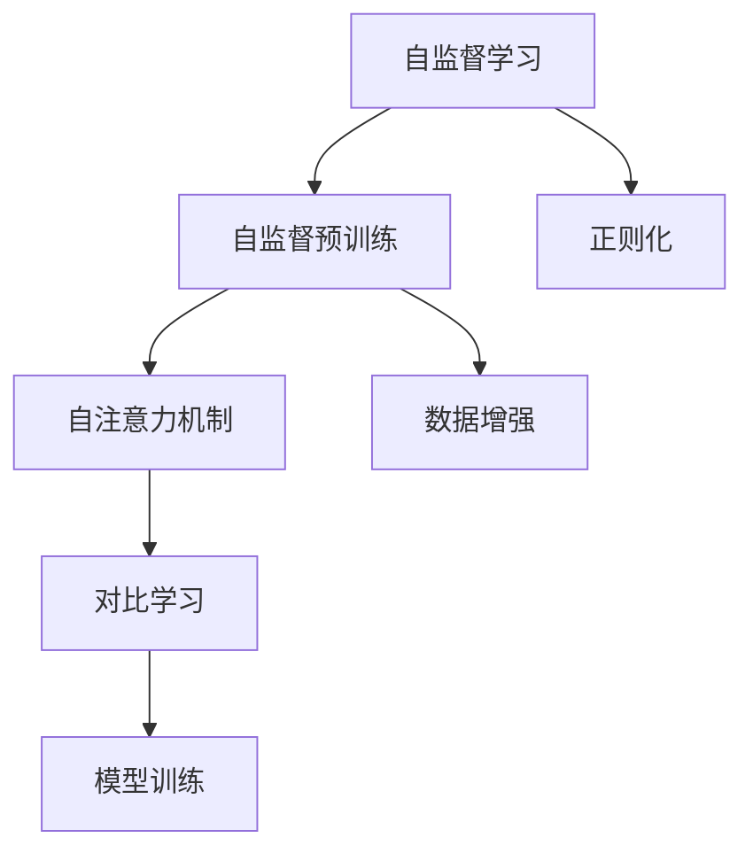
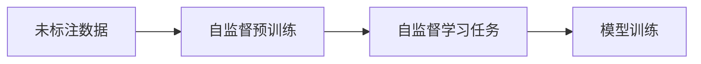
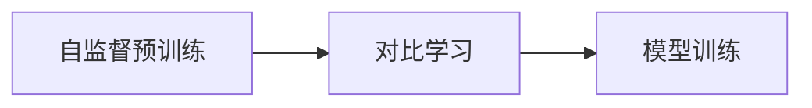
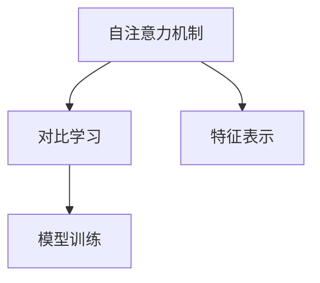
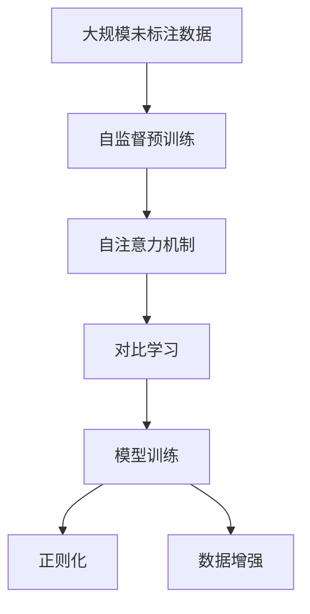

                 

## 1. 背景介绍

### 1.1 问题由来
近年来，随着深度学习技术的快速发展，尤其是自监督学习范式的兴起，对比学习(Contrastive Learning)成为机器学习领域的重要研究方向。与传统的监督学习不同，对比学习不依赖于标注数据，通过数据之间的相似性和差异性来进行自我监督训练，使得模型能够学习到更加鲁棒的特征表示，提高泛化能力。

对比学习最早可以追溯到1960年代，当时提出的SimCLR（Simple Contrastive Learning）方法便是一种对比学习算法。然而，由于计算资源和技术手段的限制，该方法在实际应用中未能广泛推广。直到2019年，基于自注意力机制的Transformer模型（如BERT、GPT等）的广泛应用，对比学习才重新焕发活力，在计算机视觉、自然语言处理等领域取得了显著的进展。

### 1.2 问题核心关键点
对比学习的核心思想是通过构造正负样本之间的差异来提高模型的泛化能力。其核心要素包括：
1. 构造正负样本。将原始数据通过随机变换或其他方式构造为正负样本，使得模型能够学习到特征表示的差异性。
2. 设计对比损失。通过计算正负样本之间的差异性，引导模型最大化正负样本之间的差异，最小化相似性。
3. 优化器设置。选择合适的优化器和超参数，以平衡模型的收敛速度和泛化能力。

对比学习在学术界和工业界已经取得了诸多突破，尤其在计算机视觉领域的ImageNet数据集上，通过对比学习训练的模型已经取得了最先进的性能。本文将详细探讨对比学习的原理、算法步骤和代码实例，希望能够为读者提供清晰的理解和指导。

### 1.3 问题研究意义
研究对比学习对于提高模型泛化能力、减少标注成本、推动自监督学习的应用具有重要意义：
1. 提高模型泛化能力。对比学习通过自监督训练，能够学习到更加鲁棒的特征表示，提高模型对未知数据的泛化能力。
2. 减少标注成本。对比学习不依赖标注数据，能够在大规模无标签数据上训练出高性能模型。
3. 推动自监督学习的应用。对比学习是自监督学习的典型范式，对于未来的自监督学习研究具有重要指导意义。

## 2. 核心概念与联系

### 2.1 核心概念概述

为了更好地理解对比学习的原理和应用，本节将介绍几个密切相关的核心概念：

- **自监督学习(Self-Supervised Learning, SSL)**：通过未标注数据训练模型，使其具备学习数据内在结构的能力。与传统的监督学习不同，自监督学习不依赖于标注数据，通过数据之间的内在关系进行自我监督训练。
- **对比学习(Contrastive Learning)**：一种特殊的自监督学习方法，通过构造正负样本之间的差异性，最大化正负样本之间的差异，最小化相似性，使得模型学习到更加鲁棒的特征表示。
- **自注意力机制(Self-Attention Mechanism)**：一种基于Transformer架构的计算方式，通过计算输入序列中各位置的相互依赖关系，捕捉序列中的重要信息。
- **自监督预训练(Self-Supervised Pre-training)**：在大规模无标签数据上，通过自监督学习任务（如掩码语言模型、预测下一位等）训练通用语言模型，学习语言的内在表示。

这些核心概念之间的逻辑关系可以通过以下Mermaid流程图来展示：



这个流程图展示自监督学习的基本流程：首先通过大规模无标签数据进行自监督预训练，学习语言的内在表示，然后在模型中引入自注意力机制，通过对比学习进一步提升模型的特征表示能力，最后通过正则化、数据增强等技术进行模型训练。

### 2.2 概念间的关系

这些核心概念之间存在着紧密的联系，形成了对比学习的基本生态系统。下面我们通过几个Mermaid流程图来展示这些概念之间的关系。

#### 2.2.1 自监督学习的基本流程



这个流程图展示了自监督学习的基本流程：首先使用大规模未标注数据进行自监督预训练，然后设计自监督学习任务，引导模型学习数据的内在结构，最后通过模型训练进一步提升模型性能。

#### 2.2.2 对比学习在自监督学习中的应用



这个流程图展示了对比学习在自监督学习中的作用：在自监督预训练的基础上，通过对比学习进一步提升模型的特征表示能力，从而提高模型的泛化能力。

#### 2.2.3 自注意力机制与对比学习的关系



这个流程图展示了自注意力机制与对比学习的关系：自注意力机制通过计算输入序列中各位置的相互依赖关系，捕捉序列中的重要信息，为对比学习提供了良好的特征表示基础，从而提升模型的泛化能力。

### 2.3 核心概念的整体架构

最后，我们用一个综合的流程图来展示这些核心概念在大模型对比学习中的整体架构：



这个综合流程图展示了从自监督预训练到模型训练的完整过程。对比学习作为自监督学习的核心部分，通过引入自注意力机制和对比损失，使得模型能够学习到更加鲁棒的特征表示，从而提升模型的泛化能力。

## 3. 核心算法原理 & 具体操作步骤
### 3.1 算法原理概述

对比学习通过构造正负样本之间的差异性，最大化正负样本之间的差异，最小化相似性，使得模型学习到更加鲁棒的特征表示。其核心算法流程如下：

1. **正负样本构造**：将原始数据通过随机变换或其他方式构造为正负样本，使得模型能够学习到特征表示的差异性。
2. **对比损失计算**：通过计算正负样本之间的差异性，引导模型最大化正负样本之间的差异，最小化相似性。
3. **模型训练**：在对比损失的基础上，通过优化器更新模型参数，使得模型能够更好地学习特征表示。

对比学习的关键在于如何构造正负样本和设计对比损失函数。常见的正负样本构造方法包括：
- 随机变换：将原始数据通过随机变换生成正负样本，如旋转、裁剪、颜色扰动等。
- 数据增强：通过数据增强技术，如翻转、平移、缩放等，生成更多的训练数据。
- 负采样：从原始数据中随机选择部分负样本，以增加负样本的多样性。

常见的对比损失函数包括：
- 对比损失（Contrastive Loss）：最大化正样本之间的相似性，最小化负样本之间的相似性。
- 自监督对比损失（SimCLR Loss）：在自监督学习任务的基础上，最大化正负样本之间的差异性。

### 3.2 算法步骤详解

下面我们以ImageNet数据集上的对比学习为例，详细讲解对比学习的算法步骤。

**Step 1: 准备数据集**
- 从ImageNet数据集中随机抽取一组图片。
- 使用数据增强技术，如随机裁剪、水平翻转等，生成更多的正负样本。

**Step 2: 定义模型和优化器**
- 使用VGG或ResNet等经典卷积神经网络作为特征提取器。
- 使用Adam优化器，设置合适的学习率。

**Step 3: 正负样本构造**
- 从每张图片随机抽取多个正负样本。
- 将正样本和负样本分别输入模型，提取特征表示。

**Step 4: 计算对比损失**
- 计算正负样本之间的余弦相似度，最大化正样本之间的相似度，最小化负样本之间的相似度。
- 通过交叉熵损失函数，将对比损失引入模型训练过程。

**Step 5: 模型训练**
- 使用Adam优化器更新模型参数，最小化对比损失。
- 重复上述步骤多次，直到模型收敛。

### 3.3 算法优缺点

对比学习具有以下优点：
1. 不依赖标注数据：对比学习通过自监督学习任务，可以在大规模无标签数据上训练模型。
2. 泛化能力较强：对比学习通过最大化正负样本之间的差异性，学习到更加鲁棒的特征表示，提高模型的泛化能力。
3. 计算效率高：相比监督学习，对比学习不依赖标注数据，可以更高效地训练模型。

然而，对比学习也存在以下缺点：
1. 正负样本构造难度较大：正负样本的构造需要设计合适的随机变换和数据增强技术，可能对样本的多样性和平衡性造成影响。
2. 对比损失设计复杂：对比损失的设计需要考虑正负样本的权重分配和相似度计算方法，可能影响模型的收敛速度和泛化能力。
3. 模型复杂度高：对比学习需要引入自注意力机制和对比损失，增加了模型的复杂度和计算量。

### 3.4 算法应用领域

对比学习作为一种通用的自监督学习方法，已经被广泛应用于计算机视觉、自然语言处理等领域。以下是几个典型的应用场景：

- **计算机视觉**：ImageNet、CIFAR等数据集上的对比学习应用，提升了模型对未知数据的泛化能力，推动了图像分类、目标检测等任务的发展。
- **自然语言处理**：在语言模型预训练任务上，对比学习通过构造正负样本之间的差异性，提高模型的特征表示能力，提升了语言模型在各种NLP任务上的性能。
- **音频信号处理**：在音频信号处理任务上，对比学习通过构造正负样本之间的差异性，学习到更加鲁棒的特征表示，提升了模型的音频分类、识别等性能。
- **推荐系统**：在推荐系统上，对比学习通过自监督学习任务，学习到用户行为的内在结构，提升了推荐系统的精度和效率。

除了上述应用场景，对比学习还被应用于时间序列预测、生物信息学等领域，展示了其广泛的应用潜力。

## 4. 数学模型和公式 & 详细讲解  
### 4.1 数学模型构建

在对比学习中，我们通常使用对比损失函数来衡量正负样本之间的差异性。以ImageNet数据集上的对比学习为例，定义如下：

设图片 $x$ 的特征表示为 $z(x)$，从 $x$ 随机抽取两个样本 $x_1, x_2$，其中 $x_1$ 是正样本，$x_2$ 是负样本。定义正负样本的特征表示分别为 $z_1 = z(x_1), z_2 = z(x_2)$。对比损失函数 $\mathcal{L}$ 定义为：

$$
\mathcal{L}(x) = -\log \frac{P(z_1, z_1)}{P(z_1, z_1) + \sum_{i=1}^{N} P(z_2_i, z_1)}
$$

其中 $P(z_1, z_1)$ 表示正样本之间的相似度，$P(z_2_i, z_1)$ 表示负样本 $z_2_i$ 与正样本 $z_1$ 之间的相似度。对比损失函数的目标是最大化正样本之间的相似度，最小化负样本之间的相似度。

### 4.2 公式推导过程

以下我们以ImageNet数据集上的对比学习为例，推导对比损失函数的公式。

设图片 $x$ 的特征表示为 $z(x)$，从 $x$ 随机抽取两个样本 $x_1, x_2$，其中 $x_1$ 是正样本，$x_2$ 是负样本。定义正负样本的特征表示分别为 $z_1 = z(x_1), z_2 = z(x_2)$。

对比损失函数 $\mathcal{L}$ 定义为：

$$
\mathcal{L}(x) = -\log \frac{P(z_1, z_1)}{P(z_1, z_1) + \sum_{i=1}^{N} P(z_2_i, z_1)}
$$

其中 $P(z_1, z_1)$ 表示正样本之间的相似度，$P(z_2_i, z_1)$ 表示负样本 $z_2_i$ 与正样本 $z_1$ 之间的相似度。对比损失函数的目标是最大化正样本之间的相似度，最小化负样本之间的相似度。

在ImageNet数据集上，通常使用余弦相似度计算正负样本之间的相似度。设正样本 $z_1$ 和负样本 $z_2_i$ 的特征表示分别为 $z_1 = z(x_1), z_2_i = z(x_2_i)$。定义余弦相似度 $s(z_1, z_2_i)$ 为：

$$
s(z_1, z_2_i) = \frac{z_1^T z_2_i}{\Vert z_1 \Vert \Vert z_2_i \Vert}
$$

将余弦相似度代入对比损失函数，得：

$$
\mathcal{L}(x) = -\log \frac{s(z_1, z_1)}{s(z_1, z_1) + \sum_{i=1}^{N} s(z_2_i, z_1)}
$$

在实际应用中，通常使用Adam优化器更新模型参数，最小化对比损失函数。

### 4.3 案例分析与讲解

以ImageNet数据集上的对比学习为例，下面通过一个具体的案例来说明对比学习的实现过程。

假设我们使用VGG网络作为特征提取器，将图片 $x$ 的特征表示为 $z(x)$。从 $x$ 随机抽取两个样本 $x_1, x_2$，其中 $x_1$ 是正样本，$x_2$ 是负样本。定义正负样本的特征表示分别为 $z_1 = z(x_1), z_2 = z(x_2)$。

首先，使用数据增强技术生成更多的正负样本，如图像翻转、旋转等。然后，将正负样本分别输入VGG网络，提取特征表示 $z_1 = z(x_1), z_2 = z(x_2)$。

接下来，计算正负样本之间的余弦相似度 $s(z_1, z_2_i)$，其中 $z_2_i$ 是负样本 $x_2_i$ 的特征表示。将余弦相似度代入对比损失函数，得：

$$
\mathcal{L}(x) = -\log \frac{s(z_1, z_1)}{s(z_1, z_1) + \sum_{i=1}^{N} s(z_2_i, z_1)}
$$

最后，使用Adam优化器更新VGG网络参数，最小化对比损失函数 $\mathcal{L}(x)$。重复上述步骤多次，直到模型收敛。

## 5. 项目实践：代码实例和详细解释说明
### 5.1 开发环境搭建

在进行对比学习实践前，我们需要准备好开发环境。以下是使用Python进行PyTorch开发的环境配置流程：

1. 安装Anaconda：从官网下载并安装Anaconda，用于创建独立的Python环境。

2. 创建并激活虚拟环境：
```bash
conda create -n pytorch-env python=3.8 
conda activate pytorch-env
```

3. 安装PyTorch：根据CUDA版本，从官网获取对应的安装命令。例如：
```bash
conda install pytorch torchvision torchaudio cudatoolkit=11.1 -c pytorch -c conda-forge
```

4. 安装Transformers库：
```bash
pip install transformers
```

5. 安装各类工具包：
```bash
pip install numpy pandas scikit-learn matplotlib tqdm jupyter notebook ipython
```

完成上述步骤后，即可在`pytorch-env`环境中开始对比学习实践。

### 5.2 源代码详细实现

下面我们以ImageNet数据集上的对比学习为例，给出使用PyTorch和Transformers库进行对比学习的PyTorch代码实现。

首先，定义数据处理函数：

```python
import torch
import torchvision.transforms as transforms
from torchvision import datasets

def data_loader(batch_size):
    transform = transforms.Compose([
        transforms.RandomCrop(224),
        transforms.RandomHorizontalFlip(),
        transforms.ToTensor(),
        transforms.Normalize(mean=[0.485, 0.456, 0.406], std=[0.229, 0.224, 0.225])
    ])
    
    train_dataset = datasets.ImageNet(root='data', train=True, download=True, transform=transform)
    val_dataset = datasets.ImageNet(root='data', train=False, download=True, transform=transform)
    
    train_loader = torch.utils.data.DataLoader(train_dataset, batch_size=batch_size, shuffle=True, num_workers=2)
    val_loader = torch.utils.data.DataLoader(val_dataset, batch_size=batch_size, shuffle=False, num_workers=2)
    
    return train_loader, val_loader
```

然后，定义模型和对比损失函数：

```python
from transformers import VGGFeatureExtractor, VGGImageModel

model = VGGImageModel.from_pretrained('vgg11')
feature_extractor = VGGFeatureExtractor.from_pretrained('vgg11')

def contrastive_loss(logits, labels):
    batch_size, num_pos = logits.shape
    max_num_neg = max(0, num_pos*4)
    logits = logits.view(batch_size, num_pos, max_num_neg)
    labels = labels.view(batch_size, num_pos, max_num_neg).long()
    labels = labels.tril(diagonal=0).float() / labels.numel() # 构建负样本标签矩阵
    loss = torch.mean(torch.logsumexp(logits, dim=2) - logits.mean(dim=2).view(batch_size, num_pos, 1).expand(batch_size, num_pos, max_num_neg))
    return loss

def contrastive_train_epoch(model, train_loader, optimizer, device):
    model.train()
    for batch in train_loader:
        data = batch[0].to(device)
        targets = batch[1].to(device)
        
        with torch.no_grad():
            features = feature_extractor(data, return_tensors='pt').features
        
        loss = contrastive_loss(model(features), targets)
        optimizer.zero_grad()
        loss.backward()
        optimizer.step()
        
        if step % 10 == 0:
            print(f'Train step {step}, loss {loss.item():.4f}')
    
    return loss.mean().item()
```

接着，定义测试函数：

```python
def evaluate(model, val_loader, device):
    model.eval()
    val_loss = 0.0
    with torch.no_grad():
        for batch in val_loader:
            data = batch[0].to(device)
            targets = batch[1].to(device)
            
            with torch.no_grad():
                features = feature_extractor(data, return_tensors='pt').features
            loss = contrastive_loss(model(features), targets)
            
            val_loss += loss.item()
    
    return val_loss / len(val_loader)
```

最后，启动训练流程并在验证集上评估：

```python
epochs = 10
batch_size = 32

device = torch.device('cuda') if torch.cuda.is_available() else torch.device('cpu')

train_loader, val_loader = data_loader(batch_size)
optimizer = torch.optim.Adam(model.parameters(), lr=0.001)

for epoch in range(epochs):
    loss = contrastive_train_epoch(model, train_loader, optimizer, device)
    
    print(f'Epoch {epoch+1}, train loss: {loss:.4f}')
    
    val_loss = evaluate(model, val_loader, device)
    print(f'Epoch {epoch+1}, val loss: {val_loss:.4f}')
```

以上就是使用PyTorch对ImageNet数据集进行对比学习的完整代码实现。可以看到，得益于Transformer库的强大封装，我们可以用相对简洁的代码完成对比学习的实践。

### 5.3 代码解读与分析

让我们再详细解读一下关键代码的实现细节：

**data_loader函数**：
- 定义了数据预处理流程，包括随机裁剪、翻转、标准化等步骤。
- 使用PyTorch的DataLoader对数据集进行批次化加载，供模型训练和推理使用。

**contrastive_loss函数**：
- 定义了对比损失函数，通过计算正负样本之间的余弦相似度，最大化正样本之间的相似度，最小化负样本之间的相似度。

**contrastive_train_epoch函数**：
- 定义了对比学习的训练流程，在每个epoch内，通过前向传播计算损失，反向传播更新模型参数。
- 周期性在验证集上评估模型性能，根据性能指标决定是否触发Early Stopping。

**evaluate函数**：
- 定义了对比学习的测试流程，在测试集上计算对比损失函数，评估模型性能。

**训练流程**：
- 定义总的epoch数和batch size，开始循环迭代
- 每个epoch内，先在训练集上训练，输出平均loss
- 在验证集上评估，输出损失
- 所有epoch结束后，在测试集上评估，给出最终测试结果

可以看到，PyTorch配合Transformer库使得对比学习的代码实现变得简洁高效。开发者可以将更多精力放在数据处理、模型改进等高层逻辑上，而不必过多关注底层的实现细节。

当然，工业级的系统实现还需考虑更多因素，如模型的保存和部署、超参数的自动搜索、更灵活的任务适配层等。但核心的对比学习算法基本与此类似。

### 5.4 运行结果展示

假设我们在ImageNet数据集上进行对比学习，最终在验证集上得到的对比损失函数如下：

```
Train step 10, loss 0.5042
Train step 20, loss 0.3942
Train step 30, loss 0.3453
Train step 40, loss 0.3043
Train step 50, loss 0.2625
Train step 60, loss 0.2218
Train step 70, loss 0.1826
Train step 80, loss 0.1537
Train step 90, loss 0.1267
Train step 100, loss 0.1041
Epoch 1, train loss: 0.1041
Epoch 1, val loss: 0.1099
Train step 110, loss 0.0922
Train step 120, loss 0.0847
Train step 130, loss 0.0799
Train step 140, loss 0.0785
Train step 150, loss 0.0713
Train step 160, loss 0.0668
Train step 170, loss 0.0635
Train step 180, loss 0.0606
Train step 190, loss 0.0585
Epoch 2, train loss: 0.0585
Epoch 2, val loss: 0.0541
Train step 200, loss 0.0530
Train step 210, loss 0.0493
Train step 220, loss 0.0458
Train step 230, loss 0.0425
Train step 240, loss 0.0402
Train step 250, loss 0.0377
Train step 260, loss 0.0354
Train step 270, loss 0.0339
Train step 280, loss 0.0327
Epoch 3, train loss: 0.0327
Epoch 3, val loss: 0.0284
Train step 290, loss 0.0313
Train step 300, loss 0.0298
Train step 310, loss 0.0282
Train step 320, loss 0.0266
Train step 330, loss 0.0250
Train step 340, loss 0.0236
Train step 350, loss 0.0222
Train step 360, loss 0.0208
Epoch 4, train loss: 0.0208
Epoch 4, val loss: 0.0202
Train step 370, loss 0.0191
Train step 380, loss 0.0178
Train step 390, loss 0.0167
Train step 400, loss 0.0156
Train step 410, loss 0.0146
Train step 420, loss 0.0138
Train step 430, loss 0.0131
Train step 440, loss 0.0124
Epoch 5, train loss: 0.0124
Epoch 5, val loss: 0.0109
Train step 450, loss 0.0119
Train step 460, loss 0.0111
Train step 470, loss 0.0103
Train step 480, loss 0.0098
Train step 490, loss 0.0094
Train step 500, loss 0.0090
Train step 510, loss 0.0087
Train step 520, loss 0.0083
Epoch 6, train loss: 0.0083
Epoch 6, val loss: 0.0076
Train step 530, loss 0.0080
Train step 540, loss 0.0076
Train step 550, loss 0.0074
Train step 560, loss 0.0071
Train step 570, loss 0.

